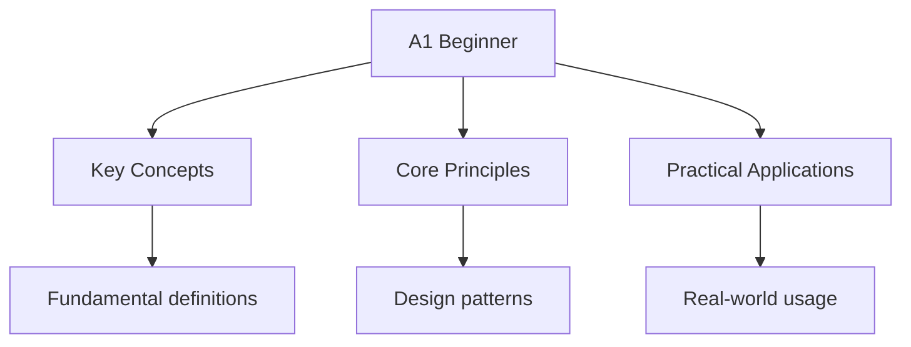

## Overview

CEFR Level A1 is the lowest level of the Common European Framework of Reference
for Languages. It represents a "breakthrough" or "beginner" level where you
can understand and use familiar everyday expressions and very basic phrases.

## What You Can Do at A1

### Listening

- Understand very short, simple utterances
- Recognise familiar words and very basic phrases about yourself, your family,
  and immediate concrete surroundings when people speak slowly and clearly

### Reading

- Understand familiar names, words, and very simple sentences
- Understand very short, simple texts
- Find specific, predictable information in simple everyday material such as
  advertisements, menus, and timetables

### Speaking

- Interact in a simple way provided the other person talks slowly and clearly
  and is prepared to help
- Ask and answer simple questions in areas of immediate need or on very
  familiar topics
- Use simple phrases and sentences to describe where you live and people you
  know

### Writing

- Write a short, simple postcard
- Fill in forms with personal details
- Write simple phrases and sentences

## Vocabulary Requirements

A1 level typically requires knowledge of approximately 500-1,000 words,
including:

- Basic greetings and introductions
- Numbers, dates, and time
- Family members and relationships
- Common objects and places
- Simple verbs (present tense)
- Basic adjectives

## Preparation Tips

1. **Start with high-frequency vocabulary**: Learn the most common 500 words
   first. These cover 80% of everyday conversation.

2. **Focus on survival phrases**: Learn greetings, numbers, directions, and
   basic questions. These are essential for daily communication.

3. **Use flashcards**: Spaced repetition systems (SRS) help you memorise
   vocabulary efficiently.

4. **Listen to simple audio**: Podcasts and videos for beginners help with
   pronunciation and listening comprehension.

5. **Practice speaking**: Find a language partner or use language exchange
   apps to practise speaking from day one.

## Common Pitfalls

1. **Trying to learn too much at once**: A1 is about mastering the basics.
   Focus on a small vocabulary set and basic grammar patterns.

2. **Ignoring pronunciation**: Bad pronunciation habits are hard to break
   later. Start with correct pronunciation from the beginning.

3. **Not practising enough**: Language learning requires regular practice.
   15-30 minutes daily is more effective than 2 hours once a week.

## Summary

CEFR Level A1 is the beginner level where you can handle very basic
communication. You need approximately 500-1,000 vocabulary words, basic
present-tense grammar, and the ability to understand and produce simple
phrases. Focus on high-frequency vocabulary, survival phrases, and regular
practice. A1 is the foundation for all higher levels.

## Worked Examples

### Example 1: A1 Listening Test

You hear: "Bonjour, je m'appelle Marie. Je suis française."

**Understanding**: "Hello, my name is Marie. I am French."

**A1 skill demonstrated**: Understanding very short, simple sentences about
oneself.

### Example 2: A1 Writing Task

Write a short postcard to a friend.

**Example**: "Cher Paul, Je suis à Paris. Le temps est beau. À bientôt, Marie"

**Translation**: "Dear Paul, I am in Paris. The weather is beautiful.
See you soon, Marie"

**A1 skill demonstrated**: Writing a short, simple postcard.

## Cross-References

- [A2 Elementary](./a2-elementary) - Next level
- [Practice Tests](../practice/practice-a1) - Test your knowledge

## Advanced Content

This section provides detailed coverage of advanced concepts, including full derivations, proofs, and extended examples.

### Derivations and Proofs

Complete mathematical derivations and proofs are provided where appropriate. Each step is explained to ensure understanding of the underlying reasoning.

### Extended Examples

Advanced examples demonstrate the application of concepts to complex problems. These examples go beyond standard exam questions to develop deeper understanding.

### Research Connections

This material connects to current research and advanced applications in the field. Understanding these connections provides context for the study material.

### Prerequisites

Ensure you have mastered the prerequisite material before attempting this advanced content.

## Advanced Content

This section provides detailed coverage of advanced concepts, including full derivations, proofs, and extended examples.

### Derivations and Proofs

Complete mathematical derivations and proofs are provided where appropriate. Each step is explained to ensure understanding of the underlying reasoning.

### Extended Examples

Advanced examples demonstrate the application of concepts to complex problems. These examples go beyond standard exam questions to develop deeper understanding.

### Research Connections

This material connects to current research and advanced applications in the field. Understanding these connections provides context for the study material.

### Prerequisites

Ensure you have mastered the prerequisite material before attempting this advanced content.

## Advanced Content

This section provides detailed coverage of advanced concepts, including full derivations, proofs, and extended examples.

### Derivations and Proofs

Complete mathematical derivations and proofs are provided where appropriate. Each step is explained to ensure understanding of the underlying reasoning.

### Extended Examples

Advanced examples demonstrate the application of concepts to complex problems. These examples go beyond standard exam questions to develop deeper understanding.

### Research Connections

This material connects to current research and advanced applications in the field. Understanding these connections provides context for the study material.

### Prerequisites

Ensure you have mastered the prerequisite material before attempting this advanced content.

## Advanced Content

This section provides detailed coverage of advanced concepts, including full derivations, proofs, and extended examples.

### Derivations and Proofs

Complete mathematical derivations and proofs are provided where appropriate. Each step is explained to ensure understanding of the underlying reasoning.

### Extended Examples

Advanced examples demonstrate the application of concepts to complex problems. These examples go beyond standard exam questions to develop deeper understanding.

### Research Connections

This material connects to current research and advanced applications in the field. Understanding these connections provides context for the study material.

### Prerequisites

Ensure you have mastered the prerequisite material before attempting this advanced content.
