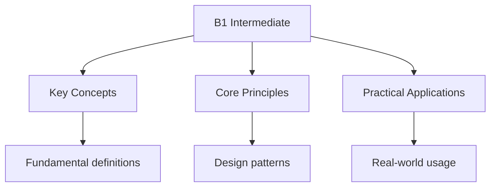

# B1 Intermediate Level

## Overview

The B1 level is the third level of CEFR. At this level, you can deal with most situations likely to arise while travelling and produce connected text on familiar topics.

## What You Can Do

### Listening

- Understand the main points of clear standard speech
- Understand radio or TV programmes on familiar topics
- Understand the main point of many radio or TV programmes

### Reading

- Understand texts that consist mainly of high-frequency everyday language
- Understand the description of events, feelings, and wishes in personal letters
- Understand articles and reports concerned with contemporary problems

### Speaking

- Deal with most situations likely to arise whilst travelling
- Enter unprepared into conversation on familiar topics
- Connect phrases in a simple way
- Describe experiences and events, dreams, hopes, and ambitions
- Briefly give reasons and explanations for opinions and plans

### Writing

- Write simple connected text on topics which are familiar
- Write personal letters describing experiences and impressions
- Write short, simple notes and messages

## Vocabulary Topics

### Education and Work

- Job applications
- Work responsibilities
- Training and courses

### Media and Culture

- Newspaper articles
- TV programmes
- Cultural events

### Abstract Topics

- Opinions and arguments
- Hypothetical situations
- Future plans

### Travel and Experiences

- Travel stories
- Describing places
- Cultural differences

## Grammar Points

### Conditionals

- Zero conditional (general truths)
- First conditional (real future)
- Second conditional (hypothetical present)

### Passive Voice

- Present simple passive
- Past simple passive
- Future passive

### Reported Speech

- Statements
- Questions
- Commands

### Linking Words

- Although, despite, however
- Because, since, as
- Therefore, consequently

## Practice Exercises

### Exercise 1: Opinion Writing

Write a paragraph giving your opinion on: "Should school uniforms be mandatory?"

### Exercise 2: Travel Story

Write about a memorable trip you took. Include:

- Where you went
- What you did
- How you felt

### Exercise 3: Job Application

Write a cover letter for a job application:

- Why you're interested
- Your relevant experience
- Your availability

## Exam Tips

1. **Read news articles** - Good for vocabulary and structure
2. **Watch TV with subtitles** - Helps with listening
3. **Keep a journal** - Practice writing regularly
4. **Have conversations** - Find a language partner
5. **Use linking words** - Makes your writing more connected

## See Also

- [Cefr Levels](./)
- [B2 Upper Intermediate Level](./b2-upper-intermediate)
- [A1 Beginner](./a1-beginner)

## Advanced Content

This section provides detailed coverage of advanced concepts, including full derivations, proofs, and extended examples.

### Derivations and Proofs

Complete mathematical derivations and proofs are provided where appropriate. Each step is explained to ensure understanding of the underlying reasoning.

### Extended Examples

Advanced examples demonstrate the application of concepts to complex problems. These examples go beyond standard exam questions to develop deeper understanding.

### Research Connections

This material connects to current research and advanced applications in the field. Understanding these connections provides context for the study material.

### Prerequisites

Ensure you have mastered the prerequisite material before attempting this advanced content.

## Advanced Content

This section provides detailed coverage of advanced concepts, including full derivations, proofs, and extended examples.

### Derivations and Proofs

Complete mathematical derivations and proofs are provided where appropriate. Each step is explained to ensure understanding of the underlying reasoning.

### Extended Examples

Advanced examples demonstrate the application of concepts to complex problems. These examples go beyond standard exam questions to develop deeper understanding.

### Research Connections

This material connects to current research and advanced applications in the field. Understanding these connections provides context for the study material.

### Prerequisites

Ensure you have mastered the prerequisite material before attempting this advanced content.

## Advanced Content

This section provides detailed coverage of advanced concepts, including full derivations, proofs, and extended examples.

### Derivations and Proofs

Complete mathematical derivations and proofs are provided where appropriate. Each step is explained to ensure understanding of the underlying reasoning.

### Extended Examples

Advanced examples demonstrate the application of concepts to complex problems. These examples go beyond standard exam questions to develop deeper understanding.

### Research Connections

This material connects to current research and advanced applications in the field. Understanding these connections provides context for the study material.

### Prerequisites

Ensure you have mastered the prerequisite material before attempting this advanced content.

## Advanced Content

This section provides detailed coverage of advanced concepts, including full derivations, proofs, and extended examples.

### Derivations and Proofs

Complete mathematical derivations and proofs are provided where appropriate. Each step is explained to ensure understanding of the underlying reasoning.

### Extended Examples

Advanced examples demonstrate the application of concepts to complex problems. These examples go beyond standard exam questions to develop deeper understanding.

### Research Connections

This material connects to current research and advanced applications in the field. Understanding these connections provides context for the study material.

### Prerequisites

Ensure you have mastered the prerequisite material before attempting this advanced content.
