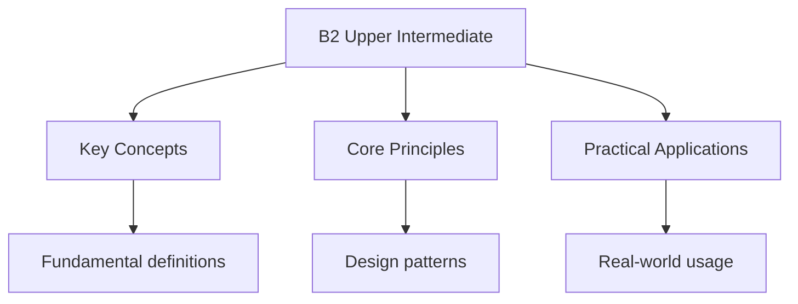

# B2 Upper Intermediate Level

## Overview

The B2 level is the fourth level of CEFR. At this level, you can interact with a degree of fluency and spontaneity that makes regular interaction with native speakers quite possible.

## What You Can Do

### Listening

- Understand extended speech and lectures
- Follow even complex lines of argument provided the topic is reasonably familiar
- Understand most TV news, current affairs programmes, and films

### Reading

- Read articles and reports concerned with contemporary problems
- Understand contemporary literary prose
- Recognise the line of argument in the treatment of the issue presented

### Speaking

- Interact with native speakers with a degree of fluency and spontaneity
- Present clear, detailed descriptions on a wide range of subjects
- Explain a viewpoint on a topical issue giving the advantages and disadvantages
- Develop an argument systematically with appropriate highlighting of significant points

### Writing

- Write clear, detailed text on a wide range of subjects
- Write an essay or report, passing on information or giving reasons in support of or against a particular point of view
- Write letters highlighting the personal significance of events and experiences

## Vocabulary Topics

### Academic Language

- Abstract concepts
- Technical terminology
- Formal register

### Professional Communication

- Meetings and negotiations
- Presentations
- Written reports

### Current Affairs

- Social issues
- Environmental concerns
- Economic topics

### Cultural Literature

- Literary references
- Idiomatic expressions
- Collocations

## Grammar Points

### Advanced Conditionals

- Third conditional (past hypothetical)
- Mixed conditionals
- Inversion for emphasis

### Advanced Tenses

- Perfect continuous tenses
- Future perfect
- Narrative tenses

### Modality

- Deduction and speculation
- Obligation and necessity
- Past modals

### Discourse Markers

- Formal connectors
- Hedging language
- Emphasis structures

## Practice Exercises

### Exercise 1: Essay Writing

Write a 250-word essay on: "The impact of technology on education"

### Exercise 2: Debate Preparation

Prepare arguments for and against: "University education should be free"

### Exercise 3: Report Writing

Write a report on a workplace issue, including:

- Problem description
- Analysis of causes
- Recommended solutions

## Exam Tips

1. **Read academic articles** - Builds vocabulary
2. **Watch documentaries** - Good for listening
3. **Practice presentations** - Improves speaking
4. **Write formal emails** - Practices register
5. **Use collocations** - Sounds more natural

## See Also

- [Cefr Levels](./)
- [B1 Intermediate Level](./b1-intermediate)
- [A1 Beginner](./a1-beginner)

## Advanced Content

This section provides detailed coverage of advanced concepts, including full derivations, proofs, and extended examples.

### Derivations and Proofs

Complete mathematical derivations and proofs are provided where appropriate. Each step is explained to ensure understanding of the underlying reasoning.

### Extended Examples

Advanced examples demonstrate the application of concepts to complex problems. These examples go beyond standard exam questions to develop deeper understanding.

### Research Connections

This material connects to current research and advanced applications in the field. Understanding these connections provides context for the study material.

### Prerequisites

Ensure you have mastered the prerequisite material before attempting this advanced content.

## Advanced Content

This section provides detailed coverage of advanced concepts, including full derivations, proofs, and extended examples.

### Derivations and Proofs

Complete mathematical derivations and proofs are provided where appropriate. Each step is explained to ensure understanding of the underlying reasoning.

### Extended Examples

Advanced examples demonstrate the application of concepts to complex problems. These examples go beyond standard exam questions to develop deeper understanding.

### Research Connections

This material connects to current research and advanced applications in the field. Understanding these connections provides context for the study material.

### Prerequisites

Ensure you have mastered the prerequisite material before attempting this advanced content.

## Advanced Content

This section provides detailed coverage of advanced concepts, including full derivations, proofs, and extended examples.

### Derivations and Proofs

Complete mathematical derivations and proofs are provided where appropriate. Each step is explained to ensure understanding of the underlying reasoning.

### Extended Examples

Advanced examples demonstrate the application of concepts to complex problems. These examples go beyond standard exam questions to develop deeper understanding.

### Research Connections

This material connects to current research and advanced applications in the field. Understanding these connections provides context for the study material.

### Prerequisites

Ensure you have mastered the prerequisite material before attempting this advanced content.

## Advanced Content

This section provides detailed coverage of advanced concepts, including full derivations, proofs, and extended examples.

### Derivations and Proofs

Complete mathematical derivations and proofs are provided where appropriate. Each step is explained to ensure understanding of the underlying reasoning.

### Extended Examples

Advanced examples demonstrate the application of concepts to complex problems. These examples go beyond standard exam questions to develop deeper understanding.

### Research Connections

This material connects to current research and advanced applications in the field. Understanding these connections provides context for the study material.

### Prerequisites

Ensure you have mastered the prerequisite material before attempting this advanced content.
