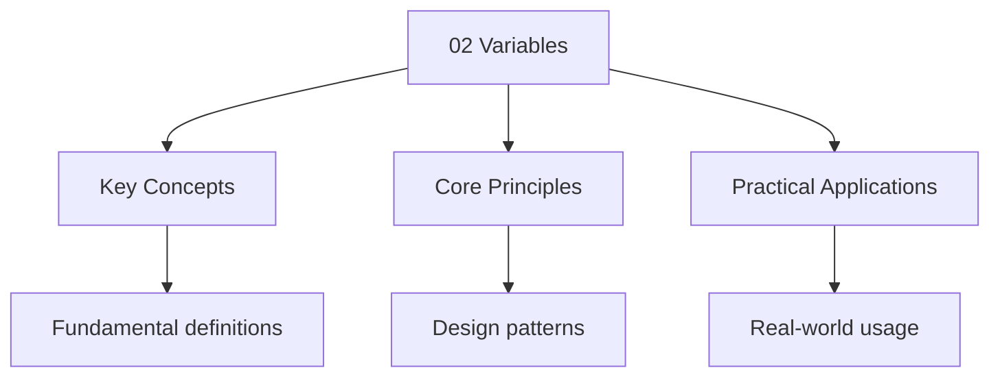

---

title: "Variables | Languages - Wyatt's Notes"
description: "Flutter is statically type, therefore, all types are evaluated at compile time,  Comprehensive educational content coverage with definitions and practice proble"
date: 2025-07-13T20:44:32.129Z
tags:
  - dart
categories:
  - dart

---

<!-- Breadcrumb Schema for SEO -->
<script type="application/ld+json">
{
  "@context": "https://schema.org",
  "@type": "BreadcrumbList",
  "itemListElement": [{"name": "Home", "url": "https://wyattau.com"}, {"name": "languages", "url": "https://languages.wyattau.com"}, {"name": "Dart", "url": "https://languages.wyattau.com/dart"}, {"name": "03 Basics", "url": "https://languages.wyattau.com/dart/03-basics"}, {"name": "02 Variables", "url": "https://languages.wyattau.com/dart/03-basics/02-variables"}]
}
</script>

## Specifiers

### Types

Flutter is statically type, therefore, all types are evaluated at compile time, this can be
Explicitly defined as:

```dart
String text = "hello";
int number = 22;
```

However, Flutter also provides a implicit declaration (`var`) that can be determined by compiler, an
Example being:

```dart
var text = "hello";
var number = 22;
```

Another way of implicit definition is declaring as `Object` class, since all types in Dart inherits
From the `Object` type, implicit definitions can be written as:

```dart
Object text = "hello";
Object number = 22;
```

One exception is that Flutter also allow dynamic typing, if a declarator `dynamic` is used, the
Evaluation will happen at runtime:

```dart
dynamic text = "hello";
dynamic number = 22;
```

:::tip
`var` or explicit typing.
:::
### Mutation Specifier

#### `final` specifier

Variables with `final` specifier is instantiated once and will prevent mutation afterwards, The
instantiation is performed when calling the constructor:

```dart
class Foo extends StatelessWidget {
  const Foo({
    super.key,
    required this.text,
    required this.number
  });

  final String text;
  final bool number;
}
```

In the example, both `text` and `number` are `required` to be instantiated during the constructor
Call:

```dart
void main(){
  Foo body = Foo(
    text: "hello",
    number: 22
  )
}
```

After the instantiation, the variables cannot be mutated, upon mutation, a compile time error will
Appear.

#### `const` specifier

Variables with `const` specifier are required to be evaluated at compile time, meaning the value
Cannot be mutated by any event in runtime including a constructor call.

```dart
const String text = "hello";
const int number = 22;

```

### Nullable specifier

Variables are required to be defined at declaration by default, to enable the option for the
Variable to be `null`The `?` specifier should be used:

```dart
String? text;
int? number;
```

#### Accessing Null Variables

When a variable is null, and the compile time null check for the variable is disabled by the
Nullable specifier, null will be treated as a absense of value and therefore can perform
Instantiation checks with null:

```dart
int? value; // initialized to "null'

// This null-check ensures that 'value' is not 'null'
if (value != null) {
  doSomething(value);
}
```

#### Assigning nullable values

Assigning nullable values to non-nullable types will generate a compile time error:

```dart
String? world(){
  return "hello"
}

void main(){
  String? text = world();
  String text = world(); // compile time error
}
```

#### `late` specifier

To allow top-level variables and class variables to be initialize separately to their declaration,
The `late` specifier can be used, an example being:

```dart
late String text;

void main(){
  text = "hello";
  print(text);
}
```

When accessing a `late` specified variable without instantiation at runtime, a runtime exception
Will be thrown (runtime error):

```dart
late String text;

void main(){
  print(text); // Runtime exception
  text = "hello";
}
```

:::tip
`var` with no nullability specifier >> `final late` >> `var?`. Also non const top-level variables
Should be avoided.

## Data Types

### Built-in Data Types
:::
:::caution
#### Number Types

Only two number types exists in Dart, `int` and `double`. `int` represents 64-bit integers on native
Platforms, but is limited to 53-bit precision when compiled to JavaScript. `double` follows the IEEE
754 standard and is also 64 bits.
:::
:::note
`abs()``floor()`Etc. Note that `num``double``int` cannot be extended.
:::
#### String Literals

Only one String type exists in Dart, `String`Which holds a sequence of characters specify in UTF-16
code. Within String declarations `""``${ \\ expression }` can be declared, and any Expression that
can evaluates to String can be placed within. A raw `String` can be created with Declarator `r`
infront of the string:

<div className="godbolt-container">
 <iframe
 width="100%"
 height="500"
 src="https://godbolt.org/e#g:!((g:!((g:!((h:codeEditor,i:(filename: "1'',fontScale:12,fontUsePx:"0',j:1,lang:dart,selection:(endColumn:1,endLineNumber:9,positionColumn:1,positionLineNumber:9,selectionStartColumn:1,selectionStartLineNumber:9,startColumn:1,startLineNumber:9),source: "const+String+n1+%3D+%22hello%22%3B%0A%0Avoid+main()+%7B%0A++++const+String+n2+%3D+%22This+is+a%5Cn+sentence,+$%7Bn1%7D%22%3B%0A++++print+(n2)%3B%0A++++const+String+n3+%3D+r%22This+is+a%5Cn+sentence,+$%7Bn1%7D%22%3B%0A++++print+(n3)%3B%0A%7D%0A''),l:"5',n: "0'',o:"Dart+source+%231',t: "0'')),k:50,l:"4',m:50,n: "0'',o:"',s:0,t: "0''),(g:!((h:compiler,i:(compiler:dart373,filters:(b:"0',binary: "1'',binaryObject:"1',commentOnly: "0'',debugCalls:"1',demangle: "0'',directives:"0',execute: "0'',intel:"0',libraryCode: "0'',trim:"1',verboseDemangling: "0''),flagsViewOpen:"1',fontScale:12,fontUsePx: "0'',j:1,lang:dart,libs:!(),options:"',overrides:!(),selection:(endColumn:1,endLineNumber:1,positionColumn:1,positionLineNumber:1,selectionStartColumn:1,selectionStartLineNumber:1,startColumn:1,startLineNumber:1),source:1),l: "5'',n:"0',o: "+Dart+3.7.3+(Editor+%231)'',t:"0'),(h:output,i:(compilerName: "x86-64+gcc+14.2'',editorid:1,fontScale:14,fontUsePx:"0',j:1,wrap: "1''),l:"5',n: "0'',o:"Output+of+Dart+3.7.3+(Compiler+%231)',t: "0'')),header:(),l:"4',m:50,n: "0'',o:"',s:1,t: "0'')),k:100,l:"3',n: "0'',o:"',t: "0'')),version:4"
 title="Compiler Explorer"
 sandbox="allow-scripts allow-same-origin"
 loading="lazy"
 ></iframe>
</div>

##### String Concatenation

As with many other languages, concatenation with `+` cause a new String instance to be created,
Writing to a `StringBuffer` will prevent this process, therefore its recommended, an example is
Shown bellow.

Instead of:

```dart
var text = "';
for(var i = 0; i < 100000; ++i) {
  text += '$i, \n';
}
print(text);

```

Using `StringBuffer`:

```dart
final text = StringBuffer();
for(var i = 0; i < 100000; ++i) {
  text.writeln('$i, ');
}

print(text.toString());
```

#### Booleans

Dart booleans are still interfaces that inherits `Object`And only alow `true` and `false`
Assignment. `1` and `0` are not allowed.

#### Enums

Dart `enum` are non-inheritable classes that holds a fixed number of constant values. All `enum`
Extends from the `Enum` class automatically when declared. Differ from enums in other languages like
C++, Dart enums can hold fields, methods and const constructors. An example of enum:

<div className="godbolt-container">
 <iframe
 width="100%"
 height="500"
 title="Compiler Explorer"
 sandbox="allow-scripts allow-same-origin"
 allow="accelerometer"
 loading="lazy"
 src="https://godbolt.org/e#z:OYLghAFBqd5QCxAYwPYBMCmBRdBLAF1QCcAaPECAMzwBtMA7AQwFtMQByARg9KtQYEAysib0QXAEx8BBAKoBnTAAUAHpwAMvAFYTStJg1DomxAqSX1kBPAMqN0AYVS0AriwZ6HAGTwNMAHLuAEaYxCAAHKQADqgKhLYMzm4eerHxNgK%2B/kEsoeFRlpjWiUIEpgTJ7p5cFphWmQxlFdmBIWGRFuVmVam1Ct0Erbn5kQCUFqiuxMjsHIzuANQBmAQA7iQA1s0ErgqLAKQA7ABCBxoAgouLaAz%2B1pjoEJIaGhPnV4tUTHSPEAAsGn%2BYwOAGYzpcPtcaMxaIs/AQbhhMGCIZ9bgNlqsNsRtuVdgoIAQEHgFAA6NBYEHgj7HAAitMuADdUHh0IsWD8GBAxodTlDrosmaZFgMmATDqC6Vj1lsdnsyd9fuhUQLrtFiAiIGKCdS0YLRfi9pLpStZbj5eTbvcCI9VZcDRqtTq9nq1V8SIsIMLiEKxK5MPCGDKcXjxQrhW5MAoQfyHQbBU7BN7/Zg3fHrvT3fxfSnfZGA0GQ3KjeSC9HY/qE9cFGtCMgEF7y7zjlXqwbREpixbSxSBDbHiB3e2E0mCBADpJJABPaOHKeTk7lvtYMlEMqaow89OfEfV4LETBMTb23d7zuBs2hy2Kn70dBDjN7x2b8eTyQMVDzySL5eUzBrqgG5%2BMA26ns%2B%2B6Hse4EQVg3yuLQBCPmeEGLAeR4njST4GlmT64ShtJHAylwcBMtCcAArLwngcFopCoJwdIVKKUwzIGk6gjwpBIbRpETJsIAURo%2BicP8vAsCA/xHGSQIUVwACcXAKaCclcBotQ0XRDEcLwCggMJPFaBMcCwEgmCqMUrhEGQFAQKYwAKMohj1EICCoGsNFcWgLDRHQ4qJE5/i0K57mabw3m%2BfQ4QmGYoJHKCpARb8xABKwczhagPnJQA8lZIUeZovDmcUFzEA5nBFRZyBlPgNG8PwggiGI7BcP8MiCIoKjqLxpC6LUBhGCAMXmLQeDBHpkATKg0SNHpOn0UyYSalgE08qQxCuIIeBsAAKqgLirRMCisbMegDLVgUuW5BXcLwBCHuwwlrMQTDRJwPBkZR1GFfRnDYFVVmekxZiLKCZLSaCXrA%2BYiy4IQnocVwYx3YVxlIElUXkJQGMdMNcUJTQiFhHpEDBD9wR%2BKY07vbwFPMMQ07ZcE2jFDxXmZWwgjZQwtDUz1WDBK4wCOGItBzVxWCckY4j83gh4lItc10cVyBWXMXEIvUP2jQeVPOFgP33dtNOkItxDBHEmB0pgUvAKNg28RMVAGA5ABqeCYGs2XRIwJsNcIojiFI7XyEoag/X1%2BiGMYFT6GNh30TNiRzbwqBm8t0bwEd9Ss4k9gME4LjVF4BfDO04S1OkCQCL0NQxHE1cMGXeQdP0OclAIzQ9EXfR1A0pSDM3oz9IMtdnYPfhtC3FdHSdLWfRwVGkGFv0cIs0Og%2BDZKQxAcPWfOnHI9xqMTAgR5YOEa3kRwYmkBJFGSGS8kUf8EQaBEb8AGyv/Jy8/dpul9LH0dvxCQrwRIcFBN9HqADgFGQmGbeIdh/hAA"
 ></iframe>
</div>

#### Records

Records (Dart 3.0+) are an anonymous immutable aggregate type — a composite of named positional and
Named fields. They are value types with structural equality, similar to C++ `std::tuple` with named
Elements, or Kotlin data classes.

```dart
// Positional fields (accessed by position: $1, $2, etc.)
var point = (10, 20);
print(point.$1); // 10
print(point.$2); // 20

// Named fields
var user = (name: "Wyatt'', age: 22);
print(user.name); // Wyatt
print(user.age);  // 22

// Mixed positional and named
var record = ("hello', count: 42, pi: 3.14);
print(record.$1);    // 'hello'
print(record.count); // 42

// Typed records
(int, String) pair = (1, 'a');
({String name, int age}) person = (name: "Wyatt'', age: 22);

// Records in function returns (replacing the need for custom classes)
(int min, int max) getBounds(List<int> data) {
  return (data.reduce(min), data.reduce(max));
}
var (lo, hi) = getBounds([3, 1, 4, 1, 5]);
```

:::note
Same fields are equal: `(1, "a') == (1, 'a')` is `true`. They are stack-allocated (when small) and
Cannot be extended.

#### Functions

Functions in Dart are first-class objects — they can be assigned to variables, passed as arguments,
And returned from other functions. See [Function Mechanics](./01-entrypoint.md) for the entry point
Discussion.

```dart
// Named function
int add(int a, int b) => a + b;

// Anonymous function (lambda / closure)
var multiply = (int a, int b) => a * b;

// Optional positional parameters (wrapped in [])
int sum(int a, [int b = 0, int c = 0]) => a + b + c;
print(sum(1));       // 1
print(sum(1, 2));    // 3
print(sum(1, 2, 3)); // 6

// Named parameters (wrapped in {})
// Use 'required' keyword for mandatory named params (Dart 2.12+)
void configure({required String host, int port = 8080, bool secure = false}) {
  print('Connecting to ${secure ? "https" : "http"}://$host:$port');
}
configure(host: "example.com'', secure: true);

// Functions as parameters (higher-order functions)
void process(List<int> data, bool Function(int) predicate) {
  for (var item in data) {
    if (predicate(item)) print(item);
  }
}
process([1, 2, 3, 4, 5], (x) => x > 3); // prints 4, 5

// Closures: functions capture variables from their enclosing scope
Function makeCounter() {
  int count = 0;
  return () => ++count;
}
var counter = makeCounter();
print(counter()); // 1
print(counter()); // 2
```
:::
:::tip
Order-independent, which reduces call-site errors and makes refactoring easier.

#### Lists

Dart `List` is an ordered, indexable collection. There are two flavors: **fixed-length** (growable:
False) and **growable** (the default).

```dart
// Literals
var empty = <int>[];
var numbers = [1, 2, 3, 4, 5];

// Typed list (recommended over var)
List<String> names = ["Alice', 'Bob'];

// Fixed-length list
var fixed = List<int>.filled(3, 0);
fixed[0] = 42;
// fixed.add(99); // ERROR: Unsupported operation: Cannot add to a fixed-length list

// Growable list
var growable = List<int>.empty(growable: true);
growable.add(1);
growable.addAll([2, 3]);

// Spread operator (Dart 2.3+)
var front = [1, 2, 3];
var back = [6, 7, 8];
var combined = [...front, 4, 5, ...back]; // [1, 2, 3, 4, 5, 6, 7, 8]

// Null-aware spread
List<int>? maybeList = null;
var withNull = [0, ...?maybeList, 9]; // [0, 9]

// Collection if/for
var even = [for (var i = 0; i < 10; i++) if (i % 2 == 0) i]; // [0, 2, 4, 6, 8]

// Common operations
numbers.sort();                     // In-place sort
numbers.sort((a, b) => b - a);     // Descending sort
numbers.map((n) => n * 2);         // Lazy iterable: (2, 4, 6, 8, 10)
numbers.where((n) => n > 3);       // Lazy iterable: (4, 5)
numbers.reduce((a, b) => a + b);   // 15
numbers.fold<int>(0, (a, b) => a + b); // 15 (with explicit type)
numbers.any((n) => n > 4);         // true
numbers.every((n) => n > 0);       // true
numbers.firstWhere((n) => n > 3);  // 4
numbers.indexOf(3);                 // 2
numbers.sublist(1, 3);             // [2, 3]
```
:::
:::caution
with `.toList()`:

```dart
var doubled = numbers.map((n) => n * 2).toList();
```

This is a deliberate design choice — lazy iterables avoid creating intermediate collections, which
Is critical for large data pipelines.

#### Sets

A `Set` is an unordered collection of **unique** items. Dart uses a hash-based implementation
(linked hash set), providing $O(1)$ insertion, lookup, and deletion.

```dart
// Literal
var flavors = {'vanilla', 'chocolate', 'strawberry'};

// Typed set (required for non-string types)
Set<int> primes = {2, 3, 5, 7, 11};

// From a list (removes duplicates)
var unique = <int>[1, 2, 2, 3, 3, 3].toSet(); // {1, 2, 3}

// Empty set (type annotation required to disambiguate from Map)
var empty = <String>{};

// Operations
primes.add(13);
primes.contains(7);   // true
primes.remove(2);

// Set operations
var a = {1, 2, 3, 4};
var b = {3, 4, 5, 6};
a.union(b);         // {1, 2, 3, 4, 5, 6}
a.intersection(b);  // {3, 4}
a.difference(b);    // {1, 2}
```

#### Maps

A `Map` is a key-value store. Like `Set`It uses hash-based lookup with $O(1)$ average complexity.

```dart
// Literal
var scores = {'Alice': 95, 'Bob': 87};

// Typed map
Map<String, int> ages = {};

// From pairs
var pairs = Map.fromEntries(
  [('a', 1), ('b', 2)].map((e) => MapEntry(e.$1, e.$2)),
);

// Operations
ages['Wyatt'] = 22;
ages['Wyatt'];        // 22
ages['Unknown'];      // null (no KeyError — Dart maps return null for missing keys)
ages.containsKey('Wyatt'); // true
ages.remove('Wyatt');

// Iteration
for (var entry in ages.entries) {
  print('${entry.key}: ${entry.value}');
}
for (var key in ages.keys) {
  print(key);
}
for (var value in ages.values) {
  print(value);
}

// update() — atomic read-modify-write
ages.update('Wyatt', (v) => v + 1, ifAbsent: () => 0);

// putIfAbsent — only insert if key doesn't exist
ages.putIfAbsent('New', () => computeAge());

// map() — transform values
var doubled = ages.map((k, v) => MapEntry(k, v * 2));
```
:::
:::tip
Classes for structured data. When you must use `Map<String, dynamic>` (e.g., JSON deserialization),
Validate the types at runtime.

#### Symbols

A `Symbol` represents an operator or identifier declared in a Dart program. Symbols are rarely used
In application code — their primary use case is in **mirrors** (reflection):

```dart
// Symbol for an identifier
var sym = Symbol('myFunction');

// Symbols for operators
var plus = Symbol('+');
var equals = Symbol('==');

// Usage in mirrors (requires dart:mirrors)
import 'dart:mirrors';
// MirrorSystem.getName(symbol) → String
```
:::
:::note
Arbitrary text. They are used internally by the Dart VM for optimization and reflection, and are
Exposed via the `dart:mirrors` library. Most application developers will never create symbols
Directly.

## Intuition

**Variable specifiers are safety rails on a cliff:** `var` is the default path — type-inferred, mutable, flexible. `final` is a one-way valve — you can set it once, but the object inside can still change. `const` is a frozen block — nothing changes, ever, at compile time. `late` is a sign that says "trust me, this will be initialized" — convenient, but if you're wrong, you fall off the cliff at runtime. Null safety (`?`) is the guardrail that prevents you from walking off the edge into null territory without a harness.

**Why it matters:** Dart's type system catches null errors at compile time, not runtime. The distinction between `final` (immutable reference, mutable object) and `const` (fully immutable) prevents subtle bugs where you think something is frozen but the contents can still change.

**The key insight:** Dart's null safety is sound — the compiler guarantees no null reaches a non-nullable variable, eliminating an entire class of runtime crashes.

## Common Pitfalls

1. Writing pseudocode that is too language-specific rather than using standard algorithmic
   constructs.

2. Forgetting that $O(n \log n)$ average-case for quicksort becomes $O(n^2)$ worst-case on already
   sorted input.

3. Misunderstanding the difference between a stack (LIFO) and a queue (FIFO) in data structure
   applications.

4. Confusing an algorithm with a program. An algorithm is a step-by-step procedure, not its
   implementation in code.




## Summary

The key principles covered in this topic are linked in the sub-pages above. Focus on understanding
the definitions, applying the formulas or frameworks, and evaluating strengths and limitations of
each approach.

## Worked Examples

Worked examples demonstrating the application of key concepts are covered in the detailed sub-pages
linked above.

## Cross-References

- **[Entry Point](./01-entrypoint.md):** Where variables are first used inside `main()`.
- **[Classes and Inheritance](../04-object-oriented/01-classes-and-inheritance.md):** How variables work as class fields with `final` and `const` specifiers.
- **[Async and Futures](../05-async/01-async-and-futures.md):** Nullable and late variables in asynchronous contexts.
- **[Best Practices](../04-best-practices.md):** Recommended variable specifier ordering and typing conventions.
:::
