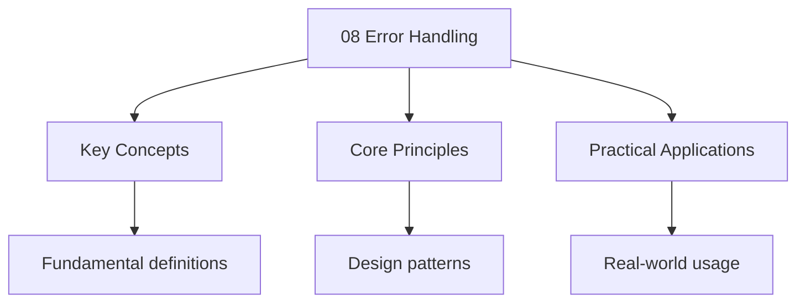

---

title: "Error Handling | Languages - Wyatt's Notes"
description: "Dart draws a sharp line between two families of throwable objects: and . This is not a stylistic preference -- it is a semantic contract. means something wen"
date: 2026-04-05T00:00:00.000Z
tags:
  - Dart
categories:
  - Dart
---

<!-- Breadcrumb Schema for SEO -->
<script type="application/ld+json">
{
  "@context": "https://schema.org",
  "@type": "BreadcrumbList",
  "itemListElement": [{"name": "Home", "url": "https://wyattau.com"}, {"name": "languages", "url": "https://languages.wyattau.com"}, {"name": "Dart", "url": "https://languages.wyattau.com/dart"}, {"name": "08 Error Handling", "url": "https://languages.wyattau.com/dart/08-error-handling"}]
}
</script>

## Exception vs Error Hierarchy

Dart draws a sharp line between two families of throwable objects: `Exception` and `Error`. This is
Not a stylistic preference — it is a semantic contract. `Exception` means "something went wrong at
Runtime that a caller might reasonably recover from." `Error` means "the program has entered a state
That indicates a programming bug, and recovery is not safe."

### The Full Hierarchy

```
Object
├── Exception                       (recoverable)
│   ├── FormatException             (bad string parsing)
│   ├── TimeoutException            (async operation exceeded deadline)
│   ├── FileSystemException         (I/O failure)
│   ├──HttpException                (HTTP layer failure)
├── StateError                       (object in wrong state for operation)
│   ├── RangeError                   (index/length out of bounds)
│   │   └── IndexError               (invalid array index)
│   └── ArgumentError                (invalid argument passed)
│       └── TypeError                (type mismatch at runtime)
├── Error                            (unrecoverable / programming bug)
│   ├── NoSuchMethodError           (method/property does not exist)
│   ├── StackOverflowError          (infinite recursion or too-deep call stack)
│   ├── OutOfMemoryError            (heap exhausted)
│   ├── UnsupportedError            (operation not supported on platform)
│   ├── UnimplementedError          (feature not yet implemented)
│   ├── ConcurrentModificationError (collection modified during iteration)
│   └── AssertionError              (assert() condition failed)
└── ... (custom types)
```

### The Semantic Distinction

- **`Exception`** — The caller did nothing wrong structurally, but a runtime condition was
  encountered. A file does not exist. A network request timed out. JSON failed to parse. The caller
  can catch this, log it, show a user-facing message, retry, or fall back to a default value.
- **`Error`** — The program is in a state that should never exist if the code were correct. A null
  dereference where null safety should have prevented it. A stack overflow from infinite recursion.
  An out-of-memory condition. Catching these is dangerous because the program"s internal state is
  unknown and possibly corrupted.

### When to Catch vs Let Propagate

```dart
// CORRECT: catch Exception — it represents a runtime condition
Future<User> fetchUser(int id) async {
  try {
    final response = await http.get(Uri.parse('https://api.example.com/users/$id'));
    return User.fromJson(jsonDecode(response.body));
  } on FormatException catch (e) {
    throw UserParseException('Malformed JSON for user $id', e);
  } on SocketException catch (e) {
    throw NetworkException('Cannot reach API server', e);
  }
}

// WRONG: catching Error masks programming bugs
void processList(List<int> items) {
  try {
    items[999]; // RangeError — this is a bug, not a runtime condition
  } catch (e) {
    print('Handled: $e'); // You just silenced a programming bug
  }
}

// CORRECT: let Errors propagate — they indicate bugs that must be fixed
void processList(List<int> items) {
  if (items.isEmpty) return;
  print(items.first); // If items is empty, RangeError surfaces the bug
}
```

### The `catch (e)` Anti-Pattern

Catching bare `catch (e)` without specifying a type will catch **both** `Exception` and `Error`.
This is almost always wrong. It swallows `StackOverflowError``OutOfMemoryError`And other signals
That the program is in an unrecoverable state. Always prefer `on Exception catch (e)` if you intend
To handle runtime failures, and let `Error` propagate to the top-level handler.

## try / on / catch / finally

### try Block

The `try` block wraps code that might throw. Dart evaluates the statements sequentially. If a
Throwable is raised, execution jumps to the matching `on` or `catch` clause.

### on for Specific Types

Use `on Type` to match a specific exception type without binding the exception to a variable:

```dart
try {
  int.parse('not a number');
} on FormatException {
  print('Input was not a valid integer');
}
```

This is preferred when you do not need the exception object — it makes the intent explicit.

### catch (e, stackTrace) for General Handling

```dart
try {
  riskyOperation();
} catch (e, stackTrace) {
  // e is the thrown object (Exception, Error, or anything else)
  // stackTrace is a StackTrace object
  print('Caught: $e');
  print('Stack:\n$stackTrace');
}
```

The second parameter `stackTrace` is optional. If omitted, you lose the stack trace — which is a
Significant loss when debugging.

### Combining on and catch

You can combine type-specific `on` with variable binding:

```dart
try {
  riskyOperation();
} on FormatException catch (e) {
  print('Format error: ${e.message}');
} on StateError catch (e) {
  print('State error: ${e.message}');
} catch (e, stackTrace) {
  // Fallback for anything not matched above
  print('Unexpected: $e');
  print(stackTrace);
}
```

Dart evaluates `on` clauses in order — first match wins. Always put more specific types before more
General ones.

### finally Always Runs

The `finally` block executes regardless of whether an exception was thrown, caught, or not thrown at
All. It runs even if a `catch` block returns or throws. This is the correct place for cleanup logic.

```dart
final file = File('data.bin');
RandomAccessFile? raf;

try {
  raf = await file.open();
  await raf.writeString('payload');
} catch (e, stackTrace) {
  print('Write failed: $e');
  rethrow;
} finally {
  await raf?.close(); // Always runs, even after rethrow
}
```

### Nesting try Blocks

Nested `try` blocks allow different levels of error handling:

```dart
Future<void> processBatch(List<String> urls) async {
  var processed = 0;
  try {
    for (final url in urls) {
      try {
        await fetchAndProcess(url);
        processed++;
      } on NetworkException {
        // Individual failure — log and continue with next URL
        logger.warning('Skipping $url: network failure');
      }
    }
  } catch (e, stackTrace) {
    // Catastrophic failure — bail out entirely
    logger.error('Batch processing aborted after $processed items', e, stackTrace);
    rethrow;
  }
  print('Processed $processed/${urls.length} items');
}
```

The inner `try` handles per-item failures (recoverable). The outer `try` handles batch-level
Failures (unrecoverable).

## Custom Exception Classes

### Extending Exception

`Exception` is an interface in Dart — any class can implement it. The canonical approach is to
Extend `Exception` (or a more specific base) and provide structured context.

```dart
class UserParseException implements Exception {
  final String message;
  final String userId;
  final Exception? cause;

  const UserParseException(this.message, {required this.userId, this.cause});

  @override
  String toString() =>
      'UserParseException: $message (userId=$userId)'
      '${cause != null ? ', caused by: $cause' : "''}";
}
```

### Design Principles

1. **Make fields immutable**. Use `final`. Exception objects should be safe to inspect after
   creation and should not change state.
2. **Include context**. The exception message alone is insufficient. Include the input that caused
   the failure, the operation being attempted, and any relevant identifiers (user IDs, file paths,
   request URLs).
3. **Chain exceptions**. Include the original cause so the full chain of failure is inspectable.
4. **Implement `toString()`**. The default `Exception.toString()` returns
   `"Instance of 'MyException'"`Which is useless in logs. Always override it with a meaningful
   message.

### Exception Hierarchies for Domains

```dart
sealed class AppException implements Exception {
  final String message;
  final Exception? cause;
  const AppException(this.message, {this.cause});
}

class NetworkException extends AppException {
  final Uri? uri;
  final int? statusCode;
  const NetworkException(
    super.message, {
    this.uri,
    this.statusCode,
    super.cause,
  });

  @override
  String toString() =>
      'NetworkException: $message'
      '${uri != null ? ' (uri=$uri)' : "''}"
      '${statusCode != null ? ' (status=$statusCode)' : "''}"
      '${cause != null ? ' — caused by $cause' : "''}";
}

class ValidationException extends AppException {
  final Map<String, String> fieldErrors;
  const ValidationException(super.message, this.fieldErrors, {super.cause});

  @override
  String toString() =>
      'ValidationException: $message, fields=$fieldErrors';
}

class PersistenceException extends AppException {
  const PersistenceException(super.message, {super.cause});
}
```

With `sealed`Pattern matching on `AppException` is exhaustive at the call site:

```dart
void handleException(AppException e) {
  switch (e) {
    case NetworkException():
      showRetryDialog();
    case ValidationException(:final fieldErrors):
      showFieldErrors(fieldErrors);
    case PersistenceException():
      showOfflineWarning();
  }
}
```

## rethrow

### The Problem with `throw e`

```dart
void logAndRethrow() {
  try {
    riskyOperation();
  } catch (e) {
    logger.error('Operation failed: $e');
    throw e; // WRONG — resets the stack trace to THIS line
  }
}
```

When you `throw e`Dart creates a **new** throw site. The original stack trace — the one that Points
to the actual bug — is lost. The new stack trace will show `logAndRethrow` as the origin, Which is
misleading.

### rethrow Preserves the Original Stack Trace

```dart
void logAndRethrow() {
  try {
    riskyOperation();
  } catch (e) {
    logger.error('Operation failed: $e');
    rethrow; // CORRECT — preserves the original throw site
  }
}
```

`rethrow` re-throws the caught exception with its **original** stack trace intact. The resulting
Trace points to the line inside `riskyOperation()` where the exception was originally thrown, not
The `rethrow` line.

### When to Use Each

| Situation                                                            | Use                                      |
| -------------------------------------------------------------------- | ---------------------------------------- |
| You want to log/wrap and continue propagating the original exception | `rethrow`                                |
| You want to wrap the exception in a new type (exception chaining)    | `throw MyException(..., cause: e)`       |
| You want to convert one exception type to another                    | `throw newException` (intentional reset) |
| You want to suppress and throw something entirely different          | `throw` (new object)                     |

### Exception Wrapping vs Rethrow

```dart
Future<User> fetchUser(String id) async {
  try {
    final response = await http.get(Uri.parse('$baseUrl/users/$id'));
    return User.fromJson(jsonDecode(response.body));
  } on FormatException catch (e, st) {
    // Wrap in a domain exception with the original cause
    throw UserParseException(
      'Failed to deserialize user $id',
      userId: id,
      cause: e,
    );
  } on SocketException {
    // Rethrow as-is — stack trace is already meaningful
    rethrow;
  }
}
```

## Stack Traces

### StackTrace Object

A `StackTrace` is an opaque string-like object representing the call stack at the point of a throw.
It is not parseable via a structured API — it is a formatted string that you read visually or send
To an error reporting service.

```dart
try {
  throw Exception('boom');
} catch (e, stackTrace) {
  print(stackTrace.runtimeType); // StackTrace
  print(stackTrace.toString());
  // #0      main (file:///path/to/file.dart:3:5)
  // #1      _startIsolate.<anonymous closure> (dart:isolate-patch/isolate_patch.dart:301:19)
  // #2      _RawReceivePortImpl._handleMessage (dart:isolate-patch/isolate_patch.dart:168:12)
}
```

### StackTrace.current

Use `StackTrace.current` to capture the call stack at the current point, without throwing:

```dart
void enterCriticalSection() {
  logger.fine('Entering critical section', StackTrace.current);
  // ... do work ...
}
```

This is useful for debugging control flow, tracing event propagation, or capturing context in error
Reporters.

### Chain.forTrace() (package:stack_trace)

The `stack_trace` package (from the `async` meta-package) provides `Chain.forTrace()`Which parses A
raw `StackTrace` into a `Chain` of `Frame` objects. This enables programmatic inspection:

```dart
import 'package:stack_trace/stack_trace.dart';

void analyzeError(Object error, StackTrace stackTrace) {
  final chain = Chain.forTrace(stackTrace);
  for (final frame in chain.frames) {
    if (frame.isCore) continue; // Skip dart: frames
    print('${frame.library}:${frame.line} in ${frame.member}');
  }
}
```

`Chain` also supports folding recursive frames, which compresses tail-recursive call patterns into a
Single line — significantly more readable for deeply recursive code.

### Reading Stack Traces

A Dart stack trace frame has the format:

```
#<index> <function> (<uri>:<line>:<column>)
```

- `#0` is the throw site (innermost frame).
- Higher numbers are callers further up the stack.
- `dart:core``dart:async``dart:isolate` frames are VM-internal — skip these when debugging.
- `package:your_app/` frames are your application code — start here.
- `package:http/``package:flutter/` frames are third-party — the bug may be in how you called them,
  not in the library itself.

## Error Handling in Async

### Uncaught Async Errors

In synchronous code, an uncaught exception crashes the isolate. In async code, the behavior depends
On whether the `Future` has an error handler attached:

```dart
// Synchronous — crashes immediately
void main() {
  throw Exception('crash'); // Isolate terminates
}

// Async — error goes to the zone's error handler, NOT the global handler
void main() {
  Future.delayed(Duration(seconds: 1), () {
    throw Exception('async crash');
  });
  // This does NOT crash the isolate immediately
  // The error is delivered to the zone's uncaught-error callback
  print('This prints before the error is delivered');
}
```

### Future.error()

Creates a Future that completes with an error:

```dart
Future<int> failAfterParse(String input) {
  final n = int.tryParse(input);
  if (n == null) {
    return Future.error(
      FormatException('Cannot parse "$input" as int'),
      StackTrace.current,
    );
  }
  return Future.value(n);
}
```

### catchError()

The functional equivalent of `try/catch` on a `Future`:

```dart
Future<int> safeParse(String input) {
  return Future.value(int.parse(input))
      .catchError(
        (e) => -1,
        test: (e) => e is FormatException,
      );
}
```

The `test` parameter filters which errors to catch — without it, `catchError` catches
**everything**, including `Error` subclasses. Always provide `test` to restrict catching to
`Exception` types.

### runZonedGuarded() and Zone Error Handlers

Zones are Dart's mechanism for scoped error handling, dependency injection, and callback tracking.
`runZonedGuarded` creates a zone with an error handler that catches all uncaught async errors:

```dart
import 'dart:async';

void main() {
  runZonedGuarded(
    () {
      // All async code inside this zone
      runApp(MyApp());

      // This error is caught by the zone handler
      Future.delayed(Duration(seconds: 1), () {
        throw Exception('uncaught async error');
      });
    },
    (error, stackTrace) {
      // This receives ALL uncaught async errors from the zone
      Sentry.captureException(error, stackTrace: stackTrace);
      Crashlytics.instance.recordError(error, stackTrace);
    },
    zoneSpecification: ZoneSpecification(
      // Optionally override print, timers, etc.
    ),
  );
}
```

### Why Uncaught Async Errors Do Not Crash the App

When a `Future` completes with an error and no `catchError` or `await`+`try/catch` is attached, the
Error is dispatched to the **enclosing zone's error handler**. The root zone's default handler
Prints to stderr but does **not** terminate the isolate. This is by design — in a long-running UI
Application (Flutter), a single failed network request should not bring down the entire app.

This means uncaught async errors are **silent by default**. The only output is a stderr print. This
Is why you must either:

1. Use `runZonedGuarded` to install a global error handler that reports to a crash reporting
   service.
2. Ensure every `Future` is either awaited with `try/catch` or has `catchError` attached.
3. Use the `unawaited_futures` lint rule (`lints` package) to catch fire-and-forget Futures at
   compile time.

## Error Handling in Streams

### Errors as Stream Events

In the `Stream` contract, errors are **first-class events** — they are not exceptions. A stream can
Deliver multiple errors interleaved with data events. An error event does not terminate a broadcast
Stream (but it does terminate a single-subscription stream unless handled).

```dart
final controller = StreamController<int>.broadcast();

controller.stream.listen(
  (data) => print('Data: $data'),
  onError: (error, stackTrace) => print('Stream error: $error'),
  onDone: () => print('Stream closed'),
);

controller.add(1);    // Data: 1
controller.addError(Exception('oops')); // Stream error: Exception: oops
controller.add(2);    // Data: 2 (broadcast streams continue after errors)
controller.close();   // Stream closed
```

### onError Handler

The `onError` callback in `listen()` handles error events. Without it, the error is dispatched to
The zone's error handler.

### handleError()

A stream transformer that intercepts error events:

```dart
final safeStream = riskyStream.handleError(
  (error, stackTrace) {
    logger.warning('Stream error intercepted: $error');
  },
  test: (error) => error is NetworkException,
);
```

Like `catchError` on `Future`The `test` parameter restricts which errors are handled.

### transformError()

For transforming error events into data events (error recovery):

```dart
final recoveredStream = riskyStream.transformError(
  (error, stackTrace) {
    if (error is NetworkException) {
      return Stream.value(FallbackData.cached);
    }
    return Stream.error(error, stackTrace);
  },
);
```

### Errors Terminate Single-Subscription Streams

A single-subscription stream delivers at most one error event, after which no more events can be
Delivered. If you need to continue after an error, use `handleError` to consume the error before it
Propagates:

```dart
// Without handling — stream dies on first error
final stream = eventSource(); // Single-subscription
stream.listen(
  (data) => process(data),
  onError: (e) => print(e),
);
// After first error, no more events arrive

// With handling — stream survives
final stream = eventSource();
stream
    .handleError((e) => logger.warning(e))
    .listen((data) => process(data));
// Errors are consumed; data events continue
```

## The Result/Either Pattern

### Why Avoid Exceptions for Expected Failures

Exceptions are for **exceptional** conditions — things that should not happen in normal operation.
If a user enters an invalid email, that is not exceptional; it is an expected validation outcome.
Using exceptions for control flow has several problems:

1. **Performance**. Throwing and catching involves stack trace capture, which is expensive.
2. **Opacity**. You cannot tell from the return type that a function might fail. The caller must
   read documentation or source code.
3. **Incomposability**. Exceptions bypass the return value, making it impossible to chain
   operations without `try/catch` blocks everywhere.

### Implementing Result with Sealed Classes

Dart 3's sealed classes make the Result pattern clean and exhaustive:

```dart
sealed class Result<T> {
  const Result();

  bool get isSuccess => this is Success<T>;
  bool get isFailure => this is Failure<T>;
}

class Success<T> extends Result<T> {
  final T value;
  const Success(this.value);
}

class Failure<T> extends Result<T> {
  final Object error;
  final StackTrace? stackTrace;
  const Failure(this.error, [this.stackTrace]);
}
```

### Usage

```dart
Result<User> parseUser(Map<String, dynamic> json) {
  final id = json['id'];
  if (id is! int) {
    return const Failure('Missing or invalid "id" field');
  }
  final name = json['name'];
  if (name is! String || name.isEmpty) {
    return const Failure('Missing or empty "name" field');
  }
  return Success(User(id: id, name: name));
}

void processUser(Map<String, dynamic> json) {
  final result = parseUser(json);
  switch (result) {
    case Success(value: final user):
      saveToDatabase(user);
    case Failure(error: final err):
      showErrorSnackbar(err.toString());
  }
}
```

### Chaining with map, flatMap, and fold

```dart
extension ResultExtensions<T> on Result<T> {
  Result<U> map<U>(U Function(T value) transform) {
    return switch (this) {
      Success(value: final v) => Success(transform(v)),
      Failure() => this as Failure<U>,
    };
  }

  Result<U> flatMap<U>(Result<U> Function(T value) transform) {
    return switch (this) {
      Success(value: final v) => transform(v),
      Failure() => this as Failure<U>,
    };
  }

  U fold<U>(U Function(T value) onSuccess, U Function(Object error) onFailure) {
    return switch (this) {
      Success(value: final v) => onSuccess(v),
      Failure(error: final e) => onFailure(e),
    };
  }
}

// Chained validation pipeline
Result<Credentials> validateCredentials(Map<String, dynamic> json) {
  return parseEmail(json['email'])
      .flatMap((email) => parsePassword(json['password'])
      .map((password) => Credentials(email, password)));
}
```

### Third-Party Packages: fpdart and dartz

For production use, `fpdart` and `dartz` provide battle-tested implementations:

```dart
// fpdart
import 'package:fpdart/fpdart.dart';

Either<ValidationFailure, User> parseUser(Map<String, dynamic> json) {
  return validateId(json['id']).flatMap((id) =>
    validateName(json['name']).map((name) => User(id: id, name: name)));
}

// At the call site
final result = parseUser(json);
result.match(
  (failure) => showError(failure.message),
  (user) => saveUser(user),
);
```

`fpdart` provides `Either``Option``TaskEither` (async Either), `IO` (synchronous side effects), And
a full suite of functional programming primitives. `dartz` is the older, more established
Alternative with similar capabilities.

### When to Use Result vs Exceptions

| Scenario                                                 | Use                                     |
| -------------------------------------------------------- | --------------------------------------- |
| Validation, parsing, expected business rule violations   | `Result`/`Either`                       |
| I/O failures (network, filesystem)                       | `Exception` (or `Result` if you prefer) |
| Programming bugs (null dereference, index out of bounds) | Let `Error` propagate                   |
| Library boundary where you want explicit failure types   | `Result`/`Either`                       |

## Flutter Error Boundaries

### ErrorWidget

Flutter replaces any widget that throws during `build()` with a default red error screen. You can
Override this globally:

```dart
void main() {
  ErrorWidget.builder = (errorDetails) {
    return Material(
      child: Center(
        child: Column(
          mainAxisSize: MainAxisSize.min,
          children: [
            const Icon(Icons.error_outline, color: Colors.red, size: 48),
            const SizedBox(height: 16),
            Text(
              'Something went wrong.\n${errorDetails.exception}',
              textAlign: TextAlign.center,
              style: const TextStyle(color: Colors.grey),
            ),
            ElevatedButton(
              onPressed: () => WidgetsBinding.instance.reassembleApplication(),
              child: const Text('Reload'),
            ),
          ],
        ),
      ),
    );
  };
  runApp(const MyApp());
}
```

### FlutterError.onError

Flutter framework errors (exceptions thrown during `build`Layout, or paint) are caught by
`FlutterError.onError`. This is separate from Dart's zone error handler:

```dart
void main() {
  FlutterError.onError = (details) {
    // Report to crash service
    Sentry.captureException(
      details.exception,
      stackTrace: details.stack,
    );
    // Also print to console in debug mode
    FlutterError.dumpErrorToConsole(details);
  };

  // Zone handler catches non-Flutter async errors
  runZonedGuarded(
    () => runApp(const MyApp()),
    (error, stackTrace) {
      Sentry.captureException(error, stackTrace: stackTrace);
    },
  );
}
```

### ErrorBoundary Widget Pattern

There is no built-in `ErrorBoundary` widget in Flutter (unlike React). You implement it manually by
Wrapping child widgets in a try/catch:

```dart
class ErrorBoundary extends StatefulWidget {
  final Widget child;
  final Widget Function(Object error, StackTrace stackTrace) builder;

  const ErrorBoundary({
    required this.child,
    required this.builder,
    super.key,
  });

  @override
  State<ErrorBoundary> createState() => _ErrorBoundaryState();
}

class _ErrorBoundaryState extends State<ErrorBoundary> {
  Object? _error;
  StackTrace? _stackTrace;

  @override
  Widget build(BuildContext context) {
    if (_error != null) {
      return widget.builder(_error!, _stackTrace!);
    }
    return widget.child;
  }
}
```

The limitation is that this only catches errors in the child's `build` method if you use
`runZonedGuarded` inside the state:

```dart
class _ErrorBoundaryState extends State<ErrorBoundary> {
  Object? _error;
  StackTrace? _stackTrace;

  @override
  void initState() {
    super.initState();
    _runChild();
  }

  Future<void> _runChild() async {
    runZonedGuarded(
      () {},
      (error, stackTrace) {
        if (mounted) {
          setState(() {
            _error = error;
            _stackTrace = stackTrace;
          });
        }
      },
    );
  }
  // ...
}
```

In practice, the most robust approach is the combination of `FlutterError.onError` +
`runZonedGuarded` + `ErrorWidget.builder`As shown above. This covers framework errors, async Errors,
and build-time errors respectively.

### Reporting to Sentry / Firebase Crashlytics

The canonical integration:

```dart
Future<void> main() async {
  WidgetsFlutterBinding.ensureInitialized();

  await SentryFlutter.init(
    (options) {
      options.dsn = 'https://example@sentry.io/project';
      options.tracesSampleRate = 1.0;
    },
    appRunner: () => runApp(const MyApp()),
  );

  FlutterError.onError = (details) {
    Sentry.captureException(details.exception, stackTrace: details.stack);
  };
}
```

Sentry's Flutter SDK automatically sets up `runZonedGuarded` internally when you use `appRunner`.
Firebase Crashlytics follows a similar pattern with `FlutterError.onError` and `runZonedGuarded`.

## Intuition

**Graceful failure:** Error handling is like a safety net — it catches problems before they crash your program. Try-catch blocks let you handle unexpected situations gracefully.

**Why it matters:** Robust programs handle errors gracefully. Good error handling improves user experience and makes debugging easier.

**The key insight:** Catch specific exceptions, not generic ones — this lets you handle different errors appropriately.

## Common Pitfalls

### 1. Catching Error Instead of Exception

```dart
// WRONG — catches StackOverflowError, OutOfMemoryError, etc.
try {
  processData(input);
} catch (e) {
  logger.error(e);
}

// CORRECT — only catch recoverable exceptions
try {
  processData(input);
} on AppException catch (e, st) {
  logger.error(e, st);
}
```

Catching all throwables masks programming bugs. An `OutOfMemoryError` caught here will be logged,
And the program will continue in an undefined state.

### 2. Throw e Instead of rethrow

```dart
// WRONG — resets the stack trace to this line
try {
  await fetchFromApi();
} catch (e) {
  logger.error(e);
  throw e; // Stack trace now points HERE, not the actual failure
}

// CORRECT — preserves original stack trace
try {
  await fetchFromApi();
} catch (e) {
  logger.error(e);
  rethrow;
}
```

If you need to wrap the exception in a new type, pass the original as the `cause` field — but
Understand that the stack trace of the new throw will be the wrap site.

### 3. Forgetting the stackTrace Parameter

```dart
// WRONG — stack trace is silently discarded
try {
  riskyOperation();
} catch (e) {
  reportError(e); // No stack trace!
}

// CORRECT — capture and forward the stack trace
try {
  riskyOperation();
} catch (e, stackTrace) {
  reportError(e, stackTrace);
}
```

Without the stack trace, the error report is nearly useless — you know what failed but not where.

### 4. Unawaited Futures Silently Swallow Errors

```dart
// WRONG — the Future's error is dispatched to the zone handler,
// which by default only prints to stderr
void onButtonPressed() {
  saveToDatabase(record); // Not awaited
}

// CORRECT — handle the error
Future<void> onButtonPressed() async {
  try {
    await saveToDatabase(record);
  } on PersistenceException catch (e) {
    showSnackBar('Failed to save: ${e.message}');
  }
}
```

Enable the `unawaited_futures` lint to catch this at compile time.

### 5. Using Exceptions for Control Flow

```dart
// WRONG — exceptions are not a control flow mechanism
int? findFirst(List<int> items, int target) {
  try {
    return items.firstWhere((x) => x == target);
  } on StateError {
    return null;
  }
}

// CORRECT — use the API designed for this
int? findFirst(List<int> items, int target) {
  return items.cast<int?>().firstWhere(
    (x) => x == target,
    orElse: () => null,
  );
}
```

The `firstWhere` method has an `orElse` callback precisely for this case. No exception is thrown, no
Stack trace is captured, and the intent is explicit in the return type.

### 6. Not Handling Errors in Streams

```dart
// WRONG — errors in the stream are silently dispatched to the zone
streamController.stream.listen((data) {
  process(data);
});

// CORRECT — always provide an onError handler
streamController.stream.listen(
  (data) => process(data),
  onError: (error, stackTrace) => logger.error('Stream error', error, stackTrace),
);
```

### 7. Catching Without Specific Types in Public APIs

```dart
// WRONG — callers cannot distinguish between failure types
Future<User> getUser(String id) async {
  try {
    return await api.getUser(id);
  } catch (e) {
    throw Exception('Failed to get user'); // Loses the original type
  }
}

// CORRECT — preserve or wrap with domain-specific types
Future<User> getUser(String id) async {
  try {
    return await api.getUser(id);
  } on NetworkException catch (e) {
    throw UserFetchException.network(id, e);
  } on FormatException catch (e) {
    throw UserFetchException.parse(id, e);
  }
}
```

### 8. Missing finally for Resource Cleanup

```dart
// WRONG — file handle leaks on exception
void writeLog(String message) async {
  final file = await File('log.txt').open(mode: FileMode.append);
  await file.writeString(message);
  await file.close();
}

// CORRECT — finally ensures cleanup
void writeLog(String message) async {
  final file = await File('log.txt').open(mode: FileMode.append);
  try {
    await file.writeString(message);
  } finally {
    await file.close();
  }
}
```

Alternatively, use the `using` pattern from `package:resource` or Dart's `Resource` class (Dart
3.3+) for scope-bound resource management.




## Summary

This topic covers the core concepts of error handling, including underlying theory, practical
implementation, and key applications.

**Key concepts include:**

- core concepts and terminology
- algorithms and computational thinking
- practical implementation
- security and ethical considerations
- applications in the real world

Understanding these concepts thoroughly is essential for both examinations and practical
programming, and requires both theoretical knowledge and hands-on practice.

## Worked Examples

Worked examples demonstrating the application of key concepts are covered in the detailed sub-pages
linked above.

## Cross-References

- **[Async and Futures](./05-async/01-async-and-futures.md):** Error handling in Futures, Streams, and zone error handlers.
- **[Class Modifiers](./07-dart3-features/03-class-modifiers.md):** Sealed class hierarchies for exhaustive pattern matching on error types.
- **[Classes and Inheritance](./04-object-oriented/01-classes-and-inheritance.md):** Custom exception class design using inheritance and abstract classes.
- **[Best Practices](./04-best-practices.md):** Error handling best practices including specific exception catching.
