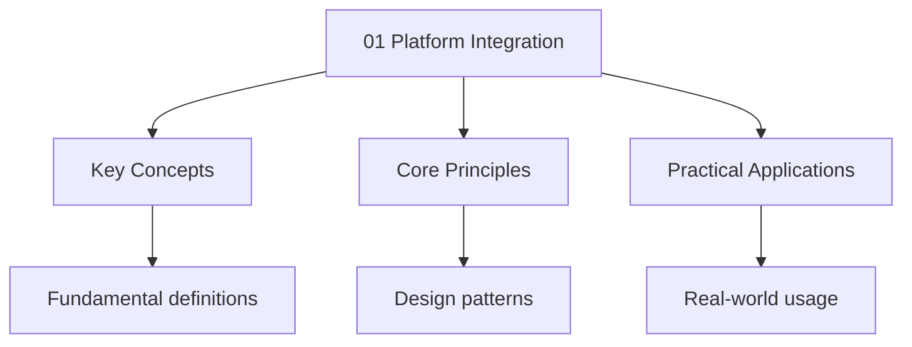

---

title: "Platform Integration | Languages"
description: "Study notes for Platform Integration with worked examples, practice problems, and key concepts for exam preparation."
date: 2026-04-05T00:00:00.000Z
tags:
  - Dart
categories:
  - Dart
---

<!-- Breadcrumb Schema for SEO -->
<script type="application/ld+json">
{
  "@context": "https://schema.org",
  "@type": "BreadcrumbList",
  "itemListElement": [{"name": "Home", "url": "https://wyattau.com"}, {"name": "languages", "url": "https://languages.wyattau.com"}, {"name": "Dart", "url": "https://languages.wyattau.com/dart"}, {"name": "11 Networking And Data", "url": "https://languages.wyattau.com/dart/11-networking-and-data"}, {"name": "01 Platform Integration", "url": "https://languages.wyattau.com/dart/11-networking-and-data/01-platform-integration"}]
}
</script>

## Platform Integration

## Why Platform Integration

Flutter provides a rich set of widgets and plugins, but some capabilities require direct interaction
With the underlying operating system. The device's camera, GPS receiver, Bluetooth radio,
Accelerometer, file system, biometric hardware, and notification system are all accessed through
Native platform APIs (Android's Java/Kotlin APIs, iOS's Objective-C/Swift APIs). Flutter's sandbox
Isolates Dart code from these native APIs, so a bridge mechanism is needed.

**Platform channels** are the fundamental bridge between Dart and native code. They allow
Bidirectional communication: Dart can invoke native methods and receive results, and native code can
Send messages or streams of events back to Dart.

The platform channel architecture uses a message-passing model. Data is serialized using a standard
Codec ( the `StandardMethodCodec`Which supports null, booleans, numbers, strings, byte Buffers,
lists, and maps), transmitted across the platform channel, and deserialized on the other Side. This
serialization/deserialization is handled automatically for standard types.

Most common use cases are covered by existing Flutter packages (`camera``geolocator`
`shared_preferences``url_launcher`Etc.). Platform channels are needed when:

- No suitable plugin exists for the native API you need.
- You need to integrate with a proprietary native SDK.
- You need fine-grained control over native behavior that a plugin abstracts away.
- You are building a plugin yourself.

---

<!-- Breadcrumb Schema for SEO -->
<script type="application/ld+json">
{
  "@context": "https://schema.org",
  "@type": "BreadcrumbList",
  "itemListElement": [{"name": "Home", "url": "https://wyattau.com"}, {"name": "languages", "url": "https://languages.wyattau.com"}, {"name": "Dart", "url": "https://languages.wyattau.com/dart"}, {"name": "11 Networking And Data", "url": "https://languages.wyattau.com/dart/11-networking-and-data"}, {"name": "01 Platform Integration", "url": "https://languages.wyattau.com/dart/11-networking-and-data/01-platform-integration"}]
}
</script>

## Platform Checks

Before invoking platform-specific behavior, you often need to determine which platform your app is
Running on.

### Platform Class

The `dart:io` `Platform` class provides static boolean properties:

```dart
import 'dart:io';

if (Platform.isAndroid) {
  // Android-specific code
} else if (Platform.isIOS) {
  // iOS-specific code
} else if (Platform.isMacOS) {
  // macOS-specific code
} else if (Platform.isLinux) {
  // Linux-specific code
} else if (Platform.isWindows) {
  // Windows-specific code
}
```

### defaultTargetPlatform

`defaultTargetPlatform` from `package:flutter/foundation.dart` returns a `TargetPlatform` enum. This
Is useful for choosing between Material and Cupertino widgets:

```dart
import 'package:flutter/foundation.dart';

final isApple = defaultTargetPlatform == TargetPlatform.iOS ||
    defaultTargetPlatform == TargetPlatform.macOS;

if (isApple) {
  return const CupertinoActivityIndicator();
} else {
  return const CircularProgressIndicator();
}
```

### Theme.of(context).platform

`Theme.of(context).platform` returns the platform that the current theme is targeting. This can
Differ from the actual platform — for example, an Android user might prefer iOS-style UI. The
Theme's platform value respects the user's preference:

```dart
final platform = Theme.of(context).platform;

if (platform == TargetPlatform.iOS) {
  return const CupertinoNavigationBar(...);
} else {
  return const AppBar(...);
}
```

### Why Platform Checks Matter

Platform checks are necessary for several reasons:

- **UI conventions**: Material Design and Cupertino (iOS Human Interface Guidelines) have different
  patterns for navigation bars, dialogs, date pickers, and scroll physics.
- **Feature availability**: Some APIs are only available on certain platforms. The camera plugin,
  for instance, does not work on desktop without a webcam. Biometric authentication works
  differently (or not at all) across platforms.
- **Permission models**: Android and iOS have different permission request flows. Android uses a
  runtime permission model, while iOS requires `Info.plist` entries with usage descriptions.
- **File system layout**: Android and iOS store app data in different directory structures. Android
  uses `/data/data/<package>/`While iOS uses the sandbox's `Documents/` and `Library/` directories.

### kIsWeb

On the web platform, `dart:io` is not available. Use `kIsWeb` from `package:flutter/foundation.dart`
To check for the web platform before importing `dart:io`:

```dart
import 'package:flutter/foundation.dart' show kIsWeb;

if (kIsWeb) {
  // Web-specific code
} else {
  import 'dart:io';
  if (Platform.isAndroid) {
    // Android-specific code
  }
}
```

A cleaner pattern is to isolate platform-specific code into separate files using conditional
Imports:

```dart
// platform_info.dart
export 'platform_info_mobile.dart' if (dart.library.html) 'platform_info_web.dart';
```

---

<!-- Breadcrumb Schema for SEO -->
<script type="application/ld+json">
{
  "@context": "https://schema.org",
  "@type": "BreadcrumbList",
  "itemListElement": [{"name": "Home", "url": "https://wyattau.com"}, {"name": "languages", "url": "https://languages.wyattau.com"}, {"name": "Dart", "url": "https://languages.wyattau.com/dart"}, {"name": "11 Networking And Data", "url": "https://languages.wyattau.com/dart/11-networking-and-data"}, {"name": "01 Platform Integration", "url": "https://languages.wyattau.com/dart/11-networking-and-data/01-platform-integration"}]
}
</script>

## MethodChannel

`MethodChannel` is the primary mechanism for invoking native methods from Dart and receiving
Results. It follows a request-response model: Dart sends a method call with optional arguments, the
Native side handles it and returns a result.

### Setup

Define a channel with a unique string name. By convention, use a reverse-domain format:

```dart
import 'package:flutter/services.dart';

const channel = MethodChannel('com.example.myapp/battery');
```

### Invoking a Method from Dart

```dart
class BatteryService {
  static const _channel = MethodChannel('com.example.myapp/battery');

  static Future<int> getBatteryLevel() async {
    try {
      final int level = await _channel.invokeMethod('getBatteryLevel');
      return level;
    } on PlatformException catch (e) {
      throw BatteryException('Failed to get battery level: ${e.message}');
    }
  }
}
```

`invokeMethod` returns a `Future<T>`. The type parameter `T` is the expected return type. If the
Native side returns a different type, a cast error occurs at runtime.

### Passing Arguments

Arguments are passed as a `Map<String, dynamic>`:

```dart
final result = await _channel.invokeMethod<Map<String, dynamic>>(
  'getDeviceInfo',
  {'includeSerial': true, 'timeout': 5000},
);
```

### Native Handler (Android)

In Kotlin, register the handler in your `MainActivity`:

```kotlin
class MainActivity : FlutterActivity() {
    override fun configureFlutterEngine(flutterEngine: FlutterEngine) {
        super.configureFlutterEngine(flutterEngine)
        MethodChannel(
            flutterEngine.dartExecutor.binaryMessenger,
            "com.example.myapp/battery"
        ).setMethodCallHandler { call, result ->
            when (call.method) {
                "getBatteryLevel" -> {
                    val batteryLevel = getBatteryLevel()
                    if (batteryLevel != -1) {
                        result.success(batteryLevel)
                    } else {
                        result.error("UNAVAILABLE", "Battery level not available.", null)
                    }
                }
                else -> {
                    result.notImplemented()
                }
            }
        }
    }

    private fun getBatteryLevel(): Int {
        val batteryManager = getSystemService(BATTERY_SERVICE) as BatteryManager
        return batteryManager.getIntProperty(BatteryManager.BATTERY_PROPERTY_CAPACITY)
    }
}
```

### Native Handler (iOS)

In Swift, register the handler in your `AppDelegate`:

```swift
import Flutter
import UIKit

@UIApplicationMain
@objc class AppDelegate: FlutterAppDelegate {
    override func application(
        _ application: UIApplication,
        didFinishLaunchingWithOptions launchOptions: [UIApplication.LaunchOptionsKey: Any]?
    ) -> Bool {
        let controller = window?.rootViewController as! FlutterViewController
        let batteryChannel = FlutterMethodChannel(
            name: "com.example.myapp/battery",
            binaryMessenger: controller.binaryMessenger
        )

        batteryChannel.setMethodCallHandler { [weak self] (call, result) in
            switch call.method {
            case "getBatteryLevel":
                self?.getBatteryLevel(result: result)
            default:
                result(FlutterMethodNotImplemented)
            }
        }

        return super.application(application, didFinishLaunchingWithOptions: launchOptions)
    }

    private func getBatteryLevel(result: FlutterResult) {
        UIDevice.current.isBatteryMonitoringEnabled = true
        let batteryLevel = Int(UIDevice.current.batteryLevel * 100)
        if batteryLevel >= 0 {
            result(batteryLevel)
        } else {
            result(FlutterError(code: "UNAVAILABLE", message: "Battery info unavailable", details: nil))
        }
    }
}
```

### Argument Serialization

The `StandardMethodCodec` automatically serializes the following types between Dart and native:

| Dart        | Android (Kotlin) | iOS (Swift)                        |
| ----------- | ---------------- | ---------------------------------- |
| `null`      | `null`           | `NSNull()`                         |
| `bool`      | `Boolean`        | `NSNumber(value: bool)`            |
| `int`       | `Int` / `Long`   | `NSNumber(value: Int)`             |
| `double`    | `Double`         | `NSNumber(value: Double)`          |
| `String`    | `String`         | `NSString`                         |
| `Uint8List` | `ByteArray`      | `FlutterStandardTypedData(bytes:)` |
| `List`      | `List`           | `NSArray`                          |
| `Map`       | `HashMap`        | `NSDictionary`                     |

Complex nested structures (maps containing lists of maps, etc.) are supported as long as the leaf
Values are one of the above types.

### Return Values

The native side has three ways to respond:

- **`result.success(value)`**: Return a successful result.
- **`result.error(code, message, details)`**: Return an error. This causes a `PlatformException` on
  the Dart side.
- **`result.notImplemented()`**: Indicate the method is not recognized.

### Error Handling

Native errors surface as `PlatformException` on the Dart side:

```dart
try {
  final level = await _channel.invokeMethod<int>('getBatteryLevel');
  print('Battery: $level%');
} on PlatformException catch (e) {
  print('Error code: ${e.code}');
  print('Error message: ${e.message}');
  print('Error details: ${e.details}');
} on MissingPluginException catch (e) {
  print('Plugin not registered on this platform: $e');
}
```

`MissingPluginException` is thrown when the native side does not have a handler for the channel
Name. This happens when running on a platform where the plugin has not been implemented (e.g.,
desktop) or when the plugin registration is missing.

---

<!-- Breadcrumb Schema for SEO -->
<script type="application/ld+json">
{
  "@context": "https://schema.org",
  "@type": "BreadcrumbList",
  "itemListElement": [{"name": "Home", "url": "https://wyattau.com"}, {"name": "languages", "url": "https://languages.wyattau.com"}, {"name": "Dart", "url": "https://languages.wyattau.com/dart"}, {"name": "11 Networking And Data", "url": "https://languages.wyattau.com/dart/11-networking-and-data"}, {"name": "01 Platform Integration", "url": "https://languages.wyattau.com/dart/11-networking-and-data/01-platform-integration"}]
}
</script>

## EventChannel

`EventChannel` is designed for streaming data from native to Dart. While `MethodChannel` follows a
Request-response model, `EventChannel` establishes a continuous stream of events — similar to a Dart
`Stream`.

### Setup (Dart Side)

```dart
import 'dart:async';
import 'package:flutter/services.dart';

class SensorService {
  static const _channel = EventChannel('com.example.myapp/sensors');

  static Stream<double> get accelerometerStream {
    return _channel.receiveBroadcastStream().map((event) => event as double);
  }

  static Stream<Map<String, dynamic>> get locationStream {
    return _channel.receiveBroadcastStream().cast<Map<String, dynamic>>();
  }
}
```

`receiveBroadcastStream()` returns a `Stream<dynamic>`. You map or cast the events to the Expected
type.

### Consuming the Stream

```dart
class AccelerometerDisplay extends StatefulWidget {
  @override
  State<AccelerometerDisplay> createState() => _AccelerometerDisplayState();
}

class _AccelerometerDisplayState extends State<AccelerometerDisplay> {
  double _x = 0;
  late final StreamSubscription<double> _subscription;

  @override
  void initState() {
    super.initState();
    _subscription = SensorService.accelerometerStream.listen(
      (x) => setState(() => _x = x),
      onError: (error) => debugPrint('Sensor error: $error'),
    );
  }

  @override
  void dispose() {
    _subscription.cancel();
    super.dispose();
  }

  @override
  Widget build(BuildContext context) {
    return Text('X acceleration: ${_x.toStringAsFixed(2)}');
  }
}
```

Always cancel subscriptions in `dispose` to prevent memory leaks and orphaned native listeners.

### Native Handler (Android)

On Android, use `EventChannel.StreamHandler`:

```kotlin
class MainActivity : FlutterActivity() {
    private lateinit var sensorManager: SensorManager
    private var sensorEventListener: SensorEventListener? = null

    override fun configureFlutterEngine(flutterEngine: FlutterEngine) {
        super.configureFlutterEngine(flutterEngine)
        sensorManager = getSystemService(SENSOR_SERVICE) as SensorManager

        EventChannel(
            flutterEngine.dartExecutor.binaryMessenger,
            "com.example.myapp/sensors"
        ).setStreamHandler(object : EventChannel.StreamHandler {
            override fun onListen(arguments: Any?, events: EventChannel.EventSink) {
                val accelerometer = sensorManager.getDefaultSensor(Sensor.TYPE_ACCELEROMETER)
                sensorEventListener = object : SensorEventListener {
                    override fun onSensorChanged(event: SensorEvent) {
                        events.success(event.values[0].toDouble())
                    }
                    override fun onAccuracyChanged(sensor: Sensor?, accuracy: Int) {}
                }
                sensorManager.registerListener(
                    sensorEventListener, accelerometer, SensorManager.SENSOR_DELAY_UI
                )
            }

            override fun onCancel(arguments: Any?) {
                sensorEventListener?.let {
                    sensorManager.unregisterListener(it)
                    sensorEventListener = null
                }
            }
        })
    }
}
```

### Native Handler (iOS)

```swift
import CoreMotion

let motionManager = CMMotionManager()

let sensorChannel = FlutterEventChannel(
    name: "com.example.myapp/sensors",
    binaryMessenger: controller.binaryMessenger
)

sensorChannel.setStreamHandler(SensorStreamHandler())

class SensorStreamHandler: NSObject, FlutterStreamHandler {
    private var timer: Timer?

    func onListen(withArguments arguments: Any?, eventSink events: @escaping FlutterEventSink) -> FlutterError? {
        guard motionManager.isAccelerometerAvailable else {
            return FlutterError(code: "UNAVAILABLE", message: "Accelerometer not available", details: nil)
        }
        motionManager.accelerometerUpdateInterval = 0.1
        motionManager.startAccelerometerUpdates(to: OperationQueue.main) { data, error in
            if let data = data {
                events(data.acceleration.x)
            }
        }
        return nil
    }

    func onCancel(withArguments arguments: Any?) -> FlutterEventSink? -> FlutterError? {
        motionManager.stopAccelerometerUpdates()
        return nil
    }
}
```

### Use Cases for EventChannel

- **Sensor data**: Accelerometer, gyroscope, magnetometer.
- **GPS location updates**: Continuous location tracking.
- **Bluetooth scanning**: Discovering nearby devices.
- **Notification listening**: Receiving push notification payloads.
- **Battery state changes**: Monitoring charging status transitions.
- **Network connectivity**: Real-time connectivity status changes.

### EventChannel Lifecycle

When Dart calls `receiveBroadcastStream()`The channel sends a "listen" signal to the native side,
Triggering `onListen`. The native side should start producing events and pushing them through
`EventSink.success()`. When all Dart listeners are cancelled (via `StreamSubscription.cancel()`),
The channel sends a "cancel" signal, triggering `onCancel`. The native side should clean up
Resources.

If an error occurs on the native side, call `EventSink.error(code, message, details)` to send an
Error event through the stream. On the Dart side, this triggers the stream's `onError` handler.

---

<!-- Breadcrumb Schema for SEO -->
<script type="application/ld+json">
{
  "@context": "https://schema.org",
  "@type": "BreadcrumbList",
  "itemListElement": [{"name": "Home", "url": "https://wyattau.com"}, {"name": "languages", "url": "https://languages.wyattau.com"}, {"name": "Dart", "url": "https://languages.wyattau.com/dart"}, {"name": "11 Networking And Data", "url": "https://languages.wyattau.com/dart/11-networking-and-data"}, {"name": "01 Platform Integration", "url": "https://languages.wyattau.com/dart/11-networking-and-data/01-platform-integration"}]
}
</script>

## BasicMessageChannel

`BasicMessageChannel` is the simplest form of platform channel. It supports asynchronous,
Bidirectional string or structured message passing. It does not have the method-name semantics of
`MethodChannel` or the stream semantics of `EventChannel`.

### Setup and Usage

```dart
import 'package:flutter/services.dart';

const _channel = BasicMessageChannel<String>(
  'com.example.myapp/messages',
  StringCodec(),
);

Future<String> sendMessage(String message) async {
  final response = await _channel.send(message);
  return response;
}
```

### Setting a Message Handler (Dart Side)

You can also set a handler on the Dart side to receive messages from native:

```dart
_channel.setMessageHandler((String? message) async {
  print('Received from native: $message');
  return 'Acknowledged: $message';
});
```

### Native Side (Android)

```kotlin
BasicMessageChannel(
    flutterEngine.dartExecutor.binaryMessenger,
    "com.example.myapp/messages",
    StringCodec.INSTANCE
).setMessageHandler { message, reply ->
    val response = "Native received: $message"
    reply.reply(response)
}
```

### When to Use BasicMessageChannel vs MethodChannel

Use `BasicMessageChannel` when:

- The communication protocol is simple message-passing without named methods.
- You need bidirectional communication where either side can initiate.
- You are working with a legacy native SDK that uses message-based APIs.

Use `MethodChannel` when:

- You have distinct named operations (e.g., `getBatteryLevel``openCamera`).
- You need structured error handling with error codes.
- You want the method-call semantics that `MethodChannel` provides.

In practice, `MethodChannel` is far more common. `BasicMessageChannel` is used in a small number of
Plugins that need a simple bidirectional pipe.

---

<!-- Breadcrumb Schema for SEO -->
<script type="application/ld+json">
{
  "@context": "https://schema.org",
  "@type": "BreadcrumbList",
  "itemListElement": [{"name": "Home", "url": "https://wyattau.com"}, {"name": "languages", "url": "https://languages.wyattau.com"}, {"name": "Dart", "url": "https://languages.wyattau.com/dart"}, {"name": "11 Networking And Data", "url": "https://languages.wyattau.com/dart/11-networking-and-data"}, {"name": "01 Platform Integration", "url": "https://languages.wyattau.com/dart/11-networking-and-data/01-platform-integration"}]
}
</script>

## Pigeon

Pigeon is a code generation tool that produces type-safe platform channel bindings. Instead of
Manually writing `MethodChannel` calls on the Dart side and handlers on the native side, you define
Your API in a Dart file and Pigeon generates the corresponding code for all platforms.

### Why Pigeon

Manual platform channels have several problems:

- **No type safety**: Method names and argument types are strings checked at runtime. A typo in the
  method name or a type mismatch causes a crash.
- **Boilerplate**: Every method requires matching code in Dart, Kotlin, and Swift.
- **Codec mismatches**: Serializing complex types (enums, nested objects) requires manual mapping on
  each side.
- **No compile-time validation**: Errors are only caught when the channel is invoked at runtime.

Pigeon solves all of these by generating type-safe, compile-time-checked code from a single source
Of truth.

### Defining the API

Create a file at `pigeons/messages.dart`:

```dart
import 'package:pigeon/pigeon.dart';

class SearchRequest {
  final String query;
  final int maxResults;

  SearchRequest({required this.query, this.maxResults = 10});
}

class SearchResult {
  final String id;
  final String title;
  final String snippet;

  SearchResult({required this.id, required this.title, required this.snippet});
}

@HostApi()
abstract class SearchApi {
  @async
  List<SearchResult> search(SearchRequest request);

  String getApiVersion();
}

@FlutterApi()
abstract class SearchCallback {
  void onResultsAvailable(List<SearchResult> results);
  void onSearchError(String errorCode, String errorMessage);
}
```

### Annotations

- **`@HostApi()`**: Methods defined here are invoked from Dart and executed on the host (native)
  platform. The native side implements these methods.
- **`@FlutterApi()`**: Methods defined here are invoked from the native side and executed in Dart.
  The Dart side implements these methods.
- **`@async`**: Marks a method as asynchronous. On the native side, the generated code wraps the
  call in a coroutine (Kotlin) or completion handler (Swift).

### Running Code Generation

```bash
dart run pigeon --input pigeons/messages.dart
```

By default, Pigeon generates files for both Android and iOS. Use flags to target specific platforms:

```bash
dart run pigeon --input pigeons/messages.dart --dart_out lib/search_api.dart
dart run pigeon --input pigeons/messages.dart --kotlin_out android/app/src/main/kotlin/com/example/myapp/SearchApi.g.kt
dart run pigeon --input pigeons/messages.dart --swift_out ios/Runner/SearchApi.g.swift
```

### Generated Dart Code

Pigeon generates a class that wraps the `MethodChannel`:

```dart
class SearchApi {
  final BinaryMessenger _binaryMessenger;

  SearchApi(this._binaryMessenger);

  Future<List<SearchResult>> search(SearchRequest request) async {
    final output = await _binaryMessenger.send<List<Object?>>(_method_search, request);
    return (output as List<Object?>).cast<SearchResult>();
  }

  Future<String> getApiVersion() async {
    return (await _binaryMessenger.send<String>(_method_getApiVersion, null))!;
  }
}
```

### Generated Kotlin Code

Pigeon generates an abstract class that you implement:

```kotlin
abstract class SearchApi {
  fun search(request: SearchRequest, callback: (Result<List<SearchResult>>) -> Unit)
  fun getApiVersion(callback: (Result<String>) -> Unit)
}
```

You implement this in your activity:

```kotlin
class SearchApiImpl : SearchApi() {
    override fun search(request: SearchRequest, callback: (Result<List<SearchResult>>) -> Unit) {
        val results = performSearch(request.query, request.maxResults)
        callback(Result.success(results))
    }

    override fun getApiVersion(callback: (Result<String>) -> Unit) {
        callback(Result.success("2.1.0"))
    }
}
```

### Generated Swift Code

```swift
class SearchApiImpl: SearchApi {
    func search(request: SearchRequest, completion: @escaping (Result<[SearchResult], Error>) -> Void) {
        let results = performSearch(query: request.query, maxResults: request.maxResults)
        completion(.success(results))
    }

    func getApiVersion(completion: @escaping (Result<String, Error>) -> Void) {
        completion(.success("2.1.0"))
    }
}
```

### Advantages of Pigeon

1. **Type safety**: All method names, parameter types, and return types are checked at compile time.
   A typo in a method name is a compile error, not a runtime crash.
2. **Less boilerplate**: No need to manually serialize/deserialize arguments or write
   `when`/`switch` dispatchers on the native side.
3. **Enum and nested object support**: Pigeon generates code for enums and complex nested data
   classes automatically.
4. **Consistency**: The generated code ensures that Dart and native sides stay in sync. If you
   change the API definition and re-run Pigeon, any mismatched implementations produce compile
   errors.
5. **Documentation**: The single API definition file serves as the contract documentation between
   Dart and native.

---

<!-- Breadcrumb Schema for SEO -->
<script type="application/ld+json">
{
  "@context": "https://schema.org",
  "@type": "BreadcrumbList",
  "itemListElement": [{"name": "Home", "url": "https://wyattau.com"}, {"name": "languages", "url": "https://languages.wyattau.com"}, {"name": "Dart", "url": "https://languages.wyattau.com/dart"}, {"name": "11 Networking And Data", "url": "https://languages.wyattau.com/dart/11-networking-and-data"}, {"name": "01 Platform Integration", "url": "https://languages.wyattau.com/dart/11-networking-and-data/01-platform-integration"}]
}
</script>

## Async Communication

Platform channels are inherently asynchronous. Understanding the async model is critical for correct
Usage.

### invokeMethod Returns a Future

Every call to `invokeMethod` returns a `Future`. The Dart event loop continues while the native side
Processes the request:

```dart
Future<void> fetchUserData() async {
  try {
    final userData = await _channel.invokeMethod<Map<String, dynamic>>('fetchUser');
    print('User: ${userData!['name']}');
  } on PlatformException catch (e) {
    print('Failed: ${e.message}');
  }
}
```

The native handler can take any amount of time. The Dart side awaits the result without blocking the
UI thread (the Dart isolate's event loop remains responsive).

### Handling Long-Running Native Operations

If the native operation is long-running (e.g., a network request, file download, or image
Processing), the native side should perform the work asynchronously and call `result.success()` when
Done:

```kotlin
setMethodCallHandler { call, result ->
    when (call.method) {
        "downloadFile" -> {
            val url = call.argument<String>("url")!!
            CoroutineScope(Dispatchers.IO).launch {
                try {
                    val file = downloadFile(url)
                    withContext(Dispatchers.Main) {
                        result.success(file.absolutePath)
                    }
                } catch (e: Exception) {
                    withContext(Dispatchers.Main) {
                        result.error("DOWNLOAD_FAILED", e.message, null)
                    }
                }
            }
        }
        else -> result.notImplemented()
    }
}
```

### PlatformException

All native errors are delivered as `PlatformException` to the Dart side:

```dart
try {
  await _channel.invokeMethod('riskyOperation');
} on PlatformException catch (e) {
  switch (e.code) {
    case 'PERMISSION_DENIED':
      // Handle permission denial
    case 'NETWORK_ERROR':
      // Handle network failure
    case 'NOT_SUPPORTED':
      // Handle unsupported feature
    default:
      // Handle unknown error
  }
}
```

### Threading Considerations

Platform channel messages are dispatched on the platform's main thread (UI thread) by default. On
Android, this is the main looper. On iOS, this is the main thread. If your native handler performs
CPU-intensive work, offload it to a background thread to avoid jank:

```kotlin
// Kotlin: Use coroutines
setMethodCallHandler { call, result ->
    CoroutineScope(Dispatchers.Default).launch {
        val heavyResult = performHeavyComputation()
        withContext(Dispatchers.Main) {
            result.success(heavyResult)
        }
    }
}
```

```swift
// Swift: Use DispatchQueue
 DispatchQueue.global(qos: .userInitiated).async {
    let heavyResult = performHeavyComputation()
    DispatchQueue.main.async {
        result(heavyResult)
    }
}
```

### Backpressure

If you send many messages in rapid succession via `MethodChannel`The platform channel does not
Provide built-in backpressure. Each `invokeMethod` call creates a pending message. If the native
Side cannot keep up, messages queue up in memory. For high-frequency data (sensor data, video
Frames), use `EventChannel` instead, which is designed for streaming.

---

<!-- Breadcrumb Schema for SEO -->
<script type="application/ld+json">
{
  "@context": "https://schema.org",
  "@type": "BreadcrumbList",
  "itemListElement": [{"name": "Home", "url": "https://wyattau.com"}, {"name": "languages", "url": "https://languages.wyattau.com"}, {"name": "Dart", "url": "https://languages.wyattau.com/dart"}, {"name": "11 Networking And Data", "url": "https://languages.wyattau.com/dart/11-networking-and-data"}, {"name": "01 Platform Integration", "url": "https://languages.wyattau.com/dart/11-networking-and-data/01-platform-integration"}]
}
</script>

## Common Patterns

### Battery Level

```dart
class BatteryService {
  static const _channel = MethodChannel('com.example/battery');

  static Future<int> getBatteryLevel() async {
    final level = await _channel.invokeMethod<int>('getBatteryLevel');
    return level ?? -1;
  }

  static Future<bool> isCharging() async {
    final charging = await _channel.invokeMethod<bool>('isCharging');
    return charging ?? false;
  }
}
```

### Connectivity Status

For connectivity, `EventChannel` is more appropriate because status changes are event-driven:

```dart
class ConnectivityService {
  static const _channel = EventChannel('com.example/connectivity');

  static Stream<bool> get onConnectivityChanged {
    return _channel.receiveBroadcastStream().map((event) => event as bool);
  }
}
```

```dart
// Usage
final subscription = ConnectivityService.onConnectivityChanged.listen((connected) {
  if (!connected) {
    showOfflineBanner();
  }
});
```

### Device Info

Device information is a one-time request:

```dart
class DeviceInfoService {
  static const _channel = MethodChannel('com.example/deviceinfo');

  static Future<Map<String, dynamic>> getDeviceInfo() async {
    return await _channel.invokeMethod<Map<String, dynamic>>('getDeviceInfo')
        ?? {};
  }
}
```

### File Picking

File picking involves both method calls (to open the picker) and potentially events (for ongoing
File operations). In practice, use the `file_picker` package rather than implementing this yourself:

```dart
// Using file_picker package
import 'package:file_picker/file_picker.dart';

Future<void> pickFile() async {
  final result = await FilePicker.platform.pickFiles(
    type: FileType.custom,
    allowedExtensions: ['pdf', 'doc', 'jpg'],
  );

  if (result != null) {
    final file = result.files.single;
    print('Picked: ${file.name}, size: ${file.size}');
  }
}
```

### Biometric Authentication

Biometric auth requires both native hardware access and a platform-specific UI:

```dart
class BiometricService {
  static const _channel = MethodChannel('com.example/biometric');

  static Future<bool> authenticate({
    String reason = 'Authenticate to continue',
    bool fallbackToPin = true,
  }) async {
    try {
      final success = await _channel.invokeMethod<bool>(
        'authenticate',
        {'reason': reason, 'fallbackToPin': fallbackToPin},
      );
      return success ?? false;
    } on PlatformException catch (e) {
      if (e.code == 'NOT_AVAILABLE') {
        return false;
      }
      if (e.code == 'AUTH_FAILED') {
        return false;
      }
      rethrow;
    }
  }

  static Future<bool> canAuthenticate() async {
    final available = await _channel.invokeMethod<bool>('canAuthenticate');
    return available ?? false;
  }
}
```

### Sharing

Sharing content to other apps:

```dart
class ShareService {
  static const _channel = MethodChannel('com.example/share');

  static Future<void> shareText(String text) async {
    await _channel.invokeMethod('shareText', {'text': text});
  }

  static Future<void> shareFile(String path, String mimeType) async {
    await _channel.invokeMethod('shareFile', {'path': path, 'mimeType': mimeType});
  }
}
```

In practice, use the `share_plus` package for sharing, which handles all platform differences.

---

<!-- Breadcrumb Schema for SEO -->
<script type="application/ld+json">
{
  "@context": "https://schema.org",
  "@type": "BreadcrumbList",
  "itemListElement": [{"name": "Home", "url": "https://wyattau.com"}, {"name": "languages", "url": "https://languages.wyattau.com"}, {"name": "Dart", "url": "https://languages.wyattau.com/dart"}, {"name": "11 Networking And Data", "url": "https://languages.wyattau.com/dart/11-networking-and-data"}, {"name": "01 Platform Integration", "url": "https://languages.wyattau.com/dart/11-networking-and-data/01-platform-integration"}]
}
</script>

## Testing Platform Channels

Testing platform channel code requires mocking the channel to avoid depending on the actual native
Platform during unit tests.

### Mocking MethodChannel in Unit Tests

Use `TestDefaultBinaryMessengerBinding` to intercept channel messages:

```dart
import 'package:flutter/services.dart';
import 'package:flutter_test/flutter_test.dart';

void main() {
  TestWidgetsFlutterBinding.ensureInitialized();

  late List<MethodCall> methodCalls;

  setUp(() {
    methodCalls = [];
    TestDefaultBinaryMessengerBinding.instance.defaultBinaryMessenger
        .setMockMethodCallHandler(
      const MethodChannel('com.example/battery'),
      (MethodCall methodCall) async {
        methodCalls.add(methodCall);
        switch (methodCall.method) {
          case 'getBatteryLevel':
            return 85;
          case 'isCharging':
            return true;
          default:
            throw MissingPluginException();
        }
      },
    );
  });

  tearDown(() {
    TestDefaultBinaryMessengerBinding.instance.defaultBinaryMessenger
        .setMockMethodCallHandler(
      const MethodChannel('com.example/battery'),
      null,
    );
  });

  test('getBatteryLevel returns correct value', () async {
    final service = BatteryService();
    final level = await service.getBatteryLevel();
    expect(level, 85);
    expect(methodCalls, [isA<MethodCall>().having((c) => c.method, 'method', 'getBatteryLevel')]);
  });

  test('handles platform exception', () async {
    TestDefaultBinaryMessengerBinding.instance.defaultBinaryMessenger
        .setMockMethodCallHandler(
      const MethodChannel('com.example/battery'),
      (MethodCall methodCall) async {
        throw PlatformException(code: "UNAVAILABLE'', message: "Not available');
      },
    );

    final service = BatteryService();
    expect(() => service.getBatteryLevel(), throwsA(isA<BatteryException>()));
  });
}
```

### Mocking EventChannel in Unit Tests

```dart
setUp(() {
  final controller = StreamController<double>.broadcast();
  TestDefaultBinaryMessengerBinding.instance.defaultBinaryMessenger
      .setMockMethodCallHandler(
    const EventChannel('com.example/sensors'),
    (MethodCall methodCall) async {
      if (methodCall.method == 'listen') {
        controller.stream.listen(
          (data) {
            // This does not directly work with EventChannel mocking
          },
        );
      }
      return null;
    },
  );
});
```

For EventChannel, a more practical approach is to abstract the stream behind an injectable service
Interface and mock the service directly:

```dart
abstract class SensorDataSource {
  Stream<double> get accelerometerStream;
}

class RealSensorDataSource implements SensorDataSource {
  @override
  Stream<double> get accelerometerStream =>
      const EventChannel('com.example/sensors')
          .receiveBroadcastStream()
          .map((e) => e as double);
}

class FakeSensorDataSource implements SensorDataSource {
  @override
  Stream<double> get accelerometerStream =>
      Stream.fromIterable([0.0, 1.5, 3.2, -0.8]);
}

// In your widget test
void main() {
  testWidgets('displays acceleration', (tester) async {
    await tester.pumpWidget(
      ProviderScope(
        overrides: [
          sensorDataSourceProvider.overrideWithValue(FakeSensorDataSource()),
        ],
        child: const AccelerometerDisplay(),
      ),
    );
    await tester.pumpAndSettle();
    expect(find.text('0.00'), findsOneWidget);
  });
}
```

### Integration Testing with Platform Views

In integration tests that run on a real device or emulator, platform channels work normally — the
Test binary runs alongside the native code. No mocking is needed. However, you must handle the
Asynchronous nature of platform calls:

```dart
testWidgets('battery level displays correctly', (tester) async {
  await tester.pumpWidget(const MyApp());
  await tester.pumpAndSettle();

  // Wait for the async platform call to complete
  await tester.pump(const Duration(seconds: 1));

  expect(find.textContaining('Battery'), findsOneWidget);
});
```

### Testing Pigeon-Generated Code

Pigeon-generated code is easier to test because the generated Dart API is a plain class that accepts
A `BinaryMessenger`. You can mock the messenger the same way as with manual channels, or you can
Abstract the Pigeon API behind an interface:

```dart
abstract class SearchDataSource {
  Future<List<SearchResult>> search(SearchRequest request);
  Future<String> getApiVersion();
}

class PigeonSearchDataSource implements SearchDataSource {
  final SearchApi _api;
  PigeonSearchDataSource(BinaryMessenger messenger) : _api = SearchApi(messenger);

  @override
  Future<List<SearchResult>> search(SearchRequest request) => _api.search(request);

  @override
  Future<String> getApiVersion() => _api.getApiVersion();
}
```

---

<!-- Breadcrumb Schema for SEO -->
<script type="application/ld+json">
{
  "@context": "https://schema.org",
  "@type": "BreadcrumbList",
  "itemListElement": [{"name": "Home", "url": "https://wyattau.com"}, {"name": "languages", "url": "https://languages.wyattau.com"}, {"name": "Dart", "url": "https://languages.wyattau.com/dart"}, {"name": "11 Networking And Data", "url": "https://languages.wyattau.com/dart/11-networking-and-data"}, {"name": "01 Platform Integration", "url": "https://languages.wyattau.com/dart/11-networking-and-data/01-platform-integration"}]
}
</script>

## Intuition

**Connecting to the world:** Networking is like building bridges — it lets your app communicate with servers, databases, and other devices across the network.

**Why it matters:** Most modern apps need network connectivity. Understanding HTTP, APIs, and data serialization is essential for building connected applications.

**The key insight:** JSON is the lingua franca of web APIs — almost all web services communicate using JSON-formatted data.

## Common Pitfalls

### Not Running on the Main Thread

Platform channel handlers are invoked on the platform's main (UI) thread by default. If you block
This thread with a long-running operation, the app's UI will freeze. Always offload heavy
Computation to a background thread and call `result.success()` back on the main thread.

### Missing Plugin Registration

If you see `MissingPluginException` at runtime, it means the native side has not registered a
Handler for the channel name. Common causes:

- Forgetting to add `setMethodCallHandler` in `MainActivity` or `AppDelegate`.
- The plugin is not included in the `pubspec.yaml` dependencies.
- After adding a new plugin, you did not stop and re-run the app (hot restart is insufficient for
  native code changes).

### Not Disposing EventChannel Subscriptions

Forgetting to cancel `StreamSubscription` objects from `EventChannel` leads to:

- Memory leaks: The subscription holds a reference to the Dart callback, preventing garbage
  collection.
- Native resource leaks: The native `onListen` handler registered listeners that are never cleaned
  up because `onCancel` is never called.
- Duplicate streams: If the widget is rebuilt and creates a new subscription without cancelling the
  old one, events are delivered multiple times.

Always cancel in `dispose()`:

```dart
@override
void dispose() {
  _subscription.cancel();
  super.dispose();
}
```

### Type Mismatches in Serialization

The `StandardMethodCodec` supports a fixed set of types. Passing unsupported types (custom Dart
Classes, closures, `BigInt`) causes a serialization error. Always convert to supported types before
Sending:

```dart
// Wrong: DateTime is not a supported type
await _channel.invokeMethod('logEvent', {'timestamp': DateTime.now()});

// Correct: Convert to ISO string
await _channel.invokeMethod('logEvent', {'timestamp': DateTime.now().toIso8601String()});
```

### Platform Check Before Importing dart:io

Importing `dart:io` on web causes a compile error. Always guard with `kIsWeb`:

```dart
import 'package:flutter/foundation.dart' show kIsWeb;

void checkPlatform() {
  if (kIsWeb) return;
  // Safe to use dart:io Platform class here
}
```

Or use conditional imports to avoid the issue entirely.

### Ignoring Platform-Specific Error Codes

`PlatformException` includes a `code` field that varies by platform. Android might return
`'PERMISSION_DENIED'` while iOS returns `'PERMISSION_NOT_GRANTED'` for the same logical error.
Always handle both platform-specific codes and provide a user-friendly fallback for unrecognized
Codes.

### Channel Name Collisions

Channel names are global to the application. If two plugins use the same channel name, messages are
Routed unpredictably. Always use a unique, namespaced channel name (e.g.,
`com.company.app.purpose`). This is especially important when using multiple third-party plugins
That might have naming conflicts.

### Not Handling nil/Null Correctly

On iOS, Swift optionals map to null in Dart. If the native side passes `nil` where Dart expects a
Non-null value, a cast error occurs. Always handle nullability on both sides. In Kotlin, Java's
`null` maps to Dart's `null` transparently, but Kotlin's non-nullable types do not prevent `null`
From being sent through the channel if the caller bypasses the type system.

### Overusing Platform Channels

Before writing a platform channel, check if an existing Flutter package already provides the
Functionality. The Flutter ecosystem has thousands of plugins covering most common needs. Writing
And maintaining custom platform channels across Android, iOS, macOS, Windows, and Linux is a
Significant maintenance burden. Use Pigeon if you must write custom channels to reduce the
Boilerplate and type-safety risks.




## Summary

This topic covers the mathematical techniques and concepts related to platform integration,
including key theorems, methods, and problem-solving approaches.

**Key concepts include:**

- fundamental definitions and theorems
- algebraic and graphical methods
- proof and logical reasoning
- problem-solving strategies
- applications and modelling

Regular practice with a variety of question types is essential to build fluency and confidence in
applying these mathematical techniques.

## Worked Examples

Worked examples demonstrating the application of key concepts are covered in the detailed sub-pages
linked above.

## Cross-References

- [Async and Futures](../05-async/01-async-and-futures) -- Network requests return Futures, making asynchronous programming essential for HTTP calls.
- [Error Handling](../08-error-handling) -- Network errors require proper exception handling to manage timeouts and connection failures.
- [FFI and Advanced](../09-ffi-and-advanced) -- Platform channels can use FFI for direct native code integration alongside HTTP-based communication.
