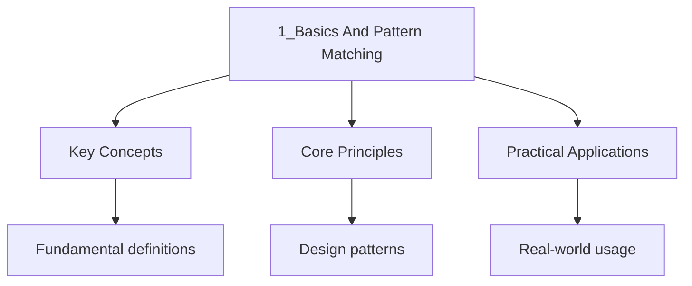

---

title: "Basics and Pattern Matching | Languages"
description: "Elixir has a rich set of built-in data types. Understanding these types and their properties is fundamental to writing idiomatic Elixir code."
date: 2026-06-04T10:00:00.000Z
tags:
  - Elixir
categories:
  - Elixir

---

<!-- Breadcrumb Schema for SEO -->
<script type="application/ld+json">
{
  "@context": "https://schema.org",
  "@type": "BreadcrumbList",
  "itemListElement": [{"name": "Home", "url": "https://wyattau.com"}, {"name": "languages", "url": "https://languages.wyattau.com"}, {"name": "Elixir", "url": "https://languages.wyattau.com/elixir"}, {"name": "01 Basics", "url": "https://languages.wyattau.com/elixir/01-basics"}, {"name": "1_basics And Pattern Matching", "url": "https://languages.wyattau.com/elixir/01-basics/1_basics-and-pattern-matching"}]
}
</script>

## Data Types

Elixir has a rich set of built-in data types. Understanding these types and their properties is
fundamental to writing idiomatic Elixir code.

### Integers

Integers in Elixir have arbitrary precision. There is no fixed-size integer type; the VM
automatically allocates memory as needed for large values.

```elixir
## Decimal notation
42
1_000_000
0xFF       # hexadecimal
0o777      # octal
0b1010     # binary

## Arithmetic
iex> 2 + 3
5
iex> 10 - 4
6
iex> 3 * 7
21
iex> div(10, 3)
3
iex> rem(10, 3)
1

# Arbitrary precision
iex> factorial(50)  # 64-digit number, no overflow
30414093201713378043612608166064768844377641568960512000000000000

# Integer functions
iex> Integer.is_odd(5)
true
iex> Integer.parse("42")
{42, ""}
iex> Integer.to_string(255, 16)
"FF"
```

### Floats

Floats are IEEE 754 double-precision (64-bit) floating-point numbers. They provide approximately
15-17 significant decimal digits of precision.

```elixir
iex> 3.14
3.14
iex> 1.0e3
1000.0
iex> 0.1 + 0.2
0.30000000000000004

# Float functions
iex> Float.round(3.14159, 2)
3.14
iex> Float.ceil(3.2)
4.0
iex> Float.floor(3.8)
3.0
iex> Float.parse("3.14abc")
{3.14, "abc"}
```

Elixir uses `trunc/1` and `round/1` for float-to-integer conversion, and `Float.round/2` for
rounding within float precision.

### Atoms

Atoms are constants whose name is their value. They are globally unique, never garbage-collected
(they persist for the lifetime of the VM), and are used extensively for tagging, keys, and status
codes.

```elixir
iex> :hello
:hello
iex> :ok
:ok
iex> :error
:error
iex> is_atom(:true)
true

# Atoms with special characters
iex> :"hello world"
:"hello world"
iex> :"Elixir.String"
Elixir.String

# Common atom patterns for tagging results
{:ok, value}
{:error, reason}
{:found, result}
{:not_found}

# Boolean atoms
iex> true === true
true
iex> is_boolean(true)
true
# true and false are atoms :true and :false
iex> true == :true
true
iex> false == :false
true

# nil atom
iex> nil === nil
true
iex> is_nil(nil)
true
iex> nil == :nil
true
```

### Strings

Strings in Elixir are UTF-8 encoded binaries. They are not character arrays (unlike C or Erlang"s
string type, which is a list of integers).

```elixir
iex> "hello"
"hello"
iex> "hello" |> String.upcase()
"HELLO"
iex> String.length("hello")
5
iex> byte_size("hello")
5
iex> byte_size("hello")
5
iex> byte_size("cafe")
4
iex> String.length("caf\u00e9")
4

# Graphemes vs bytes
iex> String.graphemes("e\u0301")
["e", "\u0301"]     # 2 graphemes, 1 visual character
iex> String.length("e\u0301")
2
iex> byte_size("e\u0301")
3

# String interpolation
iex> name = "World"
iex> "Hello, #{name}!"
"Hello, World!"

# Heredocs
iex> doc = """
...> This is a multi-line string.
...> It preserves leading whitespace.
...> """
```

### Binaries

Binaries are sequences of bytes enclosed in `<<>>`. Strings are a special case of binaries. Binaries
are fundamental to Erlang/Elixir's approach to handling data efficiently.

```elixir
iex> <<1, 2, 3>>
<<1, 2, 3>>
iex> <<65, 66, 67>>
"ABC"
iex> is_binary("hello")
true
iex> byte_size(<<1, 2, 3>>)
3

# Binary pattern matching
iex> <<first, rest::binary>> = <<1, 2, 3, 4, 5>>
<<1, 2, 3, 4, 5>>
iex> first
1
iex> rest
<<2, 3, 4, 5>>

# Bitstrings with size and type modifiers
iex> <<255::8>>
<<255>>
iex> <<255::8-signed>>
-1
```

### Lists

Lists in Elixir are singly-linked lists. Prepending (`[h | t]`) is $O(1)$; appending (`list ++ [x]`)
is $O(n)$. This is a fundamental property that affects how you write efficient Elixir code.

```elixir
iex> [1, 2, 3]
[1, 2, 3]
iex> [1, 2, 3] ++ [4, 5]
[1, 2, 3, 4, 5]
iex> [1, 2, 3] -- [2]
[1, 3]
iex> hd([1, 2, 3])
1
iex> tl([1, 2, 3])
[2, 3]
iex> [0 | [1, 2, 3]]
[0, 1, 2, 3]

# Lists can contain mixed types
iex> [1, "two", :three, [4]]
[1, "two", :three, [4]]

# List functions
iex> Enum.each([1, 2, 3], fn x -> IO.puts(x) end)
:ok
iex> Enum.map([1, 2, 3], fn x -> x * 2 end)
[2, 4, 6]
iex> Enum.reduce([1, 2, 3], 0, fn x, acc -> x + acc end)
6
iex> Enum.filter([1, 2, 3, 4], fn x -> rem(x, 2) == 0 end)
[2, 4]
iex> Enum.sort([3, 1, 2])
[1, 2, 3]
iex> Enum.uniq([1, 2, 2, 3, 3, 3])
[1, 2, 3]
iex> Enum.reverse([1, 2, 3])
[3, 2, 1]
iex> Enum.count([1, 2, 3])
3
iex> Enum.member?([1, 2, 3], 2)
true
iex> Enum.at([1, 2, 3], 1)
2
iex> Enum.take([1, 2, 3, 4, 5], 3)
[1, 2, 3]
iex> Enum.drop([1, 2, 3, 4, 5], 2)
[3, 4, 5]

# Performance note: prepend is O(1), append is O(n)
# Prefer building lists by prepending and reversing at the end
def build_list(items) do
  items
  |> Enum.reduce([], fn item, acc -> [item | acc] end)
  |> Enum.reverse()
end
```

### Tuples

Tuples are fixed-size containers stored contiguously in memory. Access by index is $O(1)$. Tuples
are commonly used for returning multiple values and for tagged tuples (`{:ok, value}`,
`{:error, reason}`).

```elixir
iex> {:ok, 42}
{:ok, 42}
iex> {:error, :not_found}
{:error, :not_found}
iex> elem({:a, :b, :c}, 0)
:a
iex> elem({:a, :b, :c}, 1)
:b
iex> put_elem({:a, :b, :c}, 1, :x)
{:a, :x, :c}
iex> tuple_size({1, 2, 3})
3

# Tuples are immutable
iex> t = {1, 2, 3}
{1, 2, 3}
iex> put_elem(t, 0, 10)
{10, 2, 3}
iex> t
{1, 2, 3}
```

### Maps

Maps are key-value stores with $O(1)$ lookup, insertion, and deletion. Keys can be any type, though
atoms and strings are most common.

```elixir
iex> %{}
%{}
iex> %{name: "Alice", age: 30}
%{name: "Alice", age: 30}
iex> %{"key" => "value", 1 => :one}
%{1 => :one, "key" => "value"}

# Map access
iex> m = %{name: "Alice", age: 30}
%{name: "Alice", age: 30}
iex> m.name
"Alice"
iex> m[:name]
"Alice"
iex> m[:missing]
nil

# Map updates (creates a new map)
iex> Map.put(m, :age, 31)
%{name: "Alice", age: 31}
iex> %{m | age: 31}
%{name: "Alice", age: 31}
# The update syntax %{map | key: value} raises KeyError if key is missing

# Map functions
iex> Map.keys(%{a: 1, b: 2})
[:a, :b]
iex> Map.values(%{a: 1, b: 2})
[1, 2]
iex> Map.has_key?(%{a: 1}, :a)
true
iex> Map.delete(%{a: 1, b: 2}, :a)
%{b: 2}
iex> Map.merge(%{a: 1}, %{b: 2})
%{a: 1, b: 2}
iex> Map.get(%{a: 1}, :a, :default)
1
iex> Map.get(%{a: 1}, :b, :default)
:default
iex> Map.new([{:a, 1}, {:b, 2}])
%{a: 1, b: 2}
iex> Map.update(%{a: 1}, :a, 0, &(&1 + 10))
%{a: 11}
```

### Keyword Lists

Keyword lists are lists of two-element tuples where the first element is an atom. They preserve
ordering and allow duplicate keys. They are commonly used for options and function arguments.

```elixir
iex> [name: "Alice", age: 30]
[name: "Alice", age: 30]
iex> is_list([name: "Alice"])
true
iex> Keyword.get([name: "Alice", age: 30], :name)
"Alice"
iex> Keyword.put([name: "Alice"], :age, 30)
[name: "Alice", age: 30]
iex> Keyword.has_key?([name: "Alice"], :name)
true
iex> Keyword.delete([name: "Alice", age: 30], :age)
[name: "Alice"]
iex> Keyword.values([name: "Alice", age: 30])
["Alice", 30]
iex> Keyword.keys([name: "Alice", age: 30])
[:name, :age]

# Duplicate keys
iex> kw = [a: 1, a: 2, a: 3]
[a: 1, a: 2, a: 3]
iex> Keyword.get_values(kw, :a)
[1, 2, 3]

# Pattern matching on keyword lists
iex> [name: name] = [name: "Alice", age: 30]
[name: "Alice", age: 30]
iex> name
"Alice"
```

Use maps when keys are known at compile time and you need fast access. Use keyword lists when you
need ordered keys, duplicate keys, or a lightweight option list.

### Ranges

Ranges represent an interval of values with start and end steps:

```elixir
iex> 1..10
1..10
iex> Enum.to_list(1..5)
[1, 2, 3, 4, 5]
iex> Enum.sum(1..100)
5050
iex> Enum.member?(1..10, 5)
true
iex> Enum.count(1..10)
10
iex> 1..0
1..0
iex> Enum.to_list(1..0//-1)
[1, 0]

# Ranges with step (Elixir 1.12+)
iex> Enum.to_list(1..10//2)
[1, 3, 5, 7, 9]
iex> Enum.to_list(10..1//-1)
[10, 9, 8, 7, 6, 5, 4, 3, 2, 1]
```

### PIDs and References

**PIDs** (Process Identifiers) are unique identifiers for BEAM processes. They are opaque values
generated by the VM.

```elixir
iex> pid = self()
#PID<0.123.0>
iex> is_pid(pid)
true
iex> send(pid, :hello)
:hello

# Spawning a process returns its PID
iex> spawn(fn -> IO.puts("in process") end)
#PID<0.124.0>
```

**References** are unique identifiers created with `make_ref/0`. They are guaranteed to be unique
across all nodes in a distributed system.

```elixir
iex> ref = make_ref()
#Reference<0.1234567890.1234567890.12345>
iex> is_reference(ref)
true
```

## Pattern Matching

Pattern matching is one of the most powerful features in Elixir. The `=` operator is not assignment
-- it is a match operator. The left side is a pattern; the right side is a value. If the pattern
matches the value, any unbound variables in the pattern are bound.

### The Match Operator (=)

```elixir
iex> x = 1
1
iex> x
1

iex> {a, b} = {1, 2}
{1, 2}
iex> a
1
iex> b
2

iex> %{name: name} = %{name: "Alice", age: 30}
%{name: "Alice", age: 30}
iex> name
"Alice"

iex> [head | tail] = [1, 2, 3, 4]
[1, 2, 3, 4]
iex> head
1
iex> tail
[2, 3, 4]

# Match failure raises MatchError
iex> {a, b, c} = {1, 2}
** (MatchError) no match of right hand side value: {1, 2}
```

### Pin Operator (^)

The pin operator `^` prevents rebinding of a variable. It forces the match operator to compare
against the current value of the variable rather than rebinding it.

```elixir
iex> x = 1
1
iex> ^x = 1       # matches because x is 1
1
iex> ^x = 2       # raises MatchError
** (MatchError) no match of right hand side value: 2

# Without pin, variable is rebound
iex> x = 1
1
iex> {x, _} = {2, 3}
{2, 3}
iex> x            # x is now 2, rebound by the match
2

# With pin, variable is compared
iex> x = 1
1
iex> {^x, _} = {2, 3}
** (MatchError) no match of right hand side value: {2, 3}

# Common use case: function clauses with guards
def update_user(%{id: id} = user, %{id: ^id} = changes) do
  # id in user must match id in changes
  Map.merge(user, changes)
end
```

### Pattern Matching in Functions

Function clauses use pattern matching on their arguments. Elixir tries each clause in order and
executes the first one that matches.

```elixir
defmodule Geometry do
  def area({:rectangle, width, height}), do: width * height
  def area({:circle, radius}), do: :math.pi() * radius * radius
  def area({:triangle, base, height}), do: 0.5 * base * height
end

iex> Geometry.area({:rectangle, 4, 5})
20
iex> Geometry.area({:circle, 3})
28.274333882308138

# Multiple clauses with guards
defmodule Math do
  def factorial(0), do: 1
  def factorial(n) when n > 0, do: n * factorial(n - 1)

  def classify(n) when n < 0, do: :negative
  def classify(0), do: :zero
  def classify(n) when n > 0, do: :positive
end

# Pattern matching on maps
defmodule User do
  def greet(%{name: name, role: :admin}), do: "Welcome, Admin #{name}"
  def greet(%{name: name}), do: "Hello, #{name}"
end
```

### Guards (when)

Guards provide additional constraints on patterns. They are evaluated after a pattern match
succeeds. Only a limited set of expressions are allowed in guards for safety (they must be free of
side effects and guaranteed to terminate).

**Allowed in guards**:

- Comparison operators: `==`, `!=`, `===`, `!==`, `<`, `>`, `<=`, `>=`
- Boolean operators: `and`, `or`, `not` (use `and`/`or`, not `&&`/`||`)
- Arithmetic operators: `+`, `-`, `*`, `/`
- Type-check functions: `is_atom/1`, `is_binary/1`, `is_bitstring/1`, `is_boolean/1`, `is_float/1`,
  `is_function/1,2`, `is_integer/1`, `is_list/1`, `is_map/1`, `is_number/1`, `is_pid/1`,
  `is_reference/1`, `is_tuple/1`
- Other guard-safe functions: `abs/1`, `binary_part/3`, `bit_size/1`, `byte_size/1`, `div/2`,
  `elem/2`, `hd/1`, `length/1`, `map_size/1`, `node/0,1`, `rem/2`, `round/1`, `self/0`, `tl/1`,
  `trunc/1`, `tuple_size/1`

**NOT allowed in guards**: Custom functions, `&&`, `||`, `if`, `case`, `cond`, `try`, `send`,
`receive`, user-defined functions, or any function with side effects.

```elixir
defmodule Example do
  def check(x) when is_integer(x) and x > 0, do: :positive_int
  def check(x) when is_integer(x) and x < 0, do: :negative_int
  def check(x) when is_float(x), do: :float
  def check(x) when is_binary(x), do: :string
  def check(_), do: :unknown

  def process({:ok, value}) when is_map(value), do: {:ok, Map.size(value)}
  def process({:ok, value}) when is_list(value), do: {:ok, length(value)}
  def process({:error, _} = err), do: err

  # guard with multiple conditions
  def safe_divide(_num, denom) when denom == 0, do: {:error, :division_by_zero}
  def safe_divide(num, denom), do: {:ok, num / denom}

  # in guard (membership check)
  def handle_status(status) when status in [:ok, :success, :complete], do: :done
  def handle_status(status) when status in [:error, :failed], do: :failed
  def handle_status(status) when status in [:pending, :waiting], do: :waiting
end
```

### case Expressions

The `case` expression matches a value against multiple patterns:

```elixir
result = {:ok, %{name: "Alice"}}

case result do
  {:ok, %{name: name}} ->
    "Got name: #{name}"

  {:ok, value} ->
    "Got value: #{inspect(value)}"

  {:error, reason} ->
    "Error: #{reason}"

  other ->
    "Unexpected: #{inspect(other)}"
end

# With guards
case {1, 2, 3} do
  {1, x, 3} when x > 0 -> "positive middle"
  {1, x, 3} when x < 0 -> "negative middle"
  {1, _, _} -> "other"
end

# Case with pin
expected = :ok

case fetch_data() do
  {^expected, data} -> "Data: #{data}"
  other -> "Unexpected: #{inspect(other)}"
end
```

### cond Expressions

`cond` evaluates conditions in order and executes the first truthy one:

```elixir
cond do
  2 * 2 == 5 ->
    "This will not be true"

  2 * 2 == 4 ->
    "This will be true"

  true ->
    "Default (always true)"
end

# Practical example
defmodule Temperature do
  def describe(temp) do
    cond do
      temp >= 40 -> "extremely hot"
      temp >= 30 -> "hot"
      temp >= 20 -> "warm"
      temp >= 10 -> "cool"
      temp >= 0 -> "cold"
      true -> "below freezing"
    end
  end
end
```

### with Expressions

The `with` expression chains pattern matches, often used for sequential operations that can fail. If
any pattern fails to match, the `else` clause is evaluated.

```elixir
with {:ok, user} <- fetch_user(id),
     {:ok, posts} <- fetch_posts(user),
     {:ok, profile} <- fetch_profile(user) do
  %{user: user, posts: posts, profile: profile}
else
  {:error, :not_found} -> {:error, :user_not_found}
  {:error, _reason} -> {:error, :fetch_failed}
  error -> {:error, error}
end

# with allows bare expressions (not just <- matches)
with {:ok, user} <- fetch_user(id),
     posts = fetch_all_posts(user),
     count = Enum.count(posts),
     count > 0 do
  {:ok, %{user: user, post_count: count}}
else
  _ -> {:error, :no_posts}
end
```

The `with` expression is particularly useful for eliminating deeply nested `case` statements. Each
`<-` line acts as a pattern match; if the match fails, execution jumps to the `else` block. If a
bare `=` is used instead of `<-`, match failures raise `MatchError` as normal.

### receive Expressions

`receive` is used to match messages in a process mailbox:

```elixir
receive do
  {:greet, name} ->
    "Hello, #{name}!"

  {:calc, a, b} ->
    a + b

  {:error, reason} ->
    {:error, reason}

after
  5000 ->
    :timeout
end
```

The `after` clause provides a timeout. If no matching message arrives within the specified
milliseconds, the `after` block executes.

## Variable Binding Semantics

### Rebinding vs Mutation

In Elixir, "reassigning" a variable does not mutate the existing value. It creates a new binding.
The old value remains unchanged and will eventually be garbage-collected if no references remain.

```elixir
x = 1      # x points to 1
x = x + 1  # x now points to 2; the value 1 is unchanged
# This is syntactic sugar for creating a new binding
```

This distinction matters in closures and function bodies:

```elixir
defmodule Closure do
  def create_counter(start) do
    # The variable 'start' is captured by the closure
    # but since Elixir is immutable, this doesn't cause issues
    fn -> start end
  end

  # Each call to create_counter creates a new closure with its own captured value
end
```

### Scope

Variables have lexical scope within their enclosing block (function body, case clause, etc.). A
variable bound inside a `case`, `cond`, `with`, or `receive` is not visible outside that block.
However, variables bound before the block are visible inside and after the block.

```elixir
x = 1

case 10 do
  n ->
    x = n   # this creates a NEW binding, shadows outer x
    y = 20  # y is local to this clause
end

# x is still 1 here, NOT 10
# y is not defined here
```

Inside function clauses, each clause has its own scope. Variables bound in one clause are not
available in others.

## Sigils

Sigils are mechanisms for working with textual representations. They start with `~` followed by a
letter and a delimiter (`"` or `/`).

### ~s (String Sigil)

```elixir
~s(hello world)
# equivalent to "hello world"

~s(Hello #{name})  # interpolation works
# equivalent to "Hello #{name}"

# Useful when string contains double quotes
~s(He said "hello" to her)
# equivalent to "He said \"hello\" to her"

# Alternate delimiters
~s|hello|
~s[hello]
~s{hello}
~s(hello)
~s<hello>
```

### ~w (Word Sigil)

Creates a list of strings:

```elixir
~w(apple banana cherry)
["apple", "banana", "cherry"]

~w(apple banana cherry)a
[:apple, :banana, :cherry]   # 'a' modifier: atoms

~w(1 2 3)c
[1, 2, 3]                    # 'c' modifier: charlist

# With interpolation modifier
~w(#{first} #{second})s
["first", "second"]  # without 'i' modifier, no interpolation

~w(#{first} #{second})si
["first value", "second value"]  # with 'i' modifier, interpolation
```

Sigil modifiers:

- `s` - string (default)
- `a` - atom list
- `c` - charlist
- `S` - string, no escaping
- `A` - atom list, no escaping
- `C` - charlist, no escaping
- `i` - enable interpolation
- `w` - (modifier `w` is part of `~w`, not a modifier itself)

### ~r (Regex Sigil)

```elixir
~r/hello/
~r/hello/i  # case insensitive
~r/hello/gim  # global, case insensitive, multiline

# Regex.match?
Regex.match?(~r/foo/, "foobar")
# true

# Regex.run
Regex.run(~r/(\d+)/, "abc123def")
["123", "123"]

# Regex.scan
Regex.scan(~r/\d+/, "abc 123 def 456")
[["123"], ["456"]]

# Regex.replace
Regex.replace(~r/\d+/, "abc 123 def", "NUM")
"abc NUM def"

# Regex.split
Regex.split(~r/\s+/, "hello  world   from   elixir")
["hello", "world", "from", "elixir"]

# Sigil R (returns Regex, no escape processing)
~R/\d+/
# Same as ~r but doesn't process escape sequences in the delimiter
```

### ~c and ~C (Charlist Sigils)

```elixir
~c(hello)
# ['h', 'e', 'l', 'l', 'o']

~c(#{name})
# interpolation, then to charlist

~C(hello)
# no interpolation, to charlist
```

### Custom Sigils

You can define custom sigils with `sigil_X`:

```elixir
defmodule MySigils do
  def sigil_u(string, _opts) do
    String.upcase(string)
  end
end

import MySigils
~u(hello world)
# "HELLO WORLD"
```

## Operators and Expressions

### Comparison Operators

Elixir provides two sets of equality operators:

```elixir
# == - structural equality (with type coercion)
iex> 1 == 1.0
true
iex> 1 == :one
false

# === - strict equality (no type coercion)
iex> 1 === 1.0
false
iex> 1 === 1
true

# !== - strict inequality
iex> 1 !== 1.0
true

# != - structural inequality
iex> 1 != 2
true

# Ordering: <, >, <=, >=
iex> 1 < 2
true
iex> "a" < "b"
true
# Terms are compared by type ordering:
# number < atom < reference < function < port < pid < tuple < map < list < bitstring
```

### Boolean Operators

```elixir
# and, or, not - strict (require boolean operands)
iex> true and false
false
iex> true or false
true
iex> not true
false

# &&, ||, ! - relaxed (accept any value, return first truthy/falsy)
iex> 1 && 2
2
iex> nil && 2
nil
iex> 1 || 2
1
iex> nil || 2
2
iex> !true
false
```

Use `and`/`or`/`not` in guards (required) and when you want strict boolean semantics. Use
`&&`/`||`/`!` for general truthy/falsy evaluation.

### Pipe Operator (|>)

The pipe operator passes the result of one expression as the first argument to the next:

```elixir
# Without pipe
String.trim(String.upcase("  hello  "))

# With pipe
"  hello  "
|> String.trim()
|> String.upcase()
# "HELLO"

# Chaining
[1, 2, 3, 4, 5]
|> Enum.map(&(&1 * 2))
|> Enum.filter(&(&1 > 4))
|> Enum.sum()
# 18

# The pipe is syntactic sugar:
# expr |> fun(args)  ===  fun(expr, args)
```

## Immutability in Practice

### Structural Sharing

When Elixir creates new versions of data structures, it shares memory with the original where
possible. This makes immutable operations efficient.

```elixir
# List prepend is O(1) - new head points to existing tail
list = [3, 4, 5]
new_list = [1, 2 | list]
# new_list = [1, 2, 3, 4, 5]
# The tail [3, 4, 5] is shared between list and new_list

# Map updates share unchanged parts
original = %{a: 1, b: 2, c: %{x: 10, y: 20}}
updated = %{original | b: 99}
# 'updated' shares the sub-map %{x: 10, y: 20} with 'original'
```

### Performance Implications

Understanding immutability's performance characteristics:

| Operation                 | Time Complexity | Notes                     |
| ------------------------- | --------------- | ------------------------- |
| List prepend `[h\|t]`     | $O(1)$          | Always prefer over append |
| List append `list ++ [x]` | $O(n)$          | Copies entire list        |
| Map access `map.key`      | $O(1)$          |                           |
| Map update `%{m \| k: v}` | $O(1)$          | With structural sharing   |
| Tuple access `elem(t, i)` | $O(1)$          |                           |
| Tuple update `put_elem`   | $O(n)$          | Must copy the tuple       |

### When Immutability Matters Most

1. **Concurrency**: No locks needed since data cannot change
2. **Debugging**: Values are predictable and traceable
3. **Undo/redo**: Keep old versions of data for free
4. **Caching**: Results of pure functions can be safely cached
5. **Testing**: No setup/teardown needed for state mutation

## Intuition

**Pattern matching is a postal sorting office:** Each value is a letter, and each pattern is an address template. The `=` operator doesn't assign — it routes. The left side says "I expect a letter shaped like this"; if it fits, the variables get bound to the pieces. The pin operator `^` is like saying "this slot must match the *exact* letter I already have" rather than accepting any letter and labeling it. Guards are additional filters: "only route letters that are heavier than 100g."

**Why it matters:** Pattern matching replaces defensive type-checking with declarative routing. Instead of `if (x is List && x.length > 0)` you write `[head | tail]` — the structure *is* the check. This makes Elixir code concise and the intent obvious.

**The key insight:** In Elixir, `=` is not assignment — it's a match operator that binds variables only if the structure fits. This single concept powers function dispatch, case expressions, and error handling throughout the language.




## Summary

Elixir's type system is simple but powerful. The combination of basic types (atoms, tuples, lists,
maps, binaries) with pattern matching and guards creates a concise and expressive way to destructure
and process data. Key takeaways:

- Pattern matching (`=`) is fundamental to Elixir, used everywhere
- The pin operator (`^`) prevents rebinding when you need comparison
- Guards (`when`) add constraints to patterns but have limited allowed expressions
- Keyword lists are lists, maps are hash tables -- choose based on access patterns
- The pipe operator (`|>`) makes data transformations readable
- Immutability enables safe concurrency without locks

## Cross-References

- **[Elixir Introduction](../00-intro/1_elixir-intro.md):** Language overview and motivation before diving into data types.
- **[Metaprogramming](../04-advanced/1_metaprogramming.md):** Uses pattern matching with quote/unquote for compile-time code generation.
- **[Elixir Flashcards](../flashcards-elixir-basics.mdx):** Interactive flashcards covering pattern matching and type concepts.
- **[Elixir Practice](../practice-elixir-basics.mdx):** Auto-graded problems testing pattern matching and guard clauses.

## Common Mistakes

**Using `=` as assignment instead of match:** In Elixir, `=` is a match operator, not assignment. On the first use it binds, but subsequent uses must match the existing value. Forgetting this causes unexpected `MatchError` exceptions.

**Using `&&`/`||` in guards:** Guards require strict boolean operators `and`/`or`/`not`. Using `&&`/`||` causes a compile error because they accept any truthy/falsy value, not just booleans.

**Forgetting the pin operator `^` in case clauses:** Without `^`, a variable in a case clause rebinds instead of comparing. This silently accepts any value instead of matching the expected one.
