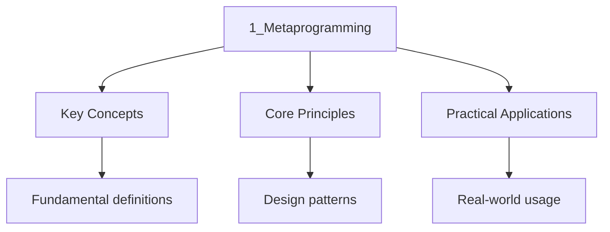

---

title: "Metaprogramming | Languages - Wyatt's Notes"
description: "Metaprogramming in Elixir is the ability to write code that generates or transforms code at compile time. The primary mechanism for this is the system,"
date: 2026-06-04T10:00:00.000Z
tags:
  - Elixir
categories:
  - Elixir

---

<!-- Breadcrumb Schema for SEO -->
<script type="application/ld+json">
{
  "@context": "https://schema.org",
  "@type": "BreadcrumbList",
  "itemListElement": [{"name": "Home", "url": "https://wyattau.com"}, {"name": "languages", "url": "https://languages.wyattau.com"}, {"name": "Elixir", "url": "https://languages.wyattau.com/elixir"}, {"name": "04 Advanced", "url": "https://languages.wyattau.com/elixir/04-advanced"}, {"name": "1_metaprogramming", "url": "https://languages.wyattau.com/elixir/04-advanced/1_metaprogramming"}]
}
</script>

## What Is Metaprogramming?

Metaprogramming in Elixir is the ability to write code that generates or transforms code at compile
time. The primary mechanism for this is the **macro** system, which allows you to manipulate the
Abstract Syntax Tree (AST) of Elixir code before it is compiled.

Elixir"s macro system is similar to Lisp's but with important differences:

- Macros operate on Elixir's own AST representation, not S-expressions
- Macros are hygienic by default (they do not accidentally capture or overwrite variables)
- Macros are compiled, not interpreted
- The boundary between macros and functions is explicit

## The AST

Every piece of Elixir code is represented internally as an AST. The AST is a three-element tuple:

```
{atom, metadata, arguments}
```

- **First element**: An atom representing the operation (e.g., `:+`, `:def`, `:if`)
- **Second element**: A keyword list of metadata (line numbers, context, etc.)
- **Third element**: A list of arguments (which may themselves be AST tuples)

### Basic AST Examples

```elixir
iex> quote do: 1 + 2
{:+, [context: Elixir, imports: [{2, Kernel}]], [1, 2]}

iex> quote do: "hello"
"hello"
## Literals represent themselves (they are not tuples)

iex> quote do: x
{:x, [], Elixir}
## Variables are three-element tuples: {name, meta, context}

iex> quote do: foo(1, 2)
{:foo, [], [1, 2]}

iex> quote do: 1 + 2 * 3
{:+, [],
 [{:+, [context: Elixir, imports: [{2, Kernel}]], [1, {:+, [context: Elixir, imports: [{2, Kernel}]], [2, 3]}}]}
# Note: Elixir optimizes this at parse time

iex> quote do: [1, 2, 3]
[1, 2, 3]
# Lists represent themselves

iex> quote do: {a, b}
{:{}, [], [{:a, [], Elixir}, {:b, [], Elixir}]}
# Tuples larger than 2 elements are wrapped in :{} for disambiguation
```

### Inspecting the AST

```elixir
iex> ast = quote do
...>   if x > 0 do
...>     :positive
...>   else
...>     :negative
...>   end
...> end

iex> Macro.to_string(ast)
"if(x() > 0, do: :positive, else: :negative)"

iex> Macro.to_string(ast) |> IO.puts()
if(x() > 0) do
  :positive
else
  :negative
end
```

## quote and unquote

### quote

`quote` converts Elixir code into its AST representation. It is the fundamental building block of
metaprogramming:

```elixir
iex> ast = quote do
...>   name = "Alice"
...>   "Hello, #{name}!"
...> end
{{:name, [], Elixir}, "Hello, Alice!"}

iex> quote do: defmodule Foo do
...>   def bar, do: :baz
...> end
{:defmodule, [context: Elixir, imports: [{2, Kernel}]],
 [{:__aliases__, [alias: false], [:Foo]},
  [do: {:def, [context: Elixir, imports: [{2, Kernel}]],
    [{:bar, [], Elixir}, [do: :baz]]}]]}
```

### unquote

`unquote` injects a runtime value into a quoted expression. It is the bridge between the macro's
runtime context and the generated AST:

```elixir
defmodule MyMacros do
  defmacro define_getter(name) do
    quote do
      def unquote(name)(), do: fetch_value(unquote(name))
    end
  end
end

require MyMacros
MyMacros.define_getter(:username)
# Expands to: def username(), do: fetch_value(:username)

# unquote with expressions
defmacro add_logging(function_name, body) do
  quote do
    def unquote(function_name)(args) do
      IO.puts("Calling #{unquote(function_name)}")
      result = unquote(body)
      IO.puts("Result: #{inspect(result)}")
      result
    end
  end
end
```

### unquote_splicing

`unquote_splicing` inserts a list of AST nodes into a parent structure, flattening the list:

```elixir
defmacro define_functions(names) do
  quote do
    unquote_splicing(
      for name <- names do
        quote do
          def unquote(name)(), do: unquote(name)
        end
      end
    )
  end
end

require MyMacros
MyMacros.define_functions([:foo, :bar, :baz])
# Expands to:
# def foo(), do: :foo
# def bar(), do: :bar
# def baz(), do: :baz
```

Without `unquote_splicing`, inserting a list would wrap it in an extra list layer:

```elixir
# WRONG: this creates a nested list
quote do
  defmodule MyModule do
    unquote(list_of_defs)  # the defs are wrapped in a list
  end
end

# RIGHT: unquote_splicing flattens the list into the parent
quote do
  defmodule MyModule do
    unquote_splicing(list_of_defs)
  end
end
```

## defmacro and defmacrop

### defmacro

`defmacro` defines a macro that is expanded at compile time. When the compiler encounters a macro
call, it expands it into the generated AST before compilation continues:

```elixir
defmodule MyMacros do
  defmacro unless(condition, do: do_block, else: else_block) do
    quote do
      if unquote(condition) do
        unquote(else_block || nil)
      else
        unquote(do_block)
      end
    end
  end
end

# Before compilation:
require MyMacros
MyMacros.unless false do
  IO.puts("This runs because condition is false")
else
  IO.puts("This does NOT run")
end

# After macro expansion (what the compiler sees):
if false do
  nil
else
  IO.puts("This runs because condition is false")
end
```

### defmacrop

`defmacrop` defines a private macro, callable only within the defining module:

```elixir
defmodule Builder do
  defmacrop build_clause(name, value) do
    quote do
      def unquote(name)(), do: unquote(value)
    end
  end

  defmacro build_all(clauses) do
    for {name, value} <- clauses do
      build_clause(name, value)
    end
  end
end
```

### When to Use Macros

Use macros only when:

1. You need to create new syntactic constructs (e.g., `if`, `unless`, `defrecord`)
2. You need to inject code based on module attributes at compile time
3. You are implementing a DSL (Domain Specific Language)
4. You need to perform compile-time code analysis or generation

Prefer regular functions when:

1. The code can be written as a normal function call
2. You do not need to manipulate the AST
3. Performance does not require compile-time expansion
4. Readability is more important than reducing boilerplate

```elixir
# Good macro use: DSL
defmigration "create_users" do
  create_table "users" do
    add :name, :string, null: false
    add :email, :string, null: false
    add :age, :integer, default: 0
    timestamps()
  end
end

# Bad macro use: simple function
# DON'T do this:
defmacro add(a, b), do: quote do: unquote(a) + unquote(b)
# DO this instead:
def add(a, b), do: a + b
```

## Macros vs Functions

The key distinction: **functions evaluate their arguments at the call site, macros receive
unevaluated AST as arguments**.

```elixir
defmodule Debug do
  # Function: arguments are evaluated before the function runs
  def inspect_arg(arg) do
    IO.puts("Value: #{inspect(arg)}")
    arg
  end

  # Macro: arguments are NOT evaluated -- they are AST
  defmacro debug_expr(expr) do
    string = Macro.to_string(expr)
    quote do
      IO.puts("Expression: #{unquote(string)}")
      IO.puts("Value: #{inspect(unquote(expr))}")
      unquote(expr)
    end
  end
end

require Debug

# Function: 1 + 2 is evaluated to 3 before being passed
Debug.inspect_arg(1 + 2)
# Value: 3

# Macro: 1 + 2 is passed as AST, both expression and value shown
Debug.debug_expr(1 + 2)
# Expression: 1 + 2
# Value: 3
```

## The Macro Module

The `Macro` module provides utilities for working with AST:

### Macro.escape/1

Converts an Elixir value into its AST representation:

```elixir
iex> Macro.escape([1, 2, 3])
[1, 2, 3]
# Simple values are their own AST

iex> Macro.escape(%{a: 1})
{:%{}, [], [a: 1]}
# Maps need escaping to become AST

iex> Macro.escape({1, 2, 3})
{:{}, [], [1, 2, 3]}
# Large tuples need wrapping

# Useful in macros when injecting runtime values
defmacro create_map(pairs) do
  escaped = Macro.escape(pairs)
  quote do: unquote(escaped)
end
```

### Macro.expand/2

Expands a macro or expression to its final form:

```elixir
iex> require Logger
iex> Macro.expand(quote(do: Logger.info("hi")), __ENV__)
{:ok, {:info, [context: Logger, imports: [{1, Kernel}]],
  ["hi", []]}}
```

### Macro.to_string/2

Converts an AST back to source code string:

```elixir
iex> Macro.to_string(quote do: if(x, do: y, else: z))
"if(x, do: y, else: z)"

iex> ast = quote do: Enum.map([1, 2, 3], &(&1 * 2))
iex> Macro.to_string(ast)
"Enum.map([1, 2, 3], &(&1 * 2))"
```

### Macro.var/2

Creates a variable AST node:

```elixir
iex> Macro.var(:x, __MODULE__)
{:x, [], MyModule}
# Creates a variable :x in the context of MyModule
```

### Macro.validate/1

Validates that a quoted expression is a valid AST:

```elixir
iex> Macro.validate(quote do: 1 + 2)
:ok
iex> Macro.validate({:bad, 1, 2, 3})
{:error, :invalid_ast}
```

## Compile-Time vs Runtime

### Understanding the Boundary

Macros execute at compile time. They have access to:

- Module name and attributes
- Environment information (`__MODULE__`, `__CALLER__`, `__ENV__`)
- Other macros (via `require`)

Macros do NOT have access to:

- Runtime values (user input, database results, etc.)
- Functions defined in other modules at runtime
- Process state

```elixir
defmodule Example do
  @version "1.0.0"

  # @version is available at compile time
  defmacro version, do: @version

  # This works: compile-time value
  defmacro version_string do
    quote do
      "MyApp v" <> unquote(@version)
    end
  end
end
```

### **CALLER** and **ENV**

`__CALLER__` in a macro gives access to the calling environment (where the macro is invoked).
`__ENV__` gives access to the current environment (where the macro is defined).

```elixir
defmodule Tracer do
  defmacro trace(expr) do
    file = __CALLER__.file
    line = __CALLER__.line

    quote do
      result = unquote(expr)
      IO.puts("#{unquote(file)}:#{unquote(line)}: #{unquote(Macro.to_string(expr))} = #{inspect(result)}")
      result
    end
  end
end
```

### **using** Macro

The `use` macro calls `__using__/1` on the target module. This is the standard mechanism for
injecting code when a module is `use`d:

```elixir
defmodule LoggerBackend do
  defmacro __using__(_opts) do
    quote do
      import LoggerBackend, only: [log: 1, log: 2]

      @before_compile LoggerBackend
    end
  end

  defmacro __before_compile__(env) do
    module_functions = Module.definitions_in(env.module, :def)
    count = length(module_functions)

    quote do
      def __function_count__, do: unquote(count)
    end
  end
end

defmodule MyApp.Service do
  use LoggerBackend

  def process(data), do: data
  def validate(data), do: is_map(data)
end

# MyApp.Service now has:
# - imported log/1 and log/2 functions
# - __function_count__/0 returning 2
```

## Hygiene

### Variable Hygiene

Elixir macros are hygienic by default. Variables defined inside a macro do not leak into the
caller's scope, and the caller's variables are not accessible inside the macro:

```elixir
defmodule Hygienic do
  defmacro create_variable do
    quote do
      x = 10
      x
    end
  end

  defmacro create_unhygienic do
    quote do
      var!(x) = 10
      var!(x)
    end
  end
end

require Hygienic

x = 1
Hygienic.create_variable()
# Returns 10, but x in caller's scope is still 1

x = 1
Hygienic.create_unhygienic()
# Returns 10, and x in caller's scope is NOW 10

# bind_quoted preserves hygiene while allowing variable injection
defmacro safe_log(var) do
  quote bind_quoted: [var: var] do
    IO.puts("Value: #{inspect(var)}")
  end
end
```

### var! and bind_quoted

`var!` breaks hygiene, allowing a macro to access or set the caller's variables:

```elixir
defmacro set_caller_var(name, value) do
  quote do
    var!(unquote(name)) = unquote(value)
  end
end

# In the caller's scope:
set_caller_var(:count, 42)
# count is now 42 in the caller's scope
```

`bind_quoted` safely injects values into a quoted block while preserving hygiene:

```elixir
defmacro create_getter(key) do
  quote bind_quoted: [key: key] do
    def get(), do: Map.get(config(), key)
  end
end
```

## Practical Macro Examples

### Implementing defrecord (simplified)

```elixir
defmodule RecordDef do
  defmacro defrecord(name, fields) do
    field_atoms = Keyword.keys(fields)

    quote do
      defstruct unquote(field_atoms)

      def new(attrs \\\\ []) do
        struct(__MODULE__, attrs)
      end

      def get(record, key) do
        Map.get(record, key)
      end

      unquote_splicing(
        for {field, default} <- fields do
          quote do
            def unquote(field)(record) do
              Map.get(record, unquote(field), unquote(Macro.escape(default)))
            end

            def unquote(:"set_#{field}")(record, value) do
              Map.put(record, unquote(field), value)
            end
          end
        end
      )
    end
  end
end

require RecordDef

RecordDef.defrecord(User, name: "Unknown", age: 0)

# Generates:
# defstruct [:name, :age]
# def new(attrs \\ []), do: struct(__MODULE__, attrs)
# def get(record, key), do: Map.get(record, key)
# def name(record), do: Map.get(record, :name, "Unknown")
# def set_name(record, value), do: Map.put(record, :name, value)
# def age(record), do: Map.get(record, :age, 0)
# def set_age(record, value), do: Map.put(record, :age, value)
```

### Assertion Macro

```elixir
defmodule Assertion do
  defmacro assert({operator, _, [left, right]} = expr) do
    left_str = Macro.to_string(left)
    right_str = Macro.to_string(right)

    quote bind_quoted: [left: left, right: right, left_str: left_str,
                         right_str: right_str, operator: operator] do
      result = apply(Kernel, operator, [left, right])

      unless result do
        raise """
        Assertion failed:
          #{left_str} #{operator} #{right_str}
          left:  #{inspect(left)}
          right: #{inspect(right)}
        """
      end

      result
    end
  end
end

require Assertion
Assertion.assert(1 + 2 == 3)
# Passes silently

Assertion.assert(1 + 2 == 5)
# Raises: Assertion failed: 1 + 2 == 5, left: 3, right: 5
```

### Routing DSL Macro

```elixir
defmodule Router do
  defmacro __using__(_opts) do
    quote do
      import Router, only: [get: 2, post: 2, put: 2, delete: 2]
      @routes []
      @before_compile Router
    end
  end

  defmacro __before_compile__(_env) do
    quote do
      def routes, do: @routes
    end
  end

  defmacro get(path, handler) do
    quote do
      @routes [{:get, unquote(path), unquote(handler)} | @routes]
    end
  end

  defmacro post(path, handler) do
    quote do
      @routes [{:post, unquote(path), unquote(handler)} | @routes]
    end
  end

  defmacro put(path, handler) do
    quote do
      @routes [{:put, unquote(path), unquote(handler)} | @routes]
    end
  end

  defmacro delete(path, handler) do
    quote do
      @routes [{:delete, unquote(path), unquote(handler)} | @routes]
    end
  end
end

defmodule MyRouter do
  use Router
  get "/users", UserController
  get "/users/:id", UserController
  post "/users", UserController
end
```

## @compile Attributes

Elixir provides `@compile` attributes for controlling compilation behavior:

```elixir
defmodule MyModule do
  # Remove debug info for smaller BEAM files
  @compile {:debug_info, false}

  # Enable inline expansion (aggressive inlining)
  @compile :inline_list_funcs

  # Warn on unused variables
  @compile :warn_unused_vars

  # Specific function inlining
  @compile {:inline, my_func: 1, other_func: 2}
end
```

## Protocol Consolidation

Protocol consolidation merges all protocol implementations into a single module for faster dispatch:

```elixir
# mix.exs configuration
def project do
  [
    # ...
    consolidate_protocols: Mix.env() != :test
  ]
end

# Manual consolidation
Protocol.consolidate(Size, [List, Map, Tuple])
# Writes a consolidated .beam file
```

Consolidation is the default in production builds. It eliminates the dispatch overhead of looking up
implementations at runtime.

## Intuition

**Macros are code-generating assembly lines:** In Elixir, `quote` is the blueprint that captures the shape of code without building it. `unquote` is the instruction that says "put this specific part here." A macro is an assembly line that takes blueprints as input and produces new blueprints as output — all at compile time. Hygiene is the safety railing that prevents the assembly line from accidentally mixing up parts from different batches.

**Why it matters:** Metaprogramming eliminates boilerplate by generating repetitive code at compile time. The `use` macro is how Elixir libraries inject behavior into your modules — when you write `use GenServer`, a macro expands into all the callback definitions you need.

**The key insight:** Macros operate on AST (abstract syntax trees), not text. This means they understand code structure, not just string patterns, making them safer and more composable than text-based code generation.




## Summary

Elixir's metaprogramming system is powerful but should be used judiciously:

- `quote` converts code to AST (a three-element tuple `{atom, meta, args}`)
- `unquote` injects runtime values into quoted expressions
- `unquote_splicing` flattens a list of AST nodes into a parent structure
- `defmacro` defines compile-time code-generating functions
- Macros receive unevaluated AST; functions receive evaluated values
- Hygiene prevents variable name collisions between macros and callers
- `var!` breaks hygiene for intentional variable sharing
- `bind_quoted` safely injects values while preserving hygiene
- `__using__/1` is the hook for the `use` macro
- Use macros for DSLs and compile-time code generation, not for simple functions

## Cross-References

- **[Basics and Pattern Matching](../01-basics/1_basics-and-pattern-matching.md):** Pattern matching used in macro dispatch and guard clauses.
- **[Elixir Introduction](../00-intro/1_elixir-intro.md):** Language overview covering the functional paradigm macros extend.

## Common Mistakes

**Using functions where macros are needed:** Compile-time code generation (DSLs, `defstruct`, `defprotocol`) requires macros. Using regular functions for these tasks fails because they receive evaluated values, not AST.

**Forgetting `quote`/`unquote` boundaries:** Writing code outside `quote` blocks in a macro executes at compile time, not injecting into the caller. Always wrap generated code in `quote do...end`.

**Breaking hygiene with `var!` unnecessarily:** `var!` escapes the macro's hygiene boundary, risking variable name collisions with the caller. Only use `var!` when you explicitly need to modify the caller's scope.
