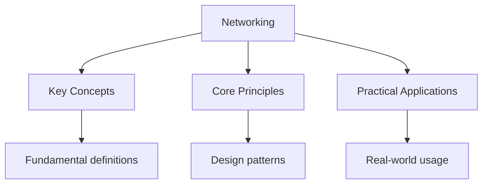

---

title: "Networking | Languages - Wyatt's Notes"
description: 'The package provides TCP support via and : Comprehensive educational content coverage with definitions, worked examples, and practice problems.'
date: 2026-05-31
tags:
  - Go
categories:
  - Go
---

<!-- Breadcrumb Schema for SEO -->
<script type="application/ld+json">
{
  "@context": "https://schema.org",
  "@type": "BreadcrumbList",
  "itemListElement": [{"name": "Home", "url": "https://wyattau.com"}, {"name": "languages", "url": "https://languages.wyattau.com"}, {"name": "Go", "url": "https://languages.wyattau.com/go"}, {"name": "Advanced", "url": "https://languages.wyattau.com/go/advanced"}, {"name": "Networking", "url": "https://languages.wyattau.com/go/advanced/networking"}]
}
</script>

## TCP/UDP

### TCP Connections

The `net` package provides TCP support via `net.Dial` and `net.Listen`:

```go
// Client
conn, err := net.Dial("tcp", "localhost:8080")
if err != nil {
    log.Fatal(err)
}
defer conn.Close()

_, err = conn.Write([]byte("hello"))
if err != nil {
    log.Fatal(err)
}

buf := make([]byte, 1024)
n, err := conn.Read(buf)
fmt.Println(string(buf[:n]))
```

```go
// Server
listener, err := net.Listen("tcp", ":8080")
if err != nil {
    log.Fatal(err)
}
defer listener.Close()

for {
    conn, err := listener.Accept()
    if err != nil {
        log.Println(err)
        continue
    }
    go handleConnection(conn)
}
```

### Timeouts and Deadlines

Always set timeouts. Without them, reads and writes can block indefinitely:

```go
conn, err := net.DialTimeout("tcp", "localhost:8080", 5*time.Second)

conn.SetReadDeadline(time.Now().Add(10 * time.Second))
conn.SetWriteDeadline(time.Now().Add(10 * time.Second))
```

### UDP Packets

```go
addr, err := net.ResolveUDPAddr("udp", "localhost:9090")
conn, err := net.DialUDP("udp", nil, addr)

conn.Write([]byte("hello"))
buf := make([]byte, 1024)
n, _, err := conn.ReadFromUDP(buf)
```

## HTTP Client

### Advanced http.Client

```go
client := &http.Client{
    Timeout: 30 * time.Second,
    Transport: &http.Transport{
        MaxIdleConns:        100,
        MaxIdleConnsPerHost: 10,
        IdleConnTimeout:     90 * time.Second,
        TLSClientConfig: &tls.Config{
            MinVersion: tls.VersionTLS12,
        },
    },
}
```

### Timeouts

Three separate timeout controls:

```go
client := &http.Client{
    Timeout: 30 * time.Second,         // overall request timeout
    Transport: &http.Transport{
        DialContext: (&net.Dialer{
            Timeout:   5 * time.Second,  // connection timeout
        }).DialContext,
        TLSHandshakeTimeout:   10 * time.Second,  // TLS handshake
        ResponseHeaderTimeout: 10 * time.Second,  // first response byte
    },
}
```

### Redirects and Cookies

```go
client := &http.Client{
    CheckRedirect: func(req *http.Request, via []*http.Request) error {
        if len(via) >= 5 {
            return fmt.Errorf("stopped after 5 redirects")
        }
        return nil
    },
    Jar: http.CookieJar(nil),
}
```

## HTTP Server

### Advanced Routing

```go
mux := http.NewServeMux()
mux.HandleFunc("/users/", usersHandler)
mux.HandleFunc("/users/create", createUserHandler)
mux.HandleFunc("/health", healthHandler)

srv := &http.Server{
    Addr:    ":8080",
    Handler: mux,
}
srv.ListenAndServe()
```

Note: `ServeMux` uses longest-prefix matching. `/users/` matches `/users/123` but `/users` matches
only exactly `/users`.

### Middleware Chains

```go
type Middleware func(http.Handler) http.Handler

func Logging(next http.Handler) http.Handler {
    return http.HandlerFunc(func(w http.ResponseWriter, r *http.Request) {
        start := time.Now()
        next.ServeHTTP(w, r)
        log.Printf("%s %s %v", r.Method, r.URL.Path, time.Since(start))
    })
}

func Auth(next http.Handler) http.Handler {
    return http.HandlerFunc(func(w http.ResponseWriter, r *http.Request) {
        token := r.Header.Get("Authorization")
        if token == "" {
            http.Error(w, "unauthorized", http.StatusUnauthorized)
            return
        }
        next.ServeHTTP(w, r)
    })
}

func Chain(h http.Handler, mws ...Middleware) http.Handler {
    for i := len(mws) - 1; i >= 0; i-- {
        h = mws[i](h)
    }
    return h
}

handler := Chain(mux, Logging, Auth)
```

### Graceful Shutdown

```go
srv := &http.Server{Addr: ":8080", Handler: mux}

go func() {
    sigCh := make(chan os.Signal, 1)
    signal.Notify(sigCh, syscall.SIGINT, syscall.SIGTERM)
    <-sigCh

    ctx, cancel := context.WithTimeout(context.Background(), 10*time.Second)
    defer cancel()
    srv.Shutdown(ctx)
}()

srv.ListenAndServe()
```

### Context Propagation

Always propagate `context.Context` through handlers:

```go
func handler(w http.ResponseWriter, r *http.Request) {
    ctx := r.Context()
    ctx, cancel := context.WithTimeout(ctx, 5*time.Second)
    defer cancel()

    data, err := fetchData(ctx)
    // ...
}
```

## WebSockets

Using `gorilla/websocket`:

```go
var upgrader = websocket.Upgrader{
    ReadBufferSize:  1024,
    WriteBufferSize: 1024,
    CheckOrigin: func(r *http.Request) bool { return true },
}

func wsHandler(w http.ResponseWriter, r *http.Request) {
    conn, err := upgrader.Upgrade(w, r, nil)
    if err != nil {
        log.Println(err)
        return
    }
    defer conn.Close()

    for {
        msgType, msg, err := conn.ReadMessage()
        if err != nil {
            break
        }
        err = conn.WriteMessage(msgType, msg)
        if err != nil {
            break
        }
    }
}
```

### Ping/Pong

```go
func readPump(conn *websocket.Conn) {
    defer conn.Close()
    conn.SetReadLimit(512)
    conn.SetReadDeadline(time.Now().Add(60 * time.Second))
    conn.SetPongHandler(func(string) error {
        conn.SetReadDeadline(time.Now().Add(60 * time.Second))
        return nil
    })
    for {
        _, _, err := conn.ReadMessage()
        if err != nil {
            return
        }
    }
}

func writePump(conn *websocket.Conn) {
    ticker := time.NewTicker(54 * time.Second)
    defer ticker.Stop()
    for {
        select {
        case <-ticker.C:
            if err := conn.WriteMessage(websocket.PingMessage, nil); err != nil {
                return
            }
        }
    }
}
```

## gRPC

### Protocol Buffers

```protobuf
service UserService {
    rpc GetUser (GetUserRequest) returns (UserResponse);
    rpc CreateUser (CreateUserRequest) returns (UserResponse);
}

message GetUserRequest {
    string id = 1;
}

message UserResponse {
    string id = 1;
    string name = 2;
    string email = 3;
}
```

### Server Implementation

```go
type server struct {
    pb.UnimplementedUserServiceServer
    repo Repository
}

func (s *server) GetUser(ctx context.Context, req *pb.GetUserRequest) (*pb.UserResponse, error) {
    user, err := s.repo.GetByID(ctx, req.Id)
    if err != nil {
        return nil, status.Errorf(codes.NotFound, "user %q not found", req.Id)
    }
    return &pb.UserResponse{Id: user.ID, Name: user.Name, Email: user.Email}, nil
}
```

### Client

```go
conn, err := grpc.Dial("localhost:50051",
    grpc.WithTransportCredentials(insecure.NewCredentials()),
    grpc.WithTimeout(5*time.Second),
)
defer conn.Close()

client := pb.NewUserServiceClient(conn)
resp, err := client.GetUser(ctx, &pb.GetUserRequest{Id: "123"})
```

## DNS

### Custom DNS Lookups

```go
resolver := &net.Resolver{
    PreferGo: true,
    Dial: func(ctx context.Context, network, address string) (net.Conn, error) {
        d := net.Dialer{Timeout: 5 * time.Second}
        return d.DialContext(ctx, "udp", "8.8.8.8:53")
    },
}

ips, err := resolver.LookupHost(ctx, "example.com")
```

### Reverse Lookup

```go
names, err := net.LookupAddr("93.184.216.34")
```

## TLS/SSL

### Basic TLS Server

```go
cert, err := tls.LoadX509KeyPair("server.crt", "server.key")
if err != nil {
    log.Fatal(err)
}

config := &tls.Config{
    Certificates: []tls.Certificate{cert},
    MinVersion:   tls.VersionTLS12,
    CurvePreferences: []tls.CurveID{
        tls.X25519,
        tls.CurveP256,
    },
}

srv := &http.Server{
    Addr:      ":443",
    Handler:   mux,
    TLSConfig: config,
}
srv.ListenAndServeTLS("", "")
```

### Mutual TLS (mTLS)

```go
caCert, _ := os.ReadFile("ca.crt")
caPool := x509.NewCertPool()
caPool.AppendCertsFromPEM(caCert)

config := &tls.Config{
    ClientCAs:  caPool,
    ClientAuth: tls.RequireAndVerifyClientCert,
    MinVersion: tls.VersionTLS12,
}
```

### TLS Client with Custom CA

```go
caCert, _ := os.ReadFile("ca.crt")
caPool := x509.NewCertPool()
caPool.AppendCertsFromPEM(caCert)

client := &http.Client{
    Transport: &http.Transport{
        TLSClientConfig: &tls.Config{
            RootCAs:    caPool,
            MinVersion: tls.VersionTLS12,
        },
    },
}
```

## Intuition

**Networking is a postal service with delivery guarantees:** TCP is like registered mail — you establish a connection (the postal route), send messages (data packets), and get confirmation of delivery. HTTP sits on top as a standardized form: everyone fills out the same template (method, headers, body). WebSockets are like keeping the phone line open instead of hanging up after each question. gRPC is a specialized courier service with a strict manifest (protobuf schema).

**Why it matters:** Go's `net/http` is production-grade without external frameworks. Understanding the timeout layers (connection, TLS, header, body) prevents the most common production incident: a single slow client exhausting server resources.

**The key insight:** Every network operation needs a timeout — without deadlines, a single misbehaving peer can permanently consume a goroutine and its memory.

## Common Pitfalls

1. **No timeouts on connections.** TCP connections without deadlines block indefinitely. Always set
   read/write deadlines or use `DialTimeout`.

2. **Response body not closed.** `resp.Body` must always be closed with `defer resp.Body.Close()`.
   Forgetting this leaks connections and exhausts file descriptors.

3. **Default transport in high-throughput servers.** The default `http.Transport` has conservative
   connection pool limits. Tune `MaxIdleConnsPerHost` for your workload.

4. **Not propagating context.** Handler code that calls external services without context cannot be
   cancelled on client disconnect. Always use `r.Context()`.

5. **Insecure TLS in production.** `insecure.NewCredentials()` is for development only. Production
   clients must use proper CA verification.

6. **WebSocket origin check disabled.** `CheckOrigin: func(r *http.Request) bool { return true }` is
   convenient but opens the server to cross-site WebSocket hijacking. Validate origins in
   production.

7. **HTTP/2 server misconfiguration.** `http.Server` automatically supports HTTP/2 when using
   `ListenAndServeTLS`. Do not configure HTTP/2 via `h2` package separately unless you have a
   specific reason.




## Summary

- `net.Dial` / `net.Listen` handle TCP; `net.DialUDP` handles UDP. Always set deadlines.
- `http.Client` supports configurable timeouts, connection pooling, redirect policies, and TLS.
- `http.ServeMux` provides longest-prefix routing; middleware chains wrap handlers.
- Graceful shutdown via `srv.Shutdown(ctx)` drains in-flight requests on signal.
- `gorilla/websocket` handles upgrade, ping/pong keepalives, and message framing.
- gRPC uses protocol buffers for schema and `grpc.Dial` / `grpc.NewServer` for implementation.
- `net.Resolver` with `PreferGo: true` bypasses the system resolver for custom DNS.
- `crypto/tls` handles server certs, client certs (mTLS), and custom CA pools.

## Worked Examples

Worked examples demonstrating the application of key concepts are covered in the detailed sub-pages
linked above.

## Cross-References

- **[net/http](../standard-library/net-http.md):** HTTP server and client patterns that build on networking fundamentals.
- **[I/O](../standard-library/io.md):** Reader/Writer interfaces used in network stream processing.
- **[Interfaces](../intermediate/interfaces.md):** Interface-based abstraction patterns for network protocol handlers.
