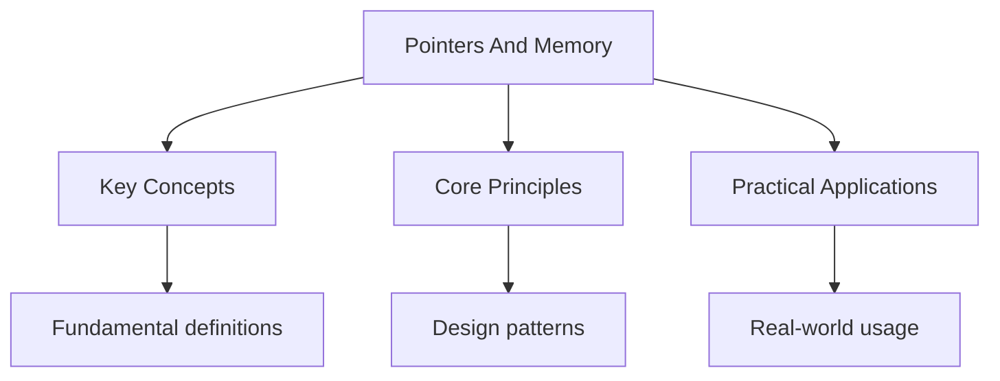

---

title: "Pointers and Memory | Languages"
description: "Go has pointers, but no pointer arithmetic (except via ). Pointers hold the memo Comprehensive educational content coverage with definitions and practice proble"
date: 2026-04-18
tags:
  - Go
categories:
  - Go
---

<!-- Breadcrumb Schema for SEO -->
<script type="application/ld+json">
{
  "@context": "https://schema.org",
  "@type": "BreadcrumbList",
  "itemListElement": [{"name": "Home", "url": "https://wyattau.com"}, {"name": "languages", "url": "https://languages.wyattau.com"}, {"name": "Go", "url": "https://languages.wyattau.com/go"}, {"name": "Advanced", "url": "https://languages.wyattau.com/go/advanced"}, {"name": "Pointers And Memory", "url": "https://languages.wyattau.com/go/advanced/pointers-and-memory"}]
}
</script>

## Pointer Basics

Go has pointers, but no pointer arithmetic (except via `unsafe`). Pointers hold the memory address
Of a value.

```go
x := 42
p := &x   // p is a *int, pointing to x
fmt.Println(*p) // 42
*p = 100
fmt.Println(x)  // 100
```

### Zero Value

The zero value of a pointer is `nil`. Dereferencing a nil pointer panics:

```go
var p *int
fmt.Println(p == nil) // true
// fmt.Println(*p)    // panic: runtime error: invalid memory address
```

### Pointer Semantics

Go passes everything by value, including pointers. When you pass a pointer, the pointer itself is
Copied (the address value), but it still points to the same underlying data:

```go
func increment(p *int) {
    *p++ // modifies the value at the address p points to
}

x := 42
increment(&x)
fmt.Println(x) // 43
```

### Returning Pointers to Local Variables

Go allows returning pointers to local variables. The compiler performs escape analysis and allocates
The variable on the heap if it escapes:

```go
func newInt() *int {
    x := 42
    return &x // OK -- x is allocated on the heap
}
```

This is safe and idiomatic. The garbage collector handles the lifetime of the heap-allocated
Variable.

## Struct Pointers

Pointer to a struct field:

```go
type Person struct {
    Name string
    Age  int
}

p := &Person{Name: "Alice", Age: 30}
fmt.Println(p.Name)  // "Alice" -- auto-dereference
fmt.Println((*p).Name) // "Alice" -- explicit dereference (rare)
```

Go auto-dereferences pointers for field access. `p.Name` and `(*p).Name` are equivalent.

### Pointer vs Value Semantics

```go
// Value semantics -- copy
func birthday(p Person) {
    p.Age++
}

// Pointer semantics -- mutate original
func birthdayPtr(p *Person) {
    p.Age++
}

alice := Person{Name: "Alice", Age: 30}
birthday(alice)
fmt.Println(alice.Age) // 30 -- unchanged

birthdayPtr(&alice)
fmt.Println(alice.Age) // 31 -- changed
```

## Escape Analysis

The Go compiler uses escape analysis to determine whether a variable can live on the stack or must
Be allocated on the heap. A variable "escapes" if it is reachable after the function returns.

### What Causes Heap Allocation

A variable escapes to the heap when:

1. Its address is returned from a function
2. It is stored in a variable that outlives the function (e.g., a global, a pointer stored in a
   struct field, a closure capture)
3. It is passed to an interface value
4. It is too large for the stack (implementation-defined, > a few MB)
5. It is referenced by a goroutine that may outlive the function

```go
func escapes() *int {
    x := 42
    return &x // x escapes -- allocated on heap
}

func noEscape() int {
    x := 42
    return x // x does not escape -- stays on stack
}
```

### Checking Escape Analysis

Use `go build -gcflags="-m"` to see escape analysis decisions:

```bash
go build -gcflags="-m" ./...
```

Output example:

```
./main.go:5:6: moved to heap: x
./main.go:9:9: &x escapes to heap
```

Use `-gcflags="-m -m"` for verbose output.

## Stack vs Heap

| Property     | Stack                        | Heap                           |
| ------------ | ---------------------------- | ------------------------------ |
| Allocation   | Automatic (push/pop frame)   | Manual (via `new`/escape)      |
| Deallocation | Automatic (function return)  | Garbage collector              |
| Speed        | Very fast (pointer bump)     | Slower (GC involvement)        |
| Size         | Limited (default 1GB, grows) | Large (limited by system)      |
| Access       | Direct (register/offset)     | Indirect (pointer dereference) |

Stack allocation is preferred because it is faster (no GC overhead) and the memory is automatically
Reclaimed when the function returns. The Go compiler works hard to keep variables on the stack.

### Stack Growth

Go stacks start small (2-8 KB) and grow as needed. When a goroutine"s stack is too small, the
Runtime allocates a larger stack and copies the old stack to the new one. This is transparent to the
Programmer.

Unlike C, there is no fixed stack size and no stack overflow in the traditional sense. However,
Extremely deep recursion (millions of frames) may exhaust memory.

## The unsafe Package

The `unsafe` package provides operations that bypass Go's type safety. It should be used sparingly
And only when interfacing with C or implementing low-level data structures.

### Pointer Arithmetic

```go
import "unsafe"

arr := [4]int{10, 20, 30, 40}
ptr := unsafe.Pointer(&arr[0])

// Advance pointer by n * unsafe.Sizeof(T)
next := unsafe.Pointer(uintptr(ptr) + unsafe.Sizeof(arr[0]))
fmt.Println(*(*int)(next)) // 20
```

### unsafe.Sizeof, unsafe.Alignof, unsafe.Offsetof

```go
type Example struct {
    A byte
    B int64
    C bool
}

fmt.Println(unsafe.Sizeof(Example{}))  // 24 (padded for alignment)
fmt.Println(unsafe.Alignof(Example{})) // 8
fmt.Println(unsafe.Offsetof(Example{}.B)) // 8 (padded after A)
```

### unsafe.String and unsafe.SliceData

Since Go 1.20, `unsafe.String` and `unsafe.SliceData` provide safe-ish conversions:

```go
b := []byte("hello")
s := unsafe.String(&b[0], len(b)) // []byte to string without allocation
```

### Rules for Using unsafe

1. The conversion from `uintptr` to `unsafe.Pointer` (and back) must happen in the same expression.
   Storing a `uintptr` in a variable breaks the GC's ability to track the reference.

2. Never store a `uintptr` where the GC can see it. The GC treats `uintptr` as an integer, not a
   pointer, and may collect the underlying object.

3. `unsafe.Pointer` rules: a `T1` can be converted to `unsafe.Pointer`Which can be converted to
   `T2`. This allows arbitrary pointer type conversion.

```go
// Valid: conversion chain in single expression
p := (*int)(unsafe.Pointer(&float64Var))
```

## Pointer Comparison

Go pointers are comparable with `==` and `!=`. Two pointers are equal if they point to the same
Address:

```go
x := 42
p1 := &x
p2 := &x
p3 := &x

fmt.Println(p1 == p2) // true
fmt.Println(p1 == p3) // true
```

Pointers can also be compared to `nil`.

## Intuition

**Pointers are addresses, not the houses themselves:** A pointer in Go is like writing a street address on a piece of paper. You can pass the paper around without moving the house. Go's garbage collector is the property manager — when nobody has the address anymore, the house gets demolished and the lot reused. Escape analysis is the city planner deciding whether a house should be temporary (stack) or permanent (heap).

**Why it matters:** Understanding pointers and escape analysis lets you write code that allocates on the stack (fast, no GC pressure) rather than the heap (slow, GC-managed). This is the single biggest performance optimization available in Go without changing algorithms.

**The key insight:** Go pointers are safe (no arithmetic, GC-tracked) but still powerful — escape analysis automates the stack/heap decision so you rarely think about it, but knowing the rules helps when performance matters.

## Common Pitfalls

1. **Dereferencing nil pointers.** Always check for nil before dereferencing, or ensure the pointer
   is initialized.

2. **Returning slice that references stack-escaped data.** Slicing a local array and returning the
   slice escapes the array to the heap. This is handled correctly by the compiler but may surprise
   programmers expecting stack-only behavior.

3. **Storing uintptr across GC.** If you convert a pointer to `uintptr` and store it, the GC may
   collect the pointed-to object. Always keep the conversion in a single expression.

4. **Assuming struct layout.** Go does not guarantee struct field layout. The compiler may reorder
   fields for alignment. Use `unsafe.Offsetof` to query actual offsets, or use `//go:nosplit` and
   `//go:notinheap` for precise control (advanced).

5. **Overusing `unsafe`.** Most code never needs `unsafe`. If you find yourself using it, consider
   whether a safe alternative exists (interface assertions, reflection, encoding/json, etc.).

6. **Not checking escape analysis output.** When performance matters, run `go build -gcflags="-m"`
   and verify that hot-path variables are not unnecessarily escaping to the heap.




## Summary

This topic covers the core concepts of pointers and memory, including underlying theory, practical
implementation, and key applications.

**Key concepts include:**

- core concepts and terminology
- algorithms and computational thinking
- practical implementation
- security and ethical considerations
- applications in the real world

Understanding these concepts thoroughly is essential for both examinations and practical
programming, and requires both theoretical knowledge and hands-on practice.

## Worked Examples

Worked examples demonstrating the application of key concepts are covered in the detailed sub-pages
linked above.

## Cross-References

- **[Types and Variables](../basics/types-and-variables):** Value types and variable declarations that interact with pointer semantics.
- **[Networking](./networking):** Network buffer management using pointer-based I/O patterns.
- **[Race Conditions](../concurrency/race-conditions):** Synchronization primitives for safe concurrent memory access.
