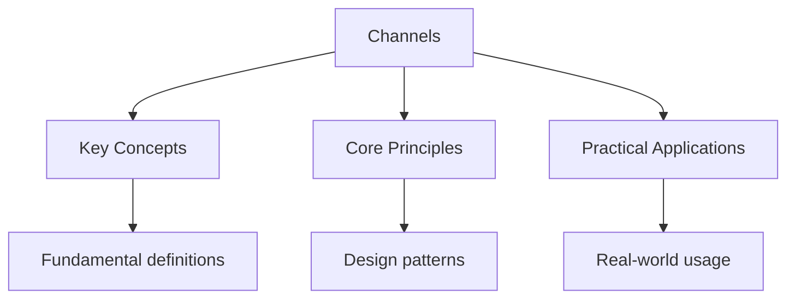

---

title: Channels and Concurrency Patterns
description: "Unbuffered channels synchronize sender and receiver: both must be ready at the same time. Buffered Channels allow the sender to proceed up to the buffer"
date: 2026-04-18
tags:
  - Go
categories:
  - Go
---

<!-- Breadcrumb Schema for SEO -->
<script type="application/ld+json">
{
  "@context": "https://schema.org",
  "@type": "BreadcrumbList",
  "itemListElement": [{"name": "Home", "url": "https://wyattau.com"}, {"name": "languages", "url": "https://languages.wyattau.com"}, {"name": "Go", "url": "https://languages.wyattau.com/go"}, {"name": "Concurrency", "url": "https://languages.wyattau.com/go/concurrency"}, {"name": "Channels", "url": "https://languages.wyattau.com/go/concurrency/channels"}]
}
</script>

## Channel Review

Unbuffered channels synchronize sender and receiver: both must be ready at the same time. Buffered
Channels allow the sender to proceed up to the buffer capacity without a receiver.

```go
unbuf := make(chan int)      // blocks until receiver ready
buf := make(chan int, 10)    // sender can buffer up to 10
```

## Select

`select` allows a goroutine to wait on multiple channel operations simultaneously. It blocks until
One of its cases can proceed, then executes that case:

```go
ch1 := make(chan string)
ch2 := make(chan string)

go func() { ch1 <- "from ch1" }()
go func() { ch2 <- "from ch2" }()

select {
case msg1 := <-ch1:
    fmt.Println(msg1)
case msg2 := <-ch2:
    fmt.Println(msg2)
}
```

### Select with Default

A `default` case makes `select` non-blocking:

```go
select {
case msg := <-ch:
    fmt.Println("received:", msg)
default:
    fmt.Println("no message available")
}
```

### Select Timeout

Use `time.After` to implement timeouts:

```go
select {
case result := <-ch:
    fmt.Println("result:", result)
case <-time.After(3 * time.Second):
    fmt.Println("timed out")
}
```

### Select Loop

`select` in a `for` loop handles multiple events over time:

```go
for {
    select {
    case msg := <-ch:
        fmt.Println("received:", msg)
    case <-done:
        fmt.Println("done")
        return
    case <-time.After(1 * time.Second):
        fmt.Println("waiting...")
    }
}
```

### Nil Channels

Sending to or receiving from a `nil` channel blocks forever. This is useful in `select` to
Temporarily disable a case:

```go
var ch1 chan int // nil
var ch2 = make(chan int, 1)

ch2 <- 42

select {
case <-ch1:
    fmt.Println("ch1") // never selected (nil channel blocks)
case v := <-ch2:
    fmt.Println("ch2:", v) // selected
}
```

## Concurrency Patterns

### Fan-out, Fan-in

Distribute work across multiple goroutines (fan-out), then collect results (fan-in):

```go
func fanOut(in <-chan int, workers int) <-chan int {
    out := make(chan int)
    var wg sync.WaitGroup

    for i := 0; i < workers; i++ {
        wg.Add(1)
        go func() {
            defer wg.Done()
            for v := range in {
                out <- process(v)
            }
        }()
    }

    go func() {
        wg.Wait()
        close(out)
    }()

    return out
}

func fanIn(chs ...<-chan int) <-chan int {
    out := make(chan int)
    var wg sync.WaitGroup

    for _, ch := range chs {
        wg.Add(1)
        go func(c <-chan int) {
            defer wg.Done()
            for v := range c {
                out <- v
            }
        }(ch)
    }

    go func() {
        wg.Wait()
        close(out)
    }()

    return out
}
```

### Pipeline

A pipeline is a series of stages connected by channels, where each stage receives values from
Upstream and sends values downstream:

```go
func generator(nums ...int) <-chan int {
    out := make(chan int)
    go func() {
        for _, n := range nums {
            out <- n
        }
        close(out)
    }()
    return out
}

func square(in <-chan int) <-chan int {
    out := make(chan int)
    go func() {
        for n := range in {
            out <- n * n
        }
        close(out)
    }()
    return out
}

func main() {
    for n := range square(square(generator(1, 2, 3, 4))) {
        fmt.Println(n) // 1, 16, 81, 256
    }
}
```

Each stage runs in its own goroutine. Stages are connected only by channels. Cancellation requires
Propagating a done signal through the pipeline.

### Worker Pool

A fixed number of workers process jobs from a shared channel:

```go
func worker(id int, jobs <-chan int, results chan<- int) {
    for j := range jobs {
        results <- j * 2
    }
}

func main() {
    jobs := make(chan int, 100)
    results := make(chan int, 100)

    for w := 1; w <= 3; w++ {
        go worker(w, jobs, results)
    }

    for j := 1; j <= 9; j++ {
        jobs <- j
    }
    close(jobs)

    for r := 1; r <= 9; r++ {
        fmt.Println(<-results)
    }
}
```

### Bounded Parallelism

Limit the number of concurrent goroutines processing a collection:

```go
func processItems(items []Item, maxConcurrency int) {
    sem := make(chan struct{}, maxConcurrency)
    var wg sync.WaitGroup

    for _, item := range items {
        wg.Add(1)
        sem <- struct{}{} // acquire semaphore
        go func(it Item) {
            defer wg.Done()
            defer func() { <-sem }() // release semaphore
            process(it)
        }(item)
    }

    wg.Wait()
}
```

## The context Package

The `context` package provides cancellation, deadlines, and request-scoped values across goroutine
Boundaries. It is the standard mechanism for propagating cancellation signals in Go.

### Context Types

| Type                   | Purpose                                           |
| ---------------------- | ------------------------------------------------- |
| `context.Background`   | Root context, never cancelled                     |
| `context.TODO`         | Placeholder when context is not yet available     |
| `context.WithCancel`   | Returns a cancelable context and cancel function  |
| `context.WithTimeout`  | Returns a context that cancels after a deadline   |
| `context.WithDeadline` | Returns a context that cancels at a specific time |
| `context.WithValue`    | Returns a context carrying a key-value pair       |

### WithCancel

```go
func longRunning(ctx context.Context) {
    for {
        select {
        case <-ctx.Done():
            fmt.Println("cancelled:", ctx.Err())
            return
        default:
            // do work
        }
    }
}

func main() {
    ctx, cancel := context.WithCancel(context.Background())
    go longRunning(ctx)

    time.Sleep(2 * time.Second)
    cancel() // sends cancellation signal
    time.Sleep(100 * time.Millisecond)
}
```

### WithTimeout

```go
ctx, cancel := context.WithTimeout(context.Background(), 5*time.Second)
defer cancel()

result, err := slowOperation(ctx)
if err != nil {
    if ctx.Err() == context.DeadlineExceeded {
        fmt.Println("operation timed out")
    }
    return
}
```

### WithValue

```go
type key string

const requestIDKey key = "requestID"

ctx := context.WithValue(context.Background(), requestIDKey, "abc-123")

func handler(ctx context.Context) {
    id := ctx.Value(requestIDKey).(string)
    fmt.Println("request:", id)
}
```

Use `context.WithValue` sparingly and only for request-scoped data that flows through the call
Chain. Do not use it as a global variable substitute.

### Cancellation Propagation

Contexts form a tree. Cancelling a parent cancels all its children:

```go
parent, cancel := context.WithCancel(context.Background())
child1, _ := context.WithCancel(parent)
child2, _ := context.WithCancel(parent)

cancel() // cancels parent, child1, and child2
```

This is how HTTP request cancellation works: the server creates a context per request, and when the
Client disconnects, the context is cancelled, propagating to all goroutines handling that request.

## Intuition

**Channels are typed pipes with rendezvous semantics:** Picture a pipe connecting two workers. An unbuffered channel is a pipe with zero storage — the sender must wait until the receiver grabs the part, like a relay race where the baton must be handed off face-to-face. A buffered channel is a pipe with a small shelf — the sender can drop off parts and walk away, as long as the shelf isn't full. `select` is like a worker checking multiple bins simultaneously, picking up whichever has work available.

**Why it matters:** Channels and select enable composing concurrent behaviors without shared state. Pipelines, fan-out/fan-in, and worker pools are natural consequences of thinking in terms of data flowing through pipes.

**The key insight:** Channel semantics (blocking, buffering, select) enforce synchronization at the type level — deadlocks and race conditions become structural problems you can reason about visually.

## Common Pitfalls

1. **Forgetting to call the cancel function.** `WithCancel``WithTimeout`And `WithDeadline` return a
   cancel function that must be called to release resources. Use `defer cancel()`.

2. **Not propagating context through function calls.** If a function starts goroutines, accept a
   `context.Context` parameter so callers can cancel the work.

3. **Using `context.WithValue` for business logic data.** Values in context are untyped. Prefer
   function parameters for structured data. Reserve context values for cross-cutting concerns
   (request IDs, tracing, auth tokens).

4. **Buffered channel deadlocks.** If all goroutines are blocked sending to a channel and no
   goroutine is receiving (or vice versa), the program deadlocks. Ensure there is always at least
   one receiver for each sender.

5. **Leaking goroutines.** A goroutine that blocks forever on a channel read with no sender (or vice
   versa) is a goroutine leak. Use context cancellation to ensure goroutines can exit.

6. **Closing a channel from the receiver.** Only the sender should close a channel. If the receiver
   closes it, the sender may panic when trying to send.

7. **Race conditions with `select`.** If multiple cases are ready, `select` chooses uniformly at
   random. Do not assume a preferred order.




## Summary

This topic covers the core concepts of channels and concurrency patterns, including underlying
theory, practical implementation, and key applications.

**Key concepts include:**

- core concepts and terminology
- algorithms and computational thinking
- practical implementation
- security and ethical considerations
- applications in the real world

Understanding these concepts thoroughly is essential for both examinations and practical
programming, and requires both theoretical knowledge and hands-on practice.

## Worked Examples

Worked examples demonstrating the application of key concepts are covered in the detailed sub-pages
linked above.

## Cross-References

- **[Race Conditions](./race-conditions.md):** Mutex-based synchronization as an alternative to channel communication.
- **[Networking](../advanced/networking.md):** Goroutine-based network servers using channel patterns.
- **[I/O](../standard-library/io.md):** Stream processing with io.Reader/Writer in concurrent pipelines.
