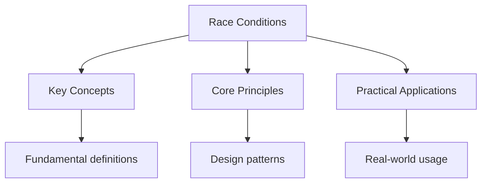

---

title: "race conditions | Languages - Wyatt's Notes"
date: 2026-05-30
tags:
  - Go
categories:
  - Go
description: "A data race occurs when two goroutines access the same variable concurrently, at least one of them writes, and there is no synchronization to order the"
---

<!-- Breadcrumb Schema for SEO -->
<script type="application/ld+json">
{
  "@context": "https://schema.org",
  "@type": "BreadcrumbList",
  "itemListElement": [{"name": "Home", "url": "https://wyattau.com"}, {"name": "languages", "url": "https://languages.wyattau.com"}, {"name": "Go", "url": "https://languages.wyattau.com/go"}, {"name": "Concurrency", "url": "https://languages.wyattau.com/go/concurrency"}, {"name": "Race Conditions", "url": "https://languages.wyattau.com/go/concurrency/race-conditions"}]
}
</script>

## What is a Data Race?

A data race occurs when two goroutines access the same variable concurrently, at least one of them
writes, and there is no synchronization to order the accesses. Go"s memory model guarantees that a
data race causes undefined behavior -- the program may crash, corrupt data, or appear to work
correctly.

### Data Race vs Race Condition

A data race is about unsynchronized concurrent access to memory. A race condition is about the
correctness of a program depending on the timing of events. All data races are bugs, but not all
race conditions involve data races:

```go
// Data race: two goroutines write to x without synchronization
var x int
go func() { x = 1 }()
go func() { x = 2 }()
// x has undefined value

// Race condition (no data race): correct synchronization but timing-dependent outcome
var mu sync.Mutex
var balance int
go func() {
    mu.Lock()
    if balance >= 100 {
        balance -= 100
    }
    mu.Unlock()
}()
```

The second example has no data race (accesses are synchronized) but has a race condition (the
withdrawal may fail due to timing with another goroutine).

## Detecting with go test -race

Go includes a built-in race detector based on ThreadSanitizer. Enable it with the `-race` flag:

```bash
go test -race ./...
go build -race ./cmd/myapp
go run -race main.go
```

The race detector instruments all memory accesses and reports any unsynchronized concurrent access.
When a race is detected, the program prints a stack trace showing both conflicting goroutines:

```
WARNING: DATA RACE
Write at 0x... by goroutine 7:
  main.(*Counter).Inc()
      /src/main.go:10 +0x3a

Previous write at 0x... by goroutine 6:
  main.(*Counter).Inc()
      /src/main.go:10 +0x3a
```

The race detector has false negatives (it cannot catch all races) but no false positives. A reported
race is always a real bug. However, the race detector only catches races that are exercised during
the run -- if a particular interleaving does not occur, the race is not reported.

The race detector slows programs by 2-20x and uses 5-10x more memory. Enable it in tests and CI, not
in production.

## Common Race Patterns

### Shared Counter

```go
// Data race: concurrent increment
var counter int
var wg sync.WaitGroup

for i := 0; i < 1000; i++ {
    wg.Add(1)
    go func() {
        defer wg.Done()
        counter++ // read-modify-write, not atomic
    }()
}
wg.Wait()
fmt.Println(counter) // unpredictable, likely < 1000
```

Fix with `sync.Mutex` or `sync/atomic`.

### Slice Append

```go
// Data race: concurrent append
var s []int
var wg sync.WaitGroup

for i := 0; i < 100; i++ {
    wg.Add(1)
    go func(v int) {
        defer wg.Done()
        s = append(s, v) // race: writes to slice header
    }(i)
}
```

`append` writes the slice header (pointer, length, capacity). Concurrent appends race on these
fields. Fix with a mutex or pre-allocate and use indexed writes with atomic.

### Map Concurrent Access

```go
// Fatal: concurrent map read and map write
m := make(map[string]int)
go func() { m["key"] = 1 }()
go func() { _ = m["key"] }()
// fatal error: concurrent map read and map write
```

Go maps are not safe for concurrent use. This crashes the program at runtime. Fix with `sync.Mutex`,
`sync.RWMutex`, or `sync.Map`.

### Closure Variable Capture

```go
// Data race: loop variable captured by reference
for _, v := range values {
    go func() {
        process(v) // v is shared across all goroutines
    }()
}
```

The goroutine closure captures `v` by reference, not value. By the time the goroutine runs, `v` may
have changed. Fix by passing the variable as an argument:

```go
for _, v := range values {
    go func(val string) {
        process(val) // val is a copy
    }(v)
}
```

Since Go 1.22, the loop variable is scoped per iteration, making this problem less common in newer
code.

## sync/atomic Package

The `sync/atomic` package provides atomic operations on primitive types without locks. These
operations are faster than mutex-based synchronization for simple values.

### Int32 and Int64

```go
var counter atomic.Int64

for i := 0; i < 1000; i++ {
    go func() {
        counter.Add(1)
    }()
}
fmt.Println(counter.Load()) // 1000
```

### CompareAndSwap (CAS)

```go
var val atomic.Int64

// Atomically set val to 10 only if it is currently 0
swapped := val.CompareAndSwap(0, 10)
```

CAS is the building block for lock-free data structures. It reads the current value and writes a new
value only if the current value matches the expected value:

```go
// Spinlock-style retry loop
for {
    old := val.Load()
    new := old + 1
    if val.CompareAndSwap(old, new) {
        break
    }
}
```

For simple increment, use `Add` instead -- it is more efficient than a CAS loop.

### Value Type

`atomic.Value` stores an arbitrary value atomically:

```go
var config atomic.Value

func loadConfig() Config {
    return config.Load().(Config)
}

func updateConfig(new Config) {
    config.Store(new)
}
```

The stored value type must be consistent across all `Store` calls. Mixing types panics.

### atomic vs Mutex

Use `atomic` when:

- Protecting a single primitive value (counter, flag)
- The operation is simple (load, store, add, CAS)
- Performance matters in a hot path

Use `Mutex` when:

- Protecting multiple fields that must be updated together (composite state)
- The critical section involves complex logic or multiple steps
- Readability matters more than micro-optimization

## sync.Pool

`sync.Pool` is a set of temporary objects that may be individually saved and retrieved. Its purpose
is memory reuse -- allocating from a pool avoids repeated GC pressure from short-lived allocations.

```go
var bufPool = sync.Pool{
    New: func() any {
        return new(bytes.Buffer)
    },
}

func process(data []byte) string {
    buf := bufPool.Get().(*bytes.Buffer)
    buf.Reset()
    defer bufPool.Put(buf)

    buf.Write(data)
    return buf.String()
}
```

Key behaviors:

- `Get` returns a previously `Put` object, or calls `New` if the pool is empty.
- `Put` returns an object to the pool.
- Objects in the pool may be garbage-collected at any time -- do not rely on pooled objects
  surviving.
- A pool is not suitable for long-lived objects or objects that hold file handles or network
  connections.

Appropriate use cases: byte buffers for encoding/decoding, temporary structs for JSON marshaling,
connection objects with no external state.

```go
// Anti-pattern: using Pool for persistent objects
var connPool = sync.Pool{
    New: func() any {
        conn, _ := net.Dial("tcp", "example.com:80")
        return conn
    },
}
// Connection may be GC'd and closed at any time -- do not do this
```

## sync.Cond

`sync.Cond` provides a condition variable for goroutines to wait for or announce events:

```go
var mu sync.Mutex
cond := sync.NewCond(&mu)
ready := false

// Waiter
mu.Lock()
for !ready {
    cond.Wait() // releases mu, blocks, re-acquires mu on wake
}
fmt.Println("ready")
mu.Unlock()

// Signaler
mu.Lock()
ready = true
cond.Signal() // wake one waiter
mu.Unlock()
```

`Wait` atomically releases the lock and blocks the goroutine. Before returning, `Wait` re-acquires
the lock.

Key methods:

```go
cond.Wait()      // block until signaled or broadcast
cond.Signal()    // wake one waiting goroutine
cond.Broadcast() // wake all waiting goroutines
```

Always check the condition in a loop after `Wait` returns (spurious wakeups are possible):

```go
mu.Lock()
for !condition() { // MUST be a loop
    cond.Wait()
}
mu.Unlock()
```

`Broadcast` wakes all waiters. Use `Signal` when only one waiter can make progress -- it is more
efficient.

## golang.org/x/sync/errgroup

`errgroup` manages a group of goroutines that share a common error return:

```go
import "golang.org/x/sync/errgroup"

func fetchAll(urls []string) ([]string, error) {
    var results []string
    var mu sync.Mutex
    var g errgroup.Group

    for _, url := range urls {
        url := url
        g.Go(func() error {
            resp, err := http.Get(url)
            if err != nil {
                return err
            }
            defer resp.Body.Close()

            body, err := io.ReadAll(resp.Body)
            if err != nil {
                return err
            }

            mu.Lock()
            results = append(results, string(body))
            mu.Unlock()
            return nil
        })
    }

    if err := g.Wait(); err != nil {
        return nil, err
    }
    return results, nil
}
```

`g.Go` launches a goroutine. `g.Wait` blocks until all goroutines finish and returns the first
non-nil error. The `SetLimit` method limits concurrency:

```go
var g errgroup.Group
g.SetLimit(10) // at most 10 concurrent goroutines

for _, url := range urls {
    url := url
    g.Go(func() error {
        return fetch(url)
    })
}
if err := g.Wait(); err != nil {
    log.Fatal(err)
}
```

## Intuition

**Data races are like two people writing to the same whiteboard simultaneously:** Neither person sees what the other wrote — the final result depends on who wrote last, and bits of both messages might overlap into gibberish. The race detector is a security camera that watches for exactly this scenario. Atomic operations are like having a single pen that only one person can hold at a time — no overlap possible. `sync.Pool` is a shared tool bench where workers grab and return tools, but the bench can be rearranged at any time by the janitor (GC).

**Why it matters:** Data races cause undefined behavior — the program might work 999 times and corrupt data on the 1000th. Go's race detector catches these at test time, but only for the interleavings it actually exercises.

**The key insight:** If two goroutines access the same memory without synchronization and at least one writes, the program is broken — no matter how "unlikely" the timing.

## Common Pitfalls

1. **Not running the race detector.** Data races are nondeterministic. A program may appear to work
   correctly in testing but fail in production. Always run `go test -race` in CI.

2. **Assuming atomic operations prevent race conditions.** Atomic operations prevent data races but
   do not prevent higher-level race conditions. For example, atomically checking and decrementing a
   balance in two steps is still vulnerable to timing issues.

3. **Using sync.Pool for important data.** Pool entries can be GC'd at any time. Never store data
   that must persist or hold resources (file handles, connections) in a pool.

4. **Forgetting to loop on sync.Cond.Wait.** `Wait` can return due to spurious wakeups. Always
   re-check the condition in a `for` loop.

5. **Ignoring errgroup errors.** `g.Wait()` returns the first non-nil error from any goroutine.
   Always check it. Other goroutines continue running even after the first error -- use
   `WithContext` to cancel remaining goroutines on the first error:

```go
g, ctx := errgroup.WithContext(context.Background())
g.Go(func() error {
    return doWork(ctx)
})
```

1. **CAS without retry.** `CompareAndSwap` can fail if another goroutine modified the value between
   the load and the swap. Always retry in a loop, or use `Add` when the operation is directly an
   increment.

2. **Leaking goroutines with errgroup.** If `g.Go` panics, `g.Wait` re-panics. Always recover or
   return errors from goroutines rather than panicking.




## Summary

This topic covers the core concepts of race conditions and data races in Go, including underlying
theory, practical implementation, and key applications.

**Key concepts include:**

- data races vs race conditions
- race detection with go test -race
- atomic operations and lock-free programming
- sync.Pool for memory reuse
- sync.Cond for condition variables
- errgroup for grouped goroutines
- common concurrency pitfalls

Understanding these concepts thoroughly is essential for both examinations and practical
programming, and requires both theoretical knowledge and hands-on practice.

## Worked Examples

Worked examples demonstrating the application of key concepts are covered in the detailed sub-pages
linked above.

## Cross-References

- **[Channels](./channels.md):** Channel-based concurrency as an alternative to shared-memory synchronization.
- **[Pointers and Memory](../advanced/pointers-and-memory.md):** Memory layout and escape analysis relevant to concurrent access.
- **[Testing](../advanced/testing.md):** Race detector and concurrency testing patterns.
