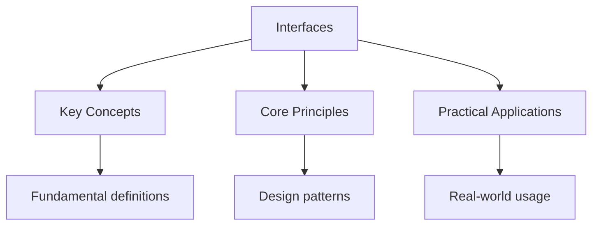

---

title: "Interfaces | Languages - Wyatt's Notes"
description: "An interface in Go defines a set of method signatures. A type satisfies an interface by implementing All of its methods. There is no explicit declaration --"
date: 2026-04-18
tags:
  - Go
categories:
  - Go
---

<!-- Breadcrumb Schema for SEO -->
<script type="application/ld+json">
{
  "@context": "https://schema.org",
  "@type": "BreadcrumbList",
  "itemListElement": [{"name": "Home", "url": "https://wyattau.com"}, {"name": "languages", "url": "https://languages.wyattau.com"}, {"name": "Go", "url": "https://languages.wyattau.com/go"}, {"name": "Intermediate", "url": "https://languages.wyattau.com/go/intermediate"}, {"name": "Interfaces", "url": "https://languages.wyattau.com/go/intermediate/interfaces"}]
}
</script>

## Interface Basics

An interface in Go defines a set of method signatures. A type satisfies an interface by implementing
All of its methods. There is no explicit `implements` declaration -- satisfaction is implicit and
Structural.

```go
type Speaker interface {
    Speak() string
}

type Dog struct {
    Name string
}

func (d Dog) Speak() string {
    return "Woof"
}

func main() {
    var s Speaker = Dog{Name: "Rex"}
    fmt.Println(s.Speak()) // Woof
}
```

Any type that has a `Speak() string` method satisfies `Speaker`Regardless of its position in the
Type hierarchy.

## Interface Composition

Interfaces can be composed from other interfaces:

```go
type Reader interface {
    Read(p []byte) (n int, err error)
}

type Writer interface {
    Write(p []byte) (n int, err error)
}

type Closer interface {
    Close() error
}

type ReadWriteCloser interface {
    Reader
    Writer
    Closer
}
```

`ReadWriteCloser` requires all methods from `Reader``Writer`And `Closer`.

## The Empty Interface

`interface{}` (or `any` since Go 1.18) is the empty interface, satisfied by every type:

```go
var x any
x = 42
x = "hello"
x = []int{1, 2, 3}
```

The empty interface is a escape hatch when you need to store values of different types. It should be
Used sparingly -- it bypasses the type system and requires runtime type assertions to use safely.

### When to Use `any`

Acceptable uses:

- Format functions (`fmt.Printf`): the caller does not know what types they are passing
- Generic containers before Go 1.18 generics
- Interoperability with untyped external data (JSON, protocol buffers)
- Heterogeneous collections that are genuinely heterogeneous (e.g., configuration values)

Avoid when:

- You know the concrete type at compile time
- A parameter accepts a small, known set of types (use a union type or an interface)
- You are passing `any` through multiple function layers without ever checking the type

## Type Assertions

A type assertion extracts the concrete value from an interface:

```go
var i any = "hello"

s := i.(string)        // panic if i does not hold a string
fmt.Println(s)         // "hello"

s, ok := i.(string)    // safe: ok is false if assertion fails
if ok {
    fmt.Println(s)
}
```

Always use the comma-ok idiom unless you are certain of the type:

```go
func process(v any) {
    if s, ok := v.(string); ok {
        fmt.Println("string:", s)
    } else if n, ok := v.(int); ok {
        fmt.Println("int:", n)
    }
}
```

## Type Switches

A type switch performs multiple type assertions in sequence:

```go
func inspect(v any) {
    switch val := v.(type) {
    case int:
        fmt.Printf("int: %d\n", val)
    case string:
        fmt.Printf("string: %s (len %d)\n", val, len(val))
    case bool:
        fmt.Printf("bool: %t\n", val)
    case nil:
        fmt.Println("nil")
    default:
        fmt.Printf("unknown: %T\n", val)
    }
}
```

In a type switch, `val` has the type of the matched case. In the `default` case, `val` has the same
Type as `v` (the interface type).

### Type Switch with Interface Cases

Cases can also be interfaces:

```go
switch v.(type) {
case io.Reader:
    fmt.Println("implements io.Reader")
case io.Writer:
    fmt.Println("implements io.Writer")
case io.ReadWriter:
    fmt.Println("implements io.ReadWriter")
}
```

A value matches the first case whose interface it satisfies.

## Pointer vs Value Receivers and Interfaces

This is a critical subtlety. The method set of `T` includes only value receiver methods. The method
Set of `*T` includes all methods. This affects interface satisfaction:

```go
type Foo interface {
    Bar()
}

type MyType struct{}

func (m *MyType) Bar() {} // pointer receiver

func main() {
    var f Foo = MyType{}   // compile error: MyType does not implement Foo
    var f Foo = &MyType{}  // OK: *MyType implements Foo
}
```

The rule: if any method of an interface has a pointer receiver, only a pointer to the type (not the
Value itself) satisfies the interface. This is because calling a pointer receiver on a copy of the
Value would be meaningless -- the method modifies the receiver, but the modification is lost when
The copy is discarded.

## Nil Interface Values

An interface value is a two-word tuple: (type, value). A nil interface has both type and value set
To nil:

```go
var s Speaker
fmt.Println(s == nil) // true
```

A non-nil interface can hold a nil value:

```go
var p *Dog
var s Speaker = p // type is *Dog, value is nil
fmt.Println(s == nil) // false!
```

This is a common source of bugs. The interface is not nil because its type is `*Dog`Even though The
value is nil. Calling a method on it works (the receiver is nil inside the method), but Comparing
the interface to `nil` does not detect it.

```go
func process(s Speaker) {
    if s == nil {
        fmt.Println("nil interface")
        return
    }
    fmt.Println(s.Speak()) // may panic if the concrete value is nil
}
```

## Interface Zero Value

The zero value of an interface is `nil`. Calling any method on a nil interface causes a panic:

```go
var s Speaker
s.Speak() // panic: runtime error: invalid memory address or nil pointer dereference
```

Always check for nil before calling methods on an interface, or ensure the interface is always
Initialized.

## Common Interfaces

Go"s standard library defines several pervasive interfaces:

| Interface        | Methods                                        | Used By                        |
| ---------------- | ---------------------------------------------- | ------------------------------ |
| `io.Reader`      | `Read(p []byte) (n int, err error)`            | Files, network connections     |
| `io.Writer`      | `Write(p []byte) (n int, err error)`           | Files, buffers, HTTP responses |
| `io.Closer`      | `Close() error`                                | Files, connections             |
| `fmt.Stringer`   | `String() string`                              | Custom string representation   |
| `error`          | `Error() string`                               | Error values                   |
| `sort.Interface` | `Len() int``Less(i,j int) bool``Swap(i,j int)` | Sorting                        |

Implementing `fmt.Stringer`:

```go
type IPAddr [4]byte

func (ip IPAddr) String() string {
    return fmt.Sprintf("%d.%d.%d.%d", ip[0], ip[1], ip[2], ip[3])
}

fmt.Println(IPAddr{127, 0, 0, 1}) // 127.0.0.1
```

## Intuition

**Interfaces are job descriptions, not family trees:** In Go, any type that has the right methods automatically qualifies for an interface — no "extends" or "implements" keyword needed. It's like posting a job listing: anyone whose resume matches gets the job, regardless of their background. This is fundamentally different from class-based inheritance where you must explicitly declare your lineage.

**Why it matters:** This structural typing means you can define interfaces after the fact, decoupling consumers from producers. The `io.Reader` interface didn't exist when `os.File` was written, yet files satisfy it effortlessly.

**The key insight:** Go interfaces are implicit and tiny — a one-method interface is often enough to decouple entire subsystems.

## Common Pitfalls

1. **Nil interface with non-nil concrete type.** An interface holding a `*T` where `T` is nil is not
   equal to `nil`. Use reflection (`reflect.ValueOf(i).IsNil()`) or check the concrete value if this
   situation is possible.

2. **Pointer receiver methods and interface satisfaction.** If an interface method has a pointer
   receiver, only `*T` satisfies the interface, not `T`. This is the single most common interface
   compilation error.

3. **Overusing `any`.** Passing `any` through function signatures defeats the purpose of the type
   system. Prefer specific interfaces. Use generics (Go 1.18+) when you need to abstract over types
   while maintaining type safety.

4. **Duck typing confusion.** Go interfaces are structural, not nominal. Two independently defined
   types with the same method set satisfy the same interface. This is a feature, but it means you
   can accidentally satisfy an interface you did not intend to.

5. **Empty interface in slices.** `[]any` is a common pattern but loses type safety. Since Go 1.18,
   prefer generics: `[]T` where `T` is a type parameter.




## Summary

This topic covers the core concepts of interfaces, including underlying theory, practical
implementation, and key applications.

**Key concepts include:**

- core concepts and terminology
- algorithms and computational thinking
- practical implementation
- security and ethical considerations
- applications in the real world

Understanding these concepts thoroughly is essential for both examinations and practical
programming, and requires both theoretical knowledge and hands-on practice.

## Worked Examples

Worked examples demonstrating the application of key concepts are covered in the detailed sub-pages
linked above.

## Cross-References

- **[Error Handling](./error-handling.md):** The error interface and custom error type patterns.
- **[Testing](../advanced/testing.md):** Interface-based mock design for unit testing.
- **[Reflection](../advanced/reflection.md):** Runtime type inspection as an alternative to interface-based polymorphism.
