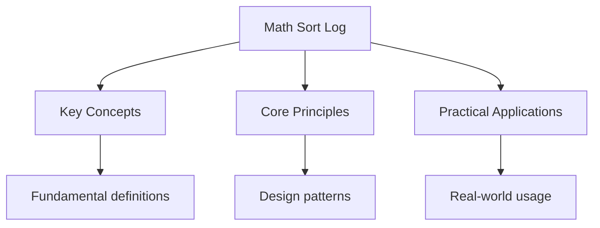

---

title: "math, sort, and log/slog | Languages"
date: 2026-05-30
tags:
  - Go
categories:
  - Go
description: 'The package provides basic constants and mathematical functions for floating-poi Comprehensive educational content coverage with definitions and practice proble'
---

<!-- Breadcrumb Schema for SEO -->
<script type="application/ld+json">
{
  "@context": "https://schema.org",
  "@type": "BreadcrumbList",
  "itemListElement": [{"name": "Home", "url": "https://wyattau.com"}, {"name": "languages", "url": "https://languages.wyattau.com"}, {"name": "Go", "url": "https://languages.wyattau.com/go"}, {"name": "Standard Library", "url": "https://languages.wyattau.com/go/standard-library"}, {"name": "Math Sort Log", "url": "https://languages.wyattau.com/go/standard-library/math-sort-log"}]
}
</script>

## The math Package

The `math` package provides basic constants and mathematical functions for floating-point
arithmetic.

### Constants

```go
math.Pi                    // 3.141592653589793
math.E                     // 2.718281828459045
math.Phi                   // 1.618033988749895 (golden ratio)
math.Sqrt2                 // 1.4142135623730951
math.MaxFloat64            // 1.7976931348623157e+308
math.SmallestNonzeroFloat64 // 4.9406564584124654e-324
math.MaxInt                // 9223372036854775807 (int64 max)
math.MinInt                // -9223372036854775808 (int64 min)
```

### Basic Functions

```go
math.Abs(-7.5)        // 7.5
math.Sqrt(16)          // 4
math.Cbrt(27)          // 3
math.Pow(2, 10)        // 1024
math.Mod(10, 3)        // 1
math.Rem(10, 3)        // 1 (differs from Mod for negative numbers)
```

### Trigonometric Functions

```go
math.Sin(math.Pi / 2)  // 1
math.Cos(0)            // 1
math.Tan(math.Pi / 4)  // 1
math.Asin(1)           // Pi/2
math.Acos(1)           // 0
math.Atan(1)           // Pi/4
math.Atan2(1, 1)       // Pi/4 (two-argument arctangent)
```

### Rounding Functions

```go
math.Floor(3.7)   // 3
math.Ceil(3.2)    // 4
math.Round(3.5)   // 4
math.Trunc(3.7)   // 3 (truncates toward zero)
```

### Min and Max

```go
math.Min(3, 7)    // 3
math.Max(3, 7)    // 7
```

Go 1.21 added generic `min` and `max` builtins that work with any ordered type:

```go
min(3, 7)     // 3
max("a", "z") // "z"
```

### Logarithmic and Exponential Functions

```go
math.Log(1)      // 0 (natural logarithm)
math.Log2(8)     // 3
math.Log10(100)  // 2
math.Exp(1)      // 2.718281828459045
math.Exp2(3)     // 8
```

### math/rand

Go 1.22+ provides a global `math/rand/v2` with auto-seeded generation:

```go
import "math/rand/v2"

n := rand.IntN(100)   // [0, 100)
f := rand.Float64()   // [0.0, 1.0)
choice := rand.N(3)   // [0, 3)
```

### math/big

For arbitrary-precision arithmetic when `float64` precision is insufficient:

```go
import (
    "math/big"
    "fmt"
)

i := new(big.Int)
i.Exp(big.NewInt(2), big.NewInt(100), nil)
fmt.Println(i) // 1267650600228229401496703205376

f := new(big.Float)
f.SetPrec(100)
f.Sqrt(big.NewFloat(2))
fmt.Println(f) // 1.4142135623730950488016887242096980785696718753769

r := new(big.Rat)
r.SetFrac(big.NewInt(22), big.NewInt(7))
fmt.Println(r.FloatString(10)) // 3.1428571429
```

## The sort Package

The `sort` package provides primitives for sorting slices and user-defined collections.

### sort.Slice

Sort a slice in place using a comparator function:

```go
nums := []int{5, 2, 8, 1, 9}
sort.Slice(nums, func(i, j int) bool {
    return nums[i] < nums[j]
})
// nums: [1, 2, 5, 8, 9]
```

Descending order:

```go
sort.Slice(nums, func(i, j int) bool {
    return nums[i] > nums[j]
})
```

### sort.SliceStable

Preserves the relative order of equal elements:

```go
type Person struct {
    Name string
    Age  int
}

people := []Person{
    {"Alice", 30},
    {"Bob", 25},
    {"Carol", 30},
}

sort.SliceStable(people, func(i, j int) bool {
    return people[i].Age < people[j].Age
})
// Bob (25), Alice (30), Carol (30) -- Alice still before Carol
```

### sort.SliceIsSorted

Check whether a slice is sorted:

```go
ok := sort.SliceIsSorted(nums, func(i, j int) bool {
    return nums[i] < nums[j]
})
```

### Multi-Key Sorting

Sort by one field, then break ties with another:

```go
employees := []Employee{
    {"Alice", "Engineering", 30},
    {"Bob", "Engineering", 25},
    {"Carol", "Marketing", 30},
}

sort.Slice(employees, func(i, j int) bool {
    if employees[i].Dept != employees[j].Dept {
        return employees[i].Dept < employees[j].Dept
    }
    return employees[i].Age < employees[j].Age
})
```

### Convenience Functions

```go
nums := []float64{3.1, 1.4, 2.7}
sort.Float64s(nums)
sort.IsSorted(sort.Float64Slice(nums))

strs := []string{"cherry", "apple", "banana"}
sort.Strings(strs)
sort.IsSorted(sort.StringSlice(strs))

ints := []int{5, 2, 8}
sort.Ints(ints)
sort.IsSorted(sort.IntSlice(ints))
```

### Binary Search

`sort.Search` finds the smallest index where `f(i)` is true (binary search):

```go
nums := []int{1, 3, 5, 7, 9}
idx := sort.Search(len(nums), func(i int) bool {
    return nums[i] >= 5
})
// idx == 2 (the position of 5)
```

`sort.SearchFloat64s` and `sort.SearchStrings` are convenience wrappers:

```go
strs := []string{"apple", "banana", "cherry"}
idx := sort.SearchStrings(strs, "banana")
// idx == 1
```

`slices.BinarySearch` (Go 1.21+) returns both the index and a found flag:

```go
idx, found := slices.BinarySearch(nums, 5)
// idx == 2, found == true
```

### sort.Interface

Implement `sort.Interface` for reusable sorting of custom types:

```go
type ByAge []Person

func (a ByAge) Len() int           { return len(a) }
func (a ByAge) Less(i, j int) bool { return a[i].Age < a[j].Age }
func (a ByAge) Swap(i, j int)      { a[i], a[j] = a[j], a[i] }

sort.Sort(ByAge(people))
```

## The log/slog Package

Go 1.21 introduced `log/slog` for structured, leveled logging. It provides both human-readable
(text) and machine-readable (JSON) output.

### Basic Usage

```go
import "log/slog"

slog.Info("server started", "addr", ":8080", "env", "production")
// level=INFO msg=server started addr=:8080 env=production

slog.Debug("processing request", "id", 12345)
slog.Warn("high memory usage", "percent", 85)
slog.Error("connection failed", "err", err)
```

### Log Levels

| Level | Method       | Typical Use              |
| ----- | ------------ | ------------------------ |
| DEBUG | `slog.Debug` | Verbose development info |
| INFO  | `slog.Info`  | Normal operations        |
| WARN  | `slog.Warn`  | Potential issues         |
| ERROR | `slog.Error` | Failures needing action  |

### Handlers

Handlers control output format. `slog` provides two built-in handlers:

```go
import (
    "log/slog"
    "os"
)

// Text handler (human-readable)
logger := slog.New(slog.NewTextHandler(os.Stdout, nil))

// JSON handler (machine-readable)
logger := slog.New(slog.NewJSONHandler(os.Stdout, nil))

slog.SetDefault(logger)
```

### Handler Options

```go
opts := &slog.HandlerOptions{
    Level: slog.LevelDebug, // minimum level
    ReplaceAttr: func(groups []string, a slog.Attr) slog.Attr {
        if a.Key == slog.TimeKey {
            a.Value = slog.StringValue(a.Value.Time().Format("15:04:05"))
        }
        return a
    },
}
handler := slog.NewTextHandler(os.Stdout, opts)
```

### slog.With

Add default key-value pairs to all subsequent log entries:

```go
logger := slog.Default().With("service", "api", "version", "1.0")
logger.Info("request received", "path", "/users")
// level=INFO msg=request received service=api version=1.0 path=/users
```

### slog.WithGroup

Group related attributes under a namespace:

```go
logger := slog.Default().WithGroup("request")
logger.Info("handling", "method", "GET", "path", "/users")
// level=INFO msg=handling request.method=GET request.path=/users
```

### LogValuer Interface

Custom types can control how their values appear in log output:

```go
type Request struct {
    Method string
    Path   string
    Body   string
}

func (r Request) LogValue() slog.Value {
    return slog.GroupValue(
        slog.String("method", r.Method),
        slog.String("path", r.Path),
        slog.String("body_len", strconv.Itoa(len(r.Body))),
    )
}
```

### Context-Aware Logging

Attach values to a context and log them:

```go
ctx := slog.NewContext(context.Background(), slog.Default().With("trace_id", "abc123"))
handler := func(ctx context.Context) {
    logger := slog.FromContext(ctx)
    logger.Info("processing")
}

handler(ctx)
// level=INFO msg=processing trace_id=abc123
```

## Choosing Between log and log/slog

| Aspect        | `log`             | `log/slog`                     |
| ------------- | ----------------- | ------------------------------ |
| Structured    | No (text only)    | Yes (key-value pairs)          |
| Levels        | Manual flags      | Built-in Debug/Info/Warn/Error |
| Output        | Stderr by default | Configurable handler           |
| Go version    | All               | Go 1.21+                       |
| Machine-parse | No                | JSON handler                   |

Use `log/slog` for new code. Use `log` only for simple scripts or maintaining legacy code that Does
not benefit from structured output.

### Migration from log to slog

```go
// Before
log.Printf("user %s logged in from %s", username, ip)

// After
slog.Info("user logged in", "username", username, "ip", ip)
```

## Intuition

**Math is the toolbox, sort is the librarian, slog is the scribe:** The `math` package gives you the raw tools (sqrt, log, sin) — the kind of stuff you'd find in a scientific calculator. The `sort` package is like a librarian who can organize any collection according to your rules, even finding specific items with binary search. `log/slog` is the structured note-taker who writes entries in key-value format that machines can parse and humans can read, unlike the old `log` package that just wrote paragraphs.

**Why it matters:** Go's standard library includes everything you need for most common operations. You rarely need third-party packages for basic math, sorting, or logging — the standard versions are well-tested, performant, and follow Go's conventions.

**The key insight:** `slog` replaces the old `log` with structured, leveled logging that's both human-readable (text handler) and machine-parseable (JSON handler) — essential for production observability.

## Common Pitfalls

1. **Floating-point precision.** `math.Pow(10, 308)` overflows. `math/big.Float` handles numbers
   beyond `math.MaxFloat64`. Always be aware of precision limits with `float64`.

2. **Unstable sort changing element order.** `sort.Slice` does not preserve the order of equal
   elements. Use `sort.SliceStable` when order matters.

3. **sort.Search returning wrong index.** `sort.Search(n, f)` returns the smallest `i` where `f(i)`
   is true, not the index of a found element. If the element does not exist, the returned index is
   the insertion point. Always verify with an equality check.

4. **Logging sensitive data.** Never log passwords, tokens, or PII. Use
   `slog.StringValue("REDACTED")` or implement `LogValue()` on types containing sensitive fields.

5. **Setting slog level globally without configuration.** Hardcoding `slog.LevelDebug` in production
   generates excessive log volume. Use environment variables or configuration to set the log level.

6. **Blocking the default slog logger.** The default handler is synchronous. In high-throughput
   services, wrap the handler with a buffered writer or use an async handler to avoid blocking.

7. **Using math/rand/v1.** The old `math/rand` package requires manual seeding and is deprecated.
   Use `math/rand/v2` (Go 1.22+) which is auto-seeded and provides `rand.IntN`, `rand.N`, and other
   improvements.




## Summary

This topic covers the core concepts of the math, sort, and log/slog packages, including underlying
theory, practical implementation, and key applications.

**Key concepts include:**

- core concepts and terminology
- algorithms and computational thinking
- practical implementation
- security and ethical considerations
- applications in the real world

Understanding these concepts thoroughly is essential for both examinations and practical
programming, and requires both theoretical knowledge and hands-on practice.

## Worked Examples

Worked examples demonstrating the application of key concepts are covered in the detailed sub-pages
linked above.

## See Also

- [Standard Library](./)
- [Standard Library I/O](./io)
- [net/http](./net-http)
