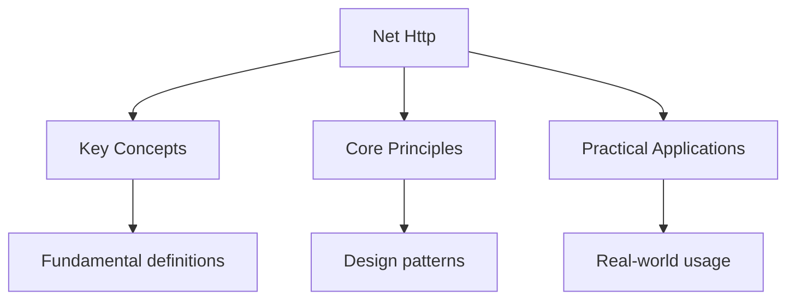

---

title: "net/http | Languages - Wyatt's Notes"
date: 2026-05-30
tags:
  - Go
categories:
  - Go
description: "Go' s package provides everything needed to build HTTP servers and clients. It ships With the standard library -- no frameworks, no external dependencies."
---

<!-- Breadcrumb Schema for SEO -->
<script type="application/ld+json">
{
  "@context": "https://schema.org",
  "@type": "BreadcrumbList",
  "itemListElement": [{"name": "Home", "url": "https://wyattau.com"}, {"name": "languages", "url": "https://languages.wyattau.com"}, {"name": "Go", "url": "https://languages.wyattau.com/go"}, {"name": "Standard Library", "url": "https://languages.wyattau.com/go/standard-library"}, {"name": "Net Http", "url": "https://languages.wyattau.com/go/standard-library/net-http"}]
}
</script>

## Introduction

Go's `net/http` package provides everything needed to build HTTP servers and clients. It ships With
the standard library -- no frameworks, no external dependencies. For most services, `net/http` Is
sufficient on its own or with minimal layering.

```go
import (
    "fmt"
    "log"
    "net/http"
)
```

## HTTP Server

### Starting a Server

`http.ListenAndServe` binds to an address and starts serving HTTP requests:

```go
func main() {
    http.HandleFunc("/", func(w http.ResponseWriter, r *http.Request) {
        fmt.Fprintf(w, "Hello, World!")
    })

    log.Fatal(http.ListenAndServe(":8080", nil))
}
```

- The second argument to `ListenAndServe` is an `http.Handler`. When `nil`, the default
  `http.DefaultServeMux` is used.
- `ListenAndServe` blocks until an error occurs (e.g., port already in use).
- The address string uses the form `host:port` (`":8080"` binds to all interfaces).

### Handler Signature

Every HTTP handler has the same signature:

```go
func(w http.ResponseWriter, r *http.Request)
```

- `http.ResponseWriter` is an interface for writing the response: status code, headers, and body.
- `*http.Request` contains all information about the incoming request.

### http.Handler Interface

Any type implementing `http.Handler` can serve HTTP requests:

```go
type greeting string

func (g greeting) ServeHTTP(w http.ResponseWriter, r *http.Request) {
    fmt.Fprintf(w, "Hello, %s", g)
}

func main() {
    var h greeting = "World"
    http.Handle("/greet", h)
    log.Fatal(http.ListenAndServe(":8080", nil))
}
```

- `http.HandleFunc` registers a function -- `http.Handle` registers a value implementing
  `http.Handler`.
- `http.HandlerFunc` is an adapter that turns an ordinary function into an `http.Handler`.

## Request Handling

### Request Methods and URL

```go
func handler(w http.ResponseWriter, r *http.Request) {
    fmt.Printf("Method: %s\n", r.Method)
    fmt.Printf("URL: %s\n", r.URL.String())
    fmt.Printf("Path: %s\n", r.URL.Path)
    fmt.Printf("Query: %s\n", r.URL.RawQuery)

    name := r.URL.Query().Get("name")
    fmt.Fprintf(w, "Hello, %s", name)
}
```

### Headers

```go
func handler(w http.ResponseWriter, r *http.Request) {
    contentType := r.Header.Get("Content-Type")
    auth := r.Header.Get("Authorization")

    // iterate all headers
    for key, values := range r.Header {
        for _, value := range values {
            fmt.Printf("%s: %s\n", key, value)
        }
    }
}
```

Header keys are canonicalized by `net/http`. Incoming headers like `content-type` are stored as
`Content-Type`. Use `r.Header.Get()` for case-insensitive access.

### Request Body

```go
func handler(w http.ResponseWriter, r *http.Request) {
    body, err := io.ReadAll(r.Body)
    if err != nil {
        http.Error(w, "read error", http.StatusInternalServerError)
        return
    }
    defer r.Body.Close()

    fmt.Fprintf(w, "Received: %s", body)
}
```

`r.Body` is an `io.ReadCloser`. Always close it, preferably with `defer`.

### Form Data

For `POST` form data, call `r.ParseForm()` first:

```go
func handler(w http.ResponseWriter, r *http.Request) {
    r.ParseForm()

    username := r.FormValue("username")
    email := r.FormValue("email")

    fmt.Fprintf(w, "User: %s, Email: %s", username, email)
}
```

- `r.FormValue` calls `r.ParseForm` automatically if needed.
- `r.FormValue` returns the first value for the key, or an empty string if missing.
- For multipart form uploads (file uploads), use `r.ParseMultipartForm` and `r.FormFile`.

## Response Writing

### Status Codes and Body

```go
func handler(w http.ResponseWriter, r *http.Request) {
    w.WriteHeader(http.StatusCreated)
    fmt.Fprintf(w, "Resource created")
}
```

- `w.WriteHeader` must be called before any body write. If omitted, `http.StatusOK` (200) is sent
  implicitly on the first `w.Write`.
- Calling `w.WriteHeader` more than once logs a warning and uses the first call.

### Response Headers

Set headers before writing the body:

```go
func handler(w http.ResponseWriter, r *http.Request) {
    w.Header().Set("Content-Type", "application/json")
    w.Header().Set("X-Custom-Header", "value")

    fmt.Fprintf(w, `{"status":"ok"}`)
}
```

`w.Header().Set()` replaces any existing value. Use `w.Header().Add()` to append.

### http.Error

For error responses, use the helper:

```go
func handler(w http.ResponseWriter, r *http.Request) {
    http.Error(w, "Not found", http.StatusNotFound)
}
```

`http.Error` sets `Content-Type: text/plain; charset=utf-8`, the status code, and writes the Message
as the body.

## JSON API

### Returning JSON

```go
type User struct {
    Name  string `json:"name"`
    Email string `json:"email"`
}

func userHandler(w http.ResponseWriter, r *http.Request) {
    u := User{Name: "Alice", Email: "alice@example.com"}

    w.Header().Set("Content-Type", "application/json")
    json.NewEncoder(w).Encode(u)
}
```

`json.NewEncoder(w).Encode(u)` marshals and writes in one step, appending a trailing newline.

### Parsing JSON Requests

```go
func createUserHandler(w http.ResponseWriter, r *http.Request) {
    var u User
    if err := json.NewDecoder(r.Body).Decode(&u); err != nil {
        http.Error(w, "invalid JSON", http.StatusBadRequest)
        return
    }

    w.Header().Set("Content-Type", "application/json")
    w.WriteHeader(http.StatusCreated)
    json.NewEncoder(w).Encode(u)
}
```

### Content-Type Negotiation

```go
func handler(w http.ResponseWriter, r *http.Request) {
    accept := r.Header.Get("Accept")

    switch accept {
    case "application/json":
        w.Header().Set("Content-Type", "application/json")
        json.NewEncoder(w).Encode(map[string]string{"status": "ok"})
    default:
        w.Header().Set("Content-Type", "text/plain")
        fmt.Fprintf(w, "ok")
    }
}
```

## Routing

### Default ServeMux

`http.ServeMux` is Go's built-in router. It uses longest-prefix matching:

```go
func main() {
    mux := http.NewServeMux()

    mux.HandleFunc("/", homeHandler)
    mux.HandleFunc("/users", listUsersHandler)
    mux.HandleFunc("/users/", userHandler)       // matches /users/123
    mux.HandleFunc("/health", healthHandler)

    log.Fatal(http.ListenAndServe(":8080", mux))
}
```

- `/users` matches only the exact path.
- `/users/` matches `/users/` and any sub-path (e.g., `/users/123`).
- Routes are matched by longest prefix. `/users/` takes priority over `/users`.

### Path Parameters

Go 1.22 added enhanced routing with path parameters:

```go
mux := http.NewServeMux()

mux.HandleFunc("GET /users/{id}", func(w http.ResponseWriter, r *http.Request) {
    id := r.PathValue("id")
    fmt.Fprintf(w, "User ID: %s", id)
})

mux.HandleFunc("GET /posts/{year}/{month}", func(w http.ResponseWriter, r *http.Request) {
    year := r.PathValue("year")
    month := r.PathValue("month")
    fmt.Fprintf(w, "Archive: %s/%s", year, month)
})
```

### Method Handling

```go
func userHandler(w http.ResponseWriter, r *http.Request) {
    switch r.Method {
    case http.MethodGet:
        getUser(w, r)
    case http.MethodPost:
        createUser(w, r)
    case http.MethodDelete:
        deleteUser(w, r)
    default:
        http.Error(w, "method not allowed", http.StatusMethodNotAllowed)
    }
}
```

### 404 Handling

`http.ServeMux` returns 404 for unmatched paths. For custom 404 pages:

```go
func main() {
    mux := http.NewServeMux()

    mux.HandleFunc("/", homeHandler)
    mux.HandleFunc("/users", listUsersHandler)

    mux.HandleFunc("GET /{$}", func(w http.ResponseWriter, r *http.Request) {
        w.WriteHeader(http.StatusNotFound)
        fmt.Fprintf(w, "Page not found")
    })

    log.Fatal(http.ListenAndServe(":8080", mux))
}
```

## Middleware

Middleware is a function that takes an `http.Handler` and returns an `http.Handler`. It wraps The
handler to add pre/post-processing logic.

### Middleware Pattern

```go
func loggingMiddleware(next http.Handler) http.Handler {
    return http.HandlerFunc(func(w http.ResponseWriter, r *http.Request) {
        start := time.Now()
        next.ServeHTTP(w, r)
        log.Printf("%s %s %v", r.Method, r.URL.Path, time.Since(start))
    })
}

func authMiddleware(next http.Handler) http.Handler {
    return http.HandlerFunc(func(w http.ResponseWriter, r *http.Request) {
        token := r.Header.Get("Authorization")
        if token != "Bearer secret-token" {
            http.Error(w, "unauthorized", http.StatusUnauthorized)
            return
        }
        next.ServeHTTP(w, r)
    })
}
```

### Chaining Middleware

```go
func main() {
    mux := http.NewServeMux()
    mux.HandleFunc("/", handler)

    var h http.Handler = mux
    h = loggingMiddleware(h)
    h = authMiddleware(h)

    log.Fatal(http.ListenAndServe(":8080", h))
}
```

Middleware is applied in reverse order of wrapping. `authMiddleware` runs first on the request, Then
`loggingMiddleware` runs around the inner call. The response flows back out in reverse.

### Recovery Middleware

```go
func recoveryMiddleware(next http.Handler) http.Handler {
    return http.HandlerFunc(func(w http.ResponseWriter, r *http.Request) {
        defer func() {
            if err := recover(); err != nil {
                log.Printf("panic: %v\n%s", err, debug.Stack())
                http.Error(w, "internal server error", http.StatusInternalServerError)
            }
        }()
        next.ServeHTTP(w, r)
    })
}
```

## HTTP Client

### Basic Requests

```go
resp, err := http.Get("https://example.com")
if err != nil {
    log.Fatal(err)
}
defer resp.Body.Close()

body, _ := io.ReadAll(resp.Body)
fmt.Printf("Status: %s\n", resp.Status)
fmt.Printf("Body: %s\n", body)
```

### POST Requests

```go
resp, err := http.Post(
    "https://api.example.com/users",
    "application/json",
    bytes.NewBufferString(`{"name":"Alice"}`),
)
```

### Custom Requests

```go
req, err := http.NewRequest(http.MethodGet, "https://api.example.com/users", nil)
if err != nil {
    log.Fatal(err)
}

req.Header.Set("Authorization", "Bearer token")
req.Header.Set("Accept", "application/json")

resp, err := http.DefaultClient.Do(req)
```

### Custom Client with Timeouts

```go
client := &http.Client{
    Timeout: 10 * time.Second,
}

resp, err := client.Get("https://example.com")
```

The `Timeout` covers the entire request including connection, TLS handshake, and reading the body.

### Per-Request Timeouts with Context

```go
ctx, cancel := context.WithTimeout(context.Background(), 5*time.Second)
defer cancel()

req, _ := http.NewRequestWithContext(ctx, http.MethodGet, "https://example.com", nil)
resp, err := http.DefaultClient.Do(req)
```

## Static Files

### File Server

```go
func main() {
    mux := http.NewServeMux()

    mux.Handle("/static/", http.StripPrefix("/static/", http.FileServer(http.Dir("./assets"))))

    log.Fatal(http.ListenAndServe(":8080", mux))
}
```

- `http.FileServer` serves files from a directory.
- `http.StripPrefix` removes the prefix from the request path before passing it to the file server.
- Without `StripPrefix`, the file server would look for `./assets/static/style.css` instead of
  `./assets/style.css`.

### Single File

```go
mux.HandleFunc("/favicon.ico", func(w http.ResponseWriter, r *http.Request) {
    http.ServeFile(w, r, "static/favicon.ico")
})
```

## Production Patterns

### Graceful Shutdown

```go
func main() {
    mux := http.NewServeMux()
    mux.HandleFunc("/", handler)

    srv := &http.Server{
        Addr:         ":8080",
        Handler:      mux,
        ReadTimeout:  5 * time.Second,
        WriteTimeout: 10 * time.Second,
        IdleTimeout:  120 * time.Second,
    }

    go func() {
        if err := srv.ListenAndServe(); err != http.ErrServerClosed {
            log.Fatalf("server error: %v", err)
        }
    }()

    quit := make(chan os.Signal, 1)
    signal.Notify(quit, syscall.SIGINT, syscall.SIGTERM)
    <-quit

    ctx, cancel := context.WithTimeout(context.Background(), 30*time.Second)
    defer cancel()

    if err := srv.Shutdown(ctx); err != nil {
        log.Fatalf("shutdown error: %v", err)
    }

    log.Println("server stopped")
}
```

`srv.Shutdown` stops accepting new connections, waits for existing connections to finish, then
Returns. The `context.WithTimeout` ensures shutdown does not hang indefinitely.

### Server Timeouts

| Timeout        | Purpose                                     |
| -------------- | ------------------------------------------- |
| `ReadTimeout`  | Max time to read the entire request         |
| `WriteTimeout` | Max time to write the response              |
| `IdleTimeout`  | Max time a keep-alive connection stays open |

Without these timeouts, a slow client can hold a goroutine indefinitely, eventually exhausting
Server resources.

### Context Propagation

Use `r.Context()` to get a request-scoped context for downstream operations:

```go
func handler(w http.ResponseWriter, r *http.Request) {
    ctx := r.Context()

    result, err := slowDatabaseCall(ctx)
    if err != nil {
        http.Error(w, "database error", http.StatusInternalServerError)
        return
    }

    json.NewEncoder(w).Encode(result)
}

func slowDatabaseCall(ctx context.Context) (string, error) {
    // query respects context cancellation
}
```

When the client disconnects, `r.Context()` is cancelled, propagating cancellation through all
Downstream operations.

## Intuition

**HTTP handlers are stateless factory workers:** Each request spawns a goroutine and hands it to a handler — a worker who reads the order (request), assembles the product (response), and throws away the instructions. Middleware is the assembly line: logging wraps the station to record timing, auth wraps it to check credentials, recovery wraps it with a safety net. `http.Handler` is the contract every worker signs — one method, `ServeHTTP`, takes an order and writes a result.

**Why it matters:** Go's `net/http` is the standard library's killer feature — a production-grade HTTP server with connection pooling, TLS, graceful shutdown, and HTTP/2, all without external dependencies. Understanding the middleware chain and timeout hierarchy prevents the most common production issues.

**The key insight:** HTTP in Go is just functions wrapping functions — `http.HandlerFunc` adapts any function to the `http.Handler` interface, making composition trivial.

## Common Pitfalls

1. **Not closing response bodies.** Always `defer resp.Body.Close()` after an HTTP client request.
   Failing to close the body prevents connection reuse and leaks goroutines.

2. **Writing headers after body.** `w.WriteHeader` and `w.Header().Set()` must be called before any
   `w.Write` or `fmt.Fprintf`. Once the body write begins, the status code and headers are sent.

3. **Default ServeMux in production.** Using `http.HandleFunc` and `http.ListenAndServe` with `nil`
   as the second argument registers routes on the global `http.DefaultServeMux`. Any package can
   Register routes on it. Use `http.NewServeMux()` to create an isolated router.

4. **No timeouts on the server.** Without `ReadTimeout`, `WriteTimeout`, and `IdleTimeout`, a single
   Slow client can hold a goroutine forever. Always configure timeouts in production.

5. **Blocking in handlers.** Handlers run in their own goroutines, but blocking calls (e.g.,
   `time.Sleep`) prevent goroutine reuse. Use non-blocking I/O or offload heavy work to a worker
   Pool.

6. **Trailing slashes in routes.** `/users` and `/users/` are different routes. `/users/` matches
   `/users/123` but `/users` does not. Be explicit about trailing slashes.

7. **Not checking request body errors.** `r.Body` is a stream. If the client disconnects
   mid-request, Reading from `r.Body` returns an error. Always check errors from `r.Body` reads.




## Summary

This topic covers the core concepts of Go's net/http package, including underlying theory, practical
implementation, and key applications.

**Key concepts include:**

- core concepts and terminology
- algorithms and computational thinking
- practical implementation
- security and ethical considerations
- applications in the real world

Understanding these concepts thoroughly is essential for both examinations and practical
programming, and requires both theoretical knowledge and hands-on practice.

## Worked Examples

Worked examples demonstrating the application of key concepts are covered in the detailed sub-pages
linked above.

## Cross-References

- **[I/O](./io):** Reader/Writer interfaces underlying HTTP request and response bodies.
- **[Testing](../advanced/testing):** HTTP handler testing with httptest and middleware verification.
- **[Channels](../concurrency/channels):** Goroutine-based concurrent request handling patterns.
