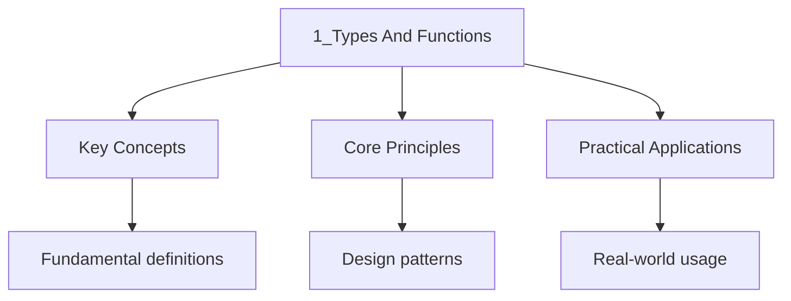

---

title: "Types and Functions | Languages"
description: "Haskell has a relatively small set of built-in types, but they combine to express complex data structures. The module is automatically imported in every"
date: 2026-06-04T10:00:00.000Z
tags:
  - Haskell
categories:
  - Haskell

---

<!-- Breadcrumb Schema for SEO -->
<script type="application/ld+json">
{
  "@context": "https://schema.org",
  "@type": "BreadcrumbList",
  "itemListElement": [{"name": "Home", "url": "https://wyattau.com"}, {"name": "languages", "url": "https://languages.wyattau.com"}, {"name": "Haskell", "url": "https://languages.wyattau.com/haskell"}, {"name": "01 Basics", "url": "https://languages.wyattau.com/haskell/01-basics"}, {"name": "1_types And Functions", "url": "https://languages.wyattau.com/haskell/01-basics/1_types-and-functions"}]
}
</script>

## Basic Types

Haskell has a relatively small set of built-in types, but they combine to express complex data
structures. The `Prelude` module is automatically imported in every Haskell file and provides these
foundational types.

### Numeric Types

```haskell
-- Int: fixed-size integers (machine word, in standard practice 64-bit)
count :: Int
count = 42

-- Integer: arbitrary-precision integers (no overflow)
bigNumber :: Integer
bigNumber = 10^100

-- Float: single-precision floating point
piFloat :: Float
piFloat = 3.14159

-- Double: double-precision floating point
piDouble :: Double
piDouble = 3.141592653589793
```

The distinction between `Int` and `Integer` matters for correctness:

```haskell
-- Int can overflow on large computations
sumInts :: Int -> Int
sumInts n = sum [1..n]
-- sumInts (10^9) may overflow

-- Integer never overflows
sumIntegers :: Integer -> Integer
sumIntegers n = sum [1..n]
-- sumIntegers (10^100) works correctly
```

### Boolean Type

```haskell
-- Bool has two values: True and False
isEven :: Int -> Bool
isEven n = n `mod` 2 == 0

-- Boolean operators
-- (&&) :: Bool -> Bool -> Bool  -- logical AND (short-circuits)
-- (||) :: Bool -> Bool -> Bool  -- logical OR (short-circuits)
-- not :: Bool -> Bool           -- logical NOT
```

### Character and String Types

```haskell
-- Char: single Unicode character
letter :: Char
letter = "a'

-- String is a type synonym for [Char]
-- String = [Char]
greeting :: String
greeting = "Hello"
-- This is actually: ['H', 'e', 'l', 'l', 'o']
```

In practice, Haskell programs often use the `Text` type from the `text` package for efficient string
operations, since `String` (linked list of `Char`) has $O(n)$ indexing and concatenation.

### Unit Type

```haskell
-- () has a single value also written as ()
-- Used as a placeholder when no meaningful value is needed
unit :: ()
unit = ()

-- Common in IO: IO () means an action that produces no useful result
main :: IO ()
main = putStrLn "Hello"
```

## Type Variables and Signatures

### Polymorphic Types

Type variables (lowercase names) make functions polymorphic -- they work with any type:

```haskell
-- 'a' is a type variable; id works for any type
id :: a -> a
id x = x

-- Works with multiple type variables
const :: a -> b -> a
const x _ = x

-- Polymorphic over the element type
head :: [a] -> a
head (x:_) = x

-- Polymorphic over both element types
zip :: [a] -> [b] -> [(a, b)]
zip [] _ = []
zip _ [] = []
zip (x:xs) (y:ys) = (x, y) : zip xs ys
```

### Type Annotations

When the compiler cannot infer a type or when you want to constrain it, use annotations:

```haskell
-- Defaulting: literal numbers default to Integer or Double
-- Annotations override the default
x :: Int
x = 42

y :: Double
y = 3.14

-- Annotation on sub-expressions
result = (1 :: Int) + (2 :: Int)

-- Polymorphic function with concrete instantiation
-- (++) :: [a] -> [a] -> [a]
-- When used with [Char]: [Char] -> [Char] -> [Char]
greeting = "Hello" ++ " " ++ "World" :: String
```

## Function Definition Syntax

### Basic Definitions

```haskell
-- Simple function definition
add :: Int -> Int -> Int
add x y = x + y

-- No arguments required if type is clear
double :: Int -> Int
double = (*2)

-- Multiple equations for different patterns
absolute :: Int -> Int
absolute n
  | n < 0     = negate n
  | otherwise = n
```

### Guards

Guards provide a readable way to express conditional logic:

```haskell
classify :: Int -> String
classify n
  | n < 0     = "negative"
  | n == 0    = "zero"
  | n < 10    = "small positive"
  | n < 100   = "medium positive"
  | otherwise = "large positive"
```

Guards are evaluated top to bottom; the first one that evaluates to `True` is used. `otherwise` is
defined as `True` and serves as a catch-all:

```haskell
-- otherwise is defined in the Prelude as:
-- otherwise :: Bool
-- otherwise = True
```

### Where Clauses

`where` binds local definitions that are visible across all guards:

```haskell
bmi :: Double -> Double -> String
bmi weight height
  | bmiValue < 18.5 = "underweight"
  | bmiValue < 25.0 = "normal"
  | bmiValue < 30.0 = "overweight"
  | otherwise       = "obese"
  where
    bmiValue = weight / height ^ 2
```

`where` can define multiple bindings, including functions:

```haskell
roots :: Double -> Double -> Double -> (Double, Double)
roots a b c
  | disc < 0   = error "No real roots"
  | otherwise  = ((-b + sqrtD) / (2 * a), (-b - sqrtD) / (2 * a))
  where
    disc  = b * b - 4 * a * c
    sqrtD = sqrt disc
```

### Let Expressions

`let` bindings are expressions (they produce a value), unlike `where` which is a declaration:

```haskell
-- let ... in ... is an expression
cylinderVolume :: Double -> Double -> Double
cylinderVolume r h =
  let area = pi * r * r
  in area * h

-- let in do notation (no 'in' needed)
printVolumes :: [(Double, Double)] -> IO ()
printVolumes radiiAndHeights = do
  let total = sum [pi * r * r * h | (r, h) <- radiiAndHeights]
  putStrLn ("Total volume: " ++ show total)
```

The key difference: `let` bindings are scoped to the expression they precede, while `where` bindings
are scoped to the entire function definition:

```haskell
-- where: visible across all guards
f x y
  | y > 0     = result + 1
  | otherwise = result - 1
  where result = x + y

-- let: scoped to the expression
g x y =
  let result = x + y
  in if y > 0 then result + 1 else result - 1
```

## Tuples

### Tuple Types

Tuples group a fixed number of values of potentially different types:

```haskell
-- Pair: two elements
pair :: (Int, String)
pair = (1, "one")

-- Triple
triple :: (Int, String, Bool)
triple = (1, "one", True)

-- Nested tuples
nested :: ((Int, Int), String)
nested = ((1, 2), "nested")

-- Tuple type constructor
-- (,) :: a -> b -> (a, b)
-- (,,) :: a -> b -> c -> (a, b, c)
```

### Tuple Operations

```haskell
-- fst and snd extract from pairs
fst :: (a, b) -> a
snd :: (a, b) -> b

fst (1, "hello")  -- => 1
snd (1, "hello")  -- => "hello"

-- No built-in accessors for triples; use pattern matching
third :: (a, b, c) -> c
third (_, _, z) = z

-- curry and uncurry convert between styles
-- curry :: ((a, b) -> c) -> a -> b -> c
-- uncurry :: (a -> b -> c) -> (a, b) -> c

addPair :: (Int, Int) -> Int
addPair = uncurry (+)
-- addPair (3, 4) => 7

addUncurried :: Int -> Int -> Int
addUncurried = curry addPair
-- addUncurried 3 4 => 7
```

## Lists

### List Basics

Lists are homogeneous (all elements must have the same type) and can be empty or of any length:

```haskell
-- List type: [a] is sugar for []
-- [] :: [a]           -- empty list
-- (:) :: a -> [a] -> [a]  -- cons operator

nums :: [Int]
nums = [1, 2, 3, 4, 5]

-- [1, 2, 3] is syntactic sugar for 1 : 2 : 3 : []

-- Lists of different types
chars :: [Char]
chars = ['a', 'b', 'c']

-- String is [Char]
str :: [Char]
str = "hello"
```

### List Operations

```haskell
-- head: first element (partial -- crashes on empty list)
head :: [a] -> a
head (x:_) = x

-- tail: all but first element
tail :: [a] -> [a]
tail (_:xs) = xs

-- last: last element
last :: [a] -> a

-- init: all but last element
init :: [a] -> [a]

-- length: number of elements
length :: [a] -> Int

-- null: check if empty (total -- safe)
null :: [a] -> Bool
null [] = True
null _  = False

-- reverse: reverse the list
reverse :: [a] -> [a]

-- take and drop
take :: Int -> [a] -> [a]
drop :: Int -> [a] -> [a]

take 3 [1, 2, 3, 4, 5]  -- => [1, 2, 3]
drop 3 [1, 2, 3, 4, 5]  -- => [4, 5]

-- !! (index operator) -- partial, O(n)
[1, 2, 3] !! 1  -- => 2

-- concat: flatten a list of lists
concat :: [[a]] -> [a]
concat [[1,2], [3,4], [5]]  -- => [1,2,3,4,5]

-- elem: membership test
elem :: (Eq a) => a -> [a] -> Bool
3 `elem` [1, 2, 3]  -- => True
```

### Ranges

```haskell
-- Numeric ranges
[1..10]         -- => [1, 2, 3, 4, 5, 6, 7, 8, 9, 10]
[1, 3..10]      -- => [1, 3, 5, 7, 9]  (step of 2)
[10, 9..1]      -- => [10, 9, 8, 7, 6, 5, 4, 3, 2, 1]

-- Character ranges
['a'..'z']      -- => "abcdefghijklmnopqrstuvwxyz"
['A'..'Z']      -- => "ABCDEFGHIJKLMNOPQRSTUVWXYZ"

-- Infinite ranges (safe because of laziness)
naturals = [0..]           -- [0, 1, 2, 3, ...]
evens = [0, 2..]           -- [0, 2, 4, 6, ...]
```

### List Comprehensions

List comprehensions provide a concise syntax for building lists:

```haskell
-- Basic comprehension: [expression | generators, guards]
squares :: [Int]
squares = [x^2 | x <- [1..10]]
-- => [1, 4, 9, 16, 25, 36, 49, 64, 81, 100]

-- With guards
evenSquares :: [Int]
evenSquares = [x^2 | x <- [1..10], even x]
-- => [4, 16, 36, 64, 100]

-- Multiple generators
pairs :: [(Int, Int)]
pairs = [(x, y) | x <- [1..3], y <- [1..3]]
-- => [(1,1),(1,2),(1,3),(2,1),(2,2),(2,3),(3,1),(3,2),(3,3)]

-- Pythagorean triples
pythagorean :: [(Int, Int, Int)]
pythagorean =
  [ (a, b, c)
  | c <- [1..50]
  , b <- [1..c]
  , a <- [1..b]
  , a^2 + b^2 == c^2
  ]
-- => [(3,4,5), (6,8,10), (5,12,13), (9,12,15), ...]
```

### Comprehension Transformations

The `let` and transformations are supported inside comprehensions:

```haskell
-- let binding in comprehension
sizedStrings :: [(Int, String)]
sizedStrings = [(len, s) | s <- ["hi", "hello", "world"], let len = length s]

-- Sorting and transformations
-- sort, nub, reverse in generators
uniqueSorted :: [Int]
uniqueSorted = sort (nub [3, 1, 4, 1, 5, 9, 2, 6, 5])
```

## Operators and Sections

### Infix Operators

Operators in Haskell are functions written between their arguments:

```haskell
-- Infix: 2 + 3
-- Prefix: (+) 2 3

-- Section: partially apply an infix operator
-- (1+) means \x -> 1 + x
-- (+1) means \x -> x + 1
-- (*2) means \x -> x * 2

incrementAll :: [Int] -> [Int]
incrementAll = map (1+)

doubleAll :: [Int] -> [Int]
doubleAll = map (*2)

-- Sections with both sides
subtractFrom :: Int -> [Int] -> [Int]
subtractFrom n = map (n-)

-- ($) function application operator (lowest precedence, right-associative)
-- ($) :: (a -> b) -> a -> b
-- Allows removing parentheses
result = print $ show $ map (*2) [1..5]
-- Equivalent to: print (show (map (*2) [1..5]))

-- (.) function composition
-- (.) :: (b -> c) -> (a -> b) -> (a -> c)
-- Composes two functions right-to-left
doubleAndInc :: Int -> Int
doubleAndInc = (+1) . (*2)
-- doubleAndInc 3 = (+1) ((*2) 3) = (+1) 6 = 7
```

### Operator Precedence and Associativity

```haskell
-- Operators have precedence levels (0-9) and associativity
-- :info in GHCi shows details
-- ghci> :info +
-- type Num a => a -> a -> a
-- infixl 6 +

-- infixl: left-associative
-- 1 + 2 + 3 = (1 + 2) + 3

-- infixr: right-associative
-- 1 : 2 : [] = 1 : (2 : [])

-- infix: non-associative
-- 5 == 5 == True  -- type error

-- Common precedence levels:
-- 9: !! (index)
-- 8: *, /, `div`, `mod`
-- 7: +, -
-- 6: ++, :, (comparisons)
-- 5: ==, /=, <, >, <=, >=
-- 4: &&, $, $!
-- 3: ||, ^^
```

## Currying and Partial Application

### All Functions Are Curried

In Haskell, every function takes exactly one argument and returns either a result or another
function:

```haskell
-- This function:
add :: Int -> Int -> Int
add x y = x + y

-- Is really:
add :: Int -> (Int -> Int)
-- add takes an Int and returns a function Int -> Int

-- Partial application: provide some arguments
add5 :: Int -> Int
add5 = add 5
-- add5 3 = 8
-- add5 10 = 15
```

### Partial Application in Practice

Partial application is fundamental to Haskell programming style:

```haskell
-- map takes a function and a list
-- map :: (a -> b) -> [a] -> [b]

-- We can partially apply map by giving it just the function
doubleAll = map (*2)
-- doubleAll :: Num a => [a] -> [a]

filterPositive = filter (> 0)
-- filterPositive :: (Ord a, Num a) => [a] -> [a]

-- Partial application with multi-argument functions
divideBy :: Double -> Double -> Double
divideBy = flip (/)
-- divideBy 2 10 = 5.0 (10 / 2)

-- Partial application creates reusable abstractions
process = map (\x -> x * 2 + 1)
process [1, 2, 3]  -- => [3, 5, 7]
```

### Flip

`flip` reverses the order of the first two arguments of a function:

```haskell
-- flip :: (a -> b -> c) -> b -> a -> c
-- flip f x y = f y x

-- Example: divide
divide :: Double -> Double -> Double
divide = (/)
-- divide 10 2 = 5.0

-- flip to change argument order
divideBy :: Double -> Double -> Double
divideBy = flip (/)
-- divideBy 10 2 = 0.2 (2 / 10)

-- Useful with folds
-- foldl (/) 1 [1, 2, 4] = ((1 / 1) / 2) / 4 = 0.125
-- foldl (flip (/)) 1 [1, 2, 4] = flip (/) (flip (/) 1 1) 2 = 4.0
```

## Lambda Expressions

### Anonymous Functions

Lambda expressions (anonymous functions) are written with a backslash:

```haskell
-- \arguments -> body
-- \x -> x + 1        -- adds 1
-- \x y -> x + y      -- adds two numbers
-- \x -> \y -> x + y  -- same as above (curried)

-- Common use: as argument to higher-order functions
map (\x -> x + 1) [1, 2, 3]        -- => [2, 3, 4]
filter (\x -> x > 3) [1, 2, 3, 4]  -- => [4]
```

### When to Use Lambdas

```haskell
-- Short lambdas: use inline
map (*2) xs           -- operator section is cleaner
filter (\x -> x > 0) xs  -- simple lambda is fine

-- When pattern matching is needed in the lambda
map (\(x, y) -> x + y) [(1, 2), (3, 4)]  -- => [3, 7]

-- Multi-line lambdas (use let or where instead)
longComputation xs = map (\x ->
  let doubled = x * 2
  in doubled + doubled + 1
  ) xs
```

## Higher-Order Functions

A **higher-order function** either takes a function as an argument, returns a function, or both.
They are the backbone of functional programming.

### map

`map` applies a function to every element of a list:

```haskell
-- map :: (a -> b) -> [a] -> [b]
map :: (a -> b) -> [a] -> [b]
map _ []     = []
map f (x:xs) = f x : map f xs

-- Usage
map (*2) [1, 2, 3]        -- => [2, 4, 6]
map show [1, 2, 3]        -- => ["1", "2", "3"]
map even [1, 2, 3, 4]     -- => [False, True, False, True]

-- Chaining maps
transform :: [Int] -> [Int]
transform = map (+1) . map (*2) . filter (> 0)
-- transform [-1, 0, 1, 2, 3] => [1, 3, 5, 7]
```

### filter

`filter` keeps elements that satisfy a predicate:

```haskell
-- filter :: (a -> Bool) -> [a] -> [a]
filter :: (a -> Bool) -> [a] -> [a]
filter _ [] = []
filter p (x:xs)
  | p x       = x : filter p xs
  | otherwise  = filter p xs

-- Usage
filter even [1..10]       -- => [2, 4, 6, 8, 10]
filter (> 5) [1..10]       -- => [6, 7, 8, 9, 10]
filter (/= ' ') "h e l l o" -- => "hello"

-- Common patterns
-- keep: filter p xs
-- discard: filter (not . p) xs
-- find: find (\x -> condition x) xs  -- returns Maybe a
```

### foldr (Right Fold)

`foldr` processes a list from right to left, building the result as it goes:

```haskell
-- foldr :: (a -> b -> b) -> b -> [a] -> b
-- foldr f z [x1, x2, ..., xn] = x1 `f` (x2 `f` (... (xn `f` z)))
foldr :: (a -> b -> b) -> b -> [a] -> b
foldr _ z []     = z
foldr f z (x:xs) = f x (foldr f z xs)

-- Usage
foldr (+) 0 [1, 2, 3, 4]  -- => 1 + (2 + (3 + (4 + 0))) = 10
foldr (*) 1 [1, 2, 3, 4]  -- => 1 * (2 * (3 * (4 * 1))) = 24
foldr (:) [] [1, 2, 3]    -- => 1 : (2 : (3 : [])) = [1, 2, 3]

-- foldr works on infinite lists (when f is lazy in its second argument)
-- take 5 (foldr (:) [] [1..]) = [1, 2, 3, 4, 5]
-- This works because (:) is lazy in its second argument
```

### foldl (Left Fold)

`foldl` processes a list from left to right, threading an accumulator:

```haskell
-- foldl :: (b -> a -> b) -> b -> [a] -> b
-- foldl f z [x1, x2, ..., xn] = (...((z `f` x1) `f` x2)...) `f` xn
foldl :: (b -> a -> b) -> b -> [a] -> b
foldl _ acc []     = acc
foldl f acc (x:xs) = foldl f (f acc x) xs

-- Usage
foldl (+) 0 [1, 2, 3, 4]  -- => ((((0 + 1) + 2) + 3) + 4) = 10

-- foldl' is the strict version (from Data.List)
-- It forces the accumulator at each step, preventing space leaks
import Data.List (foldl')

foldl' (+) 0 [1..1000000]  -- works without space leak
```

### Choosing Between foldr and foldl

```haskell
-- Use foldr when:
-- 1. Building a list (foldr (:) [] xs)
-- 2. The combining function is lazy in its second argument
-- 3. Processing infinite lists
-- 4. The right-associative structure is natural (e.g., tree building)

-- Use foldl' when:
-- 1. Computing a single accumulated result (sum, product)
-- 2. The combining function is strict in both arguments
-- 3. The left-associative structure is natural
-- 4. Processing finite lists

-- Examples of each:
concatWithFoldr :: [[a]] -> [a]
concatWithFoldr = foldr (++) []

sumWithFoldl :: [Int] -> Int
sumWithFoldl = foldl' (+) 0

-- foldr can be lazy: this finds the first element satisfying p
findFirst :: (a -> Bool) -> a -> [a] -> a
findFirst p defaultVal = foldr (\x acc -> if p x then x else acc) defaultVal
```

### scanl and scanr

Scans are like folds but produce all intermediate results:

```haskell
-- scanl :: (b -> a -> b) -> b -> [a] -> [b]
scanl (+) 0 [1, 2, 3, 4]  -- => [0, 1, 3, 6, 10]
-- Running sums: 0, 0+1, 0+1+2, 0+1+2+3, 0+1+2+3+4

-- scanr :: (a -> b -> b) -> b -> [a] -> [b]
scanr (+) 0 [1, 2, 3, 4]  -- => [10, 9, 7, 4, 0]

-- Useful for fibonacci-like sequences
fibs = scanl (+) 0 (1 : fibs)
-- => [0, 1, 1, 2, 3, 5, 8, 13, ...]
```

### zipWith and friends

```haskell
-- zipWith applies a function to corresponding elements
-- zipWith :: (a -> b -> c) -> [a] -> [b] -> [c]
zipWith (+) [1, 2, 3] [10, 20, 30]  -- => [11, 22, 33]

-- zipWith3 with three lists
-- zipWith3 :: (a -> b -> c -> d) -> [a] -> [b] -> [c] -> [d]
zipWith3 (\x y z -> x + y + z) [1,2] [10,20] [100,200]
-- => [111, 222]

-- unzip converts a list of pairs back to a pair of lists
unzip :: [(a, b)] -> ([a], [b])
unzip [(1,'a'), (2,'b'), (3,'c')]
-- => ([1,2,3], "abc")
```

## Function Composition

### The (.) Operator

```haskell
-- (.) :: (b -> c) -> (a -> b) -> a -> c
-- (f . g) x = f (g x)
-- Composes functions right-to-left

-- Reading right to left: square, then add one, then negate
transform :: Int -> Int
transform = negate . (+1) . (^2)
-- transform 3 = negate ( (+1) (3^2)) = negate 10 = -10

-- Point-free style: no explicit arguments
-- Instead of: \xs -> length (filter even xs)
-- Write:
countEven = length . filter even
```

### Point-Free Style

Point-free (tacit) programming avoids naming function arguments:

```haskell
-- With arguments
sumSquares xs = sum (map (^2) xs)
-- Point-free
sumSquares = sum . map (^2)

-- With arguments
allPositive xs = all (> 0) xs
-- Point-free
allPositive = all (> 0)

-- With arguments
pairs xs = zip xs (tail xs)
-- Point-free
pairs = zip <*> tail

-- Be careful: excessive point-free can hurt readability
-- This is too obscure:
-- f = ((.).(.)) (+) (*)
-- Prefer the named version
```




## Intuition

**Types are contracts, functions are machines:** In Haskell, a type signature like `Int -> Int -> Int` is a contract that says "this machine takes two integers and produces an integer." The compiler verifies that every machine honors its contract. Currying is the assembly line trick: instead of one machine that takes two parts, you have a machine that takes one part and returns a *new machine* that takes the second part. Partial application is snapping the first machine onto the line and getting a custom machine for free.

**Why it matters:** Haskell's type system is so powerful that the types alone tell you what a function does. A function with type `[a] -> [a]` *must* rearrange elements without adding or removing any — the type forces this behavior. This makes code self-documenting and enables refactoring with confidence.

**The key insight:** In Haskell, "partial application" isn't a special feature — it's the default. Every function takes exactly one argument and returns either a result or another function, which means you can compose and transform functions like building blocks.

## Putting It All Together

```haskell
-- A practical example combining many concepts
module WordCount where

import Data.Char (toLower, isAlpha)
import Data.List (sort, group)

-- Count word frequencies in a string
wordFrequencies :: String -> [(String, Int)]
wordFrequencies =
  map (\grouped -> (head grouped, length grouped))
  . group
  . sort
  . words
  . map toLower
  . filter isWordChar
  where
    isWordChar c = isAlpha c || c == ' '

-- Total word count
totalWords :: String -> Int
totalWords = length . words

-- Top N most frequent words
topNWords :: Int -> String -> [(String, Int)]
topNWords n text =
  take n
  . reverse
  . sort
  . wordFrequencies
  $ text

-- Alternative using let
wordFrequenciesLet :: String -> [(String, Int)]
wordFrequenciesLet text =
  let lowered   = map toLower text
      filtered  = filter isWordChar lowered
      wordList  = words filtered
      sorted    = sort wordList
      grouped   = group sorted
  in map countGroup grouped
  where
    countGroup ws = (head ws, length ws)

## Cross-References

- **[Pattern Matching](../02-pattern-matching/1_pattern-matching.md):** Extends function dispatch with structural pattern matching on data types.
- **[Monads and Functors](../04-monads/1_monads-and-functors.md):** Higher-kinded abstractions built on the function composition introduced here.
- **[Advanced Types](../05-advanced/1_advanced-types.md):** GADTs and type families that extend the basic type system.

## Common Mistakes

- **Confusing function application with function composition:** `f . g` composes two functions (outputs of `g` feed into `f`), while `f g` applies `f` to the argument `g`. Beginners often write `f . g x` when they mean `(f . g) x`.
- **Ignoring type signatures in GHCi:** When testing a function, always check its type with `:t`. A type mismatch is almost always a logic error. GHCi's type inference is precise — trust it.
- **Overusing `where` clauses instead of `let` or point-free style:** Nested `where` clauses can obscure scope. Use `let` for local bindings that are evidently scoped, and point-free style only when it improves readability, not as an end in itself.
- **Forgetting that Haskell is lazy by default:** Expressions are not evaluated until their results are needed. This can cause space leaks where thunks accumulate in memory. Use `seq`, bang patterns (`!`), or `StrictData` to force evaluation when necessary.
