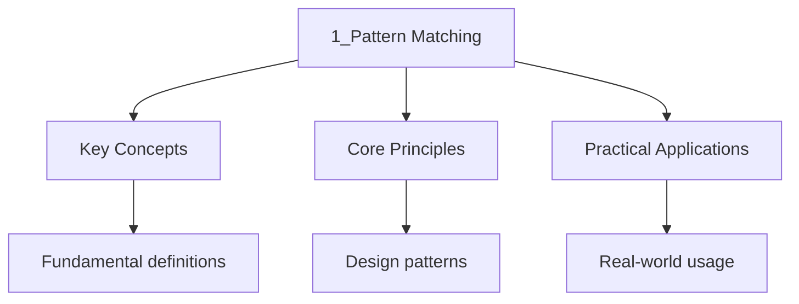

---

title: "Pattern Matching | Languages - Wyatt's Notes"
description: "Pattern matching is a mechanism for checking data against a pattern and deconstructing data into its components. It is one of the most powerful features in"
date: 2026-06-04T10:00:00.000Z
tags:
  - Haskell
categories:
  - Haskell

---

<!-- Breadcrumb Schema for SEO -->
<script type="application/ld+json">
{
  "@context": "https://schema.org",
  "@type": "BreadcrumbList",
  "itemListElement": [{"name": "Home", "url": "https://wyattau.com"}, {"name": "languages", "url": "https://languages.wyattau.com"}, {"name": "Haskell", "url": "https://languages.wyattau.com/haskell"}, {"name": "02 Pattern Matching", "url": "https://languages.wyattau.com/haskell/02-pattern-matching"}, {"name": "1_pattern Matching", "url": "https://languages.wyattau.com/haskell/02-pattern-matching/1_pattern-matching"}]
}
</script>

## What Is Pattern Matching?

Pattern matching is a mechanism for checking data against a pattern and deconstructing data into its
components. It is one of the most powerful features in Haskell, enabling concise and expressive code
that directly reflects the structure of data types.

When you write a function definition with multiple equations, each equation has a **pattern** on the
left side. The compiler matches the argument against these patterns in order, executing the right
side of the first matching equation.

## Matching on Literals

Literals are the simplest patterns -- they match specific constant values:

```haskell
-- Matching on integer literals
isZero :: Int -> String
isZero 0 = "zero"
isZero _ = "not zero"

-- Matching on character literals
vowel :: Char -> Bool
vowel "a' = True
vowel 'e' = True
vowel 'i' = True
vowel 'o' = True
vowel 'u' = True
vowel _   = False

-- Matching on string literals (which are lists of characters)
sayHello :: String -> String
sayHello "world" = "Hello, World!"
sayHello "haskell" = "Hello, Haskell!"
sayHello _ = "Hello, stranger!"
```

## Variable Patterns and Wildcards

### Variable Patterns

A variable pattern matches **anything** and **binds** the matched value to that variable:

```haskell
-- 'x' matches any value and binds it
describe :: Int -> String
describe x = "The number is " ++ show x

-- 'xs' matches any list and binds it
listLength :: [a] -> Int
listLength xs = length xs
```

### Wildcard Pattern

The wildcard `_` matches **anything** but **does not bind** the value. It signals that the matched
value is not needed:

```haskell
-- Using wildcard for the second element of a pair
firstOf :: (a, b) -> a
firstOf (a, _) = a

-- Using wildcard for unused parts
third :: (a, b, c) -> c
third (_, _, c) = c

-- Wildcard as catch-all
classify :: Int -> String
classify 0 = "zero"
classify 1 = "one"
classify _ = "other"
```

### Important: Variable vs Wildcard

```haskell
-- Variable pattern: binds the value
-- Using 'x' in multiple equations means DIFFERENT bindings
f True  = show x  -- ERROR: x is not in scope here
f False = show x  -- ERROR: x is not in scope here

-- Correct: wildcard or different variables
g True  = "true"
g False = "false"

-- A variable 'x' in a pattern binds the whole value
h :: (Int, Int) -> Int
h (x, _) = x  -- x is bound to the first element
h (_, x) = x  -- x is bound to the second element
-- These are DIFFERENT equations with different bindings
```

## Constructor Patterns

### Matching on Data Constructors

Data constructors are the primary mechanism for pattern matching in Haskell. Each constructor
defines a shape that can be matched:

```haskell
data Bool = False | True

data Maybe a = Nothing | Just a

isJust :: Maybe a -> Bool
isJust (Just _) = True
isJust Nothing  = False

fromMaybe :: a -> Maybe a -> a
fromMaybe def Nothing  = def
fromMaybe _   (Just x) = x
```

### Nested Constructor Patterns

Patterns can be nested arbitrarily deep:

```haskell
data Tree a = Leaf a | Branch (Tree a) (Tree a)

-- Count leaves in a tree
countLeaves :: Tree a -> Int
countLeaves (Leaf _)     = 1
countLeaves (Branch l r) = countLeaves l + countLeaves r

-- Check if a value exists in a tree
contains :: Eq a => a -> Tree a -> Bool
contains x (Leaf y)     = x == y
contains x (Branch l r) = contains x l || contains x r

-- Sum of all leaf values
treeSum :: Num a => Tree a -> a
treeSum (Leaf x)     = x
treeSum (Branch l r) = treeSum l + treeSum r
```

## Matching on Tuples

Tuples have a fixed structure that can be deconstructed in patterns:

```haskell
-- Destructuring a pair
swap :: (a, b) -> (b, a)
swap (a, b) = (b, a)

-- Extracting components
getName :: (String, Int, String) -> String
getName (name, _, _) = name

getAge :: (String, Int, String) -> Int
getAge (_, age, _) = age

-- Nested tuple destructuring
innerFirst :: ((a, b), c) -> a
innerFirst ((a, _), _) = a

-- Using tuple patterns in list comprehensions
pairs :: [(Int, Int)]
pairs = [(x, y) | x <- [1..3], y <- [1..3], x /= y]
-- => [(1,2),(1,3),(2,1),(2,3),(3,1),(3,2)]
```

## Matching on Lists

### List Constructors

Lists are built from two constructors: `[]` (empty list) and `:` (cons -- prepend an element to a
list). Pattern matching on lists uses these constructors:

```haskell
-- Empty list
isEmpty :: [a] -> Bool
isEmpty [] = True
isEmpty _  = False

-- Non-empty list: x is head, xs is tail
headOrDefault :: a -> [a] -> a
headOrDefault def []     = def
headOrDefault _   (x:_)  = x

-- Matching the first two elements
second :: [a] -> a
second (_:x:_) = x

-- Matching exactly two elements
pairToList :: (a, a) -> [a]
pairToList (a, b) = [a, b]

-- Counting length via pattern matching
myLength :: [a] -> Int
myLength []     = 0
myLength (_:xs) = 1 + myLength xs
```

### Common List Patterns

```haskell
-- Singleton list
isSingleton :: [a] -> Bool
isSingleton [_]    = True
isSingleton _       = False

-- Exactly three elements
firstOfThree :: [a] -> a
firstOfThree (x:_) = x

-- Splitting at a specific position
splitAtTwo :: [a] -> ([a], [a])
splitAtTwo (a:b:rest) = ([a, b], rest)
splitAtTwo xs          = (xs, [])

-- Matching a range of elements
startsWith :: Eq a => [a] -> [a] -> Bool
startsWith []     _      = True
startsWith _      []     = False
startsWith (x:xs) (y:ys) = x == y && startsWith xs ys
```

## As-Patterns

The **as-pattern** (`@`) binds the entire matched value while also allowing deconstruction:

```haskell
-- Without as-pattern: we lose access to the original
sumFirstTwo :: Num a => [a] -> a
sumFirstTwo (x:y:_) = x + y

-- With as-pattern: we keep the whole list and also its parts
sumAndKeep :: Num a => [a] -> (a, [a])
sumAndKeep xs@(_:_:_) = (head xs + head (tail xs), xs)
sumAndKeep xs          = (0, xs)

-- More practical example
capitaliseFirst :: String -> String
capitaliseFirst [] = []
capitaliseFirst s@(c:cs) = toUpper c : cs
-- 's' gives us the whole string, 'c' and 'cs' give us head and tail

-- Transforming while keeping the original
firstAndRest :: [a] -> (a, [a])
firstAndRest xs@(x:_) = (x, xs)
firstAndRest [] = error "empty list"

-- Checking a property of the whole while deconstructing
longEnough :: Int -> String -> Maybe String
longEnough n s@(c:cs)
  | length s >= n = Just s
  | otherwise     = Nothing
longEnough _ [] = Nothing
```

## Case Expressions

Case expressions allow pattern matching anywhere, not just in function definitions:

```haskell
-- Case expression: match on any value
describeNumber :: Int -> String
describeNumber n = case n of
  0 -> "zero"
  1 -> "one"
  _ -> "other"

-- Case is useful inside other expressions
addOrDouble :: Maybe Int -> Int
addOrDouble mx = case mx of
  Nothing  -> 0
  Just x   -> x + x

-- Nested case expressions
classifyPair :: (Int, Int) -> String
classifyPair (a, b) = case (a, b) of
  (0, 0) -> "origin"
  (0, _) -> "on y-axis"
  (_, 0) -> "on x-axis"
  _      -> case compare a b of
    LT -> "below diagonal"
    EQ -> "on diagonal"
    GT -> "above diagonal"
```

### Case vs Function Equations

```haskell
-- These are equivalent:

-- Using multiple equations
factorial :: Integer -> Integer
factorial 0 = 1
factorial n = n * factorial (n - 1)

-- Using case expression
factorial :: Integer -> Integer
factorial n = case n of
  0 -> 1
  _ -> n * factorial (n - 1)

-- Case is needed when the value to match comes from
-- an expression, not a function argument
processPair :: (Int, Int) -> Int
processPair (a, b) = case a + b of
  result | result > 10 -> result * 2
         | result > 5  -> result
         | otherwise   -> 0
```

## Pattern Guards

Pattern guards refine pattern matching with boolean conditions:

```haskell
-- Regular guards
classify xs
  | null xs       = "empty"
  | length xs > 5 = "long"
  | otherwise     = "short"

-- Pattern guards: combine patterns with boolean conditions
-- Requires PatternGuards extension (enabled by default in GHC)
sortPair :: Ord a => (a, a) -> (a, a)
sortPair p
  | (a, b) <- p, a <= b = (a, b)
  | (a, b) <- p, a > b  = (b, a)

-- More useful example: parsing a command
parseCommand :: String -> Maybe (String, String)
parseCommand s
  | (cmd, ': ":args) <- break (== '':") s, not (null cmd) = Just (cmd, args)
  | otherwise = Nothing
```

## Pattern Matching in Let and Where

### Let Patterns

```haskell
-- Destructuring in let
firstAndSecond :: [a] -> (a, a)
firstAndSecond xs =
  let (x:y:_) = xs
  in (x, y)

-- Using let with Maybe
processMaybe :: Maybe (Int, String) -> String
processMaybe m =
  let (Just (n, s)) = m  -- partial! crashes on Nothing
  in show n ++ ": " ++ s

-- Safe version using case
processMaybeSafe :: Maybe (Int, String) -> String
processMaybeSafe m = case m of
  Just (n, s) -> show n ++ ": " ++ s
  Nothing     -> "no data"
```

### Where Patterns

```haskell
-- Where clauses can also use pattern matching
-- (though this is less common)
bmiTell :: Double -> Double -> Double -> String
bmiTell weight height bmi
  | bmi < 18.5 = "underweight"
  | bmi < 25.0 = "normal"
  | otherwise   = "overweight"
  where
    bmi = weight / height ^ 2

-- Pattern matching in where
sumFirstTwo :: (Int, Int, Int) -> Int
sumFirstTwo triple = a + b
  where
    (a, b, _) = triple
```

## Exhaustive Matching

### Non-Exhaustive Patterns

When patterns do not cover all possible values, the compiler warns (with `-Wall`) and the program
may crash at runtime:

```haskell
-- Non-exhaustive: what happens with Nothing?
unsafeHead :: Maybe a -> a
unsafeHead (Just x) = x
-- GHC warning: Pattern match(es) are non-exhaustive
-- Runtime error on Nothing: *** Exception: ...
```

### Making Patterns Exhaustive

```haskell
-- Add a catch-all wildcard
safeHead :: Maybe a -> Maybe a
safeHead (Just x) = Just x
safeHead Nothing  = Nothing

-- Or use Maybe explicitly
safeHead2 :: Maybe a -> Maybe a
safeHead2 Nothing  = Nothing
safeHead2 (Just x) = Just x
```

### Exhaustiveness and Custom Types

```haskell
data Direction = North | South | East | West

-- Exhaustive: covers all constructors
opposite :: Direction -> Direction
opposite North = South
opposite South = North
opposite East  = West
opposite West  = East

-- With -Wall, GHC warns if any constructor is missing
```

## Overlapping Patterns

Patterns are matched **top to bottom**. More specific patterns should come before general ones:

```haskell
-- Correct: specific patterns first
describe :: Int -> String
describe 0  = "zero"
describe 1  = "one"
describe 42 = "the answer"
describe _  = "other"

-- This works the same but is less readable if specific cases
-- are buried among general ones
```

With guards, order matters because the first `True` guard wins:

```haskell
-- Order matters here
grade :: Int -> Char
grade score
  | score >= 90 = 'A'
  | score >= 80 = 'B'
  | score >= 70 = 'C'
  | score >= 60 = 'D'
  | otherwise   = 'F'

-- This would be wrong if reordered:
-- | score >= 60 = 'D'
-- | score >= 90 = 'A'  -- unreachable!
```

## View Patterns

The ViewPatterns extension allows pattern matching through a function (a "view"):

```haskell
{-# LANGUAGE ViewPatterns #-}

-- Instead of:
process :: String -> String
process s = case length s of
  0 -> "empty"
  1 -> "singleton"
  n | n > 10 -> "long"
    | otherwise -> "medium"

-- With view patterns:
process :: String -> String
process (length -> 0)  = "empty"
process (length -> 1)  = "singleton"
process (length -> n)
  | n > 10    = "long"
  | otherwise = "medium"

-- Custom view functions
isPositive :: Int -> Maybe Int
isPositive n
  | n > 0     = Just n
  | otherwise = Nothing

safeDiv :: Int -> Int -> Maybe Int
safeDiv _ 0 = Nothing
safeDiv x (isPositive -> Just y) = Just (x `div` y)
safeDiv _ _ = Nothing
```

## Data vs Newtype

### data Declaration

The `data` keyword introduces a new algebraic data type. It creates a new type with new
constructors:

```haskell
-- data introduces a new type with runtime overhead
-- (a wrapper is allocated on the heap)
data Score = Score Int
  deriving (Show, Eq)

getScore :: Score -> Int
getScore (Score n) = n

-- Multiple constructors
data Shape
  = Circle Double Double Double  -- x, y, radius
  | Rectangle Double Double Double Double  -- x, y, width, height
  | Triangle Double Double Double Double Double Double  -- three points
  deriving (Show, Eq)
```

### newtype Declaration

The `newtype` keyword creates a type that is identical to an existing type at runtime but is a
distinct type at compile time. There is **zero runtime overhead**:

```haskell
-- newtype has no runtime overhead
-- It is erased during compilation
newtype UserId = UserId Int
  deriving (Show, Eq)

newtype Username = Username String
  deriving (Show, Eq, Eq)

-- These are different types -- you cannot mix them
-- UserId 5 and Int 5 are not interchangeable
-- This prevents bugs like passing a UserId where an Int is expected
```

### data vs newtype Comparison

```haskell
-- data: can have multiple constructors
data Maybe a = Nothing | Just a

-- newtype: exactly one constructor, one field
newtype Age = Age Int

-- data: constructor adds a layer of boxing
data Wrapper a = Wrapper a
-- Wrapper x evaluates to Wrapper x (lazy in field)

-- newtype: no boxing, isomorphic to the wrapped type
newtype NewWrapper a = NewWrapper a
-- NewWrapper x is identical to x at runtime
```

Key differences:

| Property         | `data`                | `newtype`                                 |
| ---------------- | --------------------- | ----------------------------------------- |
| Constructors     | One or more           | Exactly one                               |
| Fields           | Zero or more          | Exactly one                               |
| Runtime overhead | Yes (heap allocation) | No (erased)                               |
| Strictness       | Lazy by default       | Lazy by default                           |
| Matching         | Always matches        | Always matches                            |
| deriving         | Full support          | Full support + GeneralizedNewtypeDeriving |

### GeneralizedNewtypeDeriving

```haskell
{-# LANGUAGE GeneralizedNewtypeDeriving #-}

newtype Score = Score Double
  deriving (Show, Eq, Ord, Num, Enum)

-- This gives Score all Num methods automatically
-- (+), (*), (-), abs, signum, fromInteger all work

addScores :: Score -> Score -> Score
addScores a b = a + b

-- newtype deriving works because Score is isomorphic to Double
-- The compiler directly coerces between Score and Double
```

## Record Syntax

Records provide named fields for data types:

```haskell
-- Basic record type
data Person = Person
  { personName :: String
  , personAge  :: Int
  , personEmail :: String
  }
  deriving (Show, Eq)

-- Creating records
alice :: Person
alice = Person
  { personName = "Alice"
  , personAge  = 30
  , personEmail = "alice@example.com"
  }

-- Record field access (automatically generated)
getName :: Person -> String
getName p = personName p

-- Record field update (creates a copy)
birthday :: Person -> Person
birthday p = p { personAge = personAge p + 1 }

-- Pattern matching on records
greet :: Person -> String
greet Person { personName = name, personAge = age }
  | age < 18 = "Hey " ++ name
  | otherwise = "Hello " ++ name

-- Record puns: when variable name matches field name
-- With RecordWildCards extension
{-# LANGUAGE RecordWildCards #-}

makeOlder :: String -> Int -> String -> Person
makeOlder personName personAge personEmail = Person{..}
-- All three fields are bound by their names
```

### Record Pattern Matching

```haskell
-- Matching specific fields
isAdult :: Person -> Bool
isAdult Person { personAge = age } = age >= 18

-- Matching multiple fields
canVote :: Person -> Bool
canVote Person { personAge = age, personEmail = email }
  = age >= 18 && not (null email)

-- Wildcards for unneeded fields
getAge :: Person -> Int
getAge Person { personAge = age } = age
-- Only match the age field; name and email are ignored
```

## Pattern Matching on Booleans

```haskell
-- Simple boolean matching
absolute :: Int -> Int
absolute n
  | n >= 0    = n
  | otherwise = -n

-- Using pattern matching directly
classify :: Bool -> String
classify True  = "yes"
classify False = "no"

-- In case expressions
describe :: Bool -> Bool -> String
describe a b = case (a, b) of
  (True,  True)  = "both true"
  (True,  False) = "first true"
  (False, True)  = "second true"
  (False, False) = "both false"
```

## Pattern Matching and Recursion

Pattern matching and recursion are deeply intertwined in Haskell:

```haskell
-- Recursive pattern matching on lists
myMap :: (a -> b) -> [a] -> [b]
myMap _ []     = []
myMap f (x:xs) = f x : myMap f xs

-- Recursive pattern matching on trees
depth :: Tree a -> Int
depth (Leaf _)     = 0
depth (Branch l r) = 1 + max (depth l) (depth r)

-- Mutual recursion with pattern matching
isEven, isOdd :: Integral a => a -> Bool
isEven 0 = True
isEven n = isOdd (n - 1)
isOdd 0  = False
isOdd n  = isEven (n - 1)

-- Tail-recursive with pattern matching and accumulator
myReverse :: [a] -> [a]
myReverse = go []
  where
    go acc []     = acc
    go acc (x:xs) = go (x : acc) xs
```




## Intuition

**Pattern matching is structural sorting:** Imagine a mailroom where each letter is checked against a template. The `_` wildcard is the "miscellaneous" bin — anything that doesn't fit a specific template goes there. Nested patterns are like checking the envelope, then the letter inside, then the signature — each layer deconstructs further. Case expressions are the decision tree: the compiler generates a fast lookup table from your patterns, checking the most specific ones first.

**Why it matters:** Pattern matching replaces defensive type-checking with structural verification. Instead of `if (x is Just && x.value > 0)` you write `Just x | x > 0` — the structure *is* the logic, making impossible states unrepresentable.

**The key insight:** Haskell's pattern matching is total — when you cover all constructors, the compiler guarantees no runtime crashes from unmatched cases. Use `-Wall` to enforce this discipline.

## Pattern Matching Best Practices

1. **List the most specific patterns first**: Patterns are matched top to bottom; a general pattern
   before specific ones will shadow them.
2. **Handle all constructors**: Use `-Wall` to catch non-exhaustive patterns.
3. **Use wildcards `_` for unneeded values**: This makes the intent clear and avoids unused variable
   warnings.
4. **Prefer data constructors over guards when the structure is being matched**: Constructors make
   the structure explicit.
5. **Use newtype for type wrappers**: No runtime overhead and clearer intent.
6. **Use `case` when matching on computed values**: Function equations match only on arguments.
7. **Consider `-Wincomplete-patterns`**: GHC flag that turns incomplete pattern warnings into
   errors.

## Cross-References

- **[Types and Functions](../01-basics/1_types-and-functions.md):** Foundational type system and function composition used in pattern matching.
- **[Monads and Functors](../04-monads/1_monads-and-functors.md):** Monadic pattern matching with do-notation and bind.
- **[Advanced Types](../05-advanced/1_advanced-types.md):** GADTs and phantom types that enable type-safe pattern matching.

## Common Mistakes

**Writing non-exhaustive patterns:** Missing a constructor in a pattern match causes runtime crashes. Always enable `-Wall` and add a catch-all `_` pattern or handle every constructor.

**Placing general patterns before specific ones:** Patterns match top to bottom. A wildcard `_` before a specific constructor makes the specific case unreachable, silently producing wrong results.

**Using `let` patterns instead of `case` for partial matches:** `let (x:y:_) = xs` crashes if `xs` has fewer than two elements. Use `case` with exhaustive patterns to handle all possibilities safely.
