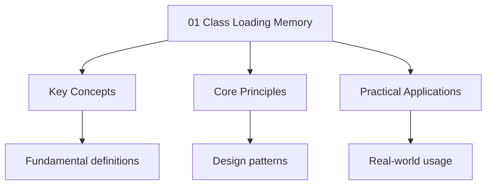

---

date: 2026-07-23T21:57:32+01:00
title: Class Loading and Memory Model
description: "Study notes for Class Loading and Memory Model with worked examples, practice problems, and key concepts for exam preparation."
categories: ["java"]
---

<!-- Breadcrumb Schema for SEO -->
<script type="application/ld+json">
{
  "@context": "https://schema.org",
  "@type": "BreadcrumbList",
  "itemListElement": [{"name": "Home", "url": "https://wyattau.com"}, {"name": "languages", "url": "https://languages.wyattau.com"}, {"name": "Java", "url": "https://languages.wyattau.com/java"}, {"name": "09 Jvm Internals", "url": "https://languages.wyattau.com/java/09-jvm-internals"}, {"name": "01 Class Loading Memory", "url": "https://languages.wyattau.com/java/09-jvm-internals/01-class-loading-memory"}]
}
</script>

## Class Loading

### The Delegation Model

The JVM uses a hierarchical class loading architecture with parent-delegation. When a class loader
Receives a request to load a class, it first delegates the request to its parent. Only if the parent
Cannot find the class does the child attempt to load it. This ensures that core JDK classes (like
`java.lang.Object`) are always loaded by the bootstrap class loader, preventing a malicious class
From masquerading as a trusted type.

```
Bootstrap Class Loader (null)
  |
  Extension / Platform Class Loader
  |
  Application / System Class Loader
  |
  Custom Class Loaders
```

### Bootstrap Class Loader

The bootstrap class loader is implemented in native code (C++ in HotSpot) and is responsible for
Loading the core JDK classes from `$JAVA_HOME/lib/modules` (the modular runtime image since Java 9,
`$JAVA_HOME/lib/rt.jar` before that). It is represented as `null` in Java because it has no
Java-level parent:

```java
ClassLoader bootstrap = String.class.getClassLoader();  // null
```

### Platform Class Loader

The platform class loader (called "Extension" class loader pre-Java 9) loads classes from the JDK's
Extension modules and any JARs in `$JAVA_HOME/lib/ext`. It is the parent of the application class
Loader:

```java
ClassLoader platform = ClassLoader.getPlatformClassLoader();
```

Since Java 9 and the module system, the distinction between "extension" and "application" class
Loaders has been restructured. The platform class loader loads platform modules (like `java.sql`
`java.xml`).

### Application Class Loader

The application class loader loads classes from the classpath: directories and JARs specified by
`-cp``-classpath`Or the `CLASSPATH` environment variable. It is also the default class loader For
`ClassLoader.getSystemClassLoader()`.

### Custom Class Loaders

Custom class loaders extend `java.lang.ClassLoader` and override `findClass(String name)`. Common
Use cases:

- **Application servers**: Tomcat, WebSphere each load web applications in isolated class loaders so
  different apps can use different versions of the same library.
- **OSGi frameworks**: Each bundle has its own class loader with a directed graph of dependencies.
- **Hot reload**: Development tools reload changed classes without restarting the JVM.
- **Security sandboxing**: Untrusted code is loaded in a restricted class loader with limited
  permissions.

```java
public class EncryptedClassLoader extends ClassLoader {
    private final Map&lt;String, byte[]&gt; encryptedClasses;

    public EncryptedClassLoader(ClassLoader parent, Map&lt;String, byte[]&gt; encryptedClasses) {
        super(parent);
        this.encryptedClasses = encryptedClasses;
    }

    @Override
    protected Class&lt;?&gt; findClass(String name) throws ClassNotFoundException {
        byte[] encrypted = encryptedClasses.get(name);
        if (encrypted == null) {
            throw new ClassNotFoundException(name);
        }
        byte[] decrypted = decrypt(encrypted);
        return defineClass(name, decrypted, 0, decrypted.length);
    }

    private byte[] decrypt(byte[] data) {
        // Decryption logic
        return data;
    }
}
```

### `Class.forName()`

`Class.forName(String name)` loads and initializes a class. The two-argument form
`Class.forName(String name, boolean initialize, ClassLoader loader)` loads the class but optionally
Skips static initialization:

```java
// Load and initialize (runs static initializers)
Class&lt;?&gt; cls = Class.forName("com.example.Handler");

// Load but do not initialize
Class&lt;?&gt; cls = Class.forName("com.example.Handler", false, getClassLoader());
```

JDBC drivers use `Class.forName()` to register themselves via static initializers. Modern JDBC (Java
6+) uses the `ServiceLoader` mechanism instead, making explicit `Class.forName()` calls unnecessary
In most cases.

### Lazy Loading and Linking

Classes are loaded lazily: the JVM does not load all classes at startup. A class is loaded when it
Is first actively used (instantiation, static field access, static method invocation, reflection).
The process has three phases:

1. **Loading**: Read the `.class` file bytes and create a `java.lang.Class` object.
2. **Linking**: Verify bytecode, prepare static fields (allocate memory, set to defaults), resolve
   symbolic references.
3. **Initialization**: Execute static initializers (`&lt;clinit&gt;` methods) and static field
   assignments.

Verification catches malformed class files, stack overflow attacks, and type safety violations
Before any code executes. This is why the JVM is inherently safer than languages that load and
Execute native code directly.

## JVM Memory Model

### Heap

The heap is the runtime data area from which memory for all class instances and arrays is allocated.
It is shared among all threads and managed by the garbage collector. The heap is divided into
Generations based on the generational hypothesis:

**Young Generation** -- Most objects are short-lived. The young generation is divided into:

- **Eden**: Where new objects are allocated. When Eden fills up, a minor GC occurs.
- **Survivor spaces (S0, S1)**: Objects that survive a minor GC are copied from Eden into a survivor
  space. Each subsequent minor GC that an object survives increments its "age." Objects that reach a
  configurable tenuring threshold are promoted to the old generation.

**Old Generation (Tenured)** -- Objects that have survived multiple minor GC cycles are promoted
Here. Old generation collections (major GCs) are much more expensive because they must scan a much
Larger region.

```text
+------------------------------------------+
|               JVM Heap                   |
|  +-------------------+  +-------------+  |
|  |  Young Generation |  | Old Gen     |  |
|  |  +-------+--+--+  |  |             |  |
|  |  | Eden  |S0|S1|  |  |             |  |
|  |  +-------+--+--+  |  |             |  |
|  |  +---------------+ |  |             |  |
|  |  (Minor GC here)  |  | (Major GC)  |  |
|  +-------------------+  +-------------+  |
+------------------------------------------+
```

**Heap sizing**:

```bash
java -Xms512m -Xmx4g MyApp
## -Xms: initial heap size
## -Xmx: maximum heap size
```

The young generation size is 1/3 of the total heap, but this is configurable. The ratio of Eden to
survivor spaces is controlled by `-XX:SurvivorRatio=8` (Eden is 8 parts, each survivor is 1 Part).

### Stack

Each thread has its own stack, which holds frames. Each frame contains local variables, operand
Stack, and a reference to the constant pool of the method being executed. Stack memory is not
Garbage collected -- it is allocated and freed as frames are pushed and popped.

```bash
java -Xss512k MyApp  # Thread stack size: 512 KB (default is ~1 MB on 64-bit)
```

A `StackOverflowError` occurs when the stack cannot accommodate a new frame (deep recursion). Each
Virtual thread has a heap-allocated stack that grows on demand, so virtual threads do not have this
Problem.

### Metaspace

Metaspace (introduced in Java 8, replacing PermGen) stores class metadata: the `Class` object,
Method bytecodes, constant pool, field and method definitions, and annotations. Metaspace is
Allocated from native memory, not the Java heap, and it grows dynamically (unlike PermGen, which had
A fixed maximum size).

```bash
java -XX:MaxMetaspaceSize=256m MyApp  # Limit metaspace growth
```

Metaspace exhaustion occurs in applications that generate classes dynamically (JSP Engines, proxy
generators, Groovy/Scala REPLs, Spring CGLIB proxies). Symptoms include
`OutOfMemoryError: Metaspace`.

### Code Cache

The code cache stores compiled native code generated by the JIT compiler. It is a separate memory
Region outside the heap. Once the code cache fills up, the JVM stops compiling (and falls back to
Interpreted execution), which can cause significant performance degradation.

```bash
java -XX:ReservedCodeCacheSize=256m MyApp  # Default is 240 MB
```

### Native Memory

Native memory is memory allocated outside the Java heap by the JVM and by native libraries (JNI,
DirectByteBuffer, `Unsafe.allocateMemory`). It is not managed by the garbage collector and must be
Freed explicitly or by the native library.

```java
ByteBuffer directBuffer = ByteBuffer.allocateDirect(1024 * 1024);  // 1 MB of native memory
```

`DirectByteBuffer` is commonly used for NIO operations because it avoids an extra copy between the
Java heap and native memory during I/O. However, it must be freed explicitly (the `Cleaner`
Associated with it runs during GC, but there is no guarantee of timely cleanup).

## Garbage Collection

### The Generational Hypothesis

Most objects die young. Empirical measurements show that the vast majority of objects (often 90%+)
Are allocated and become unreachable before surviving even a single GC cycle. Only a small fraction
Of objects are long-lived (caches, connection pools, singletons). The generational hypothesis is the
Foundational assumption behind all modern JVM garbage collectors.

### GC Roots

Garbage collection starts from GC roots -- objects that are always reachable. Anything not reachable
From a GC root is garbage. GC roots include:

- Local variables on the stack of live threads
- Static fields of loaded classes
- JNI references (native code holding Java object references)
- `Thread` objects themselves
- Objects referenced by `Finalizer` or `ReferenceQueue`

The marking phase traces the object graph from GC roots, marking every reachable object. Anything
Not marked is garbage.

### Mark-Sweep-Compact

The basic GC algorithm has three phases:

1. **Mark**: Traverse the object graph from GC roots, marking reachable objects.
2. **Sweep**: Identify unmarked objects as garbage and reclaim their memory.
3. **Compact**: Move surviving objects to eliminate fragmentation (optional but common in old
   generation collections).

Compaction is expensive because it requires updating all references to moved objects. Some
Collectors (CMS) skip compaction to reduce pause times, trading pause time for fragmentation.

### Collector Comparison

| Collector  | Threads      | Generations | Compaction | Pause Goal       | Use Case                  |
| ---------- | ------------ | ----------- | ---------- | ---------------- | ------------------------- |
| Serial     | Single       | Both        | Yes        | Long pauses      | Client, embedded devices  |
| Parallel   | Multiple STW | Both        | Yes        | Throughput       | Batch processing          |
| CMS        | Multiple     | Both        | Optional   | Low pauses       | Deprecated (JDK 14)       |
| G1         | Multiple STW | Both        | Regions    | Low pauses       | General purpose (default) |
| ZGC        | Concurrent   | Both        | Relocating | &lt; 1 ms pauses | Low latency               |
| Shenandoah | Concurrent   | Both        | Relocating | &lt; 1 ms pauses | Low latency               |

**STW** = Stop-The-World (all application threads paused during the GC phase).

### Serial GC

The simplest collector. Uses a single thread for both minor and major collections. All application
Threads are paused. Suitable for small heaps (under ~100 MB) and single-core systems.

```bash
java -XX:+UseSerialGC MyApp
```

### Parallel GC (Throughput Collector)

The default collector before Java 9. Uses multiple threads for GC but still STW. Optimizes for
Throughput (maximize time spent in application code, minimize time spent in GC). Major collections
Still have long pauses.

```bash
java -XX:+UseParallelGC -XX:ParallelGCThreads=4 MyApp
```

### G1 GC (Garbage-First)

Default since Java 9. Divides the heap into equal-sized regions (default 2048 regions, each ~2 MB
For a 4 GB heap). G1 tracks garbage density per region and prioritizes collecting regions with the
Most garbage first (hence "garbage-first"). It can achieve relatively short pause times
(configurable target, default 200 ms) while maintaining good throughput.

```bash
java -XX:+UseG1GC -XX:MaxGCPauseMillis=200 MyApp
```

G1 performs concurrent marking (while the application runs) and only stops the world for evacuation
(copying live objects out of selected regions). The young generation is still a set of regions, not
A contiguous area.

### ZGC

ZGC (Z Garbage Collector) performs almost all GC work concurrently with the application. It uses
Colored pointers (storing metadata in the high bits of object references on 64-bit platforms) to
Track object state without stopping application threads. Pause times are consistently under 1 ms
Regardless of heap size. ZGC can handle heaps from 8 MB to 16 TB.

```bash
java -XX:+UseZGC MyApp  # Default since JDK 21 for server-class machines
```

ZGC performs compaction concurrently using load barriers (read barriers that check if an object has
Been moved). The overhead is a slight increase in mutator CPU usage, but the near-zero pause times
Make it ideal for latency-sensitive applications.

### Shenandoah

Similar goals to ZGC but uses a different algorithm. Developed by Red Hat. Uses Brooks pointers
(forwarding pointers stored alongside object references) for concurrent compaction. Pause times are
Also sub-millisecond.

```bash
java -XX:+UseShenandoahGC MyApp
```

### CMS (Concurrent Mark-Sweep)

CMS was the first low-pause collector but is now deprecated (JDK 9) and removed (JDK 14). It
Performed marking concurrently but used mark-sweep (no compaction), leading to fragmentation over
Time. It also had a "concurrent mode failure" mode where it would fall back to a full STW compaction
-- often with a longer pause than a straightforward Parallel GC.

Do not use CMS in new code. Use G1, ZGC, or Shenandoah.

### Metaspace vs PermGen

Before Java 8, class metadata was stored in PermGen, a fixed-size region of the heap. `String`
Literals were also stored in PermGen (in the string pool). PermGen had a fixed maximum size
(`-XX:MaxPermSize`), and `OutOfMemoryError: PermGen` was a common failure mode for applications with
Many classes.

Java 8 replaced PermGen with Metaspace:

| Aspect      | PermGen (pre-Java 8)        | Metaspace (Java 8+)                      |
| ----------- | --------------------------- | ---------------------------------------- |
| Location    | Part of the Java heap       | Native memory (outside the heap)         |
| Size        | Fixed (`-XX:MaxPermSize`)   | Unlimited by default (bounded by native) |
| String pool | In PermGen                  | In the regular heap                      |
| GC          | Full GC to reclaim          | Triggered when usage exceeds threshold   |
| OOM         | `OutOfMemoryError: PermGen` | `OutOfMemoryError: Metaspace`            |

## GC Tuning

### Key JVM Flags

```bash
# Heap sizing
java -Xms2g -Xmx2g MyApp                    # Fixed heap: avoids resize overhead

# Collector selection
java -XX:+UseG1GC MyApp                      # G1 (default since Java 9)
java -XX:+UseZGC MyApp                       # ZGC (scalable, low-latency)

# G1 tuning
java -XX:+UseG1GC \
     -XX:MaxGCPauseMillis=100 \              # Target max pause time
     -XX:G1HeapRegionSize=8m \               # Region size (power of 2, 1-32 MB)
     -XX:InitiatingHeapOccupancyPercent=45 \ # Start concurrent marking at 45% occupancy
     MyApp

# GC logging (Java 9+ unified logging)
java -Xlog:gc*:file=gc.log:time,uptime:filecount=5,filesize=20m MyApp

# GC logging (pre-Java 9)
java -XX:+PrintGCDetails -XX:+PrintGCDateStamps -Xloggc:gc.log MyApp
```

### Choosing a Collector

**Use G1** for most applications. It is the default, well-tested, and provides a good balance of
Throughput and pause time.

**Use ZGC** when you need consistent sub-millisecond pauses (financial trading, real-time analytics,
Interactive services) and are running on JDK 17+ with a 64-bit JVM.

**Use Parallel GC** when throughput is the only metric that matters (batch jobs, offline processing,
Data pipelines) and pause times are irrelevant.

**Use Serial GC** for small embedded applications or when memory is extremely constrained.

### Reading GC Logs

A typical G1 GC log entry:

```
[2026-04-03T10:15:30.123+0000] GC pause (G1 Evacuation Pause) (young)
  [Eden: 256.0M(256.0M)->0.0B(230.0M)
   Survivors: 0.0B->26.0M
   Heap: 256.0M(4.0G)->24.5M(4.0G)]
  [Times: user=0.12 sys=0.01, real=0.03 secs]
  [Eden regions: 128->0
   Survivor regions: 0->2
   Old regions: 0->0]
```

Key metrics:

- **Pause time**: The `real=0.03 secs` is the wall-clock pause duration.
- **Eden size before/after**: Shows how much was reclaimed.
- **Promotion**: Objects moved from Eden to survivor or old generation.

### Monitoring Tools

**VisualVM**: Bundled with older JDKs, now a standalone tool. Connects to a running JVM via JMX and
Displays heap histogram, GC activity, thread dumps, and CPU profiling.

```bash
jvisualvm  # Launch VisualVM
```

**Java Mission Control / Flight Recorder**: Low-overhead production profiling. Flight Recorder
Records events (GC pauses, method profiling, allocation, I/O) with less than 1% overhead.

```bash
# Start Flight Recording for 60 seconds
jcmd &lt;pid&gt; JFR.start duration=60s filename=recording.jfr

# Dump Flight Recording
jcmd &lt;pid&gt; JFR.dump filename=recording.jfr

# Analyze with Java Mission Control
jmc recording.jfr
```

**`jstat`**: Command-line tool for GC statistics:

```bash
jstat -gcutil &lt;pid&gt; 1000  # Print GC utilization every 1 second
```

Output columns:

- `S0`/`S1`: Survivor space 0/1 usage (%)
- `E`: Eden usage (%)
- `O`: Old generation usage (%)
- `M`: Metaspace usage (%)
- `YGC`/`YGCT`: Young GC count / total time
- `FGC`/`FGCT`: Full GC count / total time

### Native Memory Tracking

```bash
# Enable native memory tracking
java -XX:NativeMemoryTracking=summary MyApp

# Print native memory summary
jcmd &lt;pid&gt; VM.native_memory summary

# Detailed tracking (higher overhead)
java -XX:NativeMemoryTracking=detail MyApp
```

Output shows memory usage by category:

```
Total: reserved=5000MB, committed=1200MB
-                 Java Heap (reserved=4096MB, committed=512MB)
-                     Class (reserved=1088MB, committed=128MB)
-                    Thread (reserved=256MB, committed=256MB)
-                      Code (reserved=245MB, committed=12MB)
-                        GC (reserved=98MB, committed=98MB)
-                  Internal (reserved=42MB, committed=42MB)
-                    Direct (reserved=2MB, committed=2MB)
```

This is invaluable for diagnosing native memory leaks, especially in containerized environments
Where the JVM's total memory usage must stay within cgroup limits.




## Intuition

**Java's engine room:** The JVM is like a factory — class loaders bring in blueprints (classes), the garbage collector cleans up waste, and memory management keeps everything running smoothly.

**Why it matters:** Understanding JVM internals helps you write more efficient code and diagnose performance problems in production systems.

**The key insight:** Garbage collection is automatic but not free — understanding when and how it runs helps you write memory-efficient code.

## Common Pitfalls

### OOM in Metaspace

Dynamically generated classes (CGLIB proxies, JSP compilation, Groovy scripts) can exhaust
Metaspace. Symptoms: `OutOfMemoryError: Metaspace`. Fix: increase metaspace limit or audit class
Generation.

### GC Pause Spikes with G1

If `MaxGCPauseMillis` is set too aggressively (e.g., 10 ms), G1 may not be able to meet the target
And will work harder (more frequent young GCs, earlier concurrent marking cycles), potentially
Increasing total GC overhead. Start with the default (200 ms) and adjust based on measured pause
Times.

### Heap Fragmentation with CMS

Do not use CMS. If you are maintaining a legacy application on CMS, migrate to G1 or ZGC. CMS's
Failure to compact leads to fragmentation that causes `ConcurrentModeFailure` full GCs with
Multi-second pauses.

### Class Loader Leaks

In application servers, redeploying a web application creates a new class loader. If the old class
Loader is not garbage collected (because a reference from a thread local, static cache, or thread
Keeps it alive), all classes from the old deployment leak. This is the classic "PermGen/Metaspace
Leak on redeploy" bug. Symptoms: `OutOfMemoryError: Metaspace` after several redeployments.

Fix: ensure all threads created by the application are terminated on undeploy, clear `ThreadLocal`
Values, and unregister any JDBC drivers.

### Direct ByteBuffer Leaks

`DirectByteBuffer` allocates native memory. The memory is freed by a `Cleaner` that runs when the
Buffer is GC'd. If you hold references to direct buffers (or their `Cleaner` is slow to run), native
Memory leaks occur. Fix: call `Cleaner.clean()` explicitly, or use `Unsafe.freeMemory()` for
Critical paths.

## The Module System and Class Loading

### JPMS (Java Platform Module System, Java 9+)

The module system adds a layer of access control on top of the class loader delegation model. Each
Module declares which packages it exports and which modules it requires. The module system interacts
With class loading in two ways:

1. **Readable modules**: A class in module A can only access classes in module B if A `requires` B
   (or B is in the boot layer).
2. **Exported packages**: Even if module A can read module B, it can only access classes in packages
   that B explicitly `exports`.

```java
// module-info.java
module com.example.app {
    requires java.sql;
    requires java.logging;
    exports com.example.app.api;
    // com.example.app.internal is NOT exported -- other modules cannot access it
}
```

### Class Loader Delegation with Modules

The module system preserves the parent-delegation model but adds module readability constraints.
When a class loader loads a class, it checks that the loading class loader can read the target
Module. If module readability is not satisfied, the JVM throws `IllegalAccessError` at load time,
Not at link time.

### `--add-opens` and `--add-exports`

Legacy code that relied on accessing internal JDK packages (e.g., `sun.misc.Unsafe`
`java.util.Collections$UnmodifiableList`) breaks under the module system. The flags `--add-opens`
And `--add-exports` restore access:

```bash
# Allow deep reflection into java.base's internal classes
java --add-opens java.base/java.lang=ALL-UNNAMED \
     --add-opens java.base/java.util=ALL-UNNAMED \
     MyApp
```

These flags are workarounds for code that has not been updated for the module system. Avoid them in
New code.

## GC Algorithms in Detail

### G1 GC: Garbage-First

G1 divides the heap into fixed-size regions (default 2048, each 1-32 MB). Each region is assigned a
Role: Eden, Survivor, Old, or Humongous (for objects larger than half a region). G1 tracks the
Amount of garbage in each region and prioritizes collecting regions with the highest garbage ratio.

**Young GC** (mixed with old regions): When Eden fills up, G1 copies live objects from Eden and
Selected survivor regions into new survivor or old regions. The selected old regions are those with
The most reclaimable space ("garbage-first").

**Concurrent marking**: G1 runs a concurrent marking phase to identify live objects across the
Entire heap. This phase runs while the application executes. It uses snapshot-at-the-beginning
(SATB) write barriers to track object mutations during marking.

**Mixed GC**: After concurrent marking completes, G1 performs a series of mixed GCs that collect
Both young regions and old regions that were identified as having significant garbage. This
Amortizes the cost of old generation collection over multiple short pauses.

**Humongous objects**: Objects larger than half a region are allocated directly in the old
Generation as "humongous" objects. They are allocated contiguously across multiple regions.
Humongous objects are collected during concurrent marking cycles and full GCs, not during young GCs.
If your application allocates many large objects (large arrays, big `String` values), humongous
Allocation can cause premature old generation growth.

### ZGC: Colored Pointers

ZGC uses the unused high bits of 64-bit object references to store metadata (called "colored
Pointers"):

- **Marked bits**: Whether the object has been marked as live.
- **Remapped bit**: Whether the object has been relocated.
- **Finalizable bit**: Whether the object is reachable only through a `Finalizer`.

These colored pointers allow ZGC to perform concurrent marking and relocation without stopping
Application threads. When the GC relocates an object, it updates the forwarding pointer in the old
Location. Application threads that read the old location see a "load barrier" that checks the color
And either returns the old location (if not yet relocated) or follows the forwarding pointer (if
Relocated). This is transparent to the application -- the barrier is inserted by the JIT at every
Object load.

**Generational ZGC (JDK 21+)**: Adds generational support. Young generation regions are collected
Frequently (like G1's young GC), while old generation regions are collected less often. This
Improves throughput because most objects die young and generational collection avoids scanning the
Entire heap on every cycle.

### Shenandoah: Brooks Pointers

Shenandoah uses a different approach: every object has an additional word (the "Brooks pointer")
That points to the object itself. When Shenandoah relocates an object, it copies the object to a new
Location and updates the Brooks pointer in the old location to point to the new location.
Application threads read through the Brooks pointer, so they always access the current location.

Shenandoah's algorithm phases:

1. **Init Mark (STW)**: Scan roots to find initial set of live objects.
2. **Concurrent Mark**: Trace the object graph concurrently.
3. **Final Mark (STW)**: Process any SATB updates from the concurrent phase.
4. **Concurrent Evacuation**: Copy live objects from regions with low liveness to compact regions.
5. **Init Update Refs (STW)**: Prepare for reference updates.
6. **Concurrent Update Refs**: Update all references from old locations to new locations.
7. **Final Update Refs (STW)**: Reclaim evacuated regions.

The total STW pause time is under 10 ms regardless of heap size.

## Container Awareness

### CPU and Memory Limits

Modern JVMs (Java 8u191+, Java 11+) detect container limits (cgroups v1 and v2) and automatically
Configure:

- **Heap size**: Defaults to 1/4 of the container memory limit (not the host memory).
- **GC threads**: Defaults to 1/4 of the container CPU limit (not the host CPU count).
- **Thread count**: `Runtime.availableProcessors()` returns the container CPU limit.

```bash
# Verify container detection
java -XshowSettings:system -version

# Explicitly set container limits (override detection)
java -XX:MaxRAMPercentage=75.0 MyApp  # Use 75% of container memory for heap
java -XX:ActiveProcessorCount=4 MyApp  # Override CPU detection
```

### Common Container Pitfalls

**Default heap too large**: The default `MaxRAMPercentage` is 25%. If your container has 4 GB of
Memory and your application uses significant off-heap memory (metaspace, native memory, thread
Stacks, direct buffers), 1 GB of heap may be too much. Monitor total RSS and adjust.

**Metaspace in containers**: Metaspace is native memory and counts against the container memory
Limit. Applications with many classes (Spring Boot with many auto-configurations, Groovy/Scala
Applications) can consume hundreds of MB of metaspace.

**Thread stacks**: Each platform thread uses 1 MB of stack by default. 200 threads = 200 MB of
Native memory that is not part of the heap. Virtual threads eliminate this problem.

## See Also

- [Concurrency](../06-concurrency/01-concurrency) -- how threads interact with JVM memory
- [Style and Patterns](../07-best-practices/01-style-and-patterns) -- memory management best
  practices
- [JIT Compilation](../09-jvm-internals/02-jit-compilation) -- how the JIT compiler optimizes hot
  code
- [Virtual Threads and Structured Concurrency](../08-modern-java/02-virtual-threads-structured-concurrency)
  -- virtual thread memory characteristics

## Worked Examples

Worked examples demonstrating the application of key concepts are covered in the detailed sub-pages
linked above.
