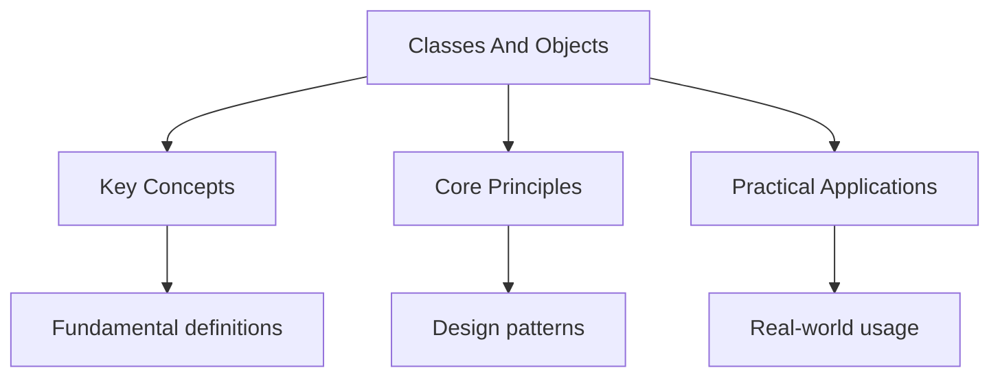

---

title: "Classes and Objects | Languages"
description: "Classes in Kotlin are declared with the keyword. They are final by default -- us Comprehensive educational content coverage with definitions and practice proble"
date: 2026-04-18
tags:
  - Kotlin
categories:
  - Kotlin
---

<!-- Breadcrumb Schema for SEO -->
<script type="application/ld+json">
{
  "@context": "https://schema.org",
  "@type": "BreadcrumbList",
  "itemListElement": [{"name": "Home", "url": "https://wyattau.com"}, {"name": "languages", "url": "https://languages.wyattau.com"}, {"name": "Kotlin", "url": "https://languages.wyattau.com/kotlin"}, {"name": "Basics", "url": "https://languages.wyattau.com/kotlin/basics"}, {"name": "Classes And Objects", "url": "https://languages.wyattau.com/kotlin/basics/classes-and-objects"}]
}
</script>

## Classes

Classes in Kotlin are declared with the `class` keyword. They are final by default -- use `open` to
Allow inheritance.

```kotlin
class User(val name: String, var age: Int)
```

This single line declares a class with a primary constructor, two properties (`name` is read-only,
`age` is mutable), and no body.

### Primary Constructor

The primary constructor is declared in the class header. Constructor parameters can also declare
Properties.

```kotlin
class Person(
    val firstName: String,
    val lastName: String,
    var email: String
) {
    val fullName: String
        get() = "$firstName $lastName"

    init {
        require(email.contains("@")) { "Invalid email: $email" }
    }
}
```

The `init` block is the primary constructor body. Multiple `init` blocks execute in declaration
Order.

### Secondary Constructors

```kotlin
class Person(val name: String) {
    var age: Int = 0

    constructor(name: String, age: Int) : this(name) {
        this.age = age
    }
}
```

Every secondary constructor must delegate to the primary constructor (or another secondary
Constructor that eventually delegates to the primary). This ensures properties are initialized
Exactly once.

### Visibility Modifiers

| Modifier    | Class Member                 | Top-Level Declaration        |
| ----------- | ---------------------------- | ---------------------------- |
| `public`    | Visible everywhere (default) | Visible everywhere (default) |
| `private`   | Inside class only            | Inside file only             |
| `protected` | Inside class + subclasses    | N/A                          |
| `internal`  | Inside module                | Inside module                |

A module is a set of Kotlin files compiled together -- a Gradle project, a Maven project, or an
IntelliJ module.

## Properties

Kotlin properties combine fields, getters, and setters into a single declaration.

```kotlin
class Rectangle(val width: Double, val height: Double) {
    val area: Double
        get() = width * height

    var perimeter: Double = 0.0
        private set

    init {
        perimeter = 2 * (width + height)
    }
}
```

Backing fields are generated automatically when a getter or setter references the property name.
Access them with the `field` identifier:

```kotlin
var counter: Int = 0
    set(value) {
        if (value >= 0) field = value
    }
```

### Computed Properties

Properties without a backing field compute their value on every access.

```kotlin
class Polygon(val sides: List<Point>) {
    val perimeter: Double
        get() = sides.zipWithNext().sumOf { (a, b) ->
            sqrt((b.x - a.x).pow(2) + (b.y - a.y).pow(2))
        }
}
```

### Late-Initialized Properties

```kotlin
class Service {
    lateinit var config: Config

    fun isReady(): Boolean = ::config.isInitialized
}
```

`lateinit` bypasses null safety. Use it only when initialization is guaranteed to happen before
First access, in frameworks that call lifecycle methods after construction.

## Inheritance

Classes are final by default. Mark a class as `open` to allow subclassing.

```kotlin
open class Animal(val name: String) {
    open fun sound(): String = "..."
}

class Dog(name: String) : Animal(name) {
    override fun sound(): String = "Woof"
}

class Cat(name: String) : Animal(name) {
    override fun sound(): String = "Meow"
}
```

### Abstract Classes

```kotlin
abstract class Shape {
    abstract val area: Double
    abstract fun draw()

    fun describe(): String = "Shape with area $area"
}

class Circle(val radius: Double) : Shape() {
    override val area: Double get() = PI * radius * radius
    override fun draw() { /* ... */ }
}
```

### Interfaces

```kotlin
interface Clickable {
    fun click()
    fun showOff() = println("Clickable!")  // default implementation
}

interface Focusable {
    fun showOff() = println("Focusable!")
}

class Button : Clickable, Focusable {
    override fun click() { /* ... */ }

    override fun showOff() {
        super<Clickable>.showOff()
        super<Focusable>.showOff()
    }
}
```

## Data Classes

Data classes are designed to hold data. The compiler generates `equals()``hashCode()`
`toString()``componentN()` functions, and a `copy()` method.

```kotlin
data class User(
    val id: Long,
    val name: String,
    val email: String,
    val active: Boolean = true
)
```

```kotlin
val user = User(1, "Alice", "alice@example.com")
val copied = user.copy(name = "Bob", email = "bob@example.com")

val (id, name, email, active) = user  // destructuring

println(user)  // User(id=1, name=Alice, email=alice@example.com, active=true)
```

### Requirements and Restrictions

- The primary constructor must have at least one parameter.
- All primary constructor parameters must be `val` or `var`.
- Data classes cannot be `open``abstract``inner`Or `sealed`.
- The generated `equals()` compares all primary constructor properties structurally.

### Copy Semantics

`copy()` performs a shallow copy. Mutable properties in the copy reference the same objects as the
Original.

```kotlin
data class Config(val tags: MutableList<String>)

val original = Config(mutableListOf("a", "b"))
val modified = original.copy(tags = original.tags.apply { add("c") })
// original.tags now contains ["a", "b", "c"] -- mutation leaked
```

## Sealed Classes

Sealed classes restrict inheritance to a finite set of subclasses declared in the same package. This
Enables exhaustive `when` expressions.

```kotlin
sealed class Result<out T> {
    data class Success<T>(val value: T) : Result<T>()
    data class Failure(val error: Throwable) : Result<Nothing>()
    data object Loading : Result<Nothing>()
}

fun handle(result: Result<String>) {
    when (result) {
        is Result.Success -> println("Got: ${result.value}")
        is Result.Failure -> println("Error: ${result.error.message}")
        is Result.Loading -> println("Loading...")
    }
}
```

In Kotlin 1.5+, sealed class subclasses can be defined in the same package but not necessarily the
Same file. In Kotlin 1.7+, sealed interfaces are supported.

## Enum Classes

```kotlin
enum class Direction(val degrees: Int) {
    NORTH(0), EAST(90), SOUTH(180), WEST(270);

    fun turnedRight(): Direction = entries[(ordinal + 1) % entries.size]
    fun turnedLeft(): Direction = entries[(ordinal + 3) % entries.size]
}
```

`entries` (Kotlin 1.9+) returns all enum constants. Use `entries` instead of the deprecated
`values()`.

### Enum with Abstract Methods

```kotlin
enum class PaymentMethod {
    CASH {
        override fun process(amount: Double) = "Paid $amount in cash"
    },
    CARD {
        override fun process(amount: Double) = "Charged $amount to card"
    },
    CRYPTO {
        override fun process(amount: Double) = "Transferred $amount in crypto"
    };

    abstract fun process(amount: Double): String
}
```

## Object Declarations

`object` creates a singleton. Initialization is thread-safe.

```kotlin
object DatabaseConfig {
    val url = System.getenv("DB_URL") ?: "jdbc:postgresql://localhost:5432/app"
    val poolSize = System.getenv("DB_POOL_SIZE")?.toIntOrNull() ?: 10
    val timeout = 30_000L
}
```

Object declarations can implement interfaces:

```kotlin
object ConsoleLogger : Logger {
    override fun log(level: Level, message: String) {
        println("[$level] $message")
    }
}
```

### Anonymous Objects

Anonymous objects replace Java anonymous inner classes. They can implement interfaces or extend
Classes.

```kotlin
val listener = object : MouseAdapter() {
    override fun mouseClicked(e: MouseEvent) {
        println("Clicked at (${e.x}, ${e.y})")
    }
}
```

Anonymous objects used as local variables have an anonymous type. If you need to pass the object
Outside its declaration scope, declare the type explicitly or use an interface.

## Companion Objects

A companion object is an object declaration tied to a class. Members declared in it are accessed via
The class name -- analogous to Java static members.

```kotlin
class User private constructor(
    val name: String,
    val email: String
) {
    companion object Factory {
        fun create(name: String, email: String): User {
            return User(name, email)
        }

        fun fromJson(json: String): User {
            // parse and construct
        }
    }
}

val user = User.create("Alice", "alice@example.com")
val user2 = User.fromJson("""{"name": "Bob", "email": "bob@example.com"}""")
```

The companion object can have a name (e.g., `Factory`) or use the default name `Companion`. A class
Can have only one companion object.

Companion objects can implement interfaces:

```kotlin
interface Factory<T> {
    fun create(): T
}

class User(val name: String) {
    companion object : Factory<User> {
        override fun create(): User = User("default")
    }
}

fun <T> spawn(factory: Factory<T>): T = factory.create()
val user = spawn(User)  // User(name=default)
```

## Common Pitfalls

- \*\* Forgetting that classes are final by default. Mark classes and methods as `open` when
  designing for inheritance.
- \*\* Using `data class` for mutable entities. `equals()` and `hashCode()` include mutable
  properties, which breaks the contract if the object is mutated after being placed in a `HashSet`
  or `HashMap`.
- \*\* Storing references to mutable collections in data classes. The `copy()` method performs a
  shallow copy, so mutations to the copy"s collections affect the original.
- \*\* Using `object` declarations for dependency injection. Singletons make testing harder because
  they cannot be replaced or mocked. Prefer constructor injection with regular classes.
- \*\* Confusing `object` declarations with anonymous objects. `object` creates a named singleton;
  `object : SomeInterface { ... }` creates an anonymous instance.

## Intuition

Classes are blueprints for creating objects with shared behavior and state. Kotlin's classes are final by default, encouraging composition over inheritance. Data classes reduce boilerplate for simple data holders, while sealed classes define restricted type hierarchies for exhaustive pattern matching. Companion objects provide a place for factory methods and class-level logic without Java's static keyword. Object declarations create singletons, and class delegation implements interfaces by forwarding to another object.




## Summary

This topic covers the core concepts of classes and objects, including underlying theory, practical
implementation, and key applications.

**Key concepts include:**

- core concepts and terminology
- algorithms and computational thinking
- practical implementation
- security and ethical considerations
- applications in the real world

Understanding these concepts thoroughly is essential for both examinations and practical
programming, and requires both theoretical knowledge and hands-on practice.

## Worked Examples

Worked examples demonstrating the application of key concepts are covered in the detailed sub-pages
linked above.

## See Also

- [Basics](./)
- [Types and Variables](./types-and-variables)
- [Control Flow](./control-flow)
