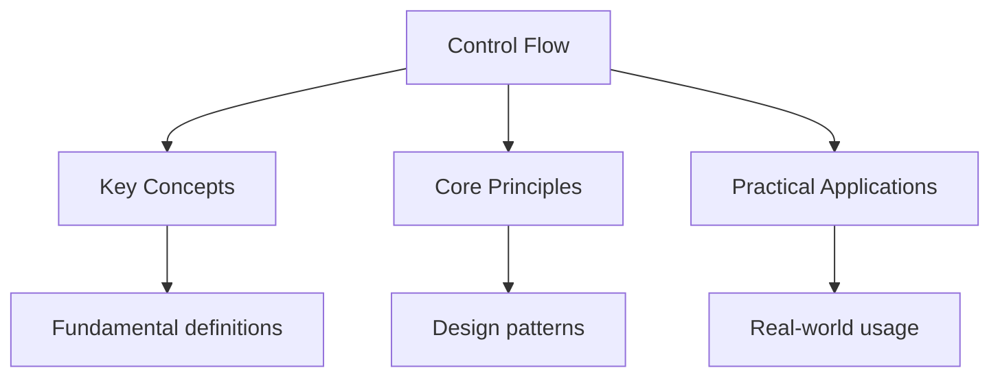

---

title: "Control Flow | Languages - Wyatt's Notes"
description: "In Kotlin, is an expression -- it returns a value. There is no ternary operator  Comprehensive educational content coverage with definitions and practice proble"
date: 2026-04-18
tags:
  - Kotlin
categories:
  - Kotlin
---

<!-- Breadcrumb Schema for SEO -->
<script type="application/ld+json">
{
  "@context": "https://schema.org",
  "@type": "BreadcrumbList",
  "itemListElement": [{"name": "Home", "url": "https://wyattau.com"}, {"name": "languages", "url": "https://languages.wyattau.com"}, {"name": "Kotlin", "url": "https://languages.wyattau.com/kotlin"}, {"name": "Basics", "url": "https://languages.wyattau.com/kotlin/basics"}, {"name": "Control Flow", "url": "https://languages.wyattau.com/kotlin/basics/control-flow"}]
}
</script>

## if/else as Expression

In Kotlin, `if` is an expression -- it returns a value. There is no ternary operator because
`if/else` serves that role.

```kotlin
val max = if (a > b) a else b

val result = if (x > 0) {
    println("positive")
    "positive"
} else if (x < 0) {
    println("negative")
    "negative"
} else {
    println("zero")
    "zero"
}
```

Using `if` as an expression requires both branches to return compatible types. Using it as a
Statement (as in Java) works without this constraint.

## when Expression

`when` is Kotlin"s replacement for the Java `switch` statement. It is an expression by default and
Supports arbitrary conditions, not just constant matching.

### Basic Matching

```kotlin
val description = when (x) {
    0 -> "zero"
    1 -> "one"
    2, 3 -> "small"
    in 4..10 -> "medium"
    else -> "large"
}
```

### Exhaustiveness

When used as an expression, `when` must be exhaustive. If all cases are covered, the `else` branch
Is not required. With `sealed` classes or `enum` classes, the compiler verifies exhaustiveness.

```kotlin
enum class Color { RED, GREEN, BLUE }

fun describe(color: Color): String = when (color) {
    Color.RED -> "red"
    Color.GREEN -> "green"
    Color.BLUE -> "blue"
    // no else needed -- all enum values covered
}
```

### Arbitrary Conditions

```kotlin
fun classify(number: Int): String = when {
    number < 0 -> "negative"
    number == 0 -> "zero"
    number % 2 == 0 -> "even positive"
    else -> "odd positive"
}
```

### Type Checking

```kotlin
fun process(value: Any): String = when (value) {
    is Int -> "Int: $value"
    is String -> "String of length ${value.length}"
    is Boolean -> if (value) "true" else "false"
    is List<*> -> "List of size ${value.size}"
    else -> "Unknown: $value"
}
```

### when Without an Argument

When no subject is provided, `when` acts as a chain of `if/else if` conditions:

```kotlin
val result = when {
    x == null -> "null"
    x.isEmpty() -> "empty"
    x.length < 5 -> "short"
    else -> "long"
}
```

## for Loops

Kotlin's `for` loop iterates over anything that provides an `iterator()` -- this includes ranges,
Collections, arrays, and sequences.

### Range Iteration

```kotlin
for (i in 1..5) {
    println(i)  // 1, 2, 3, 4, 5
}

for (i in 0 until 5) {
    println(i)  // 0, 1, 2, 3, 4 (exclusive upper bound)
}

for (i in 5 downTo 1) {
    println(i)  // 5, 4, 3, 2, 1
}

for (i in 0..10 step 2) {
    println(i)  // 0, 2, 4, 6, 8, 10
}
```

### Collection Iteration

```kotlin
val map = mapOf("a" to 1, "b" to 2, "c" to 3)

for ((key, value) in map) {
    println("$key -> $value")
}

for (entry in map.entries) {
    println("${entry.key} = ${entry.value}")
}

for ((index, element) in list.withIndex()) {
    println("$index: $element")
}
```

### Iteration with Index

```kotlin
for (i in list.indices) {
    println(list[i])
}
```

## while Loops

`while` and `do-while` behave identically to Java. They are statements, not expressions.

```kotlin
var x = 10
while (x > 0) {
    println(x--)
}

var input: String
do {
    print("Enter command: ")
    input = readLine() ?: break
    process(input)
} while (input != "quit")
```

## Ranges

Ranges implement `ClosedRange<T>` (inclusive) or `IntRange`/`LongRange` for integer types.

```kotlin
val range: IntRange = 1..10
val halfOpen: IntRange = 0 until 10
val reverse: IntProgression = 10 downTo 1
val step: IntProgression = 0..100 step 5

// Check containment
5 in 1..10       // true
11 in 1..10      // false
```

### Custom Ranges

Any `Comparable` type can define a range:

```kotlin
enum class DayOfWeek { MON, TUE, WED, THU, FRI, SAT, SUN }

val workdays = DayOfWeek.MON..DayOfWeek.FRI
DayOfWeek.WED in workdays  // true
```

## Labeled Returns and Breaks

Kotlin supports labeled returns for lambdas and labeled breaks/continues for nested loops.

### Labeled Breaks in Nested Loops

```kotlin
outer@ for (i in 1..3) {
    for (j in 1..3) {
        if (i == 2 && j == 2) break@outer
        println("i=$i, j=$j")
    }
}
// Output: i=1, j=1 / i=1, j=2 / i=1, j=3 / i=2, j=1
```

### Labeled Returns in Lambdas

A `return` inside a lambda returns from the enclosing function, not just the lambda. Use a label to
Return from the lambda itself.

```kotlin
fun findFirstEven(list: List<Int>): Int? {
    list.forEach {
        if (it % 2 == 0) return it  // returns from findFirstEven
    }
    return null
}

fun findFirstEvenLambda(list: List<Int>): Int? {
    return list.firstOrNull lambda@{
        if (it % 2 == 0) return@lambda true
        false
    }
}
```

In practice, prefer using `firstOrNull``find`Or other standard library functions over manual
Iteration with labeled returns.

### Implicit Labels

For lambdas passed to inline functions, the function name serves as an implicit label:

```kotlin
fun foo() {
    listOf(1, 2, 3, 4, 5).forEach {
        if (it == 3) return@forEach  // skips iteration 3, does not return from foo
        println(it)
    }
}
```

## try/catch as Expression

Like `if` and `when``try/catch` is an expression in Kotlin.

```kotlin
val result: Int = try {
    input.toInt()
} catch (e: NumberFormatException) {
    0
} finally {
    println("cleanup")
}
```

## Exception Handling

Kotlin does not have checked exceptions. All exceptions are unchecked. This is a deliberate design
Decision to avoid the verbosity and abuse patterns seen with Java checked exceptions.

```kotlin
fun readConfig(path: String): Config {
    val content = File(path).readText()  // throws IOException -- not declared
    return parseConfig(content)
}
```

Use `try/catch` when you can meaningfully recover. Otherwise, let exceptions propagate.

```kotlin
// Throwing an exception
fun divide(a: Int, b: Int): Double {
    if (b == 0) throw IllegalArgumentException("Division by zero")
    return a.toDouble() / b
}
```

The `Nothing` type represents a value that never exists. Functions that always throw have return
Type `Nothing`:

```kotlin
fun fail(message: String): Nothing {
    throw IllegalStateException(message)
}

val result: String = fail("unreachable")  // type-checks because Nothing is a subtype of all types
```

## Common Pitfalls

- \*\* Forgetting that `when` used as an expression must be exhaustive. If you add a new case to a
  sealed class or enum, the compiler will flag all non-exhaustive `when` expressions.
- \*\* Using `return` inside a lambda expecting to return from the lambda. Use labeled returns or
  restructure with standard library functions.
- \*\* Creating ranges with `..` that are accidentally empty. `10..1` is empty; use `10 downTo 1`.
- \*\* Assuming `for (i in range)` mutates `i`. The loop variable is a new `val` on each iteration.

## Intuition

Control flow structures determine the order in which code executes. Kotlin treats if, when, and try as expressions that return values, eliminating the need for a ternary operator. The when expression is a powerful pattern matcher that can check ranges, types, and arbitrary conditions. Ranges provide a concise syntax for iteration. Labeled returns allow fine-grained control over lambda execution. These constructs make Kotlin code more declarative and less verbose than traditional imperative styles.




## Summary

This topic covers the core concepts of control flow, including underlying theory, practical
implementation, and key applications.

**Key concepts include:**

- core concepts and terminology
- algorithms and computational thinking
- practical implementation
- security and ethical considerations
- applications in the real world

Understanding these concepts thoroughly is essential for both examinations and practical
programming, and requires both theoretical knowledge and hands-on practice.

## Worked Examples

Worked examples demonstrating the application of key concepts are covered in the detailed sub-pages
linked above.

## Cross-References

- **[Types and Variables](./types-and-variables):** Type system fundamentals used in control flow expressions.
- **[Null Safety Deep Dive](../advanced/null-safety-deep-dive):** Null-safe branching and safe-call operators in control flow.
- **[Kotlin Practice](../practice-kotlin-basics):** Auto-graded problems testing control flow patterns.
