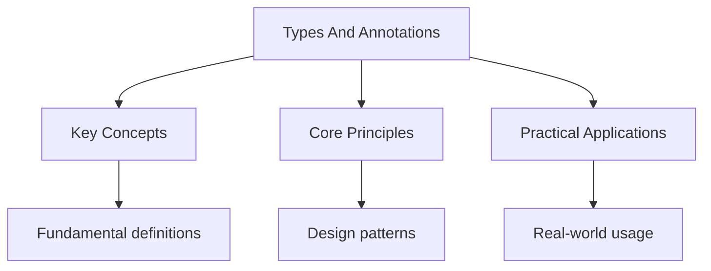

---

title: "Types and Annotations | Languages"
description: "TypeScript provides seven primitive types that correspond directly to JavaScript Comprehensive educational content coverage with definitions and practice proble"
date: 2026-04-22T00:00:00.000Z
tags: [TypeScript]
categories: [TypeScript]
---

<!-- Breadcrumb Schema for SEO -->
<script type="application/ld+json">
{
  "@context": "https://schema.org",
  "@type": "BreadcrumbList",
  "itemListElement": [{"name": "Home", "url": "https://wyattau.com"}, {"name": "languages", "url": "https://languages.wyattau.com"}, {"name": "Typescript", "url": "https://languages.wyattau.com/typescript"}, {"name": "Types And Annotations", "url": "https://languages.wyattau.com/typescript/types-and-annotations"}]
}
</script>

## Primitive Types

TypeScript provides seven primitive types that correspond directly to JavaScript runtime values:

| Type        | Description                                               | Example Values                |
| ----------- | --------------------------------------------------------- | ----------------------------- |
| `string`    | UTF-16 character sequences                                | `"hello"``"'``` `Template` `` |
| `number`    | IEEE 754 double-precision floats (all JavaScript numbers) | `0``-3.14``NaN``Infinity`     |
| `boolean`   | Logical values                                            | `true``false`                 |
| `null`      | Intentional absence of value                              | `null`                        |
| `undefined` | Uninitialised or absent value                             | `undefined`                   |
| `symbol`    | Globally unique identifiers (ES2015+)                     | `Symbol("id")`                |
| `bigint`    | Arbitrary-precision integers (ES2020+)                    | `0n``9007199254740993n`       |

The types `null` and `undefined` are subtypes of every other type unless `strictNullChecks` is
Enabled. Under `strict: true` (the recommended configuration), `null` and `undefined` are assignable
Only to themselves and to `any` / `unknown`.

```ts
const name: string = 'Ada';
const count: number = 42;
const active: boolean = true;
const nothing: null = null;
const notSet: undefined = undefined;
const uid: symbol = Symbol('uid');
const huge: bigint = 9007199254740993n;
```

## The `any``unknown``never`And `void` Types

These four types have precise and distinct semantics. Confusion between them is a common source of
Bugs.

### `any`

The `any` type disables all type checking for the annotated value. A value of type `any` is
Assignable to and from every other type. Using `any` effectively opts the annotated expression out
Of the type system entirely.

```ts
let a: any = 'hello';
a = 42;
a.foo.bar.baz();
```

**Common Pitfall:** Avoid `any` in production code. The compiler cannot verify correctness for `any`
Values, which undermines the entire purpose of TypeScript. Use `unknown` instead when the type is
Genuinely not known at compile time.

### `unknown`

The `unknown` type is the type-safe counterpart to `any`. A value of type `unknown` is assignable to
Every type, but **no type is assignable to `unknown` except `any` and `unknown` itself**. Before an
`unknown` value can be used, it must be narrowed through a type guard.

```ts
function process(value: unknown): string {
  if (typeof value === 'string') {
    return value.toUpperCase();
  }
  return String(value);
}
```

The distinction is critical: `any` propagates unsafety throughout the program, while `unknown`
Forces the programmer to prove type safety at the point of use.

### `never`

The `never` type represents values that never occur. It is the bottom type of the type system -- the
Type that is a subtype of every type but which has no inhabitants. `never` appears in two principal
Contexts:

1. **Unreachable code paths** -- functions that never return (always throw or loop infinitely).
2. **Exhaustive checking** -- the default case of a `switch` on a discriminated union when all cases
   are handled.

```ts
function fail(message: string): never {
  throw new Error(message);
}

type Shape = { kind: "circle''; radius: number } | { kind: "square'; side: number };

function area(shape: Shape): number {
  switch (shape.kind) {
    case 'circle':
      return Math.PI * shape.radius ** 2;
    case 'square':
      return shape.side ** 2;
    default:
      const _exhaustive: never = shape;
      return _exhaustive;
  }
}
```

If a new variant is later added to `Shape` without updating the `switch`The assignment to
`_exhaustive: never` will produce a compile-time error, since the new variant is not assignable to
`never`.

### `void`

The `void` type represents the absence of a return value. It is used almost exclusively as the
Return type of functions that do not return a meaningful value. A `void`-returning function may
Return `undefined` implicitly or explicitly, but returning any other value is a type error.

```ts
function log(message: string): void {
  console.log(message);
}
```

**Common Pitfall:** Do not confuse `void` with `undefined`. The type `void` is meaningful only in
Return-type position. In variable-position, `void` behaves like `undefined` under non-strict
Settings but should not be used there.

### `undefined` (the type)

The type `undefined` has exactly one inhabitant: the runtime value `undefined`. Under
`strictNullChecks`It is assignable only to `undefined``any`And `unknown`.

```ts
let x: undefined = undefined;
```

## Object Types: Interfaces vs Type Aliases

TypeScript provides two mechanisms for defining object shapes: **interfaces** and **type aliases**.
Both support optional properties, readonly properties, and method signatures. However, they differ
In several important respects.

### Interface Declarations

```ts
interface Point {
  x: number;
  y: number;
  readonly id: string;
  move(dx: number, dy: number): void;
}
```

Interfaces support **declaration merging**: multiple interface declarations with the same name in
The same scope are automatically merged into a single interface.

```ts
interface Window {
  title: string;
}

interface Window {
  width: number;
  height: number;
}

const w: Window = { title: "Main'', width: 800, height: 600 };
```

### Type Aliases

```ts
type Point = {
  x: number;
  y: number;
  readonly id: string;
  move: (dx: number, dy: number) => void;
};
```

Type aliases can represent **any type**, not just object shapes:

```ts
type ID = string | number;
type Callback = (data: string) => void;
type Readonly<T> = { readonly [K in keyof T]: T[K] };
```

### Comparison

| Feature                  | `interface`   | `type`  |
| ------------------------ | ------------- | ------- |
| Object shapes            | Yes           | Yes     |
| Union types              | No            | Yes     |
| Intersection types       | Via `extends` | Via `&` |
| Declaration merging      | Yes           | No      |
| Mapped types             | No            | Yes     |
| Conditional types        | No            | Yes     |
| Tuple types              | No            | Yes     |
| Extends other interfaces | Yes           | N/A     |
| Extends classes          | Yes           | No      |

### When to Use Each

**Use `interface`** when defining public API surface shapes that may be extended by consumers
(library authoring, plugin systems). Use **`type`** for unions, intersections, mapped types,
Conditional types, tuples, and any non-object-shape type. When in doubt, many teams adopt the
Convention: default to `interface` for object shapes, switch to `type` when the situation requires
It.

## Union and Intersection Types

### Union Types

A union type `A | B` describes a value that is of type `A` **or** type `B`. The value has access
Only to the members that are common to all constituents of the union.

```ts
type ID = string | number;

function formatId(id: ID): string {
  return String(id);
}
```

When accessing properties or methods on a union, TypeScript permits only those that are shared
Across all union members:

```ts
function getLength(value: string | string[]): number {
  return value.length;
}

function bad(value: string | number): number {
  return value.toUpperCase();
}
```

The second function is a compile error because `toUpperCase()` does not exist on `number`.

### Intersection Types

An intersection type `A & B` describes a value that satisfies **both** `A` and `B` simultaneously.
The resulting type has all properties of both constituents.

```ts
interface HasId {
  id: number;
}

interface HasName {
  name: string;
}

type User = HasId & HasName;

const user: User = { id: 1, name: "Ada' };
```

Intersections of primitive types or incompatible object types can produce `never`:

```ts
type Impossible = string & number;
```

This type is `never` because no value can be both a `string` and a `number`.

## Type Narrowing

Type narrowing is the process by which TypeScript reduces a broad type to a more specific type
Within a control flow branch. Narrowing is essential for safely working with union types.

### `typeof` Narrowing

```ts
function double(value: string | number): string | number {
  if (typeof value === 'string') {
    return value.repeat(2);
  }
  return value * 2;
}
```

The `typeof` operator narrows to the corresponding TypeScript type. It recognises `"string"`
`"number"``"boolean"``"symbol"``"bigint"``"undefined"``"object"`And `"function"`.

### `instanceof` Narrowing

```ts
function formatError(err: Error | string): string {
  if (err instanceof Error) {
    return err.message;
  }
  return err;
}
```

### `in` Operator Narrowing

The `in` operator checks for the presence of a property and narrows accordingly:

```ts
type Car = { kind: "car''; wheels: number };
type Boat = { kind: "boat'; length: number };

function describe(vehicle: Car | Boat): string {
  if ('wheels' in vehicle) {
    return `Car with ${vehicle.wheels} wheels`;
  }
  return `Boat of length ${vehicle.length}`;
}
```

### Discriminated Unions

A **discriminated union** (also called a **tagged union**) is a union type where each variant has a
Common property (the discriminant) with a unique literal value. TypeScript uses the discriminant to
Narrow the type automatically.

```ts
type Result<T, E> = { status: "success''; data: T } | { status: "error'; error: E };

function unwrap<T, E>(result: Result<T, E>): T {
  if (result.status === 'success') {
    return result.data;
  }
  throw result.error;
}
```

The compiler recognises that after the `if` check narrows `result.status` to `"success"`The type Of
`result` is narrowed to `{ status: "success"; data: T }`Making `result.data` accessible.

### Equality Narrowing

```ts
function compare(x: string | number, y: string | number): boolean {
  if (x === y) {
    return true;
  }
  return false;
}
```

When `x === y` is true, TypeScript narrows both `x` and `y` to their common types.

### Truthiness Narrowing

```ts
function process(value: string | null | undefined): string {
  if (value) {
    return value.toUpperCase();
  }
  return 'default';
}
```

Falsy values (`null``undefined``""``0``NaN``false`) narrow the type to their falsy Constituent.

## Literal Types

TypeScript supports **literal types**: types that represent a single specific value.

### String Literal Types

```ts
type Direction = 'north' | 'south' | 'east' | 'west';

function move(direction: Direction): void {
  console.log(`Moving ${direction}`);
}

move('north');
move('diagonal');
```

### Numeric Literal Types

```ts
type DiceRoll = 1 | 2 | 3 | 4 | 5 | 6;

function roll(eyes: DiceRoll): number {
  return eyes;
}
```

### Boolean Literal Types

```ts
type StrictBoolean = true | false;
```

While `true | false` is equivalent to `boolean`Literal boolean types are useful in generic Contexts
and conditional types.

### Template Literal Types

Template literal types (introduced in TypeScript 4.1) allow types to be constructed from string
Literals using interpolation:

```ts
type EventName = 'click' | 'focus' | 'blur';
type HandlerName = `on${Capitalize<EventName>}`;
type HandlerName = 'onClick' | 'onFocus' | 'onBlur';
```

Template literal types distribute over unions and support the following intrinsic string types:

| Intrinsic Type    | Operation                    |
| ----------------- | ---------------------------- |
| `Uppercase<S>`    | Convert to uppercase         |
| `Lowercase<S>`    | Convert to lowercase         |
| `Capitalize<S>`   | Capitalize first character   |
| `Uncapitalize<S>` | Uncapitalize first character |

```ts
type CSSProperty = 'margin' | 'padding';
type CSSDirection = 'top' | 'bottom' | 'left' | 'right';
type CSSKey = `${CSSProperty}-${CSSDirection}`;
type CSSKey =
  | 'margin-top'
  | 'margin-bottom'
  | 'margin-left'
  | 'margin-right'
  | 'padding-top'
  | 'padding-bottom'
  | 'padding-left'
  | 'padding-right';
```

## Type Assertions

Type assertions (`as` syntax or angle-bracket syntax) instruct the compiler to treat an expression
As a specific type. They perform **no runtime check** and are therefore unsafe.

### Syntax

```ts
const canvas = document.getElementById('canvas') as HTMLCanvasElement;
const canvas2 = <HTMLCanvasElement>document.getElementById('canvas');
```

The angle-bracket syntax is not permitted in `.tsx` files because it conflicts with JSX syntax.
Prefer `as` for consistency.

### When Assertions Are Necessary

Type assertions are occasionally required when the programmer has information that the type system
Cannot infer:

1. **DOM element access** -- `document.getElementById` returns `HTMLElement | null`; asserting to a
   specific element type.
2. **Library type mismatches** -- when a library's types are too narrow or incorrect.
3. **Initialisation patterns** -- when an object is built incrementally.

```ts
const myCanvas = document.getElementById('canvas');
if (myCanvas !== null) {
  const ctx = (myCanvas as HTMLCanvasElement).getContext('2d');
}
```

### Why Not to Use Assertions

**Common Pitfall:** Assertions override the type system. If the asserted type is incorrect, the
Program will have a type mismatch at runtime with no compile-time warning. Assertions should be a
Last resort. Prefer type guards, type narrowing, and proper type declarations.

```ts
const value: string = 'hello' as number;
```

This assertion compiles without error but is logically unsound. The `string` value is now typed as
`number`And any subsequent numeric operations will fail at runtime.

### Double Assertions

A direct assertion from an incompatible type is a compile error:

```ts
const x: string = 'hello' as number;
```

However, a **double assertion** through `unknown` bypasses this check:

```ts
const x: string = 'hello' as unknown as number;
```

Double assertions are almost always a code smell. They indicate that the type system is being
Circumvented rather than corrected.

## Optional Chaining and Nullish Coalescing

### Optional Chaining (`?.`)

Optional chaining provides a safe way to access properties on values that may be `null` or
`undefined`:

```ts
interface Address {
  street?: string;
  city?: string;
}

interface Person {
  name: string;
  address?: Address;
}

function getCity(person: Person): string | undefined {
  return person.address?.city;
}
```

Optional chaining can be used with property access (`?.`), method calls (`?.()`), and indexed access
(`?.[]`).

```ts
const length = array?.[0]?.length;
const result = obj?.method?.();
```

### Nullish Coalescing (`??`)

The nullish coalescing operator provides a default value when the left operand is `null` or
`undefined`:

```ts
const value: string | null = null;
const result = value ?? 'default';
```

This operator is distinct from `||` because it does not treat `0``""``false`Or `NaN` as falsy:

```ts
const count: number | null = 0;
const total = count ?? 10;
```

Here, `total` is `0`Because `0` is not nullish. With `||``total` would be `10`.

### Combining Both

```ts
function getStreetLength(person: Person): number {
  return person.address?.street?.length ?? 0;
}
```

## Type Inference Rules

TypeScript infers types when annotations are omitted. Understanding these rules is essential for
Writing idiomatic code that balances explicitness with conciseness.

### Variable Declaration Inference

When a variable is initialised, TypeScript infers the type from the initialiser:

```ts
let x = 42;
let s = 'hello';
let b = true;
```

Here, `x` is inferred as `number``s` as `string``b` as `boolean`. The inferred type is the
**widest** type that matches the initialiser.

### `let` vs `const` Inference

With `let`TypeScript infers a writable type:

```ts
let x = 'hello';
x = 'world';
```

With `const`TypeScript infers the literal type:

```ts
const x = 'hello';
```

Here, the type of `x` is the literal type `"hello"`Not `string`. This is because `const`
Declarations cannot be reassigned, so the compiler can safely narrow to the literal.

### Best Common Type

When multiple initialisers contribute to a single type, TypeScript computes the **best common
Type**:

```ts
const arr = [1, 2, 3];
const mixed = [1, 'two', true];
```

The first array has type `number[]`. The second has type `(string | number | boolean)[]`. The best
Common type algorithm finds the most specific supertype of all candidate types.

### Contextual Typing

In certain contexts, TypeScript infers types from the surrounding context rather than from the
Expression itself. The most common case is callback parameters:

```ts
const numbers = [1, 2, 3];
const doubled = numbers.map((n) => n * 2);
```

The type of `n` is inferred as `number` from the context (the `map` method of `number[]`), even
Though the callback has no explicit parameter annotation.

Contextual typing also applies to event handlers, promise callbacks, and object literal assignments:

```ts
window.addEventListener('click', (event) => {
  console.log(event.clientX);
});
```

The type of `event` is inferred as `MouseEvent` from the contextual type expected by
`addEventListener`.

### Return Type Inference

TypeScript infers return types from function bodies. When all return paths return the same type, the
Inferred return type is that type. When paths return different types, the inferred return type is a
Union.

```ts
function identity(x: number | string) {
  return x;
}
```

The return type is inferred as `number | string`.

## `const` Assertions (`as const`)

The `as const` assertion instructs TypeScript to infer the narrowest possible (literal) types for
The expression:

```ts
const config = {
  host: "localhost'',
  port: 3000,
  debug: false,
} as const;
```

Without `as const`The type of `config` is `{ host: string; port: number; debug: boolean }`. With
`as const`The type is `{ readonly host: "localhost"; readonly port: 3000; readonly debug: false }`.

This is particularly useful for defining constant objects where the literal values carry semantic
Meaning:

```ts
const HTTP_STATUS = {
  OK: 200,
  NOT_FOUND: 404,
  INTERNAL_ERROR: 500,
} as const;

function handleStatus(status: (typeof HTTP_STATUS)[keyof typeof HTTP_STATUS]): void {
  console.log(status);
}

handleStatus(200);
handleStatus(201);
```

The second call is a compile error because `201` is not a member of the `HTTP_STATUS` value type.

`as const` can also be applied to arrays to produce readonly tuple types:

```ts
const directions = ["north', 'south', 'east', 'west'] as const;
```

The type of `directions` is `readonly ["north", "south", "east", "west"]`.

## Type Predicates and User-Defined Type Guards

Built-in narrowing (`typeof``instanceof``in`) covers many common cases. For more complex Predicates,
TypeScript provides **user-defined type guards** via type predicates.

### Type Predicate Syntax

```ts
function isString(value: unknown): value is string {
  return typeof value === 'string';
}
```

The return type `value is string` is a **type predicate**. When the function returns `true`
TypeScript narrows the type of `value` to `string` in the calling scope.

```ts
function process(value: unknown) {
  if (isString(value)) {
    console.log(value.toUpperCase());
  }
}
```

### Assertions Functions

TypeScript 3.7 introduced **assertion functions**, which narrow types when the function returns
Normally (as opposed to when it returns `true`):

```ts
function assertDefined<T>(value: T): asserts value is NonNullable<T> {
  if (value === null || value === undefined) {
    throw new Error('Value is null or undefined');
  }
}

function first<T>(arr: T[]): T {
  assertDefined(arr[0]);
  return arr[0];
}
```

When `assertDefined` returns normally, TypeScript narrows the type of its argument to
`NonNullable<T>`. If the assertion fails, the function throws, so execution does not continue.

A simpler assertion signature without a type predicate asserts that the value is truthy:

```ts
function assert(condition: boolean): asserts condition {
  if (!condition) {
    throw new Error('Assertion failed');
  }
}
```

### Practical Example: Discriminant Guard

```ts
type ApiResponse =
  | { status: 200; body: { data: string } }
  | { status: 404; error: string }
  | { status: 500; error: string };

function isSuccess(response: ApiResponse): response is { status: 200; body: { data: string } } {
  return response.status === 200;
}

function handleResponse(response: ApiResponse): string {
  if (isSuccess(response)) {
    return response.body.data;
  }
  return response.error;
}
```

## Common Pitfalls

### Pitfall 1: Using `any` as a Escape Hatch

`any` bypasses the type checker entirely. If a function accepts `any`The caller receives no Guidance
on what to pass, and the callee receives no guarantees about what it receives. Prefer `unknown` with
narrowing.

### Pitfall 2: Object Literal Excess Property Checking

TypeScript performs excess property checking on object literals assigned to typed variables:

```ts
interface Point {
  x: number;
  y: number;
}

const p: Point = { x: 1, y: 2, z: 3 };
```

This is a compile error because `z` is not a declared property of `Point`. However, excess property
Checking applies only to object literals, not to variables:

```ts
const obj = { x: 1, y: 2, z: 3 };
const p: Point = obj;
```

This compiles because `obj` is a variable, not an object literal. The structural type system
Considers `{ x: number; y: number; z: number }` assignable to `{ x: number; y: number }`.

### Pitfall 3: Type Widening in Object Literals

Object properties are widened unless `as const` is used:

```ts
const settings = {
  theme: "dark'',
};
```

The type of `settings.theme` is `string`Not `"dark"`. To preserve the literal type, use `as const`
Or annotate the variable:

```ts
const settings = {
  theme: "dark' as const,
};
```

### Pitfall 4: Union Type Method Access

Members are accessible on a union only if they exist on all constituents:

```ts
type A = { kind: "a''; value: string };
type B = { kind: "b'; count: number };

function process(item: A | B): void {
  console.log(item.value);
}
```

This is an error because `value` does not exist on `B`. Narrow the union first:

```ts
function process(item: A | B): void {
  if (item.kind === 'a') {
    console.log(item.value);
  } else {
    console.log(item.count);
  }
}
```




## Summary

This topic covers the core concepts of types and annotations, including underlying theory, practical
implementation, and key applications.

**Key concepts include:**

- core concepts and terminology
- algorithms and computational thinking
- practical implementation
- security and ethical considerations
- applications in the real world

Understanding these concepts thoroughly is essential for both examinations and practical
programming, and requires both theoretical knowledge and hands-on practice.

## Worked Examples

Worked examples demonstrating the application of key concepts are covered in the detailed sub-pages
linked above.

## Intuition

TypeScript's type system is your compile-time documentation. Primitives like string and number map directly to JavaScript values. The key insight is understanding any versus unknown: any disables type checking entirely while unknown forces you to narrow before use. Union types create value sets where only shared members are accessible, and discriminated unions enable exhaustive pattern matching. Type narrowing through control flow analysis lets the compiler track exactly which type a variable holds at each point in your code.

## Cross-References

- [[typescript/generics]] - Building reusable type-safe abstractions
- [[typescript/advanced-types]] - Conditional types, mapped types, and type-level computation
- [[typescript/error-handling]] - Using never and unknown for robust error handling
- [[typescript/classes]] - Structural typing for class hierarchies

## See Also

- [Typescript](./)
- [advanced types](./advanced-types)
- [Enums and Modules](./enums-and-modules)
