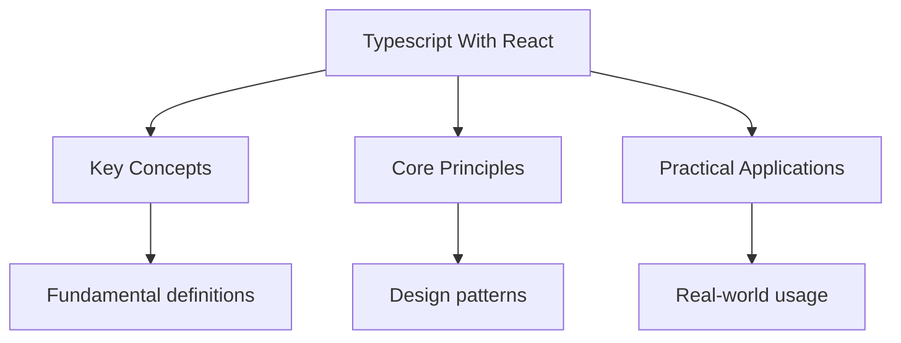

---

title: "TypeScript with React | Languages"
description: "Comprehensive study notes for TypeScript with React with worked examples, practice problems, and key concepts for exam preparation."
date: 2026-04-22T00:00:00.000Z
tags: [TypeScript]
categories: [TypeScript]
---

<!-- Breadcrumb Schema for SEO -->
<script type="application/ld+json">
{
  "@context": "https://schema.org",
  "@type": "BreadcrumbList",
  "itemListElement": [{"name": "Home", "url": "https://wyattau.com"}, {"name": "languages", "url": "https://languages.wyattau.com"}, {"name": "Typescript", "url": "https://languages.wyattau.com/typescript"}, {"name": "Typescript With React", "url": "https://languages.wyattau.com/typescript/typescript-with-react"}]
}
</script>

## Typing React Components

### Function Components

Function components are typed by annotating their props parameter. The return type is inferred by
React's type system and should not be annotated explicitly.

```tsx
interface GreetingProps {
  name: string;
  age?: number;
}

function Greeting({ name, age }: GreetingProps) {
  return (
    <div>
      <h1>Hello, {name}</h1>
      {age !== undefined && <p>Age: {age}</p>}
    </div>
  );
}
```

### `FC` Type

The `FC` (FunctionComponent) type provides a default typing for function components, including an
Implicit `children` prop:

```tsx
import type { FC } from 'react';

interface CardProps {
  title: string;
}

const Card: FC<CardProps> = ({ title, children }) => {
  return (
    <div className="card">
      <h2>{title}</h2>
      {children}
    </div>
  );
};
```

**Common Pitfall:** Using `FC` is controversial in modern React. The `FC` type implicitly includes
`children` in the props, which encourages passing children via the props object rather than as a
Prop. Many teams prefer explicit typing without `FC`:

```tsx
interface CardProps {
  title: string;
  children: React.ReactNode;
}

function Card({ title, children }: CardProps) {
  return (
    <div className="card">
      <h2>{title}</h2>
      {children}
    </div>
  );
}
```

### Component Typing Comparison

| Approach                               | `children`           | Pros                            | Cons                                            |
| -------------------------------------- | -------------------- | ------------------------------- | ----------------------------------------------- |
| `FC<Props>`                            | Implicit             | Concise, includes ref typing    | Implicit children, deprecated in React 18 types |
| `(props: Props) => JSX.Element`        | Explicit if declared | Full control, modern convention | Must type return explicitly                     |
| `(props: Props) => React.ReactElement` | Explicit if declared | Precise return type             | Does not allow `null` or `string` returns       |
| `function Component(props: Props)`     | Explicit if declared | Readable, supports overloads    | Verbose                                         |

### `ComponentPropsWithRef` and `ComponentPropsWithoutRef`

Extract the props type from an existing component:

```tsx
import type { ComponentPropsWithoutRef } from 'react';

function EnhancedButton(props: ComponentPropsWithoutRef<'button'>) {
  return <button className="enhanced" {...props} />;
}
```

`ComponentPropsWithoutRef<"button">` produces the props type of the native `<button>` element,
Including all HTML attributes but excluding `ref`. Use `ComponentPropsWithRef` to include `ref`.

### `ReactNode` vs `JSX.Element` vs `ReactElement`

| Type                 | Description                                                                                       |
| -------------------- | ------------------------------------------------------------------------------------------------- |
| `React.ReactNode`    | Anything React can render: elements, strings, numbers, `null``undefined`Booleans, arrays, portals |
| `React.ReactElement` | A React element (result of `createElement` or JSX)                                                |
| `JSX.Element`        | Alias for `React.ReactElement` in the current JSX namespace                                       |

For component return types and `children` props, `React.ReactNode` is the most permissive and
Generally correct choice.

## Event Handler Types

### Synthetic Event Types

React defines synthetic event types that wrap native browser events:

```tsx
import type { MouseEvent, ChangeEvent, FormEvent, KeyboardEvent, FocusEvent } from 'react';

function Input() {
  const handleClick = (e: MouseEvent<HTMLButtonElement>) => {
    console.log(e.clientX, e.clientY);
  };

  const handleChange = (e: ChangeEvent<HTMLInputElement>) => {
    console.log(e.target.value);
  };

  const handleSubmit = (e: FormEvent<HTMLFormElement>) => {
    e.preventDefault();
    console.log('Form submitted');
  };

  const handleKeyDown = (e: KeyboardEvent<HTMLInputElement>) => {
    if (e.key === 'Enter') {
      console.log('Enter pressed');
    }
  };

  return (
    <form onSubmit={handleSubmit}>
      <input onChange={handleChange} onKeyDown={handleKeyDown} />
      <button onClick={handleClick}>Click</button>
    </form>
  );
}
```

### Event Type Reference

| Event Type          | Target Element                  |
| ------------------- | ------------------------------- |
| `MouseEvent<T>`     | `<div>``<button>``<a>`Etc.      |
| `ChangeEvent<T>`    | `<input>``<select>``<textarea>` |
| `FormEvent<T>`      | `<form>`                        |
| `KeyboardEvent<T>`  | `<input>``<textarea>`           |
| `FocusEvent<T>`     | `<input>``<textarea>``<button>` |
| `DragEvent<T>`      | Any draggable element           |
| `WheelEvent<T>`     | Any element                     |
| `ClipboardEvent<T>` | Any element                     |

### Inline Event Handlers

When using inline handlers, the event type is inferred from context:

```tsx
function Example() {
  return <button onClick={(e) => console.log(e.currentTarget.textContent)}>Click me</button>;
}
```

The type of `e` is inferred as `MouseEvent<HTMLButtonElement>`.

## Hooks Typing

### `useState`

`useState` infers the state type from the initial value:

```tsx
function Counter() {
  const [count, setCount] = useState(0);
  const [name, setName] = useState('');
  const [items, setItems] = useState<string[]>([]);
}
```

When the initial value is `null` or `undefined`Provide an explicit type parameter:

```tsx
const [user, setUser] = useState<User | null>(null);
const [data, setData] = useState<ApiResponse | undefined>(undefined);
```

**Common Pitfall:** Using `useState(null)` without a type parameter produces `useState<null>`Which
Means the state can only ever be `null`. Always provide the union type:
`useState<Type | null>(null)`.

### `useReducer`

```tsx
interface State {
  count: number;
  step: number;
}

type Action =
  | { type: "increment'' }
  | { type: "decrement' }
  | { type: "setStep''; payload: number }
  | { type: "reset' };

function reducer(state: State, action: Action): State {
  switch (action.type) {
    case 'increment':
      return { ...state, count: state.count + state.step };
    case 'decrement':
      return { ...state, count: state.count - state.step };
    case 'setStep':
      return { ...state, step: action.payload };
    case 'reset':
      return { count: 0, step: 1 };
    default:
      return state;
  }
}

function Counter() {
  const [state, dispatch] = useReducer(reducer, { count: 0, step: 1 });

  return (
    <div>
      <p>Count: {state.count}</p>
      <p>Step: {state.step}</p>
      <button onClick={() => dispatch({ type: "increment'' })}>+</button>
      <button onClick={() => dispatch({ type: "decrement' })}>-</button>
      <button onClick={() => dispatch({ type: "setStep'', payload: 5 })}>Step 5</button>
      <button onClick={() => dispatch({ type: "reset' })}>Reset</button>
    </div>
  );
}
```

### `useRef`

`useRef` has two principal use cases, each with a different typing pattern:

**Mutable ref (not attached to a DOM element):**

```tsx
const timerRef = useRef<ReturnType<typeof setTimeout> | null>(null);
const countRef = useRef<number>(0);
```

**DOM ref:**

```tsx
function TextInput() {
  const inputRef = useRef<HTMLInputElement>(null);

  const focus = () => {
    inputRef.current?.focus();
  };

  return (
    <div>
      <input ref={inputRef} type="text" />
      <button onClick={focus}>Focus</button>
    </div>
  );
}
```

**Common Pitfall:** `useRef` without an initial value argument creates
`MutableRefObject<T | undefined>`. When the initial value is `null` and the ref is attached to a DOM
Element, the type should be `useRef<T>(null)`:

```tsx
const ref = useRef<HTMLDivElement>(null);
```

### `useCallback`

`useCallback` preserves the function's type:

```tsx
function List() {
  const [items, setItems] = useState<string[]>([]);

  const addItem = useCallback((item: string) => {
    setItems((prev) => [...prev, item]);
  }, []);

  const removeItem = useCallback((index: number) => {
    setItems((prev) => prev.filter((_, i) => i !== index));
  }, []);

  return (
    <div>
      {items.map((item, i) => (
        <div key={i}>
          {item}
          <button onClick={() => removeItem(i)}>Remove</button>
        </div>
      ))}
      <button onClick={() => addItem('new')}>Add</button>
    </div>
  );
}
```

### `useMemo`

```tsx
function ExpensiveComponent({ items }: { items: number[] }) {
  const sorted = useMemo(() => [...items].sort((a, b) => a - b), [items]);
  const total = useMemo(() => items.reduce((sum, n) => sum + n, 0), [items]);

  return (
    <div>
      <p>Sorted: {sorted.join(', ')}</p>
      <p>Total: {total}</p>
    </div>
  );
}
```

## Custom Hooks

### Typing Rules for Custom Hooks

Custom hooks are functions prefixed with `use` that may call other hooks. Their types follow
Standard function typing rules.

```tsx
function useLocalStorage<T>(key: string, initialValue: T): [T, (value: T) => void] {
  const [storedValue, setStoredValue] = useState<T>(() => {
    const item = window.localStorage.getItem(key);
    return item ? (JSON.parse(item) as T) : initialValue;
  });

  const setValue = (value: T) => {
    setStoredValue(value);
    window.localStorage.setItem(key, JSON.stringify(value));
  };

  return [storedValue, setValue];
}

function Settings() {
  const [theme, setTheme] = useLocalStorage<string>('theme', 'light');
  const [fontSize, setFontSize] = useLocalStorage<number>('fontSize', 16);

  return (
    <div>
      <button onClick={() => setTheme(theme === 'light' ? 'dark' : "light'')}>Toggle theme</button>
      <p>Current theme: {theme}</p>
      <input
        type="range"
        min={12}
        max={24}
        value={fontSize}
        onChange={(e) => setFontSize(Number(e.target.value))}
      />
    </div>
  );
}
```

### Generic Custom Hooks

```tsx
function useFetch<T>(url: string): {
  data: T | null;
  loading: boolean;
  error: Error | null;
} {
  const [data, setData] = useState<T | null>(null);
  const [loading, setLoading] = useState(true);
  const [error, setError] = useState<Error | null>(null);

  useEffect(() => {
    const controller = new AbortController();

    async function fetchData() {
      try {
        setLoading(true);
        const response = await fetch(url, { signal: controller.signal });
        if (!response.ok) {
          throw new Error(`HTTP ${response.status}`);
        }
        const json = (await response.json()) as T;
        setData(json);
      } catch (err) {
        if (err instanceof Error && err.name !== "AbortError') {
          setError(err);
        }
      } finally {
        setLoading(false);
      }
    }

    fetchData();

    return () => controller.abort();
  }, [url]);

  return { data, loading, error };
}

interface User {
  id: number;
  name: string;
  email: string;
}

function UserList() {
  const { data, loading, error } = useFetch<User[]>('/api/users');

  if (loading) return <p>Loading...</p>;
  if (error) return <p>Error: {error.message}</p>;
  if (!data) return null;

  return (
    <ul>
      {data.map((user) => (
        <li key={user.id}>
          {user.name} ({user.email})
        </li>
      ))}
    </ul>
  );
}
```

## Context API Typing

### Basic Context

```tsx
import { createContext, useContext } from 'react';

interface ThemeContextValue {
  theme: "light'' | "dark';
  toggleTheme: () => void;
}

const ThemeContext = createContext<ThemeContextValue | null>(null);

function useTheme(): ThemeContextValue {
  const context = useContext(ThemeContext);
  if (context === null) {
    throw new Error('useTheme must be used within a ThemeProvider');
  }
  return context;
}

function ThemeProvider({ children }: { children: React.ReactNode }) {
  const [theme, setTheme] = useState<'light' | 'dark'>('light');

  const toggleTheme = () => {
    setTheme((prev) => (prev === 'light' ? 'dark' : "light''));
  };

  return <ThemeContext.Provider value={{ theme, toggleTheme }}>{children}</ThemeContext.Provider>;
}

function ThemedButton() {
  const { theme, toggleTheme } = useTheme();

  return (
    <button
      style={{
        background: theme === "light' ? '#fff' : "#333'',
        color: theme === "light' ? '#000' : "#fff'',
      }}
      onClick={toggleTheme}
    >
      Current: {theme}
    </button>
  );
}
```

### Context with Default Value

```tsx
const ConfigContext = createContext({
  apiUrl: "/api',
  debug: false,
});

function useConfig() {
  return useContext(ConfigContext);
}
```

When a default value is provided, `useContext` never returns `null`So the null-check in the hook Is
unnecessary. However, this approach is less type-safe because the default value may not match the
Actual provider value.

### Factory Context Pattern

For contexts where a default value is impractical (e.g., because the value depends on state), use a
Factory function:

```tsx
function createContextFactory<T>() {
  const Context = createContext<T | null>(null);

  function useContextValue(): T {
    const context = useContext(Context);
    if (context === null) {
      throw new Error('Context must be used within its provider');
    }
    return context;
  }

  return { Context, useContext: useContextValue };
}

const { Context: AuthContext, useContext: useAuth } = createContextFactory<{
  user: User | null;
  login: (email: string, password: string) => Promise<void>;
  logout: () => void;
}>();
```

## `useImperativeHandle` and `forwardRef`

### `forwardRef` Typing

`forwardRef` allows a component to expose a ref to its parent:

```tsx
import { forwardRef, useImperativeHandle, useRef } from 'react';

interface InputProps {
  label: string;
  defaultValue?: string;
}

export interface InputHandle {
  focus: () => void;
  getValue: () => string;
  clear: () => void;
}

const Input = forwardRef<InputHandle, InputProps>(({ label, defaultValue = '' }, ref) => {
  const inputRef = useRef<HTMLInputElement>(null);

  useImperativeHandle(ref, () => ({
    focus: () => inputRef.current?.focus(),
    getValue: () => inputRef.current?.value ?? '',
    clear: () => {
      if (inputRef.current) {
        inputRef.current.value = '';
      }
    },
  }));

  return (
    <div>
      <label>{label}</label>
      <input ref={inputRef} defaultValue={defaultValue} />
    </div>
  );
});

Input.displayName = 'Input';

function Form() {
  const nameRef = useRef<InputHandle>(null);

  const handleSubmit = () => {
    const value = nameRef.current?.getValue();
    console.log('Submitted: ", value);
    nameRef.current?.clear();
  };

  return (
    <div>
      <Input ref={nameRef} label="Name" />
      <button onClick={handleSubmit}>Submit</button>
    </div>
  );
}
```

**Common Pitfall:** `forwardRef` is a generic function with two type parameters: the ref handle type
And the props type. The order is `<HandleType, PropsType>`. Forgetting the generic parameters
Produces `unknown` for the ref type.

## Ref Types

### `RefObject` vs `MutableRefObject` vs `Ref<T>`

| Type                  | Description                                       |
| --------------------- | ------------------------------------------------- |
| `RefObject<T>`        | Immutable ref object (`current` is readonly)      |
| `MutableRefObject<T>` | Mutable ref object (`current` is writable)        |
| `Ref<T>`              | `RefObject<T> \| ((instance: T) => void) \| null` |

```tsx
const immutableRef = useRef<HTMLDivElement>(null);
```

`immutableRef` has type `RefObject<HTMLDivElement>`. Its `current` property is
`HTMLDivElement | null` and is readonly.

```tsx
const mutableRef = useRef<number>(0);
```

`mutableRef` has type `MutableRefObject<number>`. Its `current` property is `number` and is
Writable.

### Callback Refs

```tsx
function TextInput() {
  const setRef = useCallback((node: HTMLInputElement | null) => {
    if (node) {
      node.focus();
    }
  }, []);

  return <input ref={setRef} />;
}
```

## Children Prop Typing

### Explicit Children

```tsx
interface LayoutProps {
  children: React.ReactNode;
  header?: React.ReactNode;
  footer?: React.ReactNode;
}

function Layout({ children, header, footer }: LayoutProps) {
  return (
    <div>
      {header && <header>{header}</header>}
      <main>{children}</main>
      {footer && <footer>{footer}</footer>}
    </div>
  );
}
```

### `PropsWithChildren`

React provides a utility type for adding `children` to props:

```tsx
import type { PropsWithChildren } from ''react";

type PanelProps = PropsWithChildren<{
  title: string;
  isOpen: boolean;
}>;

function Panel({ title, isOpen, children }: PanelProps) {
  if (!isOpen) return null;
  return (
    <div className="panel">
      <h2>{title}</h2>
      {children}
    </div>
  );
}
```

### Restricting Children Type

To restrict the type of children (e.g., only `Button` components):

```tsx
import type { ReactElement } from 'react';

interface ButtonGroupProps {
  children: ReactElement<typeof Button>[];
}

function ButtonGroup({ children }: ButtonGroupProps) {
  return <div className="button-group">{children}</div>;
}
```

## Typing Props with Intersection Types and Generics

### Intersection Props

```tsx
interface BaseProps {
  className?: string;
  style?: React.CSSProperties;
  'data-testid'?: string;
}

interface ButtonProps extends BaseProps {
  variant: "primary'' | "secondary' | 'danger';
  size: "sm'' | "md' | 'lg';
  disabled?: boolean;
  onClick?: (e: MouseEvent<HTMLButtonElement>) => void;
  children: React.ReactNode;
}

function Button({ variant, size, disabled, onClick, children, className, style }: ButtonProps) {
  return (
    <button
      className={`${variant} ${size} ${className ?? ''}`}
      style={style}
      disabled={disabled}
      onClick={onClick}
    >
      {children}
    </button>
  );
}
```

### Polymorphic Components with Generics

```tsx
import type { ComponentPropsWithoutRef, ElementType } from 'react';

interface PolymorphicProps<T extends ElementType> {
  as?: T;
  children: React.ReactNode;
}

type Props<T extends ElementType> = PolymorphicProps<T> &
  Omit<ComponentPropsWithoutRef<T>, keyof PolymorphicProps<T>>;

function Text<T extends ElementType = 'span'>({ as, children, ...rest }: Props<T>) {
  const Component = as ?? 'span';
  return <Component {...rest}>{children}</Component>;
}

function Example() {
  return (
    <div>
      <Text as="h1">Heading</Text>
      <Text as="p">Paragraph</Text>
      <Text as="a" href="https://example.com/home">
        Link
      </Text>
      <Text>Default span</Text>
    </div>
  );
}
```

## Common Pitfalls

### Pitfall 1: Event Handler Type Mismatches

Using `MouseEvent` instead of `React.MouseEvent` causes type errors:

```tsx
const handleClick = (e: MouseEvent) => {};
```

This types `e` as the native DOM `MouseEvent`Not React's synthetic event. Use
`React.MouseEvent<HTMLButtonElement>`.

### Pitfall 2: `useRef` for DOM Elements Without `null` Initial Value

```tsx
const ref = useRef<HTMLDivElement>();
```

This creates `MutableRefObject<HTMLDivElement | undefined>`Which is not compatible with JSX `ref`
Props that expect `Ref<HTMLDivElement>`. Always initialise DOM refs with `null`:

```tsx
const ref = useRef<HTMLDivElement>(null);
```

### Pitfall 3: Missing Exhaustive Checks in Reducers

When using `useReducer`Always add a default case that returns the current state or calls
`assertNever` to ensure new action types are handled:

```tsx
function reducer(state: State, action: Action): State {
  switch (action.type) {
    case 'increment':
      return { count: state.count + 1 };
    default:
      return assertNever(action);
  }
}
```

### Pitfall 4: Overly Broad `children` Types

Using `JSX.Element` instead of `React.ReactNode` for `children` excludes valid React render values
Like strings, numbers, `null`And arrays:

```tsx
interface Bad {
  children: JSX.Element;
}

interface Good {
  children: React.ReactNode;
}
```




## Summary

This topic covers the core concepts of typescript with react, including underlying theory, practical
implementation, and key applications.

**Key concepts include:**

- type annotations and interfaces
- generics and utility types
- async/await and Promises
- modules and namespaces
- type guards and narrowing

Understanding these concepts thoroughly is essential for both examinations and practical
programming, and requires both theoretical knowledge and hands-on practice.

## Worked Examples

Worked examples demonstrating the application of key concepts are covered in the detailed sub-pages
linked above.

## Intuition

TypeScript and React form a powerful combination where types serve as live documentation for your component API. Props interfaces define the contract for each component, while hooks like useState and useRef infer types from initial values. Event handlers use generic types parameterized by the target element, ensuring you only access valid properties. Custom hooks leverage generics to create reusable, type-safe abstractions that work across different data types.

## Cross-References

- [[typescript/typescript]] - TypeScript fundamentals
- [[typescript/classes]] - Component lifecycle and class components
- [[typescript/generics]] - Generic hooks and polymorphic components
- [[typescript/functions]] - Callback typing and event handler patterns

## See Also

- [Typescript](./)
- [TypeScript Fundamentals Flashcards](./flashcards-typescript-basics)
- [TypeScript Fundamentals Practice (Interactive)](./practice-typescript-basics)
