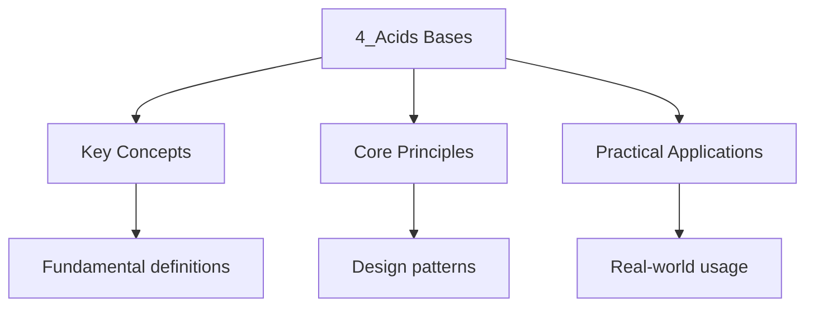

---

title: Acids, Bases and Salt Preparation
description: "This topic covers the properties of acids and bases, pH, strong and weak acids, buffers, and methods Of salt preparation. It is essential for both Ordinary"
date: 2026-04-14
tags:
  - ilc
  - ilc-chemistry
categories:
  - ilc-chemistry

---

<!-- Breadcrumb Schema for SEO -->

## Acids, Bases and Salt Preparation

This topic covers the properties of acids and bases, pH, strong and weak acids, buffers, and methods
Of salt preparation. It is essential for both Ordinary and Higher Level.

## Definitions of Acids and Bases (OL/HL)

### Arrhenius Definition

- **Acid:** produces $\mathrm{H^+$ (or $\mathrm{H_3\mathrm{O^+$) in water.
- **Base:** produces $\mathrm{OH^-$ in water.

### Bronsted-Lowry Definition (HL)

- **Acid:** proton ($\mathrm{H^+$) donor.
- **Base:** proton acceptor.

### Conjugate Acid-Base Pairs (HL)

When an acid donates a proton, it forms its conjugate base. When a base accepts a proton, it forms
Its conjugate acid.

$$
\mathrm{HA + \mathrm{H_2\mathrm{O \rightleftharpoons \mathrm{H_3\mathrm{O^+ + \mathrm{A^-
$$

- $\mathrm{HA$ and $\mathrm{A^-$ form a conjugate pair.
- $\mathrm{H_2\mathrm{O$ and $\mathrm{H_3\mathrm{O^+$ form a conjugate pair.

**Example (HL):** Identify the conjugate acid-base pairs in:

$$
\mathrm{NH_3 + \mathrm{H_2\mathrm{O \rightleftharpoons \mathrm{NH_4^+ + \mathrm{OH^-
$$

$\mathrm{NH_3/\mathrm{NH_4^+$ and $\mathrm{H_2\mathrm{O/\mathrm{OH^-$.

### Lewis Definition (HL)

- **Acid:** electron pair acceptor.
- **Base:** electron pair donor.

## Strong and Weak Acids and Bases (OL/HL)

### Strong Acids

Completely dissociate in water: $\mathrm{HCl$$\mathrm{HNO_3$$\mathrm{H_2\mathrm{SO_4$ (first
Dissociation).

$$
\mathrm{HCl + \mathrm{H_2\mathrm{O \to \mathrm{H_3\mathrm{O^+ + \mathrm{Cl^-
$$

### Weak Acids

Partially dissociate in water: $\mathrm{CH_3\mathrm{COOH$$\mathrm{HF$$\mathrm{H_2\mathrm{CO_3$.

$$
\mathrm{CH_3\mathrm{COOH + \mathrm{H_2\mathrm{O \rightleftharpoons \mathrm{H_3\mathrm{O^+ + \mathrm{CH_3\mathrm{COO^-
$$

### Strong Bases

Completely dissociate: $\mathrm{NaOH$$\mathrm{KOH$$\mathrm{Ca(OH)_2$.

### Weak Bases

Partially dissociate: $\mathrm{NH_3$.

$$
\mathrm{NH_3 + \mathrm{H_2\mathrm{O \rightleftharpoons \mathrm{NH_4^+ + \mathrm{OH^-
$$

## The pH Scale (OL/HL)

$$
\mathrm{pH = -\log_{10}[\mathrm{H_3\mathrm{O^+]
$$

At $25^\circ\mathrm{C$: $[\mathrm{H_3\mathrm{O^+][\mathrm{OH^-] = 10^{-14}$.

| pH  | [H3O+]               | Description     |
| --- | -------------------- | --------------- |
| 0   | $1\mathrm{ M$        | Strongly acidic |
| 7   | $10^{-7}\mathrm{ M$  | Neutral         |
| 14  | $10^{-14}\mathrm{ M$ | Strongly basic  |

**Example (OL):** Find the pH of a $0.01\mathrm{ M$ solution of $\mathrm{HCl$.

$$
[\mathrm{H_3\mathrm{O^+] = 0.01 = 10^{-2}\mathrm{ M \implies \mathrm{pH = 2
$$

**Example (HL):** Find the pH of a $0.10\mathrm{ M$ solution of $\mathrm{CH_3\mathrm{COOH$
($K_a = 1.8 \times 10^{-5}$).

$$
K_a = \frac{[\mathrm{H_3\mathrm{O^+][\mathrm{CH_3\mathrm{COO^-]}{[\mathrm{CH_3\mathrm{COOH]} = \frac{x^2}{0.10 - x} \approx \frac{x^2}{0.10}
$$

$$
X = \sqrt{0.10 \times 1.8 \times 10^{-5}} = \sqrt{1.8 \times 10^{-6}} = 1.34 \times 10^{-3}\mathrm{ M
$$

$$
\mathrm{pH = -\log(1.34 \times 10^{-3}) = 2.87
$$

## Acid Dissociation Constant ($K_a$) (HL)

$$
K_a = \frac{[\mathrm{H_3\mathrm{O^+][\mathrm{A^-]}{[\mathrm{HA]}
$$

$$
\mathrm{pK_a = -\log K_a
$$

The larger the $K_a$The stronger the acid.

**Relationship:** $\mathrm{pH + \mathrm{pOH = 14$ at $25^\circ\mathrm{C$.

## pH Calculations (HL)

### Strong Monoprotic Acid

$$
\mathrm{pH = -\log[\mathrm{H_3\mathrm{O^+]
$$

### Strong Diprotic Acid

For $\mathrm{H_2\mathrm{SO_4$ (first dissociation complete):

$$
[\mathrm{H_3\mathrm{O^+] = 2c \quad (\mathrm{if both protons dissociate fully)
$$

### Dilution

$$
C_1 V_1 = c_2 V_2
$$

**Example (HL):** 25 mL of $0.10\mathrm{ M$ $\mathrm{HCl$ is diluted to 250 mL. Find the new pH.

$$
C_2 = \frac{0.10 \times 25}{250} = 0.010\mathrm{ M
$$

$$
\mathrm{pH = -\log(0.010) = 2
$$

## Buffers (HL)

A buffer solution resists changes in pH when small amounts of acid or base are added. It consists of
A weak acid and its conjugate base (or a weak base and its conjugate acid).

### Buffer pH Equation (Henderson-Hasselbalch)

$$
\mathrm{pH = \mathrm{pK_a + \log\frac{[\mathrm{A^-]}{[\mathrm{HA]}
$$

**Example (HL):** A buffer contains $0.10\mathrm{ M$ $\mathrm{CH_3\mathrm{COOH$ and $0.15\mathrm{ M$
$\mathrm{CH_3\mathrm{COONa$. Find the pH. ($\mathrm{pK_a = 4.76$)

$$
\mathrm{pH = 4.76 + \log\frac{0.15}{0.10} = 4.76 + \log 1.5 = 4.76 + 0.18 = 4.94
$$

### How Buffers Work

When acid ($\mathrm{H^+$) is added: the conjugate base reacts with $\mathrm{H^+$Removing it.

$$
\mathrm{CH_3\mathrm{COO^- + \mathrm{H_3\mathrm{O^+ \to \mathrm{CH_3\mathrm{COOH + \mathrm{H_2\mathrm{O
$$

When base ($\mathrm{OH^-$) is added: the weak acid reacts with $\mathrm{OH^-$Neutralising it.

$$
\mathrm{CH_3\mathrm{COOH + \mathrm{OH^- \to \mathrm{CH_3\mathrm{COO^- + \mathrm{H_2\mathrm{O
$$

## Neutralisation Reactions (OL/HL)

Acid + Base $\to$ Salt + Water

**Example (OL):**

$$
\mathrm{HCl + \mathrm{NaOH \to \mathrm{NaCl + \mathrm{H_2\mathrm{O
$$

$$
\mathrm{H_2\mathrm{SO_4 + 2\mathrm{NaOH \to \mathrm{Na_2\mathrm{SO_4 + 2\mathrm{H_2\mathrm{O
$$

## Salt Preparation (OL/HL)

### Methods of Preparation

1. **Acid + Metal:**

$$
\mathrm{Zn + \mathrm{H_2\mathrm{SO_4 \to \mathrm{ZnSO_4 + \mathrm{H_2
$$

1. **Acid + Base (neutralisation):**

$$
\mathrm{HCl + \mathrm{NaOH \to \mathrm{NaCl + \mathrm{H_2\mathrm{O
$$

1. **Acid + Carbonate:**

$$
\mathrm{HCl + \mathrm{CaCO_3 \to \mathrm{CaCl_2 + \mathrm{H_2\mathrm{O + \mathrm{CO_2
$$

1. **Acid + Insoluble Base (titration method):**

Add the acid to the insoluble base (e.g., $\mathrm{CuO$) until no more dissolves. Filter and
Evaporate.

1. **Precipitation (mixing two solutions):**

$$
\mathrm{AgNO_3 + \mathrm{NaCl \to \mathrm{AgCl + \mathrm{NaNO_3
$$

### Choosing the Method

| Desired salt                      | Method                      |
| --------------------------------- | --------------------------- |
| Sodium, potassium, ammonium salts | Titration or evaporation    |
| Soluble salts of other metals     | Metal + acid or base + acid |
| Insoluble salts                   | Precipitation               |

## Indicators (OL/HL)

| Indicator           | Colour in acid | Colour in base | pH range    |
| ------------------- | -------------- | -------------- | ----------- |
| Litmus              | Red            | Blue           | 4.5 -- 8.3  |
| Methyl orange       | Red            | Yellow         | 3.1 -- 4.4  |
| Phenolphthalein     | Colourless     | Pink           | 8.3 -- 10.0 |
| Universal indicator | Various        | Various        | 1 -- 14     |

### Choosing an Indicator for Titrations (HL)

The indicator must change colour within the pH range of the equivalence point.

- Strong acid + strong base: any indicator (pH change large).
- Strong acid + weak base: methyl orange (equivalence pH < 7).
- Weak acid + strong base: phenolphthalein (equivalence pH > 7).
- Weak acid + weak base: no suitable indicator.

## Common Pitfalls

1. **Strong vs weak** -- strong acids/bases dissociate completely; weak ones partially.
2. **pH of weak acids** -- do not assume $[\mathrm{H^+] = c$; use $K_a$.
3. **Buffer calculations** -- the Henderson-Hasselbalch equation uses the ratio of base to acid.
4. **Diprotic acids** -- each mole can donate two protons.
5. **Indicator choice** -- match the indicator range to the equivalence point pH.

## Practice Questions

### Ordinary Level

1. Define acid and base using the Arrhenius definition.
2. Find the pH of a $0.001\mathrm{ M$ solution of $\mathrm{NaOH$.
3. Write the balanced equation for the reaction between $\mathrm{HNO_3$ and $\mathrm{KOH$.
4. Describe how to prepare a sample of $\mathrm{ZnSO_4$ crystals from zinc and dilute sulfuric acid.

### Higher Level

1. Calculate the pH of a $0.15\mathrm{ M$ solution of $\mathrm{HF$ ($K_a = 6.8 \times 10^{-4}$).
2. Calculate the pH of a buffer containing $0.20\mathrm{ M$ $\mathrm{NH_3$ and $0.25\mathrm{ M$
   $\mathrm{NH_4\mathrm{Cl$ ($K_b = 1.8 \times 10^{-5}$).
3. Explain why the pH of a $0.01\mathrm{ M$ solution of $\mathrm{HCl$ is 2 but the pH of a
   $0.01\mathrm{ M$ solution of $\mathrm{CH_3\mathrm{COOH$ is greater than 2.
4. 50 mL of $0.10\mathrm{ M$ $\mathrm{NaOH$ is added to 50 mL of $0.10\mathrm{ M$
   $\mathrm{CH_3\mathrm{COOH$. Calculate the pH of the resulting solution.

---

<!-- Breadcrumb Schema for SEO -->

## pH Calculations in Detail (HL)

### Strong Monoprotic Acid

Since strong acids dissociate completely, $[\mathrm{H^+] = c$ (the acid concentration).

$$\mathrm{pH = -\log c$$

**Worked Example 5 (HL):** Find the pH of a $0.0025 \mathrm{ M$ solution of $\mathrm{HNO_3$.

$$\mathrm{pH = -\log(0.0025) = 2.60$$

### Strong Diprotic Acid

For $\mathrm{H_2\mathrm{SO_4$The first proton dissociates completely. The second proton has
$K_{a2} = 1.2 \times 10^{-2}$.

**Worked Example 6 (HL):** Find the pH of $0.010 \mathrm{ M$ $\mathrm{H_2\mathrm{SO_4$Accounting for
Both protons.

First proton: $[\mathrm{H^+] = 0.010 \mathrm{ M$ (complete dissociation).

Second proton: $\mathrm{HSO_4^- \rightleftharpoons \mathrm{H^+ + \mathrm{SO_4^{2-}$

$$K_{a2} = \frac{[\mathrm{H^+][\mathrm{SO_4^{2-}]}{[\mathrm{HSO_4^-]} = 1.2 \times 10^{-2}$$

Let $x$ = additional $[\mathrm{H^+]$ from second dissociation:

$$1.2 \times 10^{-2} = \frac{(0.010 + x)(x)}{(0.010 - x)}$$

Solving the quadratic: $x \approx 0.0046 \mathrm{ M$.

$$[\mathrm{H^+]_{\mathrm{total} = 0.010 + 0.0046 = 0.0146 \mathrm{ M$$

$$\mathrm{pH = -\log(0.0146) = 1.84$$

### Dilution Calculations

**Worked Example 7 (HL):** 25 mL of $0.10 \mathrm{ M$ $\mathrm{HCl$ is diluted to 250 mL. Find the
new PH.

$$c_2 = \frac{0.10 \times 25}{250} = 0.010 \mathrm{ M$$

$$\mathrm{pH = -\log(0.010) = 2.00$$

### pH of Strong Bases

**Worked Example 8 (HL):** Find the pH of a $0.001 \mathrm{ M$ solution of $\mathrm{NaOH$.

$$[\mathrm{OH^-] = 0.001 \mathrm{ M$$

$$\mathrm{pOH = -\log(0.001) = 3$$

$$\mathrm{pH = 14 - 3 = 11$$

### pH of Weak Acids: Detailed Treatment

**Worked Example 9 (HL):** Calculate the pH of a $0.15 \mathrm{ M$ solution of $\mathrm{HF$
($K_a = 6.8 \times 10^{-4}$). Check the validity of the approximation.

Without approximation:

$$K_a = \frac{x^2}{0.15 - x} = 6.8 \times 10^{-4}$$

$$x^2 + 6.8 \times 10^{-4}x - 6.8 \times 10^{-4} \times 0.15 = 0$$

$$x^2 + 6.8 \times 10^{-4}x - 1.02 \times 10^{-4} = 0$$

Using the quadratic formula: $x = 9.9 \times 10^{-3} \mathrm{ M$.

$$\mathrm{pH = -\log(9.9 \times 10^{-3}) = 2.00$$

Check: $c/K_a = 0.15/(6.8 \times 10^{-4}) = 220 > 100$ So the approximation
$[\mathrm{H^+] \approx \sqrt{K_a \times c}$ gives essentially the same result.

---

<!-- Breadcrumb Schema for SEO -->

## Buffers in Detail (HL)

### How Buffers Work: Quantitative Treatment

**Worked Example 10 (HL):** Calculate the pH of a buffer containing $0.20 \mathrm{ M$ $\mathrm{NH_3$
And $0.25 \mathrm{ M$ $\mathrm{NH_4\mathrm{Cl$ ($K_b = 1.8 \times 10^{-5}$).

First find $pK_a$ for $\mathrm{NH_4^+$:

$$K_a = \frac{K_w}{K_b} = \frac{1.0 \times 10^{-14}}{1.8 \times 10^{-5}} = 5.56 \times 10^{-10}$$

$$pK_a = 9.26$$

Using Henderson-Hasselbalch:

$$\mathrm{pH = pK_a + \log\frac{[\mathrm{NH_3]}{[\mathrm{NH_4^+]} = 9.26 + \log\frac{0.20}{0.25} = 9.26 - 0.10 = 9.16$$

### Buffer Capacity and pH Range

A buffer is most effective when:

1. The concentrations of acid and conjugate base are high ( greater than 0.10 M)
2. The ratio $[\mathrm{A^-]/[\mathrm{HA]$ is between 0.1 and 10, giving an effective range of
   $\mathrm{pH = pK_a \pm 1$

---

<!-- Breadcrumb Schema for SEO -->

## Salt Hydrolysis (HL)

### pH of Salt Solutions

| Salt formed from          | Resulting pH   | Reason                  |
| ------------------------- | -------------- | ----------------------- |
| Strong acid + strong base | 7              | Neither ion hydrolyses  |
| Strong acid + weak base   | Less than 7    | Cation hydrolyses       |
| Weak acid + strong base   | Greater than 7 | Anion hydrolyses        |
| Weak acid + weak base     | Depends        | Compare $K_a$ and $K_b$ |

**Worked Example 11 (HL):** Explain why $\mathrm{Na_2\mathrm{CO_3$ solution is alkaline.

$\mathrm{CO_3^{2-}$ is the conjugate base of the weak acid $\mathrm{HCO_3^-$. In water:

$$\mathrm{CO_3^{2-} + \mathrm{H_2\mathrm{O \rightleftharpoons \mathrm{HCO_3^- + \mathrm{OH^-$$

The production of $\mathrm{OH^-$ makes the solution alkaline.

---

<!-- Breadcrumb Schema for SEO -->

## Titration Curves (HL)

### Strong Acid-Strong Base

- Initial pH: low (strong acid)
- Equivalence point: pH = 7
- Sharp change near equivalence point

### Weak Acid-Strong Base

- Initial pH: higher than strong acid at same concentration
- Buffer region present (weak acid and conjugate base coexist)
- Half-equivalence point: pH = $pK_a$
- Equivalence point: pH greater than 7

### Strong Acid-Weak Base

- Equivalence point: pH less than 7

**Worked Example 12 (HL):** 50 mL of $0.10 \mathrm{ M$ $\mathrm{NaOH$ is added to 50 mL of
$0.10 \mathrm{ M$ $\mathrm{CH_3\mathrm{COOH$. Calculate the pH of the resulting solution.

At the equivalence point, all $\mathrm{CH_3\mathrm{COOH$ is converted to
$\mathrm{CH_3\mathrm{COO^-$.

$$n(\mathrm{CH_3\mathrm{COO^-) = 0.10 \times 0.050 = 0.0050 \mathrm{ mol$$

$$[\mathrm{CH_3\mathrm{COO^-] = \frac{0.0050}{0.100} = 0.050 \mathrm{ M$$

$$K_b = \frac{K_w}{K_a} = \frac{1.0 \times 10^{-14}}{1.8 \times 10^{-5}} = 5.56 \times 10^{-10}$$

$$[\mathrm{OH^-] = \sqrt{5.56 \times 10^{-10} \times 0.050} = 5.27 \times 10^{-6} \mathrm{ M$$

$$\mathrm{pOH = 5.28, \quad \mathrm{pH = 8.72$$

---

<!-- Breadcrumb Schema for SEO -->

## Common Pitfalls (Extended)

1. **Strong vs weak** -- strong acids/bases dissociate completely; weak ones partially.
2. **pH of weak acids** -- do not assume $[\mathrm{H^+] = c$; use $K_a$.
3. **Buffer calculations** -- the Henderson-Hasselbalch equation uses the ratio of base to acid.
4. **Diprotic acids** -- each mole can donate two protons.
5. **Indicator choice** -- match the indicator range to the equivalence point pH.
6. **pH of water at different temperatures** -- pure water has pH 7 at $25°C$ only.
7. **$K_a$ vs. $K_b$** -- remember the relationship $K_a \times K_b = K_w$.

---

<!-- Breadcrumb Schema for SEO -->

## Practice Questions (Extended)

1. Write the balanced equation for the reaction between $\mathrm{HNO_3$ and $\mathrm{KOH$.
2. Describe how to prepare a sample of $\mathrm{ZnSO_4$ crystals from zinc and dilute sulfuric acid.
3. Calculate the pH of a $0.25 \mathrm{ M$ solution of $\mathrm{CH_3\mathrm{COOH$
   ($K_a = 1.8 \times 10^{-5}$) and the percentage dissociation.
4. A buffer contains $0.15 \mathrm{ M$ $\mathrm{HCOOH$ ($pK_a = 3.75$) and $0.20 \mathrm{ M$
   $\mathrm{HCOONa$. Calculate the pH and the pH after adding $0.01 \mathrm{ mol$ of $\mathrm{NaOH$
   to $1 \mathrm{ L$ of the buffer.
5. Explain why $\mathrm{Na_2\mathrm{CO_3$ solution is alkaline.
6. Sketch the pH titration curve for $25 \mathrm{ mL$ of $0.10 \mathrm{ M$ $\mathrm{NH_3$ titrated
    with $0.10 \mathrm{ M$ $\mathrm{HCl$. Label the equivalence point, buffer region, and the
    half-equivalence point.
7. Calculate $K_a$ for a $0.050 \mathrm{ M$ weak acid solution with pH 2.80.
8. Explain the difference between the Arrhenius, Bronsted-Lowry, and Lewis definitions of acids and
    bases, giving an example of a reaction that illustrates each definition.
9. A student prepares a buffer by mixing $100 \mathrm{ mL$ of $0.20 \mathrm{ M$
    $\mathrm{CH_3\mathrm{COOH$ with $50 \mathrm{ mL$ of $0.20 \mathrm{ M$ $\mathrm{NaOH$. Calculate
    the pH of the resulting buffer.
10. Describe the method of salt preparation by precipitation, giving an example.

---

<!-- Breadcrumb Schema for SEO -->

## Lewis Acid-Base Theory (HL)

### Definition

- **Lewis acid:** electron pair acceptor.
- **Lewis base:** electron pair donor.

### Examples

**Lewis acid:** $\mathrm{BF_3$ (boron has an empty $p$ orbital), $\mathrm{AlCl_3$, $\mathrm{H^+$
(has No electrons), $\mathrm{Cu^{2+}$ (can accept electron pairs).

**Lewis base:** $\mathrm{NH_3$ (lone pair on nitrogen), $\mathrm{H_2\mathrm{O$ (lone pairs on
oxygen), $\mathrm{OH^-$ (lone pair and negative charge), $\mathrm{Cl^-$ (lone pairs and negative
charge).

### Comparison of Acid-Base Theories

| Theory         | Acid definition                 | Base definition                  | Scope                                        |
| -------------- | ------------------------------- | -------------------------------- | -------------------------------------------- |
| Arrhenius      | Produces $\mathrm{H^+$ in water | Produces $\mathrm{OH^-$ in water | Aqueous solutions only                       |
| Bronsted-Lowry | Proton donor                    | Proton acceptor                  | Includes non-aqueous systems                 |
| Lewis          | Electron pair acceptor          | Electron pair donor              | Widest scope, includes proton-free reactions |

**Example:** The reaction between $\mathrm{BF_3$ and $\mathrm{NH_3$ is a Lewis acid-base reaction
but NOT a Bronsted-Lowry reaction (no proton transfer):

$$\mathrm{BF_3 + \mathrm{NH_3 \to \mathrm{F_3\mathrm{B:\mathrm{NH_3$$

$\mathrm{BF_3$ accepts the lone pair from nitrogen (Lewis acid), $\mathrm{NH_3$ donates the lone
pair (Lewis base). A dative covalent bond is formed.

---

<!-- Breadcrumb Schema for SEO -->

## Salt Preparation Methods in Detail (OL/HL)

### Method 1: Acid + Metal

**Suitable for:** Salts of moderately reactive metals (above hydrogen in reactivity series).

**Example:** Preparation of $\mathrm{ZnSO_4$:

1. Add excess zinc to dilute sulfuric acid.
2. Filter to remove excess zinc.
3. Evaporate the filtrate to crystallisation point.
4. Cool to form crystals.
5. Filter and dry crystals.

$$\mathrm{Zn + \mathrm{H_2\mathrm{SO_4 \to \mathrm{ZnSO_4 + \mathrm{H_2$$

**Note:** Very reactive metals (Na, K) react too violently. Unreactive metals (Cu, Ag) do not react
With dilute acids.

### Method 2: Acid + Base (Neutralisation)

**Suitable for:** Soluble salts of sodium, potassium, and ammonium.

**Example:** Preparation of $\mathrm{NaCl$:

1. Titrate $\mathrm{NaOH$ with $\mathrm{HCl$ using phenolphthalein to find the exact volume needed.
2. Repeat without indicator, adding exactly the right volume of acid.
3. Evaporate and crystallise.

### Method 3: Acid + Carbonate

**Suitable for:** Most metal salts where the carbonate is available.

**Example:** Preparation of $\mathrm{CaCl_2$:

$$\mathrm{CaCO_3 + 2\mathrm{HCl \to \mathrm{CaCl_2 + \mathrm{H_2\mathrm{O + \mathrm{CO_2$$

Add excess $\mathrm{CaCO_3$ to $\mathrm{HCl$Filter, evaporate, crystallise.

### Method 4: Acid + Insoluble Base

**Suitable for:** Salts of metals with insoluble oxides or hydroxides (e.g., Cu, Fe, Zn).

**Example:** Preparation of $\mathrm{CuSO_4$:

$$\mathrm{CuO + \mathrm{H_2\mathrm{SO_4 \to \mathrm{CuSO_4 + \mathrm{H_2\mathrm{O$$

Warm $\mathrm{CuO$ with dilute $\mathrm{H_2\mathrm{SO_4$Filter, evaporate, crystallise.

### Method 5: Precipitation

**Suitable for:** Insoluble salts.

**Example:** Preparation of $\mathrm{PbI_2$:

$$\mathrm{Pb(NO_3)_2 + 2\mathrm{KI \to \mathrm{PbI_2\mathrm{(s) + 2\mathrm{KNO_3$$

Mix solutions, filter the precipitate, wash with distilled water, dry.

### Choosing the Correct Method

| Desired salt     | Solubility of salt | Recommended method                    |
| ---------------- | ------------------ | ------------------------------------- |
| $\mathrm{NaCl$   | Soluble            | Neutralisation (titration)            |
| $\mathrm{CuSO_4$ | Soluble            | Acid + insoluble base                 |
| $\mathrm{ZnSO_4$ | Soluble            | Acid + metal or acid + base           |
| $\mathrm{PbI_2$  | Insoluble          | Precipitation                         |
| $\mathrm{CaCO_3$ | Insoluble          | Cannot be prepared by aqueous methods |

---

<!-- Breadcrumb Schema for SEO -->

## Strength vs. Concentration (OL/HL)

### Common Misconception

A common error is to confuse strength with concentration.

- **Concentration:** how much acid/base is dissolved (mol/L).
- **Strength:** how completely it dissociates.

**Example:** 0.01 M $\mathrm{HCl$ (strong) has $[\mathrm{H^+] = 0.01$ M, pH = 2. 0.10 M
$\mathrm{CH_3\mathrm{COOH$ (weak) has $[\mathrm{H^+] \approx 0.0013$ M, pH = 2.9.

Despite the weak acid being 10 times more concentrated, its pH is higher because it is only
Partially dissociated.

### Dilution Effect on pH

- Diluting a strong acid by a factor of 10 increases pH by 1.
- Diluting a weak acid by a factor of 10 increases pH by 0.5 (approximately, because the degree of
  dissociation increases upon dilution).

---

<!-- Breadcrumb Schema for SEO -->

## Summary Table: Acid-Base Concepts

| Concept               | Formula                                                      | Key Point                   |
| --------------------- | ------------------------------------------------------------ | --------------------------- |
| pH                    | $\mathrm{pH = -\log[\mathrm{H^+]$                            | Lower = more acidic         |
| $K_w$                 | $[\mathrm{H^+][\mathrm{OH^-] = 10^{-14}$                     | At $25°C$                   |
| $K_a$                 | $\frac{[\mathrm{H^+][\mathrm{A^-]}{[\mathrm{HA]}$            | Higher = stronger acid      |
| $pK_a$                | $-\log K_a$                                                  | Lower = stronger acid       |
| Henderson-Hasselbalch | $\mathrm{pH = pK_a + \log\frac{[\mathrm{A^-]}{[\mathrm{HA]}$ | Buffer pH                   |
| $K_a \times K_b$      | $= K_w$                                                      | Conjugate pair relationship |

---

<!-- Breadcrumb Schema for SEO -->

## Practice Questions (Further Extended)

1. Define acid and base using the Arrhenius definition.
2. Find the pH of a $0.001 \mathrm{ M$ solution of $\mathrm{NaOH$.
3. Explain why $\mathrm{NH_4\mathrm{Cl$ solution has a pH less than 7.
4. Calculate the mass of $\mathrm{AgNO_3$ required to prepare $250 \mathrm{ mL$ of
    $0.10 \mathrm{ M$ solution.
5. Describe how you would prepare a pure, dry sample of lead(II) sulfate.
6. Explain why $\mathrm{HCl$ is a strong acid but $\mathrm{HF$ is a weak acid, despite fluorine
    being more electronegative than chlorine.
7. Calculate the pH at the half-equivalence point when $25 \mathrm{ mL$ of $0.10 \mathrm{ M$
    $\mathrm{CH_3\mathrm{COOH$ is titrated with $\mathrm{NaOH$.
8. A solution of $\mathrm{H_2\mathrm{SO_4$ has pH 1.30. Calculate the concentration of the acid,
    assuming the first proton dissociates completely and the second is negligible.
9. Explain, with equations, how a buffer containing $\mathrm{CH_3\mathrm{COOH$ and
    $\mathrm{CH_3\mathrm{COONa$ resists pH change when (a) a small amount of $\mathrm{HCl$ is added,
    and (b) a small amount of $\mathrm{NaOH$ is added.

---

<!-- Breadcrumb Schema for SEO -->

## Polyprotic Acids (HL)

Acids that can donate more than one proton are called polyprotic acids.

### Carbonic Acid ($\mathrm{H_2\mathrm{CO_3$)

$$\mathrm{H_2\mathrm{CO_3 \rightleftharpoons \mathrm{H^+ + \mathrm{HCO_3^- \quad K_{a1} = 4.3 \times 10^{-7}$$

$$\mathrm{HCO_3^- \rightleftharpoons \mathrm{H^+ + \mathrm{CO_3^{2-} \quad K_{a2} = 4.8 \times 10^{-11}$$

Note: $K_{a1} \gg K_{a2}$. The first dissociation is much stronger than the second because removing
$\mathrm{H^+$ from a negatively charged ion ($\mathrm{HCO_3^-$) is harder than from a neutral
molecule ($\mathrm{H_2\mathrm{CO_3$).

### Phosphoric Acid ($\mathrm{H_3\mathrm{PO_4$)

$$K_{a1} = 7.5 \times 10^{-3}, \quad K_{a2} = 6.2 \times 10^{-8}, \quad K_{a3} = 4.8 \times 10^{-13}$$

Each successive dissociation constant is smaller by a factor of approximately $10^5$.

### Sulfuric Acid ($\mathrm{H_2\mathrm{SO_4$)

$$K_{a1} = \mathrm{very large (complete), \quad K_{a2} = 1.2 \times 10^{-2}$$

The first proton dissociates completely (strong acid), but the second does not.

### Biological Buffer Systems

The carbonic acid-bicarbonate buffer system maintains blood pH at approximately 7.4:

$$\mathrm{H_2\mathrm{CO_3 \rightleftharpoons \mathrm{H^+ + \mathrm{HCO_3^- \quad pK_{a1} = 6.37$$

Although the blood pH of 7.4 is outside the optimal range ($pK_a \pm 1 = 5.37$ to $7.37$), the
System works because:

1. The body constantly removes $\mathrm{CO_2$ through respiration
2. The kidneys regulate $\mathrm{HCO_3^-$ levels
3. Haemoglobin acts as an additional buffer

The phosphate buffer system ($\mathrm{H_2\mathrm{PO_4^-/\mathrm{HPO_4^{2-}$, $pK_{a2} = 7.21$) is
Important intracellularly.

---

<!-- Breadcrumb Schema for SEO -->

## Environmental Chemistry of Acids and Bases

### Acid Rain

Rain with pH less than 5.6 (normal rain is slightly acidic due to dissolved $\mathrm{CO_2$).

**Causes:** $\mathrm{SO_2$ and $\mathrm{NO_x$ from fossil fuel combustion react with atmospheric
Water:

$$\mathrm{SO_2 + \mathrm{H_2\mathrm{O \to \mathrm{H_2\mathrm{SO_3$$

$$2\mathrm{SO_2 + \mathrm{O_2 \to 2\mathrm{SO_3 \quad \mathrm{then \quad \mathrm{SO_3 + \mathrm{H_2\mathrm{O \to \mathrm{H_2\mathrm{SO_4$$

**Effects:** Damage to buildings (limestone dissolves), acidification of lakes (harmful to aquatic
Life), damage to forests (nutrient leaching).

### Neutralisation of Acid Rain

Lakes can be treated with limestone ($\mathrm{CaCO_3$):

$$\mathrm{CaCO_3 + 2\mathrm{H^+ \to \mathrm{Ca^{2+} + \mathrm{H_2\mathrm{O + \mathrm{CO_2$$

However, this is a temporary solution. Reducing emissions at source is the long-term answer.

## Worked Examples

**Example 1: Mole calculation**

Calculate the number of moles in $12.0\,\text{g}$ of $\text{NaOH}$ ($M_r = 40.0$).

**Solution:**

$$n = \frac{m}{M_r} = \frac{12.0}{40.0} = 0.300\,\text{mol}$$

**Example 2: Reacting masses**

$$\text{CaCO}_3 + 2\text{HCl} \rightarrow \text{CaCl}_2 + \text{H}_2\text{O} + \text{CO}_2$$

What mass of $\text{CaCl}_2$ is produced from $10.0\,\text{g}$ of $\text{CaCO}_3$?
($M_r[\text{CaCO}_3] = 100$, $M_r[\text{CaCl}_2] = 111$)

**Solution:**

$$n(\text{CaCO}_3) = \frac{10.0}{100} = 0.100\,\text{mol}$$

From the equation, ratio is $1:1$, so $n(\text{CaCl}_2) = 0.100\,\text{mol}$.

$$m(\text{CaCl}_2) = 0.100 \times 111 = 11.1\,\text{g}$$

## Intuition

Chemistry explains how atoms combine to form the substances that make up everything around you. Bonding is about how electrons are shared or transferred between atoms, determining properties like melting point and conductivity. Chemical reactions are rearrangements of atoms, where old bonds break and new ones form. The mole concept bridges the atomic world and the laboratory, letting you predict exactly how much product a reaction will produce. Understanding these principles lets you predict the behavior of matter before you even enter the lab.

## Cross-References

- [1 Atomic Structure](chemistry/1-atomic-structure/1_atomic-structure)
- [2 Bonding](chemistry/2-bonding/2_bonding)
- [1 Cell](biology/1-cell/1_cell)
- [2 Ecology](biology/2-ecology/2_ecology)
