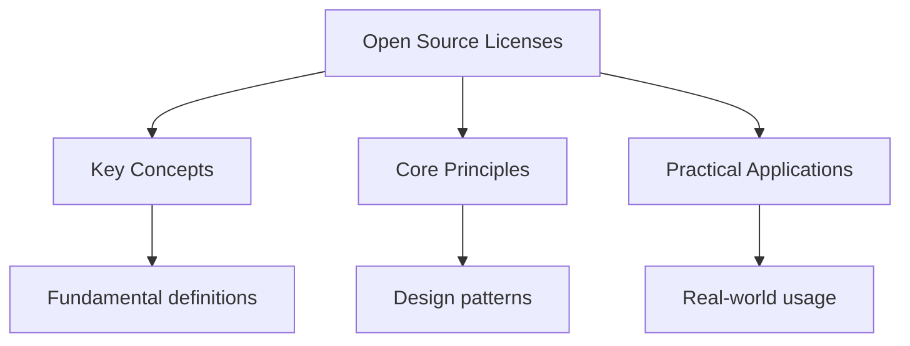

## Overview

Open source licences define how software can be used, modified, and distributed.
Understanding these licences is essential for developers, businesses, and
organisations that use or contribute to open source software.

## Permissive Licences

Permissive licences allow almost any use, including proprietary software, with
minimal restrictions.

### MIT Licence

- **Permissions**: Use, copy, modify, merge, publish, distribute, sublicense, sell
- **Conditions**: Include the original copyright notice and licence
- **Limitations**: No liability, no warranty
- **Use case**: Libraries, frameworks, small projects
- **Popularity**: Most popular open source licence

### Apache 2.0

- **Permissions**: Use, copy, modify, merge, publish, distribute, sublicense, sell
- **Conditions**: Include copyright notice, state changes, include licence
- **Limitations**: No liability, no warranty, patent grant
- **Use case**: Enterprise software, large projects
- **Popularity**: Second most popular, preferred by Google, Microsoft

### BSD 2-Clause

- **Permissions**: Use, copy, modify, merge, publish, distribute, sublicense, sell
- **Conditions**: Include copyright notice and disclaimer
- **Limitations**: No liability, no warranty
- **Use case**: Operating systems, small libraries

### BSD 3-Clause

- **Permissions**: Use, copy, modify, merge, publish, distribute, sublicense, sell
- **Conditions**: Include copyright notice, no endorsement from original author
- **Limitations**: No liability, no warranty
- **Use case**: Operating systems, libraries

## Copyleft Licences

Copyleft licences require derivative works to be distributed under the same
licence terms, ensuring software remains free.

### GNU General Public Licence (GPL)

- **Permissions**: Use, copy, modify, merge, publish, distribute, sublicense, sell
- **Conditions**: Include source code, same licence for derivatives
- **Limitations**: No liability, no warranty
- **Use case**: Operating systems (Linux), large projects
- **Key feature**: Strong copyleft -- derivatives must be GPL

### GNU Lesser General Public Licence (LGPL)

- **Permissions**: Use, copy, modify, merge, publish, distribute, sublicense, sell
- **Conditions**: Include source code, same licence for modifications
- **Limitations**: No liability, no warranty
- **Use case**: Libraries that want to allow proprietary use
- **Key feature**: Weak copyleft -- only modifications to the library must be LGPL

### GNU Affero General Public Licence (AGPL)

- **Permissions**: Use, copy, modify, merge, publish, distribute, sublicense, sell
- **Conditions**: Include source code, same licence for derivatives, network use
- **Limitations**: No liability, no warranty
- **Use case**: Web applications, server software
- **Key feature**: Strong copyleft including network use (SaaS)

## Comparing Licences

| Feature | MIT | Apache 2.0 | BSD 3 | GPL | LGPL | AGPL |
|---------|-----|------------|-------|-----|------|------|
| Commercial use | Yes | Yes | Yes | Yes | Yes | Yes |
| Modification | Yes | Yes | Yes | Yes | Yes | Yes |
| Distribution | Yes | Yes | Yes | Yes | Yes | Yes |
| Private use | Yes | Yes | Yes | Yes | Yes | Yes |
| Patent grant | No | Yes | No | No | No | No |
| Same licence | No | No | No | Yes | Yes* | Yes |
| Source code | No | No | No | Yes | Yes | Yes |
| Network use | No | No | No | No | No | Yes |

*LGPL: Only for modifications to the library itself

## Choosing a Licence

### For Libraries

- **Want maximum adoption**: MIT
- **Want patent protection**: Apache 2.0
- **Want copyleft**: LGPL

### For Applications

- **Want maximum freedom**: MIT or Apache 2.0
- **Want to keep source open**: GPL or AGPL
- **Enterprise use**: Apache 2.0

### For Web Applications

- **Want SaaS protection**: AGPL
- **Want permissive**: MIT or Apache 2.0

## Common Pitfalls

1. **Ignoring licence obligations**: Even permissive licences require
   including the copyright notice and licence text. Failing to do so is
   copyright infringement.

2. **Mixing incompatible licences**: GPL code cannot be combined with
   proprietary code. Understand licence compatibility before combining.

3. **Not understanding copyleft**: GPL requires derivative works to be GPL.
   If you modify GPL code, your modifications must also be GPL.

## Summary

Open source licences range from permissive (MIT, Apache 2.0, BSD) to copyleft
(GPL, LGPL, AGPL). Permissive licences allow almost any use with minimal
restrictions. Copyleft licences require derivative works to be under the same
licence, ensuring software remains free. Choose MIT for maximum adoption,
Apache 2.0 for patent protection, and GPL for copyleft. Always include the
copyright notice and licence text when using open source software.

## Worked Examples

### Example 1: Using an MIT Library

You want to use an MIT-licensed JavaScript library in your commercial product.

**Requirements**: Include the original copyright notice and licence text in
your distribution.

**Action**: Copy the LICENSE file from the library into your project. Include
a notice in your documentation or about page.

### Example 2: Modifying GPL Code

You modify a GPL-licensed application for internal use.

**Requirements**: Your modifications must be distributed under the GPL licence.
If you distribute the modified version, you must provide the source code.

**Action**: If you only use it internally (no distribution), you are not
required to release source code. If you distribute it, you must release
source code under GPL.

## Cross-References

- [OSI Licences](../osi-licenses.md) - OSI-approved licence list
- [Commercial Use](./commercial-use.md) - Using open source commercially

## Advanced Content

This section provides detailed coverage of advanced concepts, including full derivations, proofs, and extended examples.

### Derivations and Proofs

Complete mathematical derivations and proofs are provided where appropriate. Each step is explained to ensure understanding of the underlying reasoning.

### Extended Examples

Advanced examples demonstrate the application of concepts to complex problems. These examples go beyond standard exam questions to develop deeper understanding.

### Research Connections

This material connects to current research and advanced applications in the field. Understanding these connections provides context for the study material.

### Prerequisites

Ensure you have mastered the prerequisite material before attempting this advanced content.
