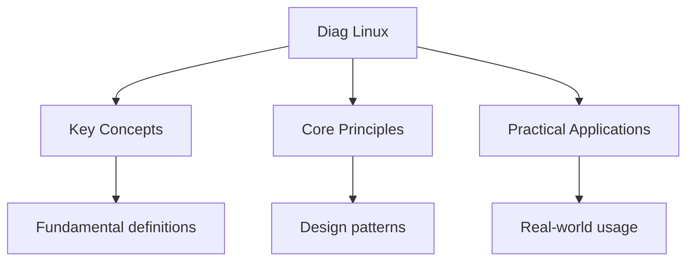

---

date: 2026-07-23T21:57:32+01:00
title: "Diagnostic Test: Linux - Wyatt's Notes"
description: "Diagnostic test notes for linux Diagnostic Test: Linux covering key concepts, worked examples, and practice problems for exam preparation."
sidebar_position: 60
tableOfContents: false
---

<!-- Breadcrumb Schema for SEO -->

## Diagnostic Test: Linux

10 multiple-choice questions covering Linux fundamentals. Select the best answer for each question, then check your score using the answer key below.

---

<!-- Breadcrumb Schema for SEO -->

**Question 1.** What does the command `chmod 640 file.txt` set?

(A) Owner: read-write; Group: read-write; Others: none
(B) Owner: read-write; Group: read; Others: none
(C) Owner: read-write-execute; Group: read-execute; Others: none
(D) Owner: read; Group: read-write; Others: none

---

<!-- Breadcrumb Schema for SEO -->

**Question 2.** Which signal is sent by `kill -15 <PID>`?

(A) SIGHUP
(B) SIGKILL
(C) SIGTERM
(D) SIGSTOP

---

<!-- Breadcrumb Schema for SEO -->

**Question 3.** What is the purpose of the `/etc/fstab` file?

(A) Stores user password hashes
(B) Defines filesystem mount points and options for automatic mounting at boot
(C) Configures network interfaces
(D) Lists running processes

---

<!-- Breadcrumb Schema for SEO -->

**Question 4.** Which command displays the kernel ring buffer messages?

(A) `dmesg`
(B) `lsmod`
(C) `modprobe`
(D) `uname -r`

---

<!-- Breadcrumb Schema for SEO -->

**Question 5.** What does `systemctl restart nginx` do?

(A) Enables the nginx service to start at boot
(B) Stops and then starts the nginx service
(C) Shows the nginx service status
(D) Disables the nginx service

---

<!-- Breadcrumb Schema for SEO -->

**Question 6.** In a shell script, which variable holds the exit status of the last executed command?

(A) `$!`
(B) `$$`
(C) `$?`
(D) `$#`

---

<!-- Breadcrumb Schema for SEO -->

**Question 7.** Which command is used to search for text patterns within files?

(A) `locate`
(B) `grep`
(C) `which`
(D) `type`

---

<!-- Breadcrumb Schema for SEO -->

**Question 8.** What is the difference between `rm -r` and `rm -rf`?

(A) `-r` removes files only; `-rf` removes files and directories
(B) `-r` prompts before each removal; `-rf` does not prompt
(C) `-r` removes directories recursively; `-f` forces removal without prompting
(D) There is no difference

---

<!-- Breadcrumb Schema for SEO -->

**Question 9.** Which utility is the modern replacement for `ifconfig`?

(A) `route`
(B) `ip`
(C) `netstat`
(D) `ss`

---

<!-- Breadcrumb Schema for SEO -->

**Question 10.** What does the `nice` command do when starting a process?

(A) Runs the process with higher priority than normal
(B) Runs the process with a modified scheduling priority (lower default priority)
(C) Runs the process in a new namespace
(D) Runs the process as a background daemon

---

<!-- Breadcrumb Schema for SEO -->

## Answer Key

| Question | Correct Answer |
|----------|---------------|
| 1        | B             |
| 2        | C             |
| 3        | B             |
| 4        | A             |
| 5        | B             |
| 6        | C             |
| 7        | B             |
| 8        | C             |
| 9        | B             |
| 10       | B             |

**Scoring:** Count your correct answers out of 10. A score of 8 or above indicates strong mastery of Linux fundamentals. Review the explanations in the practice problems for any questions you answered incorrectly.

## Intuition

**Linux system administration is about managing resources and services:** From user management to networking to security hardening, Linux administration involves configuring the system to be reliable, secure, and efficient.

**Why it matters:** Linux systems power the majority of web servers, cloud platforms, and embedded devices. Administration skills are essential for IT professionals.

**The key insight:** The principle of least privilege — granting only the minimum permissions needed — is the foundation of Linux security.

## Common Mistakes

**Confusing `rm` with `rmdir`:** `rm` deletes files; `rmdir` removes empty directories. `rm -r` recursively deletes directories and their contents — this is dangerous. Always double-check paths before running `rm -r`.

**Using `kill` without understanding signals:** `kill` sends signals, not just "stopping" processes. `kill -9` (SIGKILL) force-kills without cleanup. `kill -15` (SIGTERM) allows graceful shutdown. Always try SIGTERM first; use SIGKILL only as a last resort.

**Confusing `>` with `>>`:** `>` overwrites the file. `>>` appends to the file. Using `>` when you mean `>>` destroys existing content. This is irreversible without backups.

## Cross-References

- **[Site Home](../../):** Main landing page for linux notes.
- **[Practice](../../practice-*):** Practice problems for revision.
