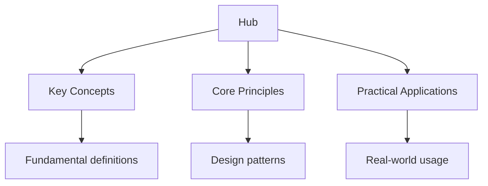

## Why This Guide Exists

Machine learning is the field of computer science that enables systems to learn from data and improve their performance without being explicitly programmed. It is the foundation of modern AI — from image recognition and natural language processing to recommendation systems and autonomous vehicles.

This hub page maps every resource on this site. The guides cover the mathematical foundations, the major algorithm families, neural network architectures, and practical implementation techniques. Whether you are a student encountering machine learning for the first time, a software engineer adding ML capabilities to your applications, or a researcher exploring new frontiers, these resources provide the theory and practice you need.

## Table of Contents

- [Prerequisites](#prerequisites)
- [Machine Learning Foundations](#machine-learning-foundations)
- [Supervised Learning](#supervised-learning)
- [Unsupervised Learning](#unsupervised-learning)
- [Neural Networks and Deep Learning](#neural-networks-and-deep-learning)
- [Model Evaluation and Validation](#model-evaluation-and-validation)
- [Advanced Topics](#advanced-topics)
- [Practical Implementation](#practical-implementation)
- [Cross-Site Resources](#cross-site-resources)
- [FAQ](#faq)

---

## Prerequisites

Machine learning requires a foundation in several mathematical and computational disciplines.

### Mathematics

- **Linear Algebra** — vectors, matrices, eigenvalues, SVD; the language of ML
- **Calculus** — derivatives, gradients, chain rule; essential for optimisation
- **Probability and Statistics** — distributions, Bayes' theorem, hypothesis testing
- **Optimisation** — gradient descent, convex optimisation, Lagrange multipliers

### Programming

- **Python** — the dominant language for ML; NumPy, pandas, scikit-learn, PyTorch, TensorFlow
- **Data manipulation** — loading, cleaning, transforming, and visualising data
- **Software engineering** — version control, testing, and deployment of ML models

### Key Resources

- [Mathematics](https://mathematics.wyattau.com/hub) — university-level mathematics covering linear algebra, real analysis, and probability
- [Python](https://python.wyattau.com/hub) — Python programming fundamentals
- [Data Structures](https://tools.wyattau.com/algorithms) — algorithms and data structures for efficient ML implementations

---

## Machine Learning Foundations

### What Is Machine Learning?

Machine learning is the study of algorithms that improve through experience. A machine learning system learns a function f that maps inputs x to outputs y, using a set of training examples {(x₁, y₁), (x₂, y₂), ..., (xₙ, yₙ)}.

### Types of Machine Learning

| Type | Description | Examples |
| ------ | ------------- | ---------- |
| Supervised Learning | Learn from labelled data | Classification, regression |
| Unsupervised Learning | Find structure in unlabelled data | Clustering, dimensionality reduction |
| Semi-Supervised Learning | Learn from partially labelled data | Self-training, co-training |
| Reinforcement Learning | Learn through interaction with an environment | Game playing, robotics |

### The Machine Learning Workflow

1. **Data collection** — gather relevant, representative data
2. **Data preprocessing** — clean, transform, and engineer features
3. **Model selection** — choose an appropriate algorithm
4. **Training** — fit the model to the training data
5. **Evaluation** — assess performance on held-out data
6. **Hyperparameter tuning** — optimise model settings
7. **Deployment** — put the model into production
8. **Monitoring** — track performance over time

### Bias-Variance Tradeoff

The fundamental challenge in machine learning:

- **Bias** — error from overly simplistic assumptions (underfitting)
- **Variance** — error from sensitivity to training data fluctuations (overfitting)
- **Irreducible error** — noise inherent in the data

Total error = Bias² + Variance + Irreducible error

A good model balances bias and variance. Too simple → high bias. Too complex → high variance.

---

## Supervised Learning

Supervised learning uses labelled training data to learn a mapping from inputs to outputs.

### Classification

Classification predicts discrete labels. The model learns a decision boundary that separates classes.

**Key algorithms:**

- **Logistic Regression** — linear model for binary classification
- **Decision Trees** — hierarchical splitting based on feature values
- **Random Forests** — ensemble of decision trees
- **Support Vector Machines (SVM)** — maximum-margin classifiers
- **k-Nearest Neighbours (k-NN)** — instance-based learning
- **Naive Bayes** — probabilistic classifier based on Bayes' theorem
- **Neural Networks** — universal function approximators

### Regression

Regression predicts continuous values. The model learns a function that maps inputs to real numbers.

**Key algorithms:**

- **Linear Regression** — modelling linear relationships
- **Polynomial Regression** — extending linear models to non-linear relationships
- **Ridge and Lasso Regression** — regularised linear models
- **Support Vector Regression** — SVM adapted for regression
- **Gradient Boosting** — sequential ensemble of weak learners

### Regularisation

Regularisation prevents overfitting by penalising model complexity:

- **L1 (Lasso)** — adds absolute value of coefficients to the loss function; promotes sparsity
- **L2 (Ridge)** — adds squared magnitude of coefficients; shrinks all coefficients
- **Elastic Net** — combines L1 and L2
- **Dropout** — randomly deactivates neurons during training (neural networks)
- **Early stopping** — halt training when validation performance degrades

---

## Unsupervised Learning

Unsupervised learning finds hidden structure in data without labels.

### Clustering

Clustering groups similar data points together.

**Key algorithms:**

- **k-Means** — partition data into k clusters by minimising within-cluster variance
- **Hierarchical Clustering** — build a tree of nested clusters
- **DBSCAN** — density-based clustering; finds clusters of arbitrary shape
- **Gaussian Mixture Models (GMM)** — probabilistic clustering with soft assignments
- **Mean Shift** — mode-seeking algorithm; no need to specify number of clusters

### Dimensionality Reduction

Dimensionality reduction projects high-dimensional data to lower dimensions while preserving structure.

**Key algorithms:**

- **Principal Component Analysis (PCA)** — linear projection to orthogonal axes of maximum variance
- **t-SNE** — non-linear projection for visualisation
- **UMAP** — uniform manifold approximation; faster and better preservation of global structure
- **Autoencoders** — neural network-based dimensionality reduction
- **Independent Component Analysis (ICA)** — separating mixed signals

### Anomaly Detection

Anomaly detection identifies unusual data points that deviate from normal patterns.

- **Isolation Forest** — isolates anomalies by random partitioning
- **One-Class SVM** — learns a boundary around normal data
- **Local Outlier Factor** — density-based anomaly detection
- **Autoencoders** — reconstruct normal data; high reconstruction error indicates anomalies

---

## Neural Networks and Deep Learning

Neural networks are computational models inspired by the human brain. Deep learning uses networks with many layers to learn hierarchical representations of data.

### Neural Network Fundamentals

- **Neuron** — computes a weighted sum of inputs, applies an activation function
- **Layer** — a collection of neurons; fully connected, convolutional, or recurrent
- **Activation functions** — ReLU, sigmoid, tanh, softmax, GELU
- **Loss function** — measures prediction error; cross-entropy, MSE, MAE
- **Optimiser** — updates weights to minimise loss; SGD, Adam, AdamW

### Feedforward Neural Networks

The simplest neural network architecture. Data flows in one direction from input to output.

- **Input layer** — receives features
- **Hidden layers** — transform features through learned weights
- **Output layer** — produces predictions

### Convolutional Neural Networks (CNNs)

CNNs are designed for grid-structured data (images, video). They learn spatial hierarchies of features.

**Key components:**

- **Convolutional layers** — apply learnable filters to extract features
- **Pooling layers** — downsample feature maps (max pooling, average pooling)
- **Fully connected layers** — combine features for final prediction

**Architectures:** LeNet, AlexNet, VGG, ResNet, EfficientNet, Vision Transformer (ViT)

### Recurrent Neural Networks (RNNs)

RNNs process sequential data by maintaining hidden state across time steps.

- **Vanilla RNN** — simple but suffers from vanishing gradients
- **LSTM** — Long Short-Term Memory; uses gates to control information flow
- **GRU** — Gated Recurrent Unit; simplified LSTM with fewer parameters

### Transformers

Transformers have replaced RNNs for most sequence tasks. They use self-attention to process entire sequences in parallel.

**Key components:**

- **Self-attention** — each position attends to all other positions
- **Multi-head attention** — multiple parallel attention mechanisms
- **Positional encoding** — injects sequence order information
- **Layer normalisation** — stabilises training

**Architectures:** BERT, GPT, T5, Vision Transformer, Whisper

### Generative Models

Generative models learn to create new data that resembles the training distribution.

- **GANs (Generative Adversarial Networks)** — generator vs. discriminator
- **VAEs (Variational Autoencoders)** — learn latent representations
- **Diffusion Models** — iteratively denoise random noise into data
- **Large Language Models** — autoregressive text generation (GPT, LLaMA)

---

## Model Evaluation and Validation

Evaluating a model's performance is essential to ensure it generalises to unseen data.

### Evaluation Metrics

**Classification metrics:**

| Metric | Description | When to Use |
| -------- | ------------- | ------------- |
| Accuracy | Fraction of correct predictions | Balanced classes |
| Precision | True positives / (true + false positives) | Cost of false positives is high |
| Recall | True positives / (true + false negatives) | Cost of false negatives is high |
| F1 Score | Harmonic mean of precision and recall | Imbalanced classes |
| AUC-ROC | Area under ROC curve | Ranking quality |
| Log Loss | Probabilistic classification quality | Probabilistic outputs |

**Regression metrics:**

| Metric | Description |
| -------- | ------------- |
| MSE | Mean squared error; penalises large errors |
| RMSE | Root mean squared error; same units as target |
| MAE | Mean absolute error; robust to outliers |
| R² | Proportion of variance explained |

### Validation Strategies

- **Hold-out set** — split data into train/validation/test
- **k-Fold Cross-Validation** — rotate through k folds as validation
- **Stratified k-Fold** — preserves class distribution in each fold
- **Leave-One-Out** — each sample is a validation set; computationally expensive
- **Time series split** — respect temporal order; no future data in training

### Hyperparameter Tuning

- **Grid Search** — exhaustive search over parameter grid
- **Random Search** — sample random combinations; often more efficient
- **Bayesian Optimisation** — model the objective function and select promising parameters
- **Early stopping** — halt unpromising runs early

---

## Advanced Topics

### Transfer Learning

Transfer learning uses a model pre-trained on one task as the starting point for a different task. It is the foundation of modern deep learning — most practical applications use pre-trained models.

- **Feature extraction** — freeze pre-trained layers; train only the head
- **Fine-tuning** — update all layers with a small learning rate
- **Domain adaptation** — adjust a model trained on one domain to work on another

### Reinforcement Learning

Reinforcement learning trains agents to make sequences of decisions by maximising cumulative reward.

**Key concepts:**

- **Agent** — the learner and decision maker
- **Environment** — the world the agent interacts with
- **State** — the current situation of the agent
- **Action** — what the agent can do
- **Reward** — feedback signal
- **Policy** — the agent's strategy

**Key algorithms:** Q-Learning, DQN, PPO, A3C, SAC, TD3

### Natural Language Processing

NLP enables machines to understand, generate, and translate human language.

- **Tokenisation** — breaking text into tokens
- **Embeddings** — dense vector representations of words or tokens
- **Language models** — predict the next token in a sequence
- **Named entity recognition** — identifying entities in text
- **Sentiment analysis** — classifying text sentiment
- **Machine translation** — translating between languages

### Computer Vision

Computer vision enables machines to interpret visual information.

- **Image classification** — assigning labels to images
- **Object detection** — localising and classifying objects
- **Semantic segmentation** — classifying each pixel
- **Instance segmentation** — distinguishing individual object instances
- **Image generation** — creating new images from text or noise

---

## Practical Implementation

### ML Frameworks

| Framework | Language | Strengths |
| ----------- | ---------- | ----------- |
| PyTorch | Python | Dynamic computation graph, research-friendly |
| TensorFlow | Python | Production deployment, TFX ecosystem |
| JAX | Python | High-performance numerical computing |
| scikit-learn | Python | Classical ML algorithms |
| XGBoost | Python | Gradient boosting for tabular data |
| Hugging Face | Python | Transformers and NLP models |

### Data Preparation

- **Data cleaning** — handle missing values, outliers, and inconsistencies
- **Feature engineering** — create informative features from raw data
- **Feature scaling** — normalise or standardise features
- **Data augmentation** — artificially increase training data diversity
- **Class balancing** — oversample minority classes or undersample majority classes

### MLOps

- **Experiment tracking** — MLflow, Weights & Biases, TensorBoard
- **Model versioning** — track model versions and their performance
- **Model serving** — deploy models as APIs (TorchServe, TensorFlow Serving, Triton)
- **A/B testing** — compare model performance in production
- **Monitoring** — detect data drift and model degradation

---

## Cross-Site Resources

Machine learning connects to many areas of mathematics and computer science:

- **[Mathematics](https://mathematics.wyattau.com/hub)** — linear algebra, probability, and optimisation foundations
- **[Physics](https://physics.wyattau.com/hub)** — statistical mechanics informs probabilistic models
- **[Python](https://python.wyattau.com/hub)** — the primary language for ML implementation
- **[Developer Tools](https://tools.wyattau.com/hub)** — CI/CD and MLOps tooling
- **[Databases](https://databases.wyattau.com/hub)** — data storage and retrieval for ML pipelines
- **[Linux Administration](https://linux.wyattau.com/hub)** — GPU server setup and management

---

## Frequently Asked Questions

### How do I start learning machine learning?

Start with the mathematics: linear algebra, calculus, and probability. Then learn Python and its ML libraries (NumPy, pandas, scikit-learn). Work through a structured course (Andrew Ng's Machine Learning course is excellent). Implement simple models on small datasets before moving to deep learning.

### Do I need a PhD to work in machine learning?

No. Many ML engineers and practitioners have master's degrees or even bachelor's degrees. A PhD is valuable for research roles but not required for applied ML roles. Focus on building practical skills and a portfolio of projects.

### What hardware do I need for deep learning?

A GPU with at least 8 GB of VRAM is sufficient for learning (NVIDIA GTX 1080 Ti, RTX 3060, or better). Cloud platforms (Google Colab, AWS, Lambda Labs) provide GPU access without purchasing hardware. For serious training, 24 GB+ VRAM (RTX 3090, A100) is recommended.

### How do I prevent overfitting?

Use techniques from the bias-variance tradeoff: regularisation (L1, L2, dropout), early stopping, data augmentation, cross-validation, and simpler models. More training data is the most reliable way to reduce overfitting. Monitor validation performance during training.

### What is the difference between AI, ML, and deep learning?

AI is the broadest term — machines that perform tasks requiring intelligence. ML is a subset of AI — machines that learn from data. Deep learning is a subset of ML — learning with deep neural networks. All deep learning is ML, but not all ML is deep learning.

### How do I deploy an ML model?

Export your trained model (ONNX, TorchScript, SavedModel). Wrap it in an API (FastAPI, Flask, or specialised serving frameworks like TorchServe). Containerise with Docker. Deploy to a cloud platform (AWS SageMaker, Google Vertex AI, Azure ML). Monitor for data drift and performance degradation.

---

*Last updated: 24 July 2026*

*Written by Wyatt. For questions or feedback, visit [wyattau.com](https://wyattau.com).*
