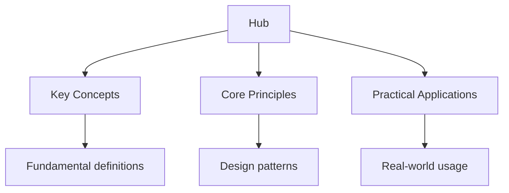

## Welcome to Wyatt's Notes

Wyatt's Notes is a network of 46 interconnected study sites, each dedicated to a specific subject or domain. Every site offers topic notes, practice questions, flashcards, and diagnostic quizzes. The sites are cross-linked so you can move between related topics seamlessly, and the entire network is free to use.

This hub page is your starting point. It lists every site in the network, organised by category, with brief descriptions of what each site covers and links to its hub page.

## How to Navigate the Network

Every site in the network follows the same structure. Each has a hub page (like this one) that maps all resources on that site. From the hub, you can access topic notes, practice questions, flashcards, and diagnostic quizzes. The sites are cross-linked: when a topic on one site relates to content on another site, you will find a link to it.

### Study Approach

- **Start with the hub page** of the site most relevant to your goal
- **Take a diagnostic quiz** to identify your strengths and weaknesses
- **Work through topic notes** for areas where you need improvement
- **Use flashcards** for daily active recall
- **Complete practice questions** to test your understanding
- **Cross-reference** with related sites when topics overlap

---

## Programming Languages

Deep-dive study guides for individual programming languages, from beginner fundamentals to advanced topics.

- **[Python](https://python.wyattau.com)** -- the versatile language for data science, web development, and automation
- **[Java](https://java.wyattau.com)** -- the enterprise language for Android, backend systems, and large-scale applications
- **[C++](https://cpp.wyattau.com)** -- the performance language for systems programming, games, and embedded software
- **[Rust](https://rust.wyattau.com)** -- the memory-safe language for systems programming and performance-critical applications
- **[Go](https://go.wyattau.com)** -- the simple language for microservices, cloud infrastructure, and DevOps
- **[TypeScript](https://typescript.wyattau.com)** -- JavaScript with types for large-scale web development
- **[Kotlin](https://kotlin.wyattau.com)** -- the modern JVM language for Android and multiplatform development
- **[Swift](https://swift.wyattau.com)** -- Apple's language for iOS, macOS, and beyond
- **[Dart](https://dart.wyattau.com)** -- the language behind Flutter for cross-platform mobile development
- **[Ruby](https://ruby.wyattau.com)** -- the elegant language for web development with Rails
- **[Haskell](https://haskell.wyattau.com)** -- the purely functional language for academic research and correctness
- **[Elixir](https://elixir.wyattau.com)** -- the concurrent language for distributed systems and real-time applications
- **[Languages](https://languages.wyattau.com)** -- comparison guide to help you choose the right language

---

## Computer Science and Technology

Foundational CS knowledge, infrastructure, and the tools that power modern technology.

- **[Computer Science](https://computer-science.wyattau.com)** -- algorithms, data structures, theory of computation, and CS fundamentals
- **[Mathematics](https://mathematics.wyattau.com)** -- discrete math, linear algebra, calculus, and proof-based mathematics
- **[Databases](https://databases.wyattau.com)** -- SQL, NoSQL, database design, and data modelling
- **[Networking](https://networking.wyattau.com)** -- network protocols, architecture, and infrastructure
- **[Linux](https://linux.wyattau.com)** -- the operating system, command line, system administration, and scripting
- **[Security](https://security.wyattau.com)** -- cybersecurity concepts, threat analysis, and defensive practices
- **[Tools](https://tools.wyattau.com)** -- development tools, version control, IDEs, and productivity software
- **[TrueNAS](https://truenas.wyattau.com)** -- the open-source storage platform for home and enterprise
- **[Tuning](https://tuning.wyattau.com)** -- performance tuning, optimisation, and system profiling
- **[Machine Learning](https://machine-learning.wyattau.com)** -- ML concepts, algorithms, and practical applications
- **[Programming](https://programming.wyattau.com)** -- programming concepts that transcend specific languages
- **[Physics](https://physics.wyattau.com)** -- classical mechanics, electromagnetism, quantum physics, and thermodynamics
- **[Chemistry](https://chemistry.wyattau.com)** -- general chemistry, organic chemistry, and chemical principles

---

## Academic Study Guides

Comprehensive study resources for school and university-level examinations.

### Secondary Education

- **[SAT](https://sat.wyattau.com)** -- the US college admissions test: math, reading, and writing
- **[GCSE](https://gcse.wyattau.com)** -- UK General Certificate of Secondary Education
- **[A-Level](https://alevel.wyattau.com)** -- UK Advanced Level examinations
- **[IB](https://ib.wyattau.com)** -- the International Baccalaureate diploma programme
- **[AP](https://ap.wyattau.com)** -- US Advanced Placement courses and exams
- **[Leaving Cert](https://leaving-cert.wyattau.com)** -- the Irish state examinations
- **[HSC](https://hsc.wyattau.com)** -- the Higher School Certificate (New South Wales, Australia)
- **[Highers](https://highers.wyattau.com)** -- Scottish Higher qualifications
- **[CBSE](https://cbse.wyattau.com)** -- the Central Board of Secondary Education (India)
- **[DSE](https://dse.wyattau.com)** -- the Hong Kong Diploma of Secondary Education
- **[Gaokao](https://gaokao.wyattau.com)** -- the Chinese national college entrance examination

### University Admissions and Planning

- **[Admissions](https://admissions.wyattau.com)** -- university admissions, personal statements, and application strategy
- **[Licensing](https://licensing.wyattau.com)** -- professional licensing and regulatory requirements

---

## Driving Tests

Study guides for driving theory tests across different regions.

- **[Driving UK](https://driving-uk.wyattau.com)** -- UK driving theory test: Highway Code, road signs, hazard perception
- **[Driving US](https://driving-us.wyattau.com)** -- US DMV written test: road signs, traffic laws, state-specific rules
- **[Driving EU](https://driving-eu.wyattau.com)** -- EU driving test: European regulations, road signs, cross-border driving

---

## Language and Professional Certifications

Certification preparation for language proficiency and professional IT qualifications.

- **[Language Tests](https://language-tests.wyattau.com)** -- IELTS, TOEFL, Duolingo, Cambridge exams, and language proficiency
- **[Professional Certs](https://professional-certs.wyattau.com)** -- AWS, CompTIA, Cisco, Microsoft, and IT certifications
- **[Civics Tests](https://civics-tests.wyattau.com)** -- US civics test for naturalisation: government, history, and civic principles

---

## All Sites at a Glance

| # | Site | Domain | Focus |
| --- | ------ | -------- | ------- |
| 1 | Main | wyattsnotes.wyattau.com | Network hub and navigation |
| 2 | Python | python.wyattau.com | Python programming |
| 3 | Java | java.wyattau.com | Java programming |
| 4 | C++ | cpp.wyattau.com | C++ programming |
| 5 | Rust | rust.wyattau.com | Rust programming |
| 6 | Go | go.wyattau.com | Go programming |
| 7 | TypeScript | typescript.wyattau.com | TypeScript programming |
| 8 | Kotlin | kotlin.wyattau.com | Kotlin programming |
| 9 | Swift | swift.wyattau.com | Swift programming |
| 10 | Dart | dart.wyattau.com | Dart programming |
| 11 | Ruby | ruby.wyattau.com | Ruby programming |
| 12 | Haskell | haskell.wyattau.com | Haskell programming |
| 13 | Elixir | elixir.wyattau.com | Elixir programming |
| 14 | Languages | languages.wyattau.com | Language comparison guide |
| 15 | Computer Science | computer-science.wyattau.com | CS fundamentals |
| 16 | Mathematics | mathematics.wyattau.com | Mathematics |
| 17 | Databases | databases.wyattau.com | Database systems |
| 18 | Networking | networking.wyattau.com | Network infrastructure |
| 19 | Linux | linux.wyattau.com | Linux administration |
| 20 | Security | security.wyattau.com | Cybersecurity |
| 21 | Tools | tools.wyattau.com | Development tools |
| 22 | TrueNAS | truenas.wyattau.com | TrueNAS storage |
| 23 | Tuning | tuning.wyattau.com | Performance tuning |
| 24 | Machine Learning | machine-learning.wyattau.com | ML and AI |
| 25 | Programming | programming.wyattau.com | Programming concepts |
| 26 | Physics | physics.wyattau.com | Physics |
| 27 | Chemistry | chemistry.wyattau.com | Chemistry |
| 28 | SAT | sat.wyattau.com | US college admissions |
| 29 | GCSE | gcse.wyattau.com | UK secondary exams |
| 30 | A-Level | alevel.wyattau.com | UK advanced exams |
| 31 | IB | ib.wyattau.com | International Baccalaureate |
| 32 | AP | ap.wyattau.com | US Advanced Placement |
| 33 | Leaving Cert | leaving-cert.wyattau.com | Irish state exams |
| 34 | HSC | hsc.wyattau.com | Australian HSC |
| 35 | Highers | highers.wyattau.com | Scottish Highers |
| 36 | CBSE | cbse.wyattau.com | Indian CBSE exams |
| 37 | DSE | dse.wyattau.com | Hong Kong DSE |
| 38 | Gaokao | gaokao.wyattau.com | Chinese entrance exam |
| 39 | Admissions | admissions.wyattau.com | University admissions |
| 40 | Licensing | licensing.wyattau.com | Professional licensing |
| 41 | Driving UK | driving-uk.wyattau.com | UK driving theory test |
| 42 | Driving US | driving-us.wyattau.com | US DMV test |
| 43 | Driving EU | driving-eu.wyattau.com | EU driving test |
| 44 | Language Tests | language-tests.wyattau.com | IELTS, TOEFL, and more |
| 45 | Professional Certs | professional-certs.wyattau.com | IT certifications |
| 46 | Civics Tests | civics-tests.wyattau.com | US citizenship test |

---

## Frequently Asked Questions

### What is Wyatt's Notes?

Wyatt's Notes is a network of 46 interconnected study sites, each covering a specific subject. Every site offers topic notes, practice questions, flashcards, and diagnostic quizzes. The sites are free to use and cross-linked so you can move between related topics.

### How do I find the right site for my goal?

Use the categories above to find the domain that matches your goal. Each site has a hub page that maps all its resources. If you are unsure, start with the main hub of the most relevant category and follow the links.

### Are the sites really free?

Yes. All content on every site in the network is free to access. There are no paywalls, subscriptions, or premium tiers.

### How are the sites connected?

The sites are cross-linked: when a topic on one site relates to content on another site, you will find a link. For example, the SAT hub links to the Mathematics site for deeper mathematical content, and the Python hub links to the Computer Science site for algorithmic concepts.

### Can I suggest a new site or topic?

Yes. Feedback and suggestions are welcome. Visit [wyattau.com](https://wyattau.com) to get in touch.

### How often is the content updated?

The content is reviewed and updated regularly. Each site's hub page includes a "last updated" date so you can see when it was last revised.

### Who writes the content?

All content is written by Wyatt. The site is a personal project dedicated to making high-quality study resources freely available.

---

*Last updated: 24 July 2026*

*Written by Wyatt. For questions or feedback, visit [wyattau.com](https://wyattau.com).*
