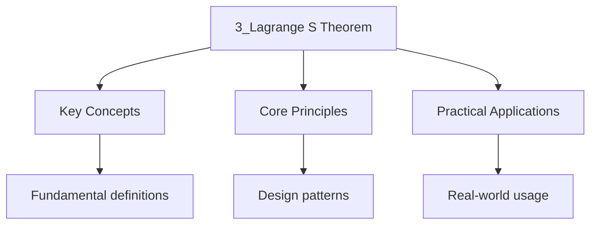

---

date: 2026-07-23T21:57:32+01:00
title: "Lagrange's Theorem | Mathematics"
tags:
  - Mathematics
  - University
description: "\"itemListElement\": [{\"name\": \"Home\", \"url\": \"https://wyattau.com\"}, {\"name\": \"mathematics\", \"url\": \"https://mathematics.wyattau.com\"}, {\"name\": \"1 Abstract"
---

<!-- Breadcrumb Schema for SEO -->

### 3.1 Cosets

Let $H \leq G$. For $a \in G$The **left coset** of $H$ containing $a$ is

$$aH = \{ah : h \in H\}$$

The **right coset** is $Ha = \{ha : h \in H\}$.

**Proposition 3.1.** The cosets of $H$ in $G$ partition $G$.

_Proof._ Define $a \sim b$ if $a^{-1}b \in H$. This is an equivalence relation: reflexive
($a^{-1}a = e \in H$), symmetric ($a^{-1}b \in H \Rightarrow b^{-1}a = (a^{-1}b)^{-1} \in H$),
Transitive ($a^{-1}b, b^{-1}c \in H \Rightarrow a^{-1}c = (a^{-1}b)(b^{-1}c) \in H$). The
equivalence class of $a$ is exactly $aH$. $\blacksquare$

**Proposition 3.2.** $|aH| = |H|$ for all $a \in G$.

_Proof._ The map $\phi : H \to aH$ given by $\phi(h) = ah$ is a bijection. $\blacksquare$

### 3.2 Lagrange's Theorem

**Theorem 3.3 (Lagrange's Theorem).** If $H$ is a subgroup of a finite group $G$ Then $|H|$ divides
$|G|$.

_Proof._ The cosets of $H$ partition $G$ into disjoint sets, each of size $|H|$. If there are $k$
cosets, Then $|G| = k \cdot |H|$ So $|H|$ divides $|G|$. $\blacksquare$

The number of cosets is called the **index** of $H$ in $G$Denoted $[G : H]$.

**Corollary 3.4.** The order of any element of $G$ divides $|G|$.

_Proof._ $|g| = |\langle g \rangle|$ And $\langle g \rangle \leq G$ So $|g|$ divides $|G|$ by
Lagrange. $\blacksquare$

**Corollary 3.5 (Fermat's Little Theorem).** If $p$ is prime and $\gcd(a, p) = 1$ Then
$a^{p-1} \equiv 1 \pmod{p}$.

_Proof._ $\mathbb{Z}/p\mathbb{Z}$ has $p$ elements. The multiplicative group
$(\mathbb{Z}/p\mathbb{Z})^*$ has order $p - 1$. The order of $[a]$ divides $p - 1$ So
$[a]^{p-1} = [1]$. $\blacksquare$

**Corollary 3.6 (Euler's Theorem).** If $\gcd(a, n) = 1$ Then $a^{\phi(n)} \equiv 1 \pmod{n}$Where
$\phi$ Is Euler's totient function.

### 3.3 Worked Example

**Problem.** Show that every group of prime order $p$ is cyclic.

_Solution._ Let $G$ be a group of order $p$ and $g \in G$ with $g \neq e$. By Corollary 3.4, $|g|$
divides $p$. Since $g \neq e$, $|g| \neq 1$. Since $p$ is prime, $|g| = p$. Thus
$\langle g \rangle = G$ And $G$ is cyclic. $\blacksquare$

### 3.4 Worked Examples: Computing Cosets

**Problem.** Let $H = \langle (1\ 2\ 3) \rangle \leq S_3$. Find all left cosets of $H$ in $S_3$.

Solution

_Solution._ $H = \{e, (1\ 2\ 3), (1\ 3\ 2)\}$ has order $3$ And $|S_3| = 6$ So $[S_3 : H] = 2$. Pick
any $\sigma \notin H$E.g., $\sigma = (1\ 2)$. Then:

$$S_3 = H \cup (1\ 2)H = \{e, (1\ 2\ 3), (1\ 3\ 2)\} \cup \{(1\ 2), (1\ 2)(1\ 2\ 3), (1\ 2)(1\ 3\ 2)\}$$

Computing: $(1\ 2)(1\ 2\ 3) = (2\ 3)$ and $(1\ 2)(1\ 3\ 2) = (1\ 3)$. So:

$$S_3 = \{e, (1\ 2\ 3), (1\ 3\ 2)\} \cup \{(1\ 2), (2\ 3), (1\ 3)\}$$

Since $[S_3 : H] = 2$, $H$ is normal (see Corollary 3.7). $\blacksquare$

**Problem.** Let $H = \langle 4 \rangle \leq \mathbb{Z}/12\mathbb{Z}$. Find all cosets of $H$.

Solution

_Solution._ $H = \langle 4 \rangle = \{0, 4, 8\}$ has order $3$ And $|\mathbb{Z}/12\mathbb{Z}| = 12$
So $[\mathbb{Z}/12\mathbb{Z} : H] = 4$. The cosets are:

$$0 + H = \{0, 4, 8\}, \quad 1 + H = \{1, 5, 9\}, \quad 2 + H = \{2, 6, 10\}, \quad 3 + H = \{3, 7, 11\}$$

Since $\mathbb{Z}/12\mathbb{Z}$ is abelian, $H$ is normal, and
$\mathbb{Z}/12\mathbb{Z}\,/\,H \cong \mathbb{Z}/4\mathbb{Z}$. $\blacksquare$

### 3.5 Further Corollaries of Lagrange's Theorem

**Corollary 3.7.** If $[G : H] = 2$ Then $H \trianglelefteq G$.

_Proof._ There are exactly two left cosets $H$ and $aH$ And exactly two right cosets $H$ and $Ha$.
Since the cosets partition $G$We have $aH = G \setminus H = Ha$. Thus $gH = Hg$ for all $g \in G$ So
$H$ is normal. $\blacksquare$

**Corollary 3.8 (Product Formula).** If $H, K \leq G$ are finite subgroups, then

$$|HK| = \frac{|H||K|}{|H \cap K|}$$

_Proof._ The map $H \times K \to HK$ given by $(h, k) \mapsto hk$ is surjective. For any
$x = hk \in HK$ The fiber is $\{(hc^{-1}, ck) : c \in H \cap K\}$Which has size $|H \cap K|$. Thus
$|H||K| = |HK| \cdot |H \cap K|$. $\blacksquare$

:::caution
subgroup when $H$ or $K$ is normal. In that case, $|HK| = |H||K|/|H \cap K|$ also divides $|G|$ by
Lagrange.
:::
### 3.6 Common Pitfalls

- **Confusing index with order.** The index $[G:H]$ is the number of cosets, not the order of $H$.
- **Assuming Lagrange's converse.** If $d \mid |G|$, there need not exist a subgroup of order $d$. The converse holds for cyclic groups but fails for $A_4$ (order 12, no subgroup of order 6).
- **Forgetting that cosets partition $G$.** Each element of $G$ belongs to exactly one left coset and exactly one right coset of $H$.
- **Misapplying Fermat's Little Theorem.** It requires $p$ prime and $\gcd(a,p) = 1$; omitting the coprimality condition gives incorrect results.

### 3.7 Intuition: Why Does Lagrange's Theorem Work?

Lagrange's theorem says that the order of any subgroup divides the order of the group. The proof
is beautifully simple: the left cosets of $H$ partition $G$ into disjoint sets, each of size $|H|$.
If there are $k$ cosets, then $|G| = k \cdot |H|$, so $|H|$ divides $|G|$.

Think of it as tiling: if you have a floor of area $|G|$ and tiles of area $|H|$, you need exactly
$k = |G|/|H|$ tiles, and this must be a whole number. The cosets are the tiles.

**Why the converse fails.** Lagrange's theorem says the size of any subgroup must divide $|G|$.
But the converse --- that every divisor of $|G|$ gives rise to a subgroup --- is false. The
obstruction is that the "tiling" might not be achievable by a subgroup. For $A_4$ (order 12), there
is no subgroup of order 6, even though $6 \mid 12$. The reason is that a subgroup of order 6 would
have index 2, hence would be normal. But $A_4$ has no normal subgroup of order 6 (its only proper
normal subgroup is the Klein four-group $V_4$ of order 4).

**Connection to number theory.** Lagrange's theorem applied to $(\mathbb{Z}/p\mathbb{Z})^*$ gives
Fermat's Little Theorem: the order of any element divides $p - 1$, so $a^{p-1} \equiv 1 \pmod{p}$.
This is the foundation of RSA encryption and primality testing.

### 3.8 Worked Example: All Subgroups of $D_4$

**Problem.** List all subgroups of $D_4$ (the dihedral group of the square, order 8) and verify
Lagrange's theorem for each.

Solution

$D_4 = \{e, r, r^2, r^3, s, rs, r^2s, r^3s\}$ where $r^4 = s^2 = e$ and $srs = r^{-1}$.

By Lagrange's theorem, the possible subgroup orders are $1, 2, 4, 8$.

**Order 1:** $\{e\}$ (trivial subgroup).

**Order 2:** Subgroups generated by elements of order 2. The elements of order 2 are $r^2, s, rs,
r^2s, r^3s$. This gives subgroups: $\langle r^2 \rangle = \{e, r^2\}$, $\langle s \rangle = \{e, s\}$,
$\langle rs \rangle = \{e, rs\}$, $\langle r^2s \rangle = \{e, r^2s\}$, $\langle r^3s \rangle = \{e,
r^3s\}$. That is 5 subgroups of order 2.

**Order 4:** Subgroups of order 4 must contain the identity and three other elements. The cyclic
subgroup $\langle r \rangle = \{e, r, r^2, r^3\} \cong \mathbb{Z}/4\mathbb{Z}$. The Klein four-group
$\{e, r^2, s, r^2s\} \cong V_4$. The Klein four-group $\{e, r^2, rs, r^3s\} \cong V_4$. That is 3
subgroups of order 4.

**Order 8:** $D_4$ itself.

**Verification:** $1 + 5 + 3 + 1 = 10$ subgroups total. Each subgroup order divides 8: $1 \mid 8$,
$2 \mid 8$, $4 \mid 8$, $8 \mid 8$. $\checkmark$

**Note:** $D_4$ has 5 elements of order 2, 2 elements of order 4, and 1 element of order 1. The
center is $Z(D_4) = \{e, r^2\}$, which is one of the order-2 subgroups. $\blacksquare$

### 3.9 Key Relationships Table

| Statement | Hypothesis | Conclusion |
| --- | --- | --- |
| Lagrange's Theorem | $H \leq G$, $G$ finite | $\|H\|$ divides $\|G\|$ |
| Corollary 3.4 | $g \in G$ | $\|g\|$ divides $\|G\|$ |
| Fermat's Little Theorem | $p$ prime, $\gcd(a,p)=1$ | $a^{p-1} \equiv 1 \pmod{p}$ |
| Euler's Theorem | $\gcd(a,n)=1$ | $a^{\phi(n)} \equiv 1 \pmod{n}$ |
| Index 2 implies normal | $[G:H] = 2$ | $H \trianglelefteq G$ |
| Product Formula | $H, K \leq G$ finite | $\|HK\| = \|H\|\|K\|/\|H \cap K\|$ |

### 3.8 Applications

- **Number theory:** Fermat's Little Theorem and Euler's Theorem underpin RSA encryption and primality testing.
- **Coding theory:** The structure of cosets of subgroups in finite groups is used in linear codes and syndrome decoding.
- **Computational group theory:** Lagrange's Theorem bounds the search space when testing subgroup membership; the index determines the number of coset representatives needed.

## Cross-References

- [Group Actions](6_group-actions) -- The orbit-stabilizer theorem generalises Lagrange's theorem to group actions, linking subgroup indices to orbit sizes.
- [The Sylow Theorems](7_the-sylow-theorems) -- Sylow's theorems refine Lagrange's theorem by guaranteeing subgroups of prime-power order and constraining their count.
- [Classification of Groups of Small Order](16_classification-of-groups-of-small-order) -- Lagrange's theorem limits the possible subgroup structure used in classifying small-order groups.
- [Common Pitfalls](17_common-pitfalls) -- The common pitfalls section warns against assuming the converse of Lagrange's theorem and confusing index with order.

- [Classical Mechanics](https://physics.wyattau.com/docs/classical-mechanics)
- [Electromagnetism](https://physics.wyattau.com/docs/electromagnetism)
