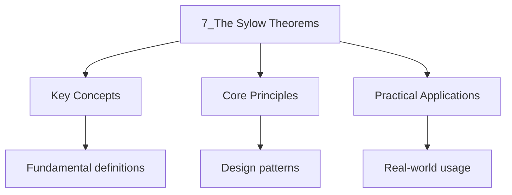

---

date: 2026-07-23T21:57:32+01:00
title: "The Sylow Theorems | Mathematics"
tags:
  - Mathematics
  - University
description: "Let be a finite group of order where is prime and . A **Sylow Comprehensive educational content coverage with definitions and practice problems."
---

<!-- Breadcrumb Schema for SEO -->

### 7.1 Statement

Let $G$ be a finite group of order $|G| = p^n m$ where $p$ is prime and $\gcd(p, m) = 1$. A **Sylow
$p$-subgroup** of $G$ is a subgroup of order $p^n$.

**Theorem 7.1 (Sylow"s First Theorem).** $G$ has a Sylow $p$-subgroup.

**Theorem 7.2 (Sylow's Second Theorem).** Any two Sylow $p$-subgroups are conjugate.

**Theorem 7.3 (Sylow's Third Theorem).** The number $n_p$ of Sylow $p$-subgroups satisfies:

1. $n_p \equiv 1 \pmod{p}$.
2. $n_p$ divides $m$.

### 7.2 Proof of Sylow's First Theorem

_Proof._ Let $|G| = p^n m$ with $\gcd(p, m) = 1$. Let $X$ be the set of all subsets of $G$ of size
$p^n$. Then $|X| = \binom{p^n m}{p^n}$. Note that $p$ does not divide $\binom{p^n m}{p^n}$ (this
follows from Lucas's theorem or examining the $p$-adic valuation). $G$ acts on $X$ by left
multiplication. Since $|X|$ is not divisible by $p$Some orbit $\mathrm{Orb}(S)$ has size not
divisible by $p$. By the orbit-stabilizer theorem, $|\mathrm{Stab}(S)| = |G|/|\mathrm{Orb}(S)|$ is
divisible by $p^n$. For $s \in S$Left multiplication by $s$ is a bijection $S \to sS$ And
$sS \subseteq S$ since $\mathrm{Stab}(S) \cdot S = S$. Since $|sS| = |S| = p^n$We get $sS = S$ So
$s \in \mathrm{Stab}(S)$. Thus $S \subseteq \mathrm{Stab}(S)$Giving $p^n \leq |\mathrm{Stab}(S)|$.
Since $|\mathrm{Stab}(S)|$ divides $p^n m$ and is divisible by $p^n$We have
$|\mathrm{Stab}(S)| = p^n$ And $\mathrm{Stab}(S)$ is a Sylow $p$-subgroup. $\blacksquare$

### 7.3 Applications

**Proposition 7.4.** Every group of order $pq$ (where $p \lt q$ are primes with $p \nmid (q - 1)$)
Is cyclic.

_Proof._ By Sylow's third theorem, $n_q \equiv 1 \pmod{q}$ and $n_q$ divides $p$. Since $p \lt q$
$n_q = 1$ So the Sylow $q$-subgroup $Q$ is normal. Similarly, $n_p \equiv 1 \pmod{p}$ and $n_p$
Divides $q$. Since $p \nmid (q-1)$, $n_p \neq q$ So $n_p = 1$ And the Sylow $p$-subgroup $P$ Is
normal. Since $P \cap Q = \{e\}$ (their orders are coprime) and $|PQ| = pq = |G|$ We have
$G \cong P \times Q \cong \mathbb{Z}/p\mathbb{Z} \times \mathbb{Z}/q\mathbb{Z} \cong \mathbb{Z}/pq\mathbb{Z}$.
$\blacksquare$

**Proposition 7.5.** Every group of order $p^2$ (where $p$ is prime) is abelian.

_Proof._ Let $|G| = p^2$. If $G$ is cyclic, it is abelian. Otherwise, every non-identity element has
Order $p$ (by Lagrange). Let $g \neq e$ and consider $H = \langle g \rangle$ with $|H| = p$. Then
$[G : H] = p$ So $H \trianglelefteq G$ (the smallest prime dividing $|G|$). Pick $x \notin H$. Then
$G = H \cup xH$ And since $x \notin H$ and $\langle x \rangle$ has order $p$ We have
$G = H \times \langle x \rangle$Which is abelian. $\blacksquare$

### 7.4 Proof of Sylow's Second Theorem

_Proof._ Let $P$ be a Sylow $p$-subgroup of $G$ And let $Q$ be any $p$-subgroup of $G$. $Q$ acts on
the set of left cosets $G/P$ by left multiplication: $q \cdot (gP) = qgP$.

Since $|G/P| = |G|/|P| = m$ is not divisible by $p$ And orbits under the $Q$-action have sizes
Dividing $|Q|$ (hence powers of $p$), the number of fixed points satisfies:

$$|\mathrm{Fix}(Q)| \equiv |G/P| \equiv m \not\equiv 0 \pmod{p}$$

So there exists $gP \in G/P$ fixed by $Q$Meaning $Q \cdot gP = gP$I.e., $QgP = gP$ So
$g^{-1}Qg \subseteq P$.

Taking $Q$ to be a Sylow $p$-subgroup: $|g^{-1}Qg| = |Q| = p^n = |P|$ So $g^{-1}Qg = P$ Proving that
$P$ and $Q$ are conjugate. $\blacksquare$

### 7.5 Proof of Sylow's Third Theorem

_Proof._ Let $P$ be a Sylow $p$-subgroup. $P$ acts on the set $\mathrm{Syl_p}(G)$ of all Sylow
$p$-subgroups by conjugation. Write $\mathrm{Syl_p}(G) = \{P = P_1, P_2, \ldots, P_{n_p}\}$.

**Step 1: $n_p \equiv 1 \pmod{p}$.** A Sylow $p$-subgroup $P_i$ is a fixed point of the $P$-action
Iff $P \subseteq N_G(P_i)$. But then $PP_i \leq N_G(P_i)$ And $|PP_i| = p^n \cdot p^n / |P \cap P_i|$
Which is a power of $p$. Since $p^n$ is the maximal power of $p$ dividing $|G|$ and
$PP_i \subseteq G$ We get $|PP_i| = p^n$Hence $P = PP_i = P_i$ (since $P \subseteq PP_i$).

Thus $P$ is the **unique** fixed point. All other orbits have size $[P : \mathrm{Stab_P}(P_i)]$ A
power of $p$ greater than $1$. By the fixed-point congruence for $p$-group actions:
$n_p = 1 + \sum (\mathrm{sizes\ of\ remaining\ orbits}) \equiv 1 \pmod{p}$. **Step 2: $n_p$ divides
$m$.** The group $G$ acts transitively on $\mathrm{Syl_p}(G)$ by conjugation (by Sylow's second
theorem). Hence $n_p = |\mathrm{Syl_p}(G)| = [G : N_G(P)]$. Since $P \leq N_G(P)$, $|N_G(P)|$ is
divisible by $p^n$. Therefore $n_p = |G|/|N_G(P)|$ divides $|G|/p^n = m$. $\blacksquare$

### 7.6 Worked Examples: Finding Sylow Subgroups

**Problem.** Find all Sylow $2$-subgroups and Sylow $3$-subgroups of $S_4$.

Solution

_Solution._ $|S_4| = 24 = 2^3 \cdot 3$.

**Sylow $3$-subgroups** (order $3$). $n_3 \equiv 1 \pmod{3}$ and $n_3$ divides $8$ So
$n_3 \in \{1, 4\}$. The Sylow $3$-subgroups are generated by $3$-cycles. There are
$\binom{4}{3} \cdot 2 = 8$ elements of order $3$ And each subgroup of order $3$ Contains $2$ such
elements. So $n_3 = 8/2 = 4$.

The four Sylow $3$-subgroups are: $\langle (1\ 2\ 3) \rangle$, $\langle (1\ 2\ 4) \rangle$,
$\langle (1\ 3\ 4) \rangle$, $\langle (2\ 3\ 4) \rangle$.

**Sylow $2$-subgroups** (order $8$). $n_2 \equiv 1 \pmod{2}$ and $n_2$ divides $3$ So
$n_2 \in \{1, 3\}$. A Sylow $2$-subgroup is isomorphic to $D_4$ (the dihedral group of order $8$).
Consider
$P = \{e, (1\ 2\ 3\ 4), (1\ 3)(2\ 4), (1\ 4\ 3\ 2), (1\ 2)(3\ 4), (1\ 4)(2\ 3), (1\ 3), (2\ 4)\}$.
This is the symmetry group of a square with vertices $1, 2, 3, 4$Isomorphic to $D_4$.

Since $n_2 \in \{1, 3\}$ and $P$ is not normal in $S_4$ (e.g., $(1\ 2)P(1\ 2) \neq P$), We have
$n_2 = 3$. $\blacksquare$

### 7.7 Further Applications

**Proposition 7.6.** Every group of order $15$ is cyclic.

_Proof._ $n_5 \equiv 1 \pmod{5}$ and $n_5$ divides $3$ So $n_5 = 1$. $n_3 \equiv 1 \pmod{3}$ and
$n_3$ divides $5$ So $n_3 = 1$. Both the Sylow $3$-subgroup $P$ and the Sylow $5$-subgroup $Q$ are
Normal, $P \cap Q = \{e\}$ And $PQ = G$. Hence
$G \cong P \times Q \cong \mathbb{Z}/3\mathbb{Z} \times \mathbb{Z}/5\mathbb{Z}
\cong \mathbb{Z}/15\mathbb{Z}$.
$\blacksquare$

**Proposition 7.7.** If $G$ is a simple group with $|G| \leq 60$ Then $|G|$ is prime. The smallest
non-abelian simple group is $A_5$ of order $60$.

_Proof sketch._ If $G$ is simple and $|G| = p^n m$ with $\gcd(p, m) = 1$ and $m > 1$ Then $n_p = m$
(since $n_p \neq 1$ And $n_p$ divides $m$ with $n_p \equiv 1 \pmod{p}$). For many orders,
$n_p = 1$Forcing a normal Sylow subgroup and contradicting simplicity. $\blacksquare$

### 7.8 Common Mistakes

## Intuition

The Sylow theorems are the crown jewels of finite group theory. They guarantee the existence of subgroups of prime-power order (Sylow $p$-subgroups) and constrain how many there can be. Think of a group's order as having prime "layers" — the Sylow theorems say each layer contains a subgroup that fills it completely. The counting constraints $n_p \equiv 1 \pmod{p}$ and $n_p \mid m$ are surprisingly powerful: often $n_p$ is forced to be $1$, meaning the Sylow subgroup is unique and therefore normal. This lets you decompose a group as a product of its Sylow subgroups, reducing classification problems to studying groups of prime-power order.

### 7.8 Common Mistakes

**Mistake 1: Assuming Sylow $p$-subgroups are unique**
Sylow's first theorem guarantees existence but not uniqueness. The number $n_p$ of Sylow $p$-subgroups can be greater than $1$. Only when $n_p = 1$ is the Sylow $p$-subgroup unique and therefore normal. Always compute $n_p$ from the constraints $n_p \equiv 1 \pmod{p}$ and $n_p \mid m$ before concluding uniqueness.

**Mistake 2: Assuming a Sylow $p$-subgroup is automatically normal**
A Sylow $p$-subgroup is normal if and only if it is the unique Sylow $p$-subgroup ($n_p = 1$). Sylow's second theorem states that all Sylow $p$-subgroups are conjugate, so if $n_p > 1$, none of them are normal. For example, in $S_3$ with $|S_3| = 6 = 2 \cdot 3$, the Sylow $2$-subgroups are not normal.

**Mistake 3: Misapplying Sylow's third theorem constraints**
The conditions $n_p \equiv 1 \pmod{p}$ and $n_p \mid m$ are necessary but not sufficient to determine $n_p$ uniquely. For instance, if $|G| = 48 = 2^4 \cdot 3$, then $n_2$ divides $3$ and $n_2 \equiv 1 \pmod{2}$, giving $n_2 \in \{1, 3\}$. Both values satisfy the congruence condition, so further group-theoretic arguments are needed to pin down $n_p$.

:::caution
$p$-subgroups, But they are all conjugate. A common mistake is to assume $n_p = 1$ without checking
the Sylow Conditions. Always verify that $n_p \equiv 1 \pmod{p}$ and $n_p$ divides $m$.
:::

## Cross-References

- [Group Actions](6_group-actions) -- The proofs of Sylow's theorems rely heavily on group actions, orbits, and fixed-point counting.
- [Lagrange's Theorem](3_lagrange-s-theorem) -- Lagrange's theorem constrains the possible orders of subgroups, which Sylow's theorems refine for prime-power orders.
- [Classification of Groups of Small Order](16_classification-of-groups-of-small-order) -- Sylow's theorems are the main tool for determining which groups of a given order can exist.
- [Worked Examples](15_worked-examples) -- The worked examples apply Sylow counting arguments to classify groups of specific orders.
