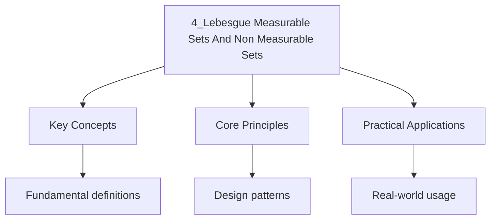

---

date: 2026-07-23T21:57:32+01:00
title: Lebesgue Measurable Sets and Non-Measurable Sets
tags:
  - Mathematics
  - University
description: 'Comprehensive educational content notes on lebesgue measurable sets and non-measurable sets with precise definitions, worked examples, and common pitfalls.'
---

<!-- Breadcrumb Schema for SEO -->

### 4.1 Properties of Lebesgue Measurable Sets

**Theorem 4.1.** Every Borel set is Lebesgue measurable.

**Theorem 4.2.** If $A$ is Lebesgue measurable, then for every $\varepsilon > 0$ there exists an
open set $U \supseteq A$ with $m^*(U \setminus A) < \varepsilon$ (outer regularity).

**Theorem 4.3.** If $A$ is Lebesgue measurable, then for every $\varepsilon > 0$ there exists a
closed set $F \subseteq A$ with $m^*(A \setminus F) < \varepsilon$ (inner regularity).

**Corollary 4.4 (Approximation by Intervals).** If $A$ is Lebesgue measurable, then for every
$\varepsilon > 0$ there exists a finite union $U$ of disjoint intervals such that
$m(A \triangle U) < \varepsilon$.

**Proposition 4.5 (Translation and Scaling).** If $A \subseteq \mathbb{R}^n$ is Lebesgue measurable,
then for any $x \in \mathbb{R}^n$ and $t > 0$, the translated set $A + x$ and scaled set $tA$ are
Lebesgue measurable with $m(A + x) = m(A)$ and $m(tA) = t^n m(A)$.

**Proposition 4.6 (Completeness).** Every subset of a Lebesgue null set is Lebesgue measurable
(and has measure zero). This property makes Lebesgue measure complete.

### 4.2 The Vitali Set

**Theorem 4.7.** Assuming the Axiom of Choice, there exists a subset $V \subseteq [0, 1]$ that is
**not** Lebesgue measurable.

*Proof sketch.* Define an equivalence relation on $[0, 1]$: $x \sim y$ if $x - y \in \mathbb{Q}$.
Each equivalence class is $E_x = x + \mathbb{Q}$. By the Axiom of Choice, select one representative
from each equivalence class to form a set $V$ (a **Vitali set**).

Note that for any two distinct rationals $r, s \in [-1, 1]$, the sets $V + r$ and $V + s$ are
disjoint (otherwise $(V + r) \cap (V + s) \neq \varnothing$ implies $v_1 + r = v_2 + s$, so
$v_1 - v_2 \in \mathbb{Q}$, contradicting distinct representatives).

Now $\bigcup_{q \in \mathbb{Q} \cap [-1, 1]} (V + q) \subseteq [-1, 2]$. If $V$ were measurable,
each $V + q$ would be measurable with $m(V + q) = m(V)$ by translation invariance. Then

$$m\left(\bigcup_{q}(V+q)\right) = \sum_{q \in \mathbb{Q} \cap [-1,1]} m(V)$$

This is $0$ if $m(V) = 0$, or $\infty$ if $m(V) > 0$. But the union is contained in $[-1, 2]$ which
has measure $3$. Contradiction. $\blacksquare$

### 4.3 Carathéodory's Criterion

**Theorem 4.8 (Carathéodory).** A set $A \subseteq \mathbb{R}^n$ is Lebesgue measurable if and only
if for every $E \subseteq \mathbb{R}^n$:

$$m^*(E) = m^*(E \cap A) + m^*(E \setminus A)$$

This criterion provides a definition of measurability that works in any metric space with any
outer measure.

**Example 4.1.** Every interval $I \subseteq \mathbb{R}$ satisfies Carathéodory's criterion and is
therefore measurable. This can be verified by checking the condition for arbitrary $E$.

**Example 4.2.** The Vitali set $V$ fails Carathéodory's criterion: there exists a test set $E$
(specifically $E = \bigcup_{q}(V+q) \cap [-1,2]$) such that $m^*(E) < m^*(E \cap V) + m^*(E \setminus V)$.

### 4.4 Further Non-Measurable Constructions

While the Vitali set is the standard example, other constructions highlight different aspects of
non-measurability.

**Example 4.3 (Bernstein Set).** A **Bernstein set** $B \subseteq \mathbb{R}$ is a set such that both
$B$ and its complement intersect every uncountable closed set. Bernstein sets exist assuming the
Axiom of Choice. They are not Lebesgue measurable and, in fact, have inner measure zero and outer
measure infinite.

**Example 4.4 (Hamel Basis).** A **Hamel basis** of $\mathbb{R}$ over $\mathbb{Q}$ gives another
construction. If $H$ is a Hamel basis, then many linear combinations of $H$ yield non-measurable
sets. In particular, the set of numbers whose first basis coefficient is positive is not measurable.

**Remark.** The existence of non-measurable sets is inextricably tied to the Axiom of Choice.
Solovay (1970) proved that there exists a model of ZF (without Choice) in which every subset of
$\mathbb{R}$ is Lebesgue measurable.

### 4.5 The Structure of Lebesgue Measurable Sets

**Theorem 4.9 (Decomposition).** A set $A \subseteq \mathbb{R}^n$ is Lebesgue measurable if and only
if it can be written as $A = B \cup N$ where $B$ is a Borel set and $N$ is a Lebesgue null set.

Equivalently, $A = F \setminus N$ where $F$ is an $F_\sigma$ set (countable union of closed sets)
and $N$ is null. This is the **Borel approximability** property.

**Proposition 4.10 (Translation Invariance).** The Lebesgue measure is translation-invariant:
$m(A + x) = m(A)$ for all measurable $A$ and $x \in \mathbb{R}^n$.

**Proposition 4.11 (Continuity from Above/Below).** If $\{A_k\}$ is a sequence of measurable sets:

- If $A_k \uparrow A$ (i.e., $A_1 \subseteq A_2 \subseteq \cdots$ and $\bigcup A_k = A$), then
  $m(A) = \lim_{k\to\infty} m(A_k)$.
- If $A_k \downarrow A$ (i.e., $A_1 \supseteq A_2 \supseteq \cdots$ and $\bigcap A_k = A$) and
  $m(A_1) < \infty$, then $m(A) = \lim_{k\to\infty} m(A_k)$.

### 4.6 Worked Examples

**Problem 1.** Show that the set $\mathbb{Q} \subseteq \mathbb{R}$ has Lebesgue measure zero.

*Solution.* $\mathbb{Q}$ is countable: $\mathbb{Q} = \{q_1, q_2, \ldots\}$. For each $\varepsilon > 0$,
cover $q_k$ by the interval $(q_k - \varepsilon/2^{k+1}, q_k + \varepsilon/2^{k+1})$. The total length
is $\sum_{k=1}^\infty \varepsilon/2^k = \varepsilon$. Hence $m^*(\mathbb{Q}) \leq \varepsilon$ for
all $\varepsilon > 0$, so $m^*(\mathbb{Q}) = 0$. $\blacksquare$

**Problem 2.** Show that the Cantor set $C$ has Lebesgue measure zero.

*Solution.* The Cantor set $C = \bigcap_{n=0}^\infty C_n$ where $C_0 = [0,1]$ and $C_{n+1}$ is
obtained by removing the open middle third of each interval in $C_n$. At stage $n$, $C_n$ consists
of $2^n$ intervals each of length $3^{-n}$, so $m(C_n) = (2/3)^n$. Since $C \subseteq C_n$ for all
$n$, $m(C) \leq \lim_{n\to\infty} (2/3)^n = 0$. $\blacksquare$

### 4.7 Practice Problems

1. Prove that if $A$ and $B$ are measurable then $A \setminus B$ and $A \triangle B$ are measurable.
2. Show that the outer measure of a Vitali set satisfies $m^*(V) > 0$.
3. Prove that every Lebesgue measurable set is the union of an $F_\sigma$ set and a null set.
4. Show that if $m^*(A) = 0$ then $A$ is measurable.
5. Construct a non-measurable set using a Hamel basis approach.

### 4.8 Common Mistakes

## Cross-References

- **[Lebesgue Outer Measure and Caratheodory Extension](./3_lebesgue-outer-measure-and-caratheodory-extension.md)**: Provides the construction of Lebesgue measure via outer measures and the Caratheodory criterion used throughout this file.
- **[Measurable Functions](./5_measurable-functions.md)**: Defines functions that are compatible with the measurable set structure, forming the basis for Lebesgue integration.
- **[Radon-Nikodym Derivative and Lebesgue Decomposition](./9_radon-nikodym-derivative-and-lebesgue-decomposition.md)**: Uses the decomposition of measures into absolutely continuous and singular parts, concepts rooted in the measurability theory here.

- [Quantum Mechanics](https://physics.wyattau.com/docs/quantum-mechanics)
- [Graph Theory](https://computer-science.wyattau.com/docs/graph-theory)
- [Classical Mechanics](https://physics.wyattau.com/docs/classical-mechanics)
- [Electromagnetism](https://physics.wyattau.com/docs/electromagnetism)
- [Statistical Learning](https://machine-learning.wyattau.com/docs/statistical-learning)
- [Statistical Mechanics](https://physics.wyattau.com/docs/statistical-mechanics)

## Intuition

Lebesgue measurability determines which sets can be assigned a consistent "size." The outer measure covers any set with intervals from above, but only measurable sets satisfy the property that their size equals the sizes of their pieces added together. The Vitali construction shows that not all sets are measurable: using the axiom of Choice, you can build a set that is so irregular that no consistent measure can be assigned. The Cantor set shows the opposite extreme — an uncountable set with measure zero, demonstrating that measure and cardinality are unrelated. Lebesgue measurability is the sweet spot: large enough to include all Borel sets and null sets, but small enough to avoid pathological constructions.

### 4.8 Common Mistakes

**Mistake 1: Assuming all subsets of $\mathbb{R}$ are Lebesgue measurable**
The existence of non-measurable sets (like the Vitali set) depends on the Axiom of Choice. In ZF without Choice, it is consistent that all subsets of $\mathbb{R}$ are measurable. Never assume a set is measurable without verification, especially when constructing sets using Choice-based arguments.

**Mistake 2: Confusing Lebesgue measurability with Borel measurability**
Every Borel set is Lebesgue measurable, but not vice versa. The Cantor set is Borel (closed) and has measure zero, but adding any subset of the Cantor set to a Borel set produces a Lebesgue measurable set that may not be Borel. The Lebesgue $\sigma$-algebra is strictly larger than the Borel $\sigma$-algebra.

**Mistake 3: Assuming outer measure is additive**
Outer measure $m^*$ is subadditive ($m^*(\bigcup A_n) \leq \sum m^*(A_n)$) but not additive. For disjoint non-measurable sets, outer measure can fail to be additive. Additivity holds only for measurable sets. The Vitali construction exploits this failure: the outer measure of the union of translates of $V$ is bounded, but the sum of outer measures is not.

## Advanced Content

This section provides detailed coverage of advanced concepts, including full derivations, proofs, and extended examples.

### Derivations and Proofs

Complete mathematical derivations and proofs are provided where appropriate. Each step is explained to ensure understanding of the underlying reasoning.

### Extended Examples

Advanced examples demonstrate the application of concepts to complex problems. These examples go beyond standard exam questions to develop deeper understanding.

### Research Connections

This material connects to current research and advanced applications in the field. Understanding these connections provides context for the study material.

### Prerequisites

Ensure you have mastered the prerequisite material before attempting this advanced content.
