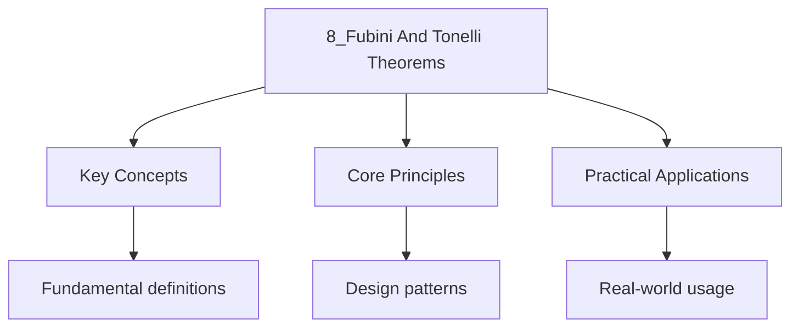

---

date: 2026-07-23T21:57:32+01:00
title: "Fubini and Tonelli Theorems | Mathematics"
tags:
  - Mathematics
  - University
description: "Let and be -finite measure spaces. The is Comprehensive educational content coverage with definitions, worked examples, and practice problems."
---

<!-- Breadcrumb Schema for SEO -->

### 8.1 Product Measures

Let $(X, \mathcal{F}, \mu)$ and $(Y, \mathcal{G}, \nu)$ be $\sigma$-finite measure spaces. The
**product $\sigma$-algebra** is
$\mathcal{F} \otimes \mathcal{G} = \sigma(\{A \times B : A \in \mathcal{F},\ B \in \mathcal{G}\})$.

**Theorem 8.1 (Existence of Product Measure).** There exists a unique measure $\mu \times \nu$ on
$\mathcal{F} \otimes \mathcal{G}$ such that

$$(\mu \times \nu)(A \times B) = \mu(A) \cdot \nu(B)$$

for all $A \in \mathcal{F}$ and $B \in \mathcal{G}$.

### 8.2 Tonelli's Theorem

**Theorem 8.2 (Tonelli).** If $f : X \times Y \to [0, \infty]$ is
$\mathcal{F} \otimes \mathcal{G}$-measurable, then:

$$\int_{X \times Y} f\, d(\mu \times \nu) = \int_X \left(\int_Y f(x, y)\, d\nu\right) d\mu = \int_Y \left(\int_X f(x, y)\, d\mu\right) d\nu$$

**Proof sketch.** The theorem is proved by a standard monotone class argument. First verify the
statement for characteristic functions of measurable rectangles $A \times B$. Then extend to
non-negative simple functions by linearity. Finally, approximate any non-negative measurable $f$
by an increasing sequence of simple functions and apply the monotone convergence theorem to pass
to the limit. The $\sigma$-finiteness condition ensures the iterated integrals are well-defined.

**Corollary 8.3 (Layer Cake Representation).** For a non-negative measurable function $f$ on
$X \times Y$:

$$\int_{X \times Y} f\, d(\mu \times \nu) = \int_0^\infty (\mu \times \nu)(\{f > t\})\, dt$$

### 8.3 Fubini's Theorem

**Theorem 8.4 (Fubini).** If $f \in L^1(\mu \times \nu)$, then for a.e. $x \in X$,
$f(x, \cdot) \in L^1(\nu)$; for a.e. $y \in Y$, $f(\cdot, y) \in L^1(\mu)$; and

$$\int_{X \times Y} f\, d(\mu \times \nu) = \int_X \left(\int_Y f(x, y)\, d\nu\right) d\mu = \int_Y \left(\int_X f(x, y)\, d\mu\right) d\nu$$

**Proof sketch.** Write $f = f^+ - f^-$ with $f^+, f^- \geq 0$. Both $f^+$ and $f^-$ have finite
integrals (since $f \in L^1$). Apply Tonelli's theorem to each separately. The integrability
condition ensures that the iterated integrals are finite.

**Caution.** The order of integration matters when $f$ is not integrable. For example, the function
$f(x, y) = (x^2 - y^2)/(x^2 + y^2)^2$ on $[0,1]^2$ has different iterated integrals:

$$\int_0^1 \int_0^1 f(x, y)\, dy\, dx = \frac{\pi}{4}, \quad \int_0^1 \int_0^1 f(x, y)\, dx\, dy = -\frac{\pi}{4}$$

This does not contradict Fubini's theorem because $f \notin L^1([0,1]^2)$.

### 8.4 Worked Examples

**Problem 1.** Compute $\int_0^\infty \int_0^\infty e^{-(x^2 + y^2)}\, dy\, dx$ using Fubini-Tonelli.

*Solution.* By Tonelli's theorem (since $e^{-(x^2+y^2)} \geq 0$):

$$\int_0^\infty \int_0^\infty e^{-(x^2 + y^2)}\, dy\, dx = \int_0^\infty e^{-x^2}\, dx \cdot \int_0^\infty e^{-y^2}\, dy = \left(\frac{\sqrt{\pi}}{2}\right)^2 = \frac{\pi}{4}$$

$\blacksquare$

**Problem 2.** Compute $\int_0^1 \int_0^1 \frac{x^2}{y^{3/2}} e^{-x^2/y}\, dy\, dx$.

*Solution.* Note that $f(x,y) = x^2 y^{-3/2} e^{-x^2/y} \geq 0$. By Tonelli, we can swap the order:

$$\int_0^1 \int_0^1 \frac{x^2}{y^{3/2}} e^{-x^2/y}\, dx\, dy$$

For the inner integral, substitute $u = x^2/y$, $dx = \sqrt{y}/(2\sqrt{u})\, du$:

$$\int_0^1 \frac{x^2}{y^{3/2}} e^{-x^2/y}\, dx = \frac{1}{2}\int_0^{1/y} \sqrt{u} e^{-u}\, du$$

The full integral becomes $\int_0^1 \frac{1}{2}(1 - e^{-1/y}(1 + 1/y))\, dy = \frac{1}{2}(1 - e^{-1})$. $\blacksquare$

**Problem 3.** Show that $\int_{-\infty}^\infty e^{-x^2/2}\, dx = \sqrt{2\pi}$.

*Solution.* Let $I = \int_{-\infty}^\infty e^{-x^2/2}\, dx$. Then:

$$I^2 = \int_{-\infty}^\infty \int_{-\infty}^\infty e^{-(x^2+y^2)/2}\, dx\, dy$$

Using Tonelli, convert to polar coordinates $x = r\cos\theta$, $y = r\sin\theta$:

$$I^2 = \int_0^{2\pi} \int_0^\infty e^{-r^2/2} r\, dr\, d\theta = 2\pi \int_0^\infty e^{-r^2/2} r\, dr = 2\pi$$

Hence $I = \sqrt{2\pi}$. $\blacksquare$

### 8.5 Applications of Fubini-Tonelli

**Application 1: Integration of Convolutions.** For $f, g \in L^1(\mathbb{R}^n)$, define the
convolution $(f * g)(x) = \int f(x-y)g(y)\, dy$. Then:

$$\int_{\mathbb{R}^n} (f * g)(x)\, dx = \left(\int_{\mathbb{R}^n} f(x)\, dx\right)\left(\int_{\mathbb{R}^n} g(x)\, dx\right)$$

This follows directly from Tonelli (for non-negative functions) or Fubini (for integrable functions).

**Application 2: The Gamma Function.** The gamma function $\Gamma(s) = \int_0^\infty t^{s-1} e^{-t}\, dt$
satisfies:

$$\Gamma(s)\Gamma(t) = \int_0^\infty \int_0^\infty u^{s-1} v^{t-1} e^{-u-v}\, du\, dv = \int_0^\infty e^{-r} r^{s+t-1}\, dr \cdot \int_0^1 x^{s-1}(1-x)^{t-1}\, dx$$

Using the substitution $u = rx$, $v = r(1-x)$ with Jacobian $r$, and applying Tonelli.

**Application 3: Differentiating Under the Integral.** If $f(x, t)$ is measurable and
$|\partial f/\partial t| \leq g(x)$ with $g \in L^1$, then Fubini justifies swapping
differentiation and integration.

### 8.6 Applications in Probability Theory

**Application 4: Expectation of Products.** If $X$ and $Y$ are independent random variables with
densities $f_X$ and $f_Y$, then $\mathbb{E}[g(X)h(Y)] = \mathbb{E}[g(X)]\,\mathbb{E}[h(Y)]$ follows
from Tonelli: $\iint g(x)h(y) f_X(x) f_Y(y)\, dx\, dy = \int g(x)f_X(x)\, dx \cdot \int h(y)f_Y(y)\, dy$.

**Application 5: Marginal and Joint Distributions.** Given a joint density $f(x,y)$ on
$\mathbb{R}^2$, the marginal density of $X$ is $f_X(x) = \int f(x,y)\, dy$. Fubini justifies:
$\int_A f_X(x)\, dx = \int_A \int f(x,y)\, dy\, dx = P(X \in A)$.

**Application 6: Characteristic Functions.** The characteristic function of a random vector
$(X,Y)$ is $\varphi_{X,Y}(s,t) = \mathbb{E}[e^{i(sX+tY)}]$. Fubini justifies swapping expectation
and integration when differentiating under the integral to compute moments.

### 8.7 Practice Problems

1. Use Tonelli to compute $\int_0^1 \int_0^1 \frac{x-y}{(x+y)^3}\, dy\, dx$ and verify Fubini
   does not apply because the function is not integrable.
2. Show that $\int_0^\infty \int_0^\infty e^{-xy} \sin x\, dy\, dx = \int_0^\infty \frac{\sin x}{x}\, dx = \frac{\pi}{2}$.
3. Prove that $L^1(\mu \times \nu)$ is isometrically isomorphic to the projective tensor product
   $L^1(\mu) \widehat{\otimes}_\pi L^1(\nu)$.
4. Let $f(x,y) = e^{-xy} - 2e^{-2xy}$ on $(0,\infty)^2$. Show that the iterated integrals differ
   and explain why this does not contradict Fubini.

## Cross-References

- **[Measurable Functions](./5_measurable-functions.md)**: Provides the measurability framework for functions on product spaces required by Fubini and Tonelli theorems.
- **[$L^p$ Spaces](./7_l-p-spaces.md)**: The integrability conditions in Fubini's theorem connect to the $L^1$ norm and the broader theory of function spaces.
- **[Radon-Nikodym Derivative and Lebesgue Decomposition](./9_radon-nikodym-derivative-and-lebesgue-decomposition.md)**: Uses the measure-theoretic foundations that make product measures and iterated integrals well-defined.

- [Quantum Mechanics](https://physics.wyattau.com/docs/quantum-mechanics)
- [Graph Theory](https://computer-science.wyattau.com/docs/graph-theory)
- [Classical Mechanics](https://physics.wyattau.com/docs/classical-mechanics)
- [Electromagnetism](https://physics.wyattau.com/docs/electromagnetism)
- [Statistical Learning](https://machine-learning.wyattau.com/docs/statistical-learning)
- [Statistical Mechanics](https://physics.wyattau.com/docs/statistical-mechanics)

## Intuition

The Fubini and Tonelli theorems justify the interchange of the order of integration for functions of multiple variables. Tonelli's theorem applies to non-negative functions and requires no integrability assumption: you can always swap the order of integration for non-negative measurable functions. Fubini's theorem applies to integrable functions and concludes that the iterated integrals are equal and finite. The key physical intuition is that integrating over a product space can be done one variable at a time, like summing rows then columns of a matrix. The cautionary example of functions with different iterated integrals shows that integrability is essential: without it, the order of integration can matter.

### 8.8 Common Pitfalls

1. **Forgetting $\sigma$-finiteness.** Tonelli and Fubini require $\sigma$-finite measure spaces.
   Counterexample: Let $X = Y = [0,1]$ with $\mu$ = counting measure and $\nu$ = Lebesgue measure.
   Then $\int_X \int_Y 1_{\Delta}\, d\nu\, d\mu = \int_X 0\, d\mu = 0$ but
   $\int_Y \int_X 1_{\Delta}\, d\mu\, d\nu = \int_Y 1\, d\nu = 1$.

2. **Applying Fubini without integrability.** Always verify $f \in L^1(\mu \times \nu)$ or use
   Tonelli for non-negative functions first.

3. **Non-measurable sections.** If $f$ is not product-measurable, the sections $f(x, \cdot)$ may
   fail to be measurable, making iterated integrals ill-defined.
