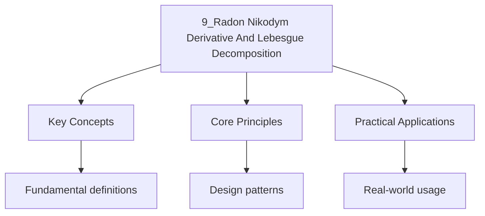

---

date: 2026-07-23T21:57:32+01:00
title: Radon-Nikodym Derivative and Lebesgue Decomposition
tags:
  - Mathematics
  - University
description: "A measure is with respect to (written ) if Comprehensive educational content coverage with definitions, worked examples, and practice problems."
---

<!-- Breadcrumb Schema for SEO -->

### 9.1 Absolute Continuity

A measure $\nu$ is **absolutely continuous** with respect to $\mu$ (written $\nu \ll \mu$) if
$\mu(A) = 0$ implies $\nu(A) = 0$.

Measures $\mu$ and $\nu$ are **mutually singular** (written $\mu \perp \nu$) if there exists
$A \in \mathcal{F}$ such that $\mu(A) = 0$ and $\nu(A^c) = 0$.

**Proposition 9.1 (Basic Properties).** Let $\mu, \nu, \lambda$ be measures on $(X, \mathcal{F})$.

- If $\nu \ll \mu$ and $\mu \ll \lambda$, then $\nu \ll \lambda$.
- If $\nu \ll \mu$ and $\nu \perp \mu$, then $\nu = 0$.
- If $\nu \ll \mu$ and $\mu$ is $\sigma$-finite, then $\nu$ is $\sigma$-finite.

### 9.2 Radon-Nikodym Theorem

**Theorem 9.2 (Radon-Nikodym Theorem).** Let $(X, \mathcal{F}, \mu)$ be a $\sigma$-finite measure
space and $\nu$ a $\sigma$-finite signed measure with $\nu \ll \mu$. Then there exists a unique
(a.e.) measurable function $f : X \to \mathbb{R}$ such that

$$\nu(A) = \int_A f\, d\mu \quad \text{for all } A \in \mathcal{F}$$

This function $f$ is denoted $d\nu/d\mu$ and called the **Radon-Nikodym derivative** of $\nu$ with
respect to $\mu$.

**Proof sketch.** For the finite case, consider the set of functions $g$ with $\int_A g\, d\mu \leq \nu(A)$
for all $A$. Let $\alpha = \sup\{\int_X g\, d\mu\}$ and choose a maximizing sequence $g_n$. The
pointwise supremum $f = \sup_n g_n$ gives the desired derivative. Extend to $\sigma$-finite case
by partitioning $X$ into sets of finite measure.

### 9.3 Properties of the Radon-Nikodym Derivative

**Proposition 9.3 (Linearity).** If $\nu_1, \nu_2 \ll \mu$ and $a, b \in \mathbb{R}$, then:

$$\frac{d(a\nu_1 + b\nu_2)}{d\mu} = a\frac{d\nu_1}{d\mu} + b\frac{d\nu_2}{d\mu}$$

**Proposition 9.4 (Chain Rule).** If $\lambda \ll \nu$ and $\nu \ll \mu$, then $\lambda \ll \mu$ and:

$$\frac{d\lambda}{d\mu} = \frac{d\lambda}{d\nu} \cdot \frac{d\nu}{d\mu} \quad \mu\text{-a.e.}$$

**Proposition 9.5 (Change of Variables).** If $\nu \ll \mu$ and $f$ is $\nu$-integrable, then:

$$\int f\, d\nu = \int f \frac{d\nu}{d\mu}\, d\mu$$

**Example 9.1.** If $\nu$ is absolutely continuous with respect to Lebesgue measure $m$ on
$\mathbb{R}$, then $d\nu/dm$ is the Radon-Nikodym derivative. For a probability distribution with
density $p(x)$, we have $\nu(A) = \int_A p(x)\, dx$, so $d\nu/dm = p$.

**Example 9.2.** The Dirac measure $\delta_0$ is not absolutely continuous with respect to Lebesgue
measure: $\delta_0 \ll m$ would require $\delta_0(\{0\}) = 1 = \int_{\{0\}} f\, dm = 0$, a
contradiction. In fact, $\delta_0 \perp m$ (take $A = \{0\}$, then $m(A) = 0$, $\delta_0(A^c) = 0$).

### 9.4 Lebesgue Decomposition

**Theorem 9.6 (Lebesgue Decomposition).** Let $\mu$ and $\nu$ be $\sigma$-finite measures on
$(X, \mathcal{F})$. Then there exist unique measures $\nu_a$ and $\nu_s$ such that:

1. $\nu = \nu_a + \nu_s$.
2. $\nu_a \ll \mu$ (absolutely continuous part).
3. $\nu_s \perp \mu$ (singular part).

**Proof sketch.** Let $\lambda = \mu + \nu$. Apply Radon-Nikodym to $\nu \ll \lambda$ to get
$f = d\nu/d\lambda$. Then set $\nu_a(A) = \int_A f\, d\mu$ and $\nu_s = \nu - \nu_a$. Show that
$\nu_s$ is singular with respect to $\mu$ by considering the set where $f = 0$ or $f \geq 1$ and
using the properties of the derivative.

**Example 9.3.** The Cantor function $F : [0, 1] \to [0, 1]$ is continuous, monotonically increasing,
and has $F(0) = 0$, $F(1) = 1$. The associated measure $\mu_F$ (the Cantor measure or "Devil's
staircase" measure) is singular with respect to Lebesgue measure: $\mu_F \perp m$. By Lebesgue
decomposition, $\mu_F = \mu_F + 0$ with $\mu_F \perp m$.

### 9.5 Examples and Applications

**Example 9.4 (Absolutely Continuous Part of a Measure).** Let $\nu$ be a measure on $\mathbb{R}$
defined by $\nu(A) = m(A \cap [0,1]) + \sum_{q \in \mathbb{Q} \cap [0,1]} 2^{-q} \delta_q(A)$.
Then the Lebesgue decomposition of $\nu$ with respect to $m$ is: $\nu_a(A) = m(A \cap [0,1])$,
$\nu_s(A) = \sum_{q \in \mathbb{Q} \cap [0,1]} 2^{-q} \delta_q(A)$.

**Example 9.5 (Conditional Expectation).** In probability theory, the conditional expectation
$\mathbb{E}[X | \mathcal{G}]$ can be defined via the Radon-Nikodym derivative. Given a
sub-$\sigma$-algebra $\mathcal{G} \subseteq \mathcal{F}$, define $\nu(G) = \int_G X\, dP$ for
$G \in \mathcal{G}$. Then $\nu \ll P|_\mathcal{G}$, and $\mathbb{E}[X | \mathcal{G}] = d\nu/d(P|_\mathcal{G})$.

**Application: Differentiation of Measures.** The Radon-Nikodym theorem is essential for the
differentiation of measures on $\mathbb{R}^n$. The Lebesgue differentiation theorem states that
for a locally integrable function $f$:

$$\lim_{r \to 0} \frac{1}{m(B_r(x))} \int_{B_r(x)} f\, dm = f(x) \quad \text{a.e.}$$

This is intimately connected with the Radon-Nikodym derivative of the measure $\nu(A) = \int_A f\, dm$.

### 9.6 The Radon-Nikodym Property in Banach Spaces

**Definition.** A Banach space $X$ has the **Radon-Nikodym property** if for every finite measure
space $(\Omega, \mathcal{F}, \mu)$ and every vector measure $\nu : \mathcal{F} \to X$ that is
absolutely continuous with respect to $\mu$ and has bounded variation, there exists $f \in L^1(\mu, X)$
such that $\nu(A) = \int_A f\, d\mu$.

**Proposition 9.7.** Every separable dual space has the Radon-Nikodym property. In particular,
$\ell^1$, $\ell^\infty$, and $L^\infty$ do not have this property.

### 9.7 Worked Examples

**Problem 1.** Let $\mu$ be Lebesgue measure on $[0,1]$ and $\nu(A) = \int_A x^2\, d\mu$. Find
$d\nu/d\mu$.

*Solution.* By definition, $\nu(A) = \int_A f\, d\mu$ with $f(x) = x^2$, so $d\nu/d\mu(x) = x^2$.
$\blacksquare$

**Problem 2.** Decompose $\nu = \delta_0 + m$ (where $m$ is Lebesgue measure on $\mathbb{R}$) into
absolutely continuous and singular parts with respect to $m$.

*Solution.* $\nu_a = m$ (since $m \ll m$) and $\nu_s = \delta_0$ (since $\delta_0 \perp m$). Indeed,
$\nu = m + \delta_0$ with $m \ll m$ and $\delta_0 \perp m$. $\blacksquare$

### 9.8 Practice Problems

1. Prove that if $\nu \ll \mu$ and $\mu \ll \nu$, then $d\nu/d\mu > 0$ $\mu$-a.e. and
   $d\mu/d\nu = (d\nu/d\mu)^{-1}$.
2. Show that the Radon-Nikodym derivative is unique up to $\mu$-null sets.
3. Find the Lebesgue decomposition of $\nu(A) = \int_A e^{-x^2}\, dx + \sum_{n=1}^\infty 2^{-n} \delta_n(A)$
   with respect to Lebesgue measure.
4. Prove that if $\mu$ and $\nu$ are $\sigma$-finite and $\nu \ll \mu$, then
   $\int f\, d\nu = \int f (d\nu/d\mu)\, d\mu$ for all measurable $f \geq 0$.

## Cross-References

- **[Lebesgue Outer Measure and Caratheodory Extension](./3_lebesgue-outer-measure-and-caratheodory-extension)**: Constructs the Lebesgue measure that serves as the reference measure for the Radon-Nikodym derivative.
- **[Lebesgue Measurable Sets and Non-Measurable Sets](./4_lebesgue-measurable-sets-and-non-measurable-sets)**: Establishes the $\sigma$-algebra of measurable sets needed for the decomposition of measures.
- **[Fubini and Tonelli Theorems](./8_fubini-and-tonelli-theorems)**: Product measures and integration techniques used in applications of the Radon-Nikodym derivative.

- [Quantum Mechanics](https://physics.wyattau.com/docs/quantum-mechanics)
- [Graph Theory](https://computer-science.wyattau.com/docs/graph-theory)
- [Classical Mechanics](https://physics.wyattau.com/docs/classical-mechanics)
- [Electromagnetism](https://physics.wyattau.com/docs/electromagnetism)
- [Statistical Learning](https://machine-learning.wyattau.com/docs/statistical-learning)
- [Statistical Mechanics](https://physics.wyattau.com/docs/statistical-mechanics)

## Intuition

The Radon-Nikodym derivative generalises the concept of a density function. If one measure is absolutely continuous with respect to another, meaning it assigns zero to every set that the reference measure does, then the Radon-Nikodym theorem guarantees the existence of a derivative function that converts one measure into the other via integration. This is analogous to the fundamental theorem of calculus: just as differentiation recovers a function from its integral, the Radon-Nikodym derivative recovers the density from a measure. The Lebesgue decomposition theorem shows that any measure can be uniquely split into an absolutely continuous part and a singular part, like decomposing a signal into a smooth component and a spike.

## Common Mistakes

**Mistake 1: Assuming the Radon-Nikodym derivative exists without absolute continuity**
The Radon-Nikodym theorem requires $\nu \ll \mu$ (absolute continuity). If $\nu$ is not absolutely continuous with respect to $\mu$, the derivative $d\nu/d\mu$ does not exist as a function. The Dirac measure $\delta_0$ is not absolutely continuous with respect to Lebesgue measure, so it has no Radon-Nikodym derivative with respect to $m$.

**Mistake 2: Confusing mutual singularity with absolute continuity**
Absolute continuity ($\nu \ll \mu$) and mutual singularity ($\nu \perp \mu$) are not opposites. A measure can be neither absolutely continuous nor singular with respect to another -- the Lebesgue decomposition theorem shows that any $\sigma$-finite measure decomposes uniquely into an absolutely continuous part and a singular part. Students sometimes think these are the only two possibilities.

**Mistake 3: Forgetting that the Radon-Nikodym derivative is unique only up to $\mu$-null sets**
The function $f = d\nu/d\mu$ is determined $\mu$-almost everywhere, not pointwise. Two functions that differ on a $\mu$-null set both serve as Radon-Nikodym derivatives. Students sometimes treat the derivative as a pointwise-defined function, which matters when evaluating it at specific points or when composing with other functions.
