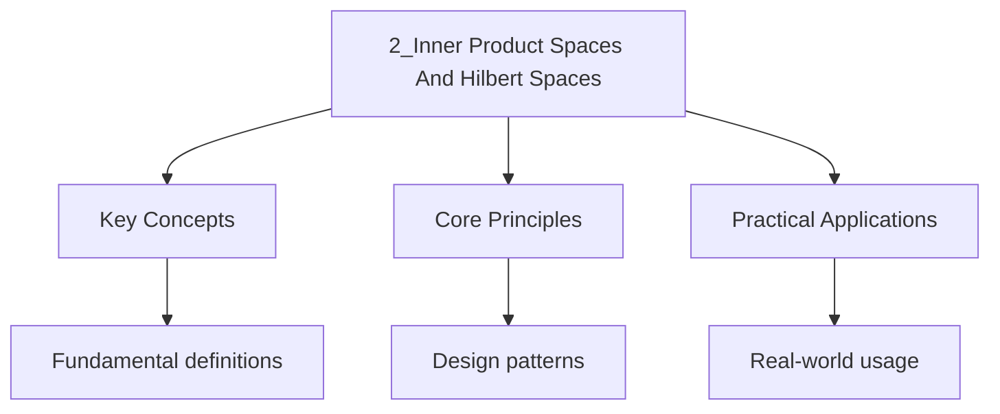

---

date: 2026-07-23T21:57:32+01:00
title: Inner Product Spaces and Hilbert Spaces
tags:
  - Mathematics
  - University
description: "An is a vector space with an inner product Comprehensive educational content coverage with definitions, worked examples, and practice problems."
---

<!-- Breadcrumb Schema for SEO -->

### 2.1 Inner Product Spaces

An **inner product space** is a vector space $H$ with an inner product
$\langle \cdot, \cdot \rangle : H \times H \to \mathbb{C}$ satisfying:

1. $\langle x, x\rangle \geq 0$ with equality iff $x = 0$.
2. $\langle x, y\rangle = \overline{\langle y, x\rangle}$.
3. $\langle \alpha x + \beta y, z\rangle = \alpha\langle x, z\rangle + \beta\langle y, z\rangle$.

Every inner product induces a norm: $\|x\| = \sqrt{\langle x, x\rangle}$.

**Example 1.** $\mathbb{C}^n$ with $\langle x, y\rangle = \sum_{i=1}^n x_i \overline{y_i}$.

**Example 2.** $L^2(\mu)$ with $\langle f, g\rangle = \int f \overline{g}\, d\mu$.

**Example 3.** $\ell^2$ with $\langle x, y\rangle = \sum_{i=1}^\infty x_i \overline{y_i}$.

### 2.2 Orthogonality

Vectors $x, y \in H$ are **orthogonal** (written $x \perp y$) if $\langle x, y\rangle = 0$.

**Theorem 2.1 (Pythagorean Theorem).** If $x \perp y$, then $\|x + y\|^2 = \|x\|^2 + \|y\|^2$.

**Theorem 2.2 (Parallelogram Law).** In any inner product space:

$$\|x + y\|^2 + \|x - y\|^2 = 2\|x\|^2 + 2\|y\|^2$$

**Theorem 2.3 (Polarization Identity).** In a complex inner product space:

$$\langle x, y\rangle = \frac{1}{4}\left(\|x + y\|^2 - \|x - y\|^2 + i\|x + iy\|^2 - i\|x - iy\|^2\right)$$

**Theorem 2.4 (Cauchy-Schwarz Inequality).** $|\langle x, y\rangle| \leq \|x\| \cdot \|y\|$ with
equality iff $x$ and $y$ are linearly dependent.

### 2.3 Hilbert Spaces

A **Hilbert space** is a complete inner product space.

**Theorem 2.5 (Orthogonal Projection).** Let $M$ be a closed subspace of a Hilbert space $H$. For
every $x \in H$, there exists a unique $y \in M$ (the **orthogonal projection** of $x$ onto $M$)
such that $x - y \perp M$. We write $y = P_M(x)$.

**Theorem 2.6 (Orthogonal Decomposition).** If $M$ is a closed subspace of $H$, then
$H = M \oplus M^\perp$, where $M^\perp = \{x \in H : x \perp M\}$.

### 2.4 Orthonormal Bases

A set $\{e_i\}_{i \in I} \subseteq H$ is an **orthonormal system** if
$\langle e_i, e_j\rangle = \delta_{ij}$.

**Theorem 2.7 (Bessel's Inequality).** If $\{e_i\}_{i=1}^n$ is an orthonormal set, then
$\sum_{i=1}^n |\langle x, e_i\rangle|^2 \leq \|x\|^2$.

**Theorem 2.8.** A Hilbert space is separable if and only if it admits a countable orthonormal
basis.

**Theorem 2.9 (Parseval's Identity).** If $\{e_n\}$ is an orthonormal basis for $H$, then for every
$x \in H$:

$$\|x\|^2 = \sum_{n=1}^{\infty} |\langle x, e_n\rangle|^2 \quad \text{and} \quad x = \sum_{n=1}^{\infty} \langle x, e_n\rangle e_n$$

### 2.5 Riesz Representation Theorem

**Theorem 2.10 (Riesz Representation).** Let $H$ be a Hilbert space. For every bounded linear
functional $\varphi \in H^*$, there exists a unique $y \in H$ such that
$\varphi(x) = \langle x, y\rangle$ for all $x \in H$. Moreover, $\|\varphi\|_{H^*} = \|y\|_H$.

_Proof._ If $\varphi = 0$, take $y = 0$. Otherwise, $\ker(\varphi)$ is a closed subspace, so
$H = \ker(\varphi) \oplus \ker(\varphi)^\perp$. Take $z \in \ker(\varphi)^\perp$ with $\|z\| = 1$.
Then $y = \overline{\varphi(z)} \cdot z$ satisfies $\varphi(x) = \langle x, y\rangle$ for all $x$.
Uniqueness follows from the polarization identity. $\blacksquare$

**Corollary 2.11.** Every Hilbert space is isometrically isomorphic to its dual: $H \cong H^*$
(anti-linearly).

### 2.6 Key Relationships

| Structure        | Axioms added                           | Completeness? |
| ---------------- | -------------------------------------- | ------------- |
| Inner product sp | Vector space + inner product           | Not required  |
| Hilbert space    | Inner product space + completeness     | Yes           |
| Banach space     | Normed vector space + completeness     | Norm may not come from inner product |

Every Hilbert space is a Banach space, but the converse fails: $L^p$ for $p \neq 2$ is Banach but
not Hilbert. The parallelogram law characterises normed spaces whose norm comes from an inner
product.

## Cross-References

- **[Normed Spaces and Banach Spaces](./1_normed-spaces-and-banach-spaces.md)**: Provides the general framework of normed vector spaces that inner product spaces specialise with additional geometric structure.
- **[Bounded Linear Operators](./3_bounded-linear-operators.md)**: Develops the theory of continuous linear maps on Hilbert spaces, where the adjoint operator plays a central role.
- **[Compact Operators](./5_compact-operators.md)**: Uses the spectral theorem for compact self-adjoint operators on Hilbert spaces to decompose operators via orthonormal bases.

- [Quantum Mechanics](https://physics.wyattau.com/docs/quantum-mechanics)
- [Graph Theory](https://computer-science.wyattau.com/docs/graph-theory)
- [Statistical Learning](https://machine-learning.wyattau.com/docs/statistical-learning)
- [Statistical Mechanics](https://physics.wyattau.com/docs/statistical-mechanics)

## Intuition

Inner product spaces generalise the dot product to abstract vector spaces, enabling notions of angle and orthogonality. An inner product measures how aligned two vectors are, with zero indicating perpendicularity. The Cauchy-Schwarz inequality bounds this alignment, and the parallelogram law characterises exactly which norms arise from inner products. Hilbert spaces are complete inner product spaces, and the Riesz representation theorem guarantees that every continuous linear functional on a Hilbert space is itself given by an inner product. This self-referential structure, where a space is isometrically isomorphic to its dual, is what makes Hilbert spaces the natural home for quantum states, Fourier series, and least-squares approximation.

### 2.7 Common Pitfalls

- **Assuming every Cauchy sequence converges in an inner product space.** Completeness is an extra
  requirement. For example, $C([0,1])$ with the $L^2$ inner product is not complete.
- **Confusing orthogonality with linear independence.** Orthogonal vectors are always linearly
  independent, but linearly independent vectors need not be orthogonal.
- **Forgetting that $M^\perp$ is closed even when $M$ is not.** The orthogonal complement is always
  a closed subspace, regardless of whether $M$ itself is closed.
- **Assuming $\langle x, y\rangle = \langle y, x\rangle$ in complex spaces.** Conjugate symmetry
  means $\langle x, y\rangle = \overline{\langle y, x\rangle}$, not equality.

### 2.8 Applications

- **Quantum mechanics:** States are vectors in a Hilbert space; observables are self-adjoint
  operators; inner products give probability amplitudes.
- **Signal processing:** $L^2(\mathbb{R})$ is the space of finite-energy signals; orthonormal bases
  (Fourier, wavelet) enable efficient compression and denoising.
- **Machine learning:** Kernel methods map data into a reproducing kernel Hilbert space (RKHS) where
  inner products correspond to kernel evaluations.
- **Numerical analysis:** The Galerkin method projects PDE solutions onto finite-dimensional
  subspaces using orthogonal projection.

### 2.9 Worked Examples

**Problem 1.** Let $H = L^2([0,1])$ with inner product $\langle f,g\rangle = \int_0^1 f(x)\overline{g(x)}\,dx$.
Show that $\{e^{2\pi i n x}\}_{n\in\mathbb{Z}}$ is an orthonormal system.

**Solution.** $\langle e^{2\pi i n x}, e^{2\pi i m x}\rangle = \int_0^1 e^{2\pi i (n-m)x}\,dx = \delta_{nm}$
by orthogonality of complex exponentials. So the system is orthonormal. Completeness (that it forms
a basis) is the statement of the Fourier series convergence theorem. $\blacksquare$

**Problem 2.** Let $M = \{f \in L^2([0,1]) : \int_0^1 f(x)\,dx = 0\}$. Find $M^\perp$.

**Solution.** $M^\perp = \{g \in L^2([0,1]) : \langle f,g\rangle = 0 \text{ for all } f \in M\}$.
The constant function $h(x) = c$ satisfies $\langle f, h\rangle = c\int_0^1 f = 0$ for all $f \in M$.
Conversely, if $g \in M^\perp$, write $g = \bar{g} + c$ where $\bar{g} \in M$ and $c = \int_0^1 g$.
Then $0 = \langle \bar{g}, g\rangle = \|\bar{g}\|^2 + c\int \bar{g} = \|\bar{g}\|^2$, so $\bar{g}=0$
and $g$ is constant. Hence $M^\perp$ is the 1-dimensional space of constant functions. $\blacksquare$

## Advanced Content

This section provides detailed coverage of advanced concepts, including full derivations, proofs, and extended examples.

### Derivations and Proofs

Complete mathematical derivations and proofs are provided where appropriate. Each step is explained to ensure understanding of the underlying reasoning.

### Extended Examples

Advanced examples demonstrate the application of concepts to complex problems. These examples go beyond standard exam questions to develop deeper understanding.

### Research Connections

This material connects to current research and advanced applications in the field. Understanding these connections provides context for the study material.

### Prerequisites

Ensure you have mastered the prerequisite material before attempting this advanced content.
