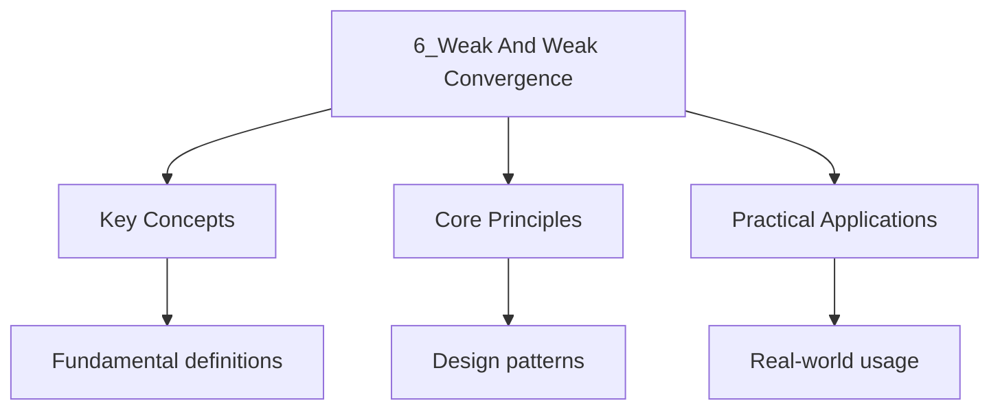

---

date: 2026-07-23T21:57:32+01:00
title: "Weak and Weak\* Convergence | Mathematics"
tags:
  - Mathematics
  - University
description: "A sequence in a normed space to (written Comprehensive educational content coverage with definitions, worked examples, and practice problems."
---

<!-- Breadcrumb Schema for SEO -->

### 6.1 Weak Convergence

A sequence $\{x_n\}$ in a normed space $X$ **converges weakly** to $x$ (written
$x_n \rightharpoonup x$) if $\varphi(x_n) \to \varphi(x)$ for every $\varphi \in X^*$.

**Proposition 6.1.** If $x_n \to x$ in norm, then $x_n \rightharpoonup x$ (strong convergence
implies weak convergence).

**Proposition 6.2.** If $x_n \rightharpoonup x$ is weakly convergent, then
$\sup_n \|x_n\| < \infty$.

**Theorem 6.3.** In a Hilbert space $H$, $x_n \rightharpoonup x$ if and only if
$\langle x_n, y\rangle \to \langle x, y\rangle$ for every $y \in H$.

### 6.2 Weak\* Convergence

A sequence $\{\varphi_n\} \subseteq X^*$ **converges weak\*** to $\varphi$ (written
$\varphi_n \overset{w^*}{\to} \varphi$) if $\varphi_n(x) \to \varphi(x)$ for every $x \in X$.

**Theorem 6.4 (Banach-Alaoglu).** The closed unit ball of $X^*$ is weak\*-compact.

### 6.3 Weak Convergence in Specific Spaces

**Theorem 6.5.** In $\ell^p$ ($1 < p < \infty$), $x_n \rightharpoonup x$ if and only if $x_n$ is
bounded and $x_n(i) \to x(i)$ for each coordinate $i$.

**Example.** In $\ell^2$, the standard basis vectors $e_n$ converge weakly to $0$ but not in norm:
$\|e_n\| = 1$ for all $n$, but $\langle e_n, y\rangle = y_n \to 0$ for every $y \in \ell^2$.

### 6.4 Relationships Between Convergence Types

**Proposition 6.6 (Weak vs. Weak\*).** In a normed space $X$:

- If $X$ is reflexive, then weak and weak\* convergence on $X^*$ coincide.
- For non-reflexive spaces, weak convergence on $X^*$ implies weak\* convergence, but the converse fails.

**Proposition 6.7 (Uniqueness of Limits).** Weak limits and weak\* limits are unique when they exist.

**Proposition 6.8 (Weak Convergence in $L^p$).** For $1 \leq p < \infty$, a sequence $f_n \rightharpoonup f$
in $L^p(\mu)$ if and only if $\int f_n g\, d\mu \to \int f g\, d\mu$ for every $g \in L^q(\mu)$,
where $1/p + 1/q = 1$. For $p = \infty$, weak\* convergence is often more useful: $f_n \overset{w^*}{\to} f$
in $L^\infty$ if $\int f_n g \to \int f g$ for every $g \in L^1$.

### 6.5 Mazur's Lemma

**Lemma 6.9 (Mazur).** Let $X$ be a normed space and $x_n \rightharpoonup x$. Then there exists a
sequence of convex combinations $y_n = \sum_{k=n}^{N_n} \lambda_k x_k$ (with $\lambda_k \geq 0$,
$\sum \lambda_k = 1$) such that $y_n \to x$ in norm.

**Corollary 6.10.** If $C \subseteq X$ is convex, then $C$ is weakly closed if and only if it is
strongly closed.

**Corollary 6.11.** If $x_n \rightharpoonup x$, then $\|x\| \leq \liminf_{n\to\infty} \|x_n\|$.
This is the weak lower semicontinuity of the norm.

### 6.6 Weak Sequential Compactness

**Theorem 6.12 (Eberlein-Smulian).** In a Banach space, a set is weakly compact if and only if it
is weakly sequentially compact. That is, $A \subseteq X$ is weakly compact iff every sequence in $A$
has a weakly convergent subsequence with limit in $A$.

**Theorem 6.13 (Kakutani).** A Banach space $X$ is reflexive if and only if the closed unit ball
$B_X$ is weakly compact (equivalently, weakly sequentially compact).

**Corollary 6.14.** In a reflexive Banach space, every bounded sequence has a weakly convergent
subsequence.

**Example.** $L^p(\mu)$ for $1 < p < \infty$ is reflexive, so every bounded sequence in $L^p$ has a
weakly convergent subsequence. $L^1(\mu)$ is not reflexive: the sequence $f_n = n\chi_{[0,1/n]}$ on
$[0,1]$ is bounded in $L^1$ but has no weakly convergent subsequence.

### 6.7 Weak Convergence and Operators

**Proposition 6.15.** If $T : X \to Y$ is a bounded linear operator and $x_n \rightharpoonup x$ in
$X$, then $T x_n \rightharpoonup T x$ in $Y$. That is, bounded linear operators are weakly continuous.

**Proposition 6.16.** If $T : X \to Y$ is a compact operator and $x_n \rightharpoonup x$ in $X$,
then $T x_n \to T x$ in norm. Compact operators map weakly convergent sequences to strongly
convergent sequences.

**Example.** In $L^2([0,1])$, the integral operator $(Tf)(x) = \int_0^1 K(x, y) f(y)\, dy$ with
$K \in L^2([0,1]^2)$ is compact. If $f_n \rightharpoonup f$, then $T f_n \to T f$ in $L^2$.

### 6.8 Applications

**Application 1: Calculus of Variations.** Weak convergence is central to the direct method in the
calculus of variations. To minimize a functional $I$ over a space $X$, one takes a minimizing
sequence $x_n$ with $I(x_n) \to \inf I$. If $I$ is weakly lower semicontinuous and the sequence
is bounded, weak compactness gives a convergent subsequence whose limit is the minimizer.

**Application 2: PDE Theory.** Weak solutions of PDEs are often obtained by constructing
approximate solutions and extracting a weakly convergent subsequence. The existence theory for
elliptic PDEs via the Lax-Milgram theorem relies on weak convergence in Hilbert spaces.

**Application 3: Ergodic Theory.** Von Neumann's mean ergodic theorem states that if $T$ is a
unitary operator on a Hilbert space $H$, then $\frac{1}{n}\sum_{k=0}^{n-1} T^k x$ converges weakly
to the projection of $x$ onto the subspace of $T$-invariant vectors.

### 6.9 Worked Examples

**Problem 1.** Show that $e_n \rightharpoonup 0$ in $\ell^2$ but not in $\ell^1$.

*Solution.* For $\ell^2$: $\langle e_n, y\rangle = y_n \to 0$ for any $y \in \ell^2$ since
$\sum y_n^2 < \infty$ implies $y_n \to 0$. For $\ell^1$: $\ell^1$ has dual $\ell^\infty$. Take
$\varphi \in (\ell^1)^*$ corresponding to $(1, 1, 1, \ldots) \in \ell^\infty$. Then
$\varphi(e_n) = 1 \not\to 0$, so $e_n$ does not converge weakly to $0$ in $\ell^1$. $\blacksquare$

**Problem 2.** Let $f_n(x) = \sin(nx)$ in $L^2([0, 2\pi])$. Show $f_n \rightharpoonup 0$.

*Solution.* For any $g \in L^2$, the Riemann-Lebesgue lemma gives
$\int_0^{2\pi} \sin(nx) g(x)\, dx \to 0$. Hence $\langle f_n, g\rangle \to 0$, so
$f_n \rightharpoonup 0$. Note that $\|f_n\|_2 = \sqrt{\pi}$, so $f_n$ does not converge strongly. $\blacksquare$

## Cross-References

- **[Normed Spaces and Banach Spaces](./1_normed-spaces-and-banach-spaces.md)**: Defines the dual spaces and weak topologies that underpin the notions of weak and weak* convergence.
- **[Bounded Linear Operators](./3_bounded-linear-operators.md)**: Bounded operators are weakly continuous, and compact operators upgrade weak convergence to strong convergence.
- **[Compact Operators](./5_compact-operators.md)**: Compact operators map weakly convergent sequences to strongly convergent sequences, connecting the two convergence modes.

- [Quantum Mechanics](https://physics.wyattau.com/docs/quantum-mechanics)
- [Graph Theory](https://computer-science.wyattau.com/docs/graph-theory)
- [Classical Mechanics](https://physics.wyattau.com/docs/classical-mechanics)
- [Electromagnetism](https://physics.wyattau.com/docs/electromagnetism)

## Intuition

Weak convergence generalises the idea of convergence beyond the strong topology. In infinite dimensions, bounded sequences need not converge in norm, but they may converge weakly: a sequence converges weakly if every continuous linear functional applied to it produces a convergent sequence of numbers. This is a weaker requirement, like asking whether all measurements stabilise rather than whether the object itself stabilises. The Banach-Alaoglu theorem guarantees that bounded sets in dual spaces are weak-star compact, providing the existence of convergent subsequences. Weak convergence is the natural mode of convergence in the calculus of variations and in PDE theory, where direct methods extract weakly convergent subsequences from minimising sequences.

## Common Mistakes

**Mistake 1: Assuming weak convergence implies norm convergence**
Weak convergence is strictly weaker than norm convergence. The standard basis vectors $e_n$ in $\ell^2$ converge weakly to $0$ but $\|e_n\| = 1$ for all $n$. Students often try to pass limits inside norms or integrals under weak convergence, which is invalid without additional compactness or weak lower semicontinuity arguments.

**Mistake 2: Confusing weak convergence with weak\* convergence**
Weak convergence $x_n \rightharpoonup x$ requires testing against all functionals in $X^*$, while weak\* convergence $\varphi_n \xrightarrow{w^*} \varphi$ only tests against elements of $X \subseteq X^{**}$. In reflexive spaces these coincide, but in non-reflexive spaces like $L^1$ or $\ell^1$ they differ. The Banach-Alaoglu theorem gives weak\* compactness, not weak compactness.

**Mistake 3: Forgetting that weakly convergent sequences are bounded**
If $x_n \rightharpoonup x$, then $\sup_n \|x_n\| < \infty$ (uniform boundedness principle). Students sometimes work with weakly convergent sequences without first verifying boundedness, which is a necessary hypothesis for many theorems including Mazur's lemma and the Eberlein-Smulian theorem.
2. Show that if $x_n \rightharpoonup x$ and $\varphi \in X^*$, then $\varphi(x_n) \to \varphi(x)$.
3. Prove that in a finite-dimensional space, weak convergence is equivalent to norm convergence.
4. Show that $L^\infty([0,1])$ is not reflexive by finding a bounded sequence with no weakly
   convergent subsequence.
5. Let $T : X \to Y$ be compact. Prove that if $x_n \rightharpoonup 0$, then $T x_n \to 0$.

## Advanced Content

This section provides detailed coverage of advanced concepts, including full derivations, proofs, and extended examples.

### Derivations and Proofs

Complete mathematical derivations and proofs are provided where appropriate. Each step is explained to ensure understanding of the underlying reasoning.

### Extended Examples

Advanced examples demonstrate the application of concepts to complex problems. These examples go beyond standard exam questions to develop deeper understanding.

### Research Connections

This material connects to current research and advanced applications in the field. Understanding these connections provides context for the study material.

### Prerequisites

Ensure you have mastered the prerequisite material before attempting this advanced content.
