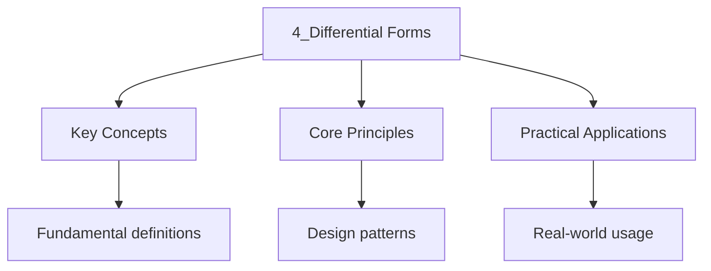

---

date: 2026-07-23T21:57:32+01:00
title: "Differential Forms | Mathematics"
tags:
  - Mathematics
  - University
description: "The space of -covectors at is , the space of alternating -linear maps Comprehensive educational content coverage with definitions and practice problems."
---

<!-- Breadcrumb Schema for SEO -->

### 4.1 Alternating Tensors

The space of $k$-covectors at $p$ is $\Lambda^k(T_p^* M)$, the space of alternating $k$-linear maps
$T_p M \times \cdots \times T_p M \to \mathbb{R}$.

**Definition.** A **differential $k$-form** on $M$ is a smooth section of $\Lambda^k T^* M$, i.e., a
smooth map $\omega : M \to \Lambda^k T^* M$ assigning to each $p$ an alternating $k$-linear
functional $\omega_p$ on $T_p M$.

**Examples.**

- A $0$-form is a smooth function $f \in C^\infty(M)$.
- A $1$-form is a section of $T^* M$ (a covector field). In local coordinates,
  $\omega = \sum \omega_i\, dx^i$.
- A $2$-form on $M$ has the local expression $\omega = \sum_{i < j} \omega_{ij}\, dx^i \wedge dx^j$.

### 4.2 Pullback of Differential Forms

**Definition.** If $F : M \to N$ is a smooth map, the **pullback** $F^* : \Omega^k(N) \to \Omega^k(M)$ is defined by:

$$(F^*\omega)_p(v_1, \ldots, v_k) = \omega_{F(p)}(dF_p(v_1), \ldots, dF_p(v_k))$$

for $v_i \in T_p M$.

**Proposition 4.1.** The pullback satisfies:

1. $F^*(\alpha \wedge \beta) = F^*\alpha \wedge F^*\beta$
2. $F^*(d\omega) = d(F^*\omega)$
3. $(G \circ F)^* = F^* \circ G^*$

### 4.3 Interior Product and Lie Derivative

**Definition.** The **interior product** (contraction) of a vector field $X$ with a $k$-form $\omega$ is the $(k-1)$-form $\iota_X \omega$ defined by:

$$(\iota_X \omega)(v_1, \ldots, v_{k-1}) = \omega(X, v_1, \ldots, v_{k-1})$$

**Proposition 4.2 (Cartan's Magic Formula).** The Lie derivative $\mathcal{L}_X$ of a differential form satisfies:

$$\mathcal{L}_X \omega = d(\iota_X \omega) + \iota_X(d\omega)$$

### 4.4 Exterior Derivative

The **exterior derivative** is the operator $d : \Omega^k(M) \to \Omega^{k+1}(M)$ defined by:

- For $f \in \Omega^0(M)$: $df = \sum_{i=1}^n \frac{\partial f}{\partial x^i}\, dx^i$ (the total
  differential).
- For general $k$-forms: defined by requiring $d(df) = 0$ and the product rule
  $d(\alpha \wedge \beta) = d\alpha \wedge \beta + (-1)^{\deg(\alpha)} \alpha \wedge d\beta$.

**Proposition 4.3.** $d \circ d = 0$ ($d^2 = 0$).

**Theorem 4.4 (Poincare Lemma).** If $M$ is a star-shaped open subset of $\mathbb{R}^n$ (or more
generally, a contractible manifold), then every closed $k$-form is exact: if $d\omega = 0$, then
$\omega = d\eta$ for some $(k - 1)$-form $\eta$.

### 4.5 Wedge Product

The **wedge product** $\wedge : \Omega^k(M) \times \Omega^\ell(M) \to \Omega^{k+\ell}(M)$ is the
bilinear, associative, anti-commutative operation:

$$\alpha \wedge \beta = (-1)^{k\ell}\, \beta \wedge \alpha$$

### 4.6 Stokes" Theorem

**Theorem 4.5 (Stokes' Theorem).** Let $M$ be an oriented $n$-dimensional manifold with boundary
$\partial M$ (with the induced orientation). If $\omega$ is a compactly supported $(n-1)$-form on
$M$, then:

$$\int_{\partial M} \omega = \int_M d\omega$$

**Special Cases:**

- **Fundamental Theorem of Calculus** ($n = 1$): $\int_a^b f'(x)\, dx = f(b) - f(a)$.
- **Green's Theorem** ($n = 2$):
  $\oint_{\partial D} P\, dx + Q\, dy = \iint_D \left(\frac{\partial Q}{\partial x} - \frac{\partial P}{\partial y}\right) dx\, dy$.
- **Classical Stokes' Theorem** ($n = 3$):
  $\oint_{\partial S} \mathbf{F} \cdot d\mathbf{r} = \iint_S (\nabla \times \mathbf{F}) \cdot d\mathbf{S}$.
- **Divergence Theorem** ($n = 3$):
  $\oint_{\partial V} \mathbf{F} \cdot d\mathbf{S} = \iiint_V (\nabla \cdot \mathbf{F})\, dV$.

### 4.7 Integration of Differential Forms

Integration of an $n$-form over an $n$-dimensional oriented manifold is defined by pulling back to $\mathbb{R}^n$ and integrating in coordinates. If $\omega = f\,dx^1 \wedge \cdots \wedge dx^n$ on a coordinate chart $U$ with parametrisation $\phi : U \to \mathbb{R}^n$:

$$\int_U \omega = \int_{\phi(U)} f(x^1, \ldots, x^n)\, dx^1 \cdots dx^n$$

### 4.8 Worked Example: Integrating a 2-Form on the Sphere

**Problem.** Compute $\int_{S^2} \omega$ where $\omega = x\,dy \wedge dz + y\,dz \wedge dx + z\,dx \wedge dy$ on the unit sphere $S^2 \subset \mathbb{R}^3$.

Solution

Parametrise $S^2$ by spherical coordinates: $x = \sin\theta\cos\phi$, $y = \sin\theta\sin\phi$, $z = \cos\theta$, with $\theta \in [0, \pi]$, $\phi \in [0, 2\pi)$.

Compute $dy \wedge dz$, $dz \wedge dx$, $dx \wedge dy$ in terms of $d\theta \wedge d\phi$:

$$dy \wedge dz = (\sin\theta\cos\phi\,d\theta + \cos\theta\cos\phi\,d\phi) \wedge (-\sin\theta\,d\theta) = \sin^2\theta\cos\phi\,d\theta \wedge d\phi$$

$$dz \wedge dx = (-\sin\theta\,d\theta) \wedge (\cos\theta\cos\phi\,d\theta - \sin\theta\sin\phi\,d\phi) = \sin^2\theta\sin\phi\,d\theta \wedge d\phi$$

$$dx \wedge dy = (\cos\theta\cos\phi\,d\theta - \sin\theta\sin\phi\,d\phi) \wedge (\cos\theta\sin\phi\,d\theta + \sin\theta\cos\phi\,d\phi) = \sin\theta\cos\theta\,d\theta \wedge d\phi$$

Substituting and simplifying:

$$\omega = (\sin^3\theta\cos^2\phi + \sin^3\theta\sin^2\phi + \sin\theta\cos^2\theta)\,d\theta \wedge d\phi = \sin\theta\,d\theta \wedge d\phi$$

$$\int_{S^2} \omega = \int_0^{2\pi} \int_0^\pi \sin\theta\,d\theta\,d\phi = 4\pi$$

$\blacksquare$

### 4.9 Orientation and Integration

An **orientation** on an $n$-dimensional manifold is a nowhere-vanishing $n$-form. A manifold is **orientable** if such a form exists. The Möbius strip is the classic example of a non-orientable manifold: any attempt to define a global $n$-form results in a sign change along the closed loop.

Integration of an $n$-form over an oriented manifold is independent of the choice of atlas (as long as the charts are orientation-preserving). The integral changes sign if the orientation is reversed.

### 4.10 Vector Calculus and Differential Forms

## Common Mistakes

**Mistake 1: Forgetting the sign rule in the wedge product**
The wedge product is anti-commutative: $\alpha \wedge \beta = (-1)^{k\ell} \beta \wedge \alpha$ for a $k$-form and an $\ell$-form. Students often write $\alpha \wedge \beta = \beta \wedge \alpha$ or forget the sign entirely. For 1-forms, $dx \wedge dy = -dy \wedge dx$, so $dx \wedge dx = 0$.

**Mistake 2: Applying the exterior derivative incorrectly to products**
The product rule for the exterior derivative is $d(\alpha \wedge \beta) = d\alpha \wedge \beta + (-1)^{\deg(\alpha)} \alpha \wedge d\beta$. The sign factor $(-1)^{\deg(\alpha)}$ is frequently omitted. Forgetting it leads to incorrect computations of $d$ of higher-degree forms.

**Mistake 3: Assuming $d^2 = 0$ means every closed form is exact on any manifold**
The Poincare lemma guarantees that closed forms are exact only on contractible (or star-shaped) domains. On manifolds with nontrivial topology like $S^1$ or $S^2$, there exist closed forms that are not exact. For example, the angular form $d\theta$ on $S^1$ is closed but not exact.

## Intuition

Differential forms are the natural objects to integrate on manifolds. A 0-form is a function, a 1-form is something you integrate along a curve (like work done by a force), a 2-form is something you integrate over a surface (like flux), and a 3-form is something you integrate over a volume. The exterior derivative $d$ increases the degree by one and encodes differentiation: $df$ is the gradient, $d$ of a 1-form is the curl, and $d$ of a 2-form is the divergence. The fundamental identity $d^2 = 0$ unifies the vector calculus identities $\nabla \times \nabla f = 0$ and $\nabla \cdot (\nabla \times \mathbf{F}) = 0$. Stokes' theorem generalises the fundamental theorem of calculus to manifolds.

### 4.10 Vector Calculus and Differential Forms

Differential forms unify the classical vector calculus operators in $\mathbb{R}^3$ via the identifications:

- $0$-forms $\leftrightarrow$ scalar functions
- $1$-forms $\leftrightarrow$ vector fields (via $F_1 dx + F_2 dy + F_3 dz \leftrightarrow \mathbf{F}$)
- $2$-forms $\leftrightarrow$ vector fields (via $F_1 dy\wedge dz + F_2 dz\wedge dx + F_3 dx\wedge dy \leftrightarrow \mathbf{F}$)
- $3$-forms $\leftrightarrow$ scalar functions (via $f\, dx\wedge dy\wedge dz \leftrightarrow f$)

Under these identifications:

- $df \leftrightarrow \nabla f$ (gradient)
- $d\omega \leftrightarrow \nabla \times \mathbf{F}$ (curl) for a $1$-form $\omega$
- $d\omega \leftrightarrow \nabla \cdot \mathbf{F}$ (divergence) for a $2$-form $\omega$

The identity $d^2 = 0$ becomes $\nabla \times (\nabla f) = 0$ and $\nabla \cdot (\nabla \times \mathbf{F}) = 0$.

## Cross-References

- **[Smooth Manifolds](1_smooth-manifolds.md)**: Differential forms are defined on smooth manifolds and require the smooth structure for their construction.
- **[Riemannian Geometry](5_riemannian-geometry.md)**: The Hodge star operator on differential forms uses the Riemannian metric to relate $k$-forms to $(n-k)$-forms.
- **[Curvature](7_curvature.md)**: The curvature tensor can be expressed using differential forms and the exterior derivative.

- [Quantum Mechanics](https://physics.wyattau.com/docs/quantum-mechanics)
- [Graph Theory](https://computer-science.wyattau.com/docs/graph-theory)
- [Classical Mechanics](https://physics.wyattau.com/docs/classical-mechanics)
- [Electromagnetism](https://physics.wyattau.com/docs/electromagnetism)
