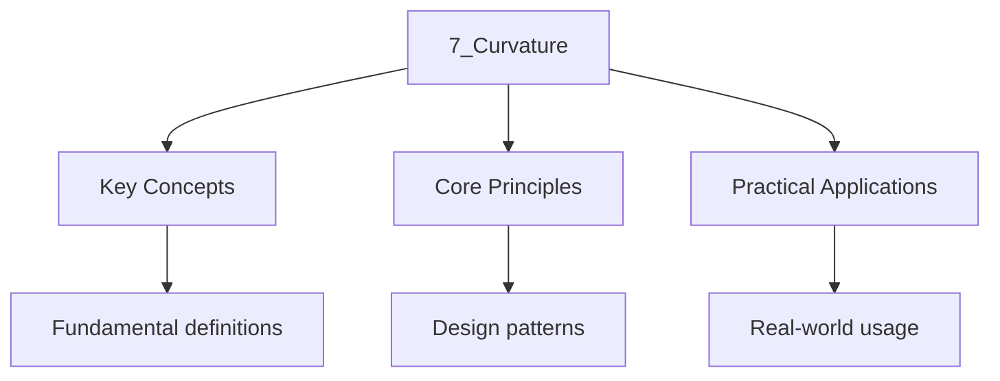

---

date: 2026-07-23T21:57:32+01:00
title: "Curvature | Mathematics - Wyatt's Notes"
tags:
  - Mathematics
  - University
description: 'Curvature: comprehensive educational content notes with precise definitions, worked examples, common pitfalls, and practice problems.'
---

<!-- Breadcrumb Schema for SEO -->

### 7.1 The Riemann Curvature Tensor

The **Riemann curvature tensor** $R$ is defined by:

$$R(X, Y)Z = \nabla_X \nabla_Y Z - \nabla_Y \nabla_X Z - \nabla_{[X, Y]} Z$$

In local coordinates:
$R^i_{\,jkl}\, \frac{\partial}{\partial x^i} = R\left(\frac{\partial}{\partial x^k}, \frac{\partial}{\partial x^l}\right)\frac{\partial}{\partial x^j}$.

**Symmetries of the Riemann tensor:**

1. $R_{ijkl} = -R_{jikl}$ (anti-symmetric in first two indices).
2. $R_{ijkl} = -R_{ijlk}$ (anti-symmetric in last two indices).
3. $R_{ijkl} = R_{klij}$ (pair symmetry).
4. $R_{ijkl} + R_{iklj} + R_{iljk} = 0$ (first Bianchi identity).

### 7.2 Sectional Curvature

For linearly independent $u, v \in T_p M$, the **sectional curvature** of the 2-plane
$\mathrm{span}\{u, v\}$ is:

$$K(u, v) = \frac{\langle R(u, v)v, u\rangle}{\|u\|^2 \|v\|^2 - \langle u, v\rangle^2}$$

**Example.** $\mathbb{R}^n$ has $K \equiv 0$ (flat). $S^n$ has $K \equiv 1$ (constant positive
curvature). $H^n$ (hyperbolic space) has $K \equiv -1$ (constant negative curvature).

### 7.3 Ricci Curvature and Scalar Curvature

The **Ricci tensor** is the trace of the Riemann tensor:

$$\mathrm{Ric}(X, Y) = \mathrm{tr}(Z \mapsto R(Z, X)Y) = \sum_i \langle R(e_i, X)Y, e_i\rangle$$

In coordinates: $\mathrm{Ric}_{jk} = R^i_{\,jik}$.

The **scalar curvature** is the trace of the Ricci tensor:

$$S = \mathrm{tr}_g(\mathrm{Ric}) = g^{jk}\, \mathrm{Ric}_{jk}$$

### 7.4 Curvature in Physics

as a rule relativity, spacetime is a 4-dimensional Lorentzian manifold $(M, g)$. The Einstein field
equations relate the curvature of spacetime to the stress-energy tensor:

$$R_{\mu\nu} - \frac{1}{2} R g_{\mu\nu} + \Lambda g_{\mu\nu} = \frac{8\pi G}{c^4} T_{\mu\nu}$$

where $R_{\mu\nu}$ is the Ricci tensor, $R$ is the scalar curvature, $\Lambda$ is the cosmological
constant, and $T_{\mu\nu}$ is the stress-energy tensor.

### 7.5 The Second Bianchi Identity and the Einstein Tensor

**Theorem 7.1 (Second Bianchi Identity).** The covariant derivative of the Riemann tensor satisfies:

$$\nabla_{[i} R_{jk]lm} = 0$$

Taking a contraction gives the **contracted Bianchi identity**:

$$\nabla^i \mathrm{Ric}_{ij} = \frac{1}{2} \nabla_j S$$

This implies that the **Einstein tensor** $G_{\mu\nu} = R_{\mu\nu} - \frac{1}{2}R g_{\mu\nu}$ is
divergence-free: $\nabla^\mu G_{\mu\nu} = 0$, which is consistent with the conservation of
energy-momentum.

### 7.6 The Weyl Tensor

The Riemann tensor can be decomposed into the Ricci part and the **Weyl tensor** $W$:

$$R_{ijkl} = C_{ijkl} + \frac{1}{n-2}(g_{ik}R_{jl} - g_{il}R_{jk} - g_{jk}R_{il} + g_{jl}R_{ik}) - \frac{R}{(n-1)(n-2)}(g_{ik}g_{jl} - g_{il}g_{jk})$$

where $C_{ijkl}$ is the Weyl tensor. The Weyl tensor is trace-free (all contractions vanish) and
has the same symmetries as the Riemann tensor. In dimension $n \geq 4$, $C = 0$ if and only if the
manifold is conformally flat.

### 7.7 Einstein Manifolds

A Riemannian manifold is an **Einstein manifold** if the Ricci tensor is proportional to the metric:

$$\mathrm{Ric} = \lambda g$$

for some constant $\lambda$. In this case, the scalar curvature $S = n\lambda$ is constant. Examples
include space forms (constant sectional curvature) and Calabi-Yau manifolds (Ricci-flat, $\lambda = 0$).

### 7.8 Curvature in Local Coordinates

In local coordinates, the components of the Riemann tensor are expressed in terms of Christoffel
symbols:

$$R^i_{\,jkl} = \partial_k \Gamma^i_{jl} - \partial_l \Gamma^i_{jk} + \Gamma^i_{km} \Gamma^m_{jl} - \Gamma^i_{lm} \Gamma^m_{jk}$$

**Worked example.** For the 2-sphere $S^2$ with metric
$g = d\theta^2 + \sin^2\theta\, d\phi^2$, the only non-zero Christoffel symbols are
$\Gamma^\phi_{\theta\phi} = \cot\theta$ and $\Gamma^\theta_{\phi\phi} = -\sin\theta\cos\theta$.
The Riemann tensor has a single independent component:

$$R^\theta_{\,\phi\theta\phi} = \sin^2\theta$$

from which $R_{\theta\phi\theta\phi} = \sin^2\theta$ and $K = 1$.

### 7.9 Practice Problems

**Problem 1.** Compute the Riemann tensor for the Poincaré half-plane
$\mathbb{H}^2 = \{(x, y) : y > 0\}$ with metric $g = (dx^2 + dy^2)/y^2$.

**Problem 2.** Show that the scalar curvature of a product manifold $M \times N$ is the sum of the
scalar curvatures: $S_{M\times N} = S_M + S_N$.

**Problem 3.** Prove that if $\mathrm{Ric} = \lambda g$ on a connected manifold, then $\lambda$ is
constant.

**Problem 4.** For the Schwarzschild metric
$ds^2 = -(1 - 2M/r) dt^2 + (1 - 2M/r)^{-1} dr^2 + r^2 d\Omega^2$, verify that the Ricci tensor
vanishes (vacuum solution).

### 7.10 Curvature of Submanifolds

The **Gauss equation** relates the curvature of a submanifold $N \subseteq M$ to the curvature
of $M$ and the second fundamental form $II$:

$$\langle R_N(X, Y)Z, W\rangle = \langle R_M(X, Y)Z, W\rangle + \langle II(X, Z), II(Y, W)\rangle - \langle II(X, W), II(Y, Z)\rangle$$

For a surface in $\mathbb{R}^3$, the Gauss equation gives the Gaussian curvature $K$ as the product
of principal curvatures: $K = \kappa_1 \kappa_2$.

### 7.11 Curvature and Holonomy

The **holonomy group** of a connection measures how parallel transport around closed loops changes
vectors. The Riemann curvature tensor is the infinitesimal holonomy: for an infinitesimal
parallelogram spanned by $X, Y$, parallel transport around the loop rotates a vector $Z$ by
$R(X, Y)Z$.

**Example.** On $S^2$, parallel transport around a spherical triangle rotates a vector by an angle
equal to the area of the triangle (Gauss-Bonnet).

### 7.12 The Gauss-Bonnet Theorem

**Theorem 7.2 (Gauss-Bonnet).** For a compact, oriented Riemannian 2-manifold $M$:

$$\int_M K\, dA = 2\pi \chi(M)$$

where $\chi(M)$ is the Euler characteristic. This deep result links local curvature to global
topology.

### 7.13 Additional Practice Problems

**Problem 5.** Show that for a surface of revolution obtained by rotating $y = f(x)$ around the
$x$-axis, the Gaussian curvature is $K = -f''(x)/(f(x)(1 + f'(x)^2)^2)$.

**Problem 6.** Compute the Ricci tensor and scalar curvature of $S^2 \times S^2$ with the product
metric.

**Problem 7.** Prove that a Riemannian manifold with constant sectional curvature $\kappa$ is
Einstein with $\mathrm{Ric} = (n-1)\kappa\, g$.

## Cross-References

- **[Tangent Spaces and Tangent Bundles](./2_tangent-spaces-and-tangent-bundles)**: Defines the tangent bundle and connections on which the Riemann curvature tensor is built.
- **[The Gauss-Bonnet Theorem](./8_the-gauss-bonnet-theorem)**: Connects the total Gaussian curvature of a surface to its Euler characteristic, a deep link between local geometry and global topology.
- **[Applications](./9_applications)**: Applies curvature concepts to general relativity, gauge theory, and minimal surfaces.

- [Quantum Mechanics](https://physics.wyattau.com/docs/quantum-mechanics)
- [Graph Theory](https://computer-science.wyattau.com/docs/graph-theory)
- [Classical Mechanics](https://physics.wyattau.com/docs/classical-mechanics)
- [Electromagnetism](https://physics.wyattau.com/docs/electromagnetism)

### 7.14 Common Mistakes

## Intuition

Curvature measures how much a space bends. For a surface embedded in $\mathbb{R}^3$, Gaussian curvature is intrinsic — it can be measured by inhabitants of the surface without reference to the ambient space (Gauss's Theorema Egregium). Positive curvature means the surface curves like a sphere; negative curvature means it curves like a saddle; zero curvature means it is locally flat. The Riemann tensor captures the full curvature information in higher dimensions, encoding how parallel transport around a loop rotates a vector. The Gauss-Bonnet theorem is a deep bridge between local geometry and global topology: the total curvature of a compact surface equals $2\pi$ times its Euler characteristic.

### 7.14 Common Mistakes

**Mistake 1: Confusing Gaussian curvature with sectional curvature**
Gaussian curvature is the sectional curvature of a 2-dimensional surface, while sectional curvature is defined for any 2-plane in the tangent space of a higher-dimensional manifold. Gaussian curvature is an intrinsic invariant of surfaces (Gauss's Theorema Egregium), but sectional curvature requires the full Riemann tensor in higher dimensions.

**Mistake 2: Assuming Ricci curvature determines the full Riemann tensor**
The Ricci tensor is a trace of the Riemann tensor and loses information. Two manifolds can have the same Ricci tensor but different Riemann tensors (and hence different sectional curvatures). In dimension $3$, the Riemann tensor is determined by the Ricci tensor, but in dimension $4$ and above, the Weyl tensor carries additional information.

**Mistake 3: Confusing scalar curvature with Gaussian curvature**
Scalar curvature is the trace of the Ricci tensor and is a single number at each point, while Gaussian curvature is the product of principal curvatures for a surface. On a 2-dimensional manifold, $S = 2K$ where $K$ is the Gaussian curvature. In higher dimensions, scalar curvature is a coarser invariant than sectional curvature.
