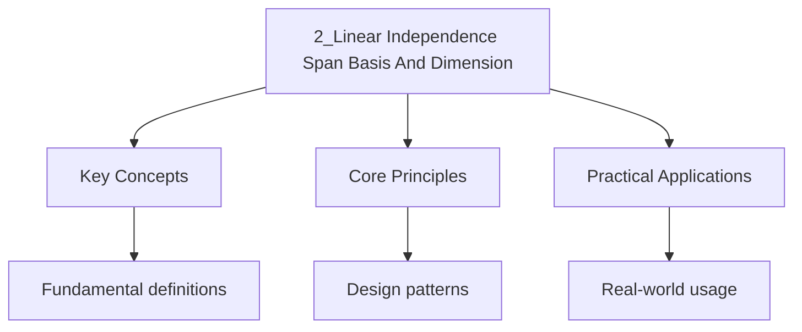

---

date: 2026-07-23T21:57:32+01:00
title: Linear Independence, Span, Basis, and Dimension
tags:
  - Mathematics
  - University
description: 'Comprehensive educational content notes on linear independence, span, basis, and dimension with precise definitions, worked examples, and common pitfalls.'
---

<!-- Breadcrumb Schema for SEO -->

### 2.1 Linear Independence

A set of vectors $\{\mathbf{v}_1, \mathbf{v}_2, \ldots, \mathbf{v}_k\} \subseteq V$ is **linearly
Independent** if the equation

$$\alpha_1 \mathbf{v}_1 + \alpha_2 \mathbf{v}_2 + \cdots + \alpha_k \mathbf{v}_k = \mathbf{0}$$

Implies $\alpha_1 = \alpha_2 = \cdots = \alpha_k = 0$. Otherwise the set is **linearly dependent**.

**Proposition 2.1 (Equivalent formulations).** The following are equivalent for vectors
$\mathbf{v}_1, \ldots, \mathbf{v}_k \in V$:

1. $\{\mathbf{v}_1, \ldots, \mathbf{v}_k\}$ is linearly independent.
2. No $\mathbf{v}_j$ can be written as a linear combination of the remaining vectors.
3. If $\sum_{i=1}^k \alpha_i \mathbf{v}_i = \sum_{i=1}^k \beta_i \mathbf{v}_i$ Then
   $\alpha_i = \beta_i$ for all $i$.

_Proof._ (1 $\Rightarrow$ 2): If $\mathbf{v}_j = \sum_{i \neq j} \alpha_i \mathbf{v}_i$ Then
$\sum_{i \neq j} \alpha_i \mathbf{v}_i - \mathbf{v}_j = \mathbf{0}$ gives a non-trivial linear
Dependence, contradicting (1).

(2 $\Rightarrow$ 3): If $\sum (\alpha_i - \beta_i)\mathbf{v}_i = \mathbf{0}$ Then by linear
Independence (which follows from (2)), $\alpha_i = \beta_i$ for all $i$.

(3 $\Rightarrow$ 1): If $\sum \alpha_i \mathbf{v}_i = \mathbf{0} = \sum 0 \cdot \mathbf{v}_i$ Then
by (3), $\alpha_i = 0$ for all $i$. $\blacksquare$

### 2.2 Span

The **span** of a set $S \subseteq V$Denoted $\mathrm{span}(S)$Is the set of all finite linear
Combinations of elements of $S$:

$$\mathrm{span}(S) = \left\{ \sum_{i=1}^k \alpha_i \mathbf{v}_i : k \in \mathbb{N},\, \alpha_i \in F,\, \mathbf{v}_i \in S \right\}$$

**Proposition 2.2.** $\mathrm{span}(S)$ is always a subspace of $V$. In fact, $\mathrm{span}(S)$ is
The smallest subspace containing $S$: if $W$ is any subspace with $S \subseteq W$ Then
$\mathrm{span}(S) \subseteq W$.

_Proof._ $\mathrm{span}(S)$ is non-empty since $\mathbf{0} = 0 \cdot \mathbf{v}$ for any
$\mathbf{v} \in S$. Closure under addition and scalar multiplication follows directly from the
Definition of linear combinations. For minimality, any subspace $W$ containing $S$ must contain all
Finite linear combinations of elements of $S$ by Proposition 1.2, so $\mathrm{span}(S) \subseteq W$.
$\blacksquare$

### 2.3 Basis and Dimension

A set $B \subseteq V$ is a **basis** for $V$ if:

1. $B$ is linearly independent, and
2. $\mathrm{span}(B) = V$.

**Theorem 2.1.** Every vector space has a basis. All bases of a finite-dimensional vector space have
The same number of elements.

The **dimension** of $V$Denoted $\dim(V)$Is the cardinality of any basis for $V$.

### 2.4 Steinitz Exchange Lemma

**Lemma 2.3 (Steinitz Exchange Lemma).** Let $\{\mathbf{u}_1, \ldots, \mathbf{u}_k\}$ be a linearly
Independent set in $V$ And let $\{\mathbf{w}_1, \ldots, \mathbf{w}_m\}$ be a spanning set for $V$.
Then $k \leq m$ And after relabelling the $\mathbf{w}_j$The set

$$\{\mathbf{u}_1, \ldots, \mathbf{u}_k, \mathbf{w}_{k+1}, \ldots, \mathbf{w}_m\}$$

Also spans $V$.

_Proof._ We proceed by induction on $k$. For $k = 0$ there is nothing to prove.

Assume the result holds for $k - 1$. Since $\{\mathbf{u}_1, \ldots, \mathbf{u}_k\}$ is linearly
Independent, $\mathbf{u}_k \neq \mathbf{0}$ and
$\mathbf{u}_k \in \mathrm{span}\{\mathbf{w}_1, \ldots, \mathbf{w}_m\}$ Since the $\mathbf{w}_j$ span
$V$. Therefore $\mathbf{u}_k = \sum_{j=1}^m \alpha_j \mathbf{w}_j$ for some $\alpha_j \in F$ And not
all $\alpha_j$ are zero.

After relabelling, assume $\alpha_1 \neq 0$. Then
$\mathbf{w}_1 = \alpha_1^{-1}(\mathbf{u}_k - \sum_{j=2}^m \alpha_j \mathbf{w}_j)$ So
$\mathbf{w}_1 \in \mathrm{span}\{\mathbf{u}_k, \mathbf{w}_2, \ldots, \mathbf{w}_m\}$. It follows
that

$$\mathrm{span}\{\mathbf{w}_1, \ldots, \mathbf{w}_m\} = \mathrm{span}\{\mathbf{u}_k, \mathbf{w}_2, \ldots, \mathbf{w}_m\} = V$$

Now $\{\mathbf{u}_1, \ldots, \mathbf{u}_{k-1}\}$ is linearly independent and
$\{\mathbf{u}_k, \mathbf{w}_2, \ldots, \mathbf{w}_m\}$ spans $V$. By the inductive hypothesis,
$k - 1 \leq m - 1$ (so $k \leq m$) and after relabelling,
$\{\mathbf{u}_1, \ldots, \mathbf{u}_{k-1}, \mathbf{w}_k, \ldots, \mathbf{w}_m\}$ spans $V$. Since
$\mathbf{u}_k$ is already in this span, the full set
$\{\mathbf{u}_1, \ldots, \mathbf{u}_k, \mathbf{w}_{k+1}, \ldots, \mathbf{w}_m\}$ also spans $V$.
$\blacksquare$

**Theorem 2.4 (Dimension is Well-Defined).** If $V$ is finite-dimensional, then any two bases of $V$
have the same number of elements.

_Proof._ Let $\mathcal{B}_1$ and $\mathcal{B}_2$ be two bases with $\lvert\mathcal{B}_1\rvert = k$
and $\lvert\mathcal{B}_2\rvert = m$. Applying the Steinitz exchange lemma with $\mathcal{B}_1$ as
the Independent set and $\mathcal{B}_2$ as the spanning set gives $k \leq m$. Swapping roles gives
$m \leq k$. Hence $k = m$. $\blacksquare$

### 2.5 Dimension Formula

**Theorem 2.5 (Dimension Formula).** If $U$ and $W$ are subspaces of a finite-dimensional vector
Space $V$ Then

$$\dim(U + W) = \dim(U) + \dim(W) - \dim(U \cap W)$$

### 2.6 Rank-Nullity Theorem

**Theorem 2.6 (Rank-Nullity Theorem).** Let $A \in \mathcal{M}_{m \times n}(F)$. Then

$$\mathrm{rank}(A) + \mathrm{nullity}(A) = n$$

Where $\mathrm{rank}(A) = \dim(\mathrm{col}(A))$ and $\mathrm{nullity}(A) = \dim(\mathrm{null}(A))$.

_Proof._ Let $\{\mathbf{v}_1, \ldots, \mathbf{v}_k\}$ be a basis for $\mathrm{null}(A)$Where
$k = \mathrm{nullity}(A)$. Extend this to a basis
$\{\mathbf{v}_1, \ldots, \mathbf{v}_k, \mathbf{v}_{k+1}, \ldots, \mathbf{v}_n\}$ for $F^n$.

We claim that $\{A\mathbf{v}_{k+1}, \ldots, A\mathbf{v}_n\}$ is a basis for $\mathrm{col}(A)$.

_Spanning:_ For any $\mathbf{y} \in \mathrm{col}(A)$There exists $\mathbf{x} \in F^n$ With
$\mathbf{y} = A\mathbf{x}$. Writing $\mathbf{x} = \sum_{i=1}^n \alpha_i \mathbf{v}_i$

$$\mathbf{y} = A\left(\sum_{i=1}^n \alpha_i \mathbf{v}_i\right) = \sum_{i=1}^n \alpha_i A\mathbf{v}_i = \sum_{i=k+1}^n \alpha_i A\mathbf{v}_i$$

Since $A\mathbf{v}_i = \mathbf{0}$ for $i \leq k$.

_Linear independence:_ If $\sum_{i=k+1}^n \alpha_i A\mathbf{v}_i = \mathbf{0}$ Then
$A\left(\sum_{i=k+1}^n \alpha_i \mathbf{v}_i\right) = \mathbf{0}$ So
$\sum_{i=k+1}^n \alpha_i \mathbf{v}_i \in \mathrm{null}(A)$. Since
$\{\mathbf{v}_1, \ldots, \mathbf{v}_k\}$ Is a basis for the null space,
$\sum_{i=k+1}^n \alpha_i \mathbf{v}_i = \sum_{i=1}^k \beta_i \mathbf{v}_i$ For some $\beta_i$Giving
$\sum_{i=1}^n (-\beta_i)\mathbf{v}_i + \sum_{i=k+1}^n \alpha_i \mathbf{v}_i = \mathbf{0}$. By linear
independence of the full basis, $\alpha_i = 0$ for all $i \geq k + 1$.

Therefore $\mathrm{rank}(A) = n - k = n - \mathrm{nullity}(A)$. $\blacksquare$

### 2.7 Worked Examples

**Problem.** Find a basis for and the dimension of the subspace
$W = \mathrm{span}\{(1, 2, -1, 0), (3, 1, 0, 2), (-1, 3, -2, -2)\}$ of $\mathbb{R}^4$.

Solution

Form the matrix whose rows are the given vectors and row-reduce:

$$\begin{pmatrix} 1 & 2 & -1 & 0 \\ 3 & 1 & 0 & 2 \\ -1 & 3 & -2 & -2 \end{pmatrix} \xrightarrow{R_2 - 3R_1} \begin{pmatrix} 1 & 2 & -1 & 0 \\ 0 & -5 & 3 & 2 \\ -1 & 3 & -2 & -2 \end{pmatrix}$$

$$\xrightarrow{R_3 + R_1} \begin{pmatrix} 1 & 2 & -1 & 0 \\ 0 & -5 & 3 & 2 \\ 0 & 5 & -3 & -2 \end{pmatrix} \xrightarrow{R_3 + R_2} \begin{pmatrix} 1 & 2 & -1 & 0 \\ 0 & -5 & 3 & 2 \\ 0 & 0 & 0 & 0 \end{pmatrix}$$

The row echelon form has two non-zero rows, so $\dim(W) = 2$. A basis is given by the non-zero Rows:
$\{(1, 2, -1, 0), (0, -5, 3, 2)\}$. $\blacksquare$

**Problem.** Find a basis for the null space of

$$A = \begin{pmatrix} 1 & 2 & 1 & -1 \\ 2 & 4 & 0 & 1 \\ 0 & 0 & 1 & 3 \end{pmatrix}$$

Solution

Row-reduce $A$:

$$\begin{pmatrix} 1 & 2 & 1 & -1 \\ 2 & 4 & 0 & 1 \\ 0 & 0 & 1 & 3 \end{pmatrix} \xrightarrow{R_2 - 2R_1} \begin{pmatrix} 1 & 2 & 1 & -1 \\ 0 & 0 & -2 & 3 \\ 0 & 0 & 1 & 3 \end{pmatrix} \xrightarrow{R_3 + R_2/2} \begin{pmatrix} 1 & 2 & 1 & -1 \\ 0 & 0 & -2 & 3 \\ 0 & 0 & 0 & 9/2 \end{pmatrix}$$

This has pivots in columns 1, 3, and 4. The free variable is $x_2$. Setting $x_2 = t$ and
Back-substituting: $x_4 = 0$, $x_3 = 0$, $x_1 = -2t$. The null space is
$\{t(-2, 1, 0, 0) : t \in \mathbb{R}\}$With basis $\{(-2, 1, 0, 0)\}$ and dimension 1.
$\blacksquare$

**Problem.** Determine whether the vectors $\mathbf{v}_1 = (1, 2, 3)$, $\mathbf{v}_2 = (4, 5, 6)$,
$\mathbf{v}_3 = (7, 8, 9)$ form a basis For $\mathbb{R}^3$.

Solution

Form the matrix $A = [\mathbf{v}_1 \mid \mathbf{v}_2 \mid \mathbf{v}_3]$ and compute Its
determinant:

$$\det(A) = 1(45 - 48) - 2(36 - 42) + 3(32 - 35) = -3 + 12 - 9 = 0$$

Since $\det(A) = 0$The columns are linearly dependent, so
$\{\mathbf{v}_1, \mathbf{v}_2, \mathbf{v}_3\}$ Is not a basis. In fact,
$\mathbf{v}_3 - 2\mathbf{v}_2 + \mathbf{v}_1 = \mathbf{0}$.

$\blacksquare$

:::tip
whose Columns are those vectors. If $\det \neq 0$They form a basis; if $\det = 0$They do not.

**Problem.** Let $V = \mathcal{P}_3(\mathbb{R})$ (polynomials of degree at most 3). Find the
dimension Of the subspace $W = \{p \in \mathcal{P}_3 : p(1) = p(-1) = 0\}$.

Solution

Write $p(x) = ax^3 + bx^2 + cx + d$. The conditions are:

$p(1) = a + b + c + d = 0$ and $p(-1) = -a + b - c + d = 0$.

Adding: $2b + 2d = 0$ So $d = -b$. Subtracting: $2a + 2c = 0$ So $c = -a$.

Therefore $p(x) = ax^3 + bx^2 - ax - b = a(x^3 - x) + b(x^2 - 1)$.

A basis for $W$ is $\{x^3 - x, x^2 - 1\}$ And $\dim(W) = 2$.

_If you get this wrong, revise: Section 2.7 (Worked Examples)._

### 2.8 Intuition: What Do These Concepts Mean Geometrically?

**Linear independence** captures the idea that no vector in the set is "redundant." If you have
three vectors in $\mathbb{R}^3$ and one of them lies in the plane spanned by the other two, then
that third vector adds no new directions. The three vectors are linearly dependent, and their span
is a plane (2-dimensional), not all of $\mathbb{R}^3$.

**Span** answers the question: "What is the largest subspace I can reach using these vectors?"
If you think of each vector as an arrow, the span is the set of all destinations you can reach by
traveling along these arrows (and their negatives), possibly stretching them. For two non-parallel
vectors in $\mathbb{R}^3$, the span is a plane through the origin.

**Basis** combines both ideas: a basis is a set that spans the entire space with no redundancy.
It is a "minimal spanning set" and a "maximal linearly independent set" simultaneously.

**Dimension** counts the number of independent directions. $\mathbb{R}^3$ has dimension 3 because
you need exactly three independent vectors (e.g., the standard basis $\mathbf{e}_1, \mathbf{e}_2,
\mathbf{e}_3$) to reach every point. No two vectors suffice, and four vectors must be linearly
dependent.

**The key theorem** (Steinitz exchange) says that any linearly independent set can be extended to a
basis by swapping in vectors from any spanning set. This is analogous to the following physical
process: given a set of non-redundant directions and a set of directions that cover all of space, you
can systematically replace redundant spanning directions with your independent ones.

### 2.9 Worked Example: Basis for the Row Space

**Problem.** Find a basis for the row space of
$A = \begin{pmatrix} 1 & 2 & 3 \\ 4 & 5 & 6 \\ 7 & 8 & 9 \end{pmatrix}$ and determine its
dimension.

Solution

Row-reduce $A$:

$$\begin{pmatrix} 1 & 2 & 3 \\ 4 & 5 & 6 \\ 7 & 8 & 9 \end{pmatrix} \xrightarrow{R_2 - 4R_1, R_3 - 7R_1} \begin{pmatrix} 1 & 2 & 3 \\ 0 & -3 & -6 \\ 0 & -6 & -12 \end{pmatrix}$$

$$\xrightarrow{R_3 - 2R_2} \begin{pmatrix} 1 & 2 & 3 \\ 0 & -3 & -6 \\ 0 & 0 & 0 \end{pmatrix}$$

The non-zero rows form a basis for the row space: $\{(1, 2, 3), (0, -3, -6)\}$, or equivalently
$\{(1, 2, 3), (0, 1, 2)\}$ after scaling. The dimension of the row space is 2.

Note that $\mathrm{rank}(A) = 2 < 3 = n$, so $A$ is singular. The null space has dimension
$3 - 2 = 1$, with basis $\{(1, -2, 1)^T\}$.

**Connection to determinants:** $\det(A) = 0$ because the rank is less than 3, which is consistent
with the fact that the columns (and rows) are linearly dependent. Indeed, the third column equals
twice the second minus the first: $3 = 2(2) - 1$, $6 = 2(5) - 4$, $9 = 2(8) - 7$.
$\blacksquare$

### 2.10 Common Pitfalls

- **Linear independence of infinitely many vectors.** The definition only directly applies to finite
  subsets. A set $S$ is linearly independent if every finite subset of $S$ is linearly independent.
- **Dimension and spanning.** A set of $n$ vectors in $\mathbb{R}^n$ that spans $\mathbb{R}^n$ must
  be linearly independent (and hence a basis). Similarly, $n$ linearly independent vectors in
  $\mathbb{R}^n$ must span $\mathbb{R}^n$.
- **The empty set spans $\{\mathbf{0}\}$.** The span of the empty set is the trivial subspace, and
  the empty set is a basis for $\{\mathbf{0}\}$. The dimension of the zero space is 0.
- **Row space and column space have the same dimension (rank), but are different subspaces.** The
  row space is a subspace of $\mathbb{R}^n$ (rows of $A$), while the column space is a subspace of
  $\mathbb{R}^m$ (columns of $A$). For non-square matrices, they live in different ambient spaces.
- **A basis is not unique.** Any set of $n$ linearly independent vectors in $\mathbb{R}^n$ is a
  basis. The standard basis is convenient but not special. Changing basis corresponds to a change of
  coordinates, and the dimension is invariant under such changes.

---

<!-- Breadcrumb Schema for SEO -->

## Cross-References

- **[Vectors and Vector Spaces](1_vectors-and-vector-spaces)**: Linear independence, span, and basis are fundamental properties of vector spaces.
- **[Matrices](3_matrices)**: The rank of a matrix equals the dimension of its column space, connecting matrix theory to basis theory.
- **[Systems of Linear Equations](4_systems-of-linear-equations)**: The solution space of a homogeneous system is a subspace whose dimension is determined by rank-nullity.
:::
- [Quantum Mechanics](https://physics.wyattau.com/docs/quantum-mechanics)
- [Graph Theory](https://computer-science.wyattau.com/docs/graph-theory)
