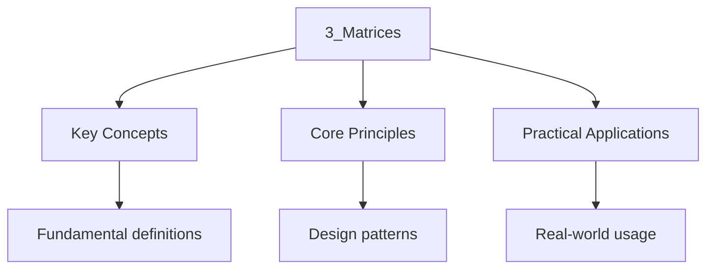

---

date: 2026-07-23T21:57:32+01:00
title: "Matrices | Mathematics - Wyatt's Notes"
tags:
  - Mathematics
  - University
description: 'An matrix over is a rectangular array of elements from Arranged in rows and columns. The set of all such matrices is denoted .'
---

<!-- Breadcrumb Schema for SEO -->

### 3.1 Matrix Operations

An $m \times n$ matrix $A$ over $F$ is a rectangular array of $mn$ elements from $F$Arranged in $m$
rows and $n$ columns. The set of all such matrices is denoted $\mathcal{M}_{m \times n}(F)$.

**Addition.** For $A, B \in \mathcal{M}_{m \times n}(F)$, $(A + B)_{ij} = A_{ij} + B_{ij}$.

**Scalar multiplication.** For $\alpha \in F$ and $A \in \mathcal{M}_{m \times n}(F)$
$(\alpha A)_{ij} = \alpha A_{ij}$.

**Matrix multiplication.** For $A \in \mathcal{M}_{m \times n}(F)$ and
$B \in \mathcal{M}_{n \times p}(F)$ The product $AB \in \mathcal{M}_{m \times p}(F)$ is defined by

$$(AB)_{ij} = \sum_{k=1}^n A_{ik} B_{kj}$$

**Proposition 3.1.** Matrix multiplication is associative but not commutative .

_Proof._ Associativity: $(AB)C$ has $(i,j)$-entry
$\sum_l (\sum_k A_{ik} B_{kl}) C_{lj} = \sum_k A_{ik} (\sum_l B_{kl} C_{lj}) = (A(BC))_{ij}$ By
interchanging the order of summation (both sums are finite). For non-commutativity,
$A = \begin{pmatrix} 0 & 1 \\ 0 & 0 \end{pmatrix}$ and
$B = \begin{pmatrix} 0 & 0 \\ 1 & 0 \end{pmatrix}$ give
$AB = \begin{pmatrix} 1 & 0 \\ 0 & 0 \end{pmatrix} \neq \begin{pmatrix} 0 & 0 \\ 0 & 1 \end{pmatrix} = BA$.
$\blacksquare$

### 3.2 Transpose

The **transpose** of $A \in \mathcal{M}_{m \times n}(F)$Denoted $A^T$Is the $n \times m$ matrix With
$(A^T)_{ij} = A_{ji}$.

**Properties of transpose:**

1. $(A + B)^T = A^T + B^T$
2. $(\alpha A)^T = \alpha A^T$
3. $(AB)^T = B^T A^T$
4. $(A^T)^T = A$

### 3.3 Inverse Matrices

A square matrix $A \in \mathcal{M}_{n \times n}(F)$ is **invertible** if there exists a matrix
$A^{-1} \in \mathcal{M}_{n \times n}(F)$ such that

$$AA^{-1} = A^{-1}A = I_n$$

**Theorem 3.1.** The following are equivalent for $A \in \mathcal{M}_{n \times n}(F)$:

1. $A$ is invertible.
2. $\det(A) \neq 0$.
3. The columns of $A$ are linearly independent.
4. The rows of $A$ are linearly independent.
5. $\mathrm{rank}(A) = n$.
6. The equation $A\mathbf{x} = \mathbf{b}$ has a unique solution for every $\mathbf{b}$.
7. The only solution to $A\mathbf{x} = \mathbf{0}$ is $\mathbf{x} = \mathbf{0}$.

### 3.4 Determinants

The **determinant** is a function $\det : \mathcal{M}_{n \times n}(F) \to F$ defined recursively by
**Laplace expansion** along the first row:

$$\det(A) = \sum_{j=1}^n (-1)^{1+j} a_{1j} M_{1j}$$

Where $M_{1j}$ is the $(1,j)$-minor (the determinant of the $(n-1) \times (n-1)$ matrix obtained by
Deleting row 1 and column $j$).

The $(i,j)$-**cofactor** is $C_{ij} = (-1)^{i+j} M_{ij}$ So $\det(A) = \sum_{j=1}^n a_{ij} C_{ij}$
for any fixed row $i$.

### 3.5 Properties of Determinants

**Proposition 3.2 (Effect of Row Operations).** Let $A \in \mathcal{M}_{n \times n}(F)$.

1. Swapping two rows of $A$ multiplies the determinant by $-1$.
2. Multiplying a row of $A$ by $\alpha \in F$ multiplies the determinant by $\alpha$.
3. Adding a multiple of one row to another leaves the determinant unchanged.

_Proof._ (1) This follows from the antisymmetry of the Leibniz formula
$\det(A) = \sum_{\sigma \in S_n} \mathrm{sgn}(\sigma) \prod_{i=1}^n a_{i,\sigma(i)}$. Swapping two
rows Changes the sign of every permutation, hence the sign of the sum.

(2) Multiplying row $i$ by $\alpha$ multiplies every term in the Leibniz expansion by $\alpha$ Hence
$\det$ is multiplied by $\alpha$.

(3) Adding $\alpha$ times row $j$ to row $i$ ($i \neq j$): by multilinearity in row $i$

$$\det(\mathrm{new}~A) = \det(A) + \alpha \cdot \det(\mathrm{matrix}~with~rows~i\mathrm{~and~j\mathrm}{~equal)}$$

A matrix with two equal rows has determinant 0 (by antisymmetry: swapping them leaves the matrix
Unchanged but multiplies $\det$ by $-1$ So $\det = -\det$Hence $\det = 0$). Therefore
$\det(\mathrm{new}~A) = \det(A)$. $\blacksquare$

**Theorem 3.3 (Multiplicativity).** For $A, B \in \mathcal{M}_{n \times n}(F)$

$$\det(AB) = \det(A)\det(B)$$

_Proof (via elementary matrices)._ Every matrix $B$ can be written as a product of elementary
matrices Times an upper triangular matrix: $B = E_1 E_2 \cdots E_k U$. For an elementary matrix $E$:

- If $E$ swaps rows, $\det(E) = -1$ and $\det(AE) = -\det(A) = \det(A)\det(E)$.
- If $E$ multiplies a row by $\alpha$, $\det(E) = \alpha$ and
  $\det(AE) = \alpha\det(A) = \det(A)\det(E)$.
- If $E$ adds a multiple of one row to another, $\det(E) = 1$ and
  $\det(AE) = \det(A) = \det(A)\det(E)$.

Thus $\det(AE) = \det(A)\det(E)$ for every elementary matrix. By induction,

$$\det(AB) = \det(A \cdot E_1 \cdots E_k U) = \det(A) \cdot \det(E_1) \cdots \det(E_k) \cdot \det(U) = \det(A) \cdot \det(B)$$

Since $\det(B) = \det(E_1)\cdots\det(E_k)\det(U)$. $\blacksquare$

**Corollary 3.4.** $\det(A^T) = \det(A)$ And for invertible $A$, $\det(A^{-1}) = 1/\det(A)$.

_Proof._ $AA^{-1} = I$ So $\det(A)\det(A^{-1}) = \det(I) = 1$Giving $\det(A^{-1}) = 1/\det(A)$. For
the transpose, use the Leibniz formula or observe that row Operations and column operations have the
same effects on the determinant. $\blacksquare$

### 3.6 Adjugate and Inverse Formula

**Definition.** The **adjugate** (or **adjoint**) of $A \in \mathcal{M}_{n \times n}(F)$ is

$$\mathrm{adj}(A) = (C_{ji})_{i,j=1}^n$$

Where $C_{ij}$ is the $(i,j)$-cofactor of $A$. That is, $\mathrm{adj}(A)$ is the transpose of the
Cofactor matrix.

**Theorem 3.5.** For any $A \in \mathcal{M}_{n \times n}(F)$

$$A \cdot \mathrm{adj}(A) = \mathrm{adj}(A) \cdot A = \det(A) \cdot I_n$$

In particular, if $\det(A) \neq 0$ Then $A^{-1} = \frac{1}{\det(A)} \mathrm{adj}(A)$.

_Proof._ The $(i,j)$-entry of $A \cdot \mathrm{adj}(A)$ is $\sum_{k=1}^n a_{ik} C_{jk}$. When
$i = j$This is $\sum_{k=1}^n a_{ik} C_{ik} = \det(A)$ (cofactor expansion along row $i$). When
$i \neq j$This is the cofactor expansion of a matrix obtained from $A$ by replacing row $j$ With row
$i$Which has two equal rows and hence determinant 0. $\blacksquare$

### 3.7 Worked Examples

**Problem.** Compute $\det(A)$ where

$$A = \begin{pmatrix} 1 & 2 & 3 \\ 0 & 1 & 4 \\ 5 & 6 & 0 \end{pmatrix}$$

Solution

Expanding along the first column:

$$\det(A) = 1 \cdot \det\begin{pmatrix} 1 & 4 \\ 6 & 0 \end{pmatrix} - 0 + 5 \cdot \det\begin{pmatrix} 2 & 3 \\ 1 & 4 \end{pmatrix}$$

$$= 1 \cdot (0 - 24) + 5 \cdot (8 - 3) = -24 + 25 = 1$$

$\blacksquare$

**Problem.** Compute $\det(A)$ by row reduction where

$$A = \begin{pmatrix} 2 & 1 & 3 & 1 \\ 4 & 2 & 5 & 3 \\ 6 & 3 & 8 & 5 \\ 1 & 1 & 1 & 1 \end{pmatrix}$$

Solution

Apply row operations and track their effect on the determinant:

$$\begin{pmatrix} 2 & 1 & 3 & 1 \\ 4 & 2 & 5 & 3 \\ 6 & 3 & 8 & 5 \\ 1 & 1 & 1 & 1 \end{pmatrix} \xrightarrow{R_2 - 2R_1, R_3 - 3R_1} \begin{pmatrix} 2 & 1 & 3 & 1 \\ 0 & 0 & -1 & 1 \\ 0 & 0 & -1 & 2 \\ 0 & 1/2 & -1/2 & 1/2 \end{pmatrix}$$

The determinant is unchanged (only type 3 operations). Now swap $R_2$ and $R_4$ (multiplies $\det$
by $-1$):

$$\xrightarrow{R_2 \leftrightarrow R_4} \begin{pmatrix} 2 & 1 & 3 & 1 \\ 0 & 1/2 & -1/2 & 1/2 \\ 0 & 0 & -1 & 2 \\ 0 & 0 & -1 & 1 \end{pmatrix}$$

Now $R_4 \to R_4 - R_3$ (determinant unchanged):

$$\begin{pmatrix} 2 & 1 & 3 & 1 \\ 0 & 1/2 & -1/2 & 1/2 \\ 0 & 0 & -1 & 2 \\ 0 & 0 & 0 & -1 \end{pmatrix}$$

The determinant is the product of diagonal entries, times $-1$ for the row swap:

$$\det(A) = (-1) \cdot 2 \cdot \frac{1}{2} \cdot (-1) \cdot (-1) = -1$$

$\blacksquare$

**Problem.** Find $A^{-1}$ using the adjugate formula, where

$$A = \begin{pmatrix} 1 & 2 \\ 3 & 4 \end{pmatrix}$$

Solution

$\det(A) = 1 \cdot 4 - 2 \cdot 3 = -2 \neq 0$ So $A$ is invertible.

Cofactors: $C_{11} = 4$, $C_{12} = -3$, $C_{21} = -2$, $C_{22} = 1$.

$$\mathrm{adj}(A) = \begin{pmatrix} 4 & -2 \\ -3 & 1 \end{pmatrix}$$

$$A^{-1} = \frac{1}{-2}\begin{pmatrix} 4 & -2 \\ -3 & 1 \end{pmatrix} = \begin{pmatrix} -2 & 1 \\ 3/2 & -1/2 \end{pmatrix}$$

Verify:
$AA^{-1} = \begin{pmatrix} 1 & 2 \\ 3 & 4 \end{pmatrix}\begin{pmatrix} -2 & 1 \\ 3/2 & -1/2 \end{pmatrix} = \begin{pmatrix} -2 + 3 & 1 - 1 \\ -6 + 6 & 3 - 2 \end{pmatrix} = I_2$.
$\blacksquare$

:::caution
meaningful determinant for an $m \times n$ matrix with $m \neq n$. Do not confuse
$\det(AB) = \det(A)\det(B)$ with a Non-existent formula for non-square matrices.

### 3.8 Worked Example: Determinant via Row Reduction (Efficient Method)

**Problem.** Compute $\det(A)$ where

$$A = \begin{pmatrix} 1 & 1 & 1 & 1 \\ 1 & 2 & 3 & 4 \\ 1 & 3 & 6 & 10 \\ 1 & 4 & 10 & 20 \end{pmatrix}$$

Solution

This matrix has Pascal-like entries. We use row operations:

$$\begin{pmatrix} 1 & 1 & 1 & 1 \\ 1 & 2 & 3 & 4 \\ 1 & 3 & 6 & 10 \\ 1 & 4 & 10 & 20 \end{pmatrix} \xrightarrow{R_i - R_{i-1}} \begin{pmatrix} 1 & 1 & 1 & 1 \\ 0 & 1 & 2 & 3 \\ 0 & 1 & 3 & 6 \\ 0 & 1 & 4 & 10 \end{pmatrix} \xrightarrow{R_i - R_{i-1}} \begin{pmatrix} 1 & 1 & 1 & 1 \\ 0 & 1 & 2 & 3 \\ 0 & 0 & 1 & 3 \\ 0 & 0 & 1 & 4 \end{pmatrix}$$

$$\xrightarrow{R_4 - R_3} \begin{pmatrix} 1 & 1 & 1 & 1 \\ 0 & 1 & 2 & 3 \\ 0 & 0 & 1 & 3 \\ 0 & 0 & 0 & 1 \end{pmatrix}$$

All operations were type 3 (adding a multiple of one row to another), so the determinant is
unchanged. The upper triangular matrix has diagonal entries $1, 1, 1, 1$ so $\det(A) = 1$.
$\blacksquare$

**Proposition 3.6 (Determinant of a Triangular Matrix).** If $A$ is upper or lower triangular, then
$\det(A) = \prod_{i=1}^n a_{ii}$.

_Proof._ By repeated cofactor expansion along the first column (for upper triangular), or induction.
At each step, all terms involving off-diagonal entries vanish due to the zero structure, leaving
only the product of diagonal entries. $\blacksquare$

### 3.9 Intuition: What Does the Determinant Measure Geometrically?

The determinant of an $n \times n$ matrix $A$ measures the factor by which $A$ scales $n$-dimensional
volume. Specifically, if $S$ is any measurable subset of $\mathbb{R}^n$, then the image $A(S)$ has
$n$-dimensional volume equal to $|\det(A)|$ times the volume of $S$.

For $2 \times 2$ matrices, $\det(A)$ is the signed area of the parallelogram formed by the column
vectors of $A$. For $3 \times 3$ matrices, $|\det(A)|$ is the volume of the parallelepiped formed
by the three column vectors.

The **sign** of the determinant indicates orientation: $\det(A) > 0$ means $A$ preserves
orientation (like a rotation), while $\det(A) < 0$ means $A$ reverses orientation (like a
reflection). When $\det(A) = 0$, the image of $A$ has zero $n$-dimensional volume, meaning the
columns of $A$ are linearly dependent and $A$ "squishes" $\mathbb{R}^n$ into a lower-dimensional
subspace.

This geometric interpretation explains why $\det(AB) = \det(A)\det(B)$: the volume scaling of the
composition $AB$ is the product of the individual scalings. It also explains why $\det(A) = 0$
implies $A$ is not invertible: a map that squishes volume to zero cannot be reversed.

### 3.10 Worked Example: 3x3 Determinant by Cofactor Expansion

**Problem.** Compute $\det(A)$ where

$$A = \begin{pmatrix} 2 & -1 & 0 \\ 3 & 4 & -2 \\ 1 & 0 & 5 \end{pmatrix}$$

Solution

Expand along the first row:

$$\det(A) = 2 \cdot \det\begin{pmatrix} 4 & -2 \\ 0 & 5 \end{pmatrix} - (-1) \cdot \det\begin{pmatrix} 3 & -2 \\ 1 & 5 \end{pmatrix} + 0 \cdot \det\begin{pmatrix} 3 & 4 \\ 1 & 0 \end{pmatrix}$$

$$= 2(20 - 0) + 1(15 + 2) + 0 = 40 + 17 = 57$$

Alternatively, expand along the third row (which has a zero):

$$\det(A) = 1 \cdot \det\begin{pmatrix} -1 & 0 \\ 4 & -2 \end{pmatrix} - 0 + 5 \cdot \det\begin{pmatrix} 2 & -1 \\ 3 & 4 \end{pmatrix}$$

$$= 1(2 - 0) + 5(8 + 3) = 2 + 55 = 57 \quad \checkmark$$

The second method is faster because the zero entry in the third row eliminates one $2 \times 2$
determinant computation. Always look for rows or columns with the most zeros before choosing
which row/column to expand along.

**Geometric check:** Since $\det(A) = 57 \neq 0$, the matrix $A$ is invertible, its columns form a
basis for $\mathbb{R}^3$, and the linear map $\mathbf{x} \mapsto A\mathbf{x}$ scales volume by a
factor of 57. $\blacksquare$

### 3.11 Common Pitfalls

- **$\det(A + B) \neq \det(A) + \det(B)$.** For example, with $A = B = I_2$,
  $\det(A + B) = \det(2I_2) = 4$ but $\det(A) + \det(B) = 2$.
- **The adjugate formula is theoretically important but computationally inefficient.** For large
  matrices, use Gaussian elimination or LU decomposition to compute inverses.
- **A matrix with $\det(A) = 0$ has no inverse.** Do not attempt to divide by zero.
- **Cofactor expansion along different rows/columns gives the same answer, but some choices are
  faster.** Always expand along the row or column with the most zeros.
- **$\det(A^T) = \det(A)$, so row operations and column operations affect the determinant in the
  same way.** You can compute the determinant by reducing along rows or columns.
- **The determinant of a product is the product of determinants, but $\det(A + B)$ has no simple
  formula.** Do not distribute the determinant over addition.
- **For non-square matrices, the determinant is not defined.** Do not attempt to compute $\det(A)$
  for an $m \times n$ matrix with $m \neq n$.

---

<!-- Breadcrumb Schema for SEO -->

## Cross-References

- **[Eigenvalues and Eigenvectors](5_eigenvalues-and-eigenvectors.md)**: Eigenvalues are the roots of the characteristic polynomial defined via determinants.
- **[Systems of Linear Equations](4_systems-of-linear-equations.md)**: Gaussian elimination transforms matrices into row echelon form to solve linear systems.
- **[Singular Value Decomposition](8_singular-value-decomposition.md)**: The SVD factorises any matrix using its singular values, generalising the eigendecomposition.
:::
- [Quantum Mechanics](https://physics.wyattau.com/docs/quantum-mechanics)
- [Graph Theory](https://computer-science.wyattau.com/docs/graph-theory)
