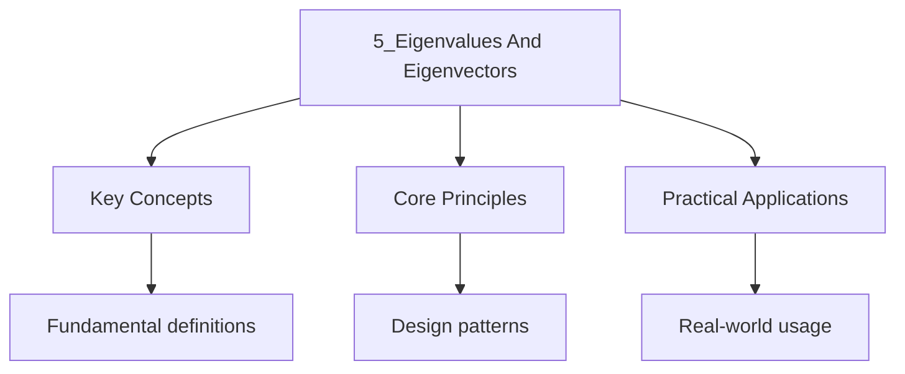

---

date: 2026-07-23T21:57:32+01:00
title: "Eigenvalues and Eigenvectors | Mathematics"
tags:
  - Mathematics
  - University
description: 'Let . A scalar is an of if there Exists a non-zero vector such that Comprehensive educational content coverage with definitions and practice problems.'
---

<!-- Breadcrumb Schema for SEO -->

### 5.1 Definitions

Let $A \in \mathcal{M}_{n \times n}(F)$. A scalar $\lambda \in F$ is an **eigenvalue** of $A$ if
there Exists a non-zero vector $\mathbf{v} \in F^n$ such that

$$A\mathbf{v} = \lambda \mathbf{v}$$

The vector $\mathbf{v}$ is called an **eigenvector** corresponding to $\lambda$.

The **eigenspace** corresponding to $\lambda$ is $E_\lambda = \ker(A - \lambda I)$. Its dimension is
The **geometric multiplicity** of $\lambda$.

### 5.2 Characteristic Polynomial

**Theorem 5.1.** $\lambda$ is an eigenvalue of $A$ if and only if $\det(A - \lambda I) = 0$.

The polynomial $p(\lambda) = \det(A - \lambda I)$ is called the **characteristic polynomial** of
$A$. Its roots (in the algebraic closure of $F$) are the eigenvalues of $A$.

If
$p(\lambda) = (\\lambda - \\lambda_1)^{m_1}(\\lambda - \\lambda_2)^{m_2}\cdots(\\lambda - \\lambda_k)^{m_k}$
With $\\lambda_1, \ldots, \\lambda_k$ distinct, then $m_i$ is the **algebraic multiplicity** of
$\\lambda_i$.

**Proposition 5.2.** For each eigenvalue $\lambda$, $1 \leq \mathrm{dim}(E_\lambda) \leq m_\lambda$
(geometric multiplicity does not exceed algebraic multiplicity).

### 5.3 Diagonalisation

**Definition.** $A$ is **diagonalisable** if there exists an invertible matrix $P$ and a diagonal
Matrix $D$ such that

$$A = PDP^{-1}$$

**Theorem 5.3.** $A \in \mathcal{M}_{n \times n}(F)$ is diagonalisable (over $F$) if and only if $A$
has $n$ linearly independent Eigenvectors (over $F$). Equivalently, the sum of the geometric
multiplicities equals $n$.

**Corollary 5.4.** If $A$ has $n$ distinct eigenvalues, then $A$ is diagonalisable.

_Proof._ Eigenvectors corresponding to distinct eigenvalues are linearly independent. With $n$
distinct Eigenvalues, we obtain $n$ linearly independent eigenvectors, which form a basis of $F^n$.
$\blacksquare$

### 5.4 Cayley--Hamilton Theorem

**Theorem 5.5 (Cayley--Hamilton).** Every square matrix satisfies its own characteristic polynomial:
If $p(\lambda) = \det(\lambda I - A)$ Then $p(A) = 0$ (the zero matrix).

_Proof sketch._ Let $p(\lambda) = \lambda^n + c_{n-1}\lambda^{n-1} + \cdots + c_1\lambda + c_0$. By
the adjugate formula (Theorem 3.5),
$(\lambda I - A) \cdot \mathrm{adj}(\lambda I - A) = p(\lambda) \cdot I$. Each entry of
$\mathrm{adj}(\lambda I - A)$ is a polynomial in $\lambda$ of degree at most $n - 1$ So we can write
$\mathrm{adj}(\lambda I - A) = B_{n-1}\lambda^{n-1} + \cdots + B_1\lambda + B_0$ for Matrices $B_i$.
Multiplying out and comparing coefficients of $\lambda^k$:

$$B_{n-1} = I, \quad B_{n-2} - AB_{n-1} = c_{n-1}I, \quad \ldots, \quad -AB_0 = c_0 I$$

Multiplying the $k$-th equation on the left by $A^k$ and summing over $k$:

$$A^n B_{n-1} + A^{n-1}(B_{n-2} - AB_{n-1}) + \cdots + A^0(-AB_0) = A^n + c_{n-1}A^{n-1} + \cdots + c_0 I = p(A)$$

But the left side telescopes to zero, so $p(A) = 0$. $\blacksquare$

### 5.5 Jordan Normal Form

When a matrix is not diagonalisable, the Jordan normal form provides the next-best canonical
Representation.

**Theorem 5.6.** Let $A \in \mathcal{M}_{n \times n}(\mathbb{C})$. Then $A$ is similar to a
block-diagonal Matrix

$$J = \begin{pmatrix} J_1 & & \\ & \ddots & \\ & & J_k \end{pmatrix}$$

Where each **Jordan block** has the form

$$J_i = \begin{pmatrix} \lambda_i & 1 & & \\ & \lambda_i & \ddots & \\ & & \ddots & 1 \\ & & & \lambda_i \end{pmatrix}$$

The Jordan form is unique up to permutation of the blocks.

_Intuition._ Each Jordan block corresponds to one eigenvalue. The size of the block equals the
Number of steps in the chain
$\mathbf{v}, (A - \lambda I)\mathbf{v}, (A - \lambda I)^2\mathbf{v}, \ldots$ Of **generalised
eigenvectors**. A diagonalisable matrix has all Jordan blocks of size $1 \times 1$.

**Problem.** Find the Jordan normal form of

$$A = \begin{pmatrix} 3 & 1 \\ 0 & 3 \end{pmatrix}$$

Solution

The characteristic polynomial is $\det(A - \lambda I) = (3 - \lambda)^2$ So $\lambda = 3$ is the Only
eigenvalue with algebraic multiplicity 2.

$A - 3I = \begin{pmatrix} 0 & 1 \\ 0 & 0 \end{pmatrix}$Which has rank 1, so the geometric
Multiplicity is $\dim(\ker(A - 3I)) = 2 - 1 = 1$.

Since the geometric multiplicity (1) is less than the algebraic multiplicity (2), $A$ is not
Diagonalisable. The Jordan form has one block of size 2:

$$J = \begin{pmatrix} 3 & 1 \\ 0 & 3 \end{pmatrix}$$

(In this case, $A$ is already in Jordan form.) $\blacksquare$

### 5.6 Spectral Theorem for Real Symmetric Matrices

**Theorem 5.7 (Spectral Theorem).** If $A \in \mathcal{M}_{n \times n}(\mathbb{R})$ is symmetric
($A = A^T$), then:

1. All eigenvalues of $A$ are real.
2. $A$ has $n$ linearly independent orthonormal eigenvectors.
3. $A$ is orthogonally diagonalisable: $A = QDQ^T$ where $Q$ is orthogonal ($Q^TQ = I$).

_Proof._ We prove (1) and then (2) and (3) by induction on $n$.

**(1)** Let $\lambda \in \mathbb{C}$ be an eigenvalue with eigenvector $\mathbf{v} \in \mathbb{C}^n$
$\mathbf{v} \neq \mathbf{0}$. Then

$$\overline{\mathbf{v}}^T A \mathbf{v} = \overline{\mathbf{v}}^T (\lambda \mathbf{v}) = \lambda \overline{\mathbf{v}}^T \mathbf{v}$$

Since $A = A^T$ and $A$ has real entries, $\overline{A} = A = A^T$ So

$$\overline{\mathbf{v}}^T A \mathbf{v} = (A\overline{\mathbf{v}})^T \mathbf{v} = (\overline{A\mathbf{v}})^T \mathbf{v} = (\overline{\lambda}\,\overline{\mathbf{v}})^T \mathbf{v} = \overline{\lambda}\,\overline{\mathbf{v}}^T \mathbf{v}$$

Therefore $(\lambda - \overline{\lambda})\overline{\mathbf{v}}^T\mathbf{v} = 0$. Since
$\overline{\mathbf{v}}^T\mathbf{v} \gt 0$ We have $\lambda = \overline{\lambda}$ So
$\lambda \in \mathbb{R}$.

**(2) and (3)** By induction. For $n = 1$ the result is trivial. Assume it holds for
$(n-1) \times (n-1)$ Symmetric matrices. Since all eigenvalues are real, $A$ has a real eigenvalue
$\lambda_1$ with real Eigenvector $\mathbf{v}_1$. Normalise:
$\mathbf{q}_1 = \mathbf{v}_1 / \lVert \mathbf{v}_1 \rVert$.

Let $W = \mathbf{q}_1^\perp = \{\mathbf{w} \in \mathbb{R}^n : \mathbf{q}_1^T \mathbf{w} = 0\}$. For
any $\mathbf{w} \in W$:

$$\mathbf{q}_1^T (A\mathbf{w}) = (A\mathbf{q}_1)^T \mathbf{w} = (\lambda_1 \mathbf{q}_1)^T \mathbf{w} = \lambda_1 \cdot 0 = 0$$

So $A\mathbf{w} \in W$. Therefore $A$ restricts to a symmetric linear map $A|_W : W \to W$ on an
$(n-1)$-dimensional space. By the inductive hypothesis, $W$ has an orthonormal basis
$\{\mathbf{q}_2, \ldots, \mathbf{q}_n\}$ of eigenvectors of $A|_W$.

Then $\{\mathbf{q}_1, \mathbf{q}_2, \ldots, \mathbf{q}_n\}$ is an orthonormal eigenbasis for
$\mathbb{R}^n$ And $A = QDQ^T$ with $Q = [\mathbf{q}_1 \mid \cdots \mid \mathbf{q}_n]$.
$\blacksquare$

### 5.7 Worked Example: Full Diagonalisation

**Problem.** Find the eigenvalues, eigenvectors, and diagonalise

$$A = \begin{pmatrix} 4 & 1 \\ 2 & 3 \end{pmatrix}$$

Solution

The characteristic polynomial is

$$\det(A - \lambda I) = \det\begin{pmatrix} 4 - \lambda & 1 \\ 2 & 3 - \lambda \end{pmatrix} = (4 - \lambda)(3 - \lambda) - 2$$

$$= \lambda^2 - 7\lambda + 10 = (\lambda - 5)(\lambda - 2)$$

So the eigenvalues are $\lambda_1 = 5$ and $\lambda_2 = 2$.

For $\lambda_1 = 5$: Solve $(A - 5I)\mathbf{v} = \mathbf{0}$.

$$\begin{pmatrix} -1 & 1 \\ 2 & -2 \end{pmatrix}\mathbf{v} = \mathbf{0} \implies -v_1 + v_2 = 0 \implies \mathbf{v} = t\begin{pmatrix} 1 \\ 1 \end{pmatrix}$$

For $\lambda_2 = 2$: Solve $(A - 2I)\mathbf{v} = \mathbf{0}$.

$$\begin{pmatrix} 2 & 1 \\ 2 & 1 \end{pmatrix}\mathbf{v} = \mathbf{0} \implies 2v_1 + v_2 = 0 \implies \mathbf{v} = t\begin{pmatrix} 1 \\ -2 \end{pmatrix}$$

Therefore $A = PDP^{-1}$ with

$$P = \begin{pmatrix} 1 & 1 \\ 1 & -2 \end{pmatrix}, \quad D = \begin{pmatrix} 5 & 0 \\ 0 & 2 \end{pmatrix}$$

$$P^{-1} = \frac{1}{-3}\begin{pmatrix} -2 & -1 \\ -1 & 1 \end{pmatrix} = \begin{pmatrix} 2/3 & 1/3 \\ 1/3 & -1/3 \end{pmatrix}$$

**Verification:**
$PDP^{-1} = \begin{pmatrix} 1 & 1 \\ 1 & -2 \end{pmatrix}\begin{pmatrix} 5 & 0 \\ 0 & 2 \end{pmatrix}\begin{pmatrix} 2/3 & 1/3 \\ 1/3 & -1/3 \end{pmatrix}$

$= \begin{pmatrix} 5 & 2 \\ 5 & -4 \end{pmatrix}\begin{pmatrix} 2/3 & 1/3 \\ 1/3 & -1/3 \end{pmatrix} = \begin{pmatrix} 10/3 + 2/3 & 5/3 - 2/3 \\ 10/3 - 4/3 & 5/3 + 4/3 \end{pmatrix} = \begin{pmatrix} 4 & 1 \\ 2 & 3 \end{pmatrix} = A$.
$\blacksquare$

### 5.7a Intuition: What Do Eigenvalues and Eigenvectors Mean?

An eigenvector of a linear transformation $A$ is a direction that is preserved by $A$: applying $A$
to an eigenvector only stretches or compresses it, without rotating it. The eigenvalue $\lambda$
measures how much the eigenvector is stretched: if $\lambda > 1$, the eigenvector is elongated; if
$0 < \lambda < 1$, it is compressed; if $\lambda < 0$, it is reflected and then scaled.

Geometrically, the eigenvectors of a matrix reveal the "natural axes" of the transformation. For
a $2 \times 2$ matrix, the eigenvectors define the directions along which the transformation acts as
simple scaling. In the eigenbasis, the matrix is diagonal: the transformation is just independent
stretching along each axis.

This is why diagonalisation is powerful. Computing $A^{100}$ directly requires 100 matrix
multiplications, but $D^{100}$ is trivial: just raise each diagonal entry to the 100th power.
The change-of-basis matrix $P$ handles the translation between the standard basis and the
eigenbasis.

**Physical examples:**

- In mechanics, the eigenvectors of the inertia tensor are the principal axes of rotation.
- In vibration analysis, the eigenvectors of the stiffness matrix are the normal modes, and the
  eigenvalues are the squared natural frequencies.
- In Google's PageRank, the eigenvector corresponding to eigenvalue 1 of the web matrix gives the
  importance ranking of all pages.

**Why eigenvalues matter for stability:** In the ODE $\mathbf{x}' = A\mathbf{x}$, the solution is
$\mathbf{x}(t) = e^{At}\mathbf{x}_0$. If $A$ is diagonalisable, this becomes
$\mathbf{x}(t) = P e^{Dt} P^{-1} \mathbf{x}_0$. The behavior is governed by $e^{\lambda_i t}$: if
all $\mathrm{Re}(\lambda_i) < 0$, the system decays to zero (stable); if any
$\mathrm{Re}(\lambda_i) > 0$, the system grows without bound (unstable).

### 5.7b Worked Example: 3x3 Diagonalisation

**Problem.** Diagonalise the matrix

$$A = \begin{pmatrix} 2 & 1 & 0 \\ 0 & 3 & 0 \\ 0 & 0 & 3 \end{pmatrix}$$

Solution

Since $A$ is upper triangular, the eigenvalues are the diagonal entries: $\lambda_1 = 2$,
$\lambda_2 = 3$ (with algebraic multiplicity 2).

For $\lambda_1 = 2$: Solve $(A - 2I)\mathbf{v} = \mathbf{0}$.

$$A - 2I = \begin{pmatrix} 0 & 1 & 0 \\ 0 & 1 & 0 \\ 0 & 0 & 1 \end{pmatrix} \to \begin{pmatrix} 0 & 1 & 0 \\ 0 & 0 & 1 \\ 0 & 0 & 0 \end{pmatrix}$$

Free variable: $x_1 = t$. Eigenvector: $\mathbf{v}_1 = (1, 0, 0)^T$.

For $\lambda_2 = 3$: Solve $(A - 3I)\mathbf{v} = \mathbf{0}$.

$$A - 3I = \begin{pmatrix} -1 & 1 & 0 \\ 0 & 0 & 0 \\ 0 & 0 & 0 \end{pmatrix}$$

Free variables: $x_2 = s$, $x_3 = t$. Then $x_1 = s$. Eigenvectors: $s(1, 1, 0)^T + t(0, 0, 1)^T$.

The geometric multiplicity of $\lambda_2 = 3$ is 2, equal to its algebraic multiplicity. Therefore
$A$ is diagonalisable with

$$P = \begin{pmatrix} 1 & 1 & 0 \\ 0 & 1 & 0 \\ 0 & 0 & 1 \end{pmatrix}, \quad D = \begin{pmatrix} 2 & 0 & 0 \\ 0 & 3 & 0 \\ 0 & 0 & 3 \end{pmatrix}$$

**Key observation:** When the geometric multiplicity equals the algebraic multiplicity for every
eigenvalue, the matrix is diagonalisable. When they differ (as in the Jordan form example in
Section 5.5), the matrix is not diagonalisable, and the Jordan normal form is the best alternative.
$\blacksquare$

**Problem.** Use the Cayley--Hamilton theorem to compute $A^{10}$ for the same matrix $A$ above.

Solution

The characteristic polynomial is $p(\lambda) = \lambda^2 - 7\lambda + 10$ So by Cayley--Hamilton,
$A^2 = 7A - 10I$.

To find $A^{10}$Divide $\lambda^{10}$ by $p(\lambda)$:

$$\lambda^{10} = q(\lambda)(\lambda^2 - 7\lambda + 10) + r(\lambda)$$

Where $r(\lambda) = a\lambda + b$ has degree less than 2. Then $A^{10} = r(A) = aA + bI$.

To find $a$ and $b$Evaluate at the eigenvalues:

$\lambda^{10}\big|_{\lambda=5} = 5^{10} = 9765625 = 5a + b$

$\lambda^{10}\big|_{\lambda=2} = 2^{10} = 1024 = 2a + b$

Subtracting: $3a = 9765625 - 1024 = 9764601$ So $a = 3254867$.

$b = 1024 - 2 \cdot 3254867 = 1024 - 6509734 = -6508710$.

Therefore $A^{10} = 3254867 \cdot A - 6508710 \cdot I$. $\blacksquare$

:::caution
$A = \begin{pmatrix} 1 & 1 \\ 0 & 1 \end{pmatrix}$ has Eigenvalue $\lambda = 1$ with algebraic
multiplicity 2 but geometric multiplicity 1. It has only one Linearly independent eigenvector and is
not diagonalisable.

### 5.8 Worked Example: Spectral Decomposition of a Symmetric Matrix

**Problem.** Orthogonally diagonalise the symmetric matrix

$$A = \begin{pmatrix} 2 & 1 & 1 \\ 1 & 2 & 1 \\ 1 & 1 & 2 \end{pmatrix}$$

Solution

$\det(A - \lambda I) = \det\begin{pmatrix} 2-\lambda & 1 & 1 \\ 1 & 2-\lambda & 1 \\ 1 & 1 & 2-\lambda \end{pmatrix}$

$= (2-\lambda)[(2-\lambda)^2 - 1] - 1[(2-\lambda) - 1] + 1[1 - (2-\lambda)]$
$= (2-\lambda)(\lambda^2 - 4\lambda + 3) - (1-\lambda) + (\lambda - 1)$
$= (2-\lambda)(\lambda-1)(\lambda-3)$

Eigenvalues: $\lambda_1 = 1$, $\lambda_2 = 2$, $\lambda_3 = 3$.

For $\lambda_1 = 1$:
$A - I = \begin{pmatrix} 1 & 1 & 1 \\ 1 & 1 & 1 \\ 1 & 1 & 1 \end{pmatrix} \to \begin{pmatrix} 1 & 1 & 1 \\ 0 & 0 & 0 \\ 0 & 0 & 0 \end{pmatrix}$.
Eigenspace: $\{(s, t, -s-t) : s, t \in \mathbb{R}\}$. An orthonormal basis:
$\mathbf{q}_1 = \frac{1}{\sqrt{2}}(1, -1, 0)$, $\mathbf{q}_2 = \frac{1}{\sqrt{6}}(1, 1, -2)$.

For $\lambda_2 = 2$:
$A - 2I = \begin{pmatrix} 0 & 1 & 1 \\ 1 & 0 & 1 \\ 1 & 1 & 0 \end{pmatrix} \to \begin{pmatrix} 1 & 0 & 1 \\ 0 & 1 & 1 \\ 0 & 0 & 0 \end{pmatrix}$.
Eigenspace: $\{(-t, -t, t) : t \in \mathbb{R}\}$. Normalised:
$\mathbf{q}_3 = \frac{1}{\sqrt{3}}(-1, -1, 1)$.

For $\lambda_3 = 3$:
$A - 3I = \begin{pmatrix} -1 & 1 & 1 \\ 1 & -1 & 1 \\ 1 & 1 & -1 \end{pmatrix} \to \begin{pmatrix} 1 & -1 & -1 \\ 0 & 0 & 0 \\ 0 & 0 & 0 \end{pmatrix}$.
Eigenspace: $\{(s+t, s, t) : s, t \in \mathbb{R}\}$. Normalised:
$\mathbf{q}_4 = \frac{1}{\sqrt{3}}(1, 1, 1)$.

$A = QDQ^T$ where
$Q = \frac{1}{\sqrt{6}}\begin{pmatrix} \sqrt{3} & 1 & -\sqrt{2} & \sqrt{2} \\ -\sqrt{3} & 1 & -\sqrt{2} & \sqrt{2} \\ 0 & -2 & \sqrt{2} & \sqrt{2} \end{pmatrix}$
and $D = \mathrm{diag}(1, 2, 3)$.

$\blacksquare$

### 5.9 Common Pitfalls

- **Algebraic multiplicity $\geq$ geometric multiplicity, not the reverse.** A matrix is
  diagonalisable if and only if equality holds for every eigenvalue.
- **The characteristic polynomial depends on the choice of eigenvalue variable convention.**
  $\det(A - \lambda I)$ and $\det(\lambda I - A)$ differ by a factor of $(-1)^n$ but have the same
  roots.
- **Similarity preserves eigenvalues but not eigenvectors.** If $A = PBP^{-1}$ and
  $B\mathbf{v} = \lambda\mathbf{v}$ then $A(P\mathbf{v}) = \lambda(P\mathbf{v})$; the eigenvectors
  transform by $P$.

---

<!-- Breadcrumb Schema for SEO -->

## Cross-References

- **[Matrices](3_matrices.md)**: The characteristic polynomial whose roots are eigenvalues is defined via the determinant of $A - \lambda I$.
- **[Singular Value Decomposition](8_singular-value-decomposition.md)**: The SVD relates singular values to eigenvalues of $A^T A$ and provides a diagonal-like decomposition for non-square matrices.
- **[Inner Product Spaces](7_inner-product-spaces.md)**: The spectral theorem for symmetric matrices guarantees an orthonormal basis of eigenvectors.
:::
- [Quantum Mechanics](https://physics.wyattau.com/docs/quantum-mechanics)
- [Graph Theory](https://computer-science.wyattau.com/docs/graph-theory)
