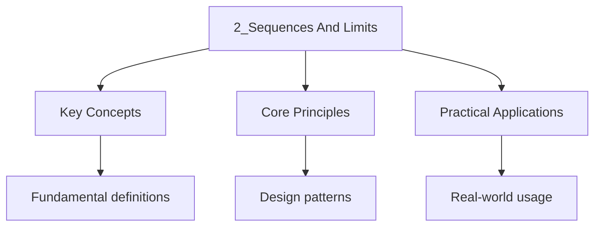

---

date: 2026-07-23T21:57:32+01:00
title: "Sequences and Limits | Mathematics"
tags:
  - Mathematics
  - University
description: 'A sequence in to a limit if for Every There exists such that Comprehensive educational content coverage with definitions and practice problems.'
---

<!-- Breadcrumb Schema for SEO -->

### 2.1 Convergence

A sequence $(a_n)_{n=1}^{\infty}$ in $\mathbb{R}$ **converges** to a limit $L \in \mathbb{R}$ if for
Every $\varepsilon > 0$There exists $N \in \mathbb{N}$ such that

$$|a_n - L| \lt \varepsilon \quad \mathrm{for\ all\ } n \geq N$$

We write $a_n \to L$ or $\lim_{n \to \infty} a_n = L$. A sequence that does not converge is said to
**diverge**.

**Proposition 2.1 (Uniqueness of Limits).** If $(a_n)$ converges, its limit is unique.

_Proof._ Suppose $a_n \to L$ and $a_n \to M$ with $L \neq M$. Let $\varepsilon = |L - M|/2 > 0$.
There Exists $N_1$ such that $|a_n - L| \lt \varepsilon$ for $n \geq N_1$ And $N_2$ such that
$|a_n - M| \lt \varepsilon$ for $n \geq N_2$. For $n \geq \max(N_1, N_2)$:

$$|L - M| \leq |a_n - L| + |a_n - M| \lt 2\varepsilon = |L - M|$$

A contradiction. $\blacksquare$

**Proposition 2.2.** Every convergent sequence is bounded.

_Proof._ Let $a_n \to L$. Taking $\varepsilon = 1$There exists $N$ such that $|a_n - L| \lt 1$ for
All $n \geq N$. Then $|a_n| \leq |L| + 1$ for $n \geq N$. Let
$M = \max\{|a_1|, |a_2|, \ldots, |a_{N-1}|, |L| + 1\}$. Then $|a_n| \leq M$ for all $n$.
$\blacksquare$

### 2.2 Convergence Theorems

**Theorem 2.1 (Algebra of Limits).** If $a_n \to L$ and $b_n \to M$ Then:

1. $a_n + b_n \to L + M$
2. $a_n b_n \to LM$
3. $a_n / b_n \to L/M$ (provided $M \neq 0$ and $b_n \neq 0$ for all $n$)

**Theorem 2.2 (Squeeze Theorem).** If $a_n \leq b_n \leq c_n$ for all $n$ and $a_n \to L$
$c_n \to L$ Then $b_n \to L$.

**Theorem 2.3 (Monotone Convergence Theorem).** Every bounded monotone sequence in $\mathbb{R}$
converges. Specifically:

- Every bounded increasing sequence converges to its supremum.
- Every bounded decreasing sequence converges to its infimum.

_Proof._ Let $(a_n)$ be bounded and increasing. By the completeness axiom,
$s = \sup\{a_n : n \in \mathbb{N}\}$ exists. Let $\varepsilon > 0$. By the approximation property,
There exists $N$ such that $s - \varepsilon \lt a_N \leq s$. Since $(a_n)$ is increasing,
$a_n \geq a_N > s - \varepsilon$ for all $n \geq N$. Also $a_n \leq s$ for all $n$. Hence
$|a_n - s| \lt \varepsilon$ for all $n \geq N$. $\blacksquare$

### 2.3 Cauchy Sequences

A sequence $(a_n)$ is a **Cauchy sequence** if for every $\varepsilon > 0$There exists
$N \in
\mathbb{N}$ such that

$$|a_n - a_m| \lt \varepsilon \quad \mathrm{for\ all\ } m, n \geq N$$

**Theorem 2.4.** Every convergent sequence is Cauchy.

_Proof._ Let $a_n \to L$. Given $\varepsilon > 0$Choose $N$ such that $|a_n - L| \lt \varepsilon/2$
For all $n \geq N$. Then for $m, n \geq N$:
$|a_n - a_m| \leq |a_n - L| + |a_m - L| \lt \varepsilon$. $\blacksquare$

**Theorem 2.5 (Cauchy Completeness of $\mathbb{R}$).** Every Cauchy sequence in $\mathbb{R}$
converges.

_Proof._ Let $(a_n)$ be Cauchy. First, $(a_n)$ is bounded: choose $N$ with $|a_n - a_m| \lt 1$ for
$m, n \geq N$. Then $|a_n| \leq |a_N| + 1$ for $n \geq N$. By the Bolzano-Weierstrass theorem
(Theorem 2.6 below), $(a_n)$ has a convergent subsequence $(a_{n_k}) \to L$. We show $a_n \to L$.

Given $\varepsilon > 0$Choose $N_1$ so that $|a_n - a_m| \lt \varepsilon/2$ for $m, n \geq N_1$ And
$K$ so that $|a_{n_k} - L| \lt \varepsilon/2$ for $k \geq K$. For $n \geq N_1$Choose $k \geq K$ with
$n_k \geq N_1$ (possible since $n_k \to \infty$). Then

$$|a_n - L| \leq |a_n - a_{n_k}| + |a_{n_k} - L| \lt \varepsilon/2 + \varepsilon/2 = \varepsilon$$

$\blacksquare$

### 2.4 Subsequences

A **subsequence** of $(a_n)$ is a sequence $(a_{n_k})_{k=1}^{\infty}$ where
$n_1 \lt n_2 \lt n_3 \lt \cdots$.

**Proposition 2.3.** If $a_n \to L$ Then every subsequence $(a_{n_k}) \to L$.

**Proposition 2.4.** If $(a_n)$ has two subsequences converging to different limits, then $(a_n)$
diverges.

### 2.5 The Bolzano-Weierstrass Theorem

**Theorem 2.6 (Bolzano-Weierstrass).** Every bounded sequence in $\mathbb{R}$ has a convergent
subsequence.

_Proof._ Let $(a_n)$ be bounded, so $a_n \in [A, B]$ for all $n$. Set $I_0 = [A, B]$. Bisect $I_0$
into $[A, (A+B)/2]$ and $[(A+B)/2, B]$. At least one contains infinitely many terms of $(a_n)$; call
it $I_1$. Having constructed $I_k = [l_k, r_k]$Bisect it and select $I_{k+1}$ as the half containing
Infinitely many terms of $(a_n)$.

This produces a nested sequence of closed intervals
$I_0 \supseteq I_1 \supseteq I_2 \supseteq \cdots$ With $\mathrm{length}(I_k) = (B - A)/2^k \to 0$.
By the **Nested Interval Property** (which follows From completeness),
$\bigcap_{k=0}^{\infty} I_k = \{c\}$ for some $c \in [A, B]$.

Construct the subsequence inductively: pick $n_1$ with $a_{n_1} \in I_1$. Having chosen
$n_1 \lt n_2 \lt \cdots \lt n_{k-1}$Pick $n_k > n_{k-1}$ with $a_{n_k} \in I_k$ (possible since
$I_k$ contains infinitely many terms). Then $a_{n_k} \in I_k$ for all $k$ So
$|a_{n_k} - c| \leq \mathrm{length}(I_k) \to 0$. Hence $a_{n_k} \to c$. $\blacksquare$

### 2.6 Limit Superior and Limit Inferior

Let $(a_n)$ be a bounded sequence. Define:

$$\limsup_{n \to \infty} a_n = \inf_{n \geq 1} \sup_{k \geq n} a_k, \qquad \liminf_{n \to \infty} a_n = \sup_{n \geq 1} \inf_{k \geq n} a_k$$

**Proposition 2.5.** For every bounded sequence $(a_n)$:
$$\liminf_{n \to \infty} a_n \leq \limsup_{n \to \infty} a_n$$

_Proof._ For any $n$, $\inf_{k \geq n} a_k \leq a_n \leq \sup_{k \geq n} a_n$. Taking supremum over
$n$ on the left: $\liminf a_n \leq \sup_{k \geq n} a_k$ for every $n$. Taking infimum over $n$ on
The right gives $\liminf a_n \leq \limsup a_n$. $\blacksquare$

**Proposition 2.6.** $(a_n)$ converges if and only if $\liminf a_n = \limsup a_n$In which case the
Common value equals $\lim a_n$.

_Proof._ If $a_n \to L$ Then for every $\varepsilon > 0$There exists $N$ such that
$L - \varepsilon \lt a_n \lt L + \varepsilon$ for $n \geq N$. Hence
$\sup_{k \geq n} a_k \leq L + \varepsilon$ For $n \geq N$ So $\limsup a_n \leq L + \varepsilon$.
Since $\varepsilon > 0$ is arbitrary, $\limsup a_n \leq L$. Similarly $\liminf a_n \geq L$. Combined
with Proposition 2.5, $\liminf a_n = \limsup a_n = L$.

Conversely, if $\liminf a_n = \limsup a_n = L$ Then for every $\varepsilon > 0$There exists $N_1$
With $\sup_{k \geq n} a_k \lt L + \varepsilon$ for $n \geq N_1$ And $N_2$ with
$\inf_{k \geq n} a_k > L - \varepsilon$ for $n \geq N_2$. For $n \geq \max(N_1, N_2)$:
$L - \varepsilon \lt a_n \lt L + \varepsilon$ So $a_n \to L$. $\blacksquare$

**Proposition 2.7.** $\limsup a_n$ is the largest subsequential limit of $(a_n)$ And $\liminf a_n$ Is
the smallest.

_Proof._ Let $L^* = \limsup a_n = \inf_n \sup_{k \geq n} a_k$. Define $s_n = \sup_{k \geq n} a_k$.
Then $(s_n)$ is decreasing and $s_n \to L^*$. For each $n$Choose $k_n \geq n$ with
$a_{k_n} > s_n - 1/n$. Then $a_{k_n} \to L^*$ (by squeeze), producing a subsequence converging to
$L^*$.

If $L > L^*$ were a subsequential limit, choose a subsequence $a_{n_j} \to L$. For large $j$:
$a_{n_j} > (L + L^*)/2 > L^*$. But $a_{n_j} \leq s_{n_j}$ for all $j$ And $s_{n_j} \to L^*$ So
$a_{n_j} \leq s_{n_j} \lt (L + L^*)/2$ for large $j$A contradiction. $\blacksquare$

**Proposition 2.8 (Algebra of $\limsup$/$\liminf$).** If $(a_n)$ and $(b_n)$ are bounded sequences:

1. $\limsup(a_n + b_n) \leq \limsup a_n + \limsup b_n$
2. $\liminf(a_n + b_n) \geq \liminf a_n + \liminf b_n$
3. If $a_n \geq 0$ and $b_n \geq 0$: $\limsup(a_n b_n) \leq (\limsup a_n)(\limsup b_n)$

_Remark._ Equality in (1) does not hold . For example, $a_n = (-1)^n$ and $b_n = (-1)^{n+1}$ Give
$a_n + b_n = 0$ So $\limsup(a_n + b_n) = 0 \lt 1 + 1 = \limsup a_n + \limsup b_n$.

**Proposition 2.9.** A sequence $(a_n)$ is convergent if and only if it is Cauchy, if and only if
$\limsup a_n = \liminf a_n$.

Worked Example: Compute $\limsup$ and $\liminf$ of $a_n = (-1)^n \cdot \frac{n}{n+1}$

_Solution._ The sequence is $-1/2, 2/3, -3/4, 4/5, -5/6, \ldots$

The even subsequence is $a_{2k} = \frac{2k}{2k+1} \to 1$. The odd subsequence is
$a_{2k-1} = -\frac{2k-1}{2k} \to -1$.

No subsequence can have a limit greater than $1$ (since $a_n \leq n/(n+1) \lt 1$ for even $n$ And
$a_n \lt 0$ for odd $n$). Similarly, no subsequence can have a limit less than $-1$.

Therefore $\limsup_{n \to \infty} a_n = 1$ and $\liminf_{n \to \infty} a_n = -1$. Since
$\limsup \neq \liminf$The sequence diverges. $\blacksquare$

### 2.7 Worked Examples

**Problem.** Prove that $\lim_{n \to \infty} \frac{n}{n+1} = 1$.

_Solution._ Let $\varepsilon > 0$. We need $\left|\frac{n}{n+1} - 1\right| \lt \varepsilon$ i.e.,
$\frac{1}{n+1} \lt \varepsilon$ i.e., $n > \frac{1}{\varepsilon} - 1$. Choose
$N = \lceil \frac{1}{\varepsilon} \rceil$. Then for $n \geq N$: $n \geq \frac{1}{\varepsilon}$ so
$n+1 > \frac{1}{\varepsilon}$ so $\frac{1}{n+1} \lt \varepsilon$. $\blacksquare$

### 2.8 Intuition: What Does Convergence Really Mean?

The epsilon-delta (or epsilon-N) definition of convergence captures the idea that a sequence
"eventually stays arbitrarily close to its limit." The formal definition says: for every tolerance
$\varepsilon > 0$, there is a point $N$ in the sequence after which all terms are within $\varepsilon$
of the limit $L$.

Think of it as a challenge game. Your opponent picks a tolerance $\varepsilon$ (say, $\varepsilon =
0.001$). You must find a point $N$ in the sequence such that every term after $N$ is within $0.001$
of $L$. If you can always win this game, no matter how small the tolerance, the sequence converges
to $L$.

The key insight is that convergence is about **tail behavior**. The first million terms of a
sequence are irrelevant; only the terms with $n \geq N$ matter. This is why the sequence
$1000, 1000, 1000, \ldots, 1000, 1 + 1/n, 1 + 1/(n+1), \ldots$ (with a million 1000s followed by
$1 + 1/n$) converges to 1, even though many early terms are far from 1.

**Divergence** means the sequence fails to settle near any single value. The sequence
$(-1)^n = -1, 1, -1, 1, \ldots$ diverges because it oscillates between $-1$ and $1$ and never
stays near a single limit. No matter what $L$ you claim is the limit, the tolerance game fails:
for $\varepsilon = 0.5$, there is no $N$ such that all terms after $N$ are within $0.5$ of $L$.

**Connection to calculus.** The limit of a function, $\lim_{x \to a} f(x) = L$, is defined
analogously: for every $\varepsilon > 0$, there exists $\delta > 0$ such that
$0 < |x - a| < \delta$ implies $|f(x) - L| < \varepsilon$. The structure is identical; only the
quantifiers change (from "there exists $N$ for all $n \geq N$" to "there exists $\delta$ for all
$x$ with $0 < |x - a| < \delta$").

Worked Example: $\varepsilon$-$N$ proof that $\lim_{n \to \infty} \frac{3n + 1}{n + 2} = 3$

_Solution._ Let $\varepsilon > 0$. We compute:

$$\left|\frac{3n+1}{n+2} - 3\right| = \left|\frac{3n+1 - 3(n+2)}{n+2}\right| = \left|\frac{-5}{n+2}\right| = \frac{5}{n+2}$$

We need $\frac{5}{n+2} \lt \varepsilon$ i.e., $n + 2 > 5/\varepsilon$ i.e., $n > 5/\varepsilon - 2$.
Choose $N = \lceil 5/\varepsilon \rceil$. Then for $n \geq N$:

$$\left|\frac{3n+1}{n+2} - 3\right| = \frac{5}{n+2} \leq \frac{5}{N+2} \leq \frac{5}{5/\varepsilon} = \varepsilon$$

$\blacksquare$

Worked Example: Show $(a_n)$ with $a_1 = \sqrt{2}$, $a_{n+1} = \sqrt{2 + a_n}$ converges

_Solution._ **Step 1:** $(a_n)$ is bounded above by $2$. By induction: $a_1 = \sqrt{2} \leq 2$. If
$a_n \leq 2$ then $a_{n+1} = \sqrt{2 + a_n} \leq \sqrt{2 + 2} = 2$.

**Step 2:** $(a_n)$ is increasing. We have $a_1 = \sqrt{2} \approx 1.414$ and
$a_2 = \sqrt{2 + \sqrt{2}} \approx 1.848$. Assume $a_n \leq a_{n+1}$. Then
$a_{n+1} = \sqrt{2 + a_n} \leq \sqrt{2 + a_{n+1}} = a_{n+2}$.

**Step 3:** By the Monotone Convergence Theorem, $(a_n)$ converges. Let $L = \lim a_n$. Taking
limits in $a_{n+1} = \sqrt{2 + a_n}$: $L = \sqrt{2 + L}$ so $L^2 = 2 + L$ giving $L^2 - L - 2 = 0$ so
$(L-2)(L+1) = 0$. Since $a_n \geq \sqrt{2} > 0$ for all $n$, $L \geq 0$ so $L = 2$. $\blacksquare$

### 2.9 Worked Example: Divergence by Subsequence

**Problem.** Prove that $a_n = (-1)^n$ diverges.

Solution

Suppose for contradiction that $a_n \to L$. Then every subsequence must also converge to $L$. The
even subsequence $a_{2k} = (-1)^{2k} = 1 \to 1$, so $L = 1$. The odd subsequence
$a_{2k-1} = (-1)^{2k-1} = -1 \to -1$, so $L = -1$. But $1 \neq -1$, a contradiction. Therefore
$a_n$ diverges.

**Alternative approach using limsup/liminf:** $\limsup a_n = 1$ and $\liminf a_n = -1$. Since
$\limsup \neq \liminf$, the sequence diverges by Proposition 2.9. $\blacksquare$

:::caution
**Common Pitfall:** Do not confuse $\limsup$ and $\liminf$ with $\sup$ and $\inf$ of the range
$\{a_n : n \in \mathbb{N}\}$. The $\limsup$ depends on the _tail_ behavior of the sequence. For
example, $a_n = (-1)^n$ has $\limsup = 1$ and $\liminf = -1$, but $\sup\{a_n\} = 1$ and
$\inf\{a_n\} = -1$ happen to agree in this case. However, for $a_n = 1/n$, $\sup = 1$ but
$\limsup = 0$.
:::

## Cross-References

- **[Series](3_series)**: The convergence of series is defined through partial sums, making sequence convergence the foundation for all series theory.
- **[Sequences and Series of Functions](7_sequences-and-series-of-functions)**: Pointwise and uniform convergence of function sequences extend the real-number convergence concepts to function spaces.
- **[Metric Spaces](9-topology/7_metric-spaces.md)**: The epsilon-N definition of convergence generalises to metric spaces, where completeness and compactness play analogous roles.
- **[Probability Spaces](8-probability-and-statistics/1_probability-spaces.md)**: Convergence of random variables (almost surely, in probability, in distribution) builds on the sequence convergence framework.

- [Classical Mechanics](https://physics.wyattau.com/docs/classical-mechanics)
- [Electromagnetism](https://physics.wyattau.com/docs/electromagnetism)
- [Statistical Learning](https://machine-learning.wyattau.com/docs/statistical-learning)
- [Statistical Mechanics](https://physics.wyattau.com/docs/statistical-mechanics)

## Common Mistakes

- **Confusing $\limsup$ and $\liminf$ with $\sup$ and $\inf$ of the range:** The supremum of the range $\{a_n\}$ is the largest value ever attained; $\limsup$ depends on the tail behaviour. For $a_n = 1/n$, $\sup = 1$ but $\limsup = 0$.
- **Assuming every bounded sequence converges:** Boundedness is necessary but not sufficient. $a_n = (-1)^n$ is bounded but diverges because the even and odd subsequences converge to different limits.
- **Forgetting that a Cauchy sequence in $\mathbb{Q}$ may not converge in $\mathbb{Q}$:** Completeness of $\mathbb{R}$ guarantees Cauchy sequences converge. In $\mathbb{Q}$, the sequence of rational approximations to $\sqrt{2}$ is Cauchy but has no limit in $\mathbb{Q}$.
- **Using $|a_n - L| < \varepsilon$ for all $n$ instead of for $n > N$:** The definition of convergence requires that the inequality holds only eventually (for all $n > N$), not for every term from the start.
