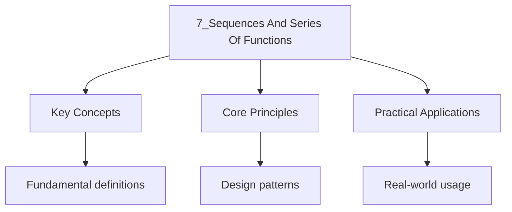

---

date: 2026-07-23T21:57:32+01:00
title: Sequences and Series of Functions
tags:
  - Mathematics
  - University
description: "Pointwise versus uniform convergence: the distinction that decides when a limit of continuous functions is continuous, when you can swap a limit and an integral, and when you can differentiate term by term. The Weierstrass M-test, power series, and the counterexamples that make uniform convergence necessary. With recall prompts, worked examples and interleaving problems. Tier U."
---

<!-- Breadcrumb Schema for SEO -->

## Recall prompts

Attempt these from memory *before* reading.

- Define pointwise convergence of $(f_n)$ to $f$.
- Define uniform convergence. What exactly changes in the quantifiers?
- If each $f_n$ is continuous and $f_n \to f$ pointwise, is $f$ continuous?
- State the Weierstrass M-test.
- Can you always differentiate a power series term by term?

Check your answers against the text. Prompt 3 is the one that motivates the
entire page, and the answer is the reason uniform convergence exists at all.

## Motivation: when can you swap a limit with something else?

Almost every theorem in analysis is a statement that two operations commute:
the limit of a sum is the sum of the limits, the integral of a limit is the
limit of the integral, the derivative of a limit is the limit of the derivative.

For sequences of *numbers* those commutations need very little. For sequences
of *functions* they need uniform convergence, and the reason is visible in one
example.

**Worked example (the motivating counterexample).** Let $f_n(x) = x^n$ on
$[0,1]$. Each $f_n$ is continuous (a polynomial), and $f_n \to f$ pointwise
where

$$
f(x) = \begin{cases} 0 & 0 \le x < 1 \\ 1 & x = 1 \end{cases}
$$

So a limit of continuous functions need not be continuous. The continuity is
lost at exactly one point, and that point is where the convergence is slowest:
near $x = 1$, the terms $x^n$ take a long time to become small, so for a given
$\varepsilon$ the required $N$ grows without bound as $x \to 1$.

**Uniform convergence is the condition that prevents this.** It requires one
$N$ to work for *every* $x$ simultaneously, which rules out the slow spot.

> **Exercise.** Show $f_n(x) = x^n$ does *not* converge uniformly to $f$ on
> $[0,1]$, by showing $\sup_{x \in [0,1]} |f_n(x) - f(x)| = 1$ for every $n$.

### 7.1 Pointwise Convergence

Let $(f_n)$ be a sequence of functions defined on a set $E \subseteq \mathbb{R}$.

**Definition.** $(f_n)$ **converges pointwise** to $f$ on $E$ if for every $x \in E$ and every
$\varepsilon > 0$ There exists $N \in \mathbb{N}$ (depending on both $x$ and $\varepsilon$) such that
$|f_n(x) - f(x)| \lt \varepsilon$ for all $n \geq N$.

**Example.** Let $f_n(x) = x^n$ on $E = [0, 1]$. For each $x \in [0, 1)$, $f_n(x) = x^n \to 0$ And
$f_n(1) = 1$ for all $n$. So $f_n$ converges pointwise to

$$
f(x) = \begin{cases} 0 & \mathrm{if\ } 0 \leq x \lt 1 \\ 1 & \mathrm{if\ } x = 1 \end{cases}
$$

Note that each $f_n$ is continuous, but the pointwise limit $f$ is not continuous at $x = 1$.

### 7.2 Uniform Convergence

**Definition.** $(f_n)$ **converges uniformly** to $f$ on $E$ if for every $\varepsilon > 0$ There
Exists $N \in \mathbb{N}$ (depending only on $\varepsilon$ Not on $x$) such that for all $x \in E$:

$$
|f_n(x) - f(x)| \lt \varepsilon \quad \mathrm{for\ all\ } n \geq N
$$

Equivalently, $\sup_{x \in E} |f_n(x) - f(x)| \to 0$ as $n \to \infty$.

**Proposition 7.1.** Uniform convergence implies pointwise convergence. The converse is false.

**Example (continued).** $f_n(x) = x^n$ on $[0, 1]$ converges pointwise but not uniformly. We have
$\sup_{x \in [0,1]} |f_n(x) - f(x)| = \sup_{x \in [0,1)} x^n = 1$ for all $n$ (since the supremum is
Approached as $x \to 1^-$). This does not tend to $0$.

However, on $[0, r]$ for any $r \lt 1$: $\sup_{x \in [0,r]} |x^n| = r^n \to 0$ So the convergence Is
uniform on $[0, r]$.

### 7.3 The Weierstrass M-Test

**Theorem 7.1 (Weierstrass M-Test).** Let $(f_n)$ be a sequence of functions on $E$. If there exists
a Sequence $(M_n)$ of non-negative real numbers such that $|f_n(x)| \leq M_n$ for all $x \in E$ and
all $n$ And $\sum_{n=1}^{\infty} M_n \lt \infty$ Then $\sum_{n=1}^{\infty} f_n$ converges uniformly on
$E$.

_Proof._ Let $S_n(x) = \sum_{k=1}^{n} f_k(x)$ and $T_n = \sum_{k=1}^{n} M_k$. Since $\sum M_k$
converges, $(T_n)$ is a Cauchy sequence. Given $\varepsilon > 0$ There exists $N$ such that for
$m > n \geq N$:

$$
T_m - T_n = \sum_{k=n+1}^{m} M_k \lt \varepsilon
$$

Then for all $x \in E$ and $m > n \geq N$:

$$
|S_m(x) - S_n(x)| = \left|\sum_{k=n+1}^{m} f_k(x)\right| \leq \sum_{k=n+1}^{m} |f_k(x)| \leq \sum_{k=n+1}^{m} M_k \lt \varepsilon
$$

So the partial sums $(S_n)$ satisfy the uniform Cauchy criterion on $E$ Hence converge uniformly.
$\blacksquare$

### 7.4 Uniform Convergence and Continuity

**Theorem 7.2.** If $(f_n)$ is a sequence of continuous functions on $E$ converging uniformly to $f$
On $E$ Then $f$ is continuous on $E$.

_Proof._ Let $c \in E$ and $\varepsilon > 0$. Since $f_n \to f$ uniformly, choose $N$ such that
$|f_N(x) - f(x)| \lt \varepsilon/3$ for all $x \in E$. Since $f_N$ is continuous at $c$ Choose
$\delta > 0$ such that $|x - c| \lt \delta$ implies $|f_N(x) - f_N(c)| \lt \varepsilon/3$. Then:

$$
|f(x) - f(c)| \leq |f(x) - f_N(x)| + |f_N(x) - f_N(c)| + |f_N(c) - f(c)| \lt \frac{\varepsilon}{3} + \frac{\varepsilon}{3} + \frac{\varepsilon}{3} = \varepsilon
$$

$\blacksquare$

### 7.5 Uniform Convergence and Integration

**Theorem 7.3.** If $(f_n)$ is a sequence of Riemann integrable functions on $[a, b]$ converging
Uniformly to $f$ on $[a, b]$ Then $f$ is Riemann integrable and

$$
\lim_{n \to \infty} \int_a^b f_n(x)\, dx = \int_a^b f(x)\, dx
$$

_Proof._ Since $(f_n)$ converges uniformly, $f$ is the uniform limit of integrable functions. Given
$\varepsilon > 0$ Choose $N$ with $\sup |f_N(x) - f(x)| \lt \varepsilon/(2(b-a))$ for all
$x \in [a, b]$. Then $f_N - \varepsilon/(2(b-a)) \leq f(x) \leq f_N(x) + \varepsilon/(2(b-a))$ for
all $x$ And by Integrability of $f_N$:

$$
\int_a^b f_N - \frac{\varepsilon}{2} \leq \underline{\int_a^b} f \leq \overline{\int_a^b} f \leq \int_a^b f_N + \frac{\varepsilon}{2}
$$

So $\overline{\int} f - \underline{\int} f \leq \varepsilon$ Proving $f$ is integrable. For the
limit:

$$
\left|\int_a^b f_n - \int_a^b f\right| \leq \int_a^b |f_n - f| \leq (b-a) \cdot \sup_{[a,b]} |f_n - f| \to 0
$$

$\blacksquare$

### 7.6 Uniform Convergence and Differentiation

Uniform convergence of functions does **not** guarantee convergence of derivatives. A stronger
Hypothesis is needed.

**Theorem 7.4.** Suppose $(f_n)$ is a sequence of differentiable functions on $[a, b]$ such that:

1. $(f_n(c))$ converges for some $c \in [a, b]$
2. $(f_n")$ converges uniformly on $[a, b]$

Then $(f_n)$ converges uniformly to a differentiable function $f$ on $[a, b]$ And
$f'(x) = \lim_{n \to \infty} f_n'(x)$.

_Proof._ Let $g = \lim f_n'$ (uniform limit). Define
$f(x) = \lim_{n \to \infty} \left[f_n(c) + \int_c^x f_n'(t)\, dt\right]$. By Theorem 7.3,
$\int_c^x f_n'(t)\, dt \to \int_c^x g(t)\, dt$ So $f(x) = f(c) + \int_c^x g(t)\, dt$. By FTC Part 1,
$f$ is differentiable and $f'(x) = g(x)$. Uniform convergence of $f_n$ to $f$ follows From the
estimate $|f_n(x) - f(x)| \leq |f_n(c) - f(c)| + \int_a^b |f_n'(t) - g(t)|\, dt$. $\blacksquare$

### 7.7 Power Series

A **power series** centered at $a$ is a series of the form $\sum_{n=0}^{\infty} c_n (x - a)^n$.

**Theorem 7.5 (Radius of Convergence).** Every power series $\sum c_n (x - a)^n$ has a **radius of
Convergence** $R \in [0, \infty]$ such that:

- The series converges absolutely for $|x - a| \lt R$
- The series diverges for $|x - a| > R$
- The behavior at $|x - a| = R$ must be checked separately

The radius is given by $1/R = \limsup_{n \to \infty} \sqrt[n]{|c_n|}$ (Cauchy-Hadamard formula), or
when the limit exists, $R = \lim_{n \to \infty} |c_n/c_{n+1}|$.

_Proof._ Apply the root test to $\sum |c_n (x-a)^n|$: $\limsup \sqrt[n]{|c_n|} |x-a| = |x-a|/R$
(where $1/R = \limsup \sqrt[n]{|c_n|}$). The root test gives convergence when $|x-a|/R \lt 1$ And
divergence when $|x-a|/R > 1$. $\blacksquare$

**Theorem 7.6.** A power series converges uniformly on every compact subset of its open disk of
Convergence.

**Theorem 7.6a (Differentiation and Integration of Power Series).** If
$f(x) = \sum_{n=0}^{\infty} c_n (x-a)^n$ Has radius of convergence $R > 0$ Then:

1. $f$ is differentiable on $(a - R, a + R)$ and $f'(x) = \sum_{n=1}^{\infty} n c_n (x - a)^{n-1}$
   (same $R$).
2. $f$ is infinitely differentiable on $(a - R, a + R)$ And
   $f^{(k)}(x) = \sum_{n=k}^{\infty} \frac{n!}{(n-k)!} c_n (x - a)^{n-k}$.
3. $\int_a^x f(t)\, dt = \sum_{n=0}^{\infty} \frac{c_n}{n+1}(x - a)^{n+1}$ for $|x - a| \lt R$.
4. $c_n = f^{(n)}(a)/n!$ (uniqueness of power series coefficients).

_Proof._ The differentiated series $\sum n c_n (x-a)^{n-1}$ has the same radius of convergence as
the original (by the Cauchy-Hadamard formula, since $\sqrt[n]{n} \to 1$). By Theorem 7.4, the
Derivative of the sum equals the sum of the derivatives. Parts (2), (3), and (4) follow by Induction
and the FTC. $\blacksquare$

**Theorem 7.6b (Abel's Theorem).** If $\sum_{n=0}^{\infty} c_n$ converges to $L$ Then

$$
\lim_{x \to 1^-} \sum_{n=0}^{\infty} c_n x^n = L
$$

That is, the power series is continuous from the left at the endpoint $x = 1$.

_Proof (sketch)._ Let $s_n = \sum_{k=0}^{n} c_k$ and $s_n \to L$. Write the partial sum
$\sum_{k=0}^{n} c_k x^k = \sum_{k=0}^{n}(s_k - s_{k-1})x^k$ (with $s_{-1} = 0$) and use summation by
Parts to express this as $s_n x^n + \sum_{k=0}^{n-1} s_k(x^k - x^{k+1})$. Letting $n \to \infty$ and
using That $s_n \to L$ and $x^n \to 0$ for $|x| \lt 1$ One shows the expression tends to $L$ as
$x \to 1^-$. $\blacksquare$

_Example._ Since $\sum_{k=1}^{\infty} (-1)^{k+1}/k = \ln 2$ Abel's theorem gives
$\lim_{x \to 1^-} \sum_{k=1}^{\infty} (-1)^{k+1} x^k/k = \ln 2$ I.e., $\ln 2$ is the left-hand limit
of $-\ln(1 - x)$ at $x = 1$.

### 7.8 Taylor Series Convergence

The **Taylor series** of $f$ at $a$ is $\sum_{n=0}^{\infty} \frac{f^{(n)}(a)}{n!}(x - a)^n$.

**Definition.** A function $f$ is **analytic** at $a$ if its Taylor series at $a$ converges to
$f(x)$ In some neighborhood of $a$.

Not every $C^{\infty}$ function is analytic. The standard counterexample is:

$$
f(x) = \begin{cases} e^{-1/x^2} & x \neq 0 \\ 0 & x = 0 \end{cases}
$$

$f^{(n)}(0) = 0$ for all $n$ So the Taylor series at $0$ is identically zero, which Converges only to
$0$ Not to $f(x)$ for $x \neq 0$.

### 7.9 Worked Examples

Worked Example: Show $\sum_{n=1}^{\infty} \frac{x^n}{n^2}$ converges uniformly on $[-1, 1]$

_Solution._ For $x \in [-1, 1]$: $\left|\frac{x^n}{n^2}\right| \leq \frac{1}{n^2}$. Since
$\sum_{n=1}^{\infty} \frac{1}{n^2}$ converges (it is a $p$-series with $p = 2 > 1$), the Weierstrass
M-Test with $M_n = 1/n^2$ implies the series converges uniformly on $[-1, 1]$. $\blacksquare$

Worked Example: Find the radius of convergence of $\sum_{n=0}^{\infty} \frac{x^n}{n!}$

_Solution._ Apply the ratio test to the coefficients:
$\lim_{n \to \infty} \left|\frac{c_{n+1}}{c_n}\right|
= \lim_{n \to \infty} \frac{n!}{(n+1)!} = \lim_{n \to \infty} \frac{1}{n+1} = 0$.

So $R = \infty$ and the series converges for all $x \in \mathbb{R}$. This is the power series for
$e^x$. By Theorem 7.4, the derivative of the sum equals
$\sum_{n=1}^{\infty} \frac{n x^{n-1}}{n!}
= \sum_{n=1}^{\infty} \frac{x^{n-1}}{(n-1)!} = \sum_{k=0}^{\infty} \frac{x^k}{k!} = e^x$,
confirming That $e^x$ is its own derivative. $\blacksquare$

Worked Example: Find the radius of convergence of $\sum_{n=1}^{\infty} n! \, x^n$

_Solution._ Apply the ratio test to the coefficients:

$$
\lim_{n \to \infty} \left|\frac{c_{n+1}}{c_n}\right| = \lim_{n \to \infty} \frac{(n+1)!}{n!} = \lim_{n \to \infty} (n+1) = \infty
$$

So $R = 0$ Meaning the series converges only at $x = 0$. $\blacksquare$

Worked Example: Show $f_n(x) = \frac{x}{1 + nx}$ converges uniformly on $[1, \infty)$

_Solution._ **Pointwise limit:** For $x \geq 1$:
$\lim_{n \to \infty} \frac{x}{1 + nx} = \lim_{n \to \infty} \frac{1}{1/x + n} = 0$.

**Uniform convergence:**
$\sup_{x \in [1, \infty)} \left|\frac{x}{1 + nx} - 0\right| = \sup_{x \geq 1} \frac{x}{1 + nx}$. To
find the maximum, differentiate with respect to $x$:
$\frac{d}{dx}\left(\frac{x}{1+nx}\right) = \frac{1}{(1+nx)^2} > 0$. So the function is increasing in
$x$ on $[1, \infty)$ And:

$$
\sup_{x \geq 1} \frac{x}{1 + nx} = \lim_{x \to \infty} \frac{x}{1 + nx} = \frac{1}{n}
$$

Since $\sup |f_n| = 1/n \to 0$ The convergence is uniform on $[1, \infty)$. $\blacksquare$

:::caution
integrability. Uniform Convergence preserves continuity and allows interchange of limit and
integral, but not limit and Derivative. For derivatives, uniform convergence of the _sequence of
derivatives_ (not the original Sequence) is required, as stated in Theorem 7.4. Also, the
Weierstrass M-Test applies only to series Of functions, not sequences; for sequences, one must
verify the uniform Cauchy criterion directly.
:::

## Counterexamples worth knowing by name

| Statement | True? | Counterexample |
| --------- | ----- | -------------- |
| A pointwise limit of continuous functions is continuous | no | $f_n(x) = x^n$ on $[0,1]$ |
| Pointwise convergence lets you swap limit and integral | no | $f_n(x) = n x (1-x^2)^n$ on $[0,1]$: $\int f_n \to 0$ but $\int \lim f_n = \lim f_n(\tfrac12) = \tfrac12$ |
| Pointwise convergence lets you swap limit and derivative | no | $f_n(x) = \frac{\sin nx}{\sqrt n}$: $f_n \to 0$ uniformly, but $f_n'(0) = \sqrt n \to \infty$ |
| A power series converges at its endpoints | no | $\sum x^n$ converges on $(-1,1)$ only |
| A uniformly convergent series of differentiable functions is differentiable | no | $\sum \frac{\sin(n^2x)}{n^2}$ converges uniformly but is nowhere differentiable (Weierstrass' construction) |

The integral counterexample is the one to work through: each $f_n$ has integral
$\tfrac{1}{2(n+1)} \to 0$, but the pointwise limit is $1$ at $x = \tfrac12$
and $0$ elsewhere, so $\int \lim f_n = \tfrac12$. The limit and the integral
do not commute, and the reason is that the convergence is not uniform. That is
the calculation that motivated Lebesgue's integral, where much weaker
conditions suffice.

## The Weierstrass M-test, and what it does not give you

**Theorem (U, Weierstrass M-test).** If $|f_n(x)| \le M_n$ for all $x$ and
$\sum M_n$ converges, then $\sum f_n$ converges uniformly and absolutely.

The M-test is the workhorse: it is how power series, Fourier series and most
series of functions are proved uniformly convergent. But it gives *uniform
convergence only*, and each of the three commutations needs its own theorem:

| Operation | Needs | Theorem |
| --------- | ----- | ------- |
| $f_n \to f \implies f$ continuous | uniform convergence of continuous $f_n$ | the uniform limit theorem |
| $\lim \int f_n = \int \lim f_n$ | uniform convergence | the interchange theorem |
| $\lim f_n' = (\lim f_n)'$ | uniform convergence of $f_n'$, and $f_n(x_0)$ converging at one point | the differentiation theorem |

The differentiation row is the strongest hypothesis of the three, and the
counterexample above shows why: uniform convergence of $f_n$ alone is not
enough.

## Interleaving problems

Mix these with material from [Sequences and
Limits](/3-real-analysis/2_sequences-and-limits/), [Continuity](/3-real-analysis/4_continuity/),
[Differentiability](/3-real-analysis/5_differentiability/), [Riemann
Integration](/3-real-analysis/6_riemann-integration/) and [Stochastic
Calculus](/14-graduate-stochastic-analysis/1_ito-integration-and-formula/).

1. (Sequences.) Show $f_n(x) = \frac{nx}{1+n^2x^2}$ converges pointwise to $0$
   on $\mathbb{R}$ but not uniformly, by computing $\sup_x |f_n(x)|$.
2. (Continuity.) Show $f_n(x) = \frac{1}{1+x^n}$ converges uniformly on
   $[0, \tfrac12]$ but only pointwise on $[0,1]$, and identify the limit.
3. (Integration.) Show $\lim_n \int_0^1 f_n = \int_0^1 \lim_n f_n$ for
   $f_n(x) = n x e^{-nx^2}$, and explain why the interchange theorem does not
   apply.
4. (Differentiability.) Show the series $\sum \frac{\cos(nx)}{n^2}$ converges
   uniformly, and determine where the sum is differentiable.
5. (Stochastic calculus.) Show that Brownian scaling $W_{ct} \sim \sqrt c\,
   W_t$ is a statement about the *non-uniformity* of a limit, connecting to the
   idea that the convergence rate depends on the scale you look at.

## Common Mistakes

**Mistake 1: Assuming pointwise convergence preserves continuity**
Students often assume that if a sequence of continuous functions converges pointwise, the limit must be continuous. The classic counterexample is $f_n(x) = x^n$ on $[0,1]$, which converges pointwise to a discontinuous function. Only uniform convergence guarantees that the limit of continuous functions is continuous.

**Mistake 2: Confusing uniform convergence of $f_n$ with uniform convergence of $f_n'$**
The Weierstrass M-test or direct estimation shows that $f_n \to f$ uniformly, but students incorrectly conclude $f_n' \to f'$ uniformly. Theorem 7.4 requires uniform convergence of the _derivatives_ $f_n'$, not the functions $f_n$ themselves, to interchange differentiation and limits.

**Mistake 3: Forgetting to check endpoints when computing radius of convergence**
When applying the ratio or root test, students find $R$ but assume the series converges for $|x-a| = R$. The boundary behaviour must be checked separately -- a series may converge at one endpoint, both, or neither. For example, $\sum x^n/n$ has $R=1$ but converges only at $x=-1$ on the boundary.

## Cross-References

- **[Series](/3-real-analysis/3_series/)**: The Weierstrass M-test and convergence criteria for function series build directly on the numerical series tests from this chapter.
- **[Sequences and Limits](/3-real-analysis/2_sequences-and-limits/)**: Pointwise and uniform convergence are generalisations of the sequence convergence concepts from the first chapter.
- **[Partial Derivatives](/4-multivariable-calculus/1_partial-derivatives/)**: Taylor series convergence and analyticity connect real analysis to the partial derivative computations in multivariable calculus.
- **[Fourier Series](/5-ordinary-differential-equations/7_fourier-series/)**: Fourier series are function series whose convergence properties are analysed using the uniform convergence theory developed here.

- [Classical Mechanics](https://physics.wyattau.com/docs/classical-mechanics)
- [Electromagnetism](https://physics.wyattau.com/docs/electromagnetism)

## Intuition

A sequence of functions converges pointwise if each point eventually stabilises, but this is too weak to preserve analytical properties, the limit of continuous functions can be discontinuous. Uniform convergence demands that all points stabilise simultaneously: given any tolerance, there is a single $N$ beyond which every point in the domain is within that tolerance. Think of it as the difference between each person eventually sitting down (pointwise) versus everyone sitting down at the same command (uniform). Power series are the paradigmatic example: within their radius of convergence, they converge uniformly on compact sets, which justifies term-by-term differentiation and integration.
