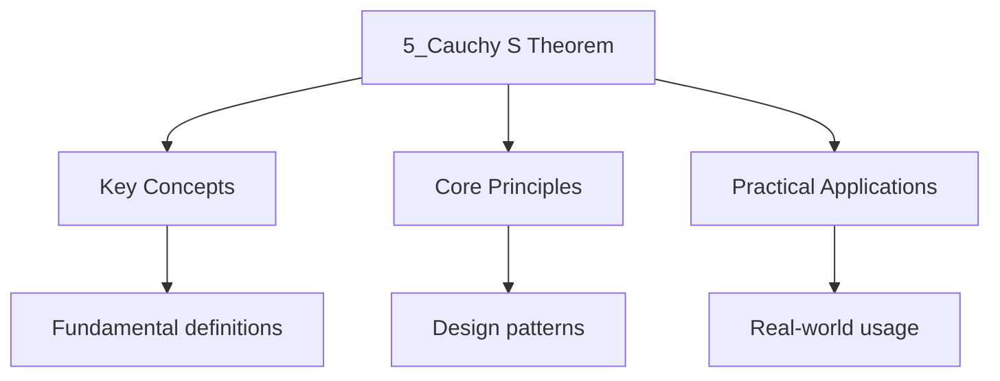

---

date: 2026-07-23T21:57:32+01:00
title: "Cauchy's Theorem | Mathematics"
tags:
  - Mathematics
  - University
description: "If is analytic on a connected domain and Is a simple closed contour in Then Comprehensive educational content coverage with definitions and practice problems."
---

<!-- Breadcrumb Schema for SEO -->

### 5.1 Statement

**Theorem 5.1 (Cauchy"s Theorem).** If $f$ is analytic on a connected domain $D$ and $\gamma$ Is a
simple closed contour in $D$ Then

$$\int_\gamma f(z)\, dz = 0$$

_Proof (for $f'$ continuous)._ By Green’s theorem in the plane, writing $f = u + iv$:

$$\int_\gamma f\, dz = \int_\gamma (u\, dx - v\, dy) + i\int_\gamma (v\, dx + u\, dy)$$

Applying Green's theorem to each integral:

$= \iint_D (-v_x - u_y)\, dA + i\iint_D (u_x - v_y)\, dA = 0$

By the Cauchy-Riemann equations. $\blacksquare$

### 5.2 Connected Domains

A domain $D \subseteq \mathbb{C}$ is **connected** if every simple closed contour in $D$ can Be
continuously shrunk to a point within $D$.

**Cauchy's theorem may fail on multiply connected domains.** For example,
$\int_\gamma \frac{1}{z}\, dz = 2\pi i$ where $\gamma$ is the unit circle (traversing a region that
Excludes the singularity at $z = 0$).

### 5.3 Path Independence

**Corollary 5.2.** If $f$ is analytic on a connected domain $D$ Then the integral
$\int_{z_0}^{z_1} f(z)\, dz$ is independent of the path from $z_0$ to $z_1$ in $D$.

### 5.4 Antiderivatives

**Theorem 5.3.** If $f$ is analytic on a connected domain $D$ Then $f$ has an antiderivative $F$ in
$D$ (i.e., $F'(z) = f(z)$), and

$$\int_\gamma f(z)\, dz = F(z_1) - F(z_0)$$

Where $z_0$ and $z_1$ are the endpoints of $\gamma$.

### 5.5 Cauchy's Theorem for Multiply Connected Domains

**Theorem 5.4.** If $f$ is analytic on a domain $D$ containing simple closed contours
$\gamma, \gamma_1, \ldots, \gamma_n$ where $\gamma_1, \ldots, \gamma_n$ Lie in the interior of
$\gamma$ and the region between $\gamma$ and the $\gamma_k$ is contained in $D$ And all contours are
positively oriented, then

$$\int_\gamma f(z)\, dz = \sum_{k=1}^n \int_{\gamma_k} f(z)\, dz$$

### 5.6 Deformation of Contours

**Theorem 5.5 (Deformation of Contours).** If $f$ is analytic on a domain containing two simple
Closed contours $\gamma_1$ and $\gamma_2$ where one can be continuously deformed into the other
Within the domain of analyticity of $f$ Then

$$\int_{\gamma_1} f(z)\, dz = \int_{\gamma_2} f(z)\, dz$$

_Proof._ This follows directly from Theorem 5.4 applied to the region between $\gamma_1$ and
$\gamma_2$. $\blacksquare$

_Remark._ This theorem is enormously useful: we can replace a complicated contour with a simpler one
(a small circle around each singularity) without changing the value of the integral.

Solution

**Problem.** Evaluate $\int_\gamma \frac{dz}{z - 2}$ where $\gamma$ is the ellipse
$\frac{x^2}{4} + \frac{y^2}{9} = 1$.

Since $z = 2$ is inside the ellipse and $\frac{1}{z - 2}$ is analytic everywhere else, By
deformation of contours we can replace $\gamma$ with a small circle around $z = 2$:

$\int_\gamma \frac{dz}{z - 2} = 2\pi i$.

**Problem.** Evaluate $\int_\gamma \frac{e^z}{z}\, dz$ where $\gamma$ is the square with vertices
$\pm 2 \pm 2i$.

$\frac{e^z}{z}$ is analytic on and inside $\gamma$ except at $z = 0$. By deformation:
$\int_\gamma \frac{e^z}{z}\, dz = \int_{|z|=r} \frac{e^z}{z}\, dz = 2\pi i \cdot e^0 = 2\pi i$.

**Problem.** Evaluate $\int_\gamma \frac{dz}{z^2 - 1}$ where $\gamma$ is $|z| = 2$.

$\frac{1}{z^2 - 1} = \frac{1}{2}\left(\frac{1}{z-1} - \frac{1}{z+1}\right)$.

Both $z = \pm 1$ are inside $|z| = 2$.

$\int_\gamma \frac{dz}{z^2 - 1} = \frac{1}{2}(2\pi i - 2\pi i) = 0$.

## Common Pitfalls

- **Assuming Cauchy's theorem applies to any closed contour:** The theorem requires $f$ to be analytic on a directly connected domain containing the contour. If the contour encloses any singularity, the integral may be non-zero.
- **Confusing directly connected with connected:** A domain can be connected but not directly connected (e.g., an annulus). Cauchy's theorem fails on such domains without additional conditions on the contour.
- **Applying the deformation theorem outside the domain of analyticity:** The contour can only be deformed through regions where $f$ remains analytic. Deforming a contour across a singularity changes the value of the integral.
- **Forgetting orientation when using the multiply connected theorem:** The outer contour and inner contours must be traversed with consistent positive orientation (counterclockwise for the outer, clockwise for the inner) for the equality $\int_\gamma f = \sum \int_{\gamma_k} f$ to hold.

## Worked Example: Trigonometric Integrals

**Problem.** Evaluate $I = \int_0^{2\pi} \frac{d\theta}{2 + \cos\theta}$.

**Solution.** Let $z = e^{i\theta}$, so $d\theta = dz/(iz)$ and $\cos\theta = (z + z^{-1})/2$.

$$I = \oint_{|z|=1} \frac{1}{2 + (z + z^{-1})/2} \cdot \frac{dz}{iz} = \oint_{|z|=1} \frac{2}{4z + z^2 + 1} \cdot \frac{dz}{i} = \frac{2}{i} \oint_{|z|=1} \frac{dz}{z^2 + 4z + 1}$$

The denominator factors as $(z + 2 - \sqrt{3})(z + 2 + \sqrt{3})$. Only the root $z = -2 + \sqrt{3}$ lies inside $|z| = 1$. By Cauchy's theorem applied to the directly connected region after deformation:

$$I = \frac{2}{i} \cdot 2\pi i \cdot \operatorname{Res}_{z=-2+\sqrt{3}} \frac{1}{z^2 + 4z + 1} = 4\pi \cdot \frac{1}{2\sqrt{3}} = \frac{2\pi}{\sqrt{3}}$$

## Worked Example: Branch Cut Integration

**Problem.** Evaluate $\int_0^\infty \frac{\sqrt{x}}{x^2 + 1}\,dx$.

**Solution.** Consider $f(z) = \frac{\sqrt{z}}{z^2 + 1}$ with a branch cut along the positive real axis. Integrate around a keyhole contour $\gamma$ consisting of $C_R$ (large circle radius $R$), $C_\varepsilon$ (small circle radius $\varepsilon$), and two straight segments just above and below the cut. On the upper segment, $\sqrt{z} = \sqrt{x}$; on the lower segment, $\sqrt{z} = -\sqrt{x}$ (due to the $2\pi$ phase change). By Cauchy's theorem:

$$\int_\gamma f(z)\,dz = 2\pi i \left(\operatorname{Res}_{z=i} f(z) + \operatorname{Res}_{z=-i} f(z)\right)$$

As $R \to \infty$ and $\varepsilon \to 0$, the circular contributions vanish, leaving:

$$2\int_0^\infty \frac{\sqrt{x}}{x^2 + 1}\,dx = 2\pi i \left(\frac{\sqrt{i}}{2i} + \frac{\sqrt{-i}}{-2i}\right) = \frac{\pi}{\sqrt{2}}$$

Hence $\int_0^\infty \frac{\sqrt{x}}{x^2 + 1}\,dx = \frac{\pi}{\sqrt{2}}$.

## Key Relationships

- **Cauchy's theorem requires analyticity on the entire region enclosed by the contour.** If $f$ has even a single singularity inside $\gamma$, the integral may be nonzero.
- **The integral over a closed contour equals $2\pi i$ times the sum of residues** (a consequence of Cauchy's theorem for multiply connected domains), connecting Cauchy's theorem to the residue calculus.
- **Path independence is equivalent to the existence of an antiderivative** on a directly connected domain, which in turn is guaranteed by Cauchy's theorem.
- **Deformation of contours allows replacing complicated paths with simple ones** (e.g., small circles around singularities) without changing the integral value.
- **The Cauchy-Riemann equations are both necessary and sufficient** for the proof: the vanishing of the double integral in the proof relies entirely on $u_x = v_y$ and $u_y = -v_x$.

## Applications

- **Evaluating real integrals:** Many difficult real integrals (e.g., $\int_0^\infty \frac{\cos x}{x^2+1}\,dx$) are computed by choosing appropriate contours and applying Cauchy's theorem.
- **Computing residues:** The residue theorem, which follows from Cauchy's theorem, is the standard tool for evaluating contour integrals in physics and engineering.
- **Conformal mapping:** Cauchy's theorem underpins the theory of conformal maps, used in fluid dynamics and electrostatics to solve boundary value problems.
- **Signal processing:** The Laplace and Fourier transforms rely on contour integration techniques derived from Cauchy's theorem.
- **Number theory:** Contour integrals related to the Riemann zeta function use Cauchy's theorem to establish properties of prime number distribution.

## Intuition

Cauchy's theorem says the integral of an analytic function around a closed contour is zero, provided the function is analytic everywhere inside. This is the complex analogue of a conservative force field in physics: going in a circle returns you to the same potential. The intuition is that analytic functions have no sources or sinks inside the domain, so there is nothing to create a net circulation. Deforming the contour does not change the integral as long as you avoid singularities. This theorem is the foundation for the residue theorem and the entire edifice of complex integration.

## Cross-References

- **[Complex Integration](4_complex-integration.md)**: Contour integration provides the foundation for understanding Cauchy's theorem.
- **[Cauchy's Integral Formula](6_cauchy-s-integral-formula.md)**: The integral formula extends Cauchy's theorem to express function values via boundary integrals.
- **[Singularities and Residue Theory](8_singularities-and-residue-theory.md)**: The residue theorem computes integrals by summing contributions from singularities inside contours.

- [Classical Mechanics](https://physics.wyattau.com/docs/classical-mechanics)
- [Electromagnetism](https://physics.wyattau.com/docs/electromagnetism)
- [Statistical Learning](https://machine-learning.wyattau.com/docs/statistical-learning)
- [Statistical Mechanics](https://physics.wyattau.com/docs/statistical-mechanics)

## Advanced Content

This section provides detailed coverage of advanced concepts, including full derivations, proofs, and extended examples.

### Derivations and Proofs

Complete mathematical derivations and proofs are provided where appropriate. Each step is explained to ensure understanding of the underlying reasoning.

### Extended Examples

Advanced examples demonstrate the application of concepts to complex problems. These examples go beyond standard exam questions to develop deeper understanding.

### Research Connections

This material connects to current research and advanced applications in the field. Understanding these connections provides context for the study material.

### Prerequisites

Ensure you have mastered the prerequisite material before attempting this advanced content.
