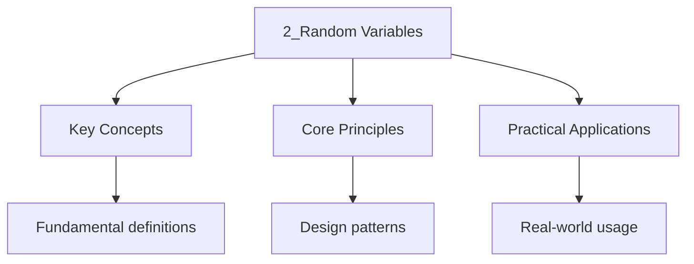

---

date: 2026-07-23T21:57:32+01:00
title: "Random Variables | Mathematics"
description: 'UNIVERSITY Mathematics notes: Random Variables. Comprehensive study material with definitions, examples, and assessment tools.'
tags:
  - Mathematics
  - University
---

<!-- Breadcrumb Schema for SEO -->

### 2.1 Definition and Distribution Functions

**Definition.** A **random variable** is a measurable function $X : \Omega \to \mathbb{R}$. The
**cumulative distribution function (CDF)** of $X$ is

$$F_X(x) = P(X \leq x)$$

**Proposition 2.1 (Properties of the CDF).**

1. $F$ is non-decreasing: if $a \leq b$ Then $F(a) \leq F(b)$.
2. $\lim_{x \to -\infty} F(x) = 0$ and $\lim_{x \to +\infty} F(x) = 1$.
3. $F$ is right-continuous: $\lim_{x \to a^+} F(x) = F(a)$.

_Proof._ (1) If $a \leq b$ Then $\{X \leq a\} \subseteq \{X \leq b\}$ So
$F(a) = P(X \leq a) \leq P(X \leq b) = F(b)$ by Proposition 1.1(3).

(2) As $x \to -\infty$The events $\{X \leq x\}$ decrease to $\emptyset$ So by continuity from above
of probability measures, $F(x) \to 0$. As $x \to +\infty$The events increase to $\Omega$ So
$F(x) \to 1$.

(3) As $x \to a^+$The events $\{X \leq x\}$ decrease to $\{X \leq a\}$Giving right-continuity.
$\blacksquare$

### 2.2 Discrete Random Variables

A random variable is **discrete** if its range is countable. The **probability mass function (PMF)**
is $p_X(x) = P(X = x)$.

**Definition (Expected Value).** For a discrete random variable:

$$E[X] = \sum_{x} x\, p_X(x)$$

Provided the sum converges absolutely.

**Definition (Variance).** $\mathrm{Var}(X) = E[(X - \mu)^2] = E[X^2] - (E[X])^2$ where $\mu = E[X]$.

**Proposition 2.2 (Linearity of Expectation).** $E[aX + bY] = aE[X] + bE[Y]$ for any random
variables $X$, $Y$ and constants $a$, $b$.

_Proof._ Direct computation from the definition of expected value. For the discrete case:

$$E[aX + bY] = \sum_{x,y} (ax + by)\, p_{X,Y}(x,y) = a\sum_x x\, p_X(x) + b\sum_y y\, p_Y(y) = aE[X] + bE[Y]$$

$\blacksquare$

### 2.3 Continuous Random Variables

A random variable is **continuous** if its CDF is absolutely continuous, i.e., there exists a
**probability density function (PDF)** $f_X$ such that

$$F_X(x) = \int_{-\infty}^{x} f_X(t)\, dt$$

**Key properties:**

1. $f_X(x) \geq 0$ for all $x$.
2. $\int_{-\infty}^{\infty} f_X(x)\, dx = 1$.
3. $P(a \leq X \leq b) = \int_a^b f_X(x)\, dx$.
4. $P(X = a) = 0$ for any single point $a$.

### 2.4 Common Distributions

**Discrete distributions:**

| Distribution       | PMF                             | $E[X]$    | $\mathrm{Var}(X)$ |
| ------------------ | ------------------------------- | --------- | ---------------- |
| Bernoulli$(p)$     | $p^x(1-p)^{1-x}$, $x \in \{0,1\}$ | $p$       | $p(1-p)$         |
| Binomial$(n,p)$    | $\binom{n}{x}p^x(1-p)^{n-x}$    | $np$      | $np(1-p)$        |
| Poisson$(\lambda)$ | $e^{-\lambda}\lambda^x / x!$    | $\lambda$ | $\lambda$        |
| Geometric$(p)$     | $(1-p)^{x-1}p$, $x \geq 1$        | $1/p$     | $(1-p)/p^2$      |

**Continuous distributions:**

| Distribution           | PDF                                                     | $E[X]$      | $\mathrm{Var}(X)$ |
| ---------------------- | ------------------------------------------------------- | ----------- | ---------------- |
| Uniform$(a,b)$         | $1/(b-a)$ on $[a,b]$                                    | $(a+b)/2$   | $(b-a)^2/12$     |
| Exponential$(\lambda)$ | $\lambda e^{-\lambda x}$, $x \geq 0$                      | $1/\lambda$ | $1/\lambda^2$    |
| $N(\mu, \sigma^2)$     | $\frac{1}{\sigma\sqrt{2\pi}}e^{-(x-\mu)^2/(2\sigma^2)}$ | $\mu$       | $\sigma^2$       |

### 2.5 The Normal Distribution

**Definition.** $X \sim N(\mu, \sigma^2)$ if $X$ has PDF
$f(x) = \frac{1}{\sigma\sqrt{2\pi}}\exp\left(-\frac{(x-\mu)^2}{2\sigma^2}\right)$.

**Theorem 2.3 (Standardisation).** If $X \sim N(\mu, \sigma^2)$ Then
$Z = (X - \mu)/\sigma \sim N(0, 1)$.

_Proof._ The CDF of $Z$:
$P(Z \leq z) = P(X \leq \mu + \sigma z) = \int_{-\infty}^{\mu + \sigma z} \frac{1}{\sigma\sqrt{2\pi}} e^{-t^2/2}\, dt$.
Substituting $u = (t - \mu)/\sigma$:
$= \int_{-\infty}^{z} \frac{1}{\sqrt{2\pi}} e^{-u^2/2}\, du$Which is the CDF of $N(0, 1)$.
$\blacksquare$

**Theorem 2.4 (Moment Generating Function).** If $X \sim N(\mu, \sigma^2)$ Then

$$M_X(t) = E[e^{tX}] = \exp\left(\mu t + \frac{\sigma^2 t^2}{2}\right)$$

_Proof._
$M_X(t) = \int_{-\infty}^{\infty} e^{tx} \frac{1}{\sigma\sqrt{2\pi}} e^{-(x-\mu)^2/(2\sigma^2)}\, dx$.
Completing the square in the exponent and evaluating the Gaussian integral gives the result.
$\blacksquare$

### 2.6 Moment Generating Functions

**Definition.** The **moment generating function (MGF)** of $X$ is $M_X(t) = E[e^{tX}]$ (when it
exists in a neighbourhood of $t = 0$).

**Theorem 2.5.** If the MGF exists in a neighbourhood of 0, it uniquely determines the distribution.
Furthermore, $E[X^n] = M_X^{(n)}(0)$.

### 2.7 Intuition: What Is a Random Variable?

A random variable is a function that converts uncertain outcomes into numbers, making it possible to compute averages, variances, and probabilities of numerical events. The cumulative distribution function $F_X(x) = P(X \leq x)$ tells you the probability that $X$ falls at or below a given value, and it completely determines the distribution of $X$. For discrete random variables, the probability mass function gives the probability at each point. For continuous random variables, the probability density function gives the "rate" at which probability accumulates, and probabilities are computed by integrating.

Expected value is the long-run average: if you repeated an experiment infinitely many times and averaged the results, the expected value is what you would converge to. Variance measures spread around the mean. The normal distribution is special because the central limit theorem shows that sums of many independent random variables, regardless of their original distribution, tend toward a normal distribution. Moment generating functions encode all moments of a distribution into a single function, and they convert the hard operation of convolution (adding independent random variables) into the easy operation of multiplication.

### 2.8 Worked Examples

**Problem.** Let $X \sim \mathrm{Poisson}(3)$ and $Y \sim \mathrm{Poisson}(5)$ be independent. Find
the distribution of $X + Y$.

Solution

The MGF of $X \sim \mathrm{Poisson}(\lambda)$ is $M_X(t) = e^{\lambda(e^t - 1)}$.

$M_{X+Y}(t) = M_X(t) \cdot M_Y(t) = e^{3(e^t - 1)} \cdot e^{5(e^t - 1)} = e^{8(e^t - 1)}$.

This is the MGF of $\mathrm{Poisson}(8)$. Since the MGF uniquely determines the distribution,
$X + Y \sim \mathrm{Poisson}(8)$.

$\blacksquare$

Worked Example: Minimum of Exponential Random Variables

_Solution._ Let $X_1, \ldots, X_n$ be independent with $X_i \sim \mathrm{Exp}(\lambda_i)$. Find the
distribution of $M = \min(X_1, \ldots, X_n)$.

$P(M > t) = P(X_1 > t, \ldots, X_n > t) = \prod_{i=1}^{n} P(X_i > t) = \prod_{i=1}^{n} e^{-\lambda_i t} = e^{-(\lambda_1 + \cdots + \lambda_n)t}$

So $P(M \leq t) = 1 - e^{-\lambda t}$ where $\lambda = \sum_{i=1}^{n} \lambda_i$. This means
$M \sim \mathrm{Exp}(\lambda)$. $\blacksquare$

### 2.10 Common Mistakes

**Mistake 1: Confusing $P(A|B)$ with $P(B|A)$.**
The conditional probability $P(A|B) = P(A \cap B)/P(B)$ is not the same as $P(B|A) = P(A \cap B)/P(A)$. These are equal only when $P(A) = P(B)$. A common error is to assume that if $P(A|B)$ is high, then $P(B|A)$ is also high. This is the basis of the prosecutor's fallacy.

**Mistake 2: Assuming that independence implies uncorrelatedness.**
If two random variables $X$ and $Y$ are independent, then they are uncorrelated (their covariance is zero). However, the converse is not true: uncorrelated variables can be dependent. For example, let $X$ be uniform on $\{-1, 0, 1\}$ and $Y = X^2$. Then $X$ and $Y$ are uncorrelated but not independent.

**Mistake 3: Forgetting Bayes' theorem.**
Bayes' theorem states that $P(A|B) = P(B|A)P(A)/P(B)$. A common mistake is to ignore the prior $P(A)$ and the evidence $P(B)$, leading to incorrect updates of probabilities. Always use the full form of Bayes' theorem when updating beliefs based on new evidence.

**Mistake 4: Confusing the expectation of a product with the product of expectations.**
$E[XY] = E[X]E[Y]$ holds only when $X$ and $Y$ are independent (or uncorrelated). as a rule, $E[XY] \neq E[X]E[Y]$. Do not assume that the expectation of a product factors without checking independence.

**Mistake 5: Forgetting that variance is not linear.**
$\mathrm{Var}(aX + b) = a^2 \mathrm{Var}(X)$, not $a \mathrm{Var}(X) + b$. The variance of a sum is $\mathrm{Var}(X + Y) = \mathrm{Var}(X) + \mathrm{Var}(Y) + 2\mathrm{Cov}(X, Y)$. If $X$ and $Y$ are independent, then $\mathrm{Var}(X + Y) = \mathrm{Var}(X) + \mathrm{Var}(Y)$, but this does not hold as a rule.

## Cross-References

- **[Probability Spaces](1_probability-spaces.md)**: Probability spaces provide the foundational framework for defining random variables and their distributions.
- **[Joint Distributions and Independence](3_joint-distributions-and-independence.md)**: Joint distributions describe the behavior of multiple random variables simultaneously.
- **[Limit Theorems](4_limit-theorems.md)**: The central limit theorem shows that sums of random variables converge to normal distributions.

- [Quantum Mechanics](https://physics.wyattau.com/docs/quantum-mechanics)
- [Graph Theory](https://computer-science.wyattau.com/docs/graph-theory)
- [Classical Mechanics](https://physics.wyattau.com/docs/classical-mechanics)
- [Electromagnetism](https://physics.wyattau.com/docs/electromagnetism)
- [Statistical Learning](https://machine-learning.wyattau.com/docs/statistical-learning)
- [Statistical Mechanics](https://physics.wyattau.com/docs/statistical-mechanics)
