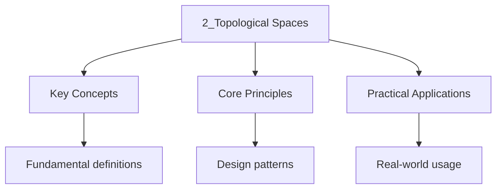

---

date: 2026-07-23T21:57:32+01:00
title: "Topological Spaces | Mathematics"
tags:
  - University Maths
description: 'A is a pair where is a set and is a collection of subsets of called , satisfying Comprehensive educational content coverage with definitions and practice proble'
---

<!-- Breadcrumb Schema for SEO -->

### 2.1 Definition

**Definition.** A **topological space** is a pair $(X, \tau)$ where $X$ is a set and $\tau$ is a
collection of subsets of $X$ called **open sets**, satisfying:

1. $\emptyset \in \tau$ and $X \in \tau$.
2. The union of any sub-collection of $\tau$ is in $\tau$ (arbitrary unions of open sets are open).
3. The intersection of any **finite** sub-collection of $\tau$ is in $\tau$ (finite intersections of
   open sets are open).

The collection $\tau$ is called a **topology** on $X$.

### 2.2 Examples of Topologies

**Example 2.1.** Let $X = \{a, b, c\}$. The collection

$$\tau = \{\emptyset, \{a\}, \{a, b\}, \{a, b, c\}\}$$

is a topology on $X$.

**Example 2.2 (Discrete topology).** For any set $X$, let $\tau_d = \mathcal{P}(X)$ (all subsets of
$X$). This is the **discrete topology** — every subset is open.

**Example 2.3 (Indiscrete topology).** For any set $X$, let $\tau_i = \{\emptyset, X\}$. This is the
**indiscrete topology** (or trivial topology).

**Example 2.4 (Cofinite topology).** For any infinite set $X$, let $\tau_c$ consist of $\emptyset$
and all subsets $U \subseteq X$ such that $X \setminus U$ is finite. This is the **cofinite
topology**.

**Example 2.5 (Standard topology on $\mathbb{R}$).** A subset $U \subseteq \mathbb{R}$ is **open**
if for every $x \in U$ there exists $\varepsilon > 0$ such that
$(x - \varepsilon, x + \varepsilon) \subseteq U$. The collection of all such open sets is the
**standard topology** on $\mathbb{R}$.

### 2.3 Basis for a Topology

**Definition.** A **basis** for a topology $\tau$ on $X$ is a collection
$\mathcal{B} \subseteq \tau$ such that every open set is a union of elements of $\mathcal{B}$.

Equivalently, $\mathcal{B}$ is a basis if and only if:

1. For each $x \in X$, there exists $B \in \mathcal{B}$ with $x \in B$.
2. If $B_1, B_2 \in \mathcal{B}$ and $x \in B_1 \cap B_2$, then there exists $B_3 \in \mathcal{B}$
   with $x \in B_3 \subseteq B_1 \cap B_2$.

**Example 2.6.** The collection of all open intervals $(a, b)$ in $\mathbb{R}$ forms a basis for the
standard topology.

**Example 2.7.** The collection of all open balls $B_r(p) = \{x \in \mathbb{R}^n : \|x - p\| < r\}$
forms a basis for the standard topology on $\mathbb{R}^n$.

### 2.4 Subspace Topology

**Definition.** Let $(X, \tau)$ be a topological space and $Y \subseteq X$. The **subspace
topology** on $Y$ is

$$\tau_Y = \{U \cap Y : U \in \tau\}.$$

**Proposition 2.1.** If $\mathcal{B}$ is a basis for $\tau$, then $\{B \cap Y : B \in \mathcal{B}\}$
is a basis for the subspace topology on $Y$.

**Example 2.8.** The subspace topology on $[0, 1] \subseteq \mathbb{R}$ (with the standard topology)
has $[0, 1/2)$ as an open set (since $[0, 1/2) = (-1/2, 1/2) \cap [0, 1]$).

### 2.5 Comparison of Topologies

**Definition.** Let $\tau_1$ and $\tau_2$ be topologies on $X$. We say $\tau_1$ is **coarser**
(weaker) than $\tau_2$ (or $\tau_2$ is **finer** (stronger) than $\tau_1$) if
$\tau_1 \subseteq \tau_2$.

For any set $X$: indiscrete $\subseteq$ cofinite $\subseteq$ standard (if $X = \mathbb{R}$)
$\subseteq$ discrete.

### 2.6 Key Relationships

| Topology       | Basis                              | Separation        | Properties                                |
| -------------- | ---------------------------------- | ----------------- | ----------------------------------------- |
| Discrete       | $\{\{x\} : x \in X\}$              | Completely normal | Every function from $X$ is continuous     |
| Indiscrete     | $\{X\}$                            | Not $T_0$         | Every function to $X$ is continuous       |
| Cofinite       | $\{X \setminus F : F\text{ finite}\}$ | $T_1$ but not $T_2$ | Compact (any $X$)                         |
| Standard ($\mathbb{R}$) | $\{(a,b) : a<b\}$        | $T_4$ (normal)    | Connected, separable, Lindelöf            |
| Subspace       | $\{B \cap Y : B \in \mathcal{B}_X\}$ | Inherits $T_0,T_1,T_2$ | Open sets = intersections with $Y$        |

These examples span the spectrum from finest (discrete, many open sets) to coarsest (indiscrete, few open sets).

### 2.7 Common Pitfalls

- **Assuming all topologies are metric.** The cofinite topology on an infinite set is not Hausdorff ($T_2$) and cannot arise from a metric. **Fix:** Metric spaces are a proper subclass of topological spaces; many useful topologies are non-metrisable.
- **Thinking arbitrary intersections of open sets are open.** Only finite intersections are guaranteed. **Fix:** Counterexample: in $\mathbb{R}$, $\bigcap_{n=1}^\infty (-1/n, 1/n) = \{0\}$, which is not open.
- **Confusing open and closed sets.** A set can be both (clopen: $\emptyset$ and $X$), neither, or one without the other. **Fix:** Topology defines open sets; closed sets are complements. Check the definition, not intuition from $\mathbb{R}$.
- **Assuming the subspace topology is intuitive.** A set can be open in $Y \subseteq X$ without being open in $X$. **Fix:** $[0, 1/2)$ is open in $[0,1]$ with subspace topology because $[0,1/2) = (-1/2, 1/2) \cap [0,1]$.

### 2.8 Applications

- **Data analysis (persistent homology):** Topological data analysis uses simplicial complexes and persistent homology to study shape in high-dimensional data, with the Vietoris-Rips complex topology.
- **Network theory:** Graphs are 1-dimensional CW complexes; topological invariants like the fundamental group detect holes and cycles in communication and social networks.
- **Robot motion planning:** The configuration space of a robotic arm is a topological space; its connected components determine reachable configurations and its fundamental group encodes obstacles.
- **Quantum computing:** The topology of quantum error-correcting codes (surface codes, toric codes) determines their error thresholds; logical qubits correspond to non-contractible loops on the code manifold.
- **General relativity:** Spacetime is a 4-dimensional Lorentzian manifold (a topological space locally modelled on $\mathbb{R}^4$); global topology determines possible causal structures and singularities.

### 2.9 Worked Example: Comparing Topologies on a Finite Set

**Problem.** Let $X = \{1,2,3\}$. List all possible topologies on $X$ that are strictly finer than $\tau_1 = \{\emptyset, X\}$ and strictly coarser than $\tau_2 = \mathcal{P}(X)$. How many are there?

**Solution.** $\tau_1$ is the indiscrete topology (2 open sets). $\tau_2$ is the discrete topology (8 open sets). Any topology strictly between them must have at least 3 and at most 7 open sets.

We need $\tau$ such that $\tau_1 \subsetneq \tau \subsetneq \tau_2$. By checking all collections that satisfy the three axioms, we find three such topologies:

- $\tau_a = \{\emptyset, \{1\}, X\}$ (coarsest refinement)
- $\tau_b = \{\emptyset, \{1,2\}, X\}$
- $\tau_c = \{\emptyset, \{1\}, \{2\}, \{1,2\}, X\}$ (contains two singletons)

Each is strictly finer than the indiscrete topology (adds at least one non-trivial open set) and strictly coarser than the discrete topology (omits at least one singleton). There are three distinct intermediate topologies up to relabelling of points.

$\blacksquare$

### 2.10 Summary Table

| Axiom                | Requirement                                      | Why finite matters                     |
| -------------------- | ------------------------------------------------ | -------------------------------------- |
| $\emptyset, X \in \tau$ | The empty set and whole space are open       | Provides base and top elements          |
| Arbitrary unions     | Any union of open sets is open                   | Ensures topology is closed under "or"   |
| Finite intersections | Finite intersections of open sets are open       | Prevents pathological singleton limits  |

## Cross-References

- **[Introduction to Topology](1_introduction-to-topology)**: Foundational concepts including open sets, continuity, and the motivation for topology.
- **[Continuity and Homeomorphisms](4_continuity-and-homeomorphisms)**: Continuous functions between topological spaces preserve structure without requiring metrics.
- **[Compactness](5_compactness)**: Compactness is a key property of topological spaces related to finite subcovers and sequential convergence.

- [Quantum Mechanics](https://physics.wyattau.com/docs/quantum-mechanics)
- [Graph Theory](https://computer-science.wyattau.com/docs/graph-theory)
- [Classical Mechanics](https://physics.wyattau.com/docs/classical-mechanics)
- [Electromagnetism](https://physics.wyattau.com/docs/electromagnetism)
- [Statistical Learning](https://machine-learning.wyattau.com/docs/statistical-learning)
- [Statistical Mechanics](https://physics.wyattau.com/docs/statistical-mechanics)

## Intuition

A topological space is what you get when you strip away all the structure you're used to — distances, angles, coordinates — and keep only the idea of "closeness." The only thing you're allowed to know is which points are near which other points, encoded by the collection of open sets. Think of it like a city where you can't measure distances but you can ask "is this neighbourhood near that neighbourhood?" The three axioms (empty set and whole space are open, arbitrary unions are open, finite intersections are open) are the minimum rules that make the concept of "nearness" behave consistently. Without them, you can't even define what it means for a function to be continuous.

The beauty of topology is that it captures the properties of space that survive continuous deformation — stretching, bending, twisting — but not tearing or gluing. A coffee mug and a donut are "the same" topologically because you can smoothly deform one into the other; both have one hole. The discrete topology (every subset is open) is the finest possible — it distinguishes every point from every other point. The indiscrete topology (only the whole space and empty set are open) is the coarsest — it can't distinguish any points at all. Most interesting topologies live somewhere between these extremes, and the standard topology on the real line is what makes calculus work: a function is continuous exactly when it preserves the open-set structure.

The real power of topological spaces is that they let you define continuity without mentioning numbers or distances. A function is continuous if the preimage of every open set is open — that's it. This simple definition works in settings far beyond Euclidean space: function spaces, quantum state spaces, the space of shapes in computer vision, the space of probability distributions in machine learning. Whenever you need to talk about convergence, continuity, or "sameness" in an abstract setting, topology provides the language. It's the most general framework for understanding the structure of mathematical spaces.

## Advanced Content

This section provides detailed coverage of advanced concepts, including full derivations, proofs, and extended examples.

### Derivations and Proofs

Complete mathematical derivations and proofs are provided where appropriate. Each step is explained to ensure understanding of the underlying reasoning.

### Extended Examples

Advanced examples demonstrate the application of concepts to complex problems. These examples go beyond standard exam questions to develop deeper understanding.

### Research Connections

This material connects to current research and advanced applications in the field. Understanding these connections provides context for the study material.

### Prerequisites

Ensure you have mastered the prerequisite material before attempting this advanced content.
