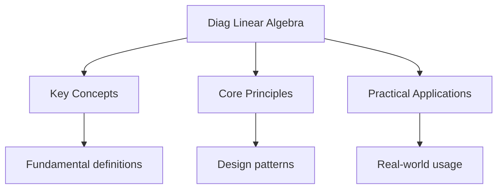

---

date: 2026-07-23T21:57:32+01:00
title: "Diagnostic Test: Linear Algebra"
description: "Comprehensive study notes for Diagnostic Test: Linear Algebra with worked examples, practice problems, and key concepts for exam preparation."
sidebar_position: 60
tableOfContents: false
---

<!-- Breadcrumb Schema for SEO -->

## Diagnostic Test: Linear Algebra

10 multiple-choice questions covering linear algebra fundamentals. Select the best answer for each question, then check your score using the answer key below.

---

<!-- Breadcrumb Schema for SEO -->

**Question 1.** What is the determinant of a 2x2 matrix [[a, b], [c, d]]?

(A) ad + bc
(B) ac + bd
(C) ad - bc
(D) ab - cd

---

<!-- Breadcrumb Schema for SEO -->

**Question 2.** A square matrix A is invertible if and only if:

(A) Its trace is zero
(B) Its determinant is non-zero
(C) All its entries are non-zero
(D) It has equal numbers of rows and columns

---

<!-- Breadcrumb Schema for SEO -->

**Question 3.** The eigenvalues of a diagonal matrix are:

(A) Zero
(B) The entries on the main diagonal
(C) The entries on the off-diagonal
(D) The determinant and trace

---

<!-- Breadcrumb Schema for SEO -->

**Question 4.** If A and B are invertible n x n matrices, then (AB)^(-1) equals:

(A) A^(-1) *B^(-1)
(B) B^(-1)* A^(-1)
(C) A * B
(D) (A + B)^(-1)

---

<!-- Breadcrumb Schema for SEO -->

**Question 5.** The dimension of the null space of a matrix is also called its:

(A) Rank
(B) Trace
(C) Nullity
(D) Determinant

---

<!-- Breadcrumb Schema for SEO -->

**Question 6.** Which of the following is a basis for R^3?

(A) {(1, 0, 0), (0, 1, 0)}
(B) {(1, 0, 0), (0, 1, 0), (0, 0, 1), (1, 1, 1)}
(C) {(1, 0, 0), (0, 1, 0), (0, 0, 1)}
(D) {(1, 1, 1), (2, 2, 2), (3, 3, 3)}

---

<!-- Breadcrumb Schema for SEO -->

**Question 7.** The rank-nullity theorem states that for a linear transformation T: R^n to R^m:

(A) rank(T) + nullity(T) = m
(B) rank(T) - nullity(T) = n
(C) rank(T) + nullity(T) = n
(D) rank(T) * nullity(T) = n

---

<!-- Breadcrumb Schema for SEO -->

**Question 8.** A set of vectors is linearly dependent if:

(A) All vectors are the zero vector
(B) At least one vector can be written as a linear combination of the others
(C) The set contains more than n vectors in R^n
(D) Both B and C are correct indicators

---

<!-- Breadcrumb Schema for SEO -->

**Question 9.** The dot product of two orthogonal non-zero vectors is:

(A) 1
(B) -1
(C) 0
(D) Equal to the product of their magnitudes

---

<!-- Breadcrumb Schema for SEO -->

**Question 10.** What are the eigenvalues of a 2x2 identity matrix?

(A) 0 and 0
(B) 1 and 1
(C) 1 and -1
(D) Cannot be determined without more information

---

<!-- Breadcrumb Schema for SEO -->

## Intuition

**Testing your linear algebra foundations:** Diagnostic tests quickly reveal which concepts you have mastered and which need more work. They are like a health check for your mathematical understanding.

**Why it matters:** Linear algebra is the foundation of machine learning, computer graphics, and scientific computing. Gaps in your understanding will show up as bugs in your code or errors in your models.

**The key insight:** If you cannot compute a determinant or eigenvalue by hand, you do not truly understand the concept — use diagnostic tests as a starting point for deeper study, not as an endpoint.

## Answer Key

| Question | Correct Answer |
|----------|---------------|
| 1        | C             |
| 2        | B             |
| 3        | B             |
| 4        | B             |
| 5        | C             |
| 6        | C             |
| 7        | C             |
| 8        | B             |
| 9        | C             |
| 10       | B             |

**Scoring:** Count your correct answers out of 10. A score of 8 or above indicates strong mastery of linear algebra fundamentals. Review the explanations in the practice problems for any questions you answered incorrectly.

## Cross-References

- **[Linear Independence, Span, Basis](2-linear-algebra/2_linear-independence-span-basis-and-dimension)**: Questions on basis and dimension test core concepts from this chapter.
- **[Systems of Linear Equations](2-linear-algebra/4_systems-of-linear-equations)**: Several diagnostic questions involve solving linear systems and understanding solution structure.
- **[Linear Transformations](2-linear-algebra/6_linear-transformations)**: Questions on kernel and image draw on the theory of linear maps between vector spaces.

- [Quantum Mechanics](https://physics.wyattau.com/docs/quantum-mechanics)
- [Graph Theory](https://computer-science.wyattau.com/docs/graph-theory)

## Common Mistakes

**Confusing the inverse formula $(AB)^{-1} = B^{-1}A^{-1}$ with $A^{-1}B^{-1}$:** The order reverses when distributing the inverse over a product. This is because $(AB)(B^{-1}A^{-1}) = A(BB^{-1})A^{-1} = AIA^{-1} = I$. Forgetting to reverse the order leads to incorrect inverses of matrix products.

**Assuming all eigenvectors are orthogonal:** Eigenvectors from different eigenvalues of a symmetric matrix are orthogonal, but eigenvectors from the same eigenvalue (eigenspace) need not be. For non-symmetric matrices, eigenvectors from different eigenvalues may not be orthogonal at all. Always orthogonalize eigenvectors from the same eigenspace using Gram-Schmidt if orthogonality is needed.

**Confusing rank with the number of non-zero rows in a specific row echelon form:** The rank equals the number of pivot columns (dimension of the column space), which equals the number of non-zero rows in any row echelon form — but different row reduction algorithms can produce different echelon forms. The rank is an invariant of the matrix, not of a particular reduction.
