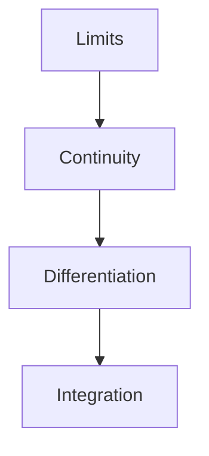

## Algebra

**Binomial**: An algebraic expression with two terms, such as (a + b). The binomial theorem provides a formula for expanding (a + b)ⁿ.

**Completing the Square**: A method for solving quadratic equations by rewriting ax² + bx + c in the form a(x - h)² + k. Used to derive the quadratic formula.

**Discriminant**: For a quadratic equation ax² + bx + c = 0, the discriminant is Δ = b² - 4ac. Determines the nature of roots: positive (two real), zero (one repeated), negative (complex).

**Exponent**: The power to which a number is raised. In aⁿ, n is the exponent. Laws include aᵐ · aⁿ = aᵐ⁺ⁿ and (aᵐ)ⁿ = aᵐⁿ.

**Function**: A relation where each input has exactly one output, written as f(x). The domain is the set of inputs; the range is the set of outputs.

**Inequality**: A mathematical statement comparing two expressions using <, >, ≤, ≥, or ≠. Solutions are intervals or sets of values.

**Linear Equation**: An equation of the form y = mx + c, where m is the slope and c is the y-intercept. Graphs as a straight line.

**Logarithm**: The inverse of exponentiation. log_b(x) = n means bⁿ = x. Properties include log_b(xy) = log_b(x) + log_b(y).

**Matrix**: A rectangular array of numbers arranged in rows and columns, denoted [aᵢⱼ]. Used to represent linear transformations and solve systems of equations.

**Polynomial**: An expression consisting of variables and coefficients involving only addition, subtraction, multiplication, and non-negative integer exponents. Degree is the highest power.

**Quadratic Formula**: The solutions to ax² + bx + c = 0 are x = (-b ± √(b² - 4ac)) / (2a). Derived from completing the square.

**Quadratic Function**: A polynomial function of degree 2, f(x) = ax² + bx + c. Its graph is a parabola opening upward if a > 0.

**Set**: A well-defined collection of distinct objects, denoted {a, b, c}. Operations include union (∪), intersection (∩), and complement (A').

**System of Equations**: Two or more equations with the same variables. Can be solved by substitution, elimination, or matrix methods.

**Variable**: A symbol representing an unknown quantity in mathematical expressions and equations.

## Calculus

**Antiderivative**: A function F(x) such that F'(x) = f(x). Also called an indefinite integral. Related: [Integral](#integral).

**Chain Rule**: The derivative of a composite function: d/dx[f(g(x))] = f'(g(x)) · g'(x). Essential for differentiating nested functions.

**Convergence**: A sequence or series approaches a finite limit. The series Σaₙ converges if partial sums approach a finite value.

**Critical Point**: A point where f'(x) = 0 or f'(x) is undefined. May be a local maximum, local minimum, or saddle point.

**Derivative**: The instantaneous rate of change of a function: f'(x) = lim[h→0] (f(x+h) - f(x))/h. Represents slope of tangent line.

**Differential Equation**: An equation involving derivatives of a function. Solutions are functions that satisfy the equation. Types: ODE, PDE.

**Differentiation**: The process of finding derivatives. Rules include power rule, product rule, quotient rule, and chain rule.

**Fundamental Theorem of Calculus**: Links differentiation and integration: ∫ₐᵇ f(x)dx = F(b) - F(a), where F'(x) = f(x).

**Improper Integral**: An integral with infinite limits or discontinuous integrand. Evaluated as a limit: ∫₁^∞ f(x)dx = lim[b→∞] ∫₁ᵇ f(x)dx.

**Indefinite Integral**: The family of antiderivatives: ∫f(x)dx = F(x) + C. C is the constant of integration.

**Inflection Point**: A point where the concavity of a function changes. Occurs where f''(x) = 0 or f''(x) is undefined and changes sign.

**Integral**: The limit of a Riemann sum representing the area under a curve: ∫ₐᵇ f(x)dx = lim[n→∞] Σf(xᵢ)Δx. See also [Antiderivative](#antiderivative).

**Integration**: The process of finding integrals. Methods include substitution, integration by parts, partial fractions, and trigonometric substitution.

**Limit**: The value a function approaches as the input approaches a point: lim[x→c] f(x) = L. Foundation of calculus.

**Local Maximum**: A point where f(x) is greater than all nearby values. Occurs at critical points where f''(x) < 0.

**Local Minimum**: A point where f(x) is less than all nearby values. Occurs at critical points where f''(x) > 0.

**Mean Value Theorem**: If f is continuous on [a,b] and differentiable on (a,b), there exists c ∈ (a,b) such that f'(c) = (f(b) - f(a))/(b - a).

**Partial Derivative**: The derivative of a multivariable function with respect to one variable, holding others constant. Denoted ∂f/∂x.

**Riemann Sum**: An approximation of an integral using rectangles: Σf(xᵢ*)Δx. As n → ∞, it approaches the exact integral.

**Series**: The sum of a sequence of terms. A convergent series has a finite sum; a divergent series does not.

**Taylor Series**: An infinite series representation of a function: f(x) = Σf⁽ⁿ⁾(a)/n! · (x-a)ⁿ. Approximates functions near a point.

## Linear Algebra

**Basis**: A set of linearly independent vectors that span a vector space. Every vector in the space can be uniquely expressed as a linear combination of basis vectors.

**Column Space**: The set of all linear combinations of a matrix's columns. Equal to the range of the matrix transformation.

**Determinant**: A scalar value computed from a square matrix that indicates whether the matrix is invertible. det(A) = 0 means A is singular.

**Eigenvalue**: A scalar λ such that A**v** = λ**v** for some non-zero vector **v**. Found by solving det(A - λI) = 0.

**Eigenvector**: A non-zero vector **v** that, when multiplied by matrix A, results in a scalar multiple of itself: A**v** = λ**v**.

**Linear Combination**: An expression of the form c₁**v₁** + c₂**v₂** + ... + cₙ**vₙ**, where cᵢ are scalars and **vᵢ** are vectors.

**Linear Independence**: Vectors are linearly independent if no vector can be written as a linear combination of the others. Equivalent to the only solution of c₁**v₁** + ... + cₙ**vₙ** = **0** being all cᵢ = 0.

**Linear Transformation**: A function T: V → W satisfying T(u + v) = T(u) + T(v) and T(cv) = cT(v). Represented by matrix multiplication.

**Null Space**: The set of all vectors **x** such that A**x** = **0**. A subspace of the domain.

**Rank**: The dimension of the column space (or row space) of a matrix. Equals the number of linearly independent rows or columns.

**Row Space**: The set of all linear combinations of a matrix's rows. Has the same dimension as the column space.

**Scalar Multiplication**: Multiplying a vector by a scalar, scaling its magnitude without changing direction (unless negative).

**Vector Space**: A set of vectors closed under vector addition and scalar multiplication, satisfying eight axioms. Examples include ℝⁿ and function spaces.

**Vector**: A quantity with both magnitude and direction, represented as an ordered tuple of components. Operations include addition and scalar multiplication.

## Analysis

**Cauchy Sequence**: A sequence where terms become arbitrarily close to each other: for all ε > 0, there exists N such that |aₙ - aₘ| < ε for all n, m > N.

**Compactness**: A property of sets where every open cover has a finite subcover. In ℝⁿ, equivalent to being closed and bounded (Heine-Borel theorem).

**Continuity**: A function f is continuous at a point c if lim[x→c] f(x) = f(c). Intuitively, the function has no jumps or breaks.

**Convergence**: A sequence {aₙ} converges to L if for all ε > 0, there exists N such that |aₙ - L| < ε for all n > N.

**Divergence**: A sequence or series that does not approach a finite limit. May diverge to ±∞ or oscillate.

**Domain**: The set of inputs for which a function is defined.

**Extreme Value Theorem**: A continuous function on a closed interval [a,b] attains both a maximum and minimum value.

**Intermediate Value Theorem**: If f is continuous on [a,b] and k is between f(a) and f(b), there exists c ∈ [a,b] such that f(c) = k.

**L'Hôpital's Rule**: For indeterminate forms 0/0 or ∞/∞, lim[f(x)/g(x)] = lim[f'(x)/g'(x)], provided the limit on the right exists.

**Limit Superior**: The largest limit point of a sequence. Also called lim sup. Measures the "long-term" behavior of oscillating sequences.

**Monotonic Sequence**: A sequence that is either entirely non-increasing or non-decreasing. Monotonic bounded sequences converge.

**One-to-One (Injection)**: A function where each output corresponds to exactly one input. f(x₁) = f(x₂) implies x₁ = x₂.

**Onto (Surjection)**: A function where every element in the codomain is the image of at least one element in the domain.

**Sequence**: An ordered list of numbers a₁, a₂, a₃, ... indexed by natural numbers.

**Series**: The sum of a sequence: Σₙ₌₁^∞ aₙ = a₁ + a₂ + a₃ + ...

**Topology**: The study of properties preserved under continuous deformations. Deals with open sets, continuity, and connectedness.

## Probability and Statistics

**Bayes' Theorem**: P(A|B) = P(B|A)P(A)/P(B). Relates conditional probabilities and is fundamental to Bayesian inference.

**Combination**: Selection of items where order doesn't matter: C(n,r) = n! / (r!(n-r)!). Also written as "n choose r."

**Conditional Probability**: The probability of event A given event B has occurred: P(A|B) = P(A ∩ B) / P(B).

**Continuous Distribution**: A probability distribution with a continuous random variable. Defined by a probability density function (PDF).

**Correlation**: A measure of the linear relationship between two variables, ranging from -1 to 1. Correlation does not imply causation.

**Discrete Distribution**: A probability distribution with a discrete random variable. Defined by a probability mass function (PMF).

**Expected Value**: The average value of a random variable: E[X] = ΣxᵢP(xᵢ) for discrete variables.

**Mean**: The arithmetic average of a set of values. For a sample: x̄ = (1/n)Σxᵢ.

**Median**: The middle value when data is ordered. For even sample sizes, the average of the two middle values.

**Normal Distribution**: A bell-shaped continuous distribution: f(x) = (1/σ√(2π))e^(-(x-μ)²/2σ²). Characterized by mean μ and standard deviation σ.

**Permutation**: Arrangement of items where order matters: P(n,r) = n! / (n-r)!.

**Probability**: The likelihood of an event occurring, ranging from 0 to 1. P(A) = (favorable outcomes) / (total outcomes).

**Random Variable**: A variable whose value is determined by the outcome of a random experiment. Can be discrete or continuous.

**Sample Space**: The set of all possible outcomes of a random experiment, denoted S.

**Standard Deviation**: The square root of variance: σ = √(Σ(xᵢ - μ)²/N). Measures the spread of data.

**Variance**: The average of squared deviations from the mean: Var(X) = E[(X - μ)²]. Measures dispersion.

## Related Resources

- [Algebra Tutorials](../../../../sat/src/content/docs/mathematics/algebra)
- [Calculus Guide](../../../../hsc/src/content/docs/mathematics/calculus)
- [Linear Algebra Course](linear-algebra)
- [Probability Problems](probability)
