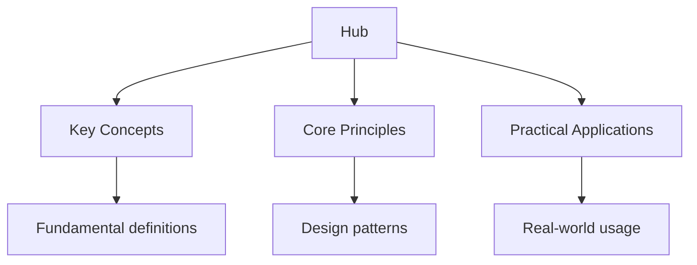

<script type="application/ld+json">
{
  "@context": "https://schema.org",
  "@type": "BreadcrumbList",
  "itemListElement": [
    {"name": "Home", "url": "https://mathematics.wyattau.com"},
    {"name": "Hub", "url": "https://mathematics.wyattau.com/hub"}
  ]
}
</script>

<script type="application/ld+json">
{
  "@context": "https://schema.org",
  "@type": "Course",
  "name": "Complete University Mathematics Study Guide",
  "description": "Comprehensive university mathematics study guide covering all major areas with proof-based notes and prerequisite map.",
  "provider": {
    "@type": "Organization",
    "name": "Wyatt's Notes",
    "url": "https://mathematics.wyattau.com"
  },
  "url": "https://mathematics.wyattau.com/hub",
  "educationalLevel": "University",
  "inLanguage": "en",
  "isAccessibleForFree": true
}
</script>




## Why This Guide Exists

University mathematics is fundamentally different from computational mathematics. It asks not "what is the answer?" but "why must this be true, and what would have to change for it to be false?" This shift — from computation to proof — is what transforms a collection of facts into genuine mathematical understanding.

This hub page maps every resource on this site. The prerequisite map shows you exactly how the subjects connect, so you can study in the right order and build understanding that compounds. Each section includes definitions, theorems, worked examples, common pitfalls, and practice problems.

## Table of Contents

- [Prerequisite Map](#prerequisite-map)
- [Abstract Algebra](#abstract-algebra)
- [Linear Algebra](#linear-algebra)
- [Real Analysis](#real-analysis)
- [Multivariable Calculus](#multivariable-calculus)
- [Ordinary Differential Equations](#ordinary-differential-equations)
- [Complex Analysis](#complex-analysis)
- [Number Theory](#number-theory)
- [Probability and Statistics](#probability-and-statistics)
- [Topology](#topology)
- [Measure Theory](#measure-theory)
- [Functional Analysis](#functional-analysis)
- [Differential Geometry](#differential-geometry)
- [Cross-Site Resources](#cross-site-resources)
- [Proof Techniques](#proof-techniques)
- [FAQ](#faq)

---

## Prerequisite Map

Mathematics is cumulative. Each subject builds on the ones before it. The following map shows the dependencies — study the listed prerequisites before attempting a subject.

```
Linear Algebra ←────────────────────────────────────────────────┐
    │                                                            │
    ├── Abstract Algebra (groups, rings, fields)                 │
    │       └── Galois Theory                                    │
    │                                                            │
    ├── Real Analysis (ε-δ, sequences, continuity)              │
    │       ├── Multivariable Calculus (partial derivatives)     │
    │       │       └── Differential Geometry (manifolds)        │
    │       ├── Complex Analysis (analytic functions)            │
    │       └── Measure Theory (Lebesgue integration)            │
    │               └── Functional Analysis (Banach spaces)      │
    │                                                            │
    ├── ODEs (first-order, second-order, Laplace)               │
    │       └── PDEs (Fourier series, separation of variables)   │
    │                                                            │
    ├── Number Theory (divisibility, primes, congruences)        │
    │                                                            │
    ├── Probability (random variables, distributions)            │
    │       └── Measure Theory (probability spaces)              │
    │                                                            │
    └── Topology (open sets, compactness, connectedness)         │
            └── Functional Analysis (topological vector spaces)  │
```

### Recommended Starting Points

| Your Background | Start Here |
| ---------------- | ------------ |
| Just finished high school | [Linear Algebra](2-linear-algebra) — the most broadly applicable subject |
| Comfortable with proofs | [Real Analysis](3-real-analysis) — the foundation of rigorous mathematics |
| Interested in algebra | [Abstract Algebra](1-abstract-algebra) — groups, rings, and fields |
| Need calculus for physics | [Multivariable Calculus](4-multivariable-calculus) — practical and immediately useful |
| Interested in applied maths | [ODEs](5-ordinary-differential-equations) — the language of dynamical systems |

---

## Abstract Algebra

Abstract algebra studies algebraic structures — groups, rings, fields, and their homomorphisms. It reveals the architecture of mathematical objects by focusing on their symmetries and operations rather than their specific elements.

### Core Topics

- [Groups](1-abstract-algebra/1_groups) — definition, examples, and basic properties
- [Subgroups](1-abstract-algebra/2_subgroups) — criteria for subgroups and lattice of subgroups
- [Lagrange's Theorem](1-abstract-algebra/3_lagrange-s-theorem) — the order of a subgroup divides the order of the group
- [Normal Subgroups and Quotient Groups](1-abstract-algebra/4_normal-subgroups-and-quotient-groups) — when subgroups are "invisible" to the group structure
- [Homomorphisms and Isomorphism Theorems](1-abstract-algebra/5_homomorphisms-and-isomorphism-theorems) — the structural maps between groups
- [Group Actions](1-abstract-algebra/6_group-actions) — how groups act on sets: orbits, stabilisers, and Burnside's lemma
- [The Sylow Theorems](1-abstract-algebra/7_the-sylow-theorems) — existence and conjugacy of p-subgroups
- [Rings](1-abstract-algebra/8_rings) — ring axioms, ideals, and ring homomorphisms
- [Ideals and Quotient Rings](1-abstract-algebra/9_ideals-and-quotient-rings) — building new rings from old
- [Polynomial Rings](1-abstract-algebra/10_polynomial-rings) — Euclidean algorithm and factorisation
- [Euclidean Domains, PIDs, and UFDs](1-abstract-algebra/11_euclidean-domains-pids-and-ufds) — the hierarchy of ring types
- [Field Theory](1-abstract-algebra/12_field-theory) — field extensions and algebraic numbers
- [Galois Theory Fundamentals](1-abstract-algebra/13_galois-theory-fundamentals) — the connection between field extensions and group theory
- [Classification of Groups of Small Order](1-abstract-algebra/16_classification-of-groups-of-small-order)

### Problem Set and Review

- [Worked Examples](1-abstract-algebra/15_worked-examples)
- [Common Pitfalls](1-abstract-algebra/17_common-pitfalls)
- [Problem Set](1-abstract-algebra/18_problem-set)
- [Summary of Key Results](1-abstract-algebra/19_summary-of-key-results)

---

## Linear Algebra

Linear algebra is the most widely applied area of mathematics. It handles vector spaces, linear maps, eigenvalues, and inner product spaces — tools used in data science, quantum mechanics, computer graphics, and virtually every branch of applied mathematics.

### Core Topics

- [Vectors and Vector Spaces](2-linear-algebra/1_vectors-and-vector-spaces) — axioms, examples, and subspaces
- [Linear Independence, Span, Basis, and Dimension](2-linear-algebra/2_linear-independence-span-basis-and-dimension) — the fundamental structural concepts
- [Matrices](2-linear-algebra/3_matrices) — matrix operations, inverse, and rank
- [Systems of Linear Equations](2-linear-algebra/4_systems-of-linear-equations) — Gaussian elimination and row echelon form
- [Eigenvalues and Eigenvectors](2-linear-algebra/5_eigenvalues-and-eigenvectors) — diagonalisation and the characteristic polynomial
- [Inner Product Spaces](2-linear-algebra/7_inner-product-spaces) — orthogonality, Gram-Schmidt, and projections
- [Singular Value Decomposition](2-linear-algebra/8_singular-value-decomposition) — the most important factorisation in applied mathematics

### Problem Set

- [Problem Set](2-linear-algebra/9_problem-set)

---

## Real Analysis

Real analysis provides the rigorous foundation for calculus. The ε-δ framework formalises limits, continuity, differentiation, and integration on the real line. This is where you learn to prove the theorems that calculus takes for granted.

### Core Topics

- [The Real Number System](3-real-analysis/1_the-real-number-system) — completeness, Archimedean property, and density of rationals
- [Sequences and Limits](3-real-analysis/2_sequences-and-limits) — convergence, bounded sequences, and monotone convergence
- [Series](3-real-analysis/3_series) — convergence tests, absolute vs conditional convergence, and rearrangements
- [Continuity](3-real-analysis/4_continuity) — ε-δ definition, uniform continuity, and the intermediate value theorem
- [Differentiability](3-real-analysis/5_differentiability) — the derivative as a limit, mean value theorem, and L'Hôpital's rule
- [Riemann Integration](3-real-analysis/6_riemann-integration) — Riemann sums, integrability conditions, and the fundamental theorem
- [Sequences and Series of Functions](3-real-analysis/7_sequences-and-series-of-functions) — pointwise vs uniform convergence, power series, and Weierstrass M-test

### Problem Set

- [Problem Set](3-real-analysis/8_problem-set)

---

## Multivariable Calculus

Multivariable calculus extends single-variable calculus to functions of several variables. Partial derivatives, multiple integrals, and vector calculus theorems (Green's, Stokes', and Gauss') provide the mathematical tools for physics and engineering.

### Core Topics

- [Partial Derivatives](4-multivariable-calculus/1_partial-derivatives) — gradients, directional derivatives, and the chain rule
- [Multiple Integrals](4-multivariable-calculus/2_multiple-integrals) — double and triple integrals, change of variables, and Jacobians
- [Vector Calculus](4-multivariable-calculus/3_vector-calculus) — gradient, divergence, curl, and their identities
- [Optimisation](4-multivariable-calculus/4_optimization) — critical points, Hessian matrix, and Lagrange multipliers
- [Curves and Surfaces](4-multivariable-calculus/5_curves-and-surfaces) — parameterised curves, tangent spaces, and surface integrals

### Problem Set

- [Problem Set](4-multivariable-calculus/6_problem-set)

---

## Ordinary Differential Equations

ODEs describe how quantities change in relation to each other — the language of dynamical systems, population models, electrical circuits, and mechanical vibrations. The course covers solution techniques, stability analysis, and an introduction to partial differential equations.

### Core Topics

- [Introduction and Classification](5-ordinary-differential-equations/1_introduction-and-classification) — order, linearity, and initial/boundary value problems
- [First-Order ODEs](5-ordinary-differential-equations/2_first-order-odes) — separable, exact, and integrating factor methods
- [Higher-Order Linear ODEs](/5-ordinary-differential-equations/4_higher-order-linear-odes) — characteristic equation, undetermined coefficients, and variation of parameters
- [Laplace Transforms](5-ordinary-differential-equations/5_laplace-transforms) — transforming ODEs into algebraic equations
- [Series Solutions](5-ordinary-differential-equations/6_series-solutions) — power series methods and Frobenius method
- [Fourier Series](5-ordinary-differential-equations/7_fourier-series) — representing periodic functions as sums of sines and cosines
- [Introduction to PDEs](5-ordinary-differential-equations/8_introduction-to-partial-differential-equations) — heat equation, wave equation, and Laplace's equation
- [Stability and Phase Plane Analysis](5-ordinary-differential-equations/9_stability-and-phase-plane-analysis) — equilibrium points, linearisation, and bifurcations

---

## Complex Analysis

Complex analysis studies functions of a complex variable. The central result — differentiability once implies infinite differentiability — makes complex analysis the most elegant branch of analysis. It provides powerful tools for evaluating real integrals and understanding analytic continuation.

### Core Topics

- [Complex Numbers Review](6-complex-analysis/1_complex-numbers-review) — algebra, geometry, and polar form
- [Complex Functions and Analyticity](6-complex-analysis/2_complex-functions-and-analyticity) — the Cauchy-Riemann equations and analytic functions
- [The Cauchy-Riemann Equations](6-complex-analysis/3_the-cauchy-riemann-equations) — necessary and sufficient conditions for analyticity
- [Complex Integration](6-complex-analysis/4_complex-integration) — contour integrals and path independence
- [Cauchy's Theorem](6-complex-analysis/5_cauchy-s-theorem) — the central result: the integral of an analytic function over a closed contour is zero
- [Cauchy's Integral Formula](6-complex-analysis/6_cauchy-s-integral-formula) — recovering function values from boundary integrals
- [Taylor and Laurent Series](6-complex-analysis/7_taylor-and-laurent-series) — series expansions of analytic functions
- [Singularities and Residue Theory](6-complex-analysis/8_singularities-and-residue-theory) — classifying singularities and computing residues
- [Applications of Contour Integration](6-complex-analysis/9_applications-of-contour-integration) — evaluating real integrals using complex methods
- [Conformal Mappings](6-complex-analysis/10_conformal-mappings) — angle-preserving maps and their applications
- [Liouville's Theorem and the Maximum Modulus Principle](6-complex-analysis/11_liouville-s-theorem-and-the-maximum-modulus-principle)
- [Argument Principle and Rouché's Theorem](6-complex-analysis/12_argument-principle-and-rouch-s-theorem)
- [Analytic Continuation](6-complex-analysis/13_analytic-continuation)

### Problem Set and Review

- [Common Pitfalls](6-complex-analysis/14_common-pitfalls)
- [Problem Set](6-complex-analysis/15_problem-set)

---

## Number Theory

Number theory studies the properties of integers — divisibility, primes, congruences, and Diophantine equations. It is both one of the oldest branches of mathematics and one with profound modern applications in cryptography and coding theory.

- [Number Theory](7-number-theory) — Euclidean algorithm, fundamental theorem of arithmetic, modular arithmetic, Fermat's little theorem, and Euler's theorem

---

## Probability and Statistics

Probability theory provides the mathematical framework for uncertainty. Starting from axiomatic probability, it builds through random variables, distributions, and limit theorems to the measure-theoretic foundations used in modern statistics and stochastic processes.

### Core Topics

- [Probability Spaces](8-probability-and-statistics/1_probability-spaces) — sample spaces, events, and the axioms of probability
- [Random Variables](8-probability-and-statistics/2_random-variables) — discrete and continuous random variables, PMFs, PDFs, and CDFs
- [Joint Distributions and Independence](8-probability-and-statistics/3_joint-distributions-and-independence) — marginal and conditional distributions, covariance, and correlation
- [Limit Theorems](8-probability-and-statistics/4_limit-theorems) — law of large numbers and central limit theorem
- [Transformations and Convolutions](8-probability-and-statistics/5_transformations-and-convolutions) — changing variables and adding random variables
- [Probability and Statistics](8-probability-and-statistics/6_probability-and-statistics) — estimation, hypothesis testing, and confidence intervals

---

## Topology

Topology generalises continuity and convergence beyond metric spaces. It studies the properties of spaces that are preserved under continuous deformations — connectivity, compactness, and the fundamental group. Topology is the language of modern geometry and analysis.

### Core Topics

- [Introduction to Topology](9-topology/1_introduction-to-topology) — motivation, examples, and topological equivalence
- [Topological Spaces](9-topology/2_topological-spaces) — open sets, bases, and subbases
- [Closed Sets, Closure, Interior, and Boundary](9-topology/3_closed-sets-closure-interior-and-boundary)
- [Continuity and Homeomorphisms](9-topology/4_continuity-and-homeomorphisms) — the topological notion of continuity
- [Compactness](9-topology/5_compactness) — the topological analogue of finiteness
- [Connectedness](9-topology/6_connectedness) — path-connected and simply connected spaces
- [Metric Spaces](9-topology/7_metric-spaces) — metrics as a special case of topology
- [Separation Axioms](9-topology/8_separation-axioms) — T₀, T₁, T₂, and Hausdorff spaces
- [Introduction to Algebraic Topology](9-topology/9_introduction-to-algebraic-topology) — fundamental group and homotopy

### Review

- [Common Pitfalls](9-topology/10_common-pitfalls)
- [Summary](9-topology/11_summary)

---

## Measure Theory

Measure theory extends integration beyond the Riemann integral. The Lebesgue integral handles a far wider class of functions and provides the rigorous foundation for probability theory, Fourier analysis, and functional analysis.

### Core Topics

- [σ-Algebras and Measurable Spaces](10-measure-theory/1_sigma-algebras-and-measurable-spaces) — the collection of "measurable" sets
- [Measures](10-measure-theory/2_measures) — measure functions and their properties
- [Lebesgue Outer Measure and Carathéodory Extension](10-measure-theory/3_lebesgue-outer-measure-and-caratheodory-extension) — constructing the Lebesgue measure
- [Lebesgue Measurable Sets and Non-Measurable Sets](10-measure-theory/4_lebesgue-measurable-sets-and-non-measurable-sets) — sets that cannot be measured
- [Measurable Functions](10-measure-theory/5_measurable-functions) — the measurability analogue of continuity
- [Lebesgue Integration](10-measure-theory/6_lebesgue-integration) — building integrals with measure theory
- [Lᵖ Spaces](10-measure-theory/7_l-p-spaces) — function spaces with norm structure
- [Fubini and Tonelli Theorems](10-measure-theory/8_fubini-and-tonelli-theorems) — computing multi-dimensional integrals
- [Radon-Nikodym Derivative and Lebesgue Decomposition](10-measure-theory/9_radon-nikodym-derivative-and-lebesgue-decomposition)

### Review

- [Summary of Key Results](10-measure-theory/10_summary-of-key-results)

---

## Functional Analysis

Functional analysis extends linear algebra to infinite-dimensional vector spaces — function spaces. It provides the mathematical framework for quantum mechanics, partial differential equations, and signal processing.

### Core Topics

- [Normed Spaces and Banach Spaces](11-functional-analysis/1_normed-spaces-and-banach-spaces) — completeness and examples
- [Inner Product Spaces and Hilbert Spaces](11-functional-analysis/2_inner-product-spaces-and-hilbert-spaces) — orthogonality in infinite dimensions
- [Bounded Linear Operators](11-functional-analysis/3_bounded-linear-operators) — continuous linear maps between Banach spaces
- [The Fundamental Theorems](11-functional-analysis/4_the-fundamental-theorems) — Hahn-Banach, open mapping, and closed graph theorems
- [Compact Operators](11-functional-analysis/5_compact-operators) — the infinite-dimensional analogue of matrices with finite rank
- [Weak and Weak Convergence](11-functional-analysis/6_weak-and-weak-convergence) — convergence in weaker topologies
- [Applications](11-functional-analysis/7_applications) — quantum mechanics, PDE theory, and optimisation

### Review

- [Historical Context](11-functional-analysis/8_historical-context)
- [Summary of Key Theorems](11-functional-analysis/9_summary-of-key-theorems)

---

## Differential Geometry

Differential geometry studies smooth manifolds and geometric structures on them — curvature, connections, and geodesics. It connects calculus to geometry, enabling the study of curved spaces that appear in general relativity and modern geometry.

### Core Topics

- [Smooth Manifolds](12-differential-geometry/1_smooth-manifolds) — charts, atlases, and smooth structures
- [Tangent Spaces and Tangent Bundles](12-differential-geometry/2_tangent-spaces-and-tangent-bundles) — the linear approximation to a manifold
- [Vector Fields and Flows](12-differential-geometry/3_vector-fields-and-flows) — integral curves and the exponential map
- [Differential Forms](12-differential-geometry/4_differential-forms) — exterior algebra and integration on manifolds
- [Riemannian Geometry](12-differential-geometry/5_riemannian-geometry) — metrics, distance, and angle measurement
- [Geodesics](12-differential-geometry/6_geodesics) — the straightest paths on curved surfaces
- [Curvature](12-differential-geometry/7_curvature) — Riemann curvature tensor, Ricci curvature, and scalar curvature
- [The Gauss-Bonnet Theorem](12-differential-geometry/8_the-gauss-bonnet-theorem) — connecting topology and geometry

### Review

- [Applications](12-differential-geometry/9_applications)
- [Summary](12-differential-geometry/10_summary)

---

## Diagnostics and Demos

- [Linear Algebra Diagnostic](diagnostics/diag-linear-algebra) — test your understanding of vectors, matrices, and eigenvalues
- [Interactive Demos](demos) — visual tools for exploring mathematical concepts

---

## Cross-Site Resources

Mathematics provides the foundations for physics and applied fields:

- **[University Physics](https://physics.wyattau.com/hub)** — mechanics, electromagnetism, quantum mechanics, and thermal physics: the primary consumers of mathematical tools
- **[C++ Programming](https://programming.wyattau.com/hub)** — numerical methods, computational geometry, and scientific computing
- **[IB Mathematics](https://ib.wyattau.com/maths)** — IB-level mathematics at SL and HL
- **[DSE Mathematics](https://dse.wyattau.com/maths)** — secondary-level mathematics for the Hong Kong DSE

---

## Proof Techniques

Proof-based mathematics requires mastery of several proof strategies. Knowing which technique to reach for is the core skill of mathematical reasoning.

| Technique | When to Use | Example |
| ----------- | ------------- | --------- |
| Direct proof | Implication P ⇒ Q | "If n is even, then n² is even" |
| Contrapositive | Easier to prove ¬Q ⇒ ¬P | "If n² is odd, then n is odd" |
| Contradiction | Assume ¬P, derive contradiction | Irrationality of √2 |
| Induction | Statement about natural numbers | Σi = n(n+1)/2 |
| Construction | Existence proof | "There exist infinitely many primes" |
| Case analysis | Statement splits into cases | "Every integer is even or odd" |

### Tips for Writing Proofs

1. **State what you are proving clearly** — rephrase the theorem in your own words
2. **Identify the hypothesis and conclusion** — know what you are given and what you must show
3. **Work backwards from the conclusion** — what would you need to prove the final statement?
4. **Use definitions** — every proof starts with what you know by definition
5. **Be precise** — every step must follow logically from the previous one
6. **Check edge cases** — does the proof work for n = 0, n = 1, negative numbers, etc.?

---

## Frequently Asked Questions

### Where should I start?

If you are new to proof-based mathematics, start with [Linear Algebra](2-linear-algebra) — it is the most broadly applicable and has the gentlest learning curve. If you are already comfortable with proofs, start with [Real Analysis](3-real-analysis) for the foundations of rigorous calculus, or [Abstract Algebra](1-abstract-algebra) for algebraic structures.

### How long does each subject take?

Each subject requires approximately 6–8 weeks of focused study at a university pace. This means reading the notes, working through the examples, and completing the problem sets. Do not rush — mathematics is cumulative, and weak foundations create problems later.

### Are these notes suitable for self-study?

Yes. Each section includes definitions, theorems, proofs, worked examples, and common pitfalls. Work through the examples with paper and pen — do not just read them. Then attempt the problem sets to test your understanding.

### What is the difference between these notes and a textbook?

These notes follow the standard university curriculum and cover the same material as textbooks like Artin (Algebra), Rudin (Analysis), or Axler (Linear Algebra). They are designed as a complement to — not a replacement for — a full textbook. Use them for quick reference, review, and additional examples.

### How do I get better at proofs?

Practice. Read proofs in the notes, then try to reproduce them from memory. Attempt the problem sets without looking at solutions. Discuss proofs with other students. The ability to write proofs develops through active practice, not passive reading.

### Do I need all these subjects?

It depends on your goals. If you are studying physics, you need linear algebra, ODEs, real analysis, complex analysis, and differential geometry. If you are studying computer science, you need linear algebra, probability, and discrete mathematics (covered in ODEs). If you are studying pure mathematics, you need all of them.

---

*Last updated: 24 July 2026*

*Written by Wyatt. For questions or feedback, visit [wyattau.com](https://wyattau.com).*
