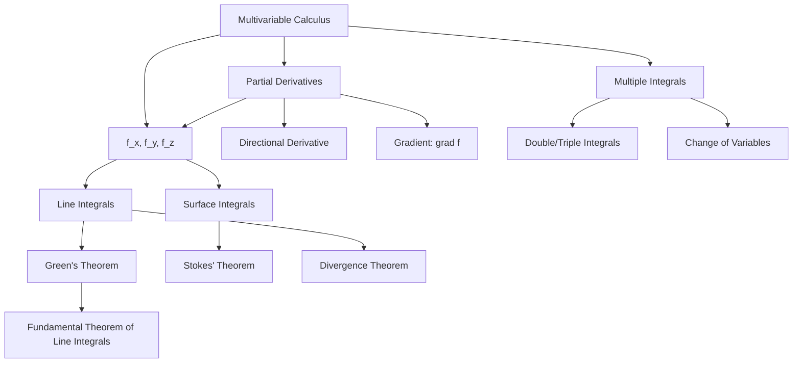

---

title: "Multivariable Calculus | Mathematics"
description: "Multivariable Calculus: comprehensive educational content notes with precise definitions, worked examples, common pitfalls, and practice problems."
date: 2026-04-23T00:00:00.000Z
tags:
  - Mathematics
  - University
categories:
  - Mathematics

---

<!-- Breadcrumb Schema for SEO -->

## 1. Partial Derivatives

### 1.1 Definition

Let $f : D \subseteq \mathbb{R}^n \to \mathbb{R}$. The **partial derivative** of $f$ with respect to
$x_i$ at $\mathbf{a} = (a_1, \ldots, a_n)$ is

$$\frac{\partial f}{\partial x_i}(\mathbf{a}) = \lim_{h \to 0} \frac{f(a_1, \ldots, a_i + h, \ldots, a_n) - f(a_1, \ldots, a_n)}{h}$$

Provided the limit exists. This is the rate of change of $f$ in the direction of the $x_i$-axis,
Holding all other variables fixed.

**Notation.** Common notations for the partial derivative with respect to $x_i$ include $f_{x_i}$,
$\partial_i f$ And $\frac{\partial f}{\partial x_i}$. We use these interchangeably.

### 1.2 Clairaut"s Theorem

**Theorem 1.1 (Clairaut's Theorem / Schwarz’s Theorem).** If $f_{xy}$ and $f_{yx}$ are continuous on
an Open set containing $(a, b)$ Then

$$\frac{\partial^2 f}{\partial x \partial y}(a,b) = \frac{\partial^2 f}{\partial y \partial x}(a,b)$$

_Proof._ Define the second-order difference function

$$\Delta(h, k) = f(a+h,\, b+k) - f(a+h,\, b) - f(a,\, b+k) + f(a, b)$$

For $h, k \neq 0$. Define $\phi(s) = f(s, b+k) - f(s, b)$. Then $\Delta(h,k) = \phi(a+h) - \phi(a)$.
By the Mean Value Theorem, there exists $\theta_1 \in (0, 1)$ such that

$$\Delta(h, k) = h \cdot \phi'(a + \theta_1 h) = h \left[f_x(a + \theta_1 h,\, b+k) - f_x(a + \theta_1 h,\, b)\right]$$

Apply the Mean Value Theorem again to the function $g(t) = f_x(a + \theta_1 h,\, t)$ on $[b, b+k]$.
There exists $\theta_2 \in (0, 1)$ such that

$$\Delta(h, k) = hk \cdot f_{xy}(a + \theta_1 h,\, b + \theta_2 k)$$

Similarly, by reversing the order of application, there exist $\theta_3, \theta_4 \in (0,1)$ such
That

$$\Delta(h, k) = hk \cdot f_{yx}(a + \theta_3 h,\, b + \theta_4 k)$$

For $h, k \neq 0$ we have

$$f_{xy}(a + \theta_1 h,\, b + \theta_2 k) = f_{yx}(a + \theta_3 h,\, b + \theta_4 k)$$

Taking the limit as $(h, k) \to (0, 0)$ and using continuity of $f_{xy}$ and $f_{yx}$We obtain
$f_{xy}(a, b) = f_{yx}(a, b)$. $\blacksquare$

_Intuition._ Clairaut's theorem tells us that, under a mild regularity condition (continuity of the
Mixed second partials), the order in which we differentiate does not matter. Without this Condition,
the mixed partials may differ.

### 1.3 Differentiability

**Definition.** $f : D \subseteq \mathbb{R}^n \to \mathbb{R}$ is **differentiable** at $\mathbf{a}$
if There exists a linear map $L : \mathbb{R}^n \to \mathbb{R}$ such that

$$\lim_{\mathbf{h} \to \mathbf{0}} \frac{f(\mathbf{a} + \mathbf{h}) - f(\mathbf{a}) - L(\mathbf{h})}{\lVert \mathbf{h} \rVert} = 0$$

When $f$ is differentiable at $\mathbf{a}$The linear map $L$ is given by the gradient.

_Remark._ Existence of all partial derivatives at a point does **not** imply differentiability at
That point. The canonical counterexample is

$$f(x,y) = \begin{cases} \dfrac{xy}{x^2 + y^2} & \mathrm{if\ }(x,y) \neq (0,0), \\ 0 & \mathrm{if\ }(x,y) = (0,0). \end{cases}$$

Both $f_x(0,0)$ and $f_y(0,0)$ exist (and equal $0$), yet $f$ is not even continuous at the origin,
Hence not differentiable.

### 1.4 The Gradient

The **gradient** of $f$ at $\mathbf{a}$ is

$$\nabla f(\mathbf{a}) = \left(\frac{\partial f}{\partial x_1}(\mathbf{a}), \ldots, \frac{\partial f}{\partial x_n}(\mathbf{a})\right)$$

The linear approximation of $f$ near $\mathbf{a}$ is

$$f(\mathbf{a} + \mathbf{h}) \approx f(\mathbf{a}) + \nabla f(\mathbf{a}) \cdot \mathbf{h}$$

**Theorem 1.2.** If all partial derivatives of $f$ exist and are continuous in a neighbourhood of
$\mathbf{a}$ Then $f$ is differentiable at $\mathbf{a}$.

_Remark._ Functions whose partial derivatives exist and are continuous on an open set $U$ are called
$C^1(U)$. Theorem 1.2 says $C^1 \implies$ differentiable. The converse is false: there exist
Differentiable functions whose partial derivatives are not continuous.

**Proposition.** If $f$ is differentiable at $\mathbf{a}$ Then $f$ is continuous at $\mathbf{a}$.

_Proof._ From the definition of differentiability:

$$f(\mathbf{a} + \mathbf{h}) - f(\mathbf{a}) = L(\mathbf{h}) + \varepsilon(\mathbf{h})\lVert \mathbf{h} \rVert$$

Where $L$ is linear and $\varepsilon(\mathbf{h}) \to 0$ as $\mathbf{h} \to \mathbf{0}$. As
$\mathbf{h} \to \mathbf{0}$ Both terms on the right vanish, so
$f(\mathbf{a} + \mathbf{h}) \to f(\mathbf{a})$. $\blacksquare$

### 1.5 Directional Derivatives

The **directional derivative** of $f$ at $\mathbf{a}$ in the direction of a unit vector $\mathbf{u}$
is

$$D_{\mathbf{u}} f(\mathbf{a}) = \lim_{h \to 0} \frac{f(\mathbf{a} + h\mathbf{u}) - f(\mathbf{a})}{h}$$

**Theorem 1.3.** If $f$ is differentiable at $\mathbf{a}$ Then

$$D_{\mathbf{u}} f(\mathbf{a}) = \nabla f(\mathbf{a}) \cdot \mathbf{u}$$

_Proof._ Since $f$ is differentiable at $\mathbf{a}$

$$\frac{f(\mathbf{a} + h\mathbf{u}) - f(\mathbf{a})}{h} = \frac{\nabla f(\mathbf{a}) \cdot (h\mathbf{u}) + \varepsilon(h\mathbf{u}) \lVert h\mathbf{u} \rVert}{h}$$

$$= \nabla f(\mathbf{a}) \cdot \mathbf{u} + \varepsilon(h\mathbf{u}) \lVert \mathbf{u} \rVert$$

Where $\varepsilon(\mathbf{h}) \to 0$ as $\mathbf{h} \to \mathbf{0}$. Taking $h \to 0$ gives the
result. $\blacksquare$

**Corollary 1.4.** The gradient points in the direction of steepest ascent, and
$\lVert \nabla f \rVert$ Is the rate of steepest ascent.

_Proof._ By the Cauchy--Schwarz inequality,
$\lvert \nabla f \cdot \mathbf{u} \rvert \leq \lVert \nabla f \rVert \cdot \lVert \mathbf{u} \rVert = \lVert \nabla f \rVert$
With equality when $\mathbf{u}$ is parallel to $\nabla f$. $\blacksquare$

### 1.6 Chain Rule

**Theorem 1.5 (Multivariable Chain Rule).** If $\mathbf{g} : \mathbb{R}^m \to \mathbb{R}^n$ is
Differentiable at $\mathbf{a}$ and $f : \mathbb{R}^n \to \mathbb{R}$ is differentiable at
$\mathbf{g}(\mathbf{a})$ Then

$$\nabla (f \circ \mathbf{g})(\mathbf{a}) = J\mathbf{g}(\mathbf{a})^T \nabla f(\mathbf{g}(\mathbf{a}))$$

Where $J\mathbf{g}$ is the Jacobian matrix of $\mathbf{g}$.

_Proof._ Write $h(t) = f(\mathbf{g}(\mathbf{a} + t\mathbf{v}))$ for a fixed direction $\mathbf{v}$.
Then

$$\frac{h(t) - h(0)}{t} = \frac{f(\mathbf{g}(\mathbf{a} + t\mathbf{v})) - f(\mathbf{g}(\mathbf{a}))}{t}$$

Let $\mathbf{k} = \mathbf{g}(\mathbf{a} + t\mathbf{v}) - \mathbf{g}(\mathbf{a})$. By
differentiability of $\mathbf{g}$ $\mathbf{k} = J\mathbf{g}(\mathbf{a})(t\mathbf{v}) + o(t)$ And
$\mathbf{k} \to \mathbf{0}$ as $t \to 0$. By Differentiability of $f$:

$$f(\mathbf{g}(\mathbf{a}) + \mathbf{k}) - f(\mathbf{g}(\mathbf{a})) = \nabla f(\mathbf{g}(\mathbf{a})) \cdot \mathbf{k} + o(\lVert \mathbf{k} \rVert)$$

$$= \nabla f(\mathbf{g}(\mathbf{a})) \cdot [J\mathbf{g}(\mathbf{a})(t\mathbf{v}) + o(t)] + o(t)$$

Dividing by $t$ and taking $t \to 0$:

$$h'(0) = \nabla f(\mathbf{g}(\mathbf{a})) \cdot J\mathbf{g}(\mathbf{a})\mathbf{v} = [J\mathbf{g}(\mathbf{a})^T \nabla f(\mathbf{g}(\mathbf{a}))] \cdot \mathbf{v}$$

Since $\mathbf{v}$ was arbitrary,
$\nabla h(0) = J\mathbf{g}(\mathbf{a})^T \nabla f(\mathbf{g}(\mathbf{a}))$. $\blacksquare$

### 1.7 Chain Rule Worked Example

**Problem.** Let $f(x, y) = x^2 y$ and let $x = \cos t$, $y = \sin t$. Find
$\frac{d}{dt} f(\cos t, \sin t)$ Using the chain rule, and verify by direct substitution.

Solution

**Via the chain rule:**

$$\frac{d}{dt} f(x(t), y(t)) = f_x \cdot x'(t) + f_y \cdot y'(t)$$

$$= 2xy \cdot (-\sin t) + x^2 \cdot \cos t = -2\cos t \sin^2 t + \cos^3 t$$

**Via direct substitution:** $f(\cos t, \sin t) = \cos^2 t \sin t$.

$$\frac{d}{dt}[\cos^2 t \sin t] = -2\cos t \sin^2 t + \cos^3 t$$

Both methods agree. $\blacksquare$

### 1.8 Worked Example

**Problem.** Let $f(x, y) = x^2 y + \sin(xy)$. Compute $\nabla f$ and find the directional
derivative At $(1, \pi)$ in the direction $\mathbf{u} = (1/\sqrt{2}, 1/\sqrt{2})$.

_Solution._

$\frac{\partial f}{\partial x} = 2xy + y\cos(xy)$

$\frac{\partial f}{\partial y} = x^2 + x\cos(xy)$

$\nabla f(1, \pi) = (2\pi + \pi\cos(\pi), 1 + \cos(\pi)) = (2\pi - \pi, 1 - 1) = (\pi, 0)$

$D_{\mathbf{u}} f(1, \pi) = \nabla f(1, \pi) \cdot \mathbf{u} = \pi \cdot \frac{1}{\sqrt{2}} + 0 = \frac{\pi}{\sqrt{2}}$
$\blacksquare$

### 1.9 Additional Worked Examples

**Problem.** Let $f(x, y, z) = x^2 y\, e^z + \sin(xz)$. Compute $\nabla f$ and evaluate it at
$(1, 0, \pi)$.

Solution

$$\frac{\partial f}{\partial x} = 2xy\, e^z + z\cos(xz)$$

$$\frac{\partial f}{\partial y} = x^2 e^z$$

$$\frac{\partial f}{\partial z} = x^2 y\, e^z + x\cos(xz)$$

At $(1, 0, \pi)$:

$$f_x(1,0,\pi) = 0 + \pi\cos(\pi) = -\pi, \quad f_y(1,0,\pi) = e^{\pi}, \quad f_z(1,0,\pi) = 0 + \cos(\pi) = -1$$

$$\nabla f(1, 0, \pi) = (-\pi,\, e^{\pi},\, -1)$$

$\blacksquare$

**Problem.** Find the directional derivative of $f(x,y) = x^2 y^3$ at $(1, -1)$ in the direction of
$\mathbf{v} = (3, -4)$.

Solution

First normalise $\mathbf{v}$: $\lVert \mathbf{v} \rVert = \sqrt{9 + 16} = 5$ So
$\mathbf{u} = (3/5,\, -4/5)$.

$$\nabla f = (2xy^3,\, 3x^2 y^2)$$

$$\nabla f(1, -1) = (2 \cdot 1 \cdot (-1),\, 3 \cdot 1 \cdot 1) = (-2, 3)$$

$$D_{\mathbf{u}} f(1, -1) = (-2)(3/5) + (3)(-4/5) = \frac{-6 - 12}{5} = -\frac{18}{5}$$

$\blacksquare$

### 1.10 Implicit Differentiation

Suppose $F(x, y, z) = 0$ defines $z$ implicitly as a function of $x$ and $y$ near a point
$(a, b, c)$ with $F_z(a, b, c) \neq 0$. By the Implicit Function Theorem, there exists a $C^1$
function $\varphi$ defined on a neighbourhood of $(a, b)$ such that $\varphi(a, b) = c$ and
$F(x, y, \varphi(x, y)) = 0$.

Differentiating $F(x, y, \varphi(x, y)) = 0$ with respect to $x$:

$$F_x + F_z \cdot \frac{\partial z}{\partial x} = 0 \implies \frac{\partial z}{\partial x} = -\frac{F_x}{F_z}$$

Similarly, $\frac{\partial z}{\partial y} = -\frac{F_y}{F_z}$.

**Proposition 1.6 (Implicit Function Theorem, special case).** If $F : \mathbb{R}^3 \to \mathbb{R}$
is $C^1$ and $F(a,b,c) = 0$ with $F_z(a,b,c) \neq 0$ Then there exist neighbourhoods $U$ of $(a,b)$
and $V$ of $c$ and a unique $C^1$ function $\varphi : U \to V$ with $\varphi(a,b) = c$ and
$F(x, y, \varphi(x,y)) = 0$ for all $(x,y) \in U$.

**Problem.** If $x^2 y + y^2 z + z^2 x = 3$Find $\frac{\partial z}{\partial x}$ and
$\frac{\partial z}{\partial y}$ at the point $(1, 1, 1)$.

Solution

Let $F(x,y,z) = x^2 y + y^2 z + z^2 x - 3$. Then $F_x = 2xy + z^2$ $F_y = x^2 + 2yz$,
$F_z = y^2 + 2zx$.

At $(1,1,1)$: $F_x = 3$, $F_y = 3$, $F_z = 3$.

$$\frac{\partial z}{\partial x} = -\frac{F_x}{F_z} = -\frac{3}{3} = -1, \quad \frac{\partial z}{\partial y} = -\frac{F_y}{F_z} = -\frac{3}{3} = -1$$

$\blacksquare$

### 1.11 Taylor's Theorem for Multivariable Functions

**Theorem 1.7 (Taylor's Theorem).** Let $f : U \subseteq \mathbb{R}^n \to \mathbb{R}$ be of class
$C^{k+1}$ On an open convex set $U$ And let $\mathbf{a} \in U$. Then for all $\mathbf{x} \in U$:

$$f(\mathbf{x}) = f(\mathbf{a}) + \nabla f(\mathbf{a}) \cdot (\mathbf{x} - \mathbf{a}) + \frac{1}{2!}(\mathbf{x} - \mathbf{a})^T H_f(\mathbf{a})(\mathbf{x} - \mathbf{a}) + \cdots + R_k$$

Where $H_f$ is the Hessian matrix and the remainder $R_k$ can be written in Lagrange form:

$$R_k = \frac{1}{(k+1)!} \sum_{\lvert \alpha \rvert = k+1} \frac{(k+1)!}{\alpha!} D^{\alpha} f(\mathbf{c})\, (\mathbf{x} - \mathbf{a})^{\alpha}$$

For some $\mathbf{c}$ on the line segment joining $\mathbf{a}$ and $\mathbf{x}$.

For $n = 2$ and $k = 2$The second-order Taylor expansion is:

$$f(a+h, b+k) = f(a,b) + f_x h + f_y k + \frac{1}{2}\left(f_{xx} h^2 + 2f_{xy} hk + f_{yy} k^2\right) + R_2$$

Where all partial derivatives are evaluated at $(a, b)$ and the remainder is

$$R_2 = \frac{1}{6}\left(f_{xxx} h^3 + 3f_{xxy} h^2 k + 3f_{xyy} hk^2 + f_{yyy} k^3\right)\Big|_{\mathbf{c}}$$

_Proof (sketch)._ Define $\phi(t) = f(\mathbf{a} + t(\mathbf{x} - \mathbf{a}))$ for $t \in [0, 1]$.
Apply the single-variable Taylor theorem to $\phi$ at $t = 0$:

$$\phi(1) = \phi(0) + \phi'(0) + \frac{1}{2!}\phi''(0) + \cdots + \frac{1}{k!}\phi^{(k)}(0) + \frac{1}{(k+1)!}\phi^{(k+1)}(\tau)$$

For some $\tau \in (0, 1)$. By the multivariable chain rule,
$\phi'(t) = \nabla f(\mathbf{a} + t(\mathbf{x}-\mathbf{a})) \cdot (\mathbf{x}-\mathbf{a})$ And higher
Derivatives involve higher-order partial derivatives of $f$. Substituting
$\mathbf{c} = \mathbf{a} + \tau(\mathbf{x}-\mathbf{a})$ yields the result. $\blacksquare$

### 1.12 Common Pitfalls

:::caution
- **Existence $\neq$ continuity of partials.** A function can have all partial derivatives at a
  point yet fail to be continuous (hence not differentiable) there.
- **Existence $\neq$ differentiability.** Even if all partials exist at a point, the function need
  not be differentiable. Continuity of the partials in a neighbourhood (i.e., $C^1$) is sufficient
  but not necessary.
- **Clairaut's theorem requires continuity.** Without continuity of the mixed partials, the equality
  $f_{xy} = f_{yx}$ can fail.
- **Normalise the direction vector.** The formula $D_{\mathbf{u}} f = \nabla f \cdot \mathbf{u}$
  assumes $\lVert \mathbf{u} \rVert = 1$. If the direction is given by a non-unit vector
  $\mathbf{v}$Divide by $\lVert \mathbf{v} \rVert$ first.
:::
## 2. Multiple Integrals

### 2.1 Double Integrals

The **double integral** of $f$ over a rectangle $R = [a,b] \times [c,d]$ is defined as the limit of
Riemann sums:

$$\iint_R f(x,y)\, dA = \lim_{\lVert P \rVert \to 0} \sum_{i,j} f(x_{ij}^*, y_{ij}^*) \Delta A_{ij}$$

**Theorem 2.1 (Fubini's Theorem).** If $f$ is continuous on $R = [a,b] \times [c,d]$ Then

$$\iint_R f(x,y)\, dA = \int_a^b \left(\int_c^d f(x,y)\, dy\right) dx = \int_c^d \left(\int_a^b f(x,y)\, dx\right) dy$$

_Proof (sketch)._ For a continuous function $f$ on the compact rectangle $R$Define

$$F(x) = \int_c^d f(x,y)\, dy$$

Since $f$ is continuous, $F$ is continuous on $[a,b]$. For each partition
$P = \\{(x_0, \ldots, x_m)\\}$ of $[a,b]$Define Riemann sums for the outer integral:

$$S(P) = \sum_{i=1}^m F(x_i^*)\, \Delta x_i = \sum_{i=1}^m \int_c^d f(x_i^*, y)\, dy\, \Delta x_i$$

By Fubini's theorem for Riemann integrals (proven via uniform continuity of $f$ on the compact set
$R$), As $\lVert P \rVert \to 0$ these sums converge to both $\iint_R f\, dA$ and
$\int_a^b F(x)\, dx$. The Reversal of integration order follows by symmetry. $\blacksquare$

### 2.2 General Regions

For a general region $D$ in $\mathbb{R}^2$:

- **Type I region**: $D = \\{(x,y) : a \leq x \leq b,\, g_1(x) \leq y \leq g_2(x)\\}$

$$\iint_D f\, dA = \int_a^b \int_{g_1(x)}^{g_2(x)} f(x,y)\, dy\, dx$$

- **Type II region**: $D = \\{(x,y) : c \leq y \leq d,\, h_1(y) \leq x \leq h_2(y)\\}$

$$\iint_D f\, dA = \int_c^d \int_{h_1(y)}^{h_2(y)} f(x,y)\, dx\, dy$$

**Problem.** Evaluate $\iint_D xy\, dA$ where $D$ is the region bounded by $y = x^2$ and
$y = x + 2$.

Solution

The curves intersect when $x^2 = x + 2$I.e., $x^2 - x - 2 = 0$ So $(x-2)(x+1) = 0$Giving $x = -1$ and
$x = 2$. As a Type I region, $D = \\{(x,y) : -1 \leq x \leq 2,\, x^2 \leq y \leq x+2\\}$.

$$\iint_D xy\, dA = \int_{-1}^{2} \int_{x^2}^{x+2} xy\, dy\, dx = \int_{-1}^{2} x \left[\frac{y^2}{2}\right]_{x^2}^{x+2}\, dx$$

$$= \int_{-1}^{2} \frac{x}{2}\left[(x+2)^2 - x^4\right]\, dx = \frac{1}{2} \int_{-1}^{2} \left[x(x+2)^2 - x^5\right]\, dx$$

$$= \frac{1}{2} \int_{-1}^{2} \left[x^3 + 4x^2 + 4x - x^5\right]\, dx$$

$$= \frac{1}{2}\left[\frac{x^4}{4} + \frac{4x^3}{3} + 2x^2 - \frac{x^6}{6}\right]_{-1}^{2}$$

$$= \frac{1}{2}\left[\left(4 + \frac{32}{3} + 8 - \frac{64}{6}\right) - \left(\frac{1}{4} - \frac{4}{3} + 2 - \frac{1}{6}\right)\right]$$

$$= \frac{1}{2}\left[\frac{36}{3} - \frac{9}{12}\right] = \frac{1}{2}\left[12 - \frac{3}{4}\right] = \frac{45}{8}$$

$\blacksquare$

**Problem.** Evaluate $\iint_D x\, dA$ where $D$ is the region bounded by $y = x$, $y = 2x$ And
$x + y = 2$.

Solution

First, find the intersections. The lines $y = x$ and $y = 2x$ intersect at $(0, 0)$. The line
$x + y = 2$ intersects $y = x$ at $(1, 1)$ and $y = 2x$ at $(2/3, 4/3)$.

As a Type I region, we must split: for $0 \leq x \leq 2/3$, $x \leq y \leq 2x$; for
$2/3 \leq x \leq 1$, $x \leq y \leq 2 - x$.

$$\iint_D x\, dA = \int_0^{2/3} \int_x^{2x} x\, dy\, dx + \int_{2/3}^1 \int_x^{2-x} x\, dy\, dx$$

$$= \int_0^{2/3} x(x - x)\, dx...$$

Wait, this is getting messy. Let me use Type II instead. For each $y$, $x$ ranges from $y/2$ to $y$
(for $0 \leq y \leq 4/3$) and from $y/2$ to $2 - y$ (for $4/3 \leq y \leq 1$). Actually, the
simplest approach is to split $D$ at $y = 4/3$.

For $0 \leq y \leq 1$: $y/2 \leq x \leq y$ (between $y = x$ and $y = 2x$ But only up to $x + y = 2$).
Actually $y = 2x$ gives $x = y/2$ And $y = x$ gives $x = y$. But $x + y = 2$ gives $x = 2 - y$. For
$y \leq 1$: both $y \leq 2 - y$ (since $y \leq 1$) and $y/2 \leq y$ So the right boundary is $y$. But
we also need $x + y \leq 2$I.e., $x \leq 2 - y$. For $y \leq 1$: $y \leq 2 - y$ So the constraint
$x \leq y$ is tighter.

For $0 \leq y \leq 1$: $y/2 \leq x \leq y$.

$$\iint_D x\, dA = \int_0^1 \int_{y/2}^y x\, dx\, dy = \int_0^1 \left[\frac{x^2}{2}\right]_{y/2}^y\, dy = \int_0^1 \frac{y^2}{2} - \frac{y^2}{8}\, dy = \int_0^1 \frac{3y^2}{8}\, dy = \frac{3}{8} \cdot \frac{1}{3} = \frac{1}{8}$$

$\blacksquare$

### 2.3 Triple Integrals

Triple integrals extend to $\mathbb{R}^3$:

$$\iiint_E f(x,y,z)\, dV = \iint_D \left(\int_{g_1(x,y)}^{g_2(x,y)} f(x,y,z)\, dz\right) dA$$

**Problem.** Evaluate $\iiint_E z\, dV$ where $E$ is the tetrahedron in the first octant bounded by
The coordinate planes and $x + y + z = 1$.

Solution

The region $E$ can be described as
$\\{(x,y,z) : 0 \leq x \leq 1,\, 0 \leq y \leq 1-x,\, 0 \leq z \leq 1-x-y\\}$.

$$\iiint_E z\, dV = \int_0^1 \int_0^{1-x} \int_0^{1-x-y} z\, dz\, dy\, dx$$

$$= \int_0^1 \int_0^{1-x} \left[\frac{z^2}{2}\right]_0^{1-x-y}\, dy\, dx = \int_0^1 \int_0^{1-x} \frac{(1-x-y)^2}{2}\, dy\, dx$$

Substituting $u = 1 - x - y$, $du = -dy$:

$$= \int_0^1 \frac{(1-x)^3}{6}\, dx = \frac{1}{6}\left[-\frac{(1-x)^4}{4}\right]_0^1 = \frac{1}{6} \cdot \frac{1}{4} = \frac{1}{24}$$

$\blacksquare$

### 2.4 Change of Variables

**Theorem 2.2 (Change of Variables).** Let $T : D \subseteq \mathbb{R}^n \to \mathbb{R}^n$ be a
$C^1$ diffeomorphism with Jacobian determinant $J_T$. Then

$$\int_{T(D)} f(\mathbf{u})\, d\mathbf{u} = \int_D f(T(\mathbf{x}))\, \lvert J_T(\mathbf{x})\rvert\, d\mathbf{x}$$

_Derivation of the Jacobian factor (for $n = 2$)._ Let $T(x, y) = (u(x,y),\, v(x,y))$ be a $C^1$
Diffeomorphism. Partition $D$ into small rectangles $R_{ij}$ of area $\Delta x\, \Delta y$. The
image $T(R_{ij})$ is approximately a parallelogram spanned by the vectors

$$\mathbf{a} = T(x + \Delta x, y) - T(x, y) \approx \left(\frac{\partial u}{\partial x}\Delta x,\, \frac{\partial v}{\partial x}\Delta x\right)$$

$$\mathbf{b} = T(x, y + \Delta y) - T(x, y) \approx \left(\frac{\partial u}{\partial y}\Delta y,\, \frac{\partial v}{\partial y}\Delta y\right)$$

The area of this parallelogram is $\lvert \mathbf{a} \times \mathbf{b} \rvert$Which equals

$$\left\lvert \frac{\partial u}{\partial x}\frac{\partial v}{\partial y} - \frac{\partial u}{\partial y}\frac{\partial v}{\partial x} \right\rvert \Delta x\, \Delta y = \lvert J_T \rvert\, \Delta x\, \Delta y$$

Summing over all subrectangles and taking the limit gives the change of variables formula.
$\blacksquare$

**Polar coordinates:** $x = r\cos\theta$, $y = r\sin\theta$, $\lvert J \rvert = r$.

$$\iint_D f(x,y)\, dA = \iint_{D'} f(r\cos\theta, r\sin\theta)\, r\, dr\, d\theta$$

**Cylindrical coordinates:** $x = r\cos\theta$, $y = r\sin\theta$, $z = z$, $\lvert J \rvert = r$.

$$\iiint_E f(x,y,z)\, dV = \iiint_{E'} f(r\cos\theta, r\sin\theta, z)\, r\, dr\, d\theta\, dz$$

**Spherical coordinates:** $x = \rho\sin\phi\cos\theta$, $y = \rho\sin\phi\sin\theta$,
$z = \rho\cos\phi$ $\lvert J \rvert = \rho^2 \sin\phi$.

$$\iiint_E f(x,y,z)\, dV = \iiint_{E'} f(\rho\sin\phi\cos\theta, \rho\sin\phi\sin\theta, \rho\cos\phi)\, \rho^2 \sin\phi\, d\rho\, d\phi\, d\theta$$

### 2.5 Coordinate System Worked Examples

**Problem.** Evaluate $\iint_D e^{-(x^2+y^2)}\, dA$ where $D$ is the entire $\mathbb{R}^2$ plane.

Solution

Use polar coordinates. The region $D'$ is $0 \leq r \lt \infty$, $0 \leq \theta \leq 2\pi$.

$$\iint_D e^{-(x^2+y^2)}\, dA = \int_0^{2\pi} \int_0^{\infty} e^{-r^2}\, r\, dr\, d\theta$$

The inner integral:
$\int_0^{\infty} r e^{-r^2}\, dr = \left[-\frac{1}{2}e^{-r^2}\right]_0^{\infty} = \frac{1}{2}$.

$$= \int_0^{2\pi} \frac{1}{2}\, d\theta = \pi$$

$\blacksquare$

_Remark._ This is the classic Gaussian integral computation, yielding
$\int_{-\infty}^{\infty} e^{-x^2}\, dx = \sqrt{\pi}$.

**Problem.** Evaluate $\iiint_E z\, dV$ where $E$ is the solid bounded above by the sphere
$x^2 + y^2 + z^2 = 2$ and below by the paraboloid $z = x^2 + y^2$.

Solution

The surfaces intersect when $x^2 + y^2 + (x^2 + y^2)^2 = 2$. Let $r^2 = x^2 + y^2$. Then
$r^2 + r^4 = 2$I.e., $(r^2 + 2)(r^2 - 1) = 0$ So $r = 1$ (positive root). Use Cylindrical
coordinates. The region $E'$ is

$$0 \leq r \leq 1, \quad 0 \leq \theta \leq 2\pi, \quad r^2 \leq z \leq \sqrt{2 - r^2}$$

$$\iiint_E z\, dV = \int_0^{2\pi} \int_0^1 \int_{r^2}^{\sqrt{2-r^2}} z\, r\, dz\, dr\, d\theta$$

$$= \int_0^{2\pi} \int_0^1 \frac{r}{2}\left[(2 - r^2) - r^4\right]\, dr\, d\theta = \int_0^{2\pi} \int_0^1 \frac{r}{2}(2 - r^2 - r^4)\, dr\, d\theta$$

$$= \int_0^{2\pi} \frac{1}{2}\left[r^2 - \frac{r^4}{4} - \frac{r^6}{6}\right]_0^1\, d\theta = \int_0^{2\pi} \frac{1}{2} \cdot \frac{7}{12}\, d\theta = \frac{7\pi}{12}$$

$\blacksquare$

**Problem.** Evaluate $\iiint_E (x^2 + y^2 + z^2)\, dV$ where $E$ is the solid ball
$x^2 + y^2 + z^2 \leq a^2$.

Solution

Use spherical coordinates. In spherical: $x^2 + y^2 + z^2 = \rho^2$ And $E'$ is $0 \leq \rho \leq a$,
$0 \leq \phi \leq \pi$, $0 \leq \theta \leq 2\pi$.

$$\iiint_E (x^2 + y^2 + z^2)\, dV = \int_0^{2\pi} \int_0^{\pi} \int_0^a \rho^2 \cdot \rho^2 \sin\phi\, d\rho\, d\phi\, d\theta$$

$$= \left(\int_0^a \rho^4\, d\rho\right)\left(\int_0^{\pi} \sin\phi\, d\phi\right)\left(\int_0^{2\pi} d\theta\right)$$

$$= \frac{a^5}{5} \cdot 2 \cdot 2\pi = \frac{4\pi a^5}{5}$$

$\blacksquare$

### 2.6 Worked Example

**Problem.** Compute $\iint_D (x^2 + y^2)\, dA$ where $D$ is the region bounded by $x^2 + y^2 = 4$.

_Solution._ Use polar coordinates. The region $D'$ is $0 \leq r \leq 2$, $0 \leq \theta \leq 2\pi$.

$$\iint_D (x^2 + y^2)\, dA = \int_0^{2\pi} \int_0^2 r^2 \cdot r\, dr\, d\theta = \int_0^{2\pi} \int_0^2 r^3\, dr\, d\theta$$

$$= \int_0^{2\pi} \left[\frac{r^4}{4}\right]_0^2 d\theta = \int_0^{2\pi} 4\, d\theta = 8\pi$$

$\blacksquare$

**Problem.** Evaluate $\iint_D \frac{y}{x}\, dA$ where $D$ is bounded by $y = x$, $y = 2x$ And
$x = 1$.

Solution

The region $D = \\{(x,y) : 0 \leq x \leq 1,\, x \leq y \leq 2x\\}$.

$$\iint_D \frac{y}{x}\, dA = \int_0^1 \int_x^{2x} \frac{y}{x}\, dy\, dx = \int_0^1 \frac{1}{x}\left[\frac{y^2}{2}\right]_x^{2x}\, dx$$

$$= \int_0^1 \frac{1}{x}\left[\frac{4x^2}{2} - \frac{x^2}{2}\right]\, dx = \int_0^1 \frac{1}{x} \cdot \frac{3x^2}{2}\, dx = \frac{3}{2}\int_0^1 x\, dx = \frac{3}{4}$$

$\blacksquare$

**Problem.** Swap the order of integration and evaluate:
$\int_0^1 \int_{x^2}^1 x e^{y^2}\, dy\, dx$.

Solution

The region is $0 \leq x \leq 1$, $x^2 \leq y \leq 1$Which is the same as $0 \leq y \leq 1$
$0 \leq x \leq \sqrt{y}$.

$$\int_0^1 \int_{x^2}^1 x e^{y^2}\, dy\, dx = \int_0^1 \int_0^{\sqrt{y}} x e^{y^2}\, dx\, dy = \int_0^1 e^{y^2}\left[\frac{x^2}{2}\right]_0^{\sqrt{y}}\, dy$$

$$= \int_0^1 \frac{y}{2} e^{y^2}\, dy$$

Let $u = y^2$, $du = 2y\, dy$:

$$= \frac{1}{4}\int_0^1 e^u\, du = \frac{1}{4}(e - 1)$$

$\blacksquare$

_Remark._ This integral cannot be evaluated in the original order because $e^{y^2}$ has no
elementary Antiderivative with respect to $y$. Swapping the order was essential.

### 2.7 Common Pitfalls

:::caution
- **Order of integration limits.** When setting up
  $\int_a^b \int_{g_1(x)}^{g_2(x)} f\, dy\, dx$Verify that $g_1(x) \leq g_2(x)$ for all
  $x \in [a, b]$. If the region is described as "between two curves," determine which curve is above
  the other.
- **Forgetting the Jacobian.** In a change of variables, the Jacobian determinant $\lvert J \rvert$
  must be included. For polar coordinates, this factor is $r$; omitting it is one of the most common
  errors.
- **Spherical coordinate conventions.** Different texts use different conventions for $\phi$ and
  $\theta$. Here, $\phi \in [0, \pi]$ is the polar angle (from the positive $z$-axis) and
  $\theta \in [0, 2\pi]$ is the azimuthal angle.
- **Region description.** When swapping integration order, carefully redraw the region and re-derive
  the bounds. The new bounds may require splitting the integral into multiple pieces.
:::
## 3. Vector Calculus

### 3.1 Vector Fields

A **vector field** on $\mathbb{R}^n$ is a function
$\mathbf{F} : D \subseteq \mathbb{R}^n \to \mathbb{R}^n$.

A vector field $\mathbf{F} = (P, Q, R)$ on $\mathbb{R}^3$ is **conservative** if there exists a
scalar Potential $\phi$ such that $\mathbf{F} = \nabla \phi$.

**Theorem 3.1.** $\mathbf{F}$ is conservative (on a connected domain) if and only if
$\nabla \times \mathbf{F} = \mathbf{0}$.

_Proof._ ($\Rightarrow$) If $\mathbf{F} = \nabla \phi$ with $\phi \in C^2$ Then by Clairaut's theorem
$f_{xy} = f_{yx}$Etc., which directly gives $\nabla \times (\nabla \phi) = \mathbf{0}$.

($\Leftarrow$) If $\nabla \times \mathbf{F} = \mathbf{0}$ on a connected domain $D$ Then for any
Closed curve $C$ in $D$Stokes' theorem gives
$\oint_C \mathbf{F} \cdot d\mathbf{r} = \iint_S (\nabla \times \mathbf{F}) \cdot d\mathbf{S} = 0$.
This means line integrals are path-independent, so we can define
$\phi(\mathbf{x}) = \int_{\mathbf{x}_0}^{\mathbf{x}} \mathbf{F} \cdot d\mathbf{r}$ (independent of
path), And one verifies that $\nabla \phi = \mathbf{F}$. $\blacksquare$

### 3.2 Line Integrals

**Definition.** The **line integral** of a vector field $\mathbf{F}$ along a curve $C$ parameterised
by $\mathbf{r}(t)$ for $a \leq t \leq b$ is

$$\int_C \mathbf{F} \cdot d\mathbf{r} = \int_a^b \mathbf{F}(\mathbf{r}(t)) \cdot \mathbf{r}'(t)\, dt$$

**Theorem 3.2 (Fundamental Theorem for Line Integrals).** If $\mathbf{F} = \nabla \phi$ and $C$ is a
Piecewise smooth curve from $A$ to $B$ Then

$$\int_C \mathbf{F} \cdot d\mathbf{r} = \phi(B) - \phi(A)$$

_Proof._ Parameterise $C$ by $\mathbf{r}(t)$ for $t \in [a,b]$ with $\mathbf{r}(a) = A$
$\mathbf{r}(b) = B$.

$$\int_C \mathbf{F} \cdot d\mathbf{r} = \int_a^b \nabla \phi(\mathbf{r}(t)) \cdot \mathbf{r}'(t)\, dt = \int_a^b \frac{d}{dt}\left[\phi(\mathbf{r}(t))\right]\, dt = \phi(\mathbf{r}(b)) - \phi(\mathbf{r}(a)) = \phi(B) - \phi(A)$$

By the chain rule. $\blacksquare$

**Corollary 3.3.** The line integral of a conservative field around any closed curve is zero.

**Problem.** Evaluate $\int_C \mathbf{F} \cdot d\mathbf{r}$ where
$\mathbf{F} = (y,\, x + e^y,\, z + 1)$ and $C$ is the Curve $\mathbf{r}(t) = (t,\, t^2,\, t^3)$ for
$0 \leq t \leq 1$.

Solution

First check if $\mathbf{F}$ is conservative. Compute the curl:

$$(\nabla \times \mathbf{F})_x = \frac{\partial (z+1)}{\partial y} - \frac{\partial (x + e^y)}{\partial z} = 0 - 0 = 0$$

$$(\nabla \times \mathbf{F})_y = \frac{\partial y}{\partial z} - \frac{\partial (z+1)}{\partial x} = 0 - 0 = 0$$

$$(\nabla \times \mathbf{F})_z = \frac{\partial (x + e^y)}{\partial x} - \frac{\partial y}{\partial y} = 1 - 1 = 0$$

Since $\nabla \times \mathbf{F} = \mathbf{0}$, $\mathbf{F}$ is conservative. Find $\phi$:

$$\frac{\partial \phi}{\partial x} = y \implies \phi = xy + g(y,z)$$

$$\frac{\partial \phi}{\partial y} = x + g_y = x + e^y \implies g_y = e^y \implies g = e^y + h(z)$$

$$\frac{\partial \phi}{\partial z} = h'(z) = z + 1 \implies h(z) = \frac{z^2}{2} + z + C$$

$$\phi(x,y,z) = xy + e^y + \frac{z^2}{2} + z$$

Now apply the fundamental theorem:

$$\int_C \mathbf{F} \cdot d\mathbf{r} = \phi(1, 1, 1) - \phi(0, 0, 0) = \left(1 + e + \frac{1}{2} + 1\right) - (1 + 1) = e + \frac{1}{2}$$

$\blacksquare$

### 3.3 Green's Theorem

**Theorem 3.4 (Green's Theorem).** Let $C$ be a positively oriented, piecewise smooth, simple closed
Curve bounding a region $D$. If $P$ and $Q$ have continuous partial derivatives on an open set
Containing $D$ Then

$$\oint_C P\, dx + Q\, dy = \iint_D \left(\frac{\partial Q}{\partial x} - \frac{\partial P}{\partial y}\right) dA$$

_Proof (for a Type I region)._ Assume $D$ is a Type I region:
$D = \\{(x,y) : a \leq x \leq b,\, g_1(x) \leq y \leq g_2(x)\\}$. The boundary $C$ consists of Four
pieces: bottom $C_1$Right $C_2$Top $C_3$ And left $C_4$.

We first prove $\oint_C P\, dx = -\iint_D \frac{\partial P}{\partial y}\, dA$.

On $C_1$: $y = g_1(x)$, $x$ goes from $a$ to $b$ So $\int_{C_1} P\, dx = \int_a^b P(x, g_1(x))\, dx$.

On $C_3$: $y = g_2(x)$, $x$ goes from $b$ to $a$ So
$\int_{C_3} P\, dx = \int_b^a P(x, g_2(x))\, dx = -\int_a^b P(x, g_2(x))\, dx$.

On $C_2$ and $C_4$: $x$ is constant, so $dx = 0$Hence $\int_{C_2} P\, dx = \int_{C_4} P\, dx = 0$.

Therefore:

$$\oint_C P\, dx = \int_a^b P(x, g_1(x))\, dx - \int_a^b P(x, g_2(x))\, dx$$

Meanwhile:

$$-\iint_D \frac{\partial P}{\partial y}\, dA = -\int_a^b \int_{g_1(x)}^{g_2(x)} \frac{\partial P}{\partial y}\, dy\, dx = -\int_a^b \left[P(x, g_2(x)) - P(x, g_1(x))\right]\, dx$$

$$= \int_a^b P(x, g_1(x))\, dx - \int_a^b P(x, g_2(x))\, dx = \oint_C P\, dx$$

An identical argument (using Type II regions) proves
$\oint_C Q\, dy = \iint_D \frac{\partial Q}{\partial x}\, dA$. Adding the two equalities gives the
result. For general regions, decompose $D$ into finitely many Type I and Type II regions and note
that the line integrals along shared boundaries cancel. $\blacksquare$

**Worked Example.** Evaluate $\oint_C (x^2 - y)\, dx + (y^2 + x)\, dy$ where $C$ is the unit circle
Traversed counterclockwise.

_Solution._ By Green's theorem with $P = x^2 - y$ and $Q = y^2 + x$:

$$\frac{\partial Q}{\partial x} = 1, \quad \frac{\partial P}{\partial y} = -1$$

$$\oint_C P\, dx + Q\, dy = \iint_D (1 - (-1))\, dA = 2 \iint_D dA = 2 \cdot \pi \cdot 1^2 = 2\pi$$

$\blacksquare$

### 3.4 Curl and Divergence

**Definition.** Let $\mathbf{F} = (P, Q, R)$ be a $C^1$ vector field on $\mathbb{R}^3$.

The **curl** of $\mathbf{F}$ is

$$\nabla \times \mathbf{F} = \left(\frac{\partial R}{\partial y} - \frac{\partial Q}{\partial z},\, \frac{\partial P}{\partial z} - \frac{\partial R}{\partial x},\, \frac{\partial Q}{\partial x} - \frac{\partial P}{\partial y}\right)$$

The **divergence** of $\mathbf{F}$ is

$$\nabla \cdot \mathbf{F} = \frac{\partial P}{\partial x} + \frac{\partial Q}{\partial y} + \frac{\partial R}{\partial z}$$

_Physical interpretation._ If $\mathbf{F}$ represents the velocity field of a fluid:

- **Curl** $\nabla \times \mathbf{F}$ measures the local rotational tendency (vorticity) of the
  fluid. At a point $\mathbf{p}$The component $(\nabla \times \mathbf{F}) \cdot \mathbf{n}$ gives
  twice the angular velocity of a small paddle wheel placed at $\mathbf{p}$ with axis along
  $\mathbf{n}$.

- **Divergence** $\nabla \cdot \mathbf{F}$ measures the net rate of outward flux per unit volume at
  a point. If $\nabla \cdot \mathbf{F} \gt 0$ at $\mathbf{p}$There is a net source at $\mathbf{p}$;
  if $\nabla \cdot \mathbf{F} \lt 0$There is a net sink.

**Proposition 3.5.** For any $C^2$ vector field $\mathbf{F}$:

$$\nabla \cdot (\nabla \times \mathbf{F}) = 0 \quad \mathrm{(div\ of\ curl\ is\ zero)}$$

$$\nabla \times (\nabla \phi) = \mathbf{0} \quad \mathrm{(curl\ of\ gradient\ is\ zero)}$$

_Proof._ Both follow from Clairaut's theorem on equality of mixed partials. For the first:

$$\nabla \cdot (\nabla \times \mathbf{F}) = \frac{\partial}{\partial x}\left(\frac{\partial R}{\partial y} - \frac{\partial Q}{\partial z}\right) + \frac{\partial}{\partial y}\left(\frac{\partial P}{\partial z} - \frac{\partial R}{\partial x}\right) + \frac{\partial}{\partial z}\left(\frac{\partial Q}{\partial x} - \frac{\partial P}{\partial y}\right)$$

Each pair cancels by Clairaut:
$\frac{\partial^2 R}{\partial x\,\partial y} = \frac{\partial^2 R}{\partial y\,\partial x}$Etc.
$\blacksquare$

### 3.5 Stokes' Theorem

**Theorem 3.6 (Stokes' Theorem).** Let $S$ be an oriented surface with piecewise smooth boundary
curve $C$ (positively oriented). If $\mathbf{F}$ has continuous partial derivatives on an open set
containing $S$ Then

$$\oint_C \mathbf{F} \cdot d\mathbf{r} = \iint_S (\nabla \times \mathbf{F}) \cdot d\mathbf{S}$$

Where $d\mathbf{S} = \mathbf{n}\, dS$ is the vector surface element with unit normal $\mathbf{n}$.

_Proof (sketch)._ Parametrise $S$ by $\mathbf{r}(u,v)$ over a region $D$ in the $uv$-plane. The
boundary $C$ of $S$ corresponds to the boundary $\partial D$ of $D$. The left-hand side becomes:

$$\oint_C \mathbf{F} \cdot d\mathbf{r} = \oint_{\partial D} \mathbf{F}(\mathbf{r}(u,v)) \cdot \left(\frac{\partial \mathbf{r}}{\partial u}\, du + \frac{\partial \mathbf{r}}{\partial v}\, dv\right)$$

Define $\tilde{P}(u,v) = \mathbf{F}(\mathbf{r}(u,v)) \cdot \mathbf{r}_u$ and
$\tilde{Q}(u,v) = \mathbf{F}(\mathbf{r}(u,v)) \cdot \mathbf{r}_v$. Applying Green's theorem in the
$uv$-plane:

$$\oint_{\partial D} \tilde{P}\, du + \tilde{Q}\, dv = \iint_D \left(\frac{\partial \tilde{Q}}{\partial u} - \frac{\partial \tilde{P}}{\partial v}\right) du\, dv$$

Expanding the partial derivatives and using the identity
$\mathbf{r}_u \times \mathbf{r}_v = \mathbf{n}\, \lVert \mathbf{r}_u \times \mathbf{r}_v \rVert$One
Verifies that the integrand equals
$(\nabla \times \mathbf{F}) \cdot \mathbf{n}\, \lVert \mathbf{r}_u \times \mathbf{r}_v \rVert$ Which
gives $\iint_S (\nabla \times \mathbf{F}) \cdot d\mathbf{S}$. $\blacksquare$

_Remark._ Green's theorem is the special case of Stokes' theorem where $S$ is a planar region in
$\mathbb{R}^2$.

**Problem.** Use Stokes' theorem to evaluate $\oint_C \mathbf{F} \cdot d\mathbf{r}$ where
$\mathbf{F} = (y^2,\, xz,\, x^2)$ and $C$ is the triangle with vertices $(1,0,0)$, $(0,1,0)$
$(0,0,1)$ traversed counterclockwise when viewed from above.

Solution

The triangle lies in the plane $x + y + z = 1$. Compute $\nabla \times \mathbf{F}$:

$$(\nabla \times \mathbf{F})_x = \frac{\partial (x^2)}{\partial y} - \frac{\partial (xz)}{\partial z} = 0 - x = -x$$

$$(\nabla \times \mathbf{F})_y = \frac{\partial (y^2)}{\partial z} - \frac{\partial (x^2)}{\partial x} = 0 - 2x = -2x$$

$$(\nabla \times \mathbf{F})_z = \frac{\partial (xz)}{\partial x} - \frac{\partial (y^2)}{\partial y} = z - 2y$$

So $\nabla \times \mathbf{F} = (-x,\, -2x,\, z - 2y)$.

Parametrise the triangle in the $xy$-plane: $0 \leq x \leq 1$, $0 \leq y \leq 1 - x$. On the plane
$z = 1 - x - y$The surface element $dS = \sqrt{3}\, dx\, dy$.

$$\iint_S (\nabla \times \mathbf{F}) \cdot d\mathbf{S} = \frac{1}{\sqrt{3}} \iint_S (-x - 2x + z - 2y)\, dS$$

On the plane: $-3x - 2y + z = -3x - 2y + 1 - x - y = -4x - 3y + 1$.

$$= \frac{1}{\sqrt{3}} \int_0^1 \int_0^{1-x} (-4x - 3y + 1)\, \sqrt{3}\, dy\, dx = \int_0^1 \int_0^{1-x} (-4x - 3y + 1)\, dy\, dx$$

$$= \int_0^1 \left[(-4x + 1)y - \frac{3y^2}{2}\right]_0^{1-x}\, dx = \int_0^1 (-4x + 1)(1 - x) - \frac{3(1-x)^2}{2}\, dx$$

$$= \int_0^1 \left[4x^2 - 5x + 1 - \frac{3}{2} + 3x - \frac{3x^2}{2}\right]\, dx = \int_0^1 \left[\frac{5x^2}{2} - 2x - \frac{1}{2}\right]\, dx$$

$$= \left[\frac{5x^3}{6} - x^2 - \frac{x}{2}\right]_0^1 = \frac{5}{6} - 1 - \frac{1}{2} = -\frac{2}{3}$$

$\blacksquare$

### 3.6 Divergence Theorem

**Theorem 3.7 (Divergence Theorem / Gauss's Theorem).** Let $E$ be a solid region bounded by a
closed Surface $S$ with outward normal $\mathbf{n}$. If $\mathbf{F}$ has continuous partial
derivatives on an Open set containing $E$ Then

$$\iint_S \mathbf{F} \cdot d\mathbf{S} = \iiint_E \nabla \cdot \mathbf{F}\, dV$$

Where
$\nabla \cdot \mathbf{F} = \frac{\partial P}{\partial x} + \frac{\partial Q}{\partial y} + \frac{\partial R}{\partial z}$
Is the divergence of $\mathbf{F}$.

_Proof (sketch for a Type I region)._ Assume $E$ is a Type I region:
$E = \\{(x,y,z) : (x,y) \in D,\, g_1(x,y) \leq z \leq g_2(x,y)\\}$. The boundary consists of Bottom
surface $S_1$ (normal pointing downward), top surface $S_2$ (normal pointing upward), And the
lateral surface $S_3$ (where the normal is horizontal).

We prove the result for the $R$-component, i.e.,
$\iint_S R\, \mathbf{k} \cdot d\mathbf{S} = \iiint_E \frac{\partial R}{\partial z}\, dV$.

The right-hand side:

$$\iiint_E \frac{\partial R}{\partial z}\, dV = \iint_D \int_{g_1(x,y)}^{g_2(x,y)} \frac{\partial R}{\partial z}\, dz\, dA = \iint_D \left[R(x,y,g_2) - R(x,y,g_1)\right]\, dA$$

On $S_2$ (top): $d\mathbf{S} = (-g_{2x}, -g_{2y}, 1)\, dA$ (upward), so
$R\, \mathbf{k} \cdot d\mathbf{S} = R(x,y,g_2)\, dA$.

On $S_1$ (bottom): $d\mathbf{S} = (g_{1x}, g_{1y}, -1)\, dA$ (downward), so
$R\, \mathbf{k} \cdot d\mathbf{S} = -R(x,y,g_1)\, dA$.

On $S_3$: $\mathbf{k} \cdot \mathbf{n} = 0$ (the normal is horizontal), so
$R\, \mathbf{k} \cdot d\mathbf{S} = 0$.

Therefore
$\iint_S R\, \mathbf{k} \cdot d\mathbf{S} = \iint_D [R(x,y,g_2) - R(x,y,g_1)]\, dA$Matching the
Volume integral. The $P$ and $Q$ components follow by an identical argument for Type II and Type III
Regions. For general regions, decompose into finitely many regions of each type. $\blacksquare$

**Worked Example.** Compute the flux of $\mathbf{F} = (x^3, y^3, z^3)$ through the unit sphere $S$.

_Solution._ By the divergence theorem:

$$\nabla \cdot \mathbf{F} = 3x^2 + 3y^2 + 3z^2 = 3(x^2 + y^2 + z^2) = 3\rho^2$$

Using spherical coordinates:

$$\iiint_E 3\rho^2 \cdot \rho^2 \sin\phi\, d\rho\, d\phi\, d\theta = 3 \int_0^{2\pi} \int_0^{\pi} \int_0^1 \rho^4 \sin\phi\, d\rho\, d\phi\, d\theta$$

$$= 3 \cdot 2\pi \cdot 2 \cdot \frac{1}{5} = \frac{12\pi}{5}$$

$\blacksquare$

**Problem.** Compute the flux of $\mathbf{F} = (x^2,\, y^2,\, z^2)$ outward through the surface of
the Cylinder $x^2 + y^2 \leq 1$, $0 \leq z \leq 2$.

Solution

By the divergence theorem:

$$\nabla \cdot \mathbf{F} = 2x + 2y + 2z$$

Use cylindrical coordinates. The region $E'$ is $0 \leq r \leq 1$, $0 \leq \theta \leq 2\pi$
$0 \leq z \leq 2$.

$$\iiint_E (2x + 2y + 2z)\, dV = \iiint_E 2z\, dV$$

Since $\iint_E x\, dV = \iint_E y\, dV = 0$ by symmetry (odd functions over a symmetric domain).

$$= 2 \int_0^{2\pi} \int_0^1 \int_0^2 z \cdot r\, dz\, dr\, d\theta = 2 \int_0^{2\pi} \int_0^1 r\left[\frac{z^2}{2}\right]_0^2\, dr\, d\theta$$

$$= 2 \int_0^{2\pi} \int_0^1 2r\, dr\, d\theta = 2 \int_0^{2\pi} 1\, d\theta = 2 \cdot 2\pi = 4\pi$$

$\blacksquare$

### 3.7 Conservative Fields and Potential Functions

**Definition.** A vector field $\mathbf{F}$ on a domain $D \subseteq \mathbb{R}^n$ is
**conservative** if There exists a scalar function $\phi : D \to \mathbb{R}$ (called a **potential
function**) such that $\mathbf{F} = \nabla \phi$.

**Proposition 3.8 (Equivalent conditions for conservative fields).** Let $\mathbf{F} = (P, Q)$ be a
$C^1$ vector field on a connected domain $D \subseteq \mathbb{R}^2$. The following are equivalent:

1. $\mathbf{F}$ is conservative: $\mathbf{F} = \nabla \phi$ for some $\phi$.
2. $\oint_C \mathbf{F} \cdot d\mathbf{r} = 0$ for every closed curve $C$ in $D$.
3. $\int_C \mathbf{F} \cdot d\mathbf{r}$ is path-independent in $D$.
4. $\frac{\partial P}{\partial y} = \frac{\partial Q}{\partial x}$ everywhere in $D$.

**Procedure for finding a potential function.** Given $\mathbf{F} = (P, Q, R)$ with
$\nabla \times \mathbf{F} = \mathbf{0}$:

1. Integrate $P$ with respect to $x$: $\phi = \int P\, dx + g(y, z)$.
2. Differentiate with respect to $y$ and set equal to $Q$ to determine $g_y$.
3. Integrate $g_y$ with respect to $y$: $g = \int g_y\, dy + h(z)$.
4. Differentiate with respect to $z$ and set equal to $R$ to determine $h'(z)$.
5. Integrate to find $h(z)$ and assemble $\phi$.

**Problem.** Determine whether $\mathbf{F} = (2xy + z^2,\, x^2 + 2yz,\, 2xz + y^2)$ is conservative,
And if so, find a potential function.

Solution

Check the curl:

$$(\nabla \times \mathbf{F})_x = \frac{\partial}{\partial y}(2xz + y^2) - \frac{\partial}{\partial z}(x^2 + 2yz) = 2y - 2y = 0$$

$$(\nabla \times \mathbf{F})_y = \frac{\partial}{\partial z}(2xy + z^2) - \frac{\partial}{\partial x}(2xz + y^2) = 2z - 2z = 0$$

$$(\nabla \times \mathbf{F})_z = \frac{\partial}{\partial x}(x^2 + 2yz) - \frac{\partial}{\partial y}(2xy + z^2) = 2x - 2x = 0$$

Since $\nabla \times \mathbf{F} = \mathbf{0}$, $\mathbf{F}$ is conservative. Find $\phi$:

$$\frac{\partial \phi}{\partial x} = 2xy + z^2 \implies \phi = x^2 y + xz^2 + g(y,z)$$

$$\frac{\partial \phi}{\partial y} = x^2 + g_y(y,z) = x^2 + 2yz \implies g_y(y,z) = 2yz \implies g(y,z) = y^2 z + h(z)$$

$$\frac{\partial \phi}{\partial z} = 2xz + y^2 + h'(z)$$

This must equal $2xz + y^2$ So $h'(z) = 0$Giving $h(z) = C$.

Therefore $\phi(x,y,z) = x^2 y + xz^2 + y^2 z + C$. $\blacksquare$

### 3.8 Common Pitfalls

:::caution
- **Singularities.** When applying Green's, Stokes', or the Divergence theorem, verify that the
  field has continuous partial derivatives on the region (including interior). If there are
  singularities inside the region, the theorems do not apply directly; the singularity must be
  handled separately.
- ** connected domains.** The condition $\nabla \times \mathbf{F} = \mathbf{0}$ guarantees that
  $\mathbf{F}$ is conservative only on a connected domain. For example,
  $\mathbf{F} = \frac{(-y, x)}{x^2 + y^2}$ has zero curl on $\mathbb{R}^2 \setminus \\{(0,0)\\}$ but
  is not conservative there (the domain is not connected).
- **Orientation.** Green's and Stokes' theorems require positive orientation (counterclockwise for
  planar curves, right-hand rule for surfaces). The divergence theorem requires the outward normal.
  Reversing orientation changes the sign of the result.
:::
### 3.9 Relationships Among the Fundamental Theorems

The three major integral theorems of vector calculus are deeply connected:

_Remark._ Green's theorem is the planar special case of Stokes' theorem. Stokes' theorem relates the
Circulation around a curve to the curl through the surface it bounds. The divergence theorem relates
The flux through a closed surface to the divergence inside the volume it encloses. Together, these
Form the higher-dimensional analogues of the Fundamental Theorem of Calculus:

$$\int_a^b f'(x)\, dx = f(b) - f(a) \quad \mathrm{(FTC)}$$

$$\int_C \nabla \phi \cdot d\mathbf{r} = \phi(B) - \phi(A) \quad \mathrm{(FTLI)}$$

$$\oint_C \mathbf{F} \cdot d\mathbf{r} = \iint_S (\nabla \times \mathbf{F}) \cdot d\mathbf{S} \quad \mathrm{(Stokes)}$$

$$\iint_S \mathbf{F} \cdot d\mathbf{S} = \iiint_E (\nabla \cdot \mathbf{F})\, dV \quad \mathrm{(Divergence)}$$

In each case, the integral of a "derivative" over a region equals the integral of the original
function Over the boundary of that region. This is the **generalised Stokes' theorem**:

$$\int_{\partial \Omega} \omega = \int_{\Omega} d\omega$$

Where $\Omega$ is a $k$-dimensional manifold with boundary $\partial \Omega$, $\omega$ is a
$(k-1)$-form, And $d\omega$ is its exterior derivative.

## 4. Optimization

### 4.1 Local Extrema

**Theorem 4.1 (First Derivative Test).** If $f$ has a local extremum at an interior point
$\mathbf{a}$ And $\nabla f(\mathbf{a})$ exists, then $\nabla f(\mathbf{a}) = \mathbf{0}$.

Points where $\nabla f = \mathbf{0}$ are called **critical points** (or stationary points).

_Remark._ Not all critical points are extrema. A critical point can be a local minimum, local
maximum, Or saddle point. The second derivative test (Section 4.2) distinguishes these cases.

### 4.2 Second Derivative Test

**Theorem 4.2 (Second Derivative Test).** Let $f$ have continuous second partial derivatives near a
Critical point $(a,b)$ with $f_x(a,b) = f_y(a,b) = 0$. Let

$$D = f_{xx}(a,b) f_{yy}(a,b) - [f_{xy}(a,b)]^2$$

Be the **Hessian determinant**. Then:

- If $D \gt 0$ and $f_{xx}(a,b) \gt 0$: local minimum.
- If $D \gt 0$ and $f_{xx}(a,b) \lt 0$: local maximum.
- If $D \lt 0$: saddle point.
- If $D = 0$: the test is inconclusive.

_Proof._ By Taylor's theorem to second order, for small $h, k$:

$$f(a+h, b+k) - f(a,b) = \frac{1}{2}\left[f_{xx} h^2 + 2f_{xy} hk + f_{yy} k^2\right] + R_2$$

Where the remainder $R_2 = o(h^2 + k^2)$ and all partials are evaluated at $(a,b)$. The sign of the
Right-hand side is determined by the quadratic form

$$Q(h,k) = f_{xx} h^2 + 2f_{xy} hk + f_{yy} k^2 = \begin{pmatrix} h & k \end{pmatrix} H \begin{pmatrix} h \\ k \end{pmatrix}$$

Where $H = \begin{pmatrix} f_{xx} & f_{xy} \\ f_{xy} & f_{yy} \end{pmatrix}$ is the Hessian matrix.

By Sylvester's criterion for $2 \times 2$ symmetric matrices:

- If $\det(H) = D \gt 0$ and $f_{xx} \gt 0$ Then $H$ is positive definite, so $Q \gt 0$ for all
  $(h,k) \neq (0,0)$Giving a local minimum.
- If $\det(H) = D \gt 0$ and $f_{xx} \lt 0$ Then $H$ is negative definite, so $Q \lt 0$ for all
  $(h,k) \neq (0,0)$Giving a local maximum.
- If $\det(H) = D \lt 0$ Then $H$ is indefinite, so $Q$ takes both positive and negative values,
  giving a saddle point.

When $D = 0$The quadratic form is degenerate and the sign is determined by higher-order terms.
$\blacksquare$

### 4.3 Lagrange Multipliers

**Theorem 4.3 (Method of Lagrange Multipliers).** To find the extrema of $f(x,y,z)$ subject to the
Constraint $g(x,y,z) = 0$Solve the system:

$$\nabla f = \lambda \nabla g, \quad g = 0$$

More generally, for $k$ constraints $g_1 = 0, \ldots, g_k = 0$:

$$\nabla f = \lambda_1 \nabla g_1 + \cdots + \lambda_k \nabla g_k$$

_Proof (single constraint, geometric justification)._ Let $M = \\{(x,y,z) : g(x,y,z) = 0\\}$ be the
constraint surface. If $f$ has a local extremum on $M$ at $\mathbf{p}$ Then the directional
derivative $D_{\mathbf{v}} f(\mathbf{p}) = 0$ for every tangent Vector $\mathbf{v}$ to $M$ at
$\mathbf{p}$. Since $\nabla f(\mathbf{p}) \cdot \mathbf{v} = 0$ for all Such $\mathbf{v}$The
gradient $\nabla f(\mathbf{p})$ must be orthogonal to the tangent space of $M$ At $\mathbf{p}$. But
the tangent space of $M$ is orthogonal to $\nabla g(\mathbf{p})$ (by the implicit Function theorem).
Therefore $\nabla f(\mathbf{p})$ must be parallel to $\nabla g(\mathbf{p})$I.e.,
$\nabla f(\mathbf{p}) = \lambda\, \nabla g(\mathbf{p})$ for some scalar $\lambda$. $\blacksquare$

### 4.4 Worked Example

**Problem.** Find the maximum of $f(x,y) = xy$ subject to $x^2 + y^2 = 1$.

_Solution._ Set $g(x,y) = x^2 + y^2 - 1$. The Lagrange multiplier equations:

$\nabla f = \lambda \nabla g \implies (y, x) = \lambda(2x, 2y)$

This gives $y = 2\lambda x$ and $x = 2\lambda y$. Multiplying: $xy = 4\lambda^2 xy$.

Case 1: $xy \neq 0$. Then $4\lambda^2 = 1$ So $\lambda = \pm 1/2$.

- $\lambda = 1/2$: $y = x$ And $x^2 + x^2 = 1$ So $x = \pm 1/\sqrt{2}$. Points:
  $(1/\sqrt{2}, 1/\sqrt{2})$ and $(-1/\sqrt{2}, -1/\sqrt{2})$ with $f = 1/2$.
- $\lambda = -1/2$: $y = -x$ And $x^2 + x^2 = 1$ So $x = \pm 1/\sqrt{2}$. Points:
  $(1/\sqrt{2}, -1/\sqrt{2})$ and $(-1/\sqrt{2}, 1/\sqrt{2})$ with $f = -1/2$.

Case 2: $xy = 0$. Then either $x = 0$ or $y = 0$. From the constraint: $(0, \pm 1)$ or $(\pm 1, 0)$
with $f = 0$.

Maximum: $f = 1/2$ at $(\pm 1/\sqrt{2}, \pm 1/\sqrt{2})$. Minimum: $f = -1/2$ at
$(\pm 1/\sqrt{2}, \mp 1/\sqrt{2})$. $\blacksquare$

### 4.5 Additional Worked Examples

**Problem.** Find and classify all critical points of $f(x,y) = x^4 + y^4 - 4xy$.

Solution

Compute the gradient:

$$\nabla f = (4x^3 - 4y,\, 4y^3 - 4x)$$

Set $\nabla f = (0,0)$:

$$x^3 = y, \quad y^3 = x$$

Substituting $y = x^3$ into $y^3 = x$: $(x^3)^3 = x$I.e., $x^9 = x$Giving $x(x^8 - 1) = 0$. So
$x = 0$ or $x = \pm 1$.

- $x = 0$: $y = 0$. Critical point: $(0, 0)$.
- $x = 1$: $y = 1$. Critical point: $(1, 1)$.
- $x = -1$: $y = -1$. Critical point: $(-1, -1)$.

Second derivatives: $f_{xx} = 12x^2$, $f_{yy} = 12y^2$, $f_{xy} = -4$.

At $(0,0)$: $D = 0 \cdot 0 - 16 = -16 \lt 0$. **Saddle point.**

At $(1,1)$: $D = 12 \cdot 12 - 16 = 144 - 16 = 128 \gt 0$ and $f_{xx} = 12 \gt 0$. **Local minimum**
with $f(1,1) = 1 + 1 - 4 = -2$.

At $(-1,-1)$: $D = 12 \cdot 12 - 16 = 128 \gt 0$ and $f_{xx} = 12 \gt 0$. **Local minimum** with
$f(-1,-1) = 1 + 1 - 4 = -2$. $\blacksquare$

**Problem.** Find and classify all critical points of $f(x,y) = x^3 + y^3 - 3xy$.

Solution

Compute the gradient:

$$\nabla f = (3x^2 - 3y,\, 3y^2 - 3x)$$

Set $\nabla f = (0,0)$:

$$3x^2 - 3y = 0 \implies y = x^2, \quad 3y^2 - 3x = 0 \implies y^2 = x$$

Substituting: $(x^2)^2 = x$ So $x^4 - x = 0$Giving $x(x^3 - 1) = 0$ So $x = 0$ or $x = 1$.

- $x = 0$: $y = 0$. Critical point: $(0, 0)$.
- $x = 1$: $y = 1$. Critical point: $(1, 1)$.

Second derivatives: $f_{xx} = 6x$, $f_{yy} = 6y$, $f_{xy} = -3$.

At $(0,0)$: $D = f_{xx} f_{yy} - f_{xy}^2 = 0 \cdot 0 - 9 = -9 \lt 0$. **Saddle point.**

At $(1,1)$: $D = 6 \cdot 6 - 9 = 27 \gt 0$ and $f_{xx} = 6 \gt 0$. **Local minimum** with
$f(1,1) = -1$. $\blacksquare$

**Problem.** Find the point on the plane $x + 2y + 3z = 6$ closest to the origin.

Solution

Minimise $f(x,y,z) = x^2 + y^2 + z^2$ subject to $g(x,y,z) = x + 2y + 3z - 6 = 0$.

$\nabla f = \lambda \nabla g$:

$$(2x, 2y, 2z) = \lambda(1, 2, 3)$$

This gives $x = \lambda/2$, $y = \lambda$, $z = 3\lambda/2$. Substituting into the constraint:

$$\frac{\lambda}{2} + 2\lambda + \frac{9\lambda}{2} = 6 \implies \frac{\lambda + 4\lambda + 9\lambda}{2} = 6 \implies 7\lambda = 6 \implies \lambda = \frac{6}{7}$$

Therefore $x = 3/7$, $y = 6/7$, $z = 9/7$. The closest point is $(3/7,\, 6/7,\, 9/7)$ with Distance
$\sqrt{9/49 + 36/49 + 81/49} = \sqrt{126/49} = \frac{3\sqrt{14}}{7}$. $\blacksquare$

### 4.6 Multiple Constraints

**Problem.** Maximise $f(x,y,z) = xyz$ subject to $x + y + z = 1$ and $x^2 + y^2 + z^2 = 1/3$.

Solution

Set $g_1 = x + y + z - 1$ and $g_2 = x^2 + y^2 + z^2 - 1/3$. The Lagrange multiplier system is:

$$\nabla f = \lambda_1 \nabla g_1 + \lambda_2 \nabla g_2$$

$$(yz, xz, xy) = \lambda_1(1, 1, 1) + \lambda_2(2x, 2y, 2z)$$

This gives three equations:

$$yz = \lambda_1 + 2\lambda_2 x, \quad xz = \lambda_1 + 2\lambda_2 y, \quad xy = \lambda_1 + 2\lambda_2 z$$

Subtracting the first two: $z(y - x) = 2\lambda_2(x - y)$Giving $(y - x)(z + 2\lambda_2) = 0$.

Similarly, $(z - y)(x + 2\lambda_2) = 0$ and $(x - z)(y + 2\lambda_2) = 0$.

If $x = y = z$: From $g_1$: $3x = 1$ So $x = 1/3$. From $g_2$: $3(1/9) = 1/3$. This satisfies both
constraints.

At $(1/3, 1/3, 1/3)$: $f = 1/27$.

If $x \neq y$: Then $z + 2\lambda_2 = 0$. If also $y \neq z$: $x + 2\lambda_2 = 0$ So $x = z$.

With $x = z$: from $x + y + z = 1$: $2x + y = 1$. From $2x^2 + y^2 = 1/3$: Substituting
$y = 1 - 2x$: $6x^2 - 4x + 2/3 = 0$I.e., $(3x - 1)^2 = 0$ So $x = 1/3$ $y = 1/3$. This reduces to the
symmetric case.

Therefore the only critical point is $(1/3, 1/3, 1/3)$Which gives $f = 1/27$.

Since the constraint set is compact (intersection of a plane and a sphere in $\mathbb{R}^3$), the
Extreme value theorem guarantees both a maximum and minimum exist. The maximum of $xyz$ is $1/27$ at
$(1/3, 1/3, 1/3)$. $\blacksquare$

### 4.7 Common Pitfalls

:::caution
- **Lagrange multipliers find candidates only.** The method produces candidates for constrained
  extrema but does not guarantee they are extrema. Always evaluate $f$ at all candidates and use
  additional reasoning (e.g., compactness of the constraint set via the extreme value theorem) to
  determine which gives the max/min.
- **Boundary vs. Interior.** For unconstrained problems on a closed, bounded domain, check both
  interior critical points and boundary points separately.
- **Degenerate Hessian.** When the Hessian determinant $D = 0$The second derivative test is
  inconclusive. Use higher-order Taylor expansions or direct analysis of the function near the
  critical point.
- **Non-normalised constraint gradients.** Ensure the constraint functions are written in the form
  $g = 0$; multiplying $g$ by a constant changes $\lambda$ but not the critical points.
:::
## 5. Curves and Surfaces

### 5.1 Parametric Curves

A **parametric curve** in $\mathbb{R}^3$ is a $C^1$ function $\mathbf{r} : [a, b] \to \mathbb{R}^3$
Written $\mathbf{r}(t) = (x(t),\, y(t),\, z(t))$.

**Definition.** The **arc length** of $\mathbf{r}$ over $[a, b]$ is

$$L = \int_a^b \lVert \mathbf{r}'(t) \rVert\, dt = \int_a^b \sqrt{\left(\frac{dx}{dt}\right)^2 + \left(\frac{dy}{dt}\right)^2 + \left(\frac{dz}{dt}\right)^2}\, dt$$

**Proposition 5.1.** The arc length function
$s(t) = \int_a^t \lVert \mathbf{r}'(\tau) \rVert\, d\tau$ Satisfies
$\frac{ds}{dt} = \lVert \mathbf{r}'(t) \rVert$ And reparametrising by arc length gives a Unit-speed
curve: $\lVert \frac{d\mathbf{r}}{ds} \rVert = 1$.

_Proof._ By the Fundamental Theorem of Calculus, $\frac{ds}{dt} = \lVert \mathbf{r}'(t) \rVert$. If
we reparametrise by $s$I.e., write $\mathbf{r}(s) = \mathbf{r}(t(s))$ Then by the chain rule
$\frac{d\mathbf{r}}{ds} = \mathbf{r}'(t) \cdot \frac{dt}{ds}$ So
$\lVert \frac{d\mathbf{r}}{ds} \rVert = \lVert \mathbf{r}'(t) \rVert \cdot \left\lvert \frac{dt}{ds} \right\rvert = 1$.
$\blacksquare$

**Problem.** Find the arc length of the curve $\mathbf{r}(t) = (e^t \cos t,\, e^t \sin t,\, e^t)$
for $0 \leq t \leq \ln 2$.

Solution

$\mathbf{r}'(t) = (e^t \cos t - e^t \sin t,\, e^t \sin t + e^t \cos t,\, e^t)$

$\lVert \mathbf{r}'(t) \rVert^2 = e^{2t}(\cos t - \sin t)^2 + e^{2t}(\sin t + \cos t)^2 + e^{2t}$

$= e^{2t}[(\cos^2 t - 2\sin t \cos t + \sin^2 t) + (\sin^2 t + 2\sin t \cos t + \cos^2 t) + 1]$

$= e^{2t}[1 + 1 + 1] = 3e^{2t}$

$$\lVert \mathbf{r}'(t) \rVert = \sqrt{3}\, e^t$$

$$L = \int_0^{\ln 2} \sqrt{3}\, e^t\, dt = \sqrt{3}\, [e^t]_0^{\ln 2} = \sqrt{3}(2 - 1) = \sqrt{3}$$

$\blacksquare$

**Problem.** Find the arc length of the helix $\mathbf{r}(t) = (\cos t,\, \sin t,\, t)$ for
$0 \leq t \leq 4\pi$.

Solution

$\mathbf{r}'(t) = (-\sin t,\, \cos t,\, 1)$ So
$\lVert \mathbf{r}'(t) \rVert = \sqrt{\sin^2 t + \cos^2 t + 1} = \sqrt{2}$.

$$L = \int_0^{4\pi} \sqrt{2}\, dt = 4\sqrt{2}\,\pi$$

$\blacksquare$

### 5.2 Curvature and Torsion

**Definition.** Let $\mathbf{r}(s)$ be a unit-speed curve ($\lVert \mathbf{r}'(s) \rVert = 1$).
Define:

- **Unit tangent vector:** $\mathbf{T}(s) = \mathbf{r}'(s)$
- **Curvature:** $\kappa(s) = \lVert \mathbf{T}'(s) \rVert = \lVert \mathbf{r}''(s) \rVert$
- **Principal normal:** $\mathbf{N}(s) = \frac{\mathbf{T}'(s)}{\lVert \mathbf{T}'(s) \rVert}$ (when
  $\kappa \neq 0$)
- **Binormal:** $\mathbf{B}(s) = \mathbf{T}(s) \times \mathbf{N}(s)$
- **Torsion:** $\tau(s) = -\mathbf{B}'(s) \cdot \mathbf{N}(s)$

The vectors $\mathbf{T}$, $\mathbf{N}$, $\mathbf{B}$ form the **Frenet--Serret frame**, an
orthonormal Basis that moves with the curve.

**Theorem 5.2 (Frenet--Serret Formulas).**

$$\mathbf{T}' = \kappa\, \mathbf{N}, \quad \mathbf{N}' = -\kappa\, \mathbf{T} + \tau\, \mathbf{B}, \quad \mathbf{B}' = -\tau\, \mathbf{N}$$

_Proof._ Since $\mathbf{T}$ is a unit vector, $\mathbf{T} \cdot \mathbf{T} = 1$ So
$\mathbf{T}' \cdot \mathbf{T} = 0$. Therefore $\mathbf{T}'$ is orthogonal to $\mathbf{T}$ So
$\mathbf{T}'$ is parallel to $\mathbf{N}$ (when $\kappa \neq 0$). This gives
$\mathbf{T}' = \kappa\,\mathbf{N}$.

Similarly, $\mathbf{B} = \mathbf{T} \times \mathbf{N}$ is a unit vector, so
$\mathbf{B}' \cdot \mathbf{B} = 0$. Also $\mathbf{B} \cdot \mathbf{T} = 0$ So
$\mathbf{B}' \cdot \mathbf{T} + \mathbf{B} \cdot \mathbf{T}' = 0$ Giving
$\mathbf{B}' \cdot \mathbf{T} = -\mathbf{B} \cdot \kappa\,\mathbf{N} = 0$. So $\mathbf{B}'$ is
Parallel to $\mathbf{N}$Giving $\mathbf{B}' = -\tau\,\mathbf{N}$.

For $\mathbf{N}'$: since $\{\mathbf{T}, \mathbf{N}, \mathbf{B}\}$ is an orthonormal basis,
$\mathbf{N}' = (\mathbf{N}' \cdot \mathbf{T})\,\mathbf{T} + (\mathbf{N}' \cdot \mathbf{N})\,\mathbf{N} + (\mathbf{N}' \cdot \mathbf{B})\,\mathbf{B}$.
From $\mathbf{N} \cdot \mathbf{T} = 0$:
$\mathbf{N}' \cdot \mathbf{T} = -\mathbf{N} \cdot \mathbf{T}' = -\kappa$. From
$\mathbf{N} \cdot \mathbf{N} = 1$: $\mathbf{N}' \cdot \mathbf{N} = 0$. From
$\mathbf{N} \cdot \mathbf{B} = 0$:
$\mathbf{N}' \cdot \mathbf{B} = -\mathbf{N} \cdot \mathbf{B}' = \tau$. This gives
$\mathbf{N}' = -\kappa\,\mathbf{T} + \tau\,\mathbf{B}$. $\blacksquare$

_Intuition._ The curvature $\kappa$ measures how sharply the curve bends (deviation from a straight
line). The torsion $\tau$ measures how sharply the curve twists out of the osculating plane
(deviation from a Plane curve). A curve lies in a plane if and only if $\tau = 0$ everywhere.

For a curve parameterised by an arbitrary parameter $t$ (not necessarily unit-speed):

$$\kappa = \frac{\lVert \mathbf{r}'(t) \times \mathbf{r}''(t) \rVert}{\lVert \mathbf{r}'(t) \rVert^3}$$

$$\tau = \frac{[\mathbf{r}'(t) \times \mathbf{r}''(t)] \cdot \mathbf{r}^{\prime\prime\prime}(t)}{\lVert \mathbf{r}'(t) \times \mathbf{r}''(t) \rVert^2}$$

**Problem.** Find the curvature and torsion of the helix
$\mathbf{r}(t) = (a\cos t,\, a\sin t,\, bt)$ where $a, b \gt 0$.

Solution

$\mathbf{r}'(t) = (-a\sin t,\, a\cos t,\, b)$

$\mathbf{r}''(t) = (-a\cos t,\, -a\sin t,\, 0)$

$\mathbf{r}^{\prime\prime\prime}(t) = (a\sin t,\, -a\cos t,\, 0)$

$\lVert \mathbf{r}' \rVert = \sqrt{a^2 + b^2}$

$$\mathbf{r}' \times \mathbf{r}'' = \begin{vmatrix} \mathbf{i} & \mathbf{j} & \mathbf{k} \\ -a\sin t & a\cos t & b \\ -a\cos t & -a\sin t & 0 \end{vmatrix} = (ab\sin t,\, -ab\cos t,\, a^2)$$

$$\lVert \mathbf{r}' \times \mathbf{r}'' \rVert = \sqrt{a^2 b^2 + a^4} = a\sqrt{a^2 + b^2}$$

$$\kappa = \frac{a\sqrt{a^2 + b^2}}{(a^2 + b^2)^{3/2}} = \frac{a}{a^2 + b^2}$$

For the torsion:

$$(\mathbf{r}' \times \mathbf{r}'') \cdot \mathbf{r}^{\prime\prime\prime} = ab\sin t \cdot a\sin t + (-ab\cos t)(-a\cos t) + a^2 \cdot 0 = a^2 b$$

$$\tau = \frac{a^2 b}{a^2(a^2 + b^2)} = \frac{b}{a^2 + b^2}$$

$\blacksquare$

_Remark._ The helix has constant curvature and constant torsion, reflecting its uniform geometry.

### 5.3 Parametric Surfaces

A **parametric surface** is a $C^1$ map $\mathbf{r} : D \subseteq \mathbb{R}^2 \to \mathbb{R}^3$
$\mathbf{r}(u, v) = (x(u,v),\, y(u,v),\, z(u,v))$.

The **tangent plane** at $\mathbf{r}(u_0, v_0)$ is spanned by the tangent vectors

$$\mathbf{r}_u = \frac{\partial \mathbf{r}}{\partial u}, \quad \mathbf{r}_v = \frac{\partial \mathbf{r}}{\partial v}$$

The **unit normal** to the surface is

$$\mathbf{n} = \frac{\mathbf{r}_u \times \mathbf{r}_v}{\lVert \mathbf{r}_u \times \mathbf{r}_v \rVert}$$

**Examples of parametric surfaces:**

- **Sphere** (spherical coordinates):
  $\mathbf{r}(\theta, \phi) = (\rho\sin\phi\cos\theta,\, \rho\sin\phi\sin\theta,\, \rho\cos\phi)$
- **Cylinder:** $\mathbf{r}(\theta, z) = (r\cos\theta,\, r\sin\theta,\, z)$
- **Graph of $z = f(x,y)$:** $\mathbf{r}(x, y) = (x,\, y,\, f(x,y))$

For the graph $z = f(x,y)$The normal is
$\mathbf{n} = \frac{(-f_x,\, -f_y,\, 1)}{\sqrt{1 + f_x^2 + f_y^2}}$.

### 5.4 Surface Area

**Definition.** The area of a parametric surface $\mathbf{r} : D \to \mathbb{R}^3$ is

$$A(S) = \iint_D \lVert \mathbf{r}_u \times \mathbf{r}_v \rVert\, du\, dv$$

_Derivation._ Partition $D$ into small rectangles $D_{ij}$ of area $\Delta u\, \Delta v$. The image
$\mathbf{r}(D_{ij})$ is approximately a parallelogram spanned by $\mathbf{r}_u\, \Delta u$ and
$\mathbf{r}_v\, \Delta v$With area
$\lVert \mathbf{r}_u \times \mathbf{r}_v \rVert\, \Delta u\, \Delta v$. Summing and taking the limit
gives the formula. $\blacksquare$

**Problem.** Find the surface area of the part of the paraboloid $z = x^2 + y^2$ that lies below The
plane $z = 4$.

Solution

Parametrise by $\mathbf{r}(x, y) = (x,\, y,\, x^2 + y^2)$ where $x^2 + y^2 \leq 4$.

$\mathbf{r}_x = (1,\, 0,\, 2x)$, $\mathbf{r}_y = (0,\, 1,\, 2y)$.

$$\mathbf{r}_x \times \mathbf{r}_y = \begin{vmatrix} \mathbf{i} & \mathbf{j} & \mathbf{k} \\ 1 & 0 & 2x \\ 0 & 1 & 2y \end{vmatrix} = (-2x,\, -2y,\, 1)$$

$$\lVert \mathbf{r}_x \times \mathbf{r}_y \rVert = \sqrt{4x^2 + 4y^2 + 1}$$

$$A = \iint_{x^2+y^2 \leq 4} \sqrt{4x^2 + 4y^2 + 1}\, dx\, dy$$

Use polar coordinates: $x = r\cos\theta$, $y = r\sin\theta$, $0 \leq r \leq 2$,
$0 \leq \theta \leq 2\pi$.

$$A = \int_0^{2\pi} \int_0^2 \sqrt{4r^2 + 1}\, r\, dr\, d\theta$$

Let $u = 4r^2 + 1$, $du = 8r\, dr$:

$$= 2\pi \cdot \frac{1}{8} \int_1^{17} \sqrt{u}\, du = \frac{\pi}{4}\left[\frac{2u^{3/2}}{3}\right]_1^{17} = \frac{\pi}{6}(17^{3/2} - 1)$$

$\blacksquare$

### 5.5 Surface Integrals

**Definition (Scalar surface integral).** The integral of a scalar function $f$ over a parametric
Surface $S$ is

$$\iint_S f\, dS = \iint_D f(\mathbf{r}(u,v))\, \lVert \mathbf{r}_u \times \mathbf{r}_v \rVert\, du\, dv$$

**Definition (Vector surface integral / flux).** The flux of a vector field $\mathbf{F}$ through an
Oriented surface $S$ is

$$\iint_S \mathbf{F} \cdot d\mathbf{S} = \iint_D \mathbf{F}(\mathbf{r}(u,v)) \cdot (\mathbf{r}_u \times \mathbf{r}_v)\, du\, dv$$

Where the orientation is determined by the choice of normal $\mathbf{r}_u \times \mathbf{r}_v$ vs.
$\mathbf{r}_v \times \mathbf{r}_u$.

**Problem.** Evaluate $\iint_S \mathbf{F} \cdot d\mathbf{S}$ where $\mathbf{F} = (x,\, y,\, z^2)$
and $S$ is the hemisphere $x^2 + y^2 + z^2 = 4$, $z \geq 0$With Upward orientation.

Solution

Use the divergence theorem on the closed hemisphere plus the disk at $z = 0$. Let $E$ be the solid
hemisphere. Then:

$$\iint_{\mathrm{closed\ S} \mathbf{F} \cdot d\mathbf{S} = \iiint_E \nabla \cdot \mathbf{F}\, dV = \iiint_E (1 + 1 + 2z)\, dV}$$

$$= 2V + 2\iiint_E z\, dV$$

Where $V = \frac{1}{2} \cdot \frac{4}{3}\pi(2^3) = \frac{16\pi}{3}$.

By symmetry, the centroid of a hemisphere of radius $R = 2$ is at $z = 3R/8 = 3/4$ So

$$\iiint_E z\, dV = \bar{z} \cdot V = \frac{3}{4} \cdot \frac{16\pi}{3} = 4\pi$$

$$= 2 \cdot \frac{16\pi}{3} + 2 \cdot 4\pi = \frac{32\pi}{3} + 8\pi = \frac{56\pi}{3}$$

The flux through the disk $z = 0$, $x^2 + y^2 \leq 4$ (with downward normal $-\mathbf{k}$):
$\iint_{\mathrm{disk} \mathbf{F} \cdot (-\mathbf{k})\, dS = \iint_{\mathrm{disk} 0\, dS = 0}}$.

So the flux through the hemisphere alone is $\frac{56\pi}{3}$. $\blacksquare$

**Problem.** Evaluate $\iint_S z\, dS$ where $S$ is the part of the plane $2x + 2y + z = 4$ in the
First octant.

Solution

Parametrise the surface. Solve for $z = 4 - 2x - 2y$ where $x \geq 0$, $y \geq 0$, $z \geq 0$ I.e.,
$2x + 2y \leq 4$ or $x + y \leq 2$.

$\mathbf{r}(x,y) = (x,\, y,\, 4 - 2x - 2y)$,
$D = \\{(x,y) : x \geq 0,\, y \geq 0,\, x + y \leq 2\\}$.

$\mathbf{r}_x = (1,\, 0,\, -2)$, $\mathbf{r}_y = (0,\, 1,\, -2)$.

$$\mathbf{r}_x \times \mathbf{r}_y = (2,\, 2,\, 1)$$

$$\lVert \mathbf{r}_x \times \mathbf{r}_y \rVert = \sqrt{4 + 4 + 1} = 3$$

$$\iint_S z\, dS = \iint_D (4 - 2x - 2y) \cdot 3\, dx\, dy = 3 \int_0^2 \int_0^{2-x} (4 - 2x - 2y)\, dy\, dx$$

$$= 3 \int_0^2 \left[(4-2x)y - y^2\right]_0^{2-x}\, dx = 3 \int_0^2 (2-x)(2-x)\, dx$$

$$= 3 \int_0^2 (2-x)^2\, dx = 3\left[-\frac{(2-x)^3}{3}\right]_0^2 = 3 \cdot \frac{8}{3} = 8$$

$\blacksquare$

### 5.6 Common Pitfalls

:::caution
- **Parameterisation domain.** Always verify that the parameterisation covers the entire surface and
  that the map is one-to-one (except possibly on the boundary).
- **Normal orientation.** The cross product $\mathbf{r}_u \times \mathbf{r}_v$ determines the
  orientation. Swapping the order changes the sign of the flux integral.
- **Surface area vs. Flux.** Surface area uses $\lVert \mathbf{r}_u \times \mathbf{r}_v \rVert$
  (scalar), while flux uses $\mathbf{r}_u \times \mathbf{r}_v$ (vector, oriented).

## 6. Problem Set

### Problem 1

Compute $\nabla f$ for $f(x,y,z) = \ln(x^2 + y^2) + e^{xz}$ and evaluate at $(1, 0, 0)$.

Solution

$f_x = \frac{2x}{x^2+y^2} + ze^{xz}$, $f_y = \frac{2y}{x^2+y^2}$, $f_z = xe^{xz}$.

At $(1,0,0)$: $f_x = 2 + 0 = 2$, $f_y = 0$, $f_z = 1$.

$\nabla f(1,0,0) = (2, 0, 1)$.

If you get this wrong, revise: Section 1.4 The Gradient.

### Problem 2

Let $f(x,y) = x^3 - 3xy^2 + y^3$. Find all critical points and classify them using the second
Derivative test.

Solution

$f_x = 3x^2 - 3y^2 = 0$ and $f_y = -6xy + 3y^2 = 3y(-2x + y) = 0$.

From $f_x = 0$: $x^2 = y^2$ So $y = \pm x$.

If $y = x$: $f_y = 3x(-2x + x) = -3x^2 = 0$ So $x = 0$. Point: $(0,0)$.

If $y = -x$: $f_y = 3(-x)(2x + x) = -9x^2 = 0$ So $x = 0$. Point: $(0,0)$.

The only critical point is $(0, 0)$. Now $f_{xx} = 6x$, $f_{yy} = -6x + 6y$, $f_{xy} = -6y$.

At $(0,0)$: $D = 0 \cdot 0 - 0 = 0$. The second derivative test is inconclusive.

To classify, note $f(x, y) = x^3 - 3xy^2 + y^3$. Along $y = 0$: $f(x, 0) = x^3$Which changes sign At
$0$. Along $x = y$: $f(x, x) = -x^3$Which also changes sign but with opposite sign. Since the
behaviour differs by direction, $(0, 0)$ is a saddle point.

If you get this wrong, revise: Section 4.2 Second Derivative Test.

### Problem 3

Find the directional derivative of $f(x,y) = e^x \cos y$ at $(0, \pi/2)$ in the direction
$\mathbf{v} = (1, 1)$.

Solution

Normalise: $\lVert \mathbf{v} \rVert = \sqrt{2}$ So $\mathbf{u} = (1/\sqrt{2},\, 1/\sqrt{2})$.

$f_x = e^x \cos y$, $f_y = -e^x \sin y$.

$\nabla f(0, \pi/2) = (e^0 \cos(\pi/2),\, -e^0 \sin(\pi/2)) = (0, -1)$.

$$D_{\mathbf{u}} f = (0, -1) \cdot (1/\sqrt{2},\, 1/\sqrt{2}) = -\frac{1}{\sqrt{2}}$$

If you get this wrong, revise: Section 1.5 Directional Derivatives.

### Problem 4

If $x^2 z + y^2 z^2 = 5$Find $\frac{\partial z}{\partial x}$ at $(1, 1, 1)$.

Solution

Let $F(x,y,z) = x^2 z + y^2 z^2 - 5$. Then $F_x = 2xz$, $F_y = 2yz^2$, $F_z = x^2 + 2y^2 z$.

At $(1,1,1)$: $F_x = 2$, $F_z = 1 + 2 = 3$.

$$\frac{\partial z}{\partial x} = -\frac{F_x}{F_z} = -\frac{2}{3}$$

If you get this wrong, revise: Section 1.9 Implicit Differentiation.

### Problem 5

Write the second-order Taylor expansion of $f(x,y) = \sin(x + y)$ at $(0, 0)$.

Solution

$f(0,0) = 0$, $f_x = \cos(x+y)$, $f_y = \cos(x+y)$ So $f_x(0,0) = f_y(0,0) = 1$.

$f_{xx} = -\sin(x+y)$, $f_{xy} = -\sin(x+y)$, $f_{yy} = -\sin(x+y)$ So
$f_{xx}(0,0) = f_{xy}(0,0) = f_{yy}(0,0) = 0$.

$$f(x,y) = 0 + x + y + \frac{1}{2}(0 \cdot x^2 + 2 \cdot 0 \cdot xy + 0 \cdot y^2) + R_2 = x + y + R_2$$

Where $R_2 = O(\lvert x \rvert^3 + \lvert y \rvert^3)$.

If you get this wrong, revise: Section 1.10 Taylor's Theorem.

### Problem 6

Evaluate $\iint_D (x + y)\, dA$ where $D$ is bounded by $y = x$ and $y = x^2$.

Solution

The curves intersect when $x = x^2$I.e., $x(x-1) = 0$ So $x = 0$ and $x = 1$. For $x \in (0,1)$
$x^2 \lt x$ So $D = \\{(x,y) : 0 \leq x \leq 1,\, x^2 \leq y \leq x\\}$.

$$\iint_D (x + y)\, dA = \int_0^1 \int_{x^2}^x (x + y)\, dy\, dx = \int_0^1 \left[xy + \frac{y^2}{2}\right]_{x^2}^x\, dx$$

$$= \int_0^1 \left(x^2 + \frac{x^2}{2} - x^3 - \frac{x^4}{2}\right)\, dx = \int_0^1 \left(\frac{3x^2}{2} - x^3 - \frac{x^4}{2}\right)\, dx$$

$$= \left[\frac{x^3}{2} - \frac{x^4}{4} - \frac{x^5}{10}\right]_0^1 = \frac{1}{2} - \frac{1}{4} - \frac{1}{10} = \frac{10 - 5 - 2}{20} = \frac{3}{20}$$

If you get this wrong, revise: Section 2.2 General Regions.

### Problem 7

Evaluate $\iiint_E x\, dV$ where $E$ is the region bounded by the coordinate planes and
$x + y + z = 1$.

Solution

$E = \\{(x,y,z) : 0 \leq x \leq 1,\, 0 \leq y \leq 1-x,\, 0 \leq z \leq 1-x-y\\}$.

$$\iiint_E x\, dV = \int_0^1 \int_0^{1-x} \int_0^{1-x-y} x\, dz\, dy\, dx = \int_0^1 \int_0^{1-x} x(1-x-y)\, dy\, dx$$

$$= \int_0^1 x\left[(1-x)y - \frac{y^2}{2}\right]_0^{1-x}\, dx = \int_0^1 x \cdot \frac{(1-x)^2}{2}\, dx$$

$$= \frac{1}{2}\int_0^1 x(1 - 2x + x^2)\, dx = \frac{1}{2}\int_0^1 (x - 2x^2 + x^3)\, dx$$

$$= \frac{1}{2}\left[\frac{x^2}{2} - \frac{2x^3}{3} + \frac{x^4}{4}\right]_0^1 = \frac{1}{2}\left[\frac{1}{2} - \frac{2}{3} + \frac{1}{4}\right] = \frac{1}{2} \cdot \frac{6 - 8 + 3}{12} = \frac{1}{24}$$

If you get this wrong, revise: Section 2.3 Triple Integrals.

### Problem 8

Evaluate $\iint_D e^{x^2+y^2}\, dA$ where $D = \\{(x,y) : 1 \leq x^2 + y^2 \leq 4\\}$.

Solution

Use polar coordinates: $1 \leq r \leq 2$, $0 \leq \theta \leq 2\pi$.

$$\iint_D e^{x^2+y^2}\, dA = \int_0^{2\pi} \int_1^2 e^{r^2}\, r\, dr\, d\theta = 2\pi \int_1^2 r e^{r^2}\, dr$$

Let $u = r^2$, $du = 2r\, dr$:

$$= 2\pi \cdot \frac{1}{2}\int_1^4 e^u\, du = \pi(e^4 - e)$$

If you get this wrong, revise: Section 2.4 Change of Variables.

### Problem 9

Evaluate $\iiint_E z\, dV$ where $E$ is the solid cone $z \leq \sqrt{x^2 + y^2}$, $0 \leq z \leq 1$.

Solution

Use cylindrical coordinates. The cone $z = r$ intersects $z = 1$ at $r = 1$.
$E' = \\{(r, \theta, z) : 0 \leq r \leq 1,\, 0 \leq \theta \leq 2\pi,\, r \leq z \leq 1\\}$.

$$\iiint_E z\, dV = \int_0^{2\pi} \int_0^1 \int_r^1 z\, r\, dz\, dr\, d\theta = 2\pi \int_0^1 r\left[\frac{z^2}{2}\right]_r^1\, dr$$

$$= 2\pi \int_0^1 \frac{r}{2}(1 - r^2)\, dr = \pi \int_0^1 (r - r^3)\, dr = \pi\left[\frac{r^2}{2} - \frac{r^4}{4}\right]_0^1 = \pi \cdot \frac{1}{4} = \frac{\pi}{4}$$

If you get this wrong, revise: Section 2.5 Coordinate System Worked Examples.

### Problem 10

Use Green's theorem to evaluate $\oint_C (3y - e^{\sin x})\, dx + (7x + \sqrt{y^4 + 1})\, dy$ Where
$C$ is the circle $x^2 + y^2 = 9$ traversed counterclockwise.

Solution

$P = 3y - e^{\sin x}$, $Q = 7x + \sqrt{y^4 + 1}$.

$$\frac{\partial Q}{\partial x} = 7, \quad \frac{\partial P}{\partial y} = 3$$

By Green's theorem:

$$\oint_C P\, dx + Q\, dy = \iint_D (7 - 3)\, dA = 4 \cdot \pi \cdot 9 = 36\pi$$

If you get this wrong, revise: Section 3.3 Green's Theorem.

### Problem 11

Compute the curl and divergence of $\mathbf{F} = (yz,\, xz,\, xy)$.

Solution

**Curl:**

$$\nabla \times \mathbf{F} = \left(\frac{\partial (xy)}{\partial y} - \frac{\partial (xz)}{\partial z},\, \frac{\partial (yz)}{\partial z} - \frac{\partial (xy)}{\partial x},\, \frac{\partial (xz)}{\partial x} - \frac{\partial (yz)}{\partial y}\right)$$

$$= (x - x,\, y - y,\, z - z) = \mathbf{0}$$

**Divergence:**

$$\nabla \cdot \mathbf{F} = \frac{\partial (yz)}{\partial x} + \frac{\partial (xz)}{\partial y} + \frac{\partial (xy)}{\partial z} = 0 + 0 + 0 = 0$$

Since the curl is zero and the domain is connected, $\mathbf{F}$ is conservative. Indeed,
$\mathbf{F} = \nabla(xyz)$.

If you get this wrong, revise: Section 3.4 Curl and Divergence.

### Problem 12

Use Stokes' theorem to evaluate $\oint_C \mathbf{F} \cdot d\mathbf{r}$ where
$\mathbf{F} = (2y,\, -z,\, x)$ and $C$ is the circle $x^2 + y^2 = 1$, $z = 1$ Traversed
counterclockwise when viewed from above.

Solution

Take $S$ to be the disk $x^2 + y^2 \leq 1$, $z = 1$ with upward normal $\mathbf{n} = (0, 0, 1)$.

$$\nabla \times \mathbf{F} = \left(\frac{\partial x}{\partial y} - \frac{\partial (-z)}{\partial z},\, \frac{\partial (2y)}{\partial z} - \frac{\partial x}{\partial x},\, \frac{\partial (-z)}{\partial x} - \frac{\partial (2y)}{\partial y}\right)$$

$$= (0 - (-1),\, 0 - 1,\, 0 - 2) = (1, -1, -2)$$

$$(\nabla \times \mathbf{F}) \cdot \mathbf{n} = (1, -1, -2) \cdot (0, 0, 1) = -2$$

$$\oint_C \mathbf{F} \cdot d\mathbf{r} = \iint_S (-2)\, dS = -2 \cdot \pi \cdot 1^2 = -2\pi$$

If you get this wrong, revise: Section 3.5 Stokes' Theorem.

### Problem 13

Use the divergence theorem to compute the flux of $\mathbf{F} = (x,\, y,\, z)$ through the Surface
of the cube $[0, 1]^3$.

Solution

$$\nabla \cdot \mathbf{F} = \frac{\partial x}{\partial x} + \frac{\partial y}{\partial y} + \frac{\partial z}{\partial z} = 3$$

$$\iint_S \mathbf{F} \cdot d\mathbf{S} = \iiint_E 3\, dV = 3 \cdot 1^3 = 3$$

If you get this wrong, revise: Section 3.6 Divergence Theorem.

### Problem 14

Find a potential function for $\mathbf{F} = (2x + y,\, x + 2z,\, 2y)$.

Solution

First check: $\nabla \times \mathbf{F} = (2 - 2,\, 0 - 0,\, 1 - 1) = \mathbf{0}$. Conservative.

$$\frac{\partial \phi}{\partial x} = 2x + y \implies \phi = x^2 + xy + g(y,z)$$

$$\frac{\partial \phi}{\partial y} = x + g_y = x + 2z \implies g_y = 2z \implies g = 2yz + h(z)$$

$$\frac{\partial \phi}{\partial z} = 2y + h'(z) = 2y \implies h'(z) = 0 \implies h(z) = C$$

$$\phi(x,y,z) = x^2 + xy + 2yz + C$$

If you get this wrong, revise: Section 3.7 Conservative Fields and Potential Functions.

### Problem 20

Evaluate the surface integral $\iint_S (x^2 + y^2)\, dS$ where $S$ is the cylinder $x^2 + y^2 = 4$,
$0 \leq z \leq 3$.

Solution

Parametrise the cylinder: $\mathbf{r}(\theta, z) = (2\cos\theta,\, 2\sin\theta,\, z)$ for
$0 \leq \theta \leq 2\pi$, $0 \leq z \leq 3$.

$\mathbf{r}_\theta = (-2\sin\theta,\, 2\cos\theta,\, 0)$, $\mathbf{r}_z = (0,\, 0,\, 1)$.

$$\mathbf{r}_\theta \times \mathbf{r}_z = (2\cos\theta,\, 2\sin\theta,\, 0)$$

$$\lVert \mathbf{r}_\theta \times \mathbf{r}_z \rVert = \sqrt{4\cos^2\theta + 4\sin^2\theta} = 2$$

On $S$: $x^2 + y^2 = 4$.

$$\iint_S (x^2 + y^2)\, dS = \int_0^{2\pi} \int_0^3 4 \cdot 2\, dz\, d\theta = 8 \cdot 3 \cdot 2\pi = 48\pi$$

If you get this wrong, revise: Section 5.5 Surface Integrals.

### Problem 21

Use Green's theorem to find the area enclosed by the ellipse
$\frac{x^2}{a^2} + \frac{y^2}{b^2} = 1$.

Solution

By Green's theorem with $P = -y/2$ and $Q = x/2$:

$$\frac{\partial Q}{\partial x} - \frac{\partial P}{\partial y} = \frac{1}{2} - \left(-\frac{1}{2}\right) = 1$$

So the area is:

$$A = \iint_D 1\, dA = \oint_C -\frac{y}{2}\, dx + \frac{x}{2}\, dy = \frac{1}{2}\oint_C x\, dy - y\, dx$$

Parametrise the ellipse: $x = a\cos t$, $y = b\sin t$, $0 \leq t \leq 2\pi$.

$$A = \frac{1}{2}\int_0^{2\pi} \left[a\cos t \cdot b\cos t - b\sin t \cdot (-a\sin t)\right]\, dt$$

$$= \frac{1}{2}\int_0^{2\pi} (ab\cos^2 t + ab\sin^2 t)\, dt = \frac{ab}{2}\int_0^{2\pi} 1\, dt = \pi ab$$

If you get this wrong, revise: Section 3.3 Green's Theorem.

### Problem 15

Find the minimum value of $f(x,y,z) = x^2 + y^2 + z^2$ subject to $x + y - z = 1$.

Solution

$\nabla f = (2x, 2y, 2z)$, $\nabla g = (1, 1, -1)$ where $g = x + y - z - 1$.

$2x = \lambda$, $2y = \lambda$, $2z = -\lambda$ So $x = y = -z$.

From $x + y - z = 1$: $2x - (-x) = 3x = 1$ So $x = 1/3$, $y = 1/3$, $z = -1/3$.

$$f(1/3, 1/3, -1/3) = \frac{1}{9} + \frac{1}{9} + \frac{1}{9} = \frac{1}{3}$$

This is the minimum (the Hessian of $f$ is positive definite, and the constraint set is unbounded
But $f \geq 0$).

If you get this wrong, revise: Section 4.3 Lagrange Multipliers.

### Problem 16

Find the arc length of the curve $\mathbf{r}(t) = (t^2,\, 2t,\, \ln t)$ for $1 \leq t \leq e$.

Solution

$\mathbf{r}'(t) = (2t,\, 2,\, 1/t)$ So $\lVert \mathbf{r}'(t) \rVert = \sqrt{4t^2 + 4 + 1/t^2}$.

Note: $4t^2 + 4 + t^{-2} = (2t + 1/t)^2$. So $\lVert \mathbf{r}' \rVert = 2t + 1/t$.

$$L = \int_1^e \left(2t + \frac{1}{t}\right)\, dt = \left[t^2 + \ln t\right]_1^e = e^2 + 1 - 1 - 0 = e^2$$

If you get this wrong, revise: Section 5.1 Parametric Curves.

### Problem 17

Find the curvature of $\mathbf{r}(t) = (t,\, t^2,\, t^3)$ at $t = 1$.

Solution

$\mathbf{r}'(t) = (1,\, 2t,\, 3t^2)$, $\mathbf{r}''(t) = (0,\, 2,\, 6t)$.

At $t = 1$: $\mathbf{r}' = (1, 2, 3)$, $\mathbf{r}'' = (0, 2, 6)$.

$\lVert \mathbf{r}' \rVert = \sqrt{1 + 4 + 9} = \sqrt{14}$.

$$\mathbf{r}' \times \mathbf{r}'' = \begin{vmatrix} \mathbf{i} & \mathbf{j} & \mathbf{k} \\ 1 & 2 & 3 \\ 0 & 2 & 6 \end{vmatrix} = (12 - 6,\, -(6 - 0),\, 2 - 0) = (6, -6, 2)$$

$$\lVert \mathbf{r}' \times \mathbf{r}'' \rVert = \sqrt{36 + 36 + 4} = \sqrt{76} = 2\sqrt{19}$$

$$\kappa = \frac{2\sqrt{19}}{(\sqrt{14})^3} = \frac{2\sqrt{19}}{14\sqrt{14}} = \frac{\sqrt{266}}{98}$$

If you get this wrong, revise: Section 5.2 Curvature and Torsion.

### Problem 18

Find the surface area of the part of the sphere $x^2 + y^2 + z^2 = 4$ that lies above the Plane
$z = 1$.

Solution

Use spherical coordinates. The sphere has $\rho = 2$. The plane $z = 1$ intersects when
$2\cos\phi = 1$ So $\cos\phi = 1/2$Giving $\phi = \pi/3$.

The region: $0 \leq \rho \leq 2$, $0 \leq \phi \leq \pi/3$, $0 \leq \theta \leq 2\pi$.

$$A = \int_0^{2\pi} \int_0^{\pi/3} \rho^2 \sin\phi\, d\phi\, d\theta = 4 \cdot 2\pi \int_0^{\pi/3} \sin\phi\, d\phi$$

$$= 8\pi \left[-\cos\phi\right]_0^{\pi/3} = 8\pi \left(-\frac{1}{2} + 1\right) = 8\pi \cdot \frac{1}{2} = 4\pi$$

If you get this wrong, revise: Section 5.4 Surface Area.

### Problem 19

Show that $\mathbf{F} = (ye^{xy} + 2x,\, xe^{xy} + 2y)$ is conservative and evaluate
$\int_C \mathbf{F} \cdot d\mathbf{r}$ where $C$ is any path from $(0, 0)$ to $(1, 1)$.

Solution

Check: $\frac{\partial P}{\partial y} = e^{xy} + xye^{xy}$,
$\frac{\partial Q}{\partial x} = e^{xy} + xye^{xy}$. These are equal, so $\mathbf{F}$ is
conservative (on $\mathbb{R}^2$Which is connected).

Find $\phi$:

$$\frac{\partial \phi}{\partial x} = ye^{xy} + 2x \implies \phi = e^{xy} + x^2 + g(y)$$

$$\frac{\partial \phi}{\partial y} = xe^{xy} + g'(y) = xe^{xy} + 2y \implies g'(y) = 2y \implies g(y) = y^2 + C$$

$$\phi(x,y) = e^{xy} + x^2 + y^2$$

$$\int_C \mathbf{F} \cdot d\mathbf{r} = \phi(1,1) - \phi(0,0) = (e + 1 + 1) - (1 + 0 + 0) = e + 1$$

If you get this wrong, revise: Section 3.2 Line Integrals and Section 3.7 Conservative Fields.

### Problem 22

Compute the torsion of the curve $\mathbf{r}(t) = (\cosh t,\, \sinh t,\, t)$ at $t = 0$.

Solution

$\mathbf{r}'(t) = (\sinh t,\, \cosh t,\, 1)$, $\mathbf{r}''(t) = (\cosh t,\, \sinh t,\, 0)$
$\mathbf{r}^{\prime\prime\prime}(t) = (\sinh t,\, \cosh t,\, 0)$.

At $t = 0$: $\mathbf{r}' = (0, 1, 1)$, $\mathbf{r}'' = (1, 0, 0)$
$\mathbf{r}^{\prime\prime\prime} = (0, 1, 0)$.

$$\mathbf{r}' \times \mathbf{r}'' = \begin{vmatrix} \mathbf{i} & \mathbf{j} & \mathbf{k} \\ 0 & 1 & 1 \\ 1 & 0 & 0 \end{vmatrix} = (0,\, 1,\, -1)$$

$$\lVert \mathbf{r}' \times \mathbf{r}'' \rVert = \sqrt{2}$$

$$(\mathbf{r}' \times \mathbf{r}'') \cdot \mathbf{r}^{\prime\prime\prime} = 1$$

$$\tau = \frac{1}{(\sqrt{2})^2} = \frac{1}{2}$$

If you get this wrong, revise: Section 5.2 Curvature and Torsion.

### Problem 23

Evaluate $\iiint_E \frac{1}{\sqrt{x^2 + y^2 + z^2}}\, dV$ where $E$ is the solid unit ball
$x^2 + y^2 + z^2 \leq 1$.

Solution

Use spherical coordinates. The integrand is $\frac{1}{\rho}$.

$$\iiint_E \frac{1}{\rho}\, dV = \int_0^{2\pi} \int_0^{\pi} \int_0^1 \frac{1}{\rho} \cdot \rho^2 \sin\phi\, d\rho\, d\phi\, d\theta$$

$$= \left(\int_0^1 \rho\, d\rho\right)\left(\int_0^{\pi} \sin\phi\, d\phi\right)\left(\int_0^{2\pi} d\theta\right)$$

$$= \frac{1}{2} \cdot 2 \cdot 2\pi = 2\pi$$

If you get this wrong, revise: Section 2.5 Coordinate System Worked Examples.

## Common Pitfalls

1. Forgetting to check that solutions satisfy the original equation (especially with squaring both
   sides or dividing by variables).

2. Misreading the question, particularly with 'hence' vs 'hence or otherwise'. The former requires
   using previous work.

3. Confusing partial derivatives with total derivatives. A partial derivative only varies one
   variable, holding others constant.

## Worked Examples

### Example 1: Double Integral Over a Region

**Problem.** Evaluate $\iint_R (x + y)\,dA$ where $R$ is the triangle with vertices $(0,0)$,
$(1,0)$, $(0,1)$.

**Solution.** The region: $0 \leq x \leq 1$, $0 \leq y \leq 1-x$.

$$\int_0^1 \int_0^{1-x} (x+y)\,dy\,dx = \int_0^1 \left[xy + \frac{y^2}{2}\right]_0^{1-x} dx$$

$$= \int_0^1 \left(x(1-x) + \frac{(1-x)^2}{2}\right) dx$$

After simplification: $= \frac{1}{3}$.

$\blacksquare$

### Example 2: Stokes' Theorem

**Problem.** Verify Stokes' theorem for $\mathbf{F} = (y, -x, z)$ over the hemisphere
$x^2 + y^2 + z^2 = 1$, $z \geq 0$.

**Solution.** $\nabla \times \mathbf{F} = (0, 0, -2)$.

Surface integral: $\iint_S (\nabla \times \mathbf{F}) \cdot d\mathbf{S}$. For hemisphere,
$\hat{n} = (x, y, z)$, so $\hat{k} \cdot \hat{n} = z$.

$= -2 \iint_S z\,dS = -2\pi$ (using spherical coordinates).

Line integral over boundary ($z = 0$, $x^2 + y^2 = 1$):
$\oint_C \mathbf{F} \cdot d\mathbf{r} = \int_0^{2\pi} (-1)\,dt = -2\pi$. ✓

$\blacksquare$

## Summary

- Partial derivatives: $f_x = \frac{\partial f}{\partial x}$; gradient $\nabla f = (f_x, f_y, f_z)$
  points in direction of steepest ascent.
- Chain rule: $\frac{df}{dt} = \nabla f \cdot \mathbf{r}'(t)$; for $z = f(g(s,t), h(s,t))$, use tree
  diagrams.
- Multiple integrals: iterated integrals via Fubini's theorem; change of variables with Jacobian
  $|J| = |\partial(x,y)/\partial(u,v)|$.
- Vector calculus: divergence ($\nabla \cdot \mathbf{F}$), curl ($\nabla \times \mathbf{F}$);
  integral theorems (Green's, Stokes', Divergence).
- Extrema: critical points where $\nabla f = 0$; classify using Hessian matrix (positive definite →
  local min, negative definite → local max, indefinite → saddle).

## Cross-References

| Topic                              | Site        | Link                                                                          |
| ---------------------------------- | ----------- | ----------------------------------------------------------------------------- |
| Real Analysis                      | WyattsNotes | [View](real-analysis)                            |
| Linear Algebra                     | WyattsNotes | [View](linear-algebra)                           |
| Differential Equations             | WyattsNotes | [View](../../../../alevel/src/content/docs/further-maths/pure-mathematics/07-differential-equations)                   |
| Multivariable Calculus — MIT 18.02 | MIT OCW     | [View](https://ocw.mit.edu/courses/18-02sc-multivariable-calculus-fall-2010/) |
:::
- [Quantum Mechanics](https://physics.wyattau.com/docs/quantum-mechanics)
- [Graph Theory](https://computer-science.wyattau.com/docs/graph-theory)
- [Classical Mechanics](https://physics.wyattau.com/docs/classical-mechanics)
- [Electromagnetism](https://physics.wyattau.com/docs/electromagnetism)
