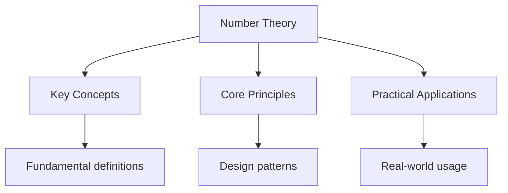

---

title: "Number Theory | Mathematics - Wyatt's Notes"
description: "UNIVERSITY Mathematics notes: Number Theory. Comprehensive study material with definitions, examples, and assessment tools."
date: 2026-04-24T00:00:00.000Z
tags:
  - Mathematics
  - University
categories:
  - Mathematics

---

<!-- Breadcrumb Schema for SEO -->

## 1. Divisibility

### 1.1 The Division Algorithm

**Theorem 1.1 (Division Algorithm).** For any integers $a$ and $b$ with $b > 0$There exist unique
Integers $q$ and $r$ such that $a = bq + r$ with $0 \leq r \lt b$.

_Proof._ Consider the set $S = \\{a - bk : k \in \mathbb{Z},\ a - bk \geq 0\\}$. This set is
non-empty (by the Archimedean property, choosing $k$ sufficiently negative). By the well-ordering
principle, $S$ has a least element $r = a - bq$. If $r \geq b$ Then $r - b = a - (q+1)b \in S$ with
$r - b \lt r$Contradicting minimality. So $0 \leq r \lt b$. For uniqueness, if
$a = bq_1 + r_1 = bq_2 + r_2$ Then $b(q_1 - q_2) = r_2 - r_1$. Since $|r_2 - r_1| \lt b$We must Have
$q_1 = q_2$ and $r_1 = r_2$. $\blacksquare$

### 1.2 Divisibility

We write $d \mid a$ (read "$d$ divides $a$") if there exists $k \in \mathbb{Z}$ with $a = dk$.

**Proposition 1.2.** For all $a, b, c \in \mathbb{Z}$:

1. If $a \mid b$ and $b \mid c$ Then $a \mid c$.
2. If $a \mid b$ and $a \mid c$ Then $a \mid (mb + nc)$ for all $m, n \in \mathbb{Z}$.
3. If $a \mid b$ and $b \neq 0$ Then $|a| \leq |b|$.
4. $a \mid 0$ for all $a$ But $0 \mid a$ only when $a = 0$.

_Proof._ (1) $a \mid b$ means $b = ak$ and $b \mid c$ means $c = b\ell = ak\ell$ So $a \mid c$. (2)
$a \mid b$ means $b = ak$ and $a \mid c$ means $c = a\ell$ So $mb + nc = a(mk + n\ell)$. (3)
$a \mid b$ means $b = ak$ So $|b| = |a| \cdot |k| \geq |a|$. (4) $0 = a \cdot 0$ So $a \mid 0$. If
$0 \mid a$ Then $a = 0 \cdot k = 0$. $\blacksquare$

### 1.3 Worked Examples of the Division Algorithm

**Problem.** Apply the division algorithm to write $-237 = 14q + r$ with $0 \leq r \lt 14$.

Solution

We compute $237 \div 14 = 16.93\ldots$ So $14 \cdot 16 = 224$ and $14 \cdot 17 = 238 > 237$. Thus for
positive $237$: $q = 16$, $r = 13$Giving $237 = 14 \cdot 16 + 13$.

For $a = -237$: we need $q$ such that $r = -237 - 14q$ satisfies $0 \leq r \lt 14$.
$-237 = 14(-17) + 1$: check $14 \cdot (-17) = -238$ And $-238 + 1 = -237$. Here $q = -17$ and $r = 1$
with $0 \leq 1 \lt 14$. $\blacksquare$

**Problem.** Find all integers $n$ such that $n \equiv 3 \pmod{7}$ and $n \equiv 2 \pmod{5}$.

Solution

From $n \equiv 3 \pmod{7}$We have $n = 7k + 3$ for some $k \in \mathbb{Z}$. Substituting into
$n \equiv 2 \pmod{5}$: $7k + 3 \equiv 2 \pmod{5}$ So $7k \equiv -1 \equiv 4 \pmod{5}$Giving
$2k \equiv 4 \pmod{5}$Hence $k \equiv 2 \pmod{5}$.

So $k = 5m + 2$ And $n = 7(5m + 2) + 3 = 35m + 17$. The solutions are $n \equiv 17 \pmod{35}$.
$\blacksquare$

### 1.4 Uniqueness of the Greatest Common Divisor

**Theorem 1.3.** Let $a, b \in \mathbb{Z}$Not both zero. The greatest common divisor of $a$ and $b$
Exists and is unique.

_Proof._ The set $D = \\{d \in \mathbb{N} : d \mid a \mathrm{\ and\ } d \mid b\\}"$ is non-empty since $|a| \in D$ (if $a \neq 0$) or $|b| \in D$ (if $b \neq 0$). By the well-ordering principle, $D$ has A least element $g$. We claim $g = \gcd(a, b)$. By definition $g \mid a$ and $g \mid b$. If $c \mid a$ And $c \mid b$ Then $c \leq |c| \leq g$ (since $g$ is the least positive common divisor). For Uniqueness: if $g_1$ and $g_2$ are both greatest common divisors, then $g_1 \mid g_2$ and $g_2 \mid g_1$ So $g_1 = g_2$ (since both are positive). $\blacksquare$

### 1.5 Least Common Multiple

**Definition.** The **least common multiple** of positive integers $a$ and $b$Written $\mathrm{lcm}(a, b)$Is the smallest positive integer $m$ such that $a \mid m$ and $b \mid m$.

**Theorem 1.4 (GCD--LCM Identity).** For all positive integers $a$ and $b$:

$$\gcd(a, b) \cdot \mathrm{lcm}(a, b) = ab$$

_Proof._ Write $a = \prod_{i=1}^k p_i^{\alpha_i}$ and $b = \prod_{i=1}^k p_i^{\beta_i}$ where $\alpha_i, \beta_i \geq 0$. Then $\gcd(a, b) = \prod_{i=1}^k p_i^{\min(\alpha_i, \beta_i)}$ and $\mathrm{lcm}(a, b) = \prod_{i=1}^k p_i^{\max(\alpha_i, \beta_i)}$. Since $\min(\alpha_i, \beta_i) + \max(\alpha_i, \beta_i) = \alpha_i + \beta_i$ for each $i$We have:

$$\gcd(a,b) \cdot \mathrm{lcm}(a,b) = \prod_{i=1}^k p_i^{\alpha_i + \beta_i} = ab \qquad \blacksquare$$

**Proposition 1.5.** For all positive integers $a, b$:

1. $\mathrm{lcm}(a, b) = ab / \gcd(a, b)$.
2. $\gcd(a, \mathrm{lcm}(b, c)) = \mathrm{lcm}(\gcd(a, b), \gcd(a, c))$.

### 1.6 Worked Example: LCM Computation

**Problem.** Compute $\mathrm{lcm}(252, 105)$ and verify the gcd--lcm identity.

Solution

First, $\gcd(252, 105)$. Using the Euclidean algorithm: $252 = 2 \cdot 105 + 42$, $105 = 2 \cdot 42 + 21$, $42 = 2 \cdot 21 + 0$. So $\gcd(252, 105) = 21$.

By the identity: $\mathrm{lcm}(252, 105) = 252 \cdot 105 / 21 = 252 \cdot 5 = 1260$.

Verification: $1260 / 252 = 5$ and $1260 / 105 = 12$Both integers. $\blacksquare$

### 1.7 Key Relationships

| Concept          | Definition                                           | Example                        |
| ---------------- | ---------------------------------------------------- | ------------------------------ |
| Division Alg     | $a = bq + r$, $0 \leq r < b$                         | $-237 = 14(-17) + 1$           |
| $\gcd(a,b)$      | Largest $d$ with $d\mid a$ and $d\mid b$             | $\gcd(252,105)=21$             |
| $\mathrm{lcm}$   | Smallest $m$ with $a\mid m$ and $b\mid m$            | $\mathrm{lcm}(252,105)=1260$   |
| Euclidean Alg    | Repeated division to find $\gcd$                     | $252 = 2\cdot105 + 42$, ...    |
| Bezout's Identity| $\exists x,y: ax + by = \gcd(a,b)$                   | $252x + 105y = 21$             |

### 1.8 Common Pitfalls

- **Forgetting the remainder must be non-negative.** For negative $a$, the division algorithm still
  requires $0 \leq r < b$, which may mean $q$ is not $a/b$ (e.g., $-7 = (-2)(4) + 1$, not $(-1.75)(4)$).
- **Confusing "divides" with divisibility by zero.** $a \mid 0$ is true for all $a \neq 0$, but
  $0 \mid a$ is false unless $a = 0$ itself.
- **Assuming gcd and lcm are defined for negative numbers.** The gcd is always taken as positive;
  $\gcd(a,b) = \gcd(|a|,|b|)$.
- **Thinking the gcd-lcm identity works for more than two numbers.** For three numbers,
  $\gcd(a,b,c) \cdot \mathrm{lcm}(a,b,c) \neq abc$ for three or more numbers (e.g., $\gcd(2,3,4) = 1$ but $\mathrm{lcm}(2,3,4) = 12$, and $1 \cdot 12 = 12 \neq 24$).

### 1.9 Applications

- **Cryptography:** RSA encryption relies on the fact that computing $\gcd$ is easy (Euclidean
  algorithm) but factoring large numbers is hard. The Carmichael function $\lambda(n)$ depends on
  lcm of prime-power factors.
- **Scheduling:** The lcm determines when periodic events coincide. If bus A runs every 12 minutes
  and bus B every 18 minutes, they coincide every $\mathrm{lcm}(12,18) = 36$ minutes.
- **Computer arithmetic:** The Euclidean algorithm efficiently computes modular inverses used in
  the extended Euclidean algorithm for RSA key generation.
- **Diophantine equations:** The linear Diophantine equation $ax + by = c$ has integer solutions iff
  $\gcd(a,b) \mid c$, and the solutions are parameterised by the lcm-related step size.

## Intuition

Number theory is the study of whole numbers and their hidden patterns. The integers behave like atoms for arithmetic: every integer greater than $1$ factors uniquely into primes, making primes the fundamental building blocks. The Euclidean algorithm is a simple but deep idea: repeated division produces the greatest common divisor, and the process terminates because remainders strictly decrease. Modular arithmetic wraps the integers into a finite circle — like a clock — where only remainders matter. Bezout's identity reveals that the gcd of two numbers is the smallest positive combination of them, connecting division to linear algebra over the integers.

## Cross-References

- **[Groups](1-abstract-algebra/1_groups)**: The integers under addition form a group, and modular arithmetic arises from quotient groups.
- **[Rings](1-abstract-algebra/8_rings)**: The integers form a Euclidean domain, and polynomial rings share analogous factorisation properties.
- **[Field Theory](1-abstract-algebra/12_field-theory)**: Finite fields are constructed from prime powers, and field extensions underpin algebraic number theory.
