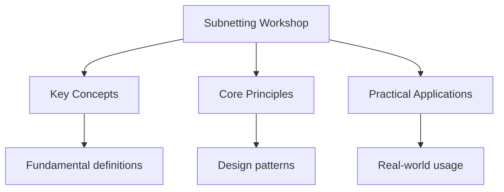

---

date: 2026-07-23T21:57:32+01:00
title: "Subnetting Workshop | Networking"
description: "Subnetting Workshop notes covering key definitions, core concepts, worked examples, and practice questions for targeted exam preparation and revision."
tags:
  - Networking
categories:
  - Networking
---

<!-- Breadcrumb Schema for SEO -->
<script type="application/ld+json">
{
  "@context": "https://schema.org",
  "@type": "BreadcrumbList",
  "itemListElement": [{"name": "Home", "url": "https://wyattau.com"}, {"name": "networking", "url": "https://networking.wyattau.com"}, {"name": "02 Ip Addressing", "url": "https://networking.wyattau.com/02-ip-addressing"}, {"name": "Subnetting Workshop", "url": "https://networking.wyattau.com/02-ip-addressing/subnetting-workshop"}]
}
</script>

## Overview

Subnetting is the process of dividing a single IP network into smaller, more manageable
Sub-networks. Every systems engineer needs fluency in subnetting -- it is non-negotiable for network
Design, troubleshooting, firewall rule authoring, and certification exams. This workshop covers the
Binary method, VLSM, route summarization, wildcard masks, IPv6 subnetting, and a systematic approach
To subnet planning.

The core skill is answering this question: given a network and a requirement, find the subnet mask,
Network address, broadcast address, and usable host range. This document provides the method,
Practice, and reference material to develop that skill.

## Binary Method: Step by Step

The binary method is the most reliable approach to subnetting because it works for every problem
Type. Decimal tricks break down at edge cases; binary does not.

### The Subnet Mask in Binary

A subnet mask is a 32-bit number where the leftmost bits (the network portion) are all 1s and the
Rightmost bits (the host portion) are all 0s. The boundary between 1s and 0s is the subnet boundary.

```
/24 mask:  11111111.11111111.11111111.00000000   = 255.255.255.0
/25 mask:  11111111.11111111.11111111.10000000   = 255.255.255.128
/26 mask:  11111111.11111111.11111111.11000000   = 255.255.255.192
/27 mask:  11111111.11111111.11111111.11100000   = 255.255.255.224
/28 mask:  11111111.11111111.11111111.11110000   = 255.255.255.240
/29 mask:  11111111.11111111.11111111.11111000   = 255.255.255.248
/30 mask:  11111111.11111111.11111111.11111100   = 255.255.255.252
/32 mask:  11111111.11111111.11111111.11111111   = 255.255.255.255
```

### Step-by-Step Method

Given: IP address `10.4.220.75` and prefix length `/26`. Find network address, broadcast address,
First host, last host, and total usable hosts.

**Step 1: Convert the IP address to binary.**

```
10    = 00001010
4     = 00000100
220   = 11011100
75    = 01001011
```

So `10.4.220.75` = `00001010.00000100.11011100.01001011`

**Step 2: Write the subnet mask in binary.**

`/26` means the first 26 bits are the network portion:

```
11111111.11111111.11111111.11000000
```

**Step 3: Apply the mask (bitwise AND) to find the network address.**

```
IP:      00001010.00000100.11011100.01001011
Mask:    11111111.11111111.11111111.11000000
AND:     00001010.00000100.11011100.01000000
```

Convert back to decimal: `10.4.220.64`

**Step 4: Find the broadcast address.**

Set all host bits to 1:

```
Network: 00001010.00000100.11011100.01000000
Host bits:                          ^^^^^^
Broadcast: 00001010.00000100.11011100.01111111
```

Convert back to decimal: `10.4.220.127`

**Step 5: Determine first and last usable hosts.**

```
First host = network address + 1   = 10.4.220.65
Last host  = broadcast address - 1 = 10.4.220.126
```

**Step 6: Calculate total usable hosts.**

Host bits = $32 - 26 = 6$. Total addresses = $2^6 = 64$. Usable = $64 - 2 = 62$.

:::tip
`/31` (RFC 3021, point-to-point links, 2 usable) and `/32` (single host, 1 usable). Modern practice
Also uses `/31` for network equipment links per RFC 6164.

### Verifying with a Shortcut

For the octet where the boundary falls, the "magic number" is $256 - \mathrm{mask\_octet$. For
`/26`The mask in the fourth octet is `192`So the magic number is $256 - 192 = 64$. Subnets start At
multiples of 64: `.0``.64``.128``.192`. Our IP `.75` falls in the `.64` subnet.

This shortcut works because the boundary octet always has a value that is a power of 2 (or 256 minus
A power of 2).

## VLSM (Variable-Length Subnet Masking)

### Why Classful Is Wasteful

Classful addressing (fixed `/8``/16``/24`) wastes enormous amounts of address space. Consider an
Organization with these requirements:

| Segment    | Hosts Needed |
| ---------- | ------------ |
| Datacenter | 200          |
| Office A   | 50           |
| Office B   | 25           |
| WAN links  | 2 each (x4)  |
| Management | 10           |

With classful addressing, you need one `/24` (254 hosts) for the datacenter (wastes 54), three more
`/24`S for the offices and management (wastes hundreds more), and four `/24`S for WAN links (wastes
252 each). That is 8 `/24`S for a problem that needs far fewer addresses.

VLSM allows you to use different subnet masks for different segments, matching each mask to the
Actual host requirement.

### VLSM Design Process

**Step 1: List all segments with host requirements, sorted largest to smallest.**

| Segment    | Hosts | Minimum host bits               |
| ---------- | ----- | ------------------------------- |
| Datacenter | 200   | 8 ($2^8 - 2 = 254$)             |
| Office A   | 50    | 6 ($2^6 - 2 = 62$)              |
| Office B   | 25    | 5 ($2^5 - 2 = 30$)              |
| Management | 10    | 4 ($2^4 - 2 = 14$)              |
| WAN 1      | 2     | 2 ($2^2 - 2 = 2$Or `/31` for 2) |
| WAN 2      | 2     | 2                               |
| WAN 3      | 2     | 2                               |
| WAN 4      | 2     | 2                               |

**Step 2: Allocate from the largest block down.**

Starting from `172.16.0.0/16`:

```
Datacenter:  172.16.0.0/24     (256 addresses, 254 usable)
Office A:    172.16.1.0/26     (64 addresses, 62 usable)
Office B:    172.16.1.64/27    (32 addresses, 30 usable)
Management:  172.16.1.96/28    (16 addresses, 14 usable)
WAN 1:       172.16.1.112/31   (2 addresses, 2 usable)  [RFC 3021]
WAN 2:       172.16.1.114/31   (2 addresses, 2 usable)
WAN 3:       172.16.1.116/31   (2 addresses, 2 usable)
WAN 4:       172.16.1.118/31   (2 addresses, 2 usable)
```

**Step 3: Verify no overlaps.**

Every allocation must be verified against all others. The boundary addresses must align to the
Subnet size.
:::
:::caution
Then try to allocate `172.16.1.32/27`That overlaps because `.32` falls inside the `/26` range.
Always allocate from the next available address after the previous allocation ends.

### Address Planning Best Practices

1. **Leave room for growth.** If you need 25 hosts, do not use `/27` (30 usable). Use `/26` (62
   usable) if address space permits. Growth always happens.
2. **Document every allocation.** Maintain an IPAM (IP Address Management) system. A spreadsheet is
   the minimum.
3. **Reserve blocks for future use.** Set aside a `/22` or `/23` that is not allocated to anything.
   When you need a new subnet, you have it ready.
4. **Use consistent patterns.** All point-to-point links get `/31`. All VLANs get at least `/24`.
   Consistency reduces errors.
5. **Consider summarization.** Allocating contiguous address blocks enables route summarization,
   which reduces routing table size.

## Worked Examples

### Example 1: Given Network and Required Hosts

**Problem:** You are given `192.168.10.0/24` and need to create a subnet with at least 40 hosts.
Find the subnet mask, network address, broadcast address, first host, last host, and usable host
Count.

**Solution:**

Hosts needed: 40. Minimum host bits: $2^6 - 2 = 62 \ge 40$. So 6 host bits, meaning prefix =
$32 - 6 = /26$.

```
Subnet mask: 255.255.255.192
Magic number: 256 - 192 = 64

Subnets of 192.168.10.0/24 with /26:
  192.168.10.0/26     (hosts: .1 through .62, broadcast: .63)
  192.168.10.64/26    (hosts: .65 through .126, broadcast: .127)
  192.168.10.128/26   (hosts: .129 through .190, broadcast: .191)
  192.168.10.192/26   (hosts: .193 through .254, broadcast: .255)
```

Use the first subnet:

```
Network:    192.168.10.0
First host: 192.168.10.1
Last host:  192.168.10.62
Broadcast:  192.168.10.63
Mask:       255.255.255.192
Usable:     62
```

### Example 2: Given Hosts, Find Network and Broadcast

**Problem:** A host has IP `172.16.5.150` with mask `255.255.255.224`. What is the network address
And broadcast address?

**Solution:**

Mask `255.255.255.224` = `/27`. Magic number = $256 - 224 = 32$. Subnets start at multiples of 32:
`.0``.32``.64``.96``.128``.160``.192``.224`.

`.150` falls between `.128` and `.160`So:

```
Network:    172.16.5.128
Broadcast:  172.16.5.159
First host: 172.16.5.129
Last host:  172.16.5.158
Usable:     30
```

### Example 3: Multiple Subnets from One Network

**Problem:** Divide `10.0.0.0/16` into 8 equal subnets. For each, provide the network address,
Broadcast address, and usable range.

**Solution:**

8 subnets require 3 subnet bits ($2^3 = 8$). New prefix = $16 + 3 = /19$.

Magic number in the third octet: $256 - 224 = 32$ (since `/19` mask third octet = `11100000` = 224).

```
Subnet 1: 10.0.0.0/19     Broadcast: 10.0.31.255   Hosts: 10.0.0.1 - 10.0.31.254
Subnet 2: 10.0.32.0/19    Broadcast: 10.0.63.255   Hosts: 10.0.32.1 - 10.0.63.254
Subnet 3: 10.0.64.0/19    Broadcast: 10.0.95.255   Hosts: 10.0.64.1 - 10.0.95.254
Subnet 4: 10.0.96.0/19    Broadcast: 10.0.127.255  Hosts: 10.0.96.1 - 10.0.127.254
Subnet 5: 10.0.128.0/19   Broadcast: 10.0.159.255  Hosts: 10.0.128.1 - 10.0.159.254
Subnet 6: 10.0.160.0/19   Broadcast: 10.0.191.255  Hosts: 10.0.160.1 - 10.0.191.254
Subnet 7: 10.0.192.0/19   Broadcast: 10.0.223.255  Hosts: 10.0.192.1 - 10.0.223.254
Subnet 8: 10.0.224.0/19   Broadcast: 10.0.255.255  Hosts: 10.0.224.1 - 10.0.255.254
```

Each subnet has 13 host bits: $2^{13} - 2 = 8190$ usable hosts.

### Example 4: Minimum Subnet Size for N Hosts

**Problem:** You need subnets for 500, 100, 30, and 5 hosts from `192.168.0.0/22`. Design the VLSM
Scheme.

**Solution:**

`192.168.0.0/22` = `192.168.0.0` through `192.168.3.255` (1024 addresses).

| Requirement | Hosts | Host bits | Prefix | Subnet mask     | Addresses | Usable |
| ----------- | ----- | --------- | ------ | --------------- | --------- | ------ |
| 500 hosts   | 500   | 9         | /23    | 255.255.254.0   | 512       | 510    |
| 100 hosts   | 100   | 7         | /25    | 255.255.255.128 | 128       | 126    |
| 30 hosts    | 30    | 5         | /27    | 255.255.255.224 | 32        | 30     |
| 5 hosts     | 5     | 3         | /29    | 255.255.255.248 | 8         | 6      |

Allocation (largest first):

```
500 hosts: 192.168.0.0/23     (covers .0.0 through .1.255)
100 hosts: 192.168.2.0/25     (covers .2.0 through .2.127)
30 hosts:  192.168.2.128/27   (covers .2.128 through .2.159)
5 hosts:   192.168.2.160/29   (covers .2.160 through .2.167)
```

Remaining: `192.168.2.168` through `192.168.3.255` for future use.

## Route Summarization (Supernetting)

### Concept

Route summarization (also called route aggregation or supernetting) is the reverse of subnetting.
Instead of splitting one network into many, you combine multiple networks into a single
Advertisement. This reduces routing table size and hides topology changes.

### Method

**Problem:** Summarize `192.168.16.0/24``192.168.17.0/24``192.168.18.0/24`And `192.168.19.0/24`.

**Step 1:** Convert the third octets to binary:

```
16 = 00010000
17 = 00010001
18 = 00010010
19 = 00010011
```

**Step 2:** Find the common bits from left to right:

```
0001|0000
0001|0001
0001|0010
0001|0011
     ^^^^
```

The first 6 bits of the third octet are identical (`000100`). That means the summary covers the
Third octet range where those 6 bits are fixed and the remaining 2 bits vary: `000100xx` = 16
Through 19.

**Step 3:** Calculate the summary prefix:

Original prefix `/24` + 6 common bits in third octet = `/22`.

```
Summary: 192.168.16.0/22
```

This covers `192.168.16.0` through `192.168.19.255`.

### Verifying the Summary

The summary `192.168.16.0/22` covers addresses from `192.168.16.0` to `192.168.19.255`. The range is
$2^{10} = 1024$ addresses (4 `/24`S).

To verify: the network address is the first address, and the broadcast is the last. For `/22`The
Third octet magic number is $256 - 252 = 4$ (mask = `11111100` = 252). Subnets start at multiples of
4 in the third octet: `.0``.4``.8`..., `.16``.20`...

Our summary starts at `.16` and covers `.16``.17``.18``.19` -- correct.

### Longest Prefix Match

When a router has both a specific route and a summary route, it uses the **longest prefix match**
Rule. For example:

```
192.168.16.0/22  via Router A
192.168.17.0/24  via Router B
```

Traffic to `192.168.17.5` matches both routes, but `/24` is longer (more specific) than `/22`So The
router sends it via Router B. Traffic to `192.168.18.5` only matches `/22`So it goes via Router A.
:::
:::note
Entry with the longest matching prefix. If there are multiple entries with the same prefix length,
The one with the lowest administrative distance wins. If there is still a tie, ECMP (Equal-Cost
Multi-Path) load balancing is used.

### When Summarization Fails

Summarization only works when the networks being summarized are contiguous and aligned to the
Summary boundary. If you have `192.168.16.0/24` and `192.168.20.0/24`You cannot create a single
Clean summary because the range 17-19 is missing. Attempting to summarize to `/21`
(`192.168.16.0/21`) would include addresses you do not control, potentially creating a black hole.

## Wildcard Masks

### What They Are

A wildcard mask is the **inverse** of a subnet mask. Where the subnet mask has 1s, the wildcard mask
Has 0s, and vice versa. Wildcard masks are used in ACLs (Access Control Lists) on Cisco and other
Network equipment.

```
Subnet mask:   255.255.255.0   = 11111111.11111111.11111111.00000000
Wildcard mask: 0.0.0.255       = 00000000.00000000.00000000.11111111
```

### Quick Conversion

```
Subnet mask to wildcard: subtract each octet from 255
  255.255.255.192 -> 0.0.0.63
  255.255.255.224 -> 0.0.0.31
  255.255.255.240 -> 0.0.0.15
  255.255.255.248 -> 0.0.0.7
  255.255.255.252 -> 0.0.0.3
  255.255.255.254 -> 0.0.0.1
```

### ACL Examples

```text
! Permit traffic from 192.168.10.0/24
access-list 10 permit 192.168.10.0 0.0.0.255

! Permit traffic from 10.0.0.0/8
access-list 10 permit 10.0.0.0 0.255.255.255

! Permit a single host
access-list 10 permit 192.168.1.5 0.0.0.0

! Permit 172.16.4.0/22 (network and broadcast)
access-list 10 permit 172.16.4.0 0.0.3.255

! Deny odd-numbered /24 subnets in 192.168.0.0/16
! 0 = 00000000, 1 = 00000001
! We want to match where the last bit of the 3rd octet is 1
! Wildcard for 3rd octet: 00000001 = 1, with value check = 0
access-list 10 deny 192.168.0.0 0.0.254.255
```
:::
:::caution
Errors. Always double-check by verifying: `subnet_mask + wildcard_mask = 255.255.255.255` for each
Octet.

### Host Bits in Wildcard Masks

The wildcard mask `0.0.0.255` means "match the first three octets exactly, and don"t care about the
Fourth." The bits that are 0 must match exactly; the bits that are 1 can be anything.

More nuanced example: wildcard `0.0.3.255` on `172.16.4.0`:

```
Network:  172.16.00000100.xxxxxxxx
Wildcard:  0.  0.00000011.11111111
```

The third octet can be `00000100` through `00000111` (4 through 7), and the fourth octet can be
Anything. This matches `172.16.4.0/22` exactly.

## IPv6 Subnetting

### Subnetting a /48

The standard enterprise IPv6 allocation from a RIR (Regional Internet Registry) is a `/48`. The RFC
6177 recommendation is to give each site a `/48`. Within a site, you subnet the `/48` into `/64`S
For individual LAN segments.

A `/48` gives you $2^{16} = 65536$ possible `/64` subnets. That is not a typo. You will not run out.

### Binary Breakdown

```
IPv6 address:  128 bits total
/48 prefix:    48 bits network
/64 subnet:    16 bits subnet ID within the site
/128 host:     64 bits interface ID
```

```
|<---------- 48 bits ---------->|<---- 16 bits ---->|<------- 64 bits ------->|
|         Global prefix         |   Subnet ID       |     Interface ID       |
```

### Example: Subnetting a /48 into /64s

Given: `2001:db8:abcd::/48`

The subnet ID occupies bits 49-64 (the 4th and 5th hextets in this case):

```
2001:0db8:abcd:0000::/64   Subnet 0
2001:0db8:abcd:0001::/64   Subnet 1
2001:0db8:abcd:0002::/64   Subnet 2
...
2001:0db8:abcd:ffff::/64   Subnet 65535
```

### Structured Subnet Allocation

Rather than allocating sequentially, use a structured scheme that allows route summarization:

```
2001:db8:abcd:0000::/60   Datacenter (16 /64s: 0000-000f)
2001:db8:abcd:0010::/60   Office A   (16 /64s: 0010-001f)
2001:db8:abcd:0020::/60   Office B   (16 /64s: 0020-002f)
2001:db8:abcd:0030::/60   WAN links  (16 /64s: 0030-003f)
2001:db8:abcd:0040::/60   Reserved   (16 /64s: 0040-004f)
...
```

Within the datacenter `/60`:

```
2001:db8:abcd:0000::/64   Management network
2001:db8:abcd:0001::/64   Compute VLAN A
2001:db8:abcd:0002::/64   Compute VLAN B
2001:db8:abcd:0003::/64   Storage network
2001:db8:abcd:0004::/64   Backup network
```

### SLAAC vs DHCPv6

| Feature            | SLAAC (RFC 4862)                                | DHCPv6                |
| ------------------ | ----------------------------------------------- | --------------------- |
| Address assignment | Host generates from prefix                      | Server assigns        |
| Privacy            | EUI-64 exposes MAC; RFC 7217 adds randomization | Can assign random     |
| Control            | Stateless                                       | Stateful or stateless |
| DNS                | Requires RDNSS (RFC 8106)                       | DHCPv6 provides       |
| State tracking     | Server does not know assignments                | Server tracks leases  |
| Address stability  | Stable based on prefix + MAC                    | Depends on lease time |
| Complexity         | Simple                                          | Requires DHCPv6 infra |
:::
:::note
Integration) and SLAAC with privacy extensions (RFC 7217) for client devices (simplicity, privacy).

### IPv6 Subnetting Rules

1. **All LAN segments must be `/64`.** This is not a suggestion. RFC 7421 explains why: many IPv6
   features (NDP, SLAAC, EUI-64) assume `/64`. Do not subnet a LAN to `/112` or `/120` just because
   you think you will not need 2^64 addresses. The address space is vast; use it as designed.
2. **Point-to-point links should also be `/64`.** Unlike IPv4 where you use `/31` or `/32`IPv6
   point-to-point links get a full `/64`. There is no address scarcity.
3. **Loopback addresses are `/128`.** The loopback `::1/128` is a single address, not a subnet.

## Subnetting Quick Reference

### Powers of 2

| $2^n$    | Value  |
| -------- | ------ |
| $2^0$    | 1      |
| $2^1$    | 2      |
| $2^2$    | 4      |
| $2^3$    | 8      |
| $2^4$    | 16     |
| $2^5$    | 32     |
| $2^6$    | 64     |
| $2^7$    | 128    |
| $2^8$    | 256    |
| $2^9$    | 512    |
| $2^{10}$ | 1,024  |
| $2^{11}$ | 2,048  |
| $2^{12}$ | 4,096  |
| $2^{13}$ | 8,192  |
| $2^{14}$ | 16,384 |
| $2^{15}$ | 32,768 |
| $2^{16}$ | 65,536 |

### Subnet Masks: /24 Through /30

| Prefix | Mask            | Wildcard  | Magic # | Addresses | Usable |
| ------ | --------------- | --------- | ------- | --------- | ------ |
| /24    | 255.255.255.0   | 0.0.0.255 | 256     | 256       | 254    |
| /25    | 255.255.255.128 | 0.0.0.127 | 128     | 128       | 126    |
| /26    | 255.255.255.192 | 0.0.0.63  | 64      | 64        | 62     |
| /27    | 255.255.255.224 | 0.0.0.31  | 32      | 32        | 30     |
| /28    | 255.255.255.240 | 0.0.0.15  | 16      | 16        | 14     |
| /29    | 255.255.255.248 | 0.0.0.7   | 8       | 8         | 6      |
| /30    | 255.255.255.252 | 0.0.0.3   | 4       | 4         | 2      |
| /31    | 255.255.255.254 | 0.0.0.1   | 2       | 2         | 2\*    |
| /32    | 255.255.255.255 | 0.0.0.0   | 1       | 1         | 1      |

\*`/31` per RFC 3021: no network/broadcast, both addresses usable.

### Extended Reference: /16 Through /23

| Prefix | Mask          | Wildcard    | Magic # | Addresses | Usable |
| ------ | ------------- | ----------- | ------- | --------- | ------ |
| /16    | 255.255.0.0   | 0.0.255.255 | 256     | 65,536    | 65,534 |
| /17    | 255.255.128.0 | 0.0.127.255 | 128     | 32,768    | 32,766 |
| /18    | 255.255.192.0 | 0.0.63.255  | 64      | 16,384    | 16,382 |
| /19    | 255.255.224.0 | 0.0.31.255  | 32      | 8,192     | 8,190  |
| /20    | 255.255.240.0 | 0.0.15.255  | 16      | 4,096     | 4,094  |
| /21    | 255.255.248.0 | 0.0.7.255   | 8       | 2,048     | 2,046  |
| /22    | 255.255.252.0 | 0.0.3.255   | 4       | 1,024     | 1,022  |
| /23    | 255.255.254.0 | 0.0.1.255   | 2       | 512       | 510    |

## Common Exam-Style Problems

### Problem 1

**Q:** What is the last usable host address on the subnet containing `10.150.75.201/27`?

**A:** `/27` has magic number 32. Multiples of 32: ..., 64, 96, 128, 160, 192. The IP `.201` falls
In the `.192` subnet.

```
Network:    10.150.75.192
Broadcast:  10.150.75.223
Last host:  10.150.75.222
```

### Problem 2

**Q:** How many usable subnets does `172.16.0.0/21` create from `172.16.0.0/16`?

**A:** The original prefix is `/16`The new prefix is `/21`. Subnet bits = $21 - 16 = 5$. Number of
Subnets = $2^5 = 32$. Each subnet has $32 - 21 = 11$ host bits, giving $2^{11} - 2 = 2046$ usable
Hosts.

### Problem 3

**Q:** You need to summarize `10.1.0.0/16``10.2.0.0/16``10.3.0.0/16`And `10.4.0.0/16`. What is The
summary?

**A:** Convert second octets to binary:

```
1 = 00000001
2 = 00000010
3 = 00000011
4 = 00000100
```

Common bits from left: only `00000` (5 bits) are shared by all four. Wait -- let me recheck.

```
00000001
00000010
00000011
00000100
```

Bits from left: `00000` are common to all (5 bits). The 6th bit varies (0, 0, 0, 1). So the summary
Prefix is $8 + 5 = /13`.

Summary: `10.0.0.0/13`

This covers `10.0.0.0` through `10.7.255.255`. It includes more than the four specified networks (it
Also covers 5, 6, 7). If you only want to summarize exactly those four, you need multiple summary
Routes or accept the over-summarization.
:::
:::caution
A single prefix without including `10.0``10.5``10.6`And `10.7`. If the question requires an Exact
summary, the answer is: it cannot be done with a single prefix.

### Problem 4

**Q:** Convert the wildcard mask `0.0.255.255` to a subnet mask and prefix length.

**A:** Invert each octet from 255:

```
255 - 0 = 255
255 - 0 = 255
255 - 255 = 0
255 - 255 = 0
```

Subnet mask: `255.255.0.0` = `/16`.

### Problem 5

**Q:** A `/26` subnet contains the host `192.168.100.180`. What is the network address?

**A:** Magic number for `/26` = 64. Multiples of 64: 0, 64, 128, 192. The IP `.180` falls between
128 and 192, so the network address is `192.168.100.128/26`.

## Subnet Planning Methodology for Enterprise Networks

### Step 1: Inventory

Document every location, every VLAN, every point-to-point link, and every special requirement (DMZ,
Management, load balancer VIPs, anycast, etc.). Get actual host counts, not guesses. Query your
Monitoring system, CMDB, or do a physical walkthrough.

### Step 2: Assign Blocks by Region/Site

Allocate a large block to each major site or region. This enables summarization at WAN aggregation
Points.

```
10.0.0.0/8
  10.1.0.0/16    Headquarters
  10.2.0.0/16    Datacenter
  10.3.0.0/16    Office A (New York)
  10.4.0.0/16    Office B (London)
  10.5.0.0/16    Office C (Tokyo)
  10.250.0.0/16  VPN clients
  10.254.0.0/16  Management (out-of-band)
  10.255.0.0/16  Reserved / future
```

### Step 3: Subnet Within Each Site

Within each site's `/16`Allocate subnets using VLSM:

```
10.1.0.0/16  (Headquarters)
  10.1.0.0/24     VLAN 10 - Servers
  10.1.1.0/24     VLAN 11 - Workstations
  10.1.2.0/24     VLAN 12 - Printers/IoT
  10.1.3.0/24     VLAN 13 - Guest WiFi
  10.1.4.0/24     VLAN 14 - VoIP
  10.1.5.0/24     VLAN 15 - DMZ
  10.1.10.0/24    VLAN 20 - Management
  10.1.254.0/24   Point-to-point links (/31 pairs)
  10.1.255.0/24   Anycast services
```

### Step 4: Document and Automate

- Use an IPAM tool (NetBox, phpIPAM, Infoblox) to track allocations
- Store allocations in version control (Terraform state, Ansible inventory)
- Automate assignment where possible (cloud VPC subnets, container networking)
- Set up monitoring for address utilization (alert at 80% utilization)

### Step 5: Plan for Growth

- Never allocate more than 60-70% of available space immediately
- Reserve the top 10-20% of each block for future use
- Reclaim abandoned allocations annually
- Plan for acquisitions and mergers (maintain non-overlapping address space)

## Common Pitfalls

### 1. Off-by-One Errors

The most common subnetting mistake is counting the network or broadcast address as a usable host.
The first usable host is `network + 1`. The last usable host is `broadcast - 1`. The exception is
`/31` (RFC 3021), where both addresses are usable.

### 2. Confusing CIDR Notation with Host Bits

`/26` means 26 network bits and $32 - 26 = 6$ host bits, NOT 26 host bits. If you need 100 hosts,
You need at least 7 host bits ($2^7 - 2 = 126$), which means a `/25` mask, not a `/26`.

### 3. Overlapping Subnets

When assigning subnets manually, it is easy to create overlaps. Always verify that the network
Address of a new subnet does not fall within the range of any existing subnet. IPAM tools prevent
This automatically.

### 4. Ignoring Gateway Addresses

Remember to account for the default gateway when counting usable hosts. If you need 30 end hosts,
You actually need 31 addresses (30 hosts + 1 gateway), which means you need a `/27` (30 usable). But
`/27` gives you exactly 30 usable addresses, which is cutting it too close. Use `/26` (62 usable)
For 30 hosts.

### 5. Not Planning for Anycast and VIPs

Anycast services (DNS resolvers, load balancers, NTP) need the same IP address in multiple subnets.
VIPs for load balancers also consume addresses. Plan for these upfront.

### 6. Using Non-Aligned Subnet Boundaries

If you try to create a `/25` starting at `192.168.1.128`That works (aligned to 128). But a `/25`
Starting at `192.168.1.64` does NOT work -- 64 is not a valid `/25` boundary. `/25` boundaries are
At multiples of 128.

### 7. Forgetting About Point-to-Point Links

Point-to-point WAN links between routers consume a subnet. Four links with `/30` masks use 4 subnets
(16 addresses, 8 usable). With `/31` (RFC 3021), you use 4 subnets (8 addresses, 8 usable). Plan for
These.

### 8. IPv6 Misconceptions

The most common IPv6 subnetting error is trying to use non-`/64` masks on LAN segments. SLAAC, NDP
Autoconfiguration, and many implementations assume `/64`. Use `/64` for everything, and `/128` only
For loopbacks and specific host routes.
:::
:::tip
After you have mastered the fundamentals.

## Subnetting for Container and Cloud Environments

### Docker Networking

Docker creates private networks with subnets that you can specify:

```bash
## Create a custom bridge network with a specific subnet
docker network create \
  --subnet=172.18.0.0/16 \
  --gateway=172.18.0.1 \
  my-network

## Run containers on this network
docker run --network my-network --ip 172.18.0.10 nginx
docker run --network my-network --ip 172.18.0.11 redis
```

Default Docker networks use `172.17.0.0/16` (bridge), and each additional custom network gets the
Next available `/16` from `172.18.0.0/16``172.19.0.0/16`Etc. Be aware of potential overlap with Your
existing infrastructure when choosing Docker subnets.

### Kubernetes Networking

Kubernetes requires a CIDR range for pod IPs and another for service IPs:

```bash
# kubeadm init with custom pod and service CIDRs
kubeadm init \
  --pod-network-cidr=10.244.0.0/16 \
  --service-cidr=10.96.0.0/12
```

Each node gets a `/24` from the pod CIDR (with 254 usable IPs per node). Ensure the pod CIDR is
Large enough for your maximum node count. For 100 nodes, you need at least a `/16` (256 `/24`
Subnets).

### AWS VPC Subnet Design

AWS VPCs use CIDR blocks between `/16` and `/28`. Each subnet must be within the VPC CIDR:

```text
VPC: 10.0.0.0/16 (65,536 addresses)
  Public subnet A:  10.0.0.0/24   (AZ-a, 254 usable)
  Public subnet B:  10.0.1.0/24   (AZ-b, 254 usable)
  Private subnet A: 10.0.4.0/22   (AZ-a, 1,022 usable)
  Private subnet B: 10.0.8.0/22   (AZ-b, 1,022 usable)
```

AWS reserves 5 addresses per subnet (network, VPC router, DNS server, future use, broadcast). Plan
Accordingly.
:::
:::caution
In standard networking, but only 251 in AWS (5 reserved, not 2). Always subtract 5, not 2.




## Summary

This topic covers the essential concepts and techniques related to subnetting workshop, including
key principles and practical applications.

**Key concepts include:**

- core concepts and definitions
- key principles and frameworks
- practical applications
- common techniques and methods
- evaluation and critical analysis

A thorough understanding of these concepts, combined with regular practice and review, is essential
for mastery of this topic.
:::

## Intuition

Subnetting is dividing a network into smaller, manageable pieces. Think of an IP address as a street address: the network portion is the street name, and the host portion is the house number. A subnet mask determines which bits are the street name and which are the house number. CIDR notation (like /24) is a shorthand for the mask length. Subnetting lets you allocate addresses efficiently, reduce broadcast domains, and isolate network segments for security.

## Cross-References

- [IP Addressing](ip-addressing)
- [TCP and UDP](/networking/03-tcp-udp/tcp-and-udp)
- [Layer 2 and Ethernet](../08-layer2/layer2-and-ethernet)
